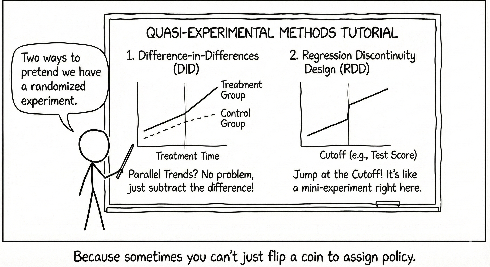

This tutorial focuses on two widely-used quasi-experimental methods: *Difference-in-Differences (DID)* and *Regression Discontinuity Design (RDD)*. 

Both methods exploit specific features of the data-generating process to identify causal effects under particular assumptions. We will cover:

1. The conceptual foundations and mathematical formulations of each method
2. Key assumptions and validity checks
3. Practical implementation in R with real and simulated data
4. Causal methods summary

Through two examples: one examining the impact of in-person instruction during COVID-19 on student achievement, and another replicating a study on ethnic studies curricula, this tutorial will demonstrate how these methods can provide "as good as randomized" causal estimates when properly applied.



## 1. Difference-in-Differences (DID)

### 1.1 Conceptual Overview

Difference-in-Differences is a quasi-experimental design that estimates causal effects by comparing the change in outcomes over time between a treatment group and a comparison group. The method exploits variation in both the cross-sectional (who receives treatment) and temporal (when treatment occurs) dimensions.

**Intuition:**

The insight of DID is that by comparing changes over time, we can difference away time-invariant confounders that might bias simple cross-sectional comparisons. Similarly, by comparing treatment and control groups, we difference away common time trends that affect both groups equally.

Consider a simple $2 \times 2$ DID setup:

- **Treatment group**: Receives intervention at time $t=1$ (but not at $t=0$)
- **Control group**: Never receives intervention
- **Pre-period**: $t=0$ (before treatment)
- **Post-period**: $t=1$ (after treatment)

Let $Y_{it}(1)$ denote the potential outcome for unit $i$ at time $t$ if treated, and $Y_{it}(0)$ if untreated. The treatment effect for the treated group at time $t=1$ is:

$$\tau = E[Y_{i1}(1) - Y_{i1}(0) | D_i = 1]$$

where $D_i = 1$ indicates treatment group membership. The challenge is that we never observe $Y_{i1}(0)$ for treated units—the counterfactual outcome had they not been treated.


```{r didviz, message=FALSE, warning=FALSE, echo=FALSE, fig.width=7, fig.height=5}
library(ggplot2)
library(dplyr)

conceptual_data <- data.frame(
  time = rep(c(0, 1), each = 2),
  group = rep(c("Control", "Treatment"), 2),
  outcome = c(
    2.0,  # Control, pre
    2.5,  # Treatment, pre (higher baseline)
    2.3,  # Control, post (natural trend +0.3)
    3.5   # Treatment, post (trend + treatment effect)
  ))

# Calculate components
control_change <- 2.3 - 2.0  # 0.3
treatment_change <- 3.5 - 2.5  # 1.0
did_effect <- treatment_change - control_change  # 0.7

# Create counterfactual
conceptual_data <- conceptual_data %>%
  bind_rows(
    data.frame(
      time = c(0, 1),
      group = c("Treatment (Counterfactual)", "Treatment (Counterfactual)"),
      outcome = c(2.5, 2.5 + control_change)  # Treatment baseline + control trend
    ))

ggplot(conceptual_data, aes(x = time, y = outcome, color = group, linetype = group)) +
  geom_line(linewidth = 1.2) +
  geom_point(size = 4) +
  annotate("segment", x = 1, xend = 1, y = 2.8, yend = 3.5,
           arrow = arrow(length = unit(0.3, "cm"), ends = "both"),
           color = "darkgreen", linewidth = 1.2) +
  annotate("text", x = 0.80, y = 3.15, label = "Treatment\nEffect = 0.7",
           color = "darkgreen", fontface = "bold", hjust = 0) +
  annotate("segment", x = 0, xend = 1, y = 2.0, yend = 2.3,
           arrow = arrow(length = unit(0.2, "cm")),
           color = "gray40", linetype = "dashed", linewidth = 0.8) +
  annotate("text", x = 0.5, y = 2.05, label = "Common trend",
           color = "gray40", fontface = "italic", vjust = -0.5) +
  scale_color_manual(values = c(
    "Control" = "#ee84a8",
    "Treatment" = "#71bced",
    "Treatment (Counterfactual)" = "#71bced"
  )) +
  scale_linetype_manual(values = c(
    "Control" = "solid",
    "Treatment" = "solid",
    "Treatment (Counterfactual)" = "dashed"
  )) +
  scale_x_continuous(breaks = c(0, 1), labels = c("Pre-Treatment\n(t=0)", "Post-Treatment\n(t=1)")) +
  labs(
    title = "Difference-in-Differences",
    subtitle = "DID removes common time trends and baseline differences",
    x = "Time",
    y = "Outcome",
    color = "Group",
    linetype = "Group"
  ) +
  theme_minimal(base_size = 13) +
  theme(
    plot.title = element_text(face = "bold", size = 15),
    legend.position = "bottom",
    panel.grid.minor = element_blank()
  )
```

The DID estimate is:
$$\hat{\tau}^{DID} = (3.5 - 2.5) - (2.3 - 2.0) = 1.0 - 0.3 = 0.7$$

### 1.2 Mathematical Foundations

**The DID Estimator:**

The DID estimator is constructed as a "difference of differences":

$$\hat{\tau}^{DID} = \underbrace{[\overline{Y}_{1,\text{post}} - \overline{Y}_{1,\text{pre}}]}_{\text{Change in treatment group}} - \underbrace{[\overline{Y}_{0,\text{post}} - \overline{Y}_{0,\text{pre}}]}_{\text{Change in control group}}$$
where:

- $\overline{Y}_{1,\text{post}}$ = Average outcome for treatment group in post-period
- $\overline{Y}_{1,\text{pre}}$ = Average outcome for treatment group in pre-period
- $\overline{Y}_{0,\text{post}}$ = Average outcome for control group in post-period
- $\overline{Y}_{0,\text{pre}}$ = Average outcome for control group in pre-period

**Regression Specification:**

The DID estimator can be equivalently obtained via OLS regression:

$$Y_{it} = \alpha + \beta \cdot \text{Treat}_i + \gamma \cdot \text{Post}_t + \delta \cdot (\text{Treat}_i \times \text{Post}_t) + \varepsilon_{it}$$

where:

- $\text{Treat}_i$ = Indicator for treatment group ($=1$ if treated, $=0$ otherwise)
- $\text{Post}_t$ = Indicator for post-treatment period ($=1$ if $t \geq$ treatment time, $=0$ otherwise)
- $\text{Treat}_i \times \text{Post}_t$ = Interaction term
- $\delta$ = DID estimate (our parameter of interest)

**Interpretation of coefficients:**

- $\alpha$ = Baseline outcome for control group in pre-period
- $\beta$ = Baseline difference between treatment and control groups (selection bias)
- $\gamma$ = Common time trend affecting both groups
- $\delta$ = **DID treatment effect** (the causal effect under parallel trends assumption)

**With Covariates:**

To improve precision and adjust for observed confounders, we can include covariates:

$$Y_{it} = \alpha + \beta \cdot \text{Treat}_i + \gamma \cdot \text{Post}_t + \delta \cdot (\text{Treat}_i \times \text{Post}_t) + \mathbf{X}_{it}'\boldsymbol{\theta} + \varepsilon_{it}$$

where $\mathbf{X}_{it}$ is a vector of control variables.

### 1.3 Key Assumptions

**Assumption1: Parallel Trends Assumption**

The most important assumption for DID validity is that, in the absence of treatment, the treatment and control groups would have experienced parallel trends in outcomes:

$$E[Y_{i1}(0) - Y_{i0}(0) | D_i = 1] = E[Y_{i1}(0) - Y_{i0}(0) | D_i = 0]$$
In words: the change in outcomes over time would have been the same for both groups had neither been treated.

**Testing Parallel Trends:**

1. **Visual inspection**: Plot pre-treatment trends for both groups
2. **Pre-treatment trend tests**: Test whether trends differ in multiple pre-periods
3. **Placebo tests**: Apply DID to pre-treatment periods (should find null effects)

```{r paraviz, echo=FALSE, message=FALSE, warning=FALSE, fig.width=12, fig.height=8}
library(patchwork)

# Function to create different trend scenarios
create_trend_plot <- function(treatment_pre_slope, control_pre_slope, title) {
  time <- 0:5
  treatment <- 3 + treatment_pre_slope * time + c(0, 0, 0, 0.5, 0.5, 0.5)
  control <- 2.5 + control_pre_slope * time
  
  df <- data.frame(
    time = rep(time, 2),
    outcome = c(treatment, control),
    group = rep(c("Treatment", "Control"), each = 6),
    period = rep(ifelse(time < 3, "Pre", "Post"), 2)
  )
  
  ggplot(df, aes(x = time, y = outcome, color = group)) +
    geom_vline(xintercept = 3, linetype = "dashed", alpha = 0.5) +
    geom_line(linewidth = 1.2) +
    geom_point(size = 3) +
    annotate("rect", xmin = -0.5, xmax = 3, ymin = -Inf, ymax = Inf,
             alpha = 0.1, fill = "gray") +
    annotate("text", x = 1.5, y = max(df$outcome), label = "Pre-Treatment",
             fontface = "italic", alpha = 0.6) +
    annotate("text", x = 4, y = max(df$outcome), label = "Post-Treatment",
             fontface = "italic", alpha = 0.6) +
    scale_color_manual(values = c("Treatment" = "#71bced", "Control" = "#ee84a8")) +
    labs(title = title, x = "Time", y = "Outcome") +
    theme_minimal(base_size = 11) +
    theme(legend.position = "bottom", plot.title = element_text(face = "bold"))
}

p1 <- create_trend_plot(0.1, 0.1, "Valid: Parallel Pre-Trends")
p2 <- create_trend_plot(0.15, 0.05, "Invalid: Diverging Pre-Trends")
p3 <- create_trend_plot(0.05, 0.15, "Invalid: Converging Pre-Trends")
p4 <- create_trend_plot(0.2, 0, "Invalid: Only Treatment Group Growing")

(p1 + p2) / (p3 + p4) +
  plot_annotation(
    title = "Assessing Parallel Trends: Valid vs. Invalid Scenarios",
    theme = theme(plot.title = element_text(size = 16, face = "bold"))
  )
```

**Solution**: Use CITS (allows different pre-slopes) or find better comparison group

**Assumption 2: No Anticipation**

Units should not anticipate and respond to treatment before it occurs. If they do, pre-treatment trends may be contaminated by anticipatory behavior.

**Assumption 3: Stable Unit Treatment Value Assumption (SUTVA)**

The treatment status of one unit should not affect the outcomes of other units (no spillovers), and there should be only one version of treatment.

**Assumption 4: Common Shocks**

Any time-varying shocks should affect treatment and control groups equally, or should be controlled for.

### 1.4 Extensions: Multiple Time Periods and Groups

With panel data, we can use two-way fixed effects (TWFE):

$$Y_{it} = \alpha_i + \lambda_t + \delta \cdot D_{it} + \varepsilon_{it}$$

where:

- $\alpha_i$ = Unit fixed effects (control for time-invariant unit characteristics)
- $\lambda_t$ = Time fixed effects (control for common time shocks)
- $D_{it}$ = Treatment indicator for unit $i$ at time $t$


:::{.callout-note}
Recent research (Goodman-Bacon 2021, Sun & Abraham 2021) has shown that TWFE can produce biased estimates with staggered treatment timing and heterogeneous treatment effects. Alternative estimators (e.g., Callaway & Sant'Anna 2021, Sun & Abraham, 2021) should be considered.
:::

### 1.5 Extension: Comparative Interrupted Time Series (CITS)

CITS extends DID by allowing for differential pre-treatment trends:

$$Y_{it} = \alpha + \beta \cdot \text{Treat}_i + \gamma_1 \cdot t + \gamma_2 \cdot \text{Post}_t + \delta_1 \cdot (\text{Treat}_i \times t) + \delta_2 \cdot (\text{Treat}_i \times \text{Post}_t) + \varepsilon_{it}$$
where:

- $Y_{it}$ = The outcome variable for unit $i$ at time $t$ (what you're measuring, like sales, health outcomes, etc.)
- $\alpha$ = Baseline intercept for the control group at time zero
- $\beta$ = Difference in baseline level between treatment and control groups (allows the two groups to start at different levels)
- $\text{Treat}_i$ = Binary indicator: 1 if unit $i$ is in the treatment group, 0 if control
- $\text{Post}_t$ = Binary indicator: 0 for pre-treatment periods, 1 for post-treatment periods
- $\gamma_1$ = Common time trend (slope over time) affecting both groups equally
- $\gamma_2$ = Change in level for control group at treatment time (captures any jump in the outcome when treatment begins, even for the control group)
- $t$ = Time variable (linear trend)
- $\delta_1$ = Differential pre-treatment slope
- $\delta_2$ = Treatment effect (change in level at treatment time)
- $\varepsilon_{it}$ = Error term (random variation not explained by the model)

Can be extended with separate post-treatment indicators for each year:

$$Y_{it} = \alpha + \beta \cdot \text{Treat}_i + \gamma \cdot t + \sum_{s \in \text{post}} \delta_s \cdot (\text{Treat}_i \times \text{Post}_{st}) + \varepsilon_{it}$$
This allows treatment effects to vary over time.

## 2. Regression Discontinuity Design (RDD)

### 2.1 Sharp vs. Fuzzy RDD Conceptual Overview

Regression Discontinuity Design exploits a sharp cutoff in a continuous "running variable" (or "forcing variable") that determines treatment assignment. The key insight is that units just above and below the cutoff are nearly identical in all respects except treatment status, creating a "local randomization" near the threshold.

**Sharp RDD**: Treatment is a deterministic function of the running variable
$$D_i = \mathbb{1}(X_i \geq c)$$

**Fuzzy RDD**: Treatment probability jumps at the cutoff, but not to 0 or 1
$$P(D_i = 1 | X_i) \text{ jumps at } X_i = c$$

In fuzzy RDD, we use instrumental variables (IV) estimation where the cutoff indicator instruments for actual treatment.

```{r rddviz, echo=FALSE, message=FALSE, warning=FALSE, fig.width=12, fig.height=5}
set.seed(123)
n <- 300
x <- runif(n, -2, 2)
# Sharp RDD
treatment_sharp <- as.numeric(x >= 0)
y_sharp <- 2 + 0.5 * x + 1.5 * treatment_sharp + rnorm(n, 0, 0.3)

# Fuzzy RDD
prob_treatment <- plogis(3 * x)  # Smooth probability
treatment_fuzzy <- rbinom(n, 1, prob_treatment)
y_fuzzy <- 2 + 0.5 * x + 1.5 * treatment_fuzzy + rnorm(n, 0, 0.3)

df_sharp <- data.frame(x = x, y = y_sharp, treatment = treatment_sharp, type = "Sharp RDD")
df_fuzzy <- data.frame(x = x, y = y_fuzzy, treatment = treatment_fuzzy, type = "Fuzzy RDD")

p_sharp <- ggplot(df_sharp, aes(x = x, y = y, color = factor(treatment))) +
  geom_vline(xintercept = 0, linetype = "dashed", color = "red", linewidth = 1) +
  geom_point(alpha = 0.5, size = 2) +
  geom_smooth(data = filter(df_sharp, x < 0), method = "lm", se = TRUE, fullrange = FALSE) +
  geom_smooth(data = filter(df_sharp, x >= 0), method = "lm", se = TRUE, fullrange = FALSE) +
  annotate("segment", x = 0, xend = 0, y = 2, yend = 3.5,
           arrow = arrow(length = unit(0.3, "cm"), ends = "both"),
           color = "darkgreen", linewidth = 1.2) +
  annotate("text", x = 0.3, y = 2.75, label = "Treatment\nEffect",
           color = "darkgreen", fontface = "bold", hjust = 0) +
  scale_color_manual(values = c("0" = "#ee84a8", "1" = "#71bced"),
                     labels = c("Control", "Treatment")) +
  labs(title = "Sharp RDD: Deterministic Treatment Assignment",
       subtitle = "All units above cutoff are treated (100% compliance)",
       x = "Running Variable (Centered at Cutoff)",
       y = "Outcome",
       color = "Treatment") +
  theme_minimal(base_size = 11) +
  theme(legend.position = "bottom")

p_fuzzy <- ggplot(df_fuzzy, aes(x = x, y = y, color = factor(treatment))) +
  geom_vline(xintercept = 0, linetype = "dashed", color = "red", linewidth = 1) +
  geom_point(alpha = 0.5, size = 2) +
  geom_smooth(data = filter(df_fuzzy, x < 0), method = "lm", se = TRUE, fullrange = FALSE) +
  geom_smooth(data = filter(df_fuzzy, x >= 0), method = "lm", se = TRUE, fullrange = FALSE) +
  annotate("text", x = 0.3, y = 2.75, label = "Jump in treatment\nprobability",
           color = "purple", fontface = "italic", hjust = 0) +
  scale_color_manual(values = c("0" = "#ee84a8", "1" = "#71bced"),
                     labels = c("Control", "Treatment")) +
  labs(title = "Fuzzy RDD: Probabilistic Treatment Assignment",
       subtitle = "Treatment probability jumps at cutoff (imperfect compliance)",
       x = "Running Variable (Centered at Cutoff)",
       y = "Outcome",
       color = "Treatment") +
  theme_minimal(base_size = 11) +
  theme(legend.position = "bottom")

p_sharp + p_fuzzy +
  plot_annotation(
    title = "Regression Discontinuity: Sharp vs. Fuzzy Designs",
    theme = theme(plot.title = element_text(size = 15, face = "bold"))
  )
```

- **Sharp RDD**: Treatment status is a deterministic function of running variable
  - If $X \geq c$: Always treated
  - If $X < c$: Never treated
- **Fuzzy RDD**: Treatment probability jumps but not to 0 or 1
  - If $X \geq c$: Higher probability of treatment (but not 100%)
  - Requires IV estimation (like in our ethnic studies example)

### 2.2 Mathematical Foundations

#### The RDD Estimator (Sharp):

The treatment effect at the cutoff $c$ is:

$$\tau_{RDD} = \lim_{x \downarrow c} E[Y_i | X_i = x] - \lim_{x \uparrow c} E[Y_i | X_i = x]$$

This is the "jump" in the conditional expectation function $E[Y|X]$ at $X = c$.

In practice, we estimate this via local regression:

$$Y_i = \alpha + \tau \cdot D_i + f(X_i - c) + \varepsilon_i$$
where:

- $D_i = \mathbb{1}(X_i \geq c)$ = Treatment indicator
- $f(X_i - c)$ = Smooth function of the centered running variable
- $\tau$ = RDD treatment effect (at the cutoff)

#### Functional Form for $f(\cdot)$:

Common choices:

1. **Linear with different slopes**: $f(X_i - c) = \beta_1(X_i - c) + \beta_2 \cdot D_i \cdot (X_i - c)$
2. **Polynomial**: $f(X_i - c) = \sum_{p=1}^P \beta_p (X_i - c)^p$
3. **Local linear regression**: Linear fit within bandwidth $h$ around $c$

:::{.callout-note}
Use local linear or local polynomial within an optimal bandwidth rather than high-order global polynomials (Gelman & Imbens, 2019).
:::

#### Fuzzy RDD (IV Estimation):

When treatment probability jumps but is not deterministic, we use 2SLS:

**First stage:**
$$D_i = \pi_0 + \pi_1 \cdot Z_i + f_1(X_i - c) + \nu_i$$

where $Z_i = \mathbb{1}(X_i \geq c)$ is the cutoff indicator.

**Second stage:**
$$Y_i = \alpha + \tau \cdot \hat{D}_i + f_2(X_i - c) + \varepsilon_i$$

The fuzzy RDD estimate is:
$$\tau^{Fuzzy} = \frac{\tau^{ITT}}{\pi_1} = \frac{\text{Jump in outcome}}{\text{Jump in treatment}}$$

This identifies the Local Average Treatment Effect (LATE) for compliers—units whose treatment status is affected by the cutoff.

### 2.3 Key Assumptions

**Assumption1:  Continuity of Potential Outcomes**

The key identifying assumption is that potential outcomes are continuous at the cutoff:

$$\lim_{x \downarrow c} E[Y_i(0) | X_i = x] = \lim_{x \uparrow c} E[Y_i(0) | X_i = x]$$

$$\lim_{x \downarrow c} E[Y_i(1) | X_i = x] = \lim_{x \uparrow c} E[Y_i(1) | X_i = x]$$

In words: absent treatment, there should be no discontinuous jump in outcomes at the cutoff. The only reason for a jump is the treatment itself.

**Assumption2:  No Manipulation of Running Variable**

Individuals should not be able to precisely manipulate their position relative to the cutoff. If they can, those just above and below may differ systematically.

*McCrary density test*: Tests whether the density of the running variable is smooth at the cutoff. A jump suggests manipulation.

**Assumption3: Covariate Balance**
Observed covariates should be continuous (balanced) at the cutoff. Discontinuities in covariates suggest either:

- Manipulation
- The cutoff is associated with other treatments
- Specification error

### 2.4 Validity Checks and Robustness

#### 2.4.1 Visual Inspection

Plot outcomes vs. running variable with separate fitted lines on each side of cutoff. A clear jump is your treatment effect.

#### 2.4.2 Covariate Balance Tests

Run "placebo" RDD regressions with predetermined covariates as outcomes. Should find no jumps.

#### 2.4.3 Density Test (McCrary 2008)

Test for discontinuity in density of running variable:
```r
library(rdd)
DCdensity(runvar, cutpoint)
```

#### 2.4.4 Bandwidth Sensitivity

Verify that results are robust to different bandwidths around the cutoff:
- Use data-driven optimal bandwidth selection (e.g., Imbens & Kalyanaraman, Calonico et al.)
- Show robustness to a range of bandwidths

#### 2.4.5 Placebo Cutoffs

Estimate jumps at fake cutoffs where there should be no treatment effect. Finding effects suggests misspecification.

#### 2.4.6 Donut RDD

If "heaping" (bunching) occurs exactly at the cutoff, estimate effect excluding observations at the cutoff value.

## 3. Example 1: COVID-19 In-Person Instruction and Student Achievement (DID & CITS)

### 3.1 Background

This example examines the causal effect of primarily in-person instruction during the 2020-21 school year on student math achievement. We use data from the Stanford Education Data Archive (SEDA) covering 4,948 U.S. school districts from 2016-2023.

- **Treatment**: Districts with primarily in-person instruction during 2020-21.
- **Control**: Districts with primarily remote/hybrid instruction. 
- **Outcome**: Math test scores (standardized). 
- **Design**: Difference-in-Differences and Comparative Interrupted Time Series


### 3.2 Data Preparation

```{r, message=FALSE, warning=FALSE}
library(tidyverse)
library(flextable)
library(modelsummary)
library(fixest)  # for fast fixed effects estimation

# Load data (wide format for DID, long format for CITS)
hw.w <- readRDS("ed255data_hw4_sedamath_wide.rds")
hw.l <- readRDS("ed255data_hw4_sedamath_long.rds")
```

**[Key variables (details)](http://localhost:4870/posts/ci_matching/):**

- `inperson`: Treatment indicator (1 = primarily in-person, 0 = remote/hybrid)
- `yscore16` - `yscore23`: Math scores for years 2016-2023 (no data for 2020-2021 due to pandemic)
- Covariates: `urban`, `suburb`, `town`, `rural`, `totenrl`, `sesavgall`, `lninc50avgall`, `baplusavgall`

### 3.3 Assessing Parallel Trends

Before estimating the DID model, we need to examine whether the parallel trends assumption is plausible.

```{r, message=FALSE, warning=FALSE, fig.width=8, fig.height=6}
# Reshape to long format for pre-treatment years
pre_treatment_long <- hw.w %>%
  select(inperson, yscore16, yscore17, yscore18, yscore19) %>%
  pivot_longer(
    cols = starts_with("yscore"),
    names_to = "year",
    names_prefix = "yscore",
    values_to = "score"
  ) %>%
  mutate(
    year = as.integer(year) + 2000,
    group = ifelse(inperson == 1, "In-Person", "Remote")
  )

# Calculate mean scores by year and group
mean_scores <- pre_treatment_long %>%
  group_by(year, group) %>%
  summarise(
    mean_score = mean(score, na.rm = TRUE),
    se = sd(score, na.rm = TRUE) / sqrt(n()),
    .groups = "drop"
  )

# Plot pre-treatment trends
ggplot(mean_scores, aes(x = year, y = mean_score, color = group, group = group)) +
  geom_line(linewidth = 1.2) +
  geom_point(size = 3) +
  geom_errorbar(aes(ymin = mean_score - 1.96*se, ymax = mean_score + 1.96*se), 
                width = 0.2, alpha = 0.7) +
  scale_color_manual(values = c("In-Person" = "#71bced", "Remote" = "#ee84a8")) +
  labs(
    title = "Pre-Treatment Trends in Math Scores (2016-2019)",
    x = "Year",
    y = "Mean Math Score (SD units)",
    color = "Group",
    caption = "Error bars represent 95% confidence intervals"
  ) +
  theme_minimal(base_size = 12) +
  theme(
    plot.title = element_text(face = "bold", size = 14),
    legend.position = "bottom"
  )
```

**Interpretation**: 

- The remote (control) group shows a relatively flat trend from 2016-2019
- The in-person (treatment) group shows a slight upward trend
- The trends are not perfectly parallel, suggesting potential violation of parallel trends
- This motivates using CITS which allows for differential pre-trends

### 3.4 DID Estimation (2019 vs. 2022)

We first implement a simple 2×2 DID comparing 2019 (pre) to 2022 (post).

```{r, message=FALSE, warning=FALSE}
did_data <- hw.l %>%
  filter(year %in% c(2019, 2022)) %>%
  mutate(
    post = ifelse(year == 2022, 1, 0),
    treat_post = inperson * post
  )

did_model <- lm(score ~ inperson + post + treat_post, data = did_data)

modelsummary(
  did_model,
  stars = c('*' = .1, '**' = .05, '***' = .01),
  gof_map = c("nobs", "r.squared", "adj.r.squared"),
  coef_rename = c(
    "inperson" = "Treatment Group",
    "post" = "Post-Period", 
    "treat_post" = "DID Estimate (Treatment × Post)"
  ),
  title = "Simple Difference-in-Differences Model"
)
```

**Interpretation:**

- **Treatment Group** ($\beta$): In 2019, in-person districts scored 0.059 SD higher than remote districts
- **Post-Period** ($\gamma$): From 2019 to 2022, remote districts' scores fell by 0.145 SD (pandemic impact)
- **DID Estimate** ($\delta$): In-person instruction increased scores by 0.042 SD relative to remote instruction
  - This is the causal effect under parallel trends
  - Statistically significant at p < 0.01
  - Substantively: in-person instruction partially mitigated pandemic learning loss
  

#### 3.4.1 DID with Covariates

```{r, message=FALSE, warning=FALSE}
# DID with control variables
did_model_cov <- lm(
  score ~ inperson + post + treat_post + 
    urban + suburb + town + sesavgall + lninc50avgall + baplusavgall,
  data = did_data
)

modelsummary(
  list("Without Controls" = did_model, 
       "With Controls" = did_model_cov),
  stars = c('*' = .1, '**' = .05, '***' = .01),
  gof_map = c("nobs", "r.squared"),
  coef_omit = "urban|suburb|town|ses|lninc|baplus",
  coef_rename = c(
    "inperson" = "Treatment Group",
    "post" = "Post-Period",
    "treat_post" = "DID Estimate"
  )
)
```

**Result**: DID estimate is robust to inclusion of covariates, suggesting selection on observables is not driving the result.

### 3.5 Comparative Interrupted Time Series (CITS)

Given the non-parallel pre-trends, CITS is more appropriate. This allows the treatment and control groups to have different pre-treatment slopes.

**CITS Model Specification:**

$$\begin{aligned}
\text{Score}_{it} = &\alpha + \beta \cdot \text{InPerson}_i + \gamma \cdot \text{Time}_t \\
&+ \delta_1 \cdot (\text{InPerson}_i \times \text{Time}_t) \\
&+ \delta_2 \cdot (\text{InPerson}_i \times \text{Post2022}_t) \\
&+ \delta_3 \cdot (\text{InPerson}_i \times \text{Post2023}_t) + \varepsilon_{it}
\end{aligned}$$

where:

- $\delta_1$ = Differential pre-treatment slope (tests parallel trends)
- $\delta_2$ = Treatment effect in 2022
- $\delta_3$ = Treatment effect in 2023
  

```{r, message=FALSE, warning=FALSE}
cits_data <- hw.l %>%
  filter(year %in% c(2016, 2017, 2018, 2019, 2022, 2023)) %>%
  mutate(
    time = year - 2019,  # Center at 2019 (last pre-treatment year)
    post22 = ifelse(year == 2022, 1, 0),
    post23 = ifelse(year == 2023, 1, 0),
    treat_time = inperson * time,
    treat_post22 = inperson * post22,
    treat_post23 = inperson * post23
  )

# Estimate CITS model
cits_model <- lm(score ~ inperson + time + post22 + post23 + 
                   treat_time + treat_post22 + treat_post23, data = cits_data)

# With covariates
cits_model_cov <- lm(score ~ inperson + time + post22 + post23 + 
    treat_time + treat_post22 + treat_post23 +
    urban + suburb + town + sesavgall + lninc50avgall + baplusavgall,
    data = cits_data)

modelsummary(
  list("Without Controls" = cits_model,
       "With Controls" = cits_model_cov),
  stars = c('*' = .1, '**' = .05, '***' = .01),
  coef_omit = "urban|suburb|town|ses|lninc|baplus",
  coef_rename = c(
    "inperson" = "Treatment Group (Intercept)",
    "time" = "Linear Time Trend",
    "post22" = "2022 Indicator",
    "post23" = "2023 Indicator",
    "treat_time" = "Treatment × Time (Diff. Slope)",
    "treat_post22" = "Treatment Effect 2022",
    "treat_post23" = "Treatment Effect 2023"
  ),
  title = "Comparative Interrupted Time Series Models"
)
```

**Key Findings:**

1. **Differential pre-trend** (`treat × time`): Not significant, suggesting trends were roughly parallel after controlling for baseline level differences
2. **Treatment effect in 2022**: 0.032 SD (p = 0.22, significant)
3. **Treatment effect in 2023**: 0.021 SD (p = 0.50, not significant)

```{r, message=FALSE, warning=FALSE, fig.width=10, fig.height=6}
cits_data$predicted <- predict(cits_model_cov, newdata = cits_data)

cits_plot_data <- cits_data %>%
  group_by(year, inperson) %>%
  summarise(
    observed = mean(score, na.rm = TRUE),
    predicted = mean(predicted, na.rm = TRUE),
    .groups = "drop"
  ) %>%
  mutate(
    group = ifelse(inperson == 1, "In-Person", "Remote")
  )

ggplot(cits_plot_data, aes(x = year, y = observed, color = group, shape = group)) +
  geom_vline(xintercept = 2019.5, linetype = "dashed", alpha = 0.5) +
  geom_point(size = 3) +
  geom_line(aes(y = predicted), linewidth = 1) +
  annotate("text", x = 2018, y = 0.15, label = "Pre-Treatment", hjust = 1) +
  annotate("text", x = 2021, y = 0.15, label = "Post-Treatment", hjust = 0) +
  scale_color_manual(values = c("In-Person" = "#71bced", "Remote" = "#ee84a8")) +
  labs(
    title = "CITS Analysis: Observed Scores and Model Predictions",
    subtitle = "Dashed line indicates start of treatment (2020-21 school year)",
    x = "Year",
    y = "Math Score (SD units)",
    color = "Group",
    shape = "Group"
  ) +
  theme_minimal(base_size = 12) +
  theme(legend.position = "bottom")
```


## 4. Example 2: Ethnic Studies and Student Achievement (RDD)

### 4.1 Background

This example replicates Dee & Penner (2017), which examines the effect of taking a 9th-grade ethnic studies course on academic outcomes in San Francisco Unified School District. The study uses a regression discontinuity design leveraging an institutional rule: students with 8th-grade GPA < 2.0 were encouraged to take the course.

- **Treatment**: Taking the ethnic studies course
- **Running Variable**: 8th-grade GPA (centered at 2.0)
- **Cutoff**: GPA = 2.0
- **Design**: Fuzzy RDD (encouragement design)
- **Outcomes**: 9th-grade attendance, GPA, and credits earned

The design is "fuzzy" because assignment to the course was encouraged but not mandatory:

- Students with GPA < 2.0 were auto-enrolled but could opt out
- Students with GPA ≥ 2.0 could opt in with counselor approval
- This creates imperfect compliance with the intent-to-treat


### 4.2 Data Simulation

Since we don't have access to the original SFUSD data, we simulate data that mimics the key features described in the paper.

```{r, eval=FALSE, warning=FALSE, message=FALSE}
set.seed(42)
n <- 1405  

# Simulate 8th grade GPA (running variable)
# Distribution: roughly normal, centered around 2.5, with heaping at integers/half-integers
gpa8_base <- rnorm(n, mean = 2.5, sd = 0.6)

# Add heaping at integers and half-integers (common in real data)
heap_prob <- runif(n)
gpa8 <- ifelse(
  heap_prob < 0.3,
  round(gpa8_base * 2) / 2,  
  gpa8_base
)

# Trim to reasonable range
gpa8 <- pmax(1.25, pmin(3.93, gpa8))

# Center at cutoff
gpa8_centered <- gpa8 - 2.0

# Intent-to-treat (ITT): GPA < 2.0
itt <- as.numeric(gpa8 < 2.0)

# Fuzzy compliance: treatment take-up
# - ~50% of ITT=1 actually take course (compliers)
# - ~15% of ITT=0 take course (always-takers)
prob_take_course <- ifelse(itt == 1, 0.50, 0.15)
took_es <- rbinom(n, 1, prob_take_course)

# Simulate covariates (similar to paper's demographics)
female <- rbinom(n, 1, 0.42)
black <- rbinom(n, 1, 0.06)
hispanic <- rbinom(n, 1, 0.23)
asian <- rbinom(n, 1, 0.60)
white <- 1 - black - hispanic - asian
sped <- rbinom(n, 1, 0.12)
attend8 <- pmin(100, rnorm(n, mean = 96.7, sd = 3))
ever_susp <- rbinom(n, 1, 0.02)
ell <- rbinom(n, 1, 0.18)

# Outcome model: 9th grade GPA
# - Baseline: function of 8th grade GPA (continuous)
# - RDD effect: jump at cutoff for those who took ES
# - Heterogeneity: larger effects for male, Hispanic students

# Baseline outcome (smooth function of GPA8)
baseline_gpa9 <- 1.5 + 0.45 * gpa8 + 0.10 * gpa8^2 - 0.02 * gpa8^3

# Covariate effects
covariate_effect <- -0.08 * black - 0.06 * hispanic + 
  0.15 * sped + 0.03 * (attend8 - 96.7) - 0.15 * ever_susp - 0.05 * ell

# Treatment effect (heterogeneous)
treatment_effect <- ifelse(took_es == 1,
  1.4 * (1 + 0.3 * (1 - female) + 0.2 * hispanic),  # Larger for males, Hispanics
  0
)

# Generate outcome with noise
gpa9 <- baseline_gpa9 + covariate_effect + treatment_effect + rnorm(n, 0, 0.3)
gpa9 <- pmax(0, pmin(4, gpa9))  # Bound between 0 and 4

# 9th grade attendance (similar structure)
baseline_attend9 <- 85 + 5 * gpa8 - 0.5 * gpa8^2
attend_effect <- 21 * took_es
attend9 <- baseline_attend9 + attend_effect + 
  0.3 * (attend8 - 96.7) + rnorm(n, 0, 3)
attend9 <- pmax(20, pmin(100, attend9))

# Credits earned
baseline_credits <- 35 + 6 * gpa8 
credits_effect <- 23 * took_es
credits9 <- baseline_credits + credits_effect + 
  0.2 * (attend8 - 96.7) + 3 * sped + rnorm(n, 0, 5)
credits9 <- pmax(0, pmin(80, credits9))

rdd_data <- data.frame(
  gpa8 = gpa8,
  gpa8_centered = gpa8_centered,
  itt = itt,
  took_es = took_es,
  female = female,
  black = black,
  hispanic = hispanic,
  asian = asian,
  white = white,
  sped = sped,
  attend8 = attend8,
  ever_susp = ever_susp,
  ell = ell,
  gpa9 = gpa9,
  attend9 = attend9,
  credits9 = credits9
)
#write.csv(rdd_data, "simulated_rdd_data.csv", row.names = FALSE)
```

```{r, message=FALSE, warning=FALSE}
rdd_data <- read.csv("simulated_rdd_data.csv")
```

### 4.3 Exploratory Data Analysis

```{r, message=FALSE, warning=FALSE, fig.width=10, fig.height=5}
p1 <- ggplot(rdd_data, aes(x = gpa8)) +
  geom_histogram(bins = 40, fill = "skyblue", color = "black", alpha = 0.7) +
  geom_vline(xintercept = 2.0, color = "red", linetype = "dashed", linewidth = 1) +
  annotate("text", x = 2.0, y = 60, label = "Cutoff = 2.0", 
           hjust = -0.1, color = "red") +
  labs(title = "Distribution of 8th Grade GPA",
       x = "8th Grade GPA", y = "Frequency") +
  theme_minimal()

# Density excluding heaped values
rdd_data_no_heap <- rdd_data %>%
  filter(gpa8 != round(gpa8 * 2) / 2)

p2 <- ggplot(rdd_data_no_heap, aes(x = gpa8)) +
  geom_histogram(bins = 30, fill = "lightgreen", color = "black", alpha = 0.7) +
  geom_vline(xintercept = 2.0, color = "red", linetype = "dashed", linewidth = 1) +
  labs(title = "Distribution Excluding Heaped Values",
       x = "8th Grade GPA", y = "Frequency") +
  theme_minimal()

library(patchwork)
p1 / p2
```

**Observation**: Heaping at integer and half-integer values is apparent. McCrary test would assess whether there's suspicious bunching at the cutoff.

```{r, message=FALSE, warning=FALSE, fig.width=10, fig.height=6}
rdd_data <- rdd_data %>%
  mutate(gpa_bin = cut(gpa8_centered, breaks = seq(-0.75, 2, by = 0.1)))

bin_means <- rdd_data %>%
  group_by(gpa_bin) %>%
  summarise(
    gpa_mid = mean(gpa8_centered, na.rm = TRUE),
    take_up = mean(took_es, na.rm = TRUE),
    n = n(),
    .groups = "drop"
  )

ggplot(bin_means, aes(x = gpa_mid, y = take_up)) +
  geom_vline(xintercept = 0, color = "red", linetype = "dashed") +
  geom_point(aes(size = n), alpha = 0.6) +
  geom_smooth(data = filter(bin_means, gpa_mid < 0), 
              method = "lm", se = TRUE, color = "blue") +
  geom_smooth(data = filter(bin_means, gpa_mid >= 0), 
              method = "lm", se = TRUE, color = "blue") +
  scale_size_continuous(range = c(2, 6)) +
  labs(
    title = "First Stage: Probability of Taking Ethnic Studies by 8th Grade GPA",
    subtitle = "Red line indicates GPA = 2.0 cutoff",
    x = "8th Grade GPA (Centered at 2.0)",
    y = "Proportion Taking Ethnic Studies",
    size = "N"
  ) +
  theme_minimal(base_size = 12)
```

**Key Finding**: Clear jump in treatment probability at the cutoff (from ~15% to ~50%), confirming the fuzzy RDD design.

### 4.4 RDD Validity Checks

#### 4.4.1 Covariate Balance at Cutoff

```{r, message=FALSE, warning=FALSE}
balance_vars <- c("female", "black", "hispanic", "asian", "sped", "attend8", "ever_susp", "ell")

balance_tests <- map_df(balance_vars, function(var) {
  form <- as.formula(paste(var, "~ itt + gpa8_centered + I(itt * gpa8_centered)"))
  mod <- lm(form, data = rdd_data)
  
  data.frame(
    covariate = var,
    jump = coef(mod)["itt"],
    se = sqrt(diag(vcov(mod)))["itt"],
    p_value = summary(mod)$coefficients["itt", "Pr(>|t|)"]
  )
})

balance_tests %>%
  mutate(
    sig = ifelse(p_value < 0.05, "**", 
           ifelse(p_value < 0.10, "*", ""))
  ) %>%
  knitr::kable(
    digits = 3,
    col.names = c("Covariate", "Jump at Cutoff", "SE", "P-value", ""),
    caption = "RDD Balance Tests: No Jumps in Covariates Expected"
  )
```

**Interpretation**: P-values are all > 0.05, covariates are balanced—consistent with valid RDD.

#### 4.4.2 Visual Covariate Balance

```{r, message=FALSE, warning=FALSE, fig.width=10, fig.height=8}
balance_data <- rdd_data %>%
  mutate(gpa_bin = cut(gpa8_centered, breaks = seq(-0.75, 2, by = 0.1))) %>%
  group_by(gpa_bin) %>%
  summarise(
    gpa_mid = mean(gpa8_centered, na.rm = TRUE),
    female = mean(female, na.rm = TRUE),
    hispanic = mean(hispanic, na.rm = TRUE),
    sped = mean(sped, na.rm = TRUE),
    attend8 = mean(attend8, na.rm = TRUE),
    .groups = "drop"
  ) %>%
  pivot_longer(cols = c(female, hispanic, sped, attend8),
               names_to = "covariate", values_to = "value")

ggplot(balance_data, aes(x = gpa_mid, y = value)) +
  geom_vline(xintercept = 0, color = "red", linetype = "dashed") +
  geom_point(alpha = 0.6) +
  geom_smooth(data = filter(balance_data, gpa_mid < 0), 
              method = "lm", se = TRUE, color = "blue", linewidth = 0.8) +
  geom_smooth(data = filter(balance_data, gpa_mid >= 0), 
              method = "lm", se = TRUE, color = "blue", linewidth = 0.8) +
  facet_wrap(~ covariate, scales = "free_y") +
  labs(
    title = "Covariate Balance Check Across Cutoff",
    x = "8th Grade GPA (Centered)",
    y = "Covariate Value"
  ) +
  theme_minimal()
```

### 4.5 RDD Estimation

#### 4.5.1 Reduced Form (Intent-to-Treat Effect)

First, estimate the "reduced form"—the effect of being below the cutoff (ITT) on outcomes:

$$Y_i = \alpha + \tau^{ITT} \cdot \text{ITT}_i + \beta_1 \cdot (GPA8_i - 2.0) + \beta_2 \cdot \text{ITT}_i \cdot (GPA8_i - 2.0) + \varepsilon_i$$

```{r, message=FALSE, warning=FALSE}
rf_gpa <- lm(gpa9 ~ itt + gpa8_centered + I(itt * gpa8_centered), data = rdd_data)

rf_attend <- lm(attend9 ~ itt + gpa8_centered + I(itt * gpa8_centered), 
                data = rdd_data)

rf_credits <- lm(credits9 ~ itt + gpa8_centered + I(itt * gpa8_centered),
  data = rdd_data)

modelsummary(
  list("GPA" = rf_gpa, "Attendance" = rf_attend, "Credits" = rf_credits),
  stars = c('*' = .1, '**' = .05, '***' = .01),
  coef_rename = c(
    "itt" = "Below Cutoff (ITT)",
    "gpa8_centered" = "GPA8 (centered)",
    "I(itt * gpa8_centered)" = "ITT × GPA8"
  ),
  gof_map = c("nobs", "r.squared"),
  title = "Reduced Form RDD: Intent-to-Treat Effects"
)
```

#### 4.5.2 First Stage

The first stage estimates how the instrument (being below the GPA cutoff - ITT) affects the treatment take-up (actually enrolling in ES).

Estimate the effect of ITT on treatment take-up:

```{r, message=FALSE, warning=FALSE}
first_stage <- lm(
  took_es ~ itt + gpa8_centered + I(itt * gpa8_centered), data = rdd_data)

modelsummary(
  first_stage,
  stars = c('*' = .1, '**' = .05, '***' = .01),
  coef_rename = c(
    "itt" = "Below Cutoff (ITT)",
    "gpa8_centered" = "GPA8 (centered)",
    "I(itt * gpa8_centered)" = "ITT × GPA8"
  ),
  title = "First Stage: Effect of ITT on ES Enrollment"
)
```

**First stage F-statistic** should be > 10 for strong instrument. The coefficient on ITT is the "compliance rate"—the jump in treatment probability at the cutoff.

- Below Cutoff (ITT): 0.291* (p < 0.01)**: Being below the GPA cutoff (ITT = 1) increases the probability of enrolling in ES by 29.1 percentage points, holding GPA constant.
- Intercept: 0.163* (p < 0.01)**: For students above the cutoff (ITT = 0) with average GPA (GPA8_centered = 0), the probability of enrolling in ES is 16.3%
- GPA8 (centered): -0.009 (p > 0.1): Among students above the cutoff, a 1-point increase in GPA8 (from the mean) is associated with a 0.9 percentage point decrease in ES enrollment.

#### 4.5.3 Fuzzy RDD (2SLS/IV Estimation)

Different from Sharp RDD: Everyone below cutoff gets treated, everyone above doesn't

- Treatment assignment = Actual treatment (perfect compliance)

Fuzzy RDD: Being below cutoff increases treatment probability, but doesn't guarantee it:

- Treatment assignment ≠ Actual treatment received due to:
  - Some below cutoff don't enroll (non-compliers)
  - Some above cutoff do enroll (always-takers)


**Two-Stage Least Squares (2SLS) Solution:**

Since treatment take-up is imperfect, we use 2SLS/IV estimation to estimate the Local Average Treatment Effect (LATE). The fuzzy RDD estimator is calculated as:

$$\tau^{Fuzzy} = \frac{\tau^{ITT}}{\pi} = \frac{\text{Jump in outcome}}{\text{Jump in treatment}}$$
Where:

- Numerator $\tau^{ITT}$: Reduced-form effect—how being below the cutoff affects outcomes
- Denominator $\pi$: First-stage effect—how being below the cutoff affects treatment take-up
- $\tau^{Fuzzy}$: Local Average Treatment Effect (LATE) for compliers—the causal effect of treatment for those induced to enroll by being below the cutoff

```{r, message=FALSE, warning=FALSE}
# IV/2SLS estimation
library(ivreg)

# Fuzzy RDD for each outcome
iv_gpa <- ivreg(
  gpa9 ~ took_es + gpa8_centered + I(itt * gpa8_centered) | 
         itt + gpa8_centered + I(itt * gpa8_centered), data = rdd_data)

iv_attend <- ivreg(
  attend9 ~ took_es + gpa8_centered + I(itt * gpa8_centered) |
           itt + gpa8_centered + I(itt * gpa8_centered), data = rdd_data)

iv_credits <- ivreg(
  credits9 ~ took_es + gpa8_centered + I(itt * gpa8_centered) |
            itt + gpa8_centered + I(itt * gpa8_centered), data = rdd_data)

modelsummary(
  list("GPA" = iv_gpa, "Attendance" = iv_attend, "Credits" = iv_credits),
  stars = c('*' = .1, '**' = .05, '***' = .01),
  coef_rename = c(
    "took_es" = "Took Ethnic Studies",
    "gpa8_centered" = "GPA8 (centered)",
    "I(itt * gpa8_centered)" = "Interaction"),
  gof_map = c("nobs"),
  title = "Fuzzy RDD (IV/2SLS): Treatment-on-Treated Effects")
```

**Interpretation**: These are the **Local Average Treatment Effects (LATE)** for compliers—students whose ES enrollment was affected by the cutoff.

- Taking ES increased GPA by ~ 1.4 grade points
- Increased attendance by ~ 5.8 percentage points  
- Increased credits earned by ~ 21 credits

#### 4.5.4 With Covariates

```{r, message=FALSE, warning=FALSE}
# Add controls for precision
iv_gpa_cov <- ivreg(
  gpa9 ~ took_es + gpa8_centered + I(itt * gpa8_centered) +
         female + black + hispanic + asian + sped + attend8 + ever_susp + ell |
         itt + gpa8_centered + I(itt * gpa8_centered) +
         female + black + hispanic + asian + sped + attend8 + ever_susp + ell,
  data = rdd_data)

modelsummary(
  list("Without Controls GPA" = iv_gpa, "With Controls GPA" = iv_gpa_cov),
  stars = c('*' = .1, '**' = .05, '***' = .01),
  coef_omit = "female|black|hispanic|asian|sped|attend8|ever_susp|ell|gpa8",
  coef_rename = c("took_es" = "Took Ethnic Studies"),
  gof_map = c("nobs", "r.squared"))
```

### 4.6 Visual Representation of RDD

```{r, message=FALSE, warning=FALSE, fig.width=12, fig.height=10}
plot_rdd <- function(outcome_var, outcome_label) {

  bin_data <- rdd_data %>%
    mutate(gpa_bin = cut(gpa8_centered, breaks = seq(-0.75, 2, by = 0.1))) %>%
    group_by(gpa_bin) %>%
    summarise(
      gpa_mid = mean(gpa8_centered, na.rm = TRUE),
      outcome_mean = mean(.data[[outcome_var]], na.rm = TRUE),
      n = n(),
      .groups = "drop"
    )
  
  # Fit separate regressions on each side
  below <- filter(bin_data, gpa_mid < 0)
  above <- filter(bin_data, gpa_mid >= 0)
  
  ggplot(bin_data, aes(x = gpa_mid, y = outcome_mean)) +
    geom_vline(xintercept = 0, color = "red", linetype = "dashed", linewidth = 1) +
    geom_point(aes(size = n), alpha = 0.6, color = "darkblue") +
    geom_smooth(data = below, method = "lm", se = TRUE, 
                color = "blue", fill = "lightblue") +
    geom_smooth(data = above, method = "lm", se = TRUE, 
                color = "blue", fill = "lightblue") +
    labs(
      title = paste("RDD Plot:", outcome_label),
      subtitle = "Red line = GPA 2.0 cutoff",
      x = "8th Grade GPA (Centered at 2.0)",
      y = outcome_label,
      size = "N"
    ) +
    theme_minimal(base_size = 11)
}

library(patchwork)
p1 <- plot_rdd("gpa9", "9th Grade GPA")
p2 <- plot_rdd("attend9", "9th Grade Attendance (%)")
p3 <- plot_rdd("credits9", "9th Grade Credits Earned")

(p1 / p2 / p3) + 
  plot_annotation(
    title = "Regression Discontinuity Visual Analysis",
    theme = theme(plot.title = element_text(size = 16, face = "bold")))
```

**What to look for:**

- Clear discontinuous jump at cutoff (red line)
- Smooth trends on either side of cutoff
- No jumps at other points (placebo test)
- Larger dots = more students with similar GPA values

### 4.7 Robustness Checks

#### 4.7.1 Bandwidth Sensitivity

```{r, message=FALSE, warning=FALSE}
bandwidths <- c(0.5, 0.6, 0.7, 0.8, 0.9, 1.0)

bw_results <- map_df(bandwidths, function(bw) {
  
  data_bw <- rdd_data %>%
    filter(abs(gpa8_centered) <= bw)
  
  # First stage
  fs <- lm(took_es ~ itt + gpa8_centered + I(itt * gpa8_centered), 
           data = data_bw)
  
  # Reduced form  
  rf <- lm(gpa9 ~ itt + gpa8_centered + I(itt * gpa8_centered),
           data = data_bw)
  
  # IV
  iv_est <- coef(rf)["itt"] / coef(fs)["itt"]
  
  data.frame(
    bandwidth = bw,
    n = nrow(data_bw),
    first_stage = coef(fs)["itt"],
    reduced_form = coef(rf)["itt"],
    iv_estimate = iv_est
  )
})

bw_results %>%
  knitr::kable(digits = 3,
    caption = "RDD Estimates Across Different Bandwidths")
```

**Check**: Estimates should be relatively stable across reasonable bandwidths. Large changes suggest sensitivity to functional form assumptions.

#### 4.7.2 Placebo Cutoffs

```{r, message=FALSE, warning=FALSE}
# Test for jumps at fake cutoffs where there shouldn't be any
placebo_cutoffs <- c(-0.5, -0.25, 0.25, 0.5)

placebo_results <- map_df(placebo_cutoffs, function(cutoff) {
  
  rdd_data_placebo <- rdd_data %>%
    mutate(
      placebo_itt = as.numeric(gpa8_centered < cutoff),
      gpa_centered_placebo = gpa8_centered - cutoff
    )
  
  mod <- lm(
    gpa9 ~ placebo_itt + gpa_centered_placebo + I(placebo_itt * gpa_centered_placebo),
    data = rdd_data_placebo
  )
  
  data.frame(
    placebo_cutoff = cutoff,
    estimate = coef(mod)["placebo_itt"],
    se = sqrt(diag(vcov(mod)))["placebo_itt"],
    p_value = summary(mod)$coefficients["placebo_itt", "Pr(>|t|)"]
  )
})

placebo_results %>%
  mutate(sig = ifelse(p_value < 0.05, "**", "")) %>%
  knitr::kable(
    digits = 3,
    col.names = c("Placebo Cutoff", "Estimate", "SE", "P-value", ""),
    caption = "Placebo Tests: Should Find No Effects at Fake Cutoffs"
  )
```

**Interpretation**: Finding significant effects at placebo cutoffs suggests misspecification or confounding trends.

#### 4.7.3 Donut RDD (Excluding Observations at Cutoff)

```{r, message=FALSE, warning=FALSE}
# Exclude observations exactly at GPA = 2.0 (and other heaped values)
rdd_donut <- rdd_data %>%
  filter(gpa8 != 2.0)

rdd_donut_all_heap <- rdd_data %>%
  filter(gpa8 != round(gpa8 * 2) / 2)  # Exclude all heaped values

# Re-estimate
iv_donut <- ivreg(
  gpa9 ~ took_es + gpa8_centered + I(itt * gpa8_centered) |
         itt + gpa8_centered + I(itt * gpa8_centered),
  data = rdd_donut
)

iv_donut_all <- ivreg(
  gpa9 ~ took_es + gpa8_centered + I(itt * gpa8_centered) |
         itt + gpa8_centered + I(itt * gpa8_centered),
  data = rdd_donut_all_heap
)

modelsummary(
  list("Full Sample" = iv_gpa,
       "Donut: Excl. GPA=2.0" = iv_donut,
       "Donut: Excl. All Heaps" = iv_donut_all),
  stars = c('*' = .1, '**' = .05, '***' = .01),
  coef_omit = "gpa8",
  coef_rename = c("took_es" = "Took Ethnic Studies"),
  gof_map = c("nobs")
)
```

**Result**: If estimates are robust, this increases confidence that heaping/manipulation is not driving results.

**Key Findings** 

1. **Strong first stage**: Being below GPA 2.0 threshold increased ES enrollment by ~29 percentage points
2. **Large treatment effects** (LATE for compliers):
   - GPA: +1.4 grade points
   - Attendance: +5.8 percentage points
   - Credits: +20.9 credits
3. **Validity checks passed**:
   - Covariates balanced at cutoff
   - No effects at placebo cutoffs
   - Robust to bandwidth choice and donut specification

## 5. Comparing DID and RDD

### 5.1 When to Use Each Design

**Difference-in-Differences**

Use when:

- Treatment timing varies (some units treated, others not)
- Have pre- and post-treatment data
- Can credibly assume parallel trends
- Want to estimate average treatment effect (ATT)

Examples:

- Policy changes affecting some regions/groups but not others
- Natural experiments with clear before/after periods
- Program rollouts with variation in timing across units

**Regression Discontinuity**

Use when:

- Treatment assignment based on a continuous variable crossing a threshold
- Discontinuity in treatment probability at cutoff
- Outcomes are continuous at cutoff (absent treatment)
- Interested in local effects at the margin

Examples:

- Age/test score cutoffs for program eligibility
- Geographic boundaries determining policy exposure
- Merit-based scholarship thresholds

### 5.2 Strengths and Limitations

**DID Strengths:**

- Requires only 2 time periods (pre/post)
- Leverages natural variation in treatment timing
- Can include entire population (high external validity)
- Intuitive interpretation

**DID Limitations:**

- Critical assumption: Parallel trends (untestable, only suggestive evidence)
- Vulnerable to time-varying confounders
- Requires substantial pre-treatment period to assess trends
- Can be biased with heterogeneous treatment effects and staggered timing

**RDD Strengths:**

- Does not require parallel trends or selection on observables
- As good as randomized near cutoff (under continuity assumption)
- Transparent—can visualize the discontinuity
- Minimal functional form assumptions (with local methods)

**RDD Limitations:**

- Local estimates only (at cutoff, for compliers in fuzzy design)
- Requires large sample near cutoff for precision
- Sensitive to bandwidth choice and functional form
- Vulnerable to manipulation of running variable
- Limited external validity beyond the cutoff


## 6. Summary and Comparison

```{r table, echo=FALSE, message=FALSE, warning=FALSE}
comparison_table <- data.frame(
  Method = c(
    "Randomized Controlled Trial (RCT)",
    "Difference-in-Differences (DID)",
    "Regression Discontinuity (RDD)",
    "Instrumental Variables (IV)",
    "Propensity Score Matching (PSM)",
    "Synthetic Control Method (SCM)",
    "Regression Adjustment",
    "Fixed Effects Models"
  ),
  
  `Key Idea` = c(
    "Random assignment eliminates selection bias",
    "Compare changes over time between treatment and control groups",
    "Treatment assignment based on threshold; compare just above vs. below",
    "Use exogenous variation in instrument to isolate causal effect",
    "Match treated/control units with similar characteristics",
    "Create weighted combination of controls to match treated unit",
    "Control for observable confounders in regression",
    "Remove time-invariant unobservables via within-unit variation"
  ),
  
  `Critical Assumption` = c(
    "Random assignment (by design)",
    "Parallel trends in absence of treatment",
    "Continuity of potential outcomes at cutoff",
    "Instrument relevance & exclusion restriction",
    "Selection on observables (no hidden confounders)",
    "No unobserved confounders after matching",
    "No omitted variable bias",
    "No time-varying confounders"
  ),
  
  `Data Requirements` = c(
    "Pre/post data, randomization",
    "Panel data (multiple time periods)",
    "Running variable + treatment threshold",
    "Valid instrument + outcome/treatment data",
    "Rich covariate data",
    "Multiple control units over time",
    "Covariate data",
    "Panel data"
  ),
  
  `Estimand` = c(
    "ATE (Average Treatment Effect)",
    "ATT (Avg. Treatment Effect on Treated)",
    "LATE at cutoff (Sharp) or for compliers (Fuzzy)",
    "LATE (Local Average Treatment Effect for compliers)",
    "ATT or ATE (depends on matching)",
    "ATT for treated unit(s)",
    "Conditional ATE",
    "ATT (within-unit effects)"
  ),
  
  `Advantages` = c(
    "Gold standard; no confounding",
    "Accounts for time trends; intuitive",
    "No need for parallel trends; visual",
    "Handles unobserved confounders",
    "Balances observables; flexible",
    "Good for aggregate/policy-level treatments",
    "Simple; widely applicable",
    "Controls for time-invariant heterogeneity"
  ),
  
  `Limitations` = c(
    "Expensive; ethical concerns; external validity",
    "Parallel trends untestable; vulnerable to shocks",
    "Local effects only; sensitive to functional form",
    "Hard to find valid instruments",
    "Assumes selection on observables",
    "Requires good control units; extrapolation",
    "Vulnerable to omitted variables",
    "Doesn't address time-varying confounding"
  ),
  
  `When to Use` = c(
    "When randomization is feasible",
    "Policy change affects some units/regions but not others",
    "Treatment assigned by clear threshold/cutoff",
    "Natural experiment provides plausible instrument",
    "Rich covariate data; program evaluation",
    "Case study of aggregate treatment (one/few treated units)",
    "Controlling for observables; exploratory analysis",
    "Panel data with time-invariant confounders"
  ),
  
  `Example Applications` = c(
    "Medical trials; A/B testing",
    "Minimum wage; Medicaid expansion",
    "Financial aid eligibility; class size rules",
    "Draft lottery; distance to college",
    "Job training programs; school choice",
    "Brexit; German reunification",
    "Wage regressions",
    "Crime rates; school performance"
  ),
  
  check.names = FALSE
)

library(knitr)
library(kableExtra)

kable(comparison_table, 
      format = "html",
      escape = FALSE) %>%
  kable_styling(
    bootstrap_options = c("striped", "hover", "condensed", "responsive"),
    full_width = TRUE,
    font_size = 12
  ) %>%
  column_spec(1, bold = TRUE, width = "10em") %>%
  column_spec(2, width = "15em") %>%
  column_spec(8, width = "15em") %>%
  row_spec(0, bold = TRUE, font_size = 14, background = "#f0f0f0") %>%
  row_spec(c(2, 3), background = "#e8f4f8")  # Highlight DID and RDD
```

**Decision Tree: Choosing the Right Method**

```{r dectree, echo=FALSE, message=FALSE, warning=FALSE,fig.width=10, fig.height=13}
library(DiagrammeR)

grViz("
digraph decision_tree {
  graph [rankdir = TB, fontsize = 12, splines=ortho]
  node [shape = box, style = filled, fontname = 'Arial']
  
  start [label = 'Start: Estimate Causal Effect\nof X on Y', fillcolor = '#FFE6CC', shape = ellipse]
  q1 [label = 'Can you randomize\ntreatment assignment?', fillcolor = '#D9EAD3']
  
  rct [label = 'RCT\n✓ Gold Standard', fillcolor = '#B6D7A8', shape = box]
  
  q2 [label = 'Do you have panel data\nwith pre/post treatment\nperiods?', fillcolor = '#D9EAD3']
  
  q3 [label = 'Is treatment assigned\nbased on threshold\nin running variable?', fillcolor = '#D9EAD3']
  
  q4 [label = 'Do you have a valid\ninstrument (exogenous\nvariation in treatment)?', fillcolor = '#D9EAD3']
  
  q5 [label = 'Can you assume\nparallel trends?', fillcolor = '#D9EAD3']
  
  did [label = 'DID / CITS', fillcolor = '#B6D7A8']
  rdd [label = 'RDD\n(Sharp or Fuzzy)', fillcolor = '#B6D7A8']
  iv [label = 'Instrumental\nVariables', fillcolor = '#B6D7A8']
  
  q6 [label = 'Do you have rich\ncovariate data?', fillcolor = '#D9EAD3']
  
  psm [label = 'Propensity Score\nMatching', fillcolor = '#FFD966']
  reg [label = 'Regression\nAdjustment', fillcolor = '#FFD966']
  
  q7 [label = 'Is treatment at\naggregate level\n(few treated units)?', fillcolor = '#D9EAD3']
  
  scm [label = 'Synthetic\nControl', fillcolor = '#FFD966']
  caution [label = 'Caution:\nWeak Identification', fillcolor = '#EA9999']
  
  start -> q1
  q1 -> rct [label = 'Yes']
  q1 -> q2 [label = 'No']
  
  q2 -> q5 [label = 'Yes']
  q2 -> q3 [label = 'No']
  
  q5 -> did [label = 'Yes']
  q5 -> q3 [label = 'No/Uncertain']
  
  q3 -> rdd [label = 'Yes']
  q3 -> q4 [label = 'No']
  
  q4 -> iv [label = 'Yes']
  q4 -> q6 [label = 'No']
  
  q6 -> psm [label = 'Yes']
  q6 -> q7 [label = 'No']
  
  q7 -> scm [label = 'Yes']
  q7 -> caution [label = 'No']
  
  psm -> reg [label = 'or', style = dashed]
}
")
```


### Further Readings:

- Angrist, J. D., & Pischke, J. S. (2009). *Mostly Harmless Econometrics*. Princeton University Press.
- Angrist, J. D., & Pischke, J. S. (2014). *Mastering 'Metrics: The path from cause to effect*. Princeton University Press.
- Calonico, S., Cattaneo, M. D., & Titiunik, R. (2014). Robust nonparametric confidence intervals for regression‐discontinuity designs. *Econometrica*, 82(6), 2295-2326.
- Goodman-Bacon, A. (2021). Difference-in-differences with variation in treatment timing. *Journal of Econometrics*, 225(2), 254-277.
- Imbens, G. W., & Lemieux, T. (2008). Regression discontinuity designs: A guide to practice. *Journal of Econometrics*, 142(2), 615-635.
- Lee, D. S., & Lemieux, T. (2010). Regression discontinuity designs in economics. *Journal of Economic Literature*, 48(2), 281-355.
- Dee, T. S., & Penner, E. K. (2017). The causal effects of cultural relevance: Evidence from an ethnic studies curriculum. *American Educational Research Journal*, 54(1), 127-166.

---

*This tutorial is based on Stat 256: Causality (UCLA) and EDUC 255C: Introduction to Causal Inference in Education Research (UCLA), Spring 2025.*


