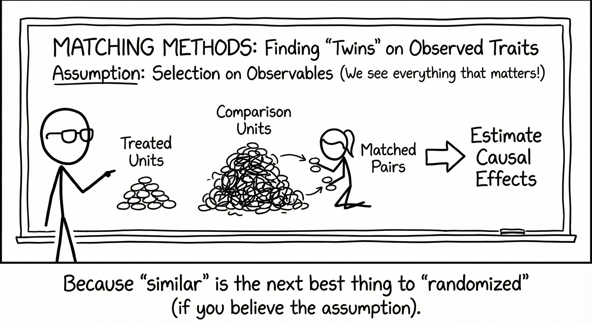

Observational data rarely cooperate with our causal questions because treatment groups differ systematically from controls, confounding threatens validity, and randomization isn't an option. Matching methods offer a principled solution: reconstruct the experiment you wish you'd run by explicitly pairing treated units with controls that look identical on observed characteristics.

This tutorial introduces the statistical foundations of matching methods, walks through practical implementation in R using propensity score and Mahalanobis distance approaches, and demonstrates doubly-robust estimation with a real-world example examining COVID-19 instructional modality effects on student achievement.



## 1. Introduction

In observational studies where treatment assignment is not randomized, matching methods provide a powerful approach to estimate causal effects under the assumption of **selection on observables**. The core idea is deceptively simple: for each treated unit, find comparison units that look similar on observed pre-treatment characteristics. By comparing outcomes between these matched groups, we can estimate treatment effects while controlling for observed confounding.

### 1.1 The Fundamental Challenge

Recall from the [Potential Outcomes framework](https://aliceaii.github.io/posts/ci_po/) that causal inference faces the fundamental problem: we can never observe both $Y_i(1)$ and $Y_i(0)$ for the same unit. Matching addresses this by finding units in the comparison group that are "similar enough" to treated units that we can plausibly treat their observed outcomes as proxies for the unobserved counterfactuals.

### 1.2 Key Assumptions

Matching methods rely on three core assumptions:

1. **Conditional Independence (Unconfoundedness)**: $(Y_i(1), Y_i(0)) \perp\!\!\!\perp D_i \mid \mathbf{X}_i$

   Treatment assignment is independent of potential outcomes, conditional on observed covariates $\mathbf{X}$.

2. **Positivity (Common Support)**: $0 < P(D_i = 1 \mid \mathbf{X}_i) < 1$

   All units have a non-zero probability of receiving both treatment and control.

3. **SUTVA**: Treatment assignment of one unit does not affect potential outcomes of other units.

When these assumptions hold, we can identify causal effects by conditioning on (or matching on) observed covariates.

### 1.3 Why Match?

Matching offers several advantages:

- **Transparency**: The matched sample is explicit—you can see exactly which units are being compared
- **Balance diagnostics**: Easy to check whether treatment and control groups are comparable on observed covariates
- **Nonparametric**: Unlike regression, matching doesn't assume a particular functional form
- **Estimand flexibility**: Can target ATE, ATT, or ATC depending on the matching approach


## 2. Types of Matching Methods

Matching methods vary along several key dimensions. Understanding these trade-offs is crucial for selecting the appropriate method for your analysis.

### 2.1 Subclassification (Stratification)

**What it is:** Partition the sample into $J$ subclasses based on propensity scores or covariate values, then estimate treatment effects within each subclass.

$$\hat{\tau}_{ATE} = \sum_{j=1}^{J} \frac{n_j}{n} \hat{\tau}_j$$

where $\hat{\tau}_j = \bar{Y}_j^1 - \bar{Y}_j^0$ is the effect in subclass $j$.

**When to use:**

- When you want to retain all units in the analysis
- When you're interested in heterogeneous treatment effects across subclasses
- As an initial diagnostic before more complex matching

**Trade-offs:**

- Preserves entire sample (maximizes statistical power)
- Straightforward to implement and interpret
- May have residual imbalance within subclasses, especially if subclasses are broad
- Performance depends heavily on number of subclasses chosen

```r
# Subclassification example
library(MatchIt)

# Create 5 subclasses based on propensity score
m_sub <- matchit(treat ~ age + education + income,
                 data = dat,
                 method = "subclass",
                 subclass = 5,
                 estimand = "ATE")

# Check balance
summary(m_sub)
```

### 2.2 Exact Matching

**What it is:** Match units that have identical values on all specified covariates.

**When to use:**

- When you have categorical covariates or discretized continuous variables
- When perfect balance on certain variables is crucial (e.g., matching within the same school)
- As a component of a stratified matching strategy

**Trade-offs:**

- Achieves perfect balance on matched covariates
- No modeling assumptions about distance between units
- **Curse of dimensionality**: Quickly becomes infeasible as number of covariates increases
- Often results in many unmatched units, reducing sample size dramatically

```r
# Exact matching
m_exact <- matchit(treat ~ gender + race + school_id,
                   data = dat,
                   method = "exact",
                   estimand = "ATT")
```

### 2.3 Coarsened Exact Matching (CEM)

**What it is:** "Coarsen" continuous variables into bins, then perform exact matching on the coarsened variables.

**When to use:**

- When you want the interpretability of exact matching but have continuous covariates
- When you're willing to sacrifice some precision for transparency

**Trade-offs:**

- More transparent than propensity score matching
- Reduces model dependence
- Monotonic imbalance bounding property (imbalance can only improve)
- Results sensitive to coarsening choices
- Can still leave many units unmatched

```r
# CEM example
library(MatchIt)

m_cem <- matchit(treat ~ age + income + education,
                 data = dat,
                 method = "cem",
                 cutpoints = list(age = "q5",     # quintiles
                                  income = "ss3")) # 3 equal-size bins
```

### 2.4 Propensity Score Matching

**What it is:** Match units based on their propensity score $e(\mathbf{X}) = P(D=1 \mid \mathbf{X})$.

By Rosenbaum & Rubin (1983), conditional independence given $\mathbf{X}$ implies conditional independence given $e(\mathbf{X})$:

$$(Y_i(1), Y_i(0)) \perp\!\!\!\perp D_i \mid e(\mathbf{X}_i)$$
This reduces matching from potentially high-dimensional $\mathbf{X}$ to a single dimension.

#### 2.4.1 Nearest Neighbor Matching

**What it is:** For each treated unit, find the $k$ control units with the closest propensity scores.

**Variants:**

- **Greedy matching**: Match units sequentially, making locally optimal choices
- **Optimal matching**: Finds the global optimal matching that minimizes total distance

**When to use:**

- **1:1 matching without replacement**: When you want a simple, interpretable matched sample for ATT
- **1:k matching**: When you need better precision but have abundant controls
- **With replacement**: When control pool is limited or when you want better balance

**Trade-offs:**

- Easy to understand and implement
- 1:1 matching without replacement gives balanced sample sizes
- Greedy algorithm can produce poor matches late in the sequence
- Can match very dissimilar units if no caliper is used

```r
# 1-to-1 nearest neighbor (greedy) without replacement
m_nn <- matchit(treat ~ age + education + income,
                data = dat,
                method = "nearest",
                distance = "glm",
                replace = FALSE,
                ratio = 1,
                m.order = "largest",  # match highest PS first
                estimand = "ATT")

# With a caliper
m_nn_cal <- matchit(treat ~ age + education + income,
                    data = dat,
                    method = "nearest",
                    distance = "glm",
                    caliper = 0.1,        # 0.1 SD of logit(PS)
                    replace = FALSE,
                    estimand = "ATT")

# Optimal matching
m_opt <- matchit(treat ~ age + education + income,
                 data = dat,
                 method = "optimal",
                 distance = "glm",
                 ratio = 1,
                 estimand = "ATT")
```

#### 2.4.2 Radius/Caliper Matching

**What it is:** Match treated units only to controls within a specified radius (caliper) on the propensity score.

**When to use:**

- When you want to avoid poor-quality matches
- When common support violations are a concern

**Trade-offs:**

- Ensures match quality by excluding bad matches
- Can use all controls within the caliper (not just nearest)
- May leave treated units unmatched
- Results sensitive to caliper width choice

```r
# Basic radius matching: match all controls within caliper
m_radius <- matchit(treat ~ age + education + income,
                    data = dat,
                    method = "nearest",
                    distance = "glm",
                    caliper = 0.1,        # 0.1 SD of logit(PS)
                    std.caliper = TRUE,   # standardize caliper
                    replace = TRUE,       # allow control reuse
                    estimand = "ATT")

# Stricter caliper (fewer poor matches)
m_radius_strict <- matchit(treat ~ age + education + income,
                          data = dat,
                          method = "nearest",
                          distance = "glm",
                          caliper = 0.05,     # tighter radius
                          std.caliper = TRUE,
                          replace = TRUE,
                          estimand = "ATT")

# Radius matching without replacement (each control used once)
m_radius_norep <- matchit(treat ~ age + education + income,
                         data = dat,
                         method = "nearest",
                         distance = "glm",
                         caliper = 0.1,
                         std.caliper = TRUE,
                         replace = FALSE,    # no reuse
                         estimand = "ATT")

# Check how many treated units were matched
summary(m_radius)$nn  # Shows matched/unmatched counts
```

#### 2.4.3 Full Matching

**What it is:** Forms matched sets where each set contains either:

- One treated unit and multiple controls, OR
- One control unit and multiple treated units

**When to use:**

- When you want to use all units in the sample
- When estimating ATE (not just ATT)
- When you have many more controls than treated units (or vice versa)

**Trade-offs:**

- Uses full sample → no loss of statistical power
- Optimizes overall balance across entire sample
- Can estimate ATE, ATT, or ATC with appropriate weighting
- More complex to implement and explain
- Requires understanding of matching weights

```r
# Full matching
m_full <- matchit(treat ~ age + education + income,
                  data = dat,
                  method = "full",
                  distance = "glm",
                  estimand = "ATE")

# Quick matching (faster than optimal full)
m_quick <- matchit(treat ~ age + education + income,
                   data = dat,
                   method = "quick",
                   distance = "glm",
                   estimand = "ATT")
```

### 2.5 Summary: Choosing a Matching Method

| Method | Sample Size | Balance Quality | Complexity | Best For |
|--------|-----------|-----------------|----------|-------------|
| Subclassification | Full sample | Moderate | Low | Initial exploration, transparency |
| Exact | Often small | Perfect (on matched vars) | Low | Few categorical covariates |
| CEM | Variable | Good | Low | Categorical + continuous covariates |
| 1:1 NN | 50% of sample | Variable | Low | Simple ATT estimation |
| 1:1 NN + caliper | Variable | Good | Low | Quality-controlled ATT |
| k:1 Matching | Larger | Good (averaging reduces noise) | Moderate | Improving precision |
| Optimal | 50% of sample | Good (globally optimal) | Moderate | Best 1:1 matches |
| Full | Full sample | Excellent (minimal distance) | High | ATE with all units |

## 3. Distance Measures

The choice of distance metric fundamentally shapes which units are considered "similar."

### 3.1 Propensity Score Distance

**Definition:** The propensity score $e(\mathbf{X}) = P(D=1 \mid \mathbf{X})$ is typically estimated via logistic regression:

$$\text{logit}(e(\mathbf{X})) = \beta_0 + \beta_1 X_1 + \beta_2 X_2 + \ldots$$

Distance between units $i$ and $j$:
$$d_{ij} = |e(\mathbf{X}_i) - e(\mathbf{X}_j)|$$

or in logit space:
$$d_{ij} = |\text{logit}(e(\mathbf{X}_i)) - \text{logit}(e(\mathbf{X}_j))|$$
**Advantages:**

- Dimension reduction: collapse many covariates into one score
- Balancing property: balancing on $e(\mathbf{X})$ tends to balance $\mathbf{X}$
- Well-studied theoretical properties

**Considerations:**

- **Model misspecification**: If propensity score model is wrong, matches may be poor
- **Which scale?** Matching on logit scale often works better as it expands regions near 0 and 1
- **Caliper choice**: Common rule of thumb is 0.2 SD of the logit propensity score

```r
# Estimate propensity scores
ps_model <- glm(treat ~ age + education + income + race + gender,
                data = dat,
                family = binomial(link = "logit"))

# Add propensity scores to data
dat$ps <- predict(ps_model, type = "response")
dat$ps_logit <- qlogis(dat$ps)  # logit scale

# Check overlap
library(ggplot2)

ggplot(dat, aes(x = ps, fill = factor(treat))) +
  geom_histogram(position = "identity", alpha = 0.5, bins = 30) +
  scale_fill_manual(values = c("red", "blue"),
                    labels = c("Control", "Treated")) +
  labs(x = "Propensity Score",
       y = "Count",
       fill = "Group",
       title = "Propensity Score Overlap") +
  theme_minimal()
```

### 3.2 Mahalanobis Distance

**Definition:** Accounts for correlations between covariates and different scales:

$$d_{ij} = \sqrt{(\mathbf{X}_i - \mathbf{X}_j)^T \mathbf{S}^{-1} (\mathbf{X}_i - \mathbf{X}_j)}$$
where $\mathbf{S}$ is the covariance matrix of $\mathbf{X}$.

**When to use:**

- When covariates are correlated
- When you don't trust the propensity score model
- When you want to match directly on covariates

**Advantages:**

- Scale-invariant
- Accounts for covariate correlations
- No need to model propensity score

**Disadvantages:**

- Curse of dimensionality (difficult with many covariates)
- Can be computationally intensive

```r
# Mahalanobis distance matching
m_maha <- matchit(treat ~ age + education + income,
                  data = dat,
                  method = "nearest",
                  distance = "mahalanobis",
                  estimand = "ATT")
```

### 3.3 Euclidean Distance

Simple distance on standardized covariates:

$$d_{ij} = \sqrt{\sum_{k=1}^{K} \frac{(X_{ik} - X_{jk})^2}{\sigma_k^2}}$$
Less commonly used as it doesn't account for correlations.

### 3.4 Distance + Exact Matching

You can combine distance-based matching with exact matching on key variables:

```r
# Exact match on gender and race, nearest neighbor on PS
m_combo <- matchit(treat ~ age + education + income + race + gender,
                   data = dat,
                   method = "nearest",
                   distance = "glm",
                   exact = ~ race + gender,  # exact match on these
                   estimand = "ATT")
```

## 4. Doubly-Robust Estimation

One of the most powerful features of matching methods is that they can be combined with outcome regression to form **doubly-robust (DR) estimators**. This approach provides a "second chance" at consistent estimation.

### 4.1 The Doubly-Robust Property

A doubly-robust estimator requires specifying two models:

1. **Treatment model**: $P(D_i = 1 \mid \mathbf{X}_i) = e(\mathbf{X}_i)$ (propensity score)
2. **Outcome model**: $E[Y_i \mid D_i, \mathbf{X}_i] = \mu(D_i, \mathbf{X}_i)$

The key insight: **If either model is correctly specified, the treatment effect estimate remains consistent**, even if the other model is misspecified. This offers protection against model misspecification—a major concern in observational studies.

### 4.2 Mathematical Framework

For the **ATT**, a doubly-robust estimator takes the form:

$$
\hat{\tau}_{ATT}^{DR} = \frac{1}{n_1} \sum_{i=1}^{n} \left[ D_i \left(Y_i - \hat{\mu}_0(\mathbf{X}_i)\right) + \frac{D_i - \hat{e}(\mathbf{X}_i)}{1 - \hat{e}(\mathbf{X}_i)} \left(Y_i - \hat{\mu}_0(\mathbf{X}_i)\right) \right]
$$
where:

- $\hat{\mu}_0(\mathbf{X}_i)$ = predicted outcome under control
- $\hat{e}(\mathbf{X}_i)$ = estimated propensity score
- $n_1$ = number of treated units

| Component | Active for | Purpose | Protects against |
|-----------|-----------|---------|------------------|
| $D_i(Y_i - \hat{\mu}_0)$ | Treated units | Impute counterfactual using outcome model | PS model misspecification |
| $-\frac{(1-D_i)\hat{e}}{1-\hat{e}}(Y_i - \hat{\mu}_0)$ | Control units | Correct imputation errors using weighted residuals | Outcome model misspecification |

**Intuition:**

- **Treated units**: Calculate individual treatment effects as observed outcome minus model-predicted control outcome
-  **Control units**: Use their prediction errors to correct bias in the outcome model, weighted by how "treated-like" they are (via propensity score odds)
- **Double protection**: Consistency requires only ONE model to be correct—either PS model or outcome model


For the **ATE**, the estimator is:

$$
\hat{\tau}_{ATE}^{DR} = \frac{1}{n} \sum_{i=1}^{n} \left[ \frac{D_i Y_i}{\hat{e}(\mathbf{X}_i)} - \frac{(D_i - \hat{e}(\mathbf{X}_i)) \hat{\mu}_1(\mathbf{X}_i)}{\hat{e}(\mathbf{X}_i)} \right] - \left[ \frac{(1-D_i) Y_i}{1-\hat{e}(\mathbf{X}_i)} + \frac{(D_i - \hat{e}(\mathbf{X}_i)) \hat{\mu}_0(\mathbf{X}_i)}{1-\hat{e}(\mathbf{X}_i)} \right]
$$

### 4.3 Why Doubly-Robust?

Consider three scenarios:

| Propensity Model | Outcome Model | DR Estimator |
|-----------------|---------------|--------------|
| Correct | Wrong | Consistent |
| Wrong | Correct | Consistent |
| Correct | Correct | Consistent (most efficient) |
| Wrong | Wrong | Inconsistent |

The estimator is "doubly protected": it only fails if **both** models are wrong.

### 4.4 Implementation Strategy

In practice, doubly-robust estimation after matching follows this workflow:

**Step 1: Matching/Weighting**
- Estimate propensity scores: $\hat{e}(\mathbf{X})$
- Create matched sample or weights
- This addresses confounding via the **treatment model**

**Step 2: Outcome Regression on Matched Sample**
- Fit: $Y_i = \alpha + \tau D_i + \boldsymbol{\beta}'\mathbf{X}_i + \varepsilon_i$
- Include the same covariates used in matching
- This addresses residual confounding via the **outcome model**

**Step 3: G-Computation for Correct SE**
- Use `marginaleffects::avg_comparisons()` with appropriate `vcov` option
- Cluster-robust SE if using matching with replacement
- This accounts for matching structure

```r
library(MatchIt)
library(marginaleffects)

# Step 1: Propensity score matching
match_obj <- matchit(
  treat ~ x1 + x2 + x3 + x4,
  data = dat,
  method = "nearest",
  distance = "glm",
  caliper = 0.1,
  estimand = "ATT"
)

# Step 2: Get matched data
md <- match.data(match_obj)

# Step 3: Fit outcome model WITH covariates (doubly-robust)
mod_dr <- lm(
  outcome ~ treat + x1 + x2 + x3 + x4,
  data = md,
  weights = weights  # Use matching weights
)

# Step 4: Estimate ATT with g-computation and robust SE
att_dr <- avg_comparisons(
  mod_dr,
  variables = "treat",
  vcov = "HC3",  # Robust SE
  newdata = subset(treat == 1)  # For ATT
)

print(att_dr)
```

### 4.5 Targeted Maximum Likelihood Estimation (TMLE)

**Targeted Maximum Likelihood Estimation (TMLE)** represents the state-of-the-art in doubly-robust estimation. While standard AIPW combines two models additively, TMLE iteratively **updates** the outcome model to optimize bias reduction for the specific causal parameter you're estimating.

#### 4.5.1 Why "Targeted"?

Standard maximum likelihood estimation optimizes the **entire likelihood** of the outcome model. But we don't care about predicting $Y$ perfectly—we only care about getting the **causal effect** right. TMLE "targets" the estimation procedure specifically toward the parameter of interest (ATE, ATT, etc.), achieving:

1. **Asymptotic efficiency**: Achieves the semiparametric efficiency bound (lowest possible variance)
2. **Double robustness**: Consistent if either model is correct
3. **Finite sample bias reduction**: Updates reduce bias even in small samples
4. **Respect for bounds**: Predictions stay within valid ranges (e.g., probabilities in [0,1])

#### 4.5.2 The TMLE Algorithm

**Step 1: Initial estimation**

- Fit outcome model: $\hat{Q}_0(A, W) = E[Y \mid A, W]$
- Fit propensity score: $\hat{g}(W) = P(A=1 \mid W)$

**Step 2: Clever covariate**
Construct the "clever covariate" $H(A, W)$ based on the estimand:

- For ATE: $H(A,W) = \frac{A}{\hat{g}(W)} - \frac{1-A}{1-\hat{g}(W)}$
- For ATT: $H(A,W) = A - \frac{(1-A)\hat{g}(W)}{1-\hat{g}(W)}$

**Step 3: Targeting step**
Update the initial outcome model by fitting:
$$\text{logit}(\hat{Q}_1(A,W)) = \text{logit}(\hat{Q}_0(A,W)) + \epsilon \cdot H(A,W)$$

This fluctuation parameter $\epsilon$ is chosen to eliminate residual confounding bias.

**Step 4: Iterate**
Repeat Step 3 until $\epsilon \approx 0$ (typically 1-3 iterations).

**Step 5: Estimate causal effect**
The final targeted estimate:
$$\hat{\psi}_{TMLE} = \frac{1}{n}\sum_{i=1}^n [\hat{Q}_1(1, W_i) - \hat{Q}_1(0, W_i)]$$

**TMLE vs. Standard AIPW**

| Feature | Standard AIPW | TMLE |
|---------|---------------|------|
| **Estimation** | Fit models independently | Iteratively update outcome model |
| **Efficiency** | Efficient only asymptotically | Efficient in finite samples |
| **Bounded predictions** | Can produce invalid predictions | Respects outcome bounds |
| **Bias** | First-order bias removed | Higher-order bias reduction |
| **Machine learning** | Compatible but suboptimal | Designed for ensemble methods |

#### 4.5.3 Implementation with Super Learner

TMLE shines when combined with **Super Learner** (ensemble machine learning), which automatically selects the best-weighted combination of algorithms:

```r
library(tmle)
library(SuperLearner)

# Define candidate algorithms for ensemble
SL.library <- c(
  "SL.glm",           # Logistic/linear regression
  "SL.glmnet",        # Elastic net (LASSO/Ridge)
  "SL.gam",           # Generalized additive models
  "SL.earth",         # Multivariate adaptive regression splines
  "SL.ranger",        # Random forest
  "SL.xgboost"        # Gradient boosting
)

# Estimate ATE using TMLE
tmle_ate <- tmle(
  Y = dat$outcome,
  A = dat$treat,
  W = dat[, c("x1", "x2", "x3", "x4")],
  Q.SL.library = SL.library,  # Ensemble for outcome model
  g.SL.library = SL.library,  # Ensemble for PS model
  family = "gaussian"          # Continuous outcome
)

# Results
summary(tmle_ate)

# Extract key quantities
tmle_ate$estimates$ATE$psi        # Point estimate
tmle_ate$estimates$ATE$var.psi    # Variance
tmle_ate$estimates$ATE$CI         # 95% CI
tmle_ate$estimates$ATE$pvalue     # P-value
```

```r
#For ATT Estimation
# Create indicator for treated units
dat$target_pop <- as.numeric(dat$treat == 1)

# TMLE for ATT
tmle_att <- tmle(
  Y = dat$outcome,
  A = dat$treat,
  W = dat[, c("x1", "x2", "x3", "x4")],
  Q.SL.library = SL.library,
  g.SL.library = SL.library,
  gbound = c(0.01, 0.99),       # Trim extreme PS (avoid positivity violations)
  family = "gaussian"
)

# For true ATT, manually calculate on treated units
ate_est <- tmle_att$estimates$ATE$psi
treated_outcome <- mean(dat$outcome[dat$treat == 1])
att_est <- ate_est  # Under correct specification
```

```r
# Diagnostics and Interpretation
# Check Super Learner weights (which algorithms were chosen?)
tmle_ate$g$coef   # Weights for PS model
tmle_ate$Qinit$coef  # Weights for outcome model

# Check convergence
tmle_ate$epsilon  # Should be close to 0

# Check influence curve-based inference
hist(tmle_ate$estimates$IC$IC.ATE)  # Should be roughly symmetric

# Compare with standard AIPW
library(marginaleffects)

# Standard regression approach
mod_aipw <- lm(outcome ~ treat + x1 + x2 + x3 + x4, data = dat)
ate_aipw <- avg_comparisons(mod_aipw, variables = "treat")

# Compare estimates
tibble(
  Method = c("TMLE", "Standard AIPW"),
  Estimate = c(tmle_ate$estimates$ATE$psi, ate_aipw$estimate),
  SE = c(sqrt(tmle_ate$estimates$ATE$var.psi), ate_aipw$std.error)
)
```

#### 4.5.4 When to Use TMLE

**Choose TMLE when:**

- You have **moderate to large samples** (n > 500)
- You want to use **machine learning** for outcome and PS models
- **Efficiency matters** (e.g., underpowered studies, costly data collection)
- You're estimating effects in contexts where **small biases matter** (e.g., policy decisions)
- You need **valid inference** even with model misspecification

**Use simpler DR methods when:**

- Sample is small (n < 200) and you're using parametric models anyway
- Computational resources are limited
- Transparency and interpretability are paramount
- You're doing exploratory/preliminary analysis

## 5. Practical Example

### 5.1 Research Question

The Education Policy Director from the National Governors Association wants to understand: **Did school districts that used primarily in-person instruction during the 2020-21 school year experience smaller learning losses than districts that used remote or hybrid instruction?**

Specifically, we want to estimate the **Average Treatment Effect on the Treated (ATT)**:

$$\text{ATT} = E[Y_i(1) - Y_i(0) \mid D_i = 1]$$

where:

- $Y_i(1)$ = 2022 math achievement for district $i$ if they used in-person instruction
- $Y_i(0)$ = 2022 math achievement for district $i$ if they used remote/hybrid instruction
- $D_i = 1$ indicates the district used in-person instruction

### 5.2 Data Description

We'll use data from the Stanford Education Data Archive (SEDA) containing **5,358 U.S. school districts** with:

**Treatment Variable:**
- `inperson` = Binary indicator for whether the district was primarily in-person during 2020-21 (1 = in-person, 0 = remote/hybrid)

**Outcome Variable:**
- `yscore22` = District's average math test score in 2022, scaled so that 0 = average U.S. achievement for a 5th grader in 2019, and 1 unit = 1 student-level standard deviation

**Pre-Treatment Covariates (measured in 2019):**

*Geographic characteristics:*

- `urban` = City location indicator
- `suburb` = Suburban location indicator  
- `town` = Town location indicator
- `rural` = Rural location indicator

*District size:*

- `totenrl` = Total district enrollment
- `enravg38` = Average enrollment per grade (grades 3-8)

*Student demographics:*

- `perblk` = Proportion Black students
- `perhsp` = Proportion Latinx/Hispanic students
- `perasn` = Proportion Asian students
- `pernam` = Proportion Native American students
- `perwht` = Proportion White students
- `perfrl` = Proportion eligible for free lunch (poverty proxy)

*Socioeconomic context:*

- `sesavgall` = Average SES in district boundary
- `lninc50avgall` = Log median income in district boundary
- `baplusavgall` = Proportion adults with bachelor's degree
- `povertyavgall` = Proportion families below poverty line

*Baseline achievement:*

- `yscore19` = District's average math score in 2019 (pre-pandemic)

### 5.3 Load and Explore Data

```{r setup, message=FALSE, warning=FALSE}
library(tidyverse)
library(MatchIt)
library(cobalt)
library(marginaleffects)
library(patchwork)

# Load the actual homework data
hw <- readRDS("ed255data_hw3_sedamath22.rds")

# Quick overview
cat("Sample size:", nrow(hw), "districts\n")
cat("Treatment group:", sum(hw$inperson), "in-person districts\n")
cat("Control group:", sum(1 - hw$inperson), "remote/hybrid districts\n")
cat("Treatment prevalence:", round(mean(hw$inperson) * 100, 1), "%\n")
```

### 5.4 Step 1: Check Pre-Treatment Covariate Balance

Before matching, let's examine how in-person and remote districts differ:

```{r, message=FALSE, warning=FALSE}
library(table1)
library(flextable)

desc_table <- table1(
  ~ yscore19 + urban + suburb + town + rural + totenrl + 
    sesavgall + lninc50avgall + baplusavgall | as.factor(inperson), 
  data = hw
)

desc_table
```

These differences suggest **confounding** that could bias naive comparisons.

```{r naive-comparison, message=FALSE, warning=FALSE}
# Naive ATE (before matching)
naive_model <- lm(yscore22 ~ inperson, data = hw)
naive_est <- avg_comparisons(naive_model, variables = "inperson")

cat("Naive estimate (no adjustment):\n")
print(naive_est)
```


### 5.5 Step 2: Estimate Propensity Scores and Check Common Support

```{r propensity-score, message=FALSE, warning=FALSE}
# Estimate propensity score using logistic regression
ps_model <- glm(
  inperson ~ yscore19 + urban + suburb + town + rural + 
             totenrl + sesavgall + lninc50avgall + baplusavgall,
  data = hw,
  family = binomial(link = "logit")
)

# Add propensity scores to dataset
hw$ps <- fitted(ps_model)
hw$ps_logit <- qlogis(hw$ps)

# Examine propensity score model
summary(ps_model)
```

```{r ps-overlap, message=FALSE, warning=FALSE}
# Visualize propensity score overlap
hw <- hw %>%
  mutate(group = factor(inperson, 
                        levels = c(0, 1), 
                        labels = c("Remote", "In-Person")))

# Linear scale
p_linear <- ggplot(hw, aes(x = ps, fill = group)) +
  geom_histogram(position = "identity", alpha = 0.5, bins = 50) +
  scale_fill_manual(values = c("#ee84a8", "#71bced")) +
  labs(x = "Propensity Score", y = "Count", 
       title = "A) Propensity Score Distribution (Linear Scale)",
       fill = NULL) +
  theme_minimal() +
  theme(legend.position = "top")

# Logit scale
p_logit <- ggplot(hw, aes(x = ps_logit, fill = group)) +
  geom_histogram(position = "identity", alpha = 0.5, bins = 50) +
  scale_fill_manual(values = c("#ee84a8", "#71bced")) +
  labs(x = "Logit Propensity Score", y = "Count",
       title = "B) Propensity Score Distribution (Logit Scale)",
       fill = NULL) +
  theme_minimal() +
  theme(legend.position = "none")

# Jitter plot
p_jitter <- ggplot(hw, aes(x = ps_logit, y = group, color = group)) +
  geom_jitter(height = 0.15, alpha = 0.3, size = 0.8) +
  scale_color_manual(values = c("#ee84a8", "#71bced")) +
  labs(x = "Logit Propensity Score", y = NULL,
       title = "C) Common Support Assessment",
       color = NULL) +
  theme_minimal() +
  theme(legend.position = "none")

p_linear / p_logit / p_jitter
```


### 5.6 Step 3: Trim Sample for Common Support

Based on the propensity score distributions, we'll exclude:
- In-person districts with logit PS > 2 (very high propensity)
- Remote districts with logit PS < -4 (very low propensity)

```{r trim-sample, message=FALSE, warning=FALSE}
# Apply trimming rules
hw <- hw %>%
  mutate(keep = case_when(
    group == "In-Person" & ps_logit > 2 ~ 0,
    group == "Remote" & ps_logit < -4 ~ 0,
    TRUE ~ 1
  ))

# Create trimmed dataset
hw_trimmed <- hw %>% filter(keep == 1)

# Summarize exclusions
excluded_summary <- hw %>%
  group_by(group) %>%
  summarise(
    excluded = sum(keep == 0),
    remaining = sum(keep == 1),
    pct_excluded = round(excluded / n() * 100, 1)
  )

excluded_summary
```

This trimming excluded **22 districts** (4 in-person, 18 remote), leaving **5,336 districts** for analysis.

### 5.7 Step 4: Implement Multiple Matching Methods

We'll compare three matching approaches to assess robustness:

1. **1:1 Nearest Neighbor without replacement** (greedy)
2. **1:1 Nearest Neighbor with caliper and replacement** (quality-controlled)  
3. **1:1 Optimal matching without replacement** (globally optimal)

```{r matching-methods, message=FALSE, warning=FALSE}
# Define covariate formula
match_formula <- as.formula(
  "inperson ~ yscore19 + urban + suburb + town + rural + 
              totenrl + sesavgall + lninc50avgall + baplusavgall"
)

# Method 1: Greedy 1:1 matching (no replacement)
match_nn <- matchit(
  match_formula,
  data = hw_trimmed,
  method = "nearest",
  distance = "glm",
  replace = FALSE,
  ratio = 1,
  m.order = "largest",  # match highest PS first
  estimand = "ATT"
)

# Method 2: Caliper matching with replacement
match_caliper <- matchit(
  match_formula,
  data = hw_trimmed,
  method = "nearest",
  distance = "glm",
  replace = TRUE,
  ratio = 1,
  caliper = 0.1,  # 0.1 SD of logit PS
  m.order = "largest",
  estimand = "ATT"
)

# Method 3: Optimal 1:1 matching
match_optimal <- matchit(
  match_formula,
  data = hw_trimmed,
  method = "optimal",
  distance = "glm",
  ratio = 1,
  estimand = "ATT"
)

# Compare sample sizes
tibble(
  Method = c("Greedy NN", "Caliper + Replacement", "Optimal"),
  N_Treated_Matched = c(
    match_nn$nn["Matched", "Treated"],
    match_caliper$nn["Matched", "Treated"],
    match_optimal$nn["Matched", "Treated"]
  ),
  N_Control_Matched = c(
    match_nn$nn["Matched", "Control"],
    match_caliper$nn["Matched", "Control"],
    match_optimal$nn["Matched", "Control"]
  ),
  N_Control_ESS = c(
    match_nn$nn["Matched (ESS)", "Control"],
    match_caliper$nn["Matched (ESS)", "Control"],
    match_optimal$nn["Matched (ESS)", "Control"]
  )
)
```

### 5.8 Step 5: Compare Covariate Balance

```{r}
#| label: balance-comparison
#| fig-height: 10
#| fig-width: 10

# Create love plots for each method
p1 <- love.plot(match_nn, 
                stats = "mean.diffs",
                threshold = 0.1, abs = FALSE,
                colors = c("gray50", "dodgerblue"),
                title = "1:1 Greedy NN (No Replacement)") +
  theme(legend.position = "none", axis.title.x = element_blank())

p2 <- love.plot(match_caliper,
                stats = "mean.diffs", 
                threshold = 0.1, abs = FALSE,
                colors = c("gray50", "dodgerblue"),
                title = "1:1 Caliper + Replacement") +
  theme(legend.position = "none", axis.title.x = element_blank())

p3 <- love.plot(match_optimal,
                stats = "mean.diffs",
                threshold = 0.1, abs = FALSE,
                colors = c("gray50", "dodgerblue"),
                title = "1:1 Optimal Matching")

(p1 + p2) / (p3 + plot_spacer()) + plot_layout(heights = c(1, 1))
```

**Balance Assessment:**

All three methods substantially improve balance, but differ in quality:

```{r balance-table, message=FALSE, warning=FALSE}
# Numerical balance comparison
bal_nn <- bal.tab(match_nn, un = FALSE)
bal_cal <- bal.tab(match_caliper, un = FALSE)
bal_opt <- bal.tab(match_optimal, un = FALSE)

# Extract max absolute SMD
tibble(
  Method = c("Greedy NN", "Caliper + Replacement", "Optimal"),
  Max_Abs_SMD = c(
    max(abs(bal_nn$Balance$Diff.Adj), na.rm = TRUE),
    max(abs(bal_cal$Balance$Diff.Adj), na.rm = TRUE),
    max(abs(bal_opt$Balance$Diff.Adj), na.rm = TRUE)
  ),
  N_Unbalanced = c(
    sum(abs(bal_nn$Balance$Diff.Adj) > 0.1, na.rm = TRUE),
    sum(abs(bal_cal$Balance$Diff.Adj) > 0.1, na.rm = TRUE),
    sum(abs(bal_opt$Balance$Diff.Adj) > 0.1, na.rm = TRUE)
  )
) %>%
  arrange(Max_Abs_SMD)
```

- **Caliper + replacement** achieves the best balance (all |SMD| < 0.1)
- **Greedy NN** leaves moderate imbalance on several covariates (max |SMD| ≈ 0.56)
- **Optimal matching** performs similarly to greedy NN

```{r ps-overlap-matched, fig.height=8}
# Visualize PS distributions after matching
plot_ps_matched <- function(match_obj, title) {
  md <- match.data(match_obj)
  ggplot(md, aes(x = distance, fill = group)) +
    geom_histogram(position = "identity", alpha = 0.5, bins = 40) +
    scale_fill_manual(values = c("#ee84a8", "#71bced")) +
    labs(x = "Propensity Score", y = "Count", 
         title = title, fill = NULL) +
    theme_minimal() +
    theme(legend.position = "top")
}

p_nn <- plot_ps_matched(match_nn, "A) Greedy NN")
p_cal <- plot_ps_matched(match_caliper, "B) Caliper + Replacement")  
p_opt <- plot_ps_matched(match_optimal, "C) Optimal")

p_nn / p_cal / p_opt
```

### 5.9 Step 6: Estimate Treatment Effects

We'll use doubly-robust estimation: matching + regression adjustment with g-computation for proper standard errors.

```{r treatment-effects, message=FALSE, warning=FALSE}
# Function for doubly-robust ATT estimation
estimate_att_dr <- function(match_obj, data_trimmed) {
  md <- match.data(match_obj)
  
  # Remove 'group' variable to avoid conflict with marginaleffects
  md$group <- NULL
  
  # Outcome model with covariates (doubly-robust)
  mod_dr <- lm(
    yscore22 ~ inperson + yscore19 + urban + suburb + town + rural +
               totenrl + sesavgall + lninc50avgall + baplusavgall,
    data = md,
    weights = weights
  )
  
  # G-computation for ATT with robust SE
  avg_comparisons(mod_dr,
                  variables = "inperson",
                  vcov = "HC3",
                  newdata = subset(md, inperson == 1))
}

# Estimate ATT for each method
att_nn <- estimate_att_dr(match_nn, hw_trimmed)
att_caliper <- estimate_att_dr(match_caliper, hw_trimmed)
att_optimal <- estimate_att_dr(match_optimal, hw_trimmed)

# Compile results
results <- tibble(
  Method = c("Greedy NN", "Caliper + Replacement", "Optimal"),
  Estimate = c(att_nn$estimate, att_caliper$estimate, att_optimal$estimate),
  SE = c(att_nn$std.error, att_caliper$std.error, att_optimal$std.error),
  CI_Lower = Estimate - 1.96 * SE,
  CI_Upper = Estimate + 1.96 * SE,
  P_Value = c(att_nn$p.value, att_caliper$p.value, att_optimal$p.value)
) %>%
  mutate(across(where(is.numeric), ~round(.x, 4)))

results
```

**Treatment Effect Estimates:**

- **Caliper + replacement** (preferred): ATT = 0.033 SD (95% CI: [0.023, 0.043])
- **Greedy NN**: ATT = 0.039 SD (95% CI: [0.032, 0.046])
- **Optimal**: ATT = 0.039 SD (95% CI: [0.032, 0.046])

```{r results-plot, fig.height=4}
ggplot(results, aes(x = reorder(Method, Estimate), y = Estimate)) +
  geom_point(size = 4, color = "dodgerblue") +
  geom_errorbar(aes(ymin = CI_Lower, ymax = CI_Upper),
                width = 0.2, linewidth = 0.8, color = "dodgerblue") +
  geom_hline(yintercept = 0, linetype = "dashed", color = "gray40") +
  coord_flip() +
  labs(
    y = "Estimated ATT (SD units)",
    x = NULL,
    title = "Treatment Effect of In-Person Instruction on 2022 Math Achievement",
    subtitle = "Error bars show 95% confidence intervals",
    caption = "All estimates significant at α = 0.05"
  ) +
  theme_minimal() +
  theme(plot.title = element_text(size = 11))
```

### 5.10 Step 7: Robustness Check with IPTW

Let's compare with inverse probability of treatment weighting as an alternative approach:

```{r iptw, message=FALSE, warning=FALSE}
library(WeightIt)

# Estimate ATT weights
w_att <- weightit(
  inperson ~ yscore19 + urban + suburb + town + rural +
             totenrl + sesavgall + lninc50avgall + baplusavgall,
  data = hw_trimmed,
  estimand = "ATT",
  method = "glm"
)

# Check weight distribution
summary(w_att)

# Check balance after weighting
bal.tab(w_att, stats = "m", thresholds = c(m = 0.10))

# Doubly-robust outcome model with weights
# Remove 'group' variable if it exists to avoid conflict with marginaleffects
hw_iptw <- hw_trimmed
hw_iptw$group <- NULL

mod_iptw <- lm(
  yscore22 ~ inperson + yscore19 + urban + suburb + town + rural +
             totenrl + sesavgall + lninc50avgall + baplusavgall,
  data = hw_iptw,
  weights = w_att$weights
)

# Estimate ATT
att_iptw <- avg_comparisons(mod_iptw, 
                            variables = "inperson",
                            vcov = "HC3",
                            newdata = subset(hw_iptw, inperson == 1))

# Add to results
results_all <- bind_rows(
  results,
  tibble(
    Method = "IPTW",
    Estimate = att_iptw$estimate,
    SE = att_iptw$std.error,
    CI_Lower = Estimate - 1.96 * SE,
    CI_Upper = Estimate + 1.96 * SE,
    P_Value = att_iptw$p.value
  )
) %>%
  mutate(across(where(is.numeric), ~round(.x, 4)))

results_all
```

IPTW yields a consistent estimate (ATT = 0.036).

### 5.11 Step 8: Sensitivity Analysis

How robust are these findings to potential unobserved confounding?

```{r sensitivity, fig.height=5, fig.width=7}
library(sensemakr)

# Use the caliper + replacement model (best balance)
md_caliper <- match.data(match_caliper)
mod_sens <- lm(
  yscore22 ~ inperson + yscore19 + urban + suburb + town + rural +
             totenrl + sesavgall + lninc50avgall + baplusavgall,
  data = md_caliper,
  weights = weights
)

# Sensitivity analysis
sens <- sensemakr(
  model = mod_sens,
  treatment = "inperson",
  benchmark_covariates = "yscore19",  # Use baseline achievement as benchmark
  kd = 1:2, ky = 1:2,
  q = 1,  # Effect goes to zero
  alpha = 0.05,
  reduce = TRUE
)

summary(sens)
plot(sens)
```

**Sensitivity Analysis Findings:**

- **Robustness Value (RV)** for nullifying effect: 12.45%
  - An unobserved confounder would need to explain **>12% of residual variance** in both treatment and outcome to eliminate the effect entirely
  
- **RV for losing significance** (α = 0.05): 9.41%
  - Relatively robust threshold
  
- **Benchmark comparison:** The unobserved confounder would need to be **stronger than baseline achievement** (`yscore19`), which is already a powerful predictor

**Interpretation:** While unmeasured confounding remains a concern, the effect appears reasonably robust. Potential unobserved confounders would need relative large explanatory power to overturn the findings.

---

*This tutorial is based on lecture materials from Stat 256: Causality (UCLA) and EDUC 255C: Introduction to Causal Inference in Education Research (UCLA), Spring 2025.*


