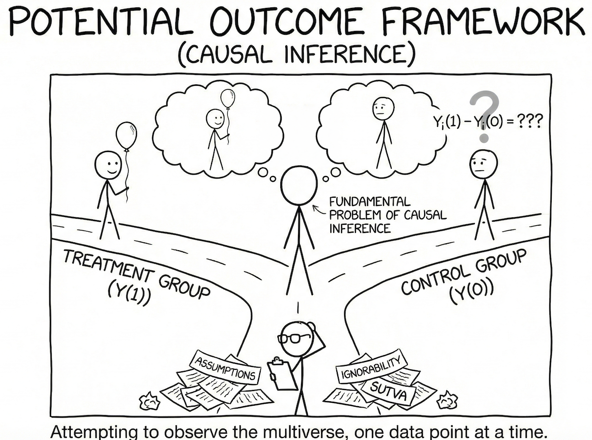

This post provides a introduction to the *Potential Outcomes Framework* (also known as the Neyman-Rubin Causal Model) for causal inference. 

We will cover the core concepts, key assumptions, causal estimands, and identification strategies through both theoretical exposition and applied examples.




## 1. What is the Potential Outcomes Framework?

The Potential Outcomes Framework is a statistical approach to defining and estimating causal effects. A considerable part of the empirically oriented causal inference community works mainly in terms of this Neyman-Rubin causal model, also known as the **Potential Outcomes Model (POM)**.

### 1.1 The Core Idea

What do we mean when we say something had a causal effect? The POM answer is elegantly simple:

- Suppose unit $i$ takes a treatment and you measure the outcome. Call this $Y_i(1)$, or the **treatment potential outcome**.
- You'd like to know how $Y_i(1)$ compares to the value of $Y$ that unit $i$ would have had if it had not taken the treatment. Call this $Y_i(0)$, or the **control potential outcome**.
- Then unit $i$'s individual treatment effect is:

$$\delta_i = Y_i(1) - Y_i(0)$$

### 1.2 The Fundamental Problem of Causal Inference

Here's the catch: **You do not get to see both $Y_i(1)$ and $Y_i(0)$ for any unit $i$**. This is the fundamental problem of causal inference.

We only observe whether an individual received the intervention or not, and one outcome:

$$Y_i = D_i \cdot Y_i(1) + (1 - D_i) \cdot Y_i(0)$$

where $D_i \in \{0, 1\}$ is the treatment indicator.

Let's visualize this with a hypothetical example:

```{r, warning=FALSE, message = FALSE, echo=FALSE}
library(tidyverse)
library(knitr)
library(kableExtra)
```

```{r fundamental-problem, echo=FALSE}
# Create example data showing the fundamental problem
example_data <- data.frame(
  ID = 1:10,
  `Y(0)` = c(47, 59, 33, "?", "?", 43, "?", 41, 57, "?"),
  `Y(1)` = c("?", "?", "?", 41, 54, "?", 53, "?", "?", 53),
  `delta` = c("?", "?", "?", "?", "?", "?", "?", "?", "?", "?"),
  D = c(0, 0, 0, 1, 1, 0, 1, 0, 0, 1)
)

kable(example_data, 
      col.names = c("ID", "Y_i(0)", "Y_i(1)", "δ_i", "D_i"),
      align = c("c", "c", "c", "c", "c"),
      caption = "The Fundamental Problem: We only observe one potential outcome per unit") %>%
  kable_styling(bootstrap_options = c("striped", "hover"),
                full_width = FALSE,
                position = "center") %>%
  column_spec(1, bold = TRUE, width = "3em") %>%
  column_spec(2:5, width = "5em")
```

The unobserved potential outcome represents the **counterfactual condition**: what we would have observed if the individual was in the other condition than they were in.

> *Learning anything about causality requires somehow filling in the "missing" potential outcomes through some set of assumptions.*

---

## 2. Key Assumptions of the Potential Outcomes Framework

To identify causal effects using the potential outcomes framework, we need three core assumptions. These assumptions work together to allow us to estimate causal effects from observed data.

**(1) Stable Unit Treatment Value Assumption (SUTVA):**

This assumption means that unit $i$'s potential outcomes are independent of other units' treatment assignments (**no interference**) and that there is only one version of the treatment (**treatment consistency**).

- **No interference:** $Y_i(D_i, D_j) = Y_i(D_i)$ regardless of the value of $D_j$
- **Consistency:** If $D_i = d$, then $Y_i = Y_i(d)$

*Example violations:* If you get a flu vaccine, it reduces your friend's chance of getting the flu (spillover). When studying college effects on graduates' income, different college types may matter (multiple treatment versions).

**(2) Conditional Ignorability:** $Y_i(d) \perp D_i \mid X_i$

This assumption means that treatment assignment $D_i$ is conditionally independent of potential outcomes given all observed confounders ($X_i$).

In other words, after controlling for observed covariates, there are no remaining unmeasured confounders that affect both treatment selection and outcomes. This is also known as:

- Conditional exchangeability
- Selection on observables (SOO)
- No unobserved confounders


**(3) Positivity (also called Common Support):** $0 < P(D_i = d \mid X_i) < 1$

This assumption means that the probability of receiving each treatment condition, given all confounders (also known as the **propensity score** $e_i$), is strictly between zero and one for all treatment conditions.

This ensures that for every combination of covariate values, there exist both treated and untreated units, allowing us to make valid comparisons.


> *"Rather than consider SUTVA as overly restrictive, researchers should always reflect on the plausibility of SUTVA in each application and use such reflection to motivate a clear discussion of the meaning and scope of a causal effect estimate."* — Morgan & Winship (2014)


## 3. Causal Estimands: What Are We Trying to Estimate?

### 3.1 Average Treatment Effect (ATE)

The **ATE** is the expected difference in potential outcomes across the entire population:

$$\tau_{ATE} = \mathbb{E}[Y_i(1) - Y_i(0)]$$

This represents the expected change in outcome that units would experience on average if all of them received the treatment, compared to if none of them received it.

### 3.2 Average Treatment Effect on the Treated (ATT)

The **ATT** is the average treatment effect among those who actually received treatment:

$$\tau_{ATT} = \mathbb{E}[Y_i(1) - Y_i(0) \mid D_i = 1]$$

This answers: "What was the average effect of treatment on those who were treated?"

### 3.3 Average Treatment Effect on the Controls (ATC)

The **ATC** is the average treatment effect among those who did not receive treatment:

$$\tau_{ATC} = \mathbb{E}[Y_i(1) - Y_i(0) \mid D_i = 0]$$

This answers: "What would have been the average effect if those in the control group had been treated?"

### 3.4 When Are ATE, ATT, and ATC Different?

These estimands are generally different when there is **treatment effect heterogeneity** combined with **selection into treatment**.

**Example:** Consider a cash transfer study with block randomization:

- In a large city: 50% assigned to treatment
- In smaller cities: 67% assigned to treatment

Although assignment is random within each city, the probability of treatment differs by block. If baseline health conditions differ across cities, these unequal block weights make the composition of the treated group systematically different from that of the full sample. Thus, ATT ≠ ATE.

## 4. Bias and Identification

### 4.1 The Naïve Estimator and Its Bias

The naïve difference-in-means estimator is:

$$\hat{\delta}_{naive} = \mathbb{E}[Y_i \mid D_i = 1] - \mathbb{E}[Y_i \mid D_i = 0]$$

The bias of this estimator can be decomposed as:

$$ATE = \hat{\delta}_{naive} - \underbrace{\left(\mathbb{E}[Y_i(0) \mid D = 1] - \mathbb{E}[Y_i(0) \mid D = 0]\right)}_{\text{Selection Bias}} - \underbrace{(1-\pi)(ATT - ATU)}_{\text{Heterogeneous Treatment Effect Bias}}$$

where $\pi$ is the proportion treated.

**Neither of these bias quantities can be calculated from observed data alone.**

::: {.callout-note}
**Example: Does attending office hours improve exam scores?**

Imagine you want to know if attending office hours causes better exam performance.

**1. The Naïve Approach**
Simply compare:

- Average score of students who attended office hours (treated group)
- Average score of students who didn't attend (control group)

Let's say:

- Students who attended office hours: Average = 85
- Students who didn't attend: Average = 70
- Naïve estimate: 85 - 70 = 15 points

Should you conclude office hours cause a 15-point improvement?

**2. Understanding the Two Types of Bias**

- Selection Bias (The "They Were Already Different" Problem)

$\mathbb{E}[Y_i(0) \mid D = 1] - \mathbb{E}[Y_i(0) \mid D = 0]$

This asks: "Even WITHOUT office hours, would these two groups have had the same scores?"

In our example: Students who attend office hours might already be more motivated, better prepared, or have stronger study habits
Even if nobody attended office hours, these students might still score 80 on average (instead of 70). The control group would still score 70.

So, the selection bias = 80 - 70 = 10 points. This means 10 of the 15-point difference exists simply because different types of students self-selected into attending office hours.

- Heterogeneous Treatment Effect Bias (The "Different Impact on Different People" Problem)

$(1−π)(ATT−ATU)$

This captures: "Does office hours help attendees MORE than it would help non-attendees?"

ATT (Average Treatment effect on the Treated) = How much office hours helps students who actually attend
ATU (Average Treatment effect on the Untreated) = How much office hours would help students who don't attend

In our example: Maybe office hours helps motivated students (who attend) by 5 points, but it would help struggling students (who don't attend) by 10 points if they went

ATT - ATU = 5 - 10 = -5
If π = 0.3 (30% attend), then bias = (1-0.3)(-5) = -3.5 points

This bias exists because we're missing what the effect would be on the people who didn't participate.

**Putting It All Together**

True causal effect (ATE) = Naïve estimate - Selection Bias - Heterogeneous Treatment Effect Bias

ATE = 15 - 10 - (-3.5) = 8.5 points

So the true causal effect of office hours is only 8.5 points, not 15.
:::


### 4.2 Minimal Conditions for Identification

#### **Identifying the ATE**

**Minimal Condition:** Mean independence of both potential outcomes from treatment:

$$\{Y_i(0), Y_i(1)\} \perp D_i$$

Or equivalently:
$$\mathbb{E}[Y_i(1) \mid D_i = 1] = \mathbb{E}[Y_i(1) \mid D_i = 0] = \mathbb{E}[Y_i(1)]$$
$$\mathbb{E}[Y_i(0) \mid D_i = 1] = \mathbb{E}[Y_i(0) \mid D_i = 0] = \mathbb{E}[Y_i(0)]$$

**Derivation:**

Under this assumption:
$$\mathbb{E}[Y_i \mid D_i = 1] - \mathbb{E}[Y_i \mid D_i = 0]$$
$$= \mathbb{E}[Y_i(1) \mid D_i = 1] - \mathbb{E}[Y_i(0) \mid D_i = 0]$$
$$= \mathbb{E}[Y_i(1)] - \mathbb{E}[Y_i(0)]$$
$$= \mathbb{E}[Y_i(1) - Y_i(0)] = ATE$$

#### **Identifying the ATT**

**Minimal Condition:** Mean independence of the control potential outcome:

$$Y_i(0) \perp D_i \quad \text{(or equivalently, } \mathbb{E}[Y_i(0) \mid D_i] = \mathbb{E}[Y_i(0)]\text{)}$$

**Derivation:**

$$\mathbb{E}[Y_i \mid D_i = 1] - \mathbb{E}[Y_i \mid D_i = 0] = \mathbb{E}[Y_i(1) \mid D_i = 1] - \mathbb{E}[Y_i(0) \mid D_i = 0]$$

Under mean independence $Y_i(0) \perp D_i$:

$$\mathbb{E}[Y_i(0) \mid D_i = 0] = \mathbb{E}[Y_i(0) \mid D_i = 1]$$

Thus:
$$\mathbb{E}[Y_i \mid D_i = 1] - \mathbb{E}[Y_i \mid D_i = 0] = \mathbb{E}[Y_i(1) - Y_i(0) \mid D_i = 1] = ATT$$

#### **Identifying the ATC**

**Minimal Condition:** Mean independence of the treated potential outcome:

$$Y_i(1) \perp D_i \quad \text{(or equivalently, } \mathbb{E}[Y_i(1) \mid D_i] = \mathbb{E}[Y_i(1)]\text{)}$$

**Derivation:**

Under mean independence $Y_i(1) \perp D_i$:

$$\mathbb{E}[Y_i(1) \mid D_i = 1] = \mathbb{E}[Y_i(1) \mid D_i = 0]$$

Thus:
$$\mathbb{E}[Y_i \mid D_i = 1] - \mathbb{E}[Y_i \mid D_i = 0] = \mathbb{E}[Y_i(1) - Y_i(0) \mid D_i = 0] = ATC$$


## 5. Quantile Treatment Effects (QTE)

### 5.1 Moving Beyond Mean Effects

What if instead of the ATE (effect on the mean), you want to estimate the effect on the $\theta$th quantile?

**Minimal Condition for QTE:** Full independence (not just mean independence)

$$\{Y_i(0), Y_i(1)\} \perp\!\!\!\perp D_i$$

#### Why Full Independence?

For ATE, mean independence allows substituting:
$$\mathbb{E}[Y_i(1) \mid D_i = 1] = \mathbb{E}[Y_i(1)]$$

For QTE, full independence lets us equate the **entire marginal distributions**:
$$F_{Y_i(1)}(y) = F_{Y_i \mid D_i=1}(y), \quad F_{Y_i(0)}(y) = F_{Y_i \mid D_i=0}(y)$$

### 5.2 Identification of QTE

Under full independence $\{Y_i(1), Y_i(0)\} \perp\!\!\!\perp D_i$:

$$F_{Y_i(1)}(y) = \Pr(Y_i(1) \leq y) = \Pr(Y_i \leq y \mid D_i = 1)$$
$$F_{Y_i(0)}(y) = \Pr(Y_i(0) \leq y) = \Pr(Y_i \leq y \mid D_i = 0)$$

For any quantile $\theta \in [0,1]$:

$$\alpha_\theta = Q_\theta(Y_i(1)) - Q_\theta(Y_i(0)) = Q_\theta(Y_i \mid D_i = 1) - Q_\theta(Y_i \mid D_i = 0)$$


:::{.callout-note}
**Example:** Does Tutoring Help Students?

- Treatment: Receiving 10 hours of one-on-one tutoring 
- Outcome: Final exam score (0-100) 
- Study Design: Randomized experiment (students randomly assigned to tutoring or not) 

Does tutoring help struggling students more than top students? 
Does it lift the bottom performers or boost the top performers? 
Does it reduce the failure rate?

Our Example Data

Without Tutoring (Control Group):

- $Q_.10$ (10th percentile): 45 points  - Bottom 10% of students
- $Q_.25$ (25th percentile): 55 points  - Struggling students
- $Q_.50$ (50th percentile): 70 points  - Median student
- $Q_.75$ (75th percentile): 82 points  - Strong students
- $Q_.90$ (90th percentile): 90 points  - Top 10% of students

With Tutoring (Treatment Group):

- $Q_.10$ : 55 points  - Bottom 10% of students
- $Q_.25$: 65 points  - Struggling students
- $Q_.50$: 75 points  - Median student
- $Q_.75$: 84 points  - Strong students
- $Q_.90$: 92 points  - Top 10% of students

Calculating Quantile Treatment Effects

For each quantile $θ$:
$$\text{QTE}_\theta = Q_\theta(Y_i(1)) - Q_\theta(Y_i(0))$$

**Our Results:**

| Quantile | Without Tutoring | With Tutoring | QTE | Interpretation |
|----------|-----------------|---------------|-----|----------------|
| **10th** | 45 | 55 | **+10** | Helps struggling students most |
| **25th** | 55 | 65 | **+10** | Still large benefit |
| **50th** | 70 | 75 | **+5** | Moderate benefit |
| **75th** | 82 | 84 | **+2** | Small benefit for strong students |
| **90th** | 90 | 92 | **+2** | Minimal benefit at top |

:::


## 6. Identification Under Conditional Ignorability

As introduced in Section 2, when simple ignorability doesn't hold, we rely on **conditional ignorability** along with **positivity** to identify causal effects. This section demonstrates how these assumptions enable identification through a step-by-step derivation.

### 6.1 Identification Strategy

**Example: Cash Transfer Study with Block Randomization**

A group of researchers seeks to determine the impact of unconditional cash transfers on general health after
a year participating in the program, among those participating in the study. They selected three cities to run
the study, and enrolled 1,000 participants (500 in the largest city, 250 in each of the smaller cities). Treatment
was randomly assigned to half of the participants in the largest city, and to 2/3 of the participants in the
smaller cities. The researchers implemented the design with full compliance, and collected health measures
after a year, with no attrition.

Let:

- $D_i = 1$ if unit $i$ received treatment (cash transfer), 0 otherwise
- $C_i \in \{\text{Large, Small}\}$ is the city block

**Step-by-step identification:**

$$ATE = \mathbb{E}[Y_i(1) - Y_i(0)]$$

$$= \mathbb{E}_C[\mathbb{E}[Y_i(1) - Y_i(0) \mid C]] \quad \text{(law of iterated expectations)}$$

$$= \sum_{c \in C} \Pr(C = c) \cdot \mathbb{E}[Y_i(1) - Y_i(0) \mid C = c]$$

$$= \sum_{c \in C} \Pr(C = c) \cdot \left(\mathbb{E}[Y_i(1) \mid C, D = 1] - \mathbb{E}[Y_i(0) \mid C, D = 0]\right) \quad \text{(conditional ignorability)}$$

$$= \sum_{c \in C} \Pr(C = c) \cdot \left(\mathbb{E}[Y \mid C, D = 1] - \mathbb{E}[Y \mid C, D = 0]\right) \quad \text{(consistency)}$$

## 7. Applied Example: When Does Conditional Ignorability Hold?

### 7.1 A Research Design Example

**Context:** A university is piloting a **Supplemental Tutoring Program** (Treatment $D$) for incoming students to enhance their academic performance (outcome $Y$). Students self-select into the program.

**Why simple ignorability likely fails:**

If we look at all students together, those who choose to participate may differ from those who do not in many ways (prior GPA, motivation level, etc.):

$$\{Y_i(0), Y_i(1)\} \not\perp\!\!\!\!\perp D_i$$

Potential outcomes are correlated with the same factors that affect whether students sign up.

**When conditional ignorability might hold:**

If we have pre-program measures of academic background $X$ (e.g., high school GPA, motivation indicators), and if within each band of $X$ students are essentially randomly choosing whether to enroll:

$$\{Y_i(0), Y_i(1)\} \perp\!\!\!\perp D_i \mid X_i$$

Among students with the same prior academic profile, the choice to enroll (or not) is effectively unrelated to their latent ability to succeed with or without tutoring.

### 7.2 Arguing for Conditional Ignorability

To convincingly argue that conditional ignorability holds, you need:

1. **Rich, observable covariates**: Comprehensive data on academic preparedness (high school GPA, test scores, AP courses), motivation indicators (study habits, career aspirations), and demographics/scheduling (part-time job status, distance from campus).

2. **No important unmeasured confounders**: The assumption that once you control for all measured variables, the remaining reasons some students sign up while others don't are effectively random.

3. **Covariates resolve selection bias**: If you truly measure all major confounders, then within a stratum of these covariates, the difference in performance between tutored and untutored students should reflect causal impact.


## 8. Summary: A Roadmap for Causal Inference

 Summary of Key Concepts in the Potential Outcomes Framework

| Concept | Definition | Key Insight |
|:---|:---|:---|
| **Individual Treatment Effect** | $\delta_i = Y_i(1) - Y_i(0)$ | Cannot observe for any unit (**fundamental problem**) |
| **Average Treatment Effect (ATE)** | $E[Y_i(1) - Y_i(0)]$ | Requires **mean independence** of both POs |
| **Average Treatment on Treated (ATT)** | $E[Y_i(1) - Y_i(0) \mid D_i = 1]$ | Requires **mean independence** of $Y_i(0)$ only |
| **Average Treatment on Controls (ATC)** | $E[Y_i(1) - Y_i(0) \mid D_i = 0]$ | Requires **mean independence** of $Y_i(1)$ only |
| **SUTVA** | No interference + consistency | Implied by PO notation |
| **Ignorability** | $\{Y_i(0), Y_i(1)\} \perp D_i$ | Guaranteed by **randomization** |
| **Conditional Ignorability** | $\{Y_i(0), Y_i(1)\} \perp D_i \mid X_i$ | Basis for **observational studies** |
| **Common Support** | $0 < \Pr(D_i = 1 \mid X_i) < 1$ | Needed for ATE **identification** |


## 9. Comparing Causal Frameworks

The Potential Outcomes Framework is one of three major approaches to causal inference:

| Framework | Focus | Identification Strategy |
|-----------|--------------------------|--------------|
| **Validity Typology** | Rule out all plausible threats to internal and construct validity | A practitioner's guide |
| **Potential Outcomes** | Formalized assumptions must hold (SUTVA and ignorability) | A statistician's guide |
| **Structural Causal Model** | Formalized as graphical criteria given a structural model | A theoretician's guide |

Each framework offers unique insights, and understanding all three provides a more comprehensive toolkit for causal inference.

## References

- Hernán, M. A., & Robins, J. M. (2020). *Causal Inference: What If*. Chapman & Hall/CRC.
- Imbens, G. W., & Rubin, D. B. (2015). *Causal Inference for Statistics, Social, and Biomedical Sciences*. Cambridge University Press.
- Morgan, S. L., & Winship, C. (2014). *Counterfactuals and Causal Inference*. Cambridge University Press.
- Rubin, D. B. (1974). Estimating causal effects of treatments in randomized and nonrandomized studies. *Journal of Educational Psychology*, 66(5), 688-701.
- Steiner, P. M., et al. (2023). Comparison of causal inference frameworks.

---

*This tutorial is based on lecture materials from Stat 256: Causality (UCLA) and EDUC 255C: Introduction to Causal Inference in Education Research (UCLA), Spring 2025.*


