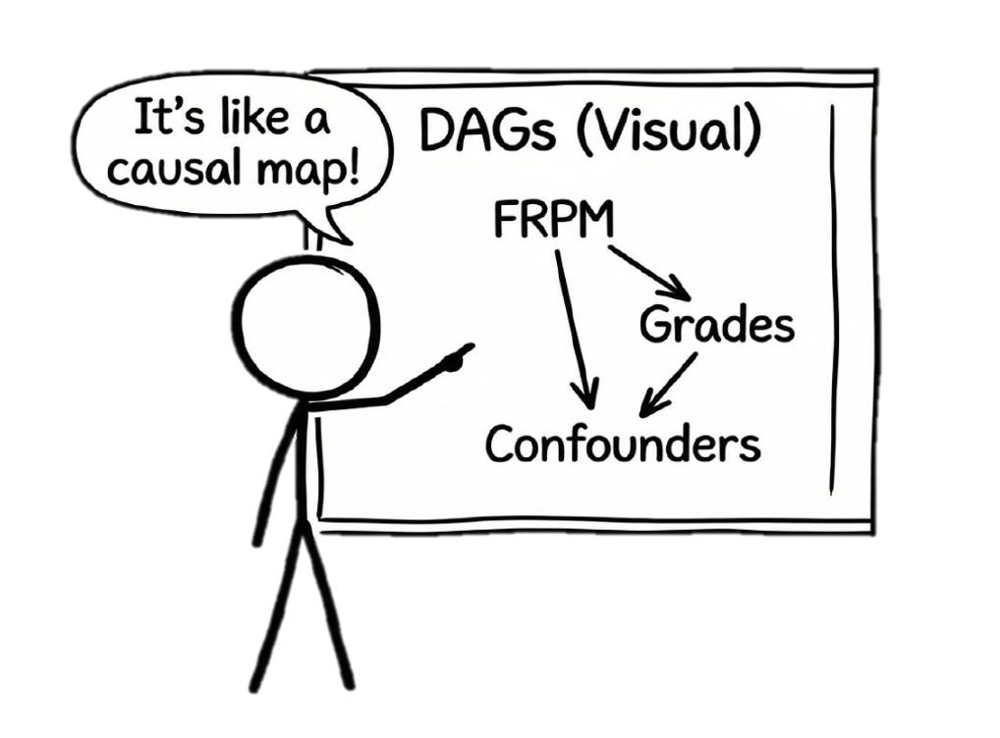

*Directed Acyclic Graphs (DAGs)* and *Structural Causal Models (SCMs)* are complementary frameworks for thinking about causality. 

DAGs provide a visual, graphical representation of causal assumptions, while SCMs formalize these relationships mathematically. Together, they help us identify whether certain statistical strategies can support valid estimation of causal effects from observational data.

This tutorial introduces the key concepts, moving from basic graph terminology through to identifying causal effects using the backdoor criterion. Throughout this tutorial, we'll use a running example from education research studying the causal impact of participating in Free and Reduced-Price Meals (FRPM) on high school grades (adapted from Feng, 2024).



**Motivating Example**: Does participating in FRPM improve high school academic performance? This is a classic observational study where students self-select into the program based on family income and household size, creating confounding that need to be addressed for valid causal inference.

> Feng, Y. (2024). Introduction to causal graphs for education researchers. *Asia Pacific Education Review*, 25(3), 595-609.

## 1. What Are DAGs?

A **Directed Acyclic Graph (DAG)** is a graphical representation of causal relationships where:

- Each **node** (vertex) represents a variable in the model
- **Directed edges** (arrows) represent causal relationships running from cause to effect
- The graph is **acyclic**: you can never follow directed paths from a node back to itself
- The **absence of arrows** communicates independence between variables

**Key Purpose**: DAGs help us communicate assumptions about causal structure and identify which design/statistical strategies might support valid causal estimation.

```{r, echo = TRUE, message=FALSE, warning=FALSE}
library(ggdag)
library(ggplot2)

# Simple DAG example: FRPM → GPA
dag1 <- dagify(
  GPA ~ FRPM,
  exposure = "FRPM",
  outcome = "GPA",
  labels = c(
    FRPM = "FRPM\nParticipation",
    GPA = "High School\nGPA"
  )
)

ggdag(dag1) + theme_dag() +
  labs(title = "Simple DAG: Does FRPM Participation Improve Grades?",
       subtitle = "The focal treatment effect we want to identify")
```

## 2. DAG Terminology

Understanding DAG terminology is essential for reading and constructing causal graphs:

- **Parents**: For a given node, the direct causes feeding into it (nodes with arrows pointing to it)
- **Children**: Direct effects of a given node (nodes receiving arrows from it)
- **Ancestors**: All nodes that can reach a given node through a directed path
- **Descendants**: All nodes that can be reached from a given node through a directed path
- **Root nodes**: Nodes with no parents on the graph (exogenous variables)
- **Paths**: Any series of connected nodes, regardless of arrow direction
- **Directed paths**: Paths where all arrows point in the same direction

```{r, message=FALSE, warning=FALSE}
frpm_dag <- dagify(
  GPA ~ FRPM + FI + PE,
  FRPM ~ FI + HS,
  HS ~ PE + FI,
  FI ~ PE,
  exposure = "FRPM",
  outcome = "GPA",
  labels = c(
    FRPM = "FRPM",
    GPA = "GPA", 
    FI = "Family\nIncome",
    HS = "Household\nSize",
    PE = "Parent\nEducation"
  )
)

ggdag(frpm_dag) +
  theme_dag() +
  labs(title = "FRPM and GPA with Observed Confounders")
```

**Example**: In the path Family Income → FRPM → GPA:

- Family Income is the parent of both FRPM and GPA
- FRPM is a child of Family Income and parent of GPA
- Family Income is an ancestor of GPA (through multiple paths)
- GPA is a descendant of all other variables

## 3. Structural Causal Models (SCMs)

A **Structural Causal Model** formalizes the causal relationships depicted in a DAG. An SCM consists of:

1. A set of **observed variables** 
2. A set of **unobserved exogenous variables** $\{U\}$
3. **Functions** that relate them: $f(\cdot)$
4. An **assumed distribution** over the exogenous variables: $p(U)$

**Example SCM for FRPM Study**:

$$
\begin{align}
PE_i &= f_{PE}(U_i, E_{PE_i}) \\
FI_i &= f_{FI}(PE_i, U_i, E_{FI_i}) \\
HS_i &= f_{HS}(PE_i, FI_i, U_i, E_{HS_i}) \\
FRPM_i &= f_{FRPM}(HS_i, FI_i, E_{FRPM_i}) \\
GPA_i &= f_{GPA}(FRPM_i, PE_i, FI_i, U_i, E_{GPA_i})
\end{align}
$$

where:
- $PE$ = Parent education
- $FI$ = Family income  
- $HS$ = Household size
- $FRPM$ = Participation in free/reduced-price meals
- $GPA$ = High school GPA
- $U_i$ = Unobserved confounders (e.g., structural inequity, historical adversity)
- $E$ terms = Idiosyncratic errors (mutually independent)


::: {.callout-note}
The SCM specifies how each variable is generated from its parents and exogenous noise. The DAG visualizes this causal structure. Note that the functions $f(\cdot)$ are nonparametric—they don't assume any specific functional form (linear, exponential, etc.).
:::

## 4. Understanding Paths: Chains, Forks, and Colliders

To understand when variables are associated, we need to understand three fundamental path structures:

### 4.1 Chain: $A \rightarrow B \rightarrow C$

```{r}
chain_dag <- dagify(C ~ B, B ~ A)
ggdag(chain_dag) +
  theme_dag() +
  labs(title = "Chain Structure")
```

- **Marginally**: $A$ and $C$ are associated (information flows through $B$)
- **Conditionally**: $A \perp\!\!\!\perp C \mid B$ (conditioning on $B$ blocks the path)

### 4.2 Fork: $A \leftarrow B \rightarrow C$

```{r}
fork_dag <- dagify(A ~ B, C ~ B)
ggdag(fork_dag) +
  theme_dag() +
  labs(title = "Fork Structure (Common Cause)")
```

- **Marginally**: $A$ and $C$ are associated (common cause $B$)
- **Conditionally**: $A \perp\!\!\!\perp C \mid B$ (conditioning on $B$ blocks the spurious path)

### 4.3 Collider: $A \rightarrow B \leftarrow C$

```{r}
collider_dag <- dagify(B ~ A + C)
ggdag(collider_dag) +
  theme_dag() +
  labs(title = "Collider Structure")
```

- **Marginally**: $A \perp\!\!\!\perp C$ (path is naturally blocked at the collider)
- **Conditionally**: $A$ and $C$ become associated when conditioning on $B$ or its descendants

::: {.callout-warning}
Conditioning on a collider **opens** a path and can introduce bias.
:::

## 5. d-Separation

**d-separation** (directional separation) formalizes when we can claim conditional independence between variables based on the graph structure.

**Definition**: Nodes $A$ and $C$ are **d-separated** by a set $Z$ if and only if:

1. $A$ and $C$ are connected by a **chain** ($A \rightarrow B \rightarrow C$) or **fork** ($A \leftarrow B \rightarrow C$) such that $B \in Z$, OR
2. $A$ and $C$ are connected by a **collider** ($A \rightarrow B \leftarrow C$) such that neither $B$ nor any descendant of $B$ is in $Z$

**Implication**: If $A$ and $C$ are d-separated by $Z$, then $A \perp\!\!\!\perp C \mid Z$ in any dataset generated by that graph.

**Summary**:

- Variables become associated through: (i) one causing another, (ii) common causes, (iii) conditioning on common consequences
- We can achieve independence by: (i) blocking common causes/chains via conditioning, (ii) not conditioning on colliders

## 6. Interventions and the do-Operator

### 6.1 Seeing vs. Doing

**The Cardinal Sin of Causal Inference**: Assuming that "how the distribution would look if we made $D=d$" is the same as "the distribution we observe where $D=d$ already."

- **Observational** ($P(Y|X=x)$): The distribution of $Y$ when we *observe* $X=x$ 
- **Interventional** ($P(Y|do(X=x))$): The distribution of $Y$ if we *set* $X=x$ for everyone

**Key Distinction**: 

- When we **condition**, we narrow our focus to existing cases with $X=x$ (changes our perception)
- When we **intervene**, we change the system itself by fixing $X=x$ (changes the world)


### 6.2 The do-Operator

The **do-operator** represents a hypothetical intervention: $do(D=d)$ means setting treatment $D$ to value $d$ for all units.

**Average Treatment Effect**:
$$\text{ATE} = E[Y|do(D=1)] - E[Y|do(D=0)]$$

### 6.3 Modified Graphs Under Intervention

When we perform $do(A=a)$, we create a modified SCM/graph where:

1. All arrows **into** $A$ are removed (parents no longer cause $A$)
2. $A$ is set to the constant value $a$

```{r}
# Original graph
orig <- dagify(Y ~ A + X, A ~ X)
ggdag(orig) + 
  theme_dag() + 
  labs(title = "Original Graph: X → A → Y with X → Y")

# After do(A=a) - arrows into A are removed
intervened <- dagify(Y ~ A + X)
ggdag(intervened) + 
  theme_dag() + 
  labs(title = "After do(A=a): Remove X → A arrow")
```

**Example**: Ice cream sales ($A$), crime ($Y$), and temperature ($X$):

- Original: $X \rightarrow A \rightarrow Y$ and $X \rightarrow Y$
- After $do(A=a)$: Remove $X \rightarrow A$, leaving only direct effects through $A$

### 6.4 From Modified Graphs to Identification

The question becomes: Can we use observational data to recover the interventional distribution $P(Y|do(X=x))$?

This is the **identification problem**.

## 7. Backdoor Criterion and Causal Identification

### 7.1 Frontdoor vs. Backdoor Paths

- **Frontdoor path** from $D$ to $Y$: Begins with an arrow out of $D$ (carries causal effects)
- **Backdoor path** from $D$ to $Y$: Contains an arrow into $D$ (creates spurious association)

We want to:
- Keep frontdoor paths open (they carry the causal effect)
- Block backdoor paths (they create confounding)

### 7.2 Backdoor Criterion

**Definition**: A set of variables $Z$ satisfies the **backdoor criterion** relative to $(D,Y)$ if:

1. No node in $Z$ is a descendant of $D$
2. $Z$ blocks every backdoor path between $D$ and $Y$

**Practical Application**: If $Z$ satisfies the backdoor criterion, then:

$$P(Y|do(d)) = \sum_z P(Y|d,z)P(z)$$

This is the **adjustment formula**: we can identify the causal effect by conditioning on $Z$.

```{r}
# Example: Drug, Blood Pressure, SES, Survival
backdoor_ex <- dagify(
  Live ~ Drug + BP,
  Drug ~ SES,
  BP ~ SES,
  exposure = "Drug",
  outcome = "Live"
)

ggdag(backdoor_ex) + theme_dag() +
  labs(title = "Backdoor Example: Which sets block backdoor paths?",
       subtitle = "SES is unobserved, BP can block the backdoor path")
```

**In this example**:

- Backdoor path: $\text{Drug} \leftarrow \text{SES} \rightarrow \text{BP} \rightarrow \text{Live}$
- If $\text{SES}$ is unobserved, we can condition on $\text{BP}$ to block the path
- Adjustment formula: $P(\text{Live}|do(\text{drug})) = \sum_{bp} P(\text{Live}|\text{drug}, bp)P(bp)$

### 7.3 Applying the Backdoor Criterion: FRPM Example

Let's apply the backdoor criterion to identify the causal effect of FRPM on GPA. Consider the complete DAG with unobserved confounders:

```{r}
# Complete FRPM DAG with unobserved confounder
frpm_complete <- dagify(
  GPA ~ FRPM + FI + PE + U,
  FRPM ~ FI + HS,
  HS ~ PE + FI + U,
  FI ~ PE + U,
  PE ~ U,
  exposure = "FRPM",
  outcome = "GPA"
)

ggdag(frpm_complete) + theme_dag() +
  labs(title = "Complete FRPM DAG with Unobserved Confounder U")
```

**Step 1: Identify all paths between FRPM and GPA**

Causal path:

- FRPM → GPA

Open backdoor (confounding) paths include:

- FRPM ← FI → GPA
- FRPM ← FI ← PE → GPA
- FRPM ← FI ← U → GPA
- FRPM ← HS ← PE → GPA
- FRPM ← HS ← FI → GPA
- FRPM ← HS ← U → GPA
- And many more...

**Step 2: Find variables that block all backdoor paths**

To satisfy the backdoor criterion, we need a set $Z$ that:
1. Blocks all backdoor paths
2. Contains no descendants of FRPM
3. Doesn't open new paths by conditioning on colliders

**Solution**: The set $\{FI, HS\}$ (Family Income and Household Size) satisfies the backdoor criterion.

- Conditioning on FI and HS blocks all the backdoor paths listed above
- Neither FI nor HS is a descendant of FRPM
- While they are colliders on some naturally closed paths, conditioning on both together re-blocks these paths

```{r}
ggdag(frpm_complete) +
  theme_dag() +
  labs(title = "Adjustment Set: {Family Income, Household Size}",
       subtitle = "Conditioning on FI and HS blocks all backdoor paths")
```

**Step 3: Apply the adjustment formula**

$$
\begin{align}
&E[GPA|do(FRPM=1)] - E[GPA|do(FRPM=0)] \\
&= \sum_{fi, hs} E[GPA|FRPM=1, FI=fi, HS=hs] \cdot P(FI=fi, HS=hs) \\
&\quad - \sum_{fi, hs} E[GPA|FRPM=0, FI=fi, HS=hs] \cdot P(FI=fi, HS=hs)
\end{align}
$$

**Alternative adjustment sets**:
- $\{FI, HS, PE\}$ also works (though PE is not necessary once we condition on FI and HS)
- $\{FI\}$ alone is NOT sufficient (doesn't block paths through HS)
- $\{HS\}$ alone is NOT sufficient (doesn't block paths through FI)


## 8. Confounders vs. Colliders

### 8.1 Confounders (Common Causes)

```{r}
confounder_dag <- dagify(
  D ~ X,
  Y ~ X + D,
  exposure = "D",
  outcome = "Y"
)

ggdag(confounder_dag) + theme_dag() +
  labs(title = "Confounder: X is a common cause")
```

**Structure**: $D \leftarrow X \rightarrow Y$

- $X$ creates a spurious association between $D$ and $Y$
- **Solution**: Condition on $X$ to block the backdoor path
- **Effect**: Conditioning removes bias

### 8.2 Colliders (Common Effects)

```{r}
collider_dag2 <- dagify(
  Z ~ D + Y,
  exposure = "D",
  outcome = "Y"
)

ggdag(collider_dag2) + theme_dag() +
  labs(title = "Collider: Z is a common effect")
```

**Structure**: $D \rightarrow Z \leftarrow Y$

- Path is naturally **blocked** (no spurious association)
- **Problem**: Conditioning on $Z$ **opens** the path
- **Effect**: Conditioning introduces collider bias

### 8.3 Combined Example

```{r}
combined_dag <- dagify(
  D ~ X + A,
  Y ~ X + B + D,
  Z ~ D + Y
)

ggdag(combined_dag) + theme_dag() +
  labs(title = "Mixed Structure: Confounder X and Collider Z",
       subtitle = "X: confounder, Z: collider, A: cause of D only, B: cause of Y only")
```

To identify the effect of $D$ on $Y$:

- **Must** condition on $X$ (confounder)
- **Must not** condition on $Z$ (collider)
- Can condition on $A$ or $B$ (but not necessary)

### 8.4 The Danger of Collider Bias: College Enrollment Example

Consider a common scenario in education research: you can only collect data from college students (e.g., a retrospective study). This creates **selection bias** because college enrollment is a collider:

```{r}
# FRPM DAG with college enrollment as collider
frpm_college <- dagify(
  College ~ FRPM + GPA + PE + FI + U,
  GPA ~ FRPM + FI + PE + U,
  FRPM ~ FI + HS,
  HS ~ PE + FI + U,
  FI ~ PE + U,
  PE ~ U,
  exposure = "FRPM",
  outcome = "GPA"
)

ggdag(frpm_college) +
  theme_dag() +
  labs(title = "College Enrollment as a Collider",
       subtitle = "Restricting sample to college students conditions on the collider")
```

**The Problem**: When you restrict your sample to college students, you are conditioning on College Enrollment, which:

1. **Opens collider paths**:
   - FRPM → College ← GPA (creates spurious negative association)
   - FRPM → College ← PE → GPA
   - FRPM → College ← FI → GPA
   - FRPM → College ← U → GPA

2. **Distorts the causal effect**: Among college students, FRPM and GPA may appear negatively correlated even if FRPM actually has a positive causal effect on GPA

**Why?** Students with lower FRPM participation rates might need higher GPAs to get into college, creating a negative association within the selected sample (Berkson's paradox).

**Solution**: Collect data from all high school students, not just those who enrolled in college. If that's impossible, the causal effect may not be identifiable with conditioning methods alone.

**Key Lesson**: Always consider your sampling mechanism. If sample selection depends on both treatment and outcome (or their causes), you've conditioned on a collider.

### 8.5 Mediators: When NOT to Condition

Another important consideration is **mediators** - variables that lie on the causal path between treatment and outcome. Consider school attendance as a mediator:

```{r}
# FRPM with attendance as mediator
frpm_mediator <- dagify(
  Attendance ~ FRPM + U,
  GPA ~ FRPM + Attendance + FI + PE + U,
  FRPM ~ FI + HS,
  HS ~ PE + FI,
  FI ~ PE,
  exposure = "FRPM",
  outcome = "GPA"
)

ggdag(frpm_mediator) + theme_dag() +
  labs(title = "School Attendance as a Mediator",
       subtitle = "Attendance lies on a causal path from FRPM to GPA")
```

**The Causal Paths**:
1. **Direct effect**: FRPM → GPA
2. **Indirect effect**: FRPM → Attendance → GPA

The **total causal effect** includes both paths.

**What Happens If We Condition on Attendance?**

1. **Blocks the indirect effect**: We remove an important part of how FRPM improves GPA
2. **Opens a collider path**: Since Attendance ← U → GPA, conditioning on Attendance creates a spurious association between FRPM and U, leading to bias

**The adjustment set {FI, HS} identifies the total effect. Adding Attendance to this set would:**

- Give us only the direct effect (not the total effect we want)
- Introduce collider bias if there's unobserved confounding between Attendance and GPA

**Rule of thumb**: To estimate the total causal effect, do NOT condition on variables that:

- Lie on causal paths from treatment to outcome (mediators)
- Are descendants of treatment (post-treatment variables)


## Further Reading

- Pearl, J. (2009). *Causality: Models, Reasoning, and Inference* (2nd ed.)
- Pearl, J., Glymour, M., & Jewell, N. P. (2016). *Causal Inference in Statistics: A Primer*
- Hernán, M. A., & Robins, J. M. (2020). *Causal Inference: What If*
- Cunningham, S. (2021). *Causal Inference: The Mixtape*
- Huntington-Klein, N. (2022). *The Effect: An Introduction to Research Design and Causality*
- Feng, Y. (2024). Introduction to causal graphs for education researchers. *Asia Pacific Education Review*, 25(3), 595-609.

---

*This tutorial is based on lecture materials from Stat 256: Causality (UCLA) and EDUC 255C: Introduction to Causal Inference in Education Research (UCLA), Spring 2025.*


