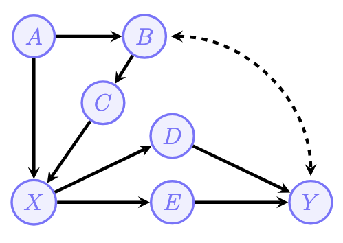
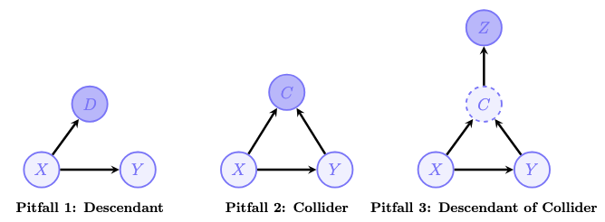
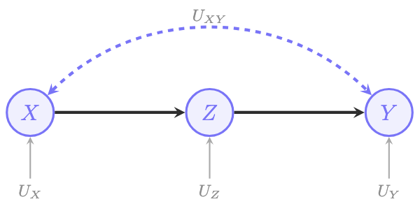
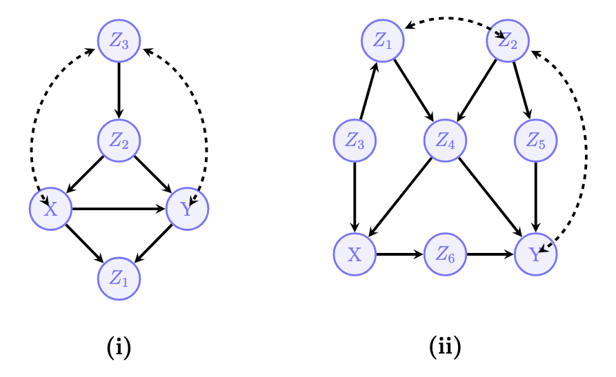
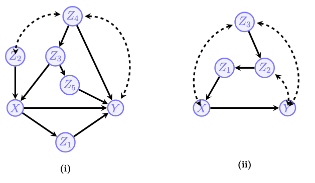
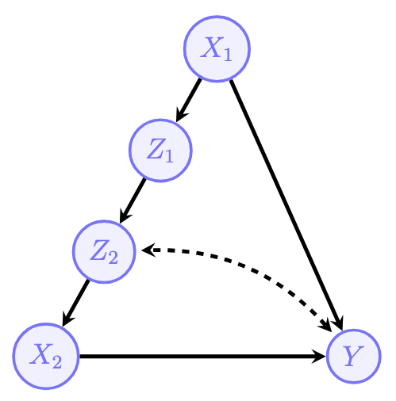
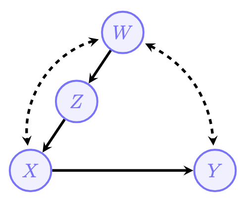
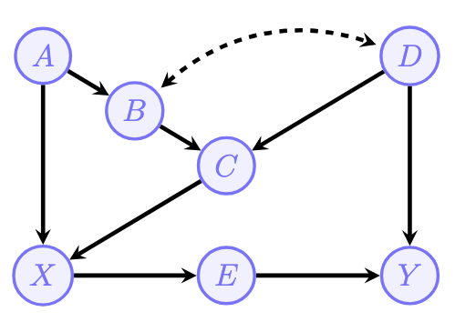

In the [previous post](https://aliceaii.github.io/posts/ci_scm1/), we explored the foundations of Structural Causal Models (SCMs) and how they allow us to formalize causal relationships. We learned that SCMs provide the mathematical machinery to distinguish between *seeing* (observational data) and *doing* (interventions).

But **Can we always compute causal effects from observational data?**

The answer, as we'll discover, is a resounding "it depends." This post takes you on a journey through the identification problem—determining when and how we can express causal effects using only observational data. We'll cover:

1. **The Back-door Criterion**: The workhorse of causal identification
2. **Estimation Methods**: IPW, regression, and doubly-robust approaches  
3. **Front-door Adjustment**: Beyond back-door criterion, an alternative when confounders are unmeasured
4. **Do-Calculus**: The toolkit for causal identification
5. Some exercises to practice our knowledge

::: center

:::

## 1. The Identification Problem

A cornerstone of causal inference is the recognition that knowledge operates within a stratified structure of increasing complexity. Named after UCLA Professor *Judea Pearl*, this system is called the **Pearl Causal Hierarchy (PCH)**, also known as the 'Ladder of Causation'.

### 1.1 What Does "Identification" Mean?

Imagine you're a physician trying to determine whether a new drug (Treatment $X$) actually *causes* improved patient outcomes ($Y$). You have access to observational data—records of who took the drug and what happened to them. 

The "catch" is **confounding**: Patients who chose to take the drug might be healthier, wealthier, or younger than those who didn't. In the data, $X$ and $Y$ are "correlated," but we don't know if $X$ is *driving* $Y$ or if a third variable $Z$ is driving both.

> **The Identification Problem:** Can we compute the effect of an intervention, $P(y \mid do(x))$, using only the observational data $P(\mathbf{v})$ and the qualitative assumptions encoded in our causal graph $G$?

**Causal Effect Identifiability:** The causal effect of $X$ on $Y$ is said to be **identifiable** from a causal diagram $G$ if the quantity $P(y \mid do(x))$ can be computed uniquely from a positive probability of the observed variables.

Formally, for every pair of models $M_1$ and $M_2$ inducing $G$:
$$
P_{M_1}(y \mid do(x)) = P_{M_2}(y \mid do(x)) \quad \text{whenever} \quad P_{M_1}(\mathbf{v}) = P_{M_2}(\mathbf{v}) > 0
$$

::: {.callout-tip}
**The Input-Output View**

Think of causal inference as a transformation:

- **Input (Observed):** The causal graph $G$ and observational distribution $P(\mathbf{v})$  
- **Output (Unobserved):** The interventional distribution $P(\mathbf{v} \mid do(x))$

When the effect is identifiable, this mapping is a **function**—the same input always produces the same output, regardless of which underlying SCM generated it.
:::


### 1.2 The Truncated Factorization Formula

There are two formula that connects interventions to probability distributions. From the previous post, we know that for a **Markovian model** (no hidden confounders):

$$
P(v|do(x)) = \prod_{V_i \in V \setminus X} P(v_i|pa_i) \Big|_{X=x}
$$

This is the truncated factorization formula—we simply remove the term $P(x|pa_X)$ from the standard factorization. Graphically, this corresponds to deleting all arrows pointing into $X$.

For **Semi-Markovian models** (with hidden confounders), the formula generalizes to:

$$
P(v|do(x)) = \sum_u \prod_{V_i \in V \setminus X} P(v_i|pa_i, u_i) P(u) \Big|_{X=x}
$$

The challenge is that this formula involves the unobserved variables $U$, which we cannot compute directly from data. This is where identification criteria come to the rescue. 

### 1.3 Intuition: Why Some Effects Are Identifiable and Others Are Not

Consider two scenarios that illustrate the difference between identifiable and non-identifiable effects.

#### Scenario A: Observable Confounder (Identifiable)
```{mermaid}
%%| fig-cap: "Identifiable case: Observable confounder Z"
flowchart LR
    Z((Z)) --> X((X))
    Z --> Y((Y))
    X --> Y
```

Here, information flows from $X$ to $Y$ along two pathways:

1. **Causal pathway $p_1$:** $X \to Y$ (the direct effect we want)
2. **Spurious pathway $p_2$:** $X \leftarrow Z \to Y$ (confounding we must remove)

**Solution:** To isolate the causal effect, we condition on $Z$ to block the spurious pathway $p_2$, then average over it:

$$
P(y \mid do(x)) = \sum_z P(z) P(y \mid x, z)
$$

This works because $Z$ is **observed**—we can measure it and adjust for it.

#### Scenario B: Latent Confounder (Non-Identifiable)
```{mermaid}
%%| fig-cap: "Non-identifiable case: Latent confounder U_xy"
flowchart LR
    U["Uxy"] -.-> X((X))
    U -.-> Y((Y))
    X --> Y
```

The same flow of information exists:

1. **Causal pathway $p_1$:** $X \to Y$
2. **Spurious pathway $p_2$:** $X \leftarrow U_{xy} \to Y$

**Problem:** We **do not see** the latent confounder $U_{xy}$, and therefore **cannot block** $p_2$. This makes the effect **non-identifiable**—we cannot separate the causal signal ($p_1$) from the confounding noise ($p_2$) using observational data alone.

::: {.callout-warning}
Identification is about whether we have enough **observable structure** in the graph to separate causal pathways from spurious pathways. When confounders are hidden, we lose this ability—unless other graphical structures (like the front-door criterion) come to our rescue.
:::


## 2. The Back-door Criterion

### 2.1 Definition and Intuition

The back-door criterion is perhaps one of the most widely used tool for causal identification. It provides sufficient conditions for when we can adjust for a set of covariates to eliminate confounding bias.

**Definition of Back-door Criterion: **
A set of variables $Z$ satisfies the **back-door criterion** relative to an ordered pair $(X, Y)$ in a DAG $G$ if:

1. **No descendant condition**: No node in $Z$ is a descendant of $X$
2. **Blocking condition**: $Z$ blocks every path between $X$ and $Y$ that contains an arrow *into* $X$ (called "back-door paths")

**The Back-door Adjustment Formula: **

When $Z$ satisfies the back-door criterion, we can identify the causal effect using, this **adjustment formula** (also called the **standardization formula**):

$$
P(y|do(x)) = \sum_z P(y|x, z)P(z)
$$

> Interpretation: we compute the effect of $X$ on $Y$ at each level of $Z$, then average over the *natural* distribution of $Z$ (not conditioned on $X$).

::: {.callout-tip}
**Intuitive Understanding of back-door adjustment:**

The back-door adjustment "breaks" the confounding by:

1. **Conditioning on $Z$**: Within each stratum of $Z$, the back-door paths are blocked
2. **Weighting by $P(z)$**: We use the marginal distribution of $Z$, not $P(z|x)$, which removes the spurious association introduced by treatment selection
:::

### 2.2 Common Pitfalls

Pitfall 1: Conditioning on Descendants of Treatment

Pitfall 2: Conditioning on Colliders

Pitfall 3: Conditioning on Descendants of Colliders

::: center

:::


## 3. Estimation of Causal Effects

Once we've identified a valid adjustment formula, we need to *estimate* causal effect from observational data. This section covers three estimation approaches.

### 3.1 Inverse Propensity Weighting (IPW)

IPW can rewrites the back-door formula. 
$$E[Y|do(X=x)] = \sum_z E[Y|x, z]P(z) = \sum_{z,y} y \frac{P(y, x, z)}{P(x|z)}$$
The term $\pi(z) = P(X=1|Z=z)$ is called the **propensity score**—the probability of receiving treatment given covariates.

The IPW estimator for $E[Y|do(X=x)]$ is:

$$\hat{E}[Y|do(X=x)] = \frac{1}{N} \sum_{i=1}^{N} \frac{Y_i \cdot \mathbf{1}(X_i = x)}{\hat{\pi}_x(Z_i)}$$

where:

- $\hat{\pi}_x(z) = \hat{P}(X=x|Z=z)$ is the estimated **propensity score**
- $\mathbf{1}(X_i = x)$ is an indicator selecting units with treatment $x$

For the Average Treatment Effect (ATE):

$$
\begin{aligned}
\widehat{ATE}_{IPW} &= \hat{E}(y | do(\mathbf{X}=1)) - \hat{E}(y | do(\mathbf{X}=0)) \\
&= \frac{1}{N} \sum_{i=1}^{N} \left( \frac{\mathbf{Y}_i \cdot \mathbb{1}(\mathbf{X}_i = 1)}{\pi(\mathbf{Z}_i)} - \frac{\mathbf{Y}_i \cdot \mathbb{1}(\mathbf{X}_i = 0)}{1 - \pi(\mathbf{Z}_i)} \right) \\
&= \frac{1}{N} \sum_{i=1}^{N} \left( \frac{X_i Y_i}{\hat{\pi}(Z_i)} - \frac{(1-X_i) Y_i}{1 - \hat{\pi}(Z_i)} \right)
\end{aligned}
$$

::: {.callout-tip}
**Intuition: Creating a Pseudo-Population**

IPW creates a "pseudo-population" where treatment assignment is independent of confounders. Individuals with low propensity scores who received treatment are upweighted, while those with high propensity scores are downweighted.

This mimics what would happen in a randomized experiment where $Z$ doesn't influence $X$.
:::

#### Positivity Assumption

IPW requires **positivity**: $0 < P(X=1|Z=z) < 1$ for all $z$. Without this, some individuals have zero probability of receiving treatment, and we can't extrapolate their counterfactual outcomes.

### 3.2 Outcome Regression

An alternative approach focuses on modeling the outcome directly.

Instead of reweighting, we:

1. Fit a model $\hat{\mu}_x(z) = \hat{E}[Y|X=x, Z=z]$ for the expected outcome given treatment and covariates
2. Predict what would happen under each treatment for everyone
3. Average to get the causal effect

$$\hat{E}[Y|do(X=x)] = \frac{1}{N} \sum_{i=1}^{N} \hat{\mu}_x(Z_i)$$

For the ATE:

$$\widehat{ATE}_{reg} = \hat{E}(y | do(\mathbf{X}=1)) - \hat{E}(y | do(\mathbf{X}=0)) = \frac{1}{N} \sum_{i=1}^{N} \left( \hat{\mu}_{x1}(\mathbf{Z_i}) - \hat{\mu}_{x0}(\mathbf{Z_i}) \right)$$
**Comparison with IPW:**

| Aspect | IPW | Outcome Regression |
|--------|-----|-------------------|
| Model | Propensity score $P(X|Z)$ | Outcome $E[Y|X,Z]$ |
| Positivity | Required | Not strictly required |
| High-dimensional Z | Challenging | More flexible |

### 3.3 Augmented IPW (AIPW)

**Double Robustness:**

The AIPW estimator is **consistent** if **either**:

- The propensity model $\hat{\pi}(z)$ is correctly specified, **OR**
- The outcome model $\hat{\mu}_x(z)$ is correctly specified

You only need to get *one* of the two models right.

**The AIPW Estimator:**

The AIPW estimator improves upon IPW by incorporating an outcome model $\mu_x(Z)$, making it "doubly robust". Let the influence function for a single treatment arm be defined as:

$$\phi(V) = \frac{\mathbb{1}(X=x)(Y - \hat{\mu}_x(Z))}{\hat{\pi}_x(Z)} + \hat{\mu}_x(Z)$$

The AIPW estimator is:

$$\hat{E}[Y|do(X=x)] = \frac{1}{N} \sum_{i=1}^{N} \phi(V_i)$$


The AIPW estimator for the ATE is the difference between these counterfactual means:

$$
\begin{aligned}
\widehat{ATE}_{AIPW} &= \hat{E}[Y|do(X=1)] - \hat{E}[Y|do(X=0)] \\
&= \frac{1}{N} \sum_{i=1}^{N} \left( \left[ \frac{X_i(Y_i - \mu_{x_1}(\mathbf{Z}_i))}{\pi(\mathbf{Z}_i)} + \mu_{x_1}(\mathbf{Z}_i) \right] - \left[ \frac{(1 - X_i)(Y_i - \mu_{x_0}(\mathbf{Z}_i))}{1 - \pi(\mathbf{Z}_i)} + \mu_{x_0}(\mathbf{Z}_i) \right] \right)
\end{aligned}
$$

## 4. The Front-door Criterion

### 4.1 Definition and Formula

A set of variables $M$ satisfies the **front-door criterion** relative to $(X, Y)$ if:

1. $M$ intercepts all directed paths from $X$ to $Y$
2. There are no unblocked back-door paths from $X$ to $M$
3. All back-door paths from $M$ to $Y$ are blocked by $X$

When these conditions hold:

$$
P(y|do(x)) = \sum_m P(m|x) \sum_{x'} P(y|x', m) P(x')
$$

### 4.2 Intuition: A Two-Step Argument

The front-door formula breaks the problem into two steps:

1. **Effect of $X$ on $M$**: Since there are no back-door paths from $X$ to $M$, we have $P(m|do(x)) = P(m|x)$ (association = causation!)

2. **Effect of $M$ on $Y$**: The back-door paths from $M$ to $Y$ go through $X$, so we can adjust for $X$: $P(y|do(m)) = \sum_{x'} P(y|m, x')P(x')$

Combining these via the composition of effects yields the formula.

### 4.3 Derivation from First Principles

Let's derive the front-door formula step by step for the graph:

::: center

:::

**The interventional distribution** under $do(X=x)$:
$$P(v|do(x)) = \sum_u P(z|x, u_z)P(y|z, u_{xy}, u_y)P(u)$$

**Key observations** from the graph structure:
1. $(U_{xy} \perp\!\!\!\perp Z | X)$: The confounders affecting $X$ and $Y$ don't influence $Z$ given $X$
2. $(Y \perp\!\!\!\perp X | Z, U_{xy})$: Given $Z$ and the unobserved confounders, $Y$ doesn't depend on $X$

**Simplification**:
$$P(z|x) = \sum_{u_z} P(z|x, u_z)P(u_z)$$ (marginalizing out $U_z$)

For $P(y|z, u_{xy})$, we need to introduce $X'$ as an auxiliary variable:
$$P(y|z, u_{xy}) = \sum_{x'} P(y|z, x', u_{xy})P(x'|u_{xy}) = \sum_{x'} P(y|z, x')P(x')$$

The last equality uses $(Y \perp\!\!\!\perp X | Z, U_{xy})$ and marginalizes $U_{xy}$.

**Final result**:
$$P(y|do(x)) = \sum_z P(z|x) \sum_{x'} P(y|z, x')P(x')$$

## 5. Do-Calculus

**Motivation:** Both back-door and front-door are special cases of a more general framework: **do-calculus**. Developed by Judea Pearl, do-calculus provides three rules that are sound and complete for determining identifiability.

The key insight of do-calculus is: transform a causal query $P(y|do(x))$ into an expression involving **only observational quantities** (no $do(\cdot)$ operators). If we can do this, the effect is **identifiable**. If we can't, it's **not identifiable**.

### 5.1 The Three Rules

Do-calculus consists of three rules that manipulate expressions involving $do(\cdot)$. Each rule is valid under specific graphical conditions involving **mutilated graphs**.

**Graph Notation:** 

Before stating the rules, we need some notation:

- $G_{\overline{X}}$: Graph $G$ with all arrows **into** $X$ removed
- $G_{\underline{X}}$: Graph $G$ with all arrows **out of** $X$ removed
- $G_{\overline{X}\underline{Z}}$: Both operations combined

**Rule 1: Adding/Removing Observations**
$$P(y|do(x), z, w) = P(y|do(x), w) \quad \text{if } (Y \perp\!\!\!\perp Z | X, W)_{G_{\overline{X}}}$$

*When can we ignore an observation?* When $Y$ is independent of $Z$ given $(X, W)$ in the graph where we've removed arrows into $X$.

**Rule 2: Action/Observation Exchange**
$$P(y|do(x), do(z), w) = P(y|do(x), z, w) \quad \text{if } (Y \perp\!\!\!\perp Z | X, W)_{G_{\overline{X}\underline{Z}}}$$

*When can we replace an intervention with an observation?* When $Y$ is independent of $Z$ given $(X, W)$ in the graph where we've removed arrows into $X$ and out of $Z$.

**Rule 3: Adding/Removing Actions**
$$P(y|do(x), do(z), w) = P(y|do(x), w) \quad \text{if } (Y \perp\!\!\!\perp Z | X, W)_{G_{\overline{X}\overline{Z(W)}}}$$

where $Z(W) = Z \setminus an(W)_{G_{\overline{X}}}$ is the subset of $Z$ that are not ancestors of $W$.

*When can we remove an intervention entirely?* When $Y$ is independent of $Z$ given $(X, W)$ in a specific mutilated graph.

::: {.callout-tip}
**Intuition of the Rules:**

**Rule 1** says: if $Z$ doesn't affect $Y$ in the interventional world (where $X$ is set), then observing $Z$ doesn't matter.

**Rule 2** says: if there's no back-door path from $Z$ to $Y$ (after accounting for $X$), then intervening on $Z$ is the same as observing $Z$.

**Rule 3** says: if $Z$ has no causal effect on $Y$ (given $X$ and $W$), then intervening on $Z$ doesn't change anything.
:::


### 5.2 Soundness and Completeness

The remarkable property of do-calculus is it unified the causal identification:

::: {.callout-tip}
**Theorem: Soundness and Completeness**

The quantity $Q = P(y|do(x))$ is identifiable from $P(v)$ and $G$ **if and only if** there exists a sequence of applications of the rules of do-calculus and probability axioms that reduces $Q$ into a do-free expression.
:::

This means do-calculus is **complete**---if an effect can be identified, do-calculus will find a way.

Let's use do-calculus to prove that the back-door adjustment formula works.

**Given**: $Z$ satisfies the back-door criterion relative to $(X, Y)$

**Goal**: Show $P(y|do(x)) = \sum_z P(y|x, z)P(z)$

**Proof**:

*Step 1*: Expand using probability axioms
$$P(y|do(x)) = \sum_z P(y|do(x), z) P(z|do(x))$$

*Step 2*: Apply Rule 3 to $P(z|do(x))$

We need $(Z \perp\!\!\!\perp X)_{G_{\overline{X}}}$. In $G_{\overline{X}}$, arrows into $X$ are removed. Since $Z$ contains no descendants of $X$ (back-door condition 1), and back-door paths are cut, $Z$ and $X$ are d-separated.

$$P(z|do(x)) = P(z)$$

*Step 3*: Apply Rule 2 to $P(y|do(x), z)$

We need $(Y \perp\!\!\!\perp X | Z)_{G_{\underline{X}}}$. In $G_{\underline{X}}$, arrows out of $X$ are removed, cutting the causal path. The only remaining paths are back-door paths, which are blocked by $Z$ (back-door condition 2).

$$P(y|do(x), z) = P(y|x, z)$$

*Step 4*: Combine
$$P(y|do(x)) = \sum_z P(y|x, z) P(z)$$

## 6. Some practical Exercises

### Exercise 1. Applying the Backdoor Criterion

Consider the following definition:

**Definition 1 (Minimal adjustment set).** A minimal adjustment set $Z$ relative to a pair of variables $X$ and $Y$ is a set of variables that satisfies the back-door criterion to find the causal effect of $X$ on $Y$, such that no proper subset of $Z$ satisfies the criterion.

Consider SCMs compatible with the graphs in (a), (b), and (c). Find a minimal adjustment set to compute the causal effect of $X$ on $Y$ and write the corresponding expression for $P(y|do(x))$.

{width="800"}

**Answer:**

(a) $\mathbf{Z} = \emptyset$ is a minimal backdoor admissible set.

$$
P(y \mid do(x)) = P(y \mid x)
$$

(b) There is not set $\mathbf{Z}$ that satisfies the backdoor criterion in this model.

(c) A minimal set is $\mathbf{Z} = \{Z_3, Z_4\}$.

$$
P(y \mid do(x)) = \sum_{Z_3, Z_4} P(y \mid x, z_3, z_4)P(z_3, z_4)
$$

### Exercise 2. Back-door Adjustment I

**A.** Construct a causal diagram $G$ such that a set $Z$ does not satisfy the Back-door criterion relative to $(X, Y)$, but the adjustment formula with the same $Z$ still holds: $$P(y|do(x))=\sum_{z}P(y|x,z)P(z)$$ for every SCM $M$ with causal diagram $G$. For the constructed example, prove that the adjustment formula holds using do-calculus.

**Answer:**

{width="400"}

**Analysis of the Back-door Criterion**

The Back-door Criterion requires a set of $Z$ to satisfy two conditions relative to $(X, Y)$: (1) No node in $Z$ is a descendant of $X$. (2) $Z$ blocks every path between $X$ and $Y$ that contains an arrow into $X$. In the diagram $G$, $Z$ is a child of $X$ ($X \rightarrow Z$).Therefore, $Z$ is a descendant of $X$. Condition 1 is violated. Thus, $Z$ does not satisfy the Back-door criterion.

**Proof using Do-Calculus**

Step 1: Apply Rule 2 (Action to Observation) Rule 2 states that $P(y|do(x)) = P(y|x)$ if $Y \perp\!\!\!\perp_{G_{\underline{X}}} X$.

-   $G_{\underline{X}}$ is the graph where arrows originating from $X$ are removed.
-   Removing $X \rightarrow Y$ and $X \rightarrow Z$ leaves $X$ isolated.
-   Thus, $Y$ is independent of $X$ in $G_{\underline{X}}$. $$P(y|do(x)) = P(y|x)$$

Step 2: Introduce $Z$ via Probability Axioms: We can multiply by the sum over the marginal distribution of any variable $Z$:$$P(y|x) = \sum_{z} P(y|x)P(z)$$

Step 3: Apply Conditional Independence (Rule 1): We need to show $P(y|x) = P(y|x, z)$.Rule 1 states $P(y|do(x), z) = P(y|do(x))$ if $(Y \perp\!\!\!\perp Z | X)_{G_{\overline{X}}}$.

-   Since we already converted $do(x)$ to $x$ in Step 1, we simply check standard d-separation in the original graph (which is compatible with $G_{\overline{X}}$ since there are no arrows into $X$).
-   In $G$ ($Z \leftarrow X \rightarrow Y$), $X$ is a fork. Conditioning on $X$ blocks the path between $Z$ and $Y$.
-   Therefore, $Y \perp\!\!\!\perp Z \mid X$, implying $P(y|x) = P(y|x, z)$.

Step 4: Substitute $P(y|x, z)$ back into the equation from Step 2:$$P(y|do(x)) = \sum_{z} P(y|x, z)P(z)$$

Mathematically: 

$\mathbf{Z} = \{Z\}$ does not satisfy the back-door criterion, but

$$
\begin{align*}
P(y \mid do(x)) &= P(y \mid x) && \text{Rule 2: } (Y \perp\!\!\perp X)_{\mathcal{G}_{\underline{X}}} \\
&= P(y \mid x) \sum_{z} P(z) && \text{Multiply by 1} \\
&= \sum_{z} P(y \mid x)P(z) && \text{Move term into the sum} \\
&= \sum_{z} P(y \mid x, z)P(z) && (Y \perp\!\!\perp Z \mid X)
\end{align*}
$$

**B.** Consider the causal diagrams provided in the assignment. For each case find a minimal back-door admissible (if one exists) set to compute the causal effect of $X$ on $Y$, and write the corresponding expression for $P(y|do(x))$.

{width="600"}

**Answer:** 

* (i) There is no set that satisfies the backdoor criterion in this model.
* (ii) A minimal set is $\mathbf{Z} = \{Z_3, Z_4\}$.
$$
P(y \mid do(x)) = \sum_{Z_3, Z_4} P(y \mid x, z_3, z_4)P(z_3, z_4)
$$


**C.** Prove the Back-door criterion using do-calculus.

**Answer:**

Suppose $\mathbf{Z}$ satisfies the Back-door criterion relative to $\mathbf{X}$ and $\mathbf{Y}$ in $\mathcal{G}$.

$$
\begin{align}
P(y \mid do(x)) &= \sum_{\mathbf{z}} P(y \mid do(x), \mathbf{z})P(\mathbf{z} \mid do(x)) && \text{Condition on } \mathbf{Z}  \\
&= \sum_{\mathbf{z}} P(y \mid do(x), \mathbf{z})P(\mathbf{z}) && \text{Rule 3: } (\mathbf{Z} \perp\!\!\perp \mathbf{X})_{\mathcal{G}_{\overline{\mathbf{X}}}}  \\
&= \sum_{\mathbf{z}} P(y \mid x, \mathbf{z})P(\mathbf{z}) && \text{Rule 2: } (\mathbf{Y} \perp\!\!\perp \mathbf{X} \mid \mathbf{Z})_{\mathcal{G}_{\underline{\mathbf{X}}}} 
\end{align}
$$

Conditioning holds for any probability distribution. Rule 3 is licensed by the separation statement $(\mathbf{Z} \perp\!\!\perp \mathbf{X})$ in $\mathcal{G}_{\overline{\mathbf{X}}}$. By condition (a) of the BD criterion, we know that no variable in $\mathbf{Z}$ is a descendant of $\mathbf{X}$ and since all paths with arrows into $\mathbf{X}$ are disconnected in $\mathcal{G}_{\overline{\mathbf{X}}}$ any path between $X \in \mathbf{X}$ and $Z \in \mathbf{Z}$ starts with an arrow going out of $X$ and find a collider before reaching $Z$, otherwise $Z$ would be a descendant of $\mathbf{X}$. But such collider must be inactive because nothing is being conditioned on. We conclude there is no path contradicting the required separation.

For Rule 2 we need $(\mathbf{Y} \perp\!\!\perp \mathbf{X} \mid \mathbf{Z})_{\mathcal{G}_{\underline{\mathbf{X}}}}$ which is precisely condition (b), since in $\mathcal{G}_{\underline{\mathbf{X}}}$ only the backdoor paths remain.

### Exercise 3. Back-door Adjustment II

**A.** Consider the causal diagrams provided in the assignment. For each case find a minimal back-door admissible (if one exists) set to compute the causal effect of $X$ on $Y$, and write the corresponding expression for $P(y|do(x))$.

{width="600"}

**Answer:**

(i) $\mathbf{Z} = \{Z_2, Z_3\}$, $$P(y|do(x)) = \sum_{z_2, z_3} P(y|x, z_2, z_3)P(z_2, z_3)$$

(ii) There is not set $\mathbf{Z}$ that satisfies the backdoor criterion in this model.

**B.** Consider the causal diagram $G$ provided in the assignment (where $X=\{X_{1},X_{2}\}$). The goal is to identify the effect of $X=\{X_{1},X_{2}\}$ on $Y$.
    -   First, determine whether there exists a set $Z$ that satisfies the back-door criterion.
    -   Second, using the rules of do-calculus, show that: $$P(y|do(x_{1},x_{2}))=\sum_{z_{1},z_{2}}P(y|x_{1},x_{2},z_{1},z_{2})P(z_{1},z_{2})$$

{width="300"}

**Answer:**

There is no set $Z$ that satisfies the back-door criterion for $X=\{X_1, X_2\}$ because all potential adjusters ($Z_1, Z_2$) are descendants of the treatment $X_1$.

Derive the probability $P(y|do(x_1, x_2))$ using the 3 rules of do-calculus.

**Step 1:** Expansion via Probability Axioms

We start by expanding the term over the variables $Z_1, Z_2$ using the Law of Total Probability:

$$
P(y|do(x_1, x_2)) = \sum_{z_1, z_2} P(y|do(x_1, x_2), z_1, z_2) P(z_1, z_2|do(x_1, x_2))
$$

**Step 2:** Analyze the First Term $P(y|do(x_1, x_2), z_1, z_2)$

We apply **Rule 2 (Action/Observation exchange)**. We check if $Y \perp\!\!\!\perp \mid Z$ in the graph $G_{\underline{X}}$ (where arrows *originating* from $X$ are removed).

-   Removing arrows $X_1 \rightarrow Z_1$, $X_1 \rightarrow Y$, and $X_2 \rightarrow Y$ leaves only the back-door path $X_2 \leftarrow Z_2 \dashrightarrow Y$.
-   By conditioning on $Z_2$ (which is in our set $Z$), this back-door path is blocked.
-   Therefore, the intervention $do(X)$ can be exchanged for observation $X$:

$$
P(y|do(x_1, x_2), z_1, z_2) = P(y|x_1, x_2, z_1, z_2)
$$

**Step 3:** Analyze the Second Term $P(z_1, z_2|do(x_1, x_2))$

We apply **Rule 3 (Adding/Removing of Actions)**.

1.  **Removing** $do(x_2)$:
    -   In the graph, arrows point $Z_2 \rightarrow X_2$. There is no path from $X_2$ to $Z_1$ or $Z_2$.
    -   Thus, $Z$ is independent of $X_2$ in the graph where arrows into $X_2$ are removed.
    -   $P(z_1, z_2|do(x_1), do(x_2)) = P(z_1, z_2|do(x_1))$.
2.  **Handling** $do(x_1)$:
    -   In the graph $G$, $X_1$ is a parent of $Z_1$ ($X_1 \rightarrow Z_1$).
    -   Under the intervention $do(x_1)$, the relationship $X_1 \rightarrow Z_1$ remains intact (since $X_1$ is a root node).
    -   Therefore, we replace the intervention with the observation:
    -   $P(z_1, z_2|do(x_1)) = P(z_1, z_2|x_1)$.

**Step 4:** Final Expression

Substituting these results back into the expansion from Step 1:

$$\begin{aligned}
P(y|do(x_1, x_2)) &= \sum_{z_1, z_2} \underbrace{P(y|do(x_1, x_2), z_1, z_2)}_{\text{Step 2}} \underbrace{P(z_1, z_2|do(x_1, x_2))}_{\text{Step 3}} \\
&= \sum_{z_1, z_2} P(y|x_1, x_2, z_1, z_2) P(z_1, z_2|x_1)
\end{aligned}$$

Mathematically:

$$
\begin{align}
P(y \mid do(x_1, x_2)) & \\
&= P(y \mid do(x_1, x_2, z_1)) && \text{R3: } (Y \perp\!\!\perp Z_1 \mid X_1, X_2)_{\mathcal{G}_{\overline{X_1 X_2 Z_1}}} \\
&= \sum_{z_2} P(y \mid z_2, do(x_1, x_2, z_1))P(z_2 \mid do(x_1, x_2, z_1)) && \text{marginalize } Z_2  \\
&= \sum_{z_2} P(y \mid x_1, x_2, z_1, z_2)P(z_2 \mid do(x_1, x_2, z_1)) && \text{R2: } (Y \perp\!\!\perp X_1, X_2, Z_1 \mid Z_2)_{\mathcal{G}_{\overline{Z_2}\underline{X_1 X_2 Z_1}}} \\
&= \sum_{z_2} P(y \mid x_1, x_2, z_1, z_2)P(z_2 \mid do(z_1)) && \text{R3: } (Z_2 \perp\!\!\perp X_1, X_2 \mid Z_1)_{\mathcal{G}_{\overline{Z_1 X_1 X_2}}} \\
&= \sum_{z_2} P(y \mid x_1, x_2, z_1, z_2)P(z_2 \mid z_1) && \text{R2: } (Z_2 \perp\!\!\perp Z_1)_{\mathcal{G}_{\underline{Z_1}}} \\
&= \sum_{z_1, z_2} P(y \mid x_1, x_2, z_1, z_2)P(z_2 \mid z_1)P(z_1)  \\
&= \sum_{z_1, z_2} P(y \mid x_1, x_2, z_1, z_2)P(z_1, z_2)
\end{align}
$$


### Exercise 4. Do-Calculus Rules

Consider the causal diagram involving $X, Y, Z, W$.

{width="300"}

**A.** Explain why neither $Z$, $W$, nor $\{Z, W\}$ are back-door admissible sets for the causal effect of $X$ on $Y$.

**Answer:**

To be **back-door admissible**, a set $S$ must block all "back-door" paths (paths with an arrow into $X$) between $X$ and $Y$ without opening any colliders.

**1. Why** $\{Z\}$ is not admissible:

-   There is a back-door path: $X \leftrightarrow W \leftrightarrow Y$ (where dashed lines represent hidden confounding paths, effectively $X \leftarrow U_1 \rightarrow W \leftarrow U_2 \rightarrow Y$).
-   Conditioning on $Z$ does not block this path because $Z$ is not on the path.

**2. Why** $\{W\}$ is not admissible:

-   Consider the same back-door path $X \leftrightarrow W \leftrightarrow Y$.
-   The node $W$ acts as a **collider** on this path. The implicit structure of the bidirected edges is $X \leftarrow U_1 \rightarrow \mathbf{W} \leftarrow U_2 \rightarrow Y$, meaning arrows point *into* $W$.
-   Conditioning on a collider **opens** the path (creating a dependency between the hidden confounders).

**3. Why** $\{Z, W\}$ is not admissible:

-   This set includes $W$.
-   As established above, conditioning on $W$ opens the confounding path $X \leftrightarrow W \leftrightarrow Y$.

**B.** Derive the identification expression for $P(y|do(x))$ using the rules of do-calculus. *Hint: In the first step, justify adding* $do(w)$, $do(z)$ to $P(y|do(x))$. Then, note that $do(x)$ in the $do(w)do(z)$ is the same as $see(x)$. Finally, use the law of conditional probability to compute the numerator and the denominator.

**Answer:** Following is the graph $G_{\overline{X}\overline{WZ}}$.

{width="400"}

**Step 1: Add Interventions (Rule 3)**

We invoke **Rule 3** of do-calculus to add the interventions $do(w)$ and $do(z)$:

$$
P(y \mid do(x)) = P(y \mid do(x), do(z), do(w))
$$

**Step 2: Exchange Action for Observation (Rule 2)**

We invoke **Rule 2** of do-calculus to replace the intervention $do(x)$ with the observation $x$, since all paths from $X$ to $Y$ are causal in the $do(z, w)$ world:

$$
P(y \mid do(x), do(z), do(w)) = P(y \mid x, do(z), do(w))
$$

**Step 3: Expansion and Derivation**

We rewrite the expression using the definition of conditional probability:

$$
P(y \mid x, do(z), do(w)) = \frac{P(y, x \mid do(z), do(w))}{P(x \mid do(z), do(w))}
$$

**Numerator Analysis:**
First, we apply **Rule 3** to remove $do(w)$, as $W$ does not affect $\{Y, X\}$ once $Z$ is intervened upon (or more formally, observing the independence conditions in the graph):

$$
P(y, x \mid do(z), do(w)) = P(y, x \mid do(z))
$$

Next, we compute $P(y, x \mid do(z))$. We note that $W$ is a valid back-door set for the effect of $Z$ on $\{X, Y\}$. Thus, we expand on $W$ and apply **Rule 2**:

$$
P(y, x \mid do(z), do(w)) = \sum_{w} P(y, x \mid z, w)P(w)
$$

**Denominator Analysis:**
The same logic applies to the denominator. We remove $do(w)$ via Rule 3 and apply the back-door criterion with $W$ for the effect of $Z$ on $X$:

$$
P(x \mid do(z), do(w)) = \sum_{w} P(x \mid z, w)P(w)
$$

**Final Expression:**
Putting the numerator and denominator together:

$$
P(y \mid do(x)) = \frac{\sum_{w} P(y, x \mid z, w)P(w)}{\sum_{w} P(x \mid z, w)P(w)}
$$


### Exercise 5. Changing the Granularity of the Model

Consider the causal diagram $G$ involving variables $A, B, C, D, E, X, Y$.

{width="400"}

**A.** Determine whether the causal effect $P(y|do(x))$ is identifiable; if so, show how.

**Answer:**

There are several choices here, for instance

$$
P(y \mid do(x)) = \sum_{a,c} P(y \mid x, a, c)P(a, c)
$$

due to the back-door criterion and the fact that $\{A, C\}$ admissible. Or simply because this is the adjustment by the parents. We could also have

$$
P(y \mid do(x)) = \sum_{e} P(e \mid x) \sum_{x'} P(y \mid e, x')P(x')
$$

since $E$ is front-door admissible. We could also derive some expressions with do-calculus.


**B.** Write a SCM $M$ that induces this causal diagram and a probability distribution $P(V)$ such that for every $v$, $P(v)>0$. You don't need to show $P(v)$ in your answer.

**Answer:**

For instance, consider the following model $\mathcal{M}$:

$$
\begin{align*}
\mathbf{V} &= \{X, Y, A, B, C, D, E\} \\
\mathbf{U} &= \{U_b, U_{bd}, U_x, U_y, U_a, U_c, U_e\} \\
\mathcal{F} &= \begin{cases}
f_A = U_a \\
f_B = A \oplus U_{bd} \oplus U_b \\
f_C = B \oplus D \oplus U_c \\
f_D = U_{bd} \\
f_X = A \oplus C \oplus U_x \\
f_E = X \oplus U_e \\
f_Y = E \oplus D \oplus U_y
\end{cases} \\
P(\mathbf{u}) &= \{P(U_b = 1) = P(U_{bd} = 1) = P(U_x = 1) = P(U_y = 1) \\
&= P(U_a = 1) = P(U_c = 1) = P(U_e = 1) = 1/2\}
\end{align*}
$$

**C.** Suppose that in a different study the same system (represented by the SCM $M$) is observed, but only the variables $V^{\prime}=\{X,Y,B,C\}$ are measured. Write a new SCM $\mathcal{M}^{\prime}=\langle V^{\prime},U^{\prime},\mathcal{F}^{\prime},P(u^{\prime})\rangle$ corresponding to the model for this study, based on your answer to the previous question.

**Answer:**

$$
\begin{align*}
V' &= \{X, Y, B, C\} \\
U' &= \{A, D, U_x, U_y, U_c, U_e\} \\
\mathcal{F} &= \begin{cases}
f_B = A \oplus D \\
f_C = B \oplus D \oplus U_c \\
f_X = U_x \oplus A \oplus C \\
f_Y = (X \oplus U_e) \oplus D \oplus U_y
\end{cases} \\
P(\mathbf{u}) &= \{P(A = 1) = P(D = 1) = P(U_x = 1) = P(U_y = 1) \\
&= P(U_c = 1) = P(U_e = 1) = 1/2\}
\end{align*}
$$

**D.** Draw the causal diagram $\mathcal{G^{\prime}}$ corresponding to $\mathcal{M}^{\prime}$. Naturally, since we are talking about the same underlying reality (the SCM you proposed), $\mathcal{M}^{\prime}$ and $V^{\prime}$ have to preserve all the (probabilistic) independencies among the variables in $V^{\prime}$ that were implied in $M$ and $V$.

**Answer:**

{width="400"}


Naturally, since we are talking about the same underlying reality (the SCM you proposed), $\mathcal{M}'$ and $V'$ have to preserve all the (probabilistic) independencies among the variables in $V'$ that were implied in $\mathcal{M}$ and $V$.

**E.** Is the effect $P(y|do(x))$ identifiable from $P(v^{\prime})$ and $\mathcal{G}^{\prime}?$ Specifically, is there a back-door or front-door adjustment set?

**Answer:**

The effect $P(y \mid do(x))$ is not identifiable from the graph induced by $\mathcal{M}'$ and $P(V')$, so there is no admissible sets for back-door adjustment, front-door adjustment, any do-calculus derivation and IDENTIFY fails with this instance.


### Exercise 6. Many Paths Lead to ID

The target causal quantity $P(y|do(x))$ may not be identifiable from $P(V)$ depending on the causal diagram. On the other hand, for identifiable effects, there could be more than one expression that is equal to the effect of interest.

Consider the causal diagram involving variables $A, B, C, D, X, Y, E$.

{width="400"}

Give 5 different functions of the observational distribution $P(v)$ that are equal to the effect $Q$. That is, find 5 different identification expressions. Justify the validity of each expression using the Back-door Criterion, the Front-door criterion, or showing a derivation in do-calculus.

**Answer:**

The diagram contains the following paths between $X$ and $Y$:

**Causal Paths:**

-   $X \rightarrow D \rightarrow Y$
-   $X \rightarrow E \rightarrow Y$

**Back-door Paths:**

-   **Path 1:** $X \leftarrow A \rightarrow B \leftarrow U_{BY} \rightarrow Y$. In this path, $B$ acts as a collider, this path is naturally blocked.
-   **Path 2:** $X \leftarrow C \leftarrow B \leftarrow U_{BY} \rightarrow  Y$. In this path, there are no colliders. This path is open and conveys non-causal association.

Below are 5 distinct functions of the observational distribution $P(v)$ that are equal to the causal effect $P(y|do(x))$.

**1. Back-door Adjustment with** $Z = \{A, C\}$

$$P(y|do(x)) = \sum_{a,c} P(y|x, a, c)P(a, c)$$

**Justification:** To satisfy the Back-door Criterion, we must block the open **Path 2**. Conditioning on $C$ blocks **Path 2**. However, since $C$ is a descendant of the collider $B$ (from **Path 1**), conditioning on $C$ opens **Path 1**. To resolve this, we also condition on $A$, which blocks **Path 1** at its source. Thus, the set $\{A, C\}$ blocks all back-door paths.

**2. Back-door Adjustment with** $Z = \{A, B\}$

$$P(y|do(x)) = \sum_{a,b} P(y|x, a, b)P(a, b)$$

**Justification:** Conditioning on $B$ directly blocks **Path 2**. However, because $B$ is the collider in **Path 1**, conditioning on it opens **Path 1**. We include $A$ in the adjustment set to re-block **Path 1**. The set $\{A, B\}$ therefore satisfies the Back-door Criterion.

**3. Back-door Adjustment with** $Z = \{A, B, C\}$

$$P(y|do(x)) = \sum_{a,b,c} P(y|x, a, b, c)P(a, b, c)$$

**Justification:** If two sets are valid, their union is often valid provided no descendants of $X$ are included. Since $\{A, B\}$ and $\{A, C\}$ are valid adjustment sets, and neither $A, B,$ nor $C$ are descendants of $X$, the set $\{A, B, C\}$ is a valid sufficient set that blocks all back-door paths.

**4. Front-door Adjustment with** $M = \{D, E\}$

$$P(y|do(x)) = \sum_{d,e} P(d,e|x) \sum_{x'} P(y|x', d, e)P(x')$$

**Justification:** The variables $D$ and $E$ satisfy the Front-door Criterion: 1. They intercept all directed paths from $X$ to $Y$. 2. There are no unblocked back-door paths from $X$ to $D$ or $E$. 3. All back-door paths from $\{D, E\}$ to $Y$ are blocked by $X$.

**5. Do-calculus derivation**

$$
\begin{align}
P(y \mid do(x)) &= P(y \mid do(x), do(c)) && \text{R3: } (Y \perp\!\!\perp C \mid X)_{G_{\overline{X},\overline{C}}} \\
&= P(y \mid x, do(c)) && \text{R2: } (Y \perp\!\!\perp X \mid C)_{G_{\overline{C}\underline{X}}} \\
&= \frac{P(y, x \mid do(c))}{P(x \mid do(c))} && \text{Cond. Prob.} \\
&= \frac{\sum_{b} P(y, x \mid do(c), b)P(b \mid do(c))}{\sum_{b} P(x \mid do(c), b)P(b \mid do(c))} && \text{Conditioning on } B \\
&= \frac{\sum_{b} P(y, x \mid c, b)P(b \mid do(c))}{\sum_{b} P(x \mid c, b)P(b \mid do(c))} && \text{R2: } (X, Y \perp\!\!\perp C \mid B)_{G_{\underline{C}}} \\
&= \frac{\sum_{b} P(y, x \mid c, b)P(b)}{\sum_{b} P(x \mid c, b)P(b)} && \text{R3: } (B \perp\!\!\perp C)_{G_{\overline{C}}}
\end{align}
$$


## Further Reading

- E. Bareinboim (2025). [Causal Artificial Intelligence](https://causalai-book.net/)


---

*This tutorial is based on reading/lecture/assignment materials from STATS C160/260: Causal Inference for Health Data taught by Professor [Drago Plecko](https://dplecko.com/), Winter 2026.*

