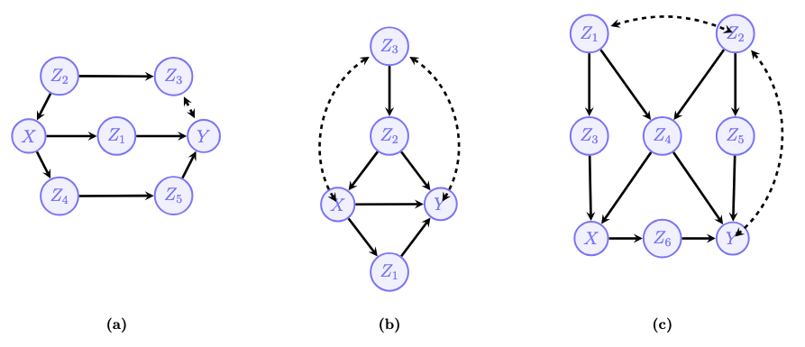
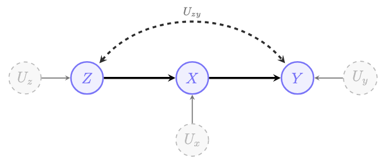
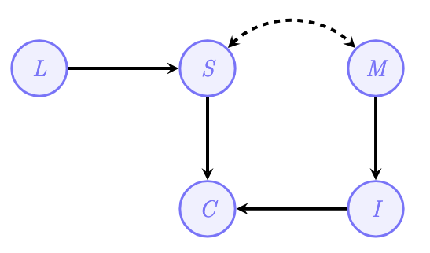
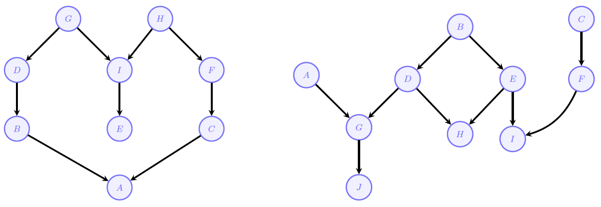
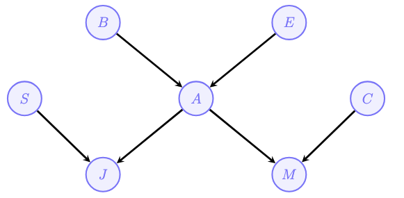
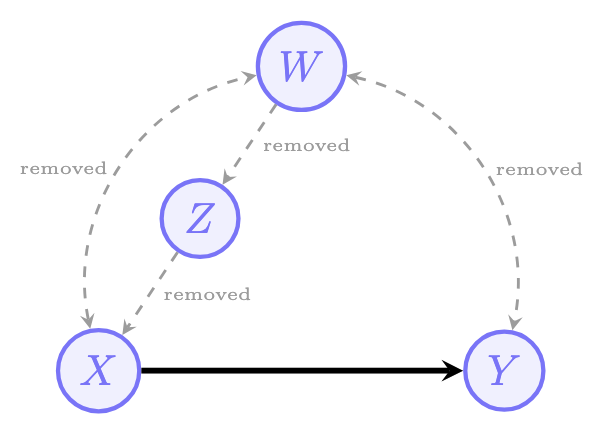
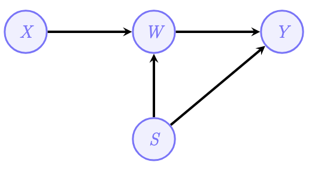

In the [previous post](https://aliceaii.github.io/posts/ci_scm/), we've learnt the foundations of Directed Acyclic Graphs (DAGs) and Structural Causal Models (SCMs). This tutorial builds on those foundations with a deeper dive into the SCM. By the end of this tutorial, you will understand:

- The three levels of Pearl's Causal Hierarchy and why they matter
- How SCMs formally encode causal mechanisms
- How to use d-separation to read independencies from graphs
- When and how causal queries can be identified from data
- How to specify complete SCMs for real-world questions

## 1. Pearl's Causal Hierarchy (PCH)

A cornerstone of causal inference is the recognition that knowledge operates within a stratified structure of increasing complexity. Named after UCLA Professor *Judea Pearl*, this system is called the **Pearl Causal Hierarchy (PCH)**, also known as the 'Ladder of Causation'.

### 1.1 The Three Levels

Every Structural Causal Model (SCM) induces a three-level hierarchy:

| Level | Name | Symbol | Activity | Typical Question | Example |
|:----:|:-----|:------|:-------|:-------------|:--------------|
| **L1** | Associational | $P(y \mid x)$ | **Seeing** | "What is?" How would seeing $X$ change my belief in $Y$? | Is high attendance associated with higher test scores? |
| **L2** | Interventional | $P(y \mid do(x))$ | **Doing** | "What if?" What if I do $X$? | If we mandate after-school tutoring, will grades improve? |
| **L3** | Counterfactual | $P(y_x \mid x', y')$ | **Imagining** | "Why?" What if I had acted differently? | Given that the student failed, would they have passed if they had studied for one more hour? |

**Level 1 (Observational/Associational)**: This is the realm of traditional statistics and machine learning. We observe data and ask questions about correlations and predictions. "Does high classroom attendance predict higher test scores?" This is what most predictive analytics do, they identify patterns without necessarily explaining what causes them.

**Level 2 (Interventional)**: This level asks what happens when we *actively intervene* in the educational system. We move from **seeing** ($P(y|x)$) to **doing** ($P(y|do(x))$). When we merely observe that students who attend tutoring get good grades, that's "seeing." When we mandate that all students attend tutoring, we are "doing", we force $X$ to take the value $x$, changing the mechanism. This is the level of randomized controlled trials and new policy implementation.

**Level 3 (Counterfactual)**: This is the most powerful level, allowing us to reason about what would have happened under different circumstances, even for specific individuals. "Given that this specific student failed the exam, would they have passed if they had studied for one more hour?" This requires reasoning about alternative worlds—imagining a scenario that conflicts with the observed reality (the student didn't study and did fail) to understand individual causality.

**PCH - Comparing to Human Cognitive Capabilities:**

- human: sensors + agency + retrospection
- L1 represents the ability to observe the world and infer the ‘next’ stage
- L2 representes the ability to intervene in the world and change it
- L3 represents the ability to reflect about what we did (and didn't do) and infer new behaviors

## 2. Structural Causal Models

### 2.1 Definition

A **Structural Causal Model (SCM)** $\mathcal{M}$ is a 4-tuple $\langle V, U, \mathcal{F}, P(U) \rangle$, where:

- $V = \{V_1, \ldots, V_n\}$ are **endogenous (observed) variables**
- $U = \{U_1, \ldots, U_m\}$ are **exogenous (unobserved) variables**  
- $\mathcal{F} = \{f_1, \ldots, f_n\}$ are **structural functions** determining $V$:
  $$v_i \leftarrow f_i(pa_i, u_i), \quad Pa_i \subset V, \; U_i \subset U$$
- $P(U)$ is a **probability distribution** over exogenous variables

### 2.2 Three Key Properties of SCMs

Every SCM $\mathcal{M}$ has three fundamental properties:

**Property 1: SCM induces an observational distribution $P(V)$**

The structural functions $\mathcal{F}$ can be seen as a mapping from $U$ to $V$. The observational distribution over endogenous variables is:

$$P_\mathcal{M}(V) = \sum_u P(U=u) \cdot \mathbf{1}[\mathcal{F}(u) = v]$$

This is the joint distribution we would observe if we simply collected data without intervening. In other word, the probability of seeing any data point $V$ is determined by the probability of the background noise ($U$) and the deterministic functions ($\mathcal{F}$) that transform that noise into observable data.

**Property 2: SCM defines a causal diagram**

Every SCM induces a graphical model called a **causal diagram**, constructed as follows:

1. Add a vertex for every endogenous variable $V_i \in V$
2. Add edge $V_j \rightarrow V_i$ if $V_j$ appears as argument of $f_i$
3. Add bidirected edge $V_i \leftrightarrow V_j$ if the corresponding functions share an exogenous variable (i.e., $U_i \cap U_j \neq \emptyset$)

**Property 3: SCM spawns the Pearl Causal Hierarchy**

The SCM generates distributions at all three levels of the PCH. The observational distribution $P(v)$ is L1. Interventional distributions $P(v|do(x))$ form L2. And counterfactual distributions $P(y_x|x', y')$ constitute L3.

### 2.3 Example: A Simple SCM

Consider a simplified model of an after-school reading program:

- Endogenous variables $V$:$X$: Program Participation ($1 =$ attended, $0 =$ did not attend); $F$: Reading Fluency ($1 =$ improved, $0 =$ no improvement), and $Y$: Final Exam Pass ($1 =$ passed, $0 =$ failed)
- Exogenous variables $U$:$U_m$: Student Motivation (determines if they sign up); $U_p$: Prior Preparation (can improve fluency even without the program); $U_t$: Test Taking Ability (can lead to passing even without fluency)
- Structural functions $\mathcal{F}$:
$$\mathcal{M} = \begin{cases}
X \leftarrow U_m \\
F \leftarrow X \lor U_p \\
Y \leftarrow (X \land F) \lor U_t
\end{cases}$$

Interpretation:

- Participation ($X$): Determined solely by student motivation ($U_m$).
- Fluency ($F$): Occurs if the student attended the program ($X$) OR had prior preparation ($U_p$).
- Exam Pass ($Y$): Occurs if the student attended the program AND improved fluency ($X \land F$), or if they have high test-taking ability ($U_t$).

## 3. Conditional Independence(CI) and d-Separation

### 3.1 CI Definitions

Understanding when variables are independent is crucial for causal inference.

**Marginal Independence**: Variables $X$ and $Y$ are **probabilistically independent**, written $X \perp\!\!\!\perp Y$, if:
$$P(Y = y \mid X = x) = P(Y = y)$$

Equivalently: $P(X, Y) = P(X) \cdot P(Y)$

**Conditional Independence**: Variables $X$ and $Y$ are **conditionally independent given $Z$**, written $X \perp\!\!\!\perp Y \mid Z$, if:
$$P(Y = y \mid Z = z, X = x) = P(Y = y \mid Z = z)$$

The structure of an SCM (captured in its causal diagram) constrains which conditional independencies must hold in the observational distribution. This connection between graphical structure and probabilistic independence is formalized through **d-separation**.

### 3.2 d-Separation: Reading Independencies from Graphs

Every path in a DAG can be decomposed into three types of triplets:

#### Chain (Mediation): $X \rightarrow Z \rightarrow Y$

Information flows from $X$ to $Y$ through $Z$.

- **Marginally**: $X$ and $Y$ are **associated** (path is active)
- **Given $Z$**: $X \perp\!\!\!\perp Y \mid Z$ (path is **blocked**)

*Example*: Forgot insulin ($X$) → High glucose ($Z$) → Neuropathy ($Y$). If we know glucose level, knowing about insulin doesn't add information about neuropathy.

#### Fork (Confounding): $X \leftarrow Z \rightarrow Y$

$Z$ is a common cause of both $X$ and $Y$.

- **Marginally**: $X$ and $Y$ are **associated** (spurious correlation through $Z$)
- **Given $Z$**: $X \perp\!\!\!\perp Y \mid Z$ (path is **blocked**)

*Example*: Age ($Z$) causes both hearing impairment ($X$) and osteoarthritis ($Y$). If we know age, hearing and arthritis become independent.

#### Collider (Selection): $X \rightarrow Z \leftarrow Y$

$Z$ is a common effect of both $X$ and $Y$.

- **Marginally**: $X \perp\!\!\!\perp Y$ (path is **blocked** at the collider)
- **Given $Z$**: $X$ and $Y$ become **associated** (path is **opened**!)

*Example*: Talent ($X$) and Beauty ($Y$) both lead to Fame ($Z$). Among famous people, talent and beauty become negatively correlated ("explaining away").

::: {.callout-note}
Colliders behave **opposite** to chains and forks. Conditioning on a collider (or any of its descendants) **opens** a previously blocked path. This is the source of many biases including selection bias, Berkson's paradox, and collider stratification bias.
:::

#### Summary Table: Active vs. Inactive Triplets

| Structure | Unconditioned | Conditioned on $Z$ |
|:-----------------|:--------------|:---------------------|
| Chain: $X \rightarrow Z \rightarrow Y$ | Active (associated) | **Blocked** (independent) |
| Fork: $X \leftarrow Z \rightarrow Y$ | Active (associated) | **Blocked** (independent) |
| Collider: $X \rightarrow Z \leftarrow Y$ | **Blocked** (independent) | Active (associated) |

#### The d-Separation Criterion

To determine if $X \perp\!\!\!\perp Y \mid Z$ using d-separation:

1. **Enumerate all paths** from $X$ to $Y$ in the graph
2. **For each path**, check if it is **active** or **blocked**:
   - A path is **active** if *every* triplet in it is active (given $Z$)
   - A path is **blocked** if *any* triplet in it is blocked
3. **Conclusion**: $X$ and $Y$ are **d-separated** by $Z$ (hence conditionally independent) if and only if **all paths** are blocked

## 4. The Identification Problem

**Definition (Causal Effect Identifiability)**: The causal effect of $X$ on $Y$ is **identifiable** from a causal diagram $G$ if the quantity $P(y \mid do(x))$ can be computed uniquely from the observational distribution $P(V)$.

Formally: For every pair of SCMs $\mathcal{M}_1$ and $\mathcal{M}_2$ that induce the same graph $G$, if $P_{\mathcal{M}_1}(v) = P_{\mathcal{M}_2}(v) > 0$, then $P_{\mathcal{M}_1}(y \mid do(x)) = P_{\mathcal{M}_2}(y \mid do(x))$.

**Intuition**: Identifiability means that the causal effect is determined by (1) the causal structure (the graph) and (2) the observational distribution, without needing to know the specific form of the structural equations.

### 4.1 The Truncated Factorization Formula

In a **Markovian model** (where no unobserved variable affects more than one observed variable), the observational distribution factorizes as:

$$P(v) = \prod_{V_i \in V} P(v_i \mid pa_i)$$

When we intervene with $do(X=x)$, we delete the equation for $X$ and set $X=x$. This gives the **truncated factorization**:

$$P(v \mid do(x)) = \prod_{V_i \in V \setminus X} P(v_i \mid pa_i) \Big|_{X=x}$$

The product excludes variables in $X$ (their equations are deleted), and all remaining terms are evaluated at $X=x$.

**Theorem (Identification in Markovian Models)**: In any Markovian model, the causal effect $P(y \mid do(x))$ is identifiable for any $X, Y \subseteq V$ and is obtained from the truncated factorization.

### 4.2 The Adjustment Formula

A particularly useful result is the **adjustment by parents** formula:

$$P(y \mid do(x)) = \sum_{pa_x} P(y \mid x, pa_x) \cdot P(pa_x)$$

This says: to compute the causal effect, condition on $X$ and all parents of $X$, then marginalize over the parents. This works because conditioning on parents blocks all backdoor paths.

## 5. Some practical Exercises

### Exercise 1. Basic probabilities

Seventy percent of cancer cases in a certain population are diagnosed in an early stage. Of those diagnosed early, 60% of the patients went to routine consultations twice a year, whereas 90% of the patients diagnosed late did not.

**(a)** Suppose a certain person has developed cancer and goes to routine consultations. What is the probability that cancer will be diagnosed early?

**Answer:**

Define the event as: $E$ represents cancer diagnosed early; $L$ means cancer diagnosed lated; and $C$ presents patients goes to routine consultations twice a year. Therefore, we have:

- Given $P(C=1|E=1) = 0.6$, $P(E=0|E=0) = 0.9$, $P(E=1) = 0.7$
- Using Bayes's Theorem, we have:
$$
\begin{aligned}
P(E=1 | C=1) &= \frac{P(E=1, C=1)}{P(C=1)} = \frac{P(C=1 | E=1)P(E=1)}{P(C=1)} \\
&= \frac{P(C=1 | E=1)P(E=1)}{P(C=1 | E=1)P(E=1) + P(C=1 | E=0)P(E=0)} \\
&= \frac{(0.6)(0.7)}{(0.6)(0.7) + (1 - 0.9)(0.3)} = \frac{14}{15} \approx 0.933
\end{aligned}
$$

**(b)** Construct a probability distribution over three random variables $X, Y, Z$ such that $(X \perp\!\!\!\perp Y)$ but $(X \perp\!\!\!\perp Y | Z)$ does not hold. You can either describe the full joint distribution or their conditionals.

**Answer:**

Let's define two independent coin toss experiments, we have:

-   $X \in \{0, 1\}$ result of the first coin (1 represents heads), $P(X = 1) = 0.5$;
-   $Y \in \{0, 1\}$: result of the second coin (1 represents heads), $P(Y = 1) = 0.5$; and
-   $Z$: if at least one of $X$ or $Y$ is heads, then $Z = 1$; otherwise $Z = 0$.

**Verify** $(X \perp\!\!\!\perp Y)$: Since $X$ and $Y$ are tossed independently, their joint distribution is equal to the product of their marginal distributions: $P(X, Y) = P(X)P(Y)$, Therefore, $(X \perp\!\!\!\perp Y)$.

**Verify** $(X \perp\!\!\!\perp | Z)$: When we observe $Z = 1$, if we then know that $X = 0$, then $Y$ must be equal to 1.

-   Without any known information, $P(Y = 1) = 0.5$.
-   Under the condition where $Z = 1$ and $X = 0$ are known:$P(Y = 1 | Z = 1, X = 0) = 1$

Since $P(Y = 1 | Z = 1, X = 0) \neq P(Y = 1 | Z = 1)$, this indicates that given $Z$, information about $X$ changes our knowledge of $Y$.

This $X \rightarrow Z \leftarrow Y$ collider structure proves that two originally unrelated variables can become correlated when conditioned on a common descendant (or its descendant).

### Exercise 2. Estimation and Independence Relations

Consider random variables $X_1, X_2$ and $Y$ and assume our goal is to compute the query $Q = P(y | x_1, x_2)$. We do not have any prior information about the conditional independence relations among these variables.

**(a)** For every one of the following sets of distributions, show how to compute the query $Q$ based on them, or explain why this is not possible:

1.  $P(x_1, x_2), P(y), P(x_1 | y)$ and $P(x_2 | y)$
2.  $P(x_1, x_2), P(y),$ and $P(x_1, x_2 | y)$
3.  $P(x_1 | y), P(x_2 | y),$ and $P(y)$
4.  $P(x_1), P(x_2),$ and $P(x_1, x_2 | y)$
5.  $P(x_1), P(x_2), P(x_1 | y),$ and $P(x_2 | y)$

**(b)** Suppose we learned that $(X_1 \perp\!\!\!\perp X_2 | Y)$ holds in $P$. Now, which of the sets before are sufficient to compute the query $Q$? Show how or explain why it is not possible.

**Answer:** To compute the query $Q = P(y | x_1, x_2)$, we rely on the definition of conditional probability and Bayes' Theorem: $$P(y \mid x_1, x_2) = \frac{P(y, x_1, x_2)}{P(x_1, x_2)} = \frac{P(y)P(x_1, x_2 \mid y)}{P(x_1, x_2)}$$

For (b) part, we have additional information: $P(x_1, x_2 | y) = P(x_1 | y)P(x_2 | y)$.

1.  $P(x_1, x_2), P(y), P(x_1 | y)$ and $P(x_2 | y)$

-   

    (a) Not possible. To compute $Q$, we need joint conditional $P(x_1, x_2 | y)$. Without knowing if $x_1$ and $x_2$ are conditionally indenpendent given $Y$, we cannot get $P(x_1, x_2 | y)$.

-   

    (b) Yes, its possible now. With conditonal independence, we have $P(x_1, x_2 | y) = P(x_1 | y)P(x_2 | y), Q = \frac{P(x_1 | y)P(x_2 | y)P(y)}{P(x_1, x_2)}$. The denominator is provided, and the numerator is reconstructed using the independence assumption.

2.  $P(x_1, x_2), P(y),$ and $P(x_1, x_2 | y)$

-   

    (a) Possible, all ther terms in the Bayes' Theorem are explicitly provided in this set.

-   

    (b) Possible, same reason with (a). The independence doesn't change anything here.

3.  $P(x_1 | y), P(x_2 | y),$ and $P(y)$

-   

    (a) Not possible. Because (1) we cannot compute the required joint $P(x_1, x_2 | y)$ without a conditional independence assumption, and (2) we lack the marginal $P(x_1, x_2)$ for the denominator.

-   

    (b) Yes, compute $P(x_1, x_2) = \sum_{Y} P(x_1, x_2, y) = \sum_{Y} P(x_1, x_2 \mid y)P(y)$ and $P(x_1, x_2 \mid y)$ as shown above. Then, all terms in the second expression from the previous question are estimable.

4.  $P(x_1), P(x_2),$ and $P(x_1, x_2 | y)$

-   

    (a) Not possible. We lack $P(y)$ to compute the numerator, and without an independence assumption $(X_1 \perp\!\!\!\perp X_2)$, we cannot compute the joint denominator $P(x_1, x_2)$.

-   

    (b) Not possible. Even with conditional independence, we still don't have $P(y)$.

5.  $P(x_1), P(x_2), P(x_1 | y),$ and $P(x_2 | y)$

-   

    (a) Not possible. It lacks $P(y)$, we cannot compute $P(x_1, x_2 | y)$ from marginals $P(x_1 | y), P(x_2 | y)$, we cannot obtain the $P(x_1, x_2)$ from the marginals $P(x_1), P(x_2)$ as well.

-   

    (b) Not possible. After considering $P(x_1, x_2 \mid y) = P(x_1 \mid y)P(x_2 \mid y)$ this is equivalent to the previous item and the same reason applies.

### Exercise 3. Query Estimation

Consider the following graphical model $G$ below:

Suppose we want to compute the query $Q = \sum_{Z_1}P(y | x, z_1) P(z_1)$.

::: center
{width="400"}
:::

**(a)** $Q = P(y | x)$ in $G$? Justify your answer.

**Answer:**

No, $Q \neq P(y|x)$. There are two paths from $Z_1$ to $Y$:

Path 1: $Z_1 \to X \to Y$, when we condition on $X$, this path is blocked.

Path 2: $Z_1 \to Z_2 \to Y$, when we condition on $X$, this path is not blocked.

Therefore: $Q = \sum_{z_1} P(y|x, z_1)P(z_1) \neq P(y|x)$.

Intuitive: Even after observing $X$, knowledge of $Z_1$ still provides information about $Y$ through the path $Z_1 \to Z_2 \to Y$. This means $Z_1$ and $Y$ are not conditionally independent given $X$ alone.

**(b)** Suppose we have access to the marginal distribution $P(X, Y, Z_2)$. Is it possible to estimate $Q$? If so, show how to do it. Otherwise, explain why that is not the case.

**Answer:**

Yes, it is possible to estimate $Q$.

$$
\begin{aligned}
Q &= \sum_{Z_1} P(y \mid x, z_1)P(z_1) \\
&= \sum_{Z_1, Z_2} P(y \mid x, z_1, z_2)P(z_2 \mid x, z_1)P(z_1) && \text{Condition on } Z_2 \\
&= \sum_{Z_1, Z_2} P(y \mid x, z_2)P(z_2 \mid x, z_1)P(z_1) && (Y \perp\!\!\!\perp Z_1 \mid Z_2, X) \\
&= \sum_{Z_1, Z_2} P(y \mid x, z_2)P(z_2 \mid z_1)P(z_1) && (Z_2 \perp\!\!\!\perp X \mid Z_1) \\
&= \sum_{Z_2} P(y \mid x, z_2) \sum_{Z_1} P(z_2, z_1) && \text{Chain rule and move summation in} \\
&= \sum_{Z_2} P(y \mid x, z_2)P(z_2) && \text{Sum out } Z_1
\end{aligned}
$$

### Exercise 4. Specifying Structural Causal Models

The following is a description of a clinical decision support (CDS) alert system used in a hospital:

-   The delivery channel location of the alert ($L$) could be via the clinician's phone or via the EHR system and is chosen at random every time with equal likelihood.
-   Based on the clinician's age group ($A$), either a text-only alert or a text+image alert is used as the alert modality ($M$). The age group is either *'less than 40' or '40 or more'*.
-   The clinician will see ($S$) the alert with the following probabilities:
    1.  If $L = \text{phone}$ with probability $1/3$,
    2.  If $L = \text{EHR system}, A = \text{less than 40}$ with probability $1/5$ and
    3.  If $L = \text{EHR system}, A = \text{'40 or more'}$ with probability $1/6$.
-   The clinician will judge the alert to be clinically relevant ($I$) 60% of the time if the modality is text+image, or 40% of the time if the modality is text-only.
-   The clinician has permission to administer the drug ($D$) in 40% of cases.
-   The clinician will administer the drug ($C$) if the alert is seen, judged relevant, and the clinician has permission to administer the drug.

Variables $L, S, M, I$ and $C$ are observable, while $A$ and $D$ are unobservable (other unobservables, which are not mentioned, may be present as well).

**(a)** Specify a structural causal model $\mathcal{M} = \langle V, U, \mathcal{F}, P(U) \rangle$ that captures this setting. Make a reasonable choice for the distribution of $A$ and the way $M$ is determined.

**Answer:**

Endogenous Variables ($V$), $V = \{L, S, M, I, C\}$.

* **$L$ (Location/Device)**: $L=1$ represents 'phone' and $L=0$ represents 'EHR system'.
* **$M$ (Modality)**: Defined by the function $f_M = A \oplus U_m$.
* **$S$ (Seen)**: $S=1$ represents 'alert seen'.
* **$I$ (Importance)**: $I=1$ represents 'alert judged clinically relevant'.
* **$C$ (Administered)**: $C=1$ represents 'drug administered'.

Exogenous Variables ($U$), $U = \{A, D, U_l, U_m, U_{s1}, U_{s2}, U_{s3}, U_{i1}, U_{i2}\}$.

* **$A$ (Age)**: $A=1$ represents '40 or more' and $A=0$ represents 'less than 40'.
* **$D$ (Permission)**: $D=1$ represents 'has permission to administer the drug'.

Structural Functions ($\mathcal{F}$):

$$
\mathcal{F} = \begin{cases} 
f_L = U_l \\
f_M = A \oplus U_m \\
f_S = (L \wedge U_{s1}) \vee (\neg L \wedge ((A \wedge U_{s2}) \vee (\neg A \wedge U_{s3}))) \\
f_I = (M \wedge U_{i1}) \vee (\neg M \wedge U_{i2}) \\
f_C = S \wedge I \wedge D
\end{cases}
$$

Probability Distribution $P(u)$:

* **Marginals**: $P(D=1) = 0.4$, $P(A=1) = 0.2$, $P(U_l=1) = 1/2$, and $P(U_m=1) = 1/4$.
* **Seen ($S$) components**: $P(U_{s1}=1) = 1/3$, $P(U_{s2}=1) = 1/5$, and $P(U_{s3}=1) = 1/6$.
* **Importance ($I$) components**: $P(U_{i1}=1) = 0.6$ and $P(U_{i2}=1) = 0.4$.

**(b)** Draw the causal diagram corresponding to the given SCM.

**Answer:**

::: center
{width="500"}
:::

### Exercise 5. d-Connectedness

Consider the two graphs below, $\mathcal{G}$ (left) and $\mathcal{G'}$ (right).

::: center
{width="800"}
:::

**(a)** List the variables that are d-connected to $A$ given $\{B\}$ in $G$.

**Answer:** $\{C, F, H, I, E\}$

**(b)** List the variables that are d-connected to $A$ given $\{J\}$ in $G'$.

**Answer:** $\{G, D, B, E, I, H\}$

### Exercise 6. d-Separation

Consider the following graphical model and conditional probability tables:

::: center
{width="400"}
:::

| $P(B=1)$ | $P(E=1)$ | $P(S=1)$ | $P(C=1)$ |
|:---:|:---:|:---:|:---:|
| 0.02 | 0.01 | 0.80 | 0.15 |

| $B$ | $E$ | $P(A=1|B,E)$ | $A$ | $C$ | $P(M=1|A,C)$ | $A$ | $S$ | $P(J=1|A,S)$ |
|:---:|:---:|:---:|:---:|:---:|:---:|:---:|:---:|:---:|
| 0 | 0 | 0.01 | 0 | 0 | 0.05 | 0 | 0 | 0.00 |
| 0 | 1 | 0.30 | 0 | 1 | 0.00 | 0 | 1 | 0.00 |
| 1 | 0 | 0.90 | 1 | 0 | 0.85 | 1 | 0 | 0.97 |
| 1 | 1 | 0.98 | 1 | 1 | 0.15 | 1 | 1 | 0.10 |

**(a)** List all d-separation statements that hold assuming that $J=1$.

**Answer:**

Conditioning on $J$ opens the paths $S \leftrightarrow A$. The following variables remain d-separated:

* $(S \perp\!\!\!\perp B, E \mid J, A)$
* $(C \perp\!\!\!\perp B, E, A, S \mid J)$
* $(M \perp\!\!\!\perp B, E, S \mid J, A, C)$

**(b)** Compute the given probabilities using the graph and the probability tables:

1.  $P(M=1)$
2.  $P(J=1|C=0)$
3.  $P(E=1|M=1, B=0)$
4.  $P(M=1|B=1, J=0)$

**Answer:**

**1.** $P(M=1) = \sum_{A,C} P(M=1|A,C) \cdot P(A) \cdot P(C)$

Step 1: Compute $P(A=1)$

$$
\small
\begin{aligned}
P(A=1) &= \sum_{B,E} P(A=1|B,E) \cdot P(B) \cdot P(E) \\
&= P(A=1|B=0,E=0) \cdot P(B=0) \cdot P(E=0) \\
&\quad + P(A=1|B=0,E=1) \cdot P(B=0) \cdot P(E=1) \\
&\quad + P(A=1|B=1,E=0) \cdot P(B=1) \cdot P(E=0) \\
&\quad + P(A=1|B=1,E=1) \cdot P(B=1) \cdot P(E=1) \\
&= 0.01 \times 0.98 \times 0.99 + 0.3 \times 0.98 \times 0.01 + 0.9 \times 0.02 \times 0.99 + 0.98 \times 0.02 \times 0.01 \\
&= 0.030658
\end{aligned}
$$

Therefore: $P(A=0) = 1 - 0.030658 = 0.969342$

Step 2: Compute $P(M=1)$

$$
\small
\begin{aligned}
P(M=1) &= P(M=1|A=0,C=0) \cdot P(A=0) \cdot P(C=0) \\
&\quad + P(M=1|A=0,C=1) \cdot P(A=0) \cdot P(C=1) \\
&\quad + P(M=1|A=1,C=0) \cdot P(A=1) \cdot P(C=0) \\
&\quad + P(M=1|A=1,C=1) \cdot P(A=1) \cdot P(C=1) \\
&= 0.05 \times 0.969 \times 0.85 + 0 \times 0.969 \times 0.15 + 0.85 \times 0.0307 \times 0.85 + 0.15 \times 0.0307 \times 0.15 \\
&= 0.0640
\end{aligned}
$$

**2.** $P(J=1) = \sum_{A,S} P(J=1|A,S) \cdot P(A) \cdot P(S)$

By examining the DAG, we can verify that $(J \perp\!\!\!\perp C)$: $C$ only affects $M$ and there is no path from $C$ to $J$ that is not blocked.

Therefore: $(J=1|C=0) = P(J=1)$

$$
\small
\begin{aligned}
P(J=1) &= P(J=1|A=0,S=0) \cdot P(A=0) \cdot P(S=0) \\
&\quad + P(J=1|A=0,S=1) \cdot P(A=0) \cdot P(S=1) \\
&\quad + P(J=1|A=1,S=0) \cdot P(A=1) \cdot P(S=0) \\
&\quad + P(J=1|A=1,S=1) \cdot P(A=1) \cdot P(S=1) \\
&= 0 \times 0.969 \times 0.2 + 0 \times 0.969 \times 0.8 + 0.97 \times 0.0307 \times 0.2 + 0.1 \times 0.0307 \times 0.8 \\
&= 0.0084
\end{aligned}
$$

**3.** $P(E=1|M=1, B=0) = \frac{P(M=1|E=1,B=0) \cdot P(E=1)}{P(M=1|B=0)}$

Compute $P(A=1|B=0, E)$:
$P(A=1|B=0, E=0) = 0.01, \quad P(A=1|B=0, E=1) = 0.3$

Compute $P(M=1|B=0, E)$ for each value of $E$:

$$
\small
P(M=1|B=0,E) = \sum_{A,C} P(M=1|A,C) \cdot P(A|B=0,E) \cdot P(C)
$$

* **For E=0:**
    $$
    \small
    \begin{aligned}
    P(M=1|B=0,E=0) &= 0.05 \times 0.99 \times 0.85 + 0 \times 0.99 \times 0.15 \\
    &\quad + 0.85 \times 0.01 \times 0.85 + 0.15 \times 0.01 \times 0.15 \\
    &= 0.0495
    \end{aligned}
    $$
* **For E=1:**
    $$
    \small
    \begin{aligned}
    P(M=1|B=0,E=1) &= 0.05 \times 0.7 \times 0.85 + 0 \times 0.7 \times 0.15 \\
    &\quad + 0.85 \times 0.3 \times 0.85 + 0.15 \times 0.3 \times 0.15 \\
    &= 0.2533
    \end{aligned}
    $$

Compute $P(M=1|B=0)$:

$$
\small
\begin{aligned}
P(M=1|B=0) &= P(M=1|B=0,E=0) \cdot P(E=0) + P(M=1|B=0,E=1) \cdot P(E=1) \\
&= 0.049525 \times 0.99 + 0.2533 \times 0.01 \\
&= 0.05156
\end{aligned}
$$

Apply Bayes' Theorem:
$$
\small
P(E=1|M=1,B=0) = \frac{P(M=1|B=0,E=1) \cdot P(E=1)}{P(M=1|B=0)} = \frac{0.2533 \times 0.01}{0.05156} = 0.0491
$$

**4.** $P(M=1|B=1,J=0) = \frac{P(M=1, J=0|B=1)}{P(J=0|B=1)}$

Step 1: Compute $P(A|B=1)$

$$
\small
\begin{aligned}
P(A=1|B=1) &= P(A=1|B=1,E=0) \cdot P(E=0) + P(A=1|B=1,E=1) \cdot P(E=1) \\
&= 0.9 \times 0.99 + 0.98 \times 0.01 \\
&= 0.891 + 0.0098 = 0.9008
\end{aligned}
$$

Therefore: $P(A=0|B=1) = 0.0992$

Step 2: Compute $P(J=0|A)$

$$
\small
\begin{aligned}
P(J=0|A=0) &= P(J=0|A=0,S=0) \cdot P(S=0) + P(J=0|A=0,S=1) \cdot P(S=1) \\
&= 1 \times 0.2 + 1 \times 0.8 = 1
\end{aligned}
$$

$$
\small
\begin{aligned}
P(J=0|A=1) &= P(J=0|A=1,S=0) \cdot P(S=0) + P(J=0|A=1,S=1) \cdot P(S=1) \\
&= 0.03 \times 0.2 + 0.9 \times 0.8 \\
&= 0.006 + 0.72 = 0.726
\end{aligned}
$$

Step 3: Compute $P(M=1|A)$

$$
\small
\begin{aligned}
P(M=1|A=0) &= P(M=1|A=0,C=0) \cdot P(C=0) + P(M=1|A=0,C=1) \cdot P(C=1) \\
&= 0.05 \times 0.85 + 0 \times 0.15 = 0.0425
\end{aligned}
$$

$$
\small
\begin{aligned}
P(M=1|A=1) &= P(M=1|A=1,C=0) \cdot P(C=0) + P(M=1|A=1,C=1) \cdot P(C=1) \\
&= 0.85 \times 0.85 + 0.15 \times 0.15 \\
&= 0.7225 + 0.0225 = 0.745
\end{aligned}
$$

Step 4: Compute $P(M=1, J=0|B=1)$

$$
\small
\begin{aligned}
P(M=1, J=0|B=1) &= \sum_{A} P(M=1|A) \cdot P(J=0|A) \cdot P(A|B=1) \\
&= P(M=1|A=0) \cdot P(J=0|A=0) \cdot P(A=0|B=1) \\
&\quad + P(M=1|A=1) \cdot P(J=0|A=1) \cdot P(A=1|B=1) \\
&= 0.0425 \times 1 \times 0.0992 + 0.745 \times 0.726 \times 0.9008 \\
&= 0.004216 + 0.4872 = 0.4914
\end{aligned}
$$

Step 5: Compute $P(J=0|B=1)$

$$
\small
\begin{aligned}
P(J=0|B=1) &= \sum_{A} P(J=0|A) \cdot P(A|B=1) \\
&= P(J=0|A=0) \cdot P(A=0|B=1) + P(J=0|A=1) \cdot P(A=1|B=1) \\
&= 1 \times 0.0992 + 0.726 \times 0.9008 \\
&= 0.0992 + 0.654 = 0.7532
\end{aligned}
$$

Step 6: Final Calculation

$$
\small
P(M=1|B=1,J=0) = \frac{P(M=1, J=0|B=1)}{P(J=0|B=1)} = \frac{0.4914}{0.7532} = 0.652
$$

### Exercise 7. d-Separating Sets

Let $G$ (shown below) be the causal diagram of some unknown model $M$ and let $P$ be $M$'s observational distribution.

{width="400"}

**(a)** Find a minimal set $A$ (if it exists) that d-separates $X$ and $W$.

**Answer:** $\{Z, S\}$

**(b)** Find a minimal set $A$ (if it exists) that d-separates $X$ and $S$.

**Answer:** $\{\emptyset\}$

**(c)** Find all minimal sets $A$ (if any exists) that d-separate $Z$ and $Y$.

**Answer:** $\{W,T\}, \{W, S\}$

**(d)** Draw a graph $\mathcal{G}'$ over the variables $\{X, S, W, Y\}$ such that:

-   $\mathcal{G}'$ has exactly the same independence as $\mathcal{G}'$ with respect to $P(X, S, W, Y)$, and\
-   $\mathcal{G}'$ has the minimum number of edges while satisfying this constraint in the previous bullet.

*Hint: In the first step, determine which graph is obtained if* $Z$ and $T$ are unobserved, and list the independences implied by this graph. In the second step, consider which of the edges can be removed without affecting any of the independences.

**Answer:**

::: center
{width="400"}
:::

## Further Reading

- Pearl, J. (2009). *Causality: Models, Reasoning, and Inference* (2nd ed.)
- Pearl, J., Glymour, M., & Jewell, N. P. (2016). *Causal Inference in Statistics: A Primer*
- Pearl, J., & Mackenzie, D. (2018). *The book of why: the new science of cause and effect. Basic books*
- Bareinboim, E., Correa, J. D., Ibeling, D., & Icard, T. (2022). *On Pearl’s hierarchy and the foundations of causal inference. In Probabilistic and causal inference: the works of Judea Pearl.*

---

*This tutorial is based on lecture and assignment materials from STATS C160/260: Causal Inference for Health Data taught by Professor [Drago Plecko](https://dplecko.com/), Winter 2026.*

