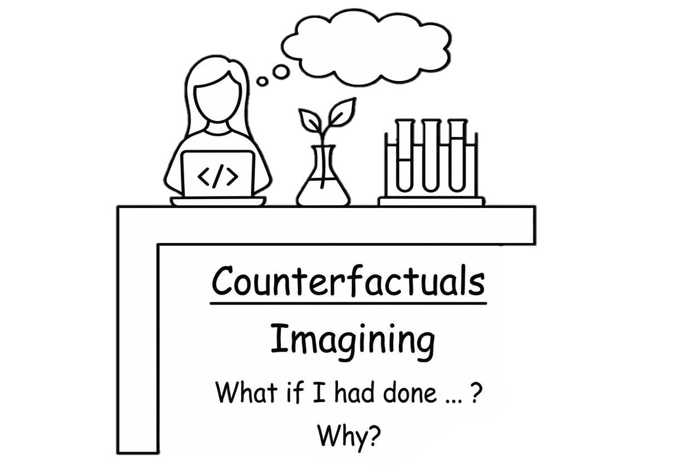
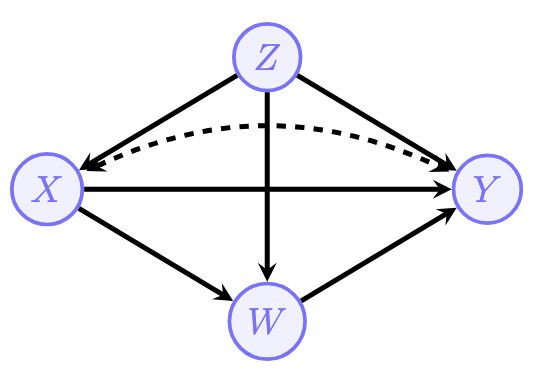
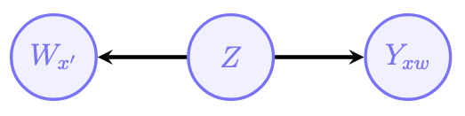
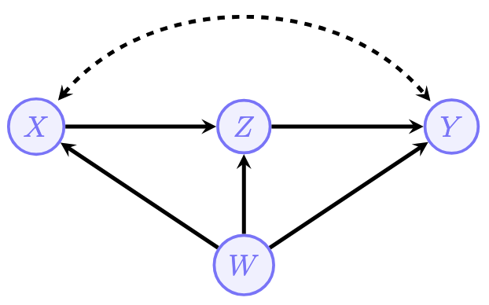
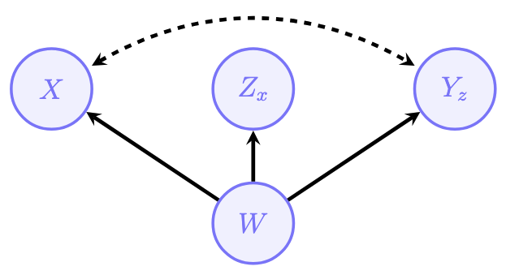
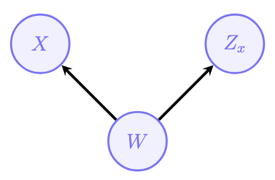
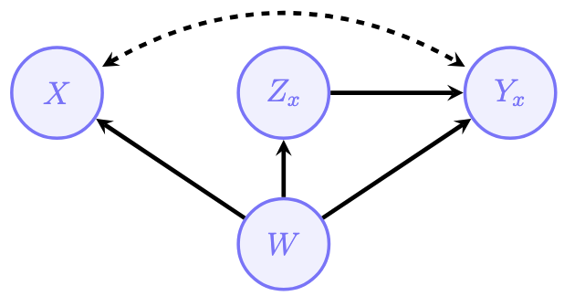
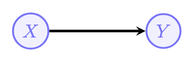
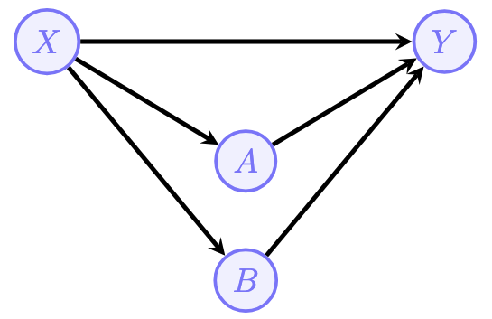

```{r setup, include=FALSE}
knitr::opts_chunk$set(echo = TRUE, warning = FALSE, message = FALSE)
```

In the [previous post](https://aliceaii.github.io/posts/ci_scm2/), we explored the identification problem — learning how to compute $P(y \mid do(x))$ from observational data using the back-door criterion, front-door adjustment, and do-calculus. All of those tools live on **Layer 2** (interventions) of the Pearl Causal Hierarchy.

Now we're going to climb to the very top of the ladder: **Layer 3 — Counterfactuals**. This is where causal inference gets *personal*. Instead of asking "what happens on average when we treat everyone?", we ask:

> "What *would have* happened to this specific students if we had given them a different treatment?"



## 1. Recall PCH Layer 3: Counterfactuals 


| Level | Name | Symbol | Activity | Typical Question | Example |
|:----:|:-----|:------|:-------|:-------------|:--------------|
| **L1** | Associational | $P(y \mid x)$ | **Seeing** | "What is?" How would seeing $X$ change my belief in $Y$? | Is high attendance associated with higher test scores? |
| **L2** | Interventional | $P(y \mid do(x))$ | **Doing** | "What if?" What if I do $X$? | If we mandate after-school tutoring, will grades improve? |
| **L3** | Counterfactual | $P(y_x \mid x', y')$ | **Imagining** | "Why?" What if I had acted differently? | Given that the student failed, would they have passed if they had studied for one more hour? |

The key difference? **Layer 2 asks about populations. Layer 3 asks about individuals.** 

::: {.callout-tip}
## Think of it this way...

**Layer 2** is like a school principal asking: "If we require all students to attend tutoring, will grades improve across the district?"

**Layer 3** is like a teacher looking at a specific student's transcript and asking: "Given everything I know about *you*, would assigning you a tutor last semester have raised your grade?"

Layer 3 mixes **observation** (what actually happened to this student) with **intervention** (what would have happened under a different assignment) — all for the *same individual*.
:::

### 1.2 Counterfactual Notation

Here's the key new notation. When we write:

$$Y_x(u)$$

we mean: "the value of $Y$ (outcome) that **would have occurred** for unit $u$ (a specific individual, defined by their unique background factors $U = u$) if $X$ (treatment) had been set to $x$."

In other words, we take the SCM, replace the equation for $X$ with the constant $x$ (just like $do(x)$), and then propagate forward to see what $Y$ becomes — **all for the same background variables** $U = u$.

::: {.callout-note}
## Why is this Layer 3 and not Layer 2?

The core difference comes down to **who you're asking about**:

**Layer 2** uses $do(x)$, which intervenes on the entire population. When you compute $P(Y \mid do(x))$, you're summing over all possible background variable values:

$$P(Y = y \mid do(x)) = \sum_u P(Y_x(u) = y) \cdot P(U = u)$$

Every individual gets the same treatment, and you average across all of them. You never need to know *which* person you're looking at.

**Layer 3** asks about $Y_x(u)$ for a *particular* $u$. But here's the crucial part — how do you figure out which $u$ you're dealing with? By **conditioning on what you've already observed**. For example, if you observe that a student received no tutoring ($X = 0$) and got a C ($Y = C$), those facts constrain which $u$ this student could be. Not every combination of background factors is consistent with those observations.

So the distinctly Layer 3 move is this two-step reasoning:

1. **Observe** what actually happened (e.g., $X = 0, Y = C$) to narrow down $u$
2. **Intervene** hypothetically (e.g., set $X = 1$) and ask what $Y$ *would have been* for that same $u$

This cross-world reasoning — using facts from the *real* world to inform a question about a *hypothetical* world — is something that Layer 2 simply cannot express. 
:::

### 1.3 The Three-Step Algorithm: Abduction, Action, Prediction {#three-step}

Whenever you need to evaluate a counterfactual query like $P(Y_{x'} = y \mid X = x, Y = y_0)$, there's a three-step recipe. 

#### Step 1 — Abduction

Use the evidence (what we *observed*) to update our beliefs about the background variables $U$. This is just Bayes' rule. We compute:

$$P(U = u \mid X = x, Y = y_0) = \frac{P(X = x, Y = y_0 \mid U = u) \cdot P(U = u)}{P(X = x, Y = y_0)}$$

**Why this matters:** Remember, $U$ encodes *everything* about an individual that our model doesn't explain internally. Before observing anything, we only know the prior distribution $P(U)$. But once we see that a specific student didn't receive tutoring ($X = x$) and earned a particular grade ($Y = y_0$), we can narrow down *which type of individual* we're dealing with. Some values of $U$ are consistent with these observations; others are not.

::: {.callout-important}
## Abduction is what makes this Layer 3
This step is the key difference from Layer 2. By conditioning on observed facts, we're using real-world data to *learn about a specific individual*. Layer 2 never does this — it simply averages over all possible $u$.
:::

#### Step 2 — Action

Modify the SCM by performing the intervention. Replace the structural equation for $X$ with the desired counterfactual value $x'$:

$$X = x' \quad \text{(replacing the original equation } X = f_X(PA_X, U_X)\text{)}$$

This is exactly the same $do(\cdot)$ operation from Layer 2. We remove all arrows pointing into $X$ in the causal graph and set $X$ to the value $x'$. The result is a **modified (or mutilated) SCM**, which we can call $M_{x'}$.

**Important:** All other structural equations remain unchanged. The only thing we alter is the mechanism that determines $X$.

#### Step 3 — Prediction

Use the modified SCM $M_{x'}$ together with the **updated** distribution $P(U \mid X = x, Y = y_0)$ from Step 1 to compute the counterfactual outcome:

$$P(Y_{x'} = y \mid X = x, Y = y_0) = \sum_u P(Y_{x'} = y \mid U = u) \cdot P(U = u \mid X = x, Y = y_0)$$

In words: for each possible value of $U$, we compute what $Y$ would be under the modified SCM (with $X$ set to $x'$), and then weight each result by how likely that $U$ value is *given what we actually observed*.

::: {.callout-note}
## Putting it all together
The three steps combine two different "worlds":

- **The real world** (Steps 1): Where $X = x$ and $Y = y_0$ actually occurred — we use this to learn about $U$.
- **The counterfactual world** (Steps 2–3): Where we force $X = x'$ and ask what $Y$ would have been — but for the *same individual* (same $U$).

This is the essence of cross-world reasoning. We gather evidence in one world and make predictions in another, linked by the shared background variables $U$.
:::

::: {.callout-tip}
## Analogy: The Detective's Method 
Think of it like a detective solving a case:

1. **Abduction**: "Given the evidence at the crime scene (fingerprints, alibis), what can I infer about the suspects?" → Update beliefs about $U$.
2. **Action**: "Now suppose the suspect had taken a *different* action..." → Modify the SCM.
3. **Prediction**: "...what would the outcome have been?" → Compute the counterfactual.
:::


## 2. Causal Effect Heterogeneity and the ETT 

### 2.1 Not Everyone is the Same

In Layer 2, we learned to compute the **Average Treatment Effect (ATE)**:

$$\text{ATE} = E[Y \mid do(X=1)] - E[Y \mid do(X=0)]$$

But this is an **average** over the entire population. In reality, different people might respond very differently to the same treatment!

Imagine a new tutoring program (treatment $X$) rolled out across a university. For students who are struggling in the course ($Z = 1$, say students with a midterm grade below C), the tutoring might dramatically improve their final grade. But for students who are already excelling ($Z = 0$, say students with an A on the midterm), mandatory tutoring sessions might actually *hurt* their performance by taking time away from independent study.

The ATE averages over both groups — potentially masking these important differences. If the program helps struggling students by +15 points but hurts strong students by -5 points, and the population is split evenly, the ATE would be +5. That positive number hides the fact that half the students were actually *harmed* by the intervention.

This is why we need tools to examine **causal effect heterogeneity** — the idea that treatment effects can vary across different subpopulations or even across individuals.

::: {.callout-note}
## Individual Treatment Effect (ITE)
At the most granular level, we can define the **Individual Treatment Effect** for unit $u$:

$$\text{ITE}(u) = Y_{X=1}(u) - Y_{X=0}(u)$$

This is the difference between what *would* happen to this specific individual under treatment versus under control. The ITE is a purely Layer 3 concept — it requires reasoning about the same individual in two different hypothetical worlds. In practice, we can never observe both $Y_{X=1}(u)$ and $Y_{X=0}(u)$ for the same person (this is sometimes called the **fundamental problem of causal inference**), so we often work with averages of ITEs over meaningful subgroups.
:::

### 2.2 Effect of Treatment on the Treated (ETT)

One important way to zoom in is the **Effect of Treatment on the Treated (ETT)**:

$$\text{ETT} = E[Y_{X=1} \mid X = 1] - E[Y_{X=0} \mid X = 1]$$

In words: "Among those who **actually received** treatment, what is the difference between their actual outcome and what **would have** happened if they hadn't been treated?"

Let's break this down term by term:

- **First term** $E[Y_{X=1} \mid X = 1]$: The expected outcome under treatment, for those who *were actually treated*. By the **consistency axiom** (if a person actually received treatment $X = 1$, then their counterfactual outcome under $X = 1$ is just their observed outcome), this simplifies to:

$$E[Y_{X=1} \mid X = 1] = E[Y \mid X = 1]$$

This is just a Layer 1 (observational) quantity — we can read it directly from the data.

- **Second term** $E[Y_{X=0} \mid X = 1]$: The expected outcome under *no treatment*, for those who *were actually treated*. This is the counterfactual piece. We're asking: "For the students who *did* attend tutoring, what grade *would they have gotten* if they hadn't?" We can never directly observe this — it's the road not taken.

This is a **Layer 3** quantity. The conditioning ($X = 1$) tells us which subpopulation we're examining (the treated group), while the subscript ($X = 0$) tells us which hypothetical intervention we're imagining. Mixing an observation with a hypothetical intervention for the same individuals is the hallmark of counterfactual reasoning.

#### Connecting ETT to the Three-Step Algorithm

To compute the ETT, we need the counterfactual term $E[Y_{X=0} \mid X = 1]$. This is exactly the kind of query that requires our three-step algorithm from [Section 1.3](#three-step):

1. **Abduction**: Observe that $X = 1$ (the student attended tutoring). Update $P(U)$ to get $P(U \mid X = 1)$ — this narrows down what kind of student we're dealing with.
2. **Action**: Set $X = 0$ in the SCM (imagine removing them from tutoring).
3. **Prediction**: Compute $E[Y \mid do(X = 0), U \sim P(U \mid X=1)]$ — what grade would these students have earned without tutoring?

Formally:

$$E[Y_{X=0} \mid X = 1] = \sum_u E[Y_{X=0} \mid U = u] \cdot P(U = u \mid X = 1)$$

Notice how we're averaging over $U$, but using the **posterior** $P(U \mid X = 1)$ instead of the prior $P(U)$. That posterior reflects the specific characteristics of students who chose to attend tutoring.

### 2.3 Effect of Treatment on the Untreated (ATU) 

The natural complement to the ETT is the **Average Treatment Effect on the Untreated (ATU)**:

$$\text{ATU} = E[Y_{X=1} \mid X = 0] - E[Y_{X=0} \mid X = 0]$$

In words: "Among those who **did not receive** treatment, what *would have been* the difference if they had?"

Again, let's break this down:

- **First term** $E[Y_{X=1} \mid X = 0]$: The expected outcome under treatment, for those who *were not treated*. This is the counterfactual: "If the students who *didn't* sign up for tutoring had been enrolled, what would their grades have been?"
- **Second term** $E[Y_{X=0} \mid X = 0]$: The expected outcome under no treatment, for those who were not treated. By **consistency**, this simplifies to:

$$E[Y_{X=0} \mid X = 0] = E[Y \mid X = 0]$$

This is again just an observational quantity.

#### Computing the ATU

Just like the ETT, the counterfactual term requires the three-step algorithm:

1. **Abduction**: Observe that $X = 0$ (the student did *not* attend tutoring). Update to get $P(U \mid X = 0)$.
2. **Action**: Set $X = 1$ in the SCM (imagine enrolling them in tutoring).
3. **Prediction**: Compute what their grade would have been:

$$E[Y_{X=1} \mid X = 0] = \sum_u E[Y_{X=1} \mid U = u] \cdot P(U = u \mid X = 0)$$

### 2.4 The ATE–ETT–ATU Relationship

These three quantities are connected by an elegant decomposition. The ATE is a **weighted average** of the ETT and ATU:

$$\text{ATE} = P(X=1) \cdot \text{ETT} + P(X=0) \cdot \text{ATU}$$

where $P(X=1)$ is the proportion of the population that was treated, and $P(X=0) = 1 - P(X=1)$ is the proportion untreated.

::: {.callout-note}
## Intuition for the decomposition
This makes sense: the overall average effect is just the weighted combination of the effect on those who were treated and the effect on those who weren't, weighted by the size of each group.

**Example**: Suppose 40% of students enrolled in tutoring ($P(X=1) = 0.4$). If the ETT is +8 points (tutoring helped those who signed up) and the ATU is +2 points (tutoring would have marginally helped those who didn't sign up), then:

$$\text{ATE} = 0.4 \times 8 + 0.6 \times 2 = 3.2 + 1.2 = 4.4 \text{ points}$$

The overall ATE of 4.4 blends together two very different stories: strong benefits for the self-selected group and modest benefits for the rest.
:::

::: {.callout-important}
## Key Takeaway
| Quantity | Question it answers | Layer |
|----------|-------------------|-------|
| ATE | "What is the average effect across *everyone*?" | 2 |
| ETT | "Did treatment help *those who received it*?" | 3 |
| ATU | "Would treatment help *those who didn't receive it*?" | 3 |

The ATE is a Layer 2 quantity — it only requires interventional reasoning. But the ETT and ATU are Layer 3 quantities — they require counterfactual reasoning about specific subpopulations. This is why the tools from this tutorial (SCMs, the three-step algorithm) are essential for computing them.
:::


## 3. Granularity: Zooming In on Subpopulations {#granularity}

One of the most powerful features of counterfactual reasoning is the ability to "zoom in" to finer and finer subpopulations. In Layer 2, we typically compute effects averaged over the entire population. But Layer 3 gives us the tools to ask increasingly specific questions about increasingly narrow groups — all the way down to a single individual.

Think of it as a telescope with adjustable magnification:

| Level | Notation | Who are we looking at? | Example |
|:---:|:---:|:---|:---|
| **Entire population** | $P(u)$ | Everyone | All students in the university |
| **Treated** | $P(u \mid x)$ | Only those who received treatment | Students who enrolled in tutoring |
| **Treated + subgroup** | $P(u \mid x, z)$ | Treated individuals with a specific characteristic | Tutored students who were also first-generation college students |
| **Unit level** | A specific $u$ | One individual | "What would have happened to student A specifically?" |


### 3.1 Why Granularity Matters

To see why this matters, imagine a university is evaluating its tutoring program. At each level of granularity, we can ask a different — and increasingly targeted — question:

**Population level** (Layer 2): "Does tutoring improve grades on average?"

$$E[Y \mid do(X=1)] - E[Y \mid do(X=0)]$$

This is the ATE. It tells the dean whether the program works *in general*, but it might mask enormous variation across student subgroups.

**Treated group** (Layer 3 — ETT): "Among students who *actually enrolled* in tutoring, did it help them?"

$$E[Y_{X=1} - Y_{X=0} \mid X = 1]$$

This zooms in to only those who self-selected into the program. As we discussed in [Section 2.2](#heterogeneity-ett), this can differ from the ATE because the treated group may be systematically different from the overall population.

**Treated + subgroup** (Layer 3 — Conditional ETT): "Among *first-generation college students* who enrolled in tutoring, did it help them?"

$$E[Y_{X=1} - Y_{X=0} \mid X = 1, Z = 1]$$

Now we're conditioning on both the treatment and an additional covariate $Z$ (first-generation status). This lets us detect whether the program is especially effective — or ineffective — for a particular subgroup. Perhaps first-generation students benefit more because they have fewer alternative support systems at home.

**Unit level** (Layer 3 — ITE): "Would tutoring have helped *this specific student*, A, given everything we know about him?"

$$Y_{X=1}(u_{\text{Student A}}) - Y_{X=0}(u_{\text{Student A}})$$

This is the most fine-grained question possible. It requires full knowledge of Alice's background factors $U = u_{\text{Alice}}$ and a fully specified SCM.

::: {.callout-tip}
## The Granularity Axis in Practice
As we zoom in, our answers become more **specific** but also more **demanding** in terms of what we need to know:

- **Population level**: Requires only the causal graph and identifiability (Layer 2 tools)
- **Treated/untreated subgroups**: Requires counterfactual reasoning and the three-step algorithm (Layer 3)
- **Finer subgroups**: Requires conditioning on additional covariates — the more we condition on, the more we narrow down the posterior $P(U \mid X=x, Z=z, \ldots)$
- **Unit level**: Requires complete knowledge of $U = u$, which is rarely available in practice

There's an inherent **tradeoff**: more granularity gives more personalized answers, but demands stronger assumptions and more data.
:::


## 4. Mechanisms: Direct and Indirect Effects {#mechanisms}

So far, we've been zooming in on **who** is affected (the granularity axis). Now we turn to the second key extension that counterfactuals unlock: understanding **how** effects flow through a causal system. This is the **mechanisms axis**.

### 4.1 Why Mechanisms Matter: The Tutoring Example

Suppose a university introduces a tutoring program ($X$) and observes that it improves final exam scores ($Y$). Great — but the dean wants to know *why* it works, because understanding the mechanism determines how to improve the program.

It turns out the tutoring program affects exam scores through **two different pathways**:

1. **Direct pathway** ($X \to Y$): Tutoring directly improves understanding of course material, leading to better exam performance.
2. **Indirect pathway** ($X \to W \to Y$): Tutoring increases student confidence ($W$), which in turn reduces test anxiety and improves exam scores.
```{mermaid}
graph LR
    X["X: Tutoring"] -->|Direct| Y["Y: Exam Score"]
    X -->|Indirect| W["W: Confidence"]
    W --> Y
```

The dean wants to know: **how much of the total effect flows through each pathway?**

This question has real policy implications:

- If most of the effect is **direct** (content mastery), the university should invest in *better tutoring materials and methods*.
- If most of the effect is **indirect** (confidence building), the university might achieve similar results with *mentorship programs or study groups* that boost confidence without formal tutoring.

Layer 2 tools can tell us the total effect of tutoring on exam scores, but they cannot disentangle *which pathway* carries that effect. For that, we need counterfactuals.

::: {.callout-important}
## Why This Requires Layer 3
Decomposing effects into direct and indirect components requires us to imagine interventions on *two variables simultaneously in different ways* — changing $X$ along one pathway while "freezing" it along another. This kind of cross-world reasoning (what *would* the mediator be under one treatment, combined with the direct effect of a *different* treatment) is inherently counterfactual.
:::

### 4.2 Natural Direct Effect (NDE)

The **Natural Direct Effect** captures the effect of changing treatment from $x_0$ to $x_1$ *directly on $Y$*, while keeping the mediator $W$ at whatever value it would **naturally** take under $x_0$:

$$\text{NDE}_{x_0, x_1}(y) = P(Y_{x_1, W_{x_0}} = y) - P(Y_{x_0, W_{x_0}} = y)$$

Let's unpack this notation carefully:

- $Y_{x_1, W_{x_0}}$: This is a **nested counterfactual**. It says: "Set $X = x_1$ for its direct effect on $Y$, but set the mediator $W$ to whatever value it *would naturally take* if $X$ had been $x_0$." Notice that $W_{x_0}$ is itself a counterfactual — it's the value of $W$ in the hypothetical world where $X = x_0$.
- $Y_{x_0, W_{x_0}}$: This is simply the outcome when $X = x_0$ (the baseline, no treatment).
- The difference captures how much $Y$ changes when we "turn on" the direct pathway only.

::: {.callout-tip}
## Intuition: Freezing the Indirect Path
Imagine you could magically "freeze" the student's confidence level at whatever it would be **without** tutoring (keep $W$ at its natural level under $X = x_0$), and then *still* give them the tutoring content along the direct pathway only. The NDE measures how much the exam score changes in this scenario.

In terms of the DAG: the NDE changes $X$ on the direct arrow $X \to Y$ from $x_0$ to $x_1$, but keeps the indirect arrow $X \to W$ frozen at $x_0$.

**In our example**: The NDE answers: "If we gave students the tutoring content but somehow prevented the confidence boost (maybe through a very dry, impersonal delivery), how much would exam scores still improve?"
:::

#### Why "Natural"?

The word "natural" refers to how we handle the mediator. We don't force $W$ to some arbitrary value — we set it to $W_{x_0}$, the value it would *naturally* take under the baseline treatment $x_0$. This respects the causal structure of the system rather than imposing an artificial constraint on $W$.

### 4.3 Natural Indirect Effect (NIE)

Conversely, the **Natural Indirect Effect** asks: what if we keep the direct effect fixed at $x_1$ but change the mediator pathway from its value under $x_1$ back to its value under $x_0$?

$$\text{NIE}_{x_1, x_0}(y) = P(Y_{x_1, W_{x_0}} = y) - P(Y_{x_1, W_{x_1}} = y)$$

Let's break this down:

- $P(Y_{x_1, W_{x_1}} = y)$: The outcome when *both* the direct and indirect pathways receive treatment $x_1$. This is just the full treatment effect — tutoring with all its natural consequences, including the confidence boost.
- $P(Y_{x_1, W_{x_0}} = y)$: The outcome when the direct pathway is set to $x_1$, but the mediator is held at its natural level under $x_0$ (no confidence boost).
- The difference isolates how much the **mediator pathway alone** contributes to the outcome.

::: {.callout-tip}
## Intuition: Isolating the Mediator
The NIE asks: "Starting from the full treatment scenario ($X = x_1$), how much would the exam score *drop* if we removed the confidence boost while keeping the direct tutoring content?"

Equivalently, you can think of it as: "How much of the total tutoring effect is carried by the confidence channel?"

**In our example**: The NIE answers: "If students received tutoring and gained the content knowledge, but we could somehow subtract the confidence boost, how much of the exam improvement would we lose?"
:::

::: {.callout-note}
## NDE and NIE: A Side-by-Side Comparison

| | NDE | NIE |
|:---|:---|:---|
| **What changes** | Direct pathway ($x_0 \to x_1$) | Mediator pathway ($W_{x_1} \to W_{x_0}$) |
| **What stays fixed** | Mediator frozen at $W_{x_0}$ | Direct effect stays at $x_1$ |
| **Question** | "How much does $Y$ change through the *direct* path alone?" | "How much does $Y$ change through the *indirect* path alone?" |
| **Tutoring example** | Effect of tutoring content, without the confidence boost | Effect of the confidence boost, holding content knowledge fixed |
:::

### 4.4 The ATE Decomposition Theorem

Here's the ATE result that ties everything together:

::: {.callout-note}
## Theorem: ATE Decomposition
The average total effect can be decomposed into its direct and indirect parts:

$$\text{ATE}_{x_0, x_1}(y) = \text{NDE}_{x_0, x_1}(y) - \text{NIE}_{x_1, x_0}(y)$$

Note the subtle sign and subscript flip in the NIE term!
:::

Let's verify this intuitively by expanding the definitions:

$$\text{NDE}_{x_0, x_1}(y) - \text{NIE}_{x_1, x_0}(y)$$

$$= \Big[P(Y_{x_1, W_{x_0}} = y) - P(Y_{x_0, W_{x_0}} = y)\Big] - \Big[P(Y_{x_1, W_{x_0}} = y) - P(Y_{x_1, W_{x_1}} = y)\Big]$$

Notice that $P(Y_{x_1, W_{x_0}} = y)$ appears in both terms and cancels:

$$= P(Y_{x_1, W_{x_1}} = y) - P(Y_{x_0, W_{x_0}} = y)$$

$$= P(Y_{x_1} = y) - P(Y_{x_0} = y)$$

$$= \text{ATE}_{x_0, x_1}(y)$$

The $P(Y_{x_1, W_{x_0}} = y)$ term — the "hybrid" world where direct and indirect pathways receive different treatments — serves as a **pivot** that connects the two effects. It appears in both the NDE and the NIE, and when we subtract, it drops out, leaving us with just the difference between full treatment and no treatment.

::: {.callout-tip}
## Intuition: Splitting the Total Effect
Think of the total effect of tutoring as a pie. The NDE tells us how big the "content mastery" slice is, and the NIE tells us how big the "confidence boost" slice is. The decomposition theorem guarantees that these two slices account for the entire pie.

**Numerical example**: Suppose we find that:

- Tutoring increases the probability of passing the exam by 30 percentage points overall (ATE = 0.30)
- The direct content effect accounts for 20 percentage points (NDE = 0.20)
- The confidence pathway accounts for 10 percentage points (NIE = -0.10, negative because the NIE measures the effect of *removing* the indirect channel. Remember the NIE measures the effect of moving the mediator *back* from $W_{x_1}$ *to* $W_{x_0}$. If the confidence boost *helps*, then removing it *decreases* the outcome, so the **NIE is negative**.)

Then: $0.30 = 0.20 - (-0.10) = 0.20 + 0.10$ 

This tells the dean that about two-thirds of the tutoring effect comes from content mastery and one-third from confidence building — valuable information for program design.
:::

::: {.callout-warning}
## Why the Minus Sign?
You might wonder why the decomposition uses subtraction ($\text{NDE} - \text{NIE}$) rather than addition. This is due to how the NIE is defined — it measures the effect of moving the mediator from $W_{x_1}$ *back to* $W_{x_0}$ (i.e., *removing* the indirect effect). So the NIE as defined is actually measuring the *loss* from removing the mediator's contribution. The minus sign flips this back to a positive contribution.

Some textbooks define the NIE with the opposite sign convention so that the decomposition reads $\text{ATE} = \text{NDE} + \text{NIE}$.

**Two common conventions exist in the literature:**

| Convention | NIE definition | Decomposition |
|:---|:---|:---|
| **Pearl/Bareinboim** | $P(Y_{x_1, W_{x_0}}) - P(Y_{x_1, W_{x_1}})$ | $\text{ATE} = \text{NDE} - \text{NIE}$ |
| **Social science** (VanderWeele, Robins) | $P(Y_{x_1, W_{x_1}}) - P(Y_{x_1, W_{x_0}})$ | $\text{ATE} = \text{NDE} + \text{NIE}$ |

The two conventions are just negatives of each other — same math, different sign packaging. The social science version is arguably more intuitive because a beneficial indirect effect comes out positive. If you encounter mediation analysis in fields like psychology, epidemiology, or sociology, you'll most likely see the additive $\text{ATE} = \text{NDE} + \text{NIE}$ form. Always check which convention is being used.
:::

### 4.5 Connecting Mechanisms to Granularity

It's worth noting that the mechanisms axis and the granularity axis from [Section 3](#granularity) are **independent dimensions** of counterfactual analysis. We can combine them:

- **NDE for the treated group**: "Among students who *actually received* tutoring, how much of their improvement was due to content mastery alone?" This combines mechanism decomposition (NDE) with subpopulation focus (conditioning on $X = 1$).
- **NIE for first-generation students**: "Among first-generation students, how much of the tutoring effect flows through confidence?" This combines mechanism decomposition (NIE) with granularity (conditioning on $Z = 1$).

These combinations give us an extraordinarily rich toolkit for understanding *who* benefits from a treatment, *how* they benefit, and *why* — all powered by the counterfactual machinery of Layer 3.


## 5. Nested Counterfactuals {#nested-counterfactuals}

The NDE formula $P(Y_{x_1, W_{x_0}})$ involves a **nested counterfactual**: the subscript of $Y$ contains $W_{x_0}$, which is itself a counterfactual variable. This means:

> "Set $X = x_1$ for the direct path to $Y$, but set $W$ to whatever value it *would have taken* under $X = x_0$."

This involves reasoning about **two different hypothetical worlds simultaneously** — in one world, $X = x_1$ (for the direct effect); in the other, $X = x_0$ (for determining $W$). This is fundamentally a Layer 3 operation and cannot be reduced to Layer 2.

### 5.1 The Counterfactual Unnesting Theorem (CUT)

In [Section 4](#mechanisms), we saw that the NDE and NIE involve **nested counterfactuals** — expressions like $Y_{x_1, W_{x_0}}$ where one counterfactual ($W_{x_0}$) is embedded inside another. These nested expressions are conceptually powerful but computationally challenging: how do we actually evaluate a quantity where the subscript of $Y$ depends on another counterfactual variable?

The good news is we can "un-nest" these expressions. The CUT gives us a systematic way to convert nested counterfactuals into sums over non-nested ones.

::: {.callout-note}
## Theorem: Counterfactual Unnesting Theorem (CUT)
Let $Y, X \in \mathbf{V}$, $\mathbf{T}, \mathbf{Z} \subseteq \mathbf{V}$, and let $\mathbf{z}$ be a set of values for $\mathbf{Z}$. Then, the nested counterfactual $P(Y_{\mathbf{T}X_{\mathbf{z}}} = y)$ can be written as a non-nested counterfactual:

$$P(Y_{\mathbf{T}X_{\mathbf{z}}} = y) = \sum_x P(Y_{\mathbf{T}x} = y, \; X_{\mathbf{Tz}} = x)$$
:::

#### Understanding the Notation

Let's carefully parse what each side means:

- **Left side** $P(Y_{\mathbf{T}X_{\mathbf{z}}} = y)$: This is the **nested** counterfactual. The subscript of $Y$ contains $X_{\mathbf{z}}$, which is itself a counterfactual — "the value $X$ would take if we set $\mathbf{Z} = \mathbf{z}$." So we're asking: "What would $Y$ be if we set $\mathbf{T}$ and also set $X$ to *whatever value it would naturally take* under intervention $\mathbf{z}$?"

- **Right side** $\sum_x P(Y_{\mathbf{T}x} = y, \; X_{\mathbf{Tz}} = x)$: This is a sum of **non-nested** counterfactuals. For each possible value $x$, we ask: "What is the joint probability that $Y$ would equal $y$ under $(\mathbf{T}, x)$ AND that $X$ would equal $x$ under $(\mathbf{T}, \mathbf{z})$?"

The key insight is that the nested version implicitly says "set $X$ to whatever it would be under $\mathbf{z}$" — the CUT makes this explicit by summing over all possible values $x$ that $X$ could take, weighted by the probability that $X$ actually takes each value.

#### The Two-Step Proof

The proof is elegant — just two steps:

**Step 1 — Law of total probability**: We can always introduce a sum over the possible values of $X_{\mathbf{Tz}}$:

$$P(Y_{\mathbf{T}X_{\mathbf{z}}} = y) = \sum_x P(Y_{\mathbf{T}X_{\mathbf{z}}} = y, \; X_{\mathbf{Tz}} = x)$$

This is just a standard probability identity — we're partitioning the event by all possible values of $X_{\mathbf{Tz}}$.

**Step 2 — Consistency**: Within each term of the sum, we know that $X_{\mathbf{Tz}} = x$. By the consistency axiom, whenever we know the value of a counterfactual variable, we can replace that counterfactual with its realized value. So the nested $X_{\mathbf{z}}$ inside the subscript of $Y$ can be replaced with the constant $x$:

$$= \sum_x P(Y_{\mathbf{T}x} = y, \; X_{\mathbf{Tz}} = x)$$

And we're done — the nesting has been removed.

::: {.callout-tip}
## Intuition: Why This Works
Think of it in terms of the tutoring example. The nested counterfactual $Y_{x_1, W_{x_0}}$ says: "What would the exam score be if we set tutoring to $x_1$ directly, and set confidence to *whatever level it would naturally be without tutoring*?"

The problem is that "whatever level it would naturally be" is itself uncertain — it depends on the student. The CUT resolves this by considering all possibilities:

- "What if the student's confidence without tutoring would be *low* ($W_{x_0} = \text{low}$)? Then what would their exam score be with tutoring and low confidence?"
- "What if the student's confidence without tutoring would be *medium* ($W_{x_0} = \text{medium}$)? Then what would their exam score be?"
- "What if it would be *high* ($W_{x_0} = \text{high}$)? ..."

The CUT sums over all these scenarios, weighted by how likely each one is. This turns the abstract "whatever $W$ would naturally be" into a concrete sum over specific values.
:::

::: {.callout-tip}
## Example: Un-nesting the NDE
Recall that the NDE contains the nested term $P(Y_{x_1, W_{x_0}} = y)$. Applying the CUT with $\mathbf{T} = \{x_1\}$, $X = W$, and $\mathbf{z} = \{x_0\}$:

$$P(Y_{x_1, W_{x_0}} = y) = \sum_w P(Y_{x_1, w} = y, \; W_{x_0} = w)$$

We've replaced the nested "set $W$ to whatever it would be under $x_0$" with an explicit sum: "for each possible value $w$, what's the joint probability that $W$ would equal $w$ under $x_0$ AND $Y$ would equal $y$ under $(x_1, w)$?"

Notice that the right side contains only **non-nested** counterfactuals: $Y_{x_1, w}$ has a constant $w$ in the subscript (not a counterfactual), and $W_{x_0}$ is a simple single-level counterfactual. This makes the expression much more amenable to further simplification using the other counterfactual calculus rules (consistency, independence, exclusion).
:::

::: {.callout-important}
## Why CUT Matters
Without the CUT, expressions like the NDE and NIE would remain as nested counterfactuals that are difficult to work with mathematically. The CUT is the essential first step in a pipeline that converts these Layer 3 quantities into expressions we can actually estimate from data:

$$\text{Nested counterfactual} \xrightarrow{\text{CUT}} \text{Non-nested counterfactual} \xrightarrow{\text{Calculus rules}} \text{Estimable expression}$$

After un-nesting, we can apply the three rules of the counterfactual calculus (consistency, independence, exclusion) to further simplify the expression until it contains only observational and interventional quantities.
:::

## 6. The Three Counterfactual Constraints {#constraints}

To actually *compute* counterfactual quantities from data, we rely on three fundamental constraints. Think of them as the "rules of the game" that connect the counterfactual world to the observable world. These constraints are what allow us to move from abstract counterfactual expressions — which involve hypothetical worlds we can never directly observe — to concrete quantities we can estimate from real data.

### 6.1 Consistency

::: {.callout-note}
## Lemma: Consistency
Given a structural causal model $M$ and $X, Y \in \mathbf{V}$, $\mathbf{T} \subseteq \mathbf{V}$, let $x$ be a value in the domain of $X$. Then:

$$X_{\mathbf{T}} = x \implies Y_{\mathbf{T}x} = Y_{\mathbf{T}}$$

When $\mathbf{T}$ is empty, this simplifies to:

$$X = x \implies Y_x = Y$$

In words: "If you would have naturally taken the treatment anyway, then the counterfactual outcome under treatment equals your actual outcome."
:::

**Why this makes sense**: If a student naturally chose to attend tutoring ($X = 1$), then asking "what would their grade have been if they attended tutoring?" ($Y_{X=1}$) is the same as just looking at what their grade *actually was* ($Y$). The intervention matches what happened naturally, so the counterfactual world is identical to the real world.

::: {.callout-tip}
## Analogy: Choosing Your Path
You're at a fork in the road and you choose the left path. Someone asks: "What would have happened if you had gone left?" Well... exactly what *did* happen — because you *did* go left! That's consistency.
:::

#### Consistency in Action: The ETT

Recall the ETT:

$$\text{ETT} = E[Y_{X=1} \mid X = 1] - E[Y_{X=0} \mid X = 1]$$

Can we apply consistency to simplify either term?

- **First term** $E[Y_{X=1} \mid X = 1]$: Here the intervention ($X = 1$) matches the observation ($X = 1$). By consistency, $Y_{X=1} = Y$ when $X = 1$, so:

$$E[Y_{X=1} \mid X = 1] = E[Y \mid X = 1]$$

This is now just an observational quantity we can read from the data.

- **Second term** $E[Y_{X=0} \mid X = 1]$: Here the intervention ($X = 0$) does **not** match the observation ($X = 1$). Consistency does NOT apply — we're asking about a world where the student didn't get tutoring, but we're conditioning on the fact that they *did*. This term remains counterfactual and requires additional constraints to evaluate.

::: {.callout-important}
## When Consistency Does and Doesn't Apply
Consistency only works when the **intervention matches the observation**. It bridges the counterfactual world and the real world, but only when those two worlds happen to agree on the value of the treatment variable.

| Scenario | Applies? | Why |
|:---|:---:|:---|
| $E[Y_{X=1} \mid X = 1]$ | ✓ | Intervention ($X=1$) matches observation ($X=1$) |
| $E[Y_{X=0} \mid X = 1]$ | ✗ | Intervention ($X=0$) contradicts observation ($X=1$) |
| $E[Y_{X=0} \mid X = 0]$ | ✓ | Intervention ($X=0$) matches observation ($X=0$) |
:::

### 6.2 Exclusion Restrictions

::: {.callout-note}
## Lemma: Exclusion Operator
Consider a counterfactual variable $Y_{\mathbf{x}}$. The exclusion operator $\eta$ simplifies the subscript by removing interventions on variables that have **no causal path** to $Y$:

$$\eta(Y_{\mathbf{x}}) = Y_{\mathbf{z}} \quad \text{where } \mathbf{Z} = \mathbf{X} \cap An_{G_{\overline{\mathbf{X}}}}(Y) \text{ and } \mathbf{z} = \mathbf{x} \cap \mathbf{Z}$$

In simpler terms: if $X$ is not an ancestor of $Y$ in the mutilated graph (after removing edges into the intervened variables), then intervening on $X$ doesn't change $Y$:

$$Y_{xz} = Y_z \quad \text{whenever } X \notin An(Y) \text{ in } G_{\overline{\mathbf{Z}}}$$
:::

**Intuition**: If there's no causal path from $X$ to $Y$ (because all paths go through variables that are already fixed by other interventions), then changing $X$ doesn't matter for $Y$. The intervention on $X$ is "excluded" — it has no effect.

#### Exclusion Example: The Chain Graph

Consider the chain graph $X \to Z \to Y$. Suppose we want to evaluate $Y_{zx}$ — the outcome when we intervene on both $Z$ and $X$. Since we've already set $Z = z$ (cutting the arrow from $X$ to $Z$), there's no remaining path from $X$ to $Y$. So:

$$Y_{zx} = Y_z$$

The intervention on $X$ is redundant once $Z$ is fixed, because $X$ can only affect $Y$ *through* $Z$, and we've already controlled $Z$.

::: {.callout-tip}
## Analogy: The Disconnected Light Switch
Imagine a classroom where a switch ($X$) controls the projector ($Z$), and the projector controls what students see on the screen ($Y$). If you manually set the projector to show a specific slide ($Z = z$), it doesn't matter whether the switch is on or off ($X$) — the screen ($Y$) only depends on the projector. The switch has been "excluded" from affecting the screen because its only pathway has been blocked.
:::

#### Exclusion in Practice

The exclusion operator is especially useful for simplifying complex counterfactual expressions. Consider a graph with four variables $Z \to X \to W \to Y$ and a direct edge $Z \to W$:

- $\eta(X_{zyw}) = X_z$ — because among $\{Z, Y, W\}$, only $Z$ is an ancestor of $X$
- $\eta(Y_{xz}) = Y_{xz}$ — because both $X$ and $Z$ are ancestors of $Y$, so neither can be removed
- $\eta(W_{zxy}) = W_{xy}$ — because among $\{Z, X, Y\}$, only $X$ and $Y$ are ancestors of $W$ (after removing relevant edges)

The exclusion operator acts as a simplification tool: it strips away interventions that have no causal relevance, leaving only the interventions that actually matter for the outcome in question.

### 6.3 Independence

The third constraint tells us when counterfactual variables are **probabilistically independent** of each other. This is crucial because counterfactual expressions often involve joint distributions over variables from *different hypothetical worlds* — and we need to know when these variables are unrelated.

::: {.callout-note}
## Rule: Independence
For counterfactual variables $Y_{\mathbf{r}}$, $X_{\mathbf{t}}$, and $W_*$:

$$P(Y_{\mathbf{r}} \mid X_{\mathbf{t}}, W_*) = P(Y_{\mathbf{r}} \mid W_*) \quad \text{if } (Y_{\mathbf{r}} \perp X_{\mathbf{t}} \mid W_*) \text{ in } \mathcal{G}_A$$

where $\mathcal{G}_A = \mathcal{G}_A(Y_{\mathbf{r}}, X_{\mathbf{t}}, W_*)$ is the **counterfactual ancestral graph**.
:::

The key challenge is that counterfactual variables from different interventional regimes live in "different worlds." A student's grade under tutoring ($Y_{X=1}$) and their grade without tutoring ($Y_{X=0}$) exist in separate hypothetical realities. But these variables are **not necessarily independent** — they share the same background factors $U$ (the student's innate ability, motivation, etc.).

So how do we determine when counterfactual variables are independent? We need a special graphical tool: the **Ancestral Multi-World Network (AMWN)**, which we'll develop in the next section.

::: {.callout-important}
## The Three Constraints Working Together
These three constraints form a complete toolkit for simplifying counterfactual expressions:

| Constraint | What it does | When to use it |
|:---|:---|:---|
| **Consistency** | Replaces counterfactual with observation | When intervention matches what was observed |
| **Exclusion** | Removes irrelevant interventions | When an intervened variable has no causal path to the outcome |
| **Independence** | Drops conditioning on unrelated counterfactuals | When d-separation holds in the AMWN |

Together, they form the **Counterfactual Calculus** — a complete set of rules for transforming any identifiable counterfactual expression into a combination of observational and interventional quantities that can be estimated from data.
:::

## 7. Counterfactual Ancestors and the Ancestral Multi-World Network (AMWN) {#amwn}

In [Section 6.3](#independence), we saw that the independence constraint requires checking d-separation in a special graph called the **counterfactual ancestral graph** $\mathcal{G}_A$. But how do we actually build this graph? This section develops the necessary machinery: first, we define what it means for a counterfactual variable to have "ancestors," and then we use this to construct the **Ancestral Multi-World Network (AMWN)**.

### 7.1 Counterfactual Ancestors {#ctf-ancestors}

In a standard causal graph, the ancestors of a variable $Y$ are all the variables that have a directed path to $Y$. For counterfactual variables, we need a more nuanced definition because some ancestors may be "cut off" by interventions in the subscript.

::: {.callout-note}
## Definition: Ancestors of a Counterfactual
Let $Y_{\mathbf{x}}$ be a counterfactual variable where $Y \in \mathbf{V}$ and $\mathbf{X} \subseteq \mathbf{V}$. The set of **(counterfactual) ancestors** of $Y_{\mathbf{x}}$, denoted $An(Y_{\mathbf{x}})$, consists of each $W_{\mathbf{z}}$ such that:

1. $W \in An_{G_{\overline{\mathbf{X}}}}(Y) \setminus \mathbf{X}$ — that is, $W$ is an ancestor of $Y$ in the mutilated graph (with edges into $\mathbf{X}$ removed), excluding $\mathbf{X}$ itself. This includes $Y$ itself.
2. $\mathbf{z} = \mathbf{x} \cap An_{G_{\overline{\mathbf{X}}}}(W)$ — the subscript of each ancestor is the subset of the original intervention $\mathbf{x}$ that is relevant to $W$ (i.e., only the interventions on variables that are ancestors of $W$).
:::

**Why this matters**: When we intervene on $\mathbf{X}$, we cut the incoming edges to $\mathbf{X}$ in the graph. This means some variables that were ancestors of $Y$ in the original graph may no longer be connected. The definition above carefully tracks which variables still have a causal path to $Y$ after the intervention, and what subscripts they should carry.

#### Worked Example: Counterfactual Ancestors

Consider the causal diagram:
```{mermaid}
graph TD
    Z --> X
    Z --> W
    X --> W
    W --> Y
```

Suppose we want to find $An(Y_{xw})$ — the counterfactual ancestors of $Y$ when we intervene on both $X$ and $W$.

**Step 1 — Find ancestors in the mutilated graph**: Remove edges into $\{X, W\}$. In the mutilated graph $G_{\overline{XW}}$, which variables still have a directed path to $Y$? Only $Y$ itself (since the arrow $W \to Y$ is the only incoming edge, and $W$ is in the intervention set). But wait — we also include variables that are ancestors of $Y$ through remaining paths. Since $W \to Y$ is the only path and $W$ is intervened on, we get:

$$An_{G_{\overline{XW}}}(Y) \setminus \{X, W\} = \{Z, Y\}$$

**Step 2 — Compute subscripts for each ancestor**:

- For $Z$: $\mathbf{z} = \{x, w\} \cap An_{G_{\overline{XW}}}(Z) = \emptyset$ (neither $X$ nor $W$ is an ancestor of $Z$ in the mutilated graph). So $Z$ gets no subscript — it's just $Z$.
- For $Y$: $\mathbf{z} = \{x, w\} \cap An_{G_{\overline{XW}}}(Y) = \{w\}$ (only $W$ is an ancestor of $Y$ in the mutilated graph among the intervened variables). So $Y$ gets subscript $w$ — it becomes $Y_w$.

**Result**: $An(Y_{xw}) = \{Z, Y_w\}$

::: {.callout-tip}
## Intuition: What Are Counterfactual Ancestors?
Think of it in terms of our tutoring example. Suppose $Y$ is the exam score, $W$ is study hours, $X$ is tutoring, and $Z$ is innate ability. If we intervene on both tutoring ($X$) and study hours ($W$), which variables still matter for the counterfactual exam score $Y_{xw}$?

- $Z$ (innate ability) still matters — it directly affects the exam score through channels we haven't blocked. And since we haven't intervened on any of $Z$'s ancestors, it carries no subscript.
- $Y$ itself carries the subscript $w$ because the intervention on study hours ($W$) is the one that's still causally relevant for $Y$ in the mutilated graph.
- $X$ and $W$ are excluded — they've been directly intervened on, so they're no longer "free" variables.
:::

### 7.2 Building the Ancestral Multi-World Network (AMWN) {#building-amwn}

Now we have the ingredients to construct the AMWN — the graph that lets us read off independences between counterfactual variables using standard d-separation.

The fundamental challenge is this: counterfactual variables from different interventional regimes live in "different worlds." A student's exam score under tutoring ($Y_{x_1}$), their confidence level without tutoring ($W_{x_0}$), and their actual observed grade ($Y$) each belong to different hypothetical scenarios. But they're all connected through the same underlying individual — the same exogenous variables $U$.

The AMWN makes these cross-world connections explicit.

::: {.callout-note}
## Algorithm: Constructing the AMWN
**Input**: Causal graph $G$, set of counterfactual variables $\mathbf{Y}_*$

**Output**: Counterfactual ancestral graph $\mathcal{G}_A(\mathbf{Y}_*)$

1. **Compute all counterfactual ancestors** $An(\mathbf{Y}_*)$ and add them as nodes to the initial graph $G'$
2. **Add directed arrows** witnessing ancestrality between the nodes (preserving the causal structure within each world)
3. **Handle shared exogenous variables**: For each edge $U \to V$ in the original graph $G$:
    - If more than one instance of $V$ exists in $G'$ (i.e., $V$ appears in multiple worlds), add the exogenous node $U$ with edges pointing to each copy of $V$
4. **Return** $G'$
:::

The key insight is **Step 3**: the exogenous variables ($U$ nodes) serve as **bridges between worlds**. They create dependencies between counterfactual variables because the same student has the same innate ability regardless of which hypothetical treatment world we're reasoning about.

#### Worked Example: AMWN for the Chain Graph

Consider the chain graph $X \to Z \to Y$ and suppose we want to check independences among the counterfactual variables $\{Y_z, Z_x, Y\}$.

**Step 1 — Compute ancestors**:

- $An(Y_z) = \{Y_z\}$ — only itself, because $Z$ is already fixed by the intervention
- $An(Z_x) = \{Z_x\}$ — only itself, because $X$ is already fixed
- $An(Y) = \{Y, Z, X\}$ — the natural outcome depends on everything upstream

**Step 2 — Add directed arrows**: Within each world, we preserve the causal structure (e.g., $X \to Z \to Y$ in the natural world $\mathcal{M}$).

**Step 3 — Add exogenous bridges**: The variable $Z$ appears in multiple worlds (as $Z_x$ in $\mathcal{M}_x$ and as $Z$ in $\mathcal{M}$), so we add $U_z$ with edges to both copies. Similarly, $Y$ appears as $Y_z$ in $\mathcal{M}_z$ and as $Y$ in $\mathcal{M}$, so we add $U_y$ with edges to both.

The resulting AMWN has three "regions" — one for each interventional world ($\mathcal{M}$, $\mathcal{M}_x$, $\mathcal{M}_z$) — connected by the shared exogenous variables.

**Applying d-separation**: In this AMWN, we can verify:

$$Y_z \perp Z_x \mid Y$$

This tells us that once we condition on the natural outcome $Y$, the counterfactual variables $Y_z$ (grade under a specific study approach) and $Z_x$ (tutor assignment under a specific policy) become independent. The shared exogenous variables are "blocked" by conditioning on $Y$.

::: {.callout-tip}
## Intuition: Why Cross-World Independence Makes Sense
Think of a specific student, Student A. In one world, we assign them a specific tutor ($Z_x$). In another world, we directly set their study approach and observe their grade ($Y_z$). These two counterfactual quantities are connected through Student A's background characteristics ($U$) — their innate ability, motivation, study habits, etc.

But if we already know Student A's *actual* grade ($Y$), that tells us a lot about their background — enough that knowing which tutor they'd be assigned ($Z_x$) doesn't give us additional information about their grade under a different study approach ($Y_z$). The observation of $Y$ "screens off" the cross-world connection.
:::

### 7.3 Why the AMWN Matters {#amwn-importance}

The AMWN is the graphical tool that makes the independence constraint (Rule 2 of the counterfactual calculus) operational. Without it, we'd have no systematic way to determine which counterfactual variables can be separated.

::: {.callout-note}
## The Role of AMWN in the Simplification Pipeline
Recall the pipeline from [Section 5.1](#cut):

$$\text{Nested counterfactual} \xrightarrow{\text{CUT}} \text{Non-nested counterfactual} \xrightarrow{\text{Calculus rules}} \text{Estimable expression}$$

The AMWN is essential for the second arrow. After applying the CUT to un-nest our expressions, we typically have joint distributions over counterfactual variables from different worlds. To simplify these, we need to:

1. **Build the AMWN** for the relevant counterfactual variables
2. **Check d-separation** to identify which variables are independent
3. **Apply the independence rule** to factor the joint distribution into simpler pieces
4. **Apply consistency and exclusion** to convert remaining counterfactual terms into observational/interventional quantities
:::


## 8. The Counterfactual Calculus {#ctf-calculus}

Just as do-calculus gave us rules for manipulating interventional distributions in Layer 2, the **counterfactual calculus** gives us a parallel set of rules for manipulating counterfactual distributions in Layer 3. These rules formalize the three constraints from [Section 6](#constraints) — consistency, independence, and exclusion — into a complete calculus that can transform any identifiable counterfactual expression into quantities we can estimate from data.

### 8.1 The Three Rules

::: {.callout-note}
## Theorem: Counterfactual Calculus Rules
Let $\mathcal{G}$ be a causal diagram and $\mathbf{Y}, \mathbf{X}, \mathbf{Z}, \mathbf{W}, \mathbf{T} \subseteq \mathbf{V}$. The following rules hold for the probability distributions generated by any model compatible with $\mathcal{G}$:

**Rule 1 (Consistency Rule):** Observation/intervention exchange:
$$P(\mathbf{y}_{\mathbf{Tx}}, \mathbf{x}_\mathbf{T}, \mathbf{w}_*) = P(\mathbf{y}_\mathbf{T}, \mathbf{x}_\mathbf{T}, \mathbf{w}_*)$$

**Rule 2 (Independence Rule):** Adding/removing counterfactual observations:
$$P(\mathbf{y}_\mathbf{r} \mid \mathbf{x}_\mathbf{t}, \mathbf{w}_*) = P(\mathbf{y}_\mathbf{r} \mid \mathbf{w}_*) \quad \text{if } (\mathbf{Y}_\mathbf{r} \perp \mathbf{X}_\mathbf{t} \mid \mathbf{W}_*) \text{ in } \mathcal{G}_A$$

**Rule 3 (Exclusion Rule):** Adding/removing interventions:
$$P(\mathbf{y}_{\mathbf{xz}}, \mathbf{w}_*) = P(\mathbf{y}_\mathbf{z}, \mathbf{w}_*) \quad \text{if } \mathbf{X} \cap An(\mathbf{Y}) = \emptyset \text{ in } G_{\overline{\mathbf{Z}}}$$

where $\mathcal{G}_A$ is the AMWN $\mathcal{G}_A(\mathbf{Y}_\mathbf{r}, \mathbf{X}_\mathbf{t}, \mathbf{W}_*)$.
:::

Let's unpack each rule in detail with educational examples.

### 8.2 Rule 1: Consistency — Observation/Intervention Exchange

$$P(\mathbf{y}_{\mathbf{Tx}}, \mathbf{x}_\mathbf{T}, \mathbf{w}_*) = P(\mathbf{y}_\mathbf{T}, \mathbf{x}_\mathbf{T}, \mathbf{w}_*)$$

**What it does**: When a counterfactual variable $Y$ is subscripted by an intervention on $X$ (i.e., $Y_{\mathbf{Tx}}$), *and* we simultaneously know the counterfactual value of $X$ under the same regime (i.e., $X_{\mathbf{T}} = x$), we can remove $X$ from $Y$'s subscript. The intervention on $X$ is redundant because we already know $X$ takes value $x$ in this world.

**In our tutoring example**: Suppose we have the expression:

$$P(Y_{x_1} = y, X = x_1)$$

Since we're conditioning on $X = x_1$ (the student actually received tutoring) and the counterfactual $Y_{x_1}$ is "grade under tutoring," consistency lets us simplify:

$$P(Y_{x_1} = y, X = x_1) = P(Y = y, X = x_1) = P(Y = y \mid X = x_1) \cdot P(X = x_1)$$

The counterfactual $Y_{x_1}$ becomes the plain observable $Y$ because the intervention matches the observed value. This is exactly what we used in [Section 6.1](#constraints) to simplify the first term of the ETT.

::: {.callout-tip}
## Rule 1 in Plain English
"If you're already in a world where $X = x$, then asking *what would $Y$ be if $X$ were set to $x$* is the same as just asking *what is $Y$*."

This rule converts **counterfactual** quantities into **observational** ones — it's the bridge that brings Layer 3 expressions back down to Layer 1.
:::

### 8.3 Rule 2: Independence — Adding/Removing Counterfactual Observations

$$P(\mathbf{y}_\mathbf{r} \mid \mathbf{x}_\mathbf{t}, \mathbf{w}_*) = P(\mathbf{y}_\mathbf{r} \mid \mathbf{w}_*) \quad \text{if } (\mathbf{Y}_\mathbf{r} \perp \mathbf{X}_\mathbf{t} \mid \mathbf{W}_*) \text{ in } \mathcal{G}_A$$

**What it does**: If two counterfactual variables are d-separated in the AMWN (possibly conditional on other variables), we can drop one from the conditioning set. This lets us remove irrelevant counterfactual observations from an expression.

**When to check**: Build the AMWN $\mathcal{G}_A(\mathbf{Y}_\mathbf{r}, \mathbf{X}_\mathbf{t}, \mathbf{W}_*)$ following the algorithm from [Section 7.2](#building-amwn), then apply d-separation.

**In our tutoring example**: Suppose after applying the CUT to the NDE, we have a joint distribution involving $Y_{x_1 w}$ (grade under tutoring with a specific confidence level) and $W_{x_0}$ (confidence level without tutoring). These live in different hypothetical worlds. To determine whether we can factor the joint distribution:

$$P(Y_{x_1 w} = y, W_{x_0} = w) \stackrel{?}{=} P(Y_{x_1 w} = y) \cdot P(W_{x_0} = w)$$

We build the AMWN for $\{Y_{x_1 w}, W_{x_0}\}$ and check whether $Y_{x_1 w} \perp W_{x_0}$ holds via d-separation. If the independence is confirmed, we can factor the expression and simplify each piece separately.

::: {.callout-tip}
## Rule 2 in Plain English
"If two counterfactual variables are not connected through shared background factors (after accounting for what we've already conditioned on), then knowing one tells us nothing about the other."

This rule simplifies **joint counterfactual distributions** by identifying when cross-world variables can be separated. It relies on the AMWN from [Section 7](#amwn) to check d-separation.
:::

### 8.4 Rule 3: Exclusion — Adding/Removing Interventions

$$P(\mathbf{y}_{\mathbf{xz}}, \mathbf{w}_*) = P(\mathbf{y}_\mathbf{z}, \mathbf{w}_*) \quad \text{if } \mathbf{X} \cap An(\mathbf{Y}) = \emptyset \text{ in } G_{\overline{\mathbf{Z}}}$$

**What it does**: If an intervened variable $X$ has no causal path to $Y$ in the mutilated graph $G_{\overline{\mathbf{Z}}}$ (after removing edges into $\mathbf{Z}$), then the intervention on $X$ can be dropped from $Y$'s subscript. The intervention is irrelevant because it cannot affect $Y$.

**In our tutoring example**: Consider the chain $X \to W \to Y$ (tutoring affects confidence, which affects exam score). Suppose we write the counterfactual $Y_{xw}$ — the exam score when we set both tutoring ($X = x$) and confidence ($W = w$). Since $X$ can only affect $Y$ *through* $W$, and we've already fixed $W = w$, there's no remaining path from $X$ to $Y$. So:

$$Y_{xw} = Y_w$$

The intervention on $X$ can be dropped because it has no causal path to $Y$ once $W$ is fixed. In graph terms, $X \cap An(Y) = \emptyset$ in $G_{\overline{W}}$ because the only path $X \to W \to Y$ is blocked by the intervention on $W$.

::: {.callout-tip}
## Rule 3 in Plain English
"If an intervention can't possibly reach the outcome (because all its causal pathways are already blocked by other interventions), then it doesn't matter and can be removed."

This rule **simplifies subscripts** by stripping away causally irrelevant interventions. It uses the causal graph structure to determine which interventions actually matter.
:::

### 8.5 Comparison with Do-Calculus

These three rules are the **Layer 3 generalizations** of the three rules of do-calculus from Layer 2. In fact, the do-calculus can be derived as a special case of the counterfactual calculus. Here's how they correspond:

::: {.callout-note}
## Side-by-Side: Do-Calculus vs. Counterfactual Calculus

| | Do-Calculus (Layer 2) | Counterfactual Calculus (Layer 3) |
|:---|:---|:---|
| **Rule 1** | Adding/removing observations: $P(y \mid do(x), z, w) = P(y \mid do(x), w)$ | Consistency: $P(\mathbf{y}_{\mathbf{Tx}}, \mathbf{x}_\mathbf{T}, \mathbf{w}_*) = P(\mathbf{y}_\mathbf{T}, \mathbf{x}_\mathbf{T}, \mathbf{w}_*)$ |
| **Rule 2** | Action/observation exchange: $P(y \mid do(x), do(z), w) = P(y \mid do(x), z, w)$ | Independence: $P(\mathbf{y}_\mathbf{r} \mid \mathbf{x}_\mathbf{t}, \mathbf{w}_*) = P(\mathbf{y}_\mathbf{r} \mid \mathbf{w}_*)$ |
| **Rule 3** | Adding/removing actions: $P(y \mid do(x), do(z), w) = P(y \mid do(x), w)$ | Exclusion: $P(\mathbf{y}_{\mathbf{xz}}, \mathbf{w}_*) = P(\mathbf{y}_\mathbf{z}, \mathbf{w}_*)$ |
| **Graph test** | d-separation in modified $G$ | d-separation in AMWN $\mathcal{G}_A$ |
| **Goal** | Remove $do(\cdot)$ operators | Remove counterfactual subscripts |
| **Scope** | Interventional distributions | Counterfactual distributions |
:::

The structural parallel is deep: both calculi provide a **complete** set of rules for reducing expressions in their respective layers. The do-calculus is sound and complete for identifying interventional queries from observational data. The counterfactual calculus extends this to the full power of Layer 3.

::: {.callout-important}
## Key Difference: What You're Simplifying
In the do-calculus, the goal is to remove $do(\cdot)$ operators until the expression contains only observational quantities $P(\cdot)$.

In the counterfactual calculus, the goal is to remove **counterfactual subscripts** until the expression contains only observational and/or interventional quantities.

The syntactic target is the same idea at a higher level:

$$\text{Do-calculus: } P(y \mid do(x)) \longrightarrow P(\text{observational})$$

$$\text{Ctf. calculus: } P(y_{x'} \mid x) \longrightarrow P(\text{observational/interventional})$$
:::

### 8.6 Using the Rules Together: The Simplification Workflow

In practice, the three rules are applied in combination — often iteratively — to simplify counterfactual expressions. Here's the typical workflow:

1. **Start** with a counterfactual query (e.g., the ETT or NDE)
2. **Apply CUT** ([Section 5.1](#cut)) to un-nest any nested counterfactuals
3. **Apply Rule 3 (Exclusion)** to simplify subscripts by removing causally irrelevant interventions
4. **Apply Rule 2 (Independence)** to factor joint distributions using the AMWN
5. **Apply Rule 1 (Consistency)** to convert counterfactual terms into observational ones wherever the intervention matches the observation
6. **Repeat** until no further simplification is possible


## 9. Probability of Necessity and Sufficiency {#pn-ps}

Throughout this tutorial, we've seen Layer 3 quantities that ask about groups — the ETT asks about all treated individuals, the ATU about all untreated ones. But some of the most compelling real-world questions are about **individual attribution**: "Did *this specific* cause lead to *this specific* outcome?"

### 9.1 Probability of Necessity (PN)

::: {.callout-note}
## Definition: Probability of Necessity (PN)
$$\text{PN} = P(Y_{X=0} = 0 \mid X = 1, Y = 1)$$

"Given that the treatment was applied and the outcome occurred, what is the probability that the outcome would **not** have occurred without the treatment?"
:::

**In education**: A student enrolled in tutoring ($X = 1$) and passed ($Y = 1$). PN asks: **"Would this student have passed even without tutoring?"**

- $\text{PN} = 0.9$: 90% chance they would have failed without tutoring — the program almost certainly made the difference.
- $\text{PN} = 0.1$: Only 10% chance — the student likely would have passed regardless.

Think of PN as **credit attribution**: "How much credit does the tutoring program deserve for this student's success?" PN also has deep roots in legal causation — the "but-for" test in tort law is exactly PN.

### 9.2 Probability of Sufficiency (PS)

::: {.callout-note}
## Definition: Probability of Sufficiency (PS)
$$\text{PS} = P(Y_{X=1} = 1 \mid X = 0, Y = 0)$$

"Given that the treatment was **not** applied and the outcome did **not** occur, what is the probability that the outcome **would have** occurred with the treatment?"
:::

**In education**: A student did *not* enroll in tutoring ($X = 0$) and failed ($Y = 0$). PS asks: **"If we had enrolled this student, would they have passed?"**

- $\text{PS} = 0.85$: Tutoring likely would have been enough — a missed opportunity.
- $\text{PS} = 0.2$: Tutoring probably wouldn't have helped — the failure likely stems from other factors.

Think of PS as **missed-opportunity assessment**: "Should we regret not enrolling this student?"

### 9.3 PN vs. PS and the PNS

PN and PS ask complementary questions: PN is **retrospective** (looks back at a success and asks if treatment was responsible), while PS is **prospective** (looks at a failure and asks if treatment could have prevented it).

| | PN (Necessity) | PS (Sufficiency) |
|:---|:---|:---|
| **Starting point** | Good outcome with treatment | Bad outcome without treatment |
| **Question** | "Was treatment needed?" | "Would treatment have worked?" |
| **Education question** | "Did tutoring cause this student to pass?" | "Would tutoring have prevented this student from failing?" |

We can also combine them into the **Probability of Necessity and Sufficiency (PNS)**:

$$\text{PNS} = P(Y_{X=1} = 1, \; Y_{X=0} = 0)$$

PNS is the probability that the treatment is **both necessary and sufficient** — the strongest possible individual causal claim. In education: "What is the probability that a student would pass *with* tutoring AND fail *without* it?"

::: {.callout-important}
## Why These Are Layer 3
Both PN and PS mix observations with hypothetical interventions for the *same individual*. PN conditions on $(X=1, Y=1)$ and imagines $Y_{X=0}$; PS conditions on $(X=0, Y=0)$ and imagines $Y_{X=1}$. This cross-world reasoning requires the three-step algorithm from [Section 1.3](#three-step) — abduction (learn about the individual from what we observed), action (change the treatment), and prediction (compute what would have happened).
:::

::: {.callout-tip}
## A Hierarchy of Causal Questions in Education
From broadest to most specific:

1. **ATE** (Layer 2): "Does tutoring improve grades on average?"
2. **ETT** (Layer 3): "Did tutoring help those who enrolled?"
3. **PN** (Layer 3): "Did tutoring cause *this student* to pass?"
4. **PS** (Layer 3): "Would tutoring have saved *this student* from failing?"
5. **PNS** (Layer 3): "Is tutoring both necessary and sufficient for *this type of student*?"

Each step demands more counterfactual reasoning — but delivers increasingly personalized answers.
:::


---

# Part 2: Practice Exercises {#exercises}

Now let's put all of these concepts to work! The following exercises cover counterfactual computation, network construction, identification, and direct/indirect effects.


## Exercise 1: Counterfactual Quantities {#ex1}

Consider the following SCM $\mathcal{M}^*$:

$$
\mathcal{M}^* = \begin{cases}
\mathbf{U} = \{U_1, U_2, U_3\}, \text{ all binary} \\
\mathbf{V} = \{X, W, Y\} \\
\mathcal{F} = \begin{cases}
f_X(u_1) = u_1 \\
f_W(x, u_1, u_2) = (u_1 \wedge u_2) \oplus (\neg u_2 \wedge \neg x) \\
f_Y(x, w, u_3) = (x \wedge w) \oplus u_3
\end{cases} \\
P(\mathbf{U}): \; P(U_1=0) = 0.4,\; P(U_2=0) = 0.2,\; P(U_3=0) = 0.6
\end{cases}
$$

Here $X$ is the treatment, $Y$ is the outcome, and $W$ is a mediator.

### (a) Total Variation vs. Total Effect

**Compute** $P(Y=1 \mid X=1)$ and $P(Y=1 \mid do(X=1))$.

::: {.callout-tip collapse="true"}
## Hint

For $P(Y=1 \mid X=1)$: conditioning on $X=1$ tells you $U_1 = 1$ (since $X = U_1$). Substitute into the equations for $W$ and $Y$.

For $P(Y=1 \mid do(X=1))$: the $do$-operator replaces $X$'s equation with $X \leftarrow 1$, but $U_1$ keeps its original distribution.
:::

::: {.callout-caution collapse="true"}
## Solution

**Total Variation** $P(Y=1 \mid X=1)$:

Conditioning on $X=1$ forces $U_1 = 1$. Then:

- $W = (1 \wedge U_2) \oplus (\neg U_2 \wedge 0) = U_2$
- $Y = (1 \wedge U_2) \oplus U_3 = U_2 \oplus U_3$
- $P(Y=1) = P(U_2 \neq U_3) = (0.8)(0.6) + (0.2)(0.4) = \mathbf{0.56}$

**Total Effect** $P(Y=1 \mid do(X=1))$:

Under $do(X=1)$, $U_1$ retains its original distribution:

- $W = (U_1 \wedge U_2) \oplus (\neg U_2 \wedge 0) = U_1 \wedge U_2$
- $P(W=1) = P(U_1=1) \cdot P(U_2=1) = 0.6 \times 0.8 = 0.48$
- $Y = W \oplus U_3$, so $P(Y=1) = P(W \neq U_3) = (0.48)(0.6) + (0.52)(0.4) = \mathbf{0.496}$

Notice the difference: conditioning ($0.56$) ≠ intervening ($0.496$). This is because $X$ and $Y$ share a common cause through $U_1$.
:::


### (b) Effect of Treatment on the Treated (ETT)

**Compute** $\text{ETT}_{x, x'}(y)$ where $y=1, x=1, x'=0$.

::: {.callout-tip collapse="true"}
## Hint

In this course, $\text{ETT}_{x,x'}(y) = P(Y_x = y \mid X = x')$. With the given values: $P(Y_{X=1} = 1 \mid X = 0)$. Use the three-step algorithm.
:::

::: {.callout-caution collapse="true"}
## Solution

**Query**: $\text{ETT}_{x,x'}(y) = P(Y_{X=1} = 1 \mid X = 0)$

Using the three-step algorithm:

1. **Abduction**: $X = 0 \implies U_1 = 0$ (since $X = U_1$)
2. **Action**: Set $X \leftarrow 1$. Then:
   - $W_{X=1} = (0 \wedge U_2) \oplus (\neg U_2 \wedge 0) = 0$
   - $Y_{X=1} = (1 \wedge 0) \oplus U_3 = U_3$
3. **Prediction**: $P(U_3 = 1) = 0.4$

Alternatively, from the probability table: $\text{ETT} = (p_1 + p_3)/(p_0 + p_1 + p_2 + p_3) = 0.16/0.4 = \mathbf{0.4}$
:::


### (c) Probability of Necessity/Sufficiency

**Compute** $\text{PN/PS}_{(x,y)(x',y')}(X;Y)$ where $x=1, y=0, x'=0, y'=1$.

::: {.callout-tip collapse="true"}
## Hint

The query is $P(Y_x = y \mid X = x', Y = y') = P(Y_{X=1} = 0 \mid X = 0, Y = 1)$. Start with abduction: what do $X=0$ and $Y=1$ jointly tell you about the $U$ variables?
:::

::: {.callout-caution collapse="true"}
## Solution

**Query**: $P(Y_{X=1} = 0 \mid X = 0, Y = 1)$

**Abduction**: Evidence is $X=0, Y=1$.

- $X = 0 \implies U_1 = 0$
- Given $U_1 = 0$: $W = (0 \wedge U_2) \oplus (\neg U_2 \wedge 1) = \neg U_2$
- $Y = (0 \wedge W) \oplus U_3 = U_3$
- $Y = 1 \implies U_3 = 1$
- So the evidence pins down: $U_1 = 0, U_3 = 1$, while $U_2$ is free.

**Action**: Set $X \leftarrow 1$ (with $U_1 = 0$):

- $W_{X=1} = (0 \wedge U_2) \oplus (\neg U_2 \wedge 0) = 0$ (regardless of $U_2$)
- $Y_{X=1} = (1 \wedge 0) \oplus U_3 = U_3 = 1$

**Prediction**: $Y_{X=1} = 1$ deterministically for all consistent states, so $P(Y_{X=1} = 0 \mid \text{evidence}) = \mathbf{0}$.

**Interpretation**: Among people who didn't sign up ($X=0$) but had good outcomes ($Y=1$), none of them would have had a bad outcome had they signed up. The treatment wouldn't have harmed them.
:::


### (d) NDE and NIE

**Compute** $\text{NDE}_{x_0, x_1}(y)$ and $\text{NIE}_{x_0, x_1}(y)$ where $x_0=0, x_1=1, y=1$.

::: {.callout-caution collapse="true"}
## Solution

**NDE** = $P(Y_{1, W_0} = 1) - P(Y_0 = 1)$:

- $P(Y_0 = 1)$: Under $do(X=0)$, $Y = (0 \wedge W) \oplus U_3 = U_3$, so $P = 0.4$
- For $Y_{1, W_0}$: First compute $W_0 = (U_1 \wedge U_2) \oplus (\neg U_2 \wedge 1) = (U_1 \wedge U_2) \oplus \neg U_2$
  - $P(W_0 = 0) = P(U_1=0, U_2=1) = 0.4 \times 0.8 = 0.32$
  - $P(W_0 = 1) = 0.68$
- $Y_{1, W_0} = (1 \wedge W_0) \oplus U_3 = W_0 \oplus U_3$
- $P(Y_{1,W_0}=1) = P(W_0 \neq U_3) = (0.68)(0.6) + (0.32)(0.4) = 0.536$

$$\text{NDE} = 0.536 - 0.4 = \mathbf{0.136}$$

**NIE** = $P(Y_{0, W_1} = 1) - P(Y_0 = 1)$:

- Key insight: When $X=0$, $Y = (0 \wedge W) \oplus U_3 = U_3$ regardless of $W$!
- So the mediator $W$ has **no effect** when $X=0$, because $x \wedge w = 0$ when $x=0$.
- $P(Y_{0, W_1} = 1) = P(U_3 = 1) = 0.4$

$$\text{NIE} = 0.4 - 0.4 = \mathbf{0}$$

**Interpretation**: The entire causal effect operates through the **direct** path only. The indirect path through $W$ contributes nothing because the structural equation "gates" $W$'s influence behind $X$ (via the $x \wedge w$ term).
:::


### (e) Conditional Direct Effect

**Compute** $DE_{x_0, x_1}(y \mid x) := P(Y_{x_1, W_{x_0}} = 1 \mid X=1) - P(Y_{x_0} = 1 \mid X=1)$ where $x_0=0, x_1=1, x=1$.

::: {.callout-caution collapse="true"}
## Solution

**Term 2**: $P(Y_0 = 1 \mid X=1)$: Abduction gives $U_1=1$. Under $do(X=0)$: $Y = (0 \wedge W) \oplus U_3 = U_3$, so $P = 0.4$.

**Term 1**: $P(Y_{1, W_0} = 1 \mid X=1)$

- Abduction: $X=1 \implies U_1 = 1$
- $W_{X=0} \mid_{U_1=1} = (1 \wedge U_2) \oplus \neg U_2 = U_2 \oplus \neg U_2 = 1$
- $Y_{1, W=1} = (1 \wedge 1) \oplus U_3 = \neg U_3$
- $P(\neg U_3 = 1) = P(U_3 = 0) = 0.6$

$$DE = 0.6 - 0.4 = \mathbf{0.2}$$

Note this differs from the unconditional NDE ($0.136$) because we're conditioning on the treated subpopulation.
:::


## Exercise 2: Counterfactual Evaluation — Gym & Mood {#ex2}

A team evaluates psychological effects of a health program:

- $X$: Gym sign-up ($X=1$) in month 1
- $Z$: Healthy BMI ($Z=1$) after month 6
- $Y$: Positive mood ($Y=1$) after month 9

$$
\mathcal{M}^* = \begin{cases}
\mathbf{U} = \{U_1, U_2, U_3, U_4, U_5\}, \text{ all binary} \\
\mathbf{V} = \{X, Z, Y\} \\
\mathcal{F}: \begin{cases}
X \leftarrow U_1 \wedge U_2 \\
Z \leftarrow (U_1 \oplus U_3) \wedge ((X \vee U_2) \oplus U_4) \\
Y \leftarrow (Z \vee \neg U_2 \vee \neg X) \oplus U_5
\end{cases} \\
P(U_1=1)=0.5, \; P(U_2=1)=0.5, \; P(U_3=1)=0.7, \; P(U_4=1)=0.4, \; P(U_5=1)=0.2
\end{cases}
$$


### (a) Counterfactual Query

**Write and evaluate**: "Given someone who signed up, would they have reported negative mood if they had an unhealthy BMI?"

::: {.callout-caution collapse="true"}
## Solution

**Query**: $P(Y_{Z=0} = 0 \mid X=1)$

**Abduction**: $X = 1 \implies U_1 = 1$ and $U_2 = 1$

**Prediction** (under $Z=0, X=1, U_2=1$):

$Y = (0 \vee 0 \vee 0) \oplus U_5 = U_5$

We want $Y = 0$, so we need $U_5 = 0$:

$$P(U_5 = 0) = 0.8$$

**Answer**: $\mathbf{0.8}$ — There's an 80% probability that a gym member would have negative mood if they had unhealthy BMI.
:::


### (b) Necessity and Sufficiency of Gym on BMI

**(i)** How necessary is *not* signing up for making BMI unhealthy, among those who signed up and have healthy BMI?

::: {.callout-caution collapse="true"}
## Solution

**Query**: $P(Z_{X=0} = 0 \mid X=1, Z=1)$

**Abduction**:

- $X=1 \implies U_1=1, U_2=1$
- $Z=1 \implies (1 \oplus U_3) \wedge ((1 \vee 1) \oplus U_4) = 1 \implies \neg U_3 \wedge \neg U_4 = 1$
- So $U_3 = 0, U_4 = 0$.

**Counterfactual** ($X=0$):

$Z_{X=0} = (1 \oplus 0) \wedge ((0 \vee 1) \oplus 0) = 1 \wedge 1 = 1$

Since $Z_{X=0} = 1$ deterministically, the probability it equals 0 is **0**.

**Interpretation**: For these specific individuals, gym sign-up was NOT necessary for healthy BMI — they would have achieved it anyway!
:::

**(ii)** How sufficient is signing up for making BMI healthy, among those who didn't sign up and have unhealthy BMI?

::: {.callout-caution collapse="true"}
## Solution

**Query**: $P(Z_{X=1} = 1 \mid X=0, Z=0)$

**Abduction**: $X=0$ means either $U_1=0$ or $U_2=0$ (or both). Compute the total probability of $X=0, Z=0$ by enumerating states, yielding $P(\text{evidence}) = 0.545$.

**Target**: $Z_{X=1} = 1$ requires $(U_1 \neq U_3) \wedge (U_4 = 0)$. 

After intersecting the evidence constraints with the target, valid states sum to probability $0.15$.

$$P(Z_{X=1} = 1 \mid X=0, Z=0) = \frac{0.15}{0.545} \approx \mathbf{0.275}$$
:::


### (c) Direct and Indirect Effects on Mood

**(i) NDE** of gym sign-up on mood:

::: {.callout-caution collapse="true"}
## Solution

**Query**: $\text{NDE}_{X=0,X=1}(Y=1) = P(Y_{X=1, Z_{X=0}} = 1) - P(Y_{X=0} = 1)$

**Baseline**: Under $X=0$: $Y = (Z \vee \neg U_2 \vee 1) \oplus U_5 = 1 \oplus U_5 = \neg U_5$. So $P(Y_{X=0}=1) = P(U_5=0) = 0.8$.

**Counterfactual** $Y_{X=1, Z_{X=0}}$:

- If $U_2=0$ (50%): $Y = (Z_{X=0} \vee 1 \vee 0) \oplus U_5 = 1 \oplus U_5 = \neg U_5$. So $P=0.8$.
- If $U_2=1$ (50%): $Y = (Z_{X=0} \vee 0 \vee 0) \oplus U_5 = Z_{X=0} \oplus U_5$.
  - $P(Z_{X=0} = 1 \mid U_2=1) = 0.3$ (derived from the SCM)
  - $P(Y=1) = (0.3)(0.8) + (0.7)(0.2) = 0.38$

Overall: $P = 0.5(0.8) + 0.5(0.38) = 0.59$

$$\text{NDE} = 0.59 - 0.8 = \mathbf{-0.21}$$

Signing up for the gym has a **negative** direct effect on mood! This makes sense structurally: the term $\neg X$ in $Y$'s equation means that *not* signing up actually boosts the OR gate directly.
:::

**(ii) NIE** of gym sign-up on mood:

::: {.callout-caution collapse="true"}
## Solution

Since $X=0$ makes the term $(\neg X) = 1$ in $Y$'s equation, the entire OR gate $(Z \vee \neg U_2 \vee \neg X)$ equals 1 regardless of $Z$.

Therefore $Z$ is irrelevant when $X=0$, and $P(Y_{X=0, Z_{X=1}} = 1) = P(\neg U_5 = 1) = 0.8$.

$$\text{NIE} = 0.8 - 0.8 = \mathbf{0}$$

The indirect pathway through BMI has zero effect when the direct path holds $X$ at 0.
:::


## Exercise 3: Network Construction {#ex3}

Consider the following graph (you should have the DAG image `p1.png` with $Z \to X$, $Z \to W$, $X \to W$, $Z \to Y$, $X \to Y$, $W \to Y$).

{width="250"}

### (a) Counterfactual Ancestors

**Compute** $An(Y_{xw}, W_{x'}, Z)$.

::: {.callout-caution collapse="true"}
## Solution

We compute each set of ancestors separately:

- $An(Z) = \{Z\}$ (Z is exogenous)
- $An(W_{x'})$: In $G_{\overline{X}}$, the parent of $W$ is $Z$. So $An(W_{x'}) = \{W_{x'}, Z\}$
- $An(Y_{xw})$: In $G_{\overline{XW}}$, the parent of $Y$ is $Z$. So $An(Y_{xw}) = \{Y_{xw}, Z\}$

$$An(Y_{xw}, W_{x'}, Z) = \{Y_{xw}, W_{x'}, Z\}$$
:::


### (b) Independence Check

**Draw** the AMWN and check: $Y_{xw} \perp W_{x'} \mid Z$?

{width="250"}

::: {.callout-caution collapse="true"}
## Solution

In the AMWN, $Y_{xw}$ and $W_{x'}$ live in different interventional worlds but share the common ancestor $Z$ (which connects to both through $U_Z$). Conditioning on $Z$ blocks all paths between them.

$$Y_{xw} \perp W_{x'} \mid Z \quad \text{✓ TRUE}$$
:::


### (c) Deriving the Target Query

**(i)** Unnest $P(y_{x, W_{x'}})$:

::: {.callout-caution collapse="true"}
## Solution

By the CUT:

$$P(y_{x, W_{x'}}) = \sum_w P(Y_{xw} = y, \; W_{x'} = w)$$
:::

**(ii)** [Optional] Derive a computable expression using $P(V)$, $P(V \mid do(x))$, and $P(V \mid do(x'))$.

::: {.callout-caution collapse="true"}
## Solution

Using the independence from (b), introduce $Z$ and factorize:

$$\begin{aligned}
P(y_{x, W_{x'}}) &= \sum_w \sum_z P(Y_{xw}=y \mid Z=z) \cdot P(W_{x'}=w \mid Z=z) \cdot P(z)
\end{aligned}$$

Mapping to available data (via consistency and counterfactual calculus rules):

- $P(z)$: from observational data
- $P(W_{x'}=w \mid Z=z) = P(w \mid z, x')$: from observational data (using $W_{x'} \perp X \mid Z$, then consistency)
- $P(Y_{xw}=y \mid Z=z) = P(y \mid w, z, do(x))$: from interventional data (using Rule 3, $Y_{xw} \perp W_x \mid Z$, then consistency)

**Final formula**:

$$P(y_{x, W_{x'}}) = \sum_{w,z} P(y \mid z, w, do(x)) \cdot P(w \mid z, x') \cdot P(z)$$
:::


## Exercise 4: Counterfactual Identification {#ex4}

Consider the following graph (image `p2.png` with $W \to X$, $W \to Z$, $W \to Y$, $X \to Z$, $Z \to Y$).

{width="250"}

### (a) Counterfactual Ancestors

::: {.callout-caution collapse="true"}
## Solution

- $An(Y_z) = \{Y_z, W\}$ ($W$ is ancestor of $Y$ in $G_{\overline{Z}}$, with empty subscript since $\{z\} \cap An_{G_{\overline{Z}}}(W) = \emptyset$)
- $An(Z_x) = \{Z_x, W\}$ (similarly, $W$ is ancestor of $Z$ in $G_{\overline{X}}$)
- $An(W) = \{W\}$ (exogenous)
- $An(X) = \{X, W\}$
:::


### (b) Counterfactual Independences

Check using AMWNs (see images `f1.png`, `f2.png`, `f3.png`):

**(i)** $Y_z \perp Z_x \mid W, X$

{width="250"}

::: {.callout-caution collapse="true"}
## Solution
**TRUE** — conditioning on $W$ and $X$ blocks all paths between $Y_z$ and $Z_x$ in the AMWN.
:::

**(ii)** $Z_x \perp X \mid W$

{width="250"}

::: {.callout-caution collapse="true"}
## Solution
**TRUE** — conditioning on $W$ blocks the path $Z_x \leftarrow U_W \rightarrow X$.
:::

**(iii)** $Y_x \perp X \mid W$

{width="250"}

::: {.callout-caution collapse="true"}
## Solution
**FALSE** — there exists an unblocked path through the AMWN even after conditioning on $W$.
:::


### (c) Identifying $P(y_x \mid x')$

::: {.callout-caution collapse="true"}
## Solution

**Derivation** (using the three counterfactual calculus rules):

$$\begin{aligned}
P(y_x \mid x') &= \sum_{w,z} P(y_x \mid z_x, w, x') \cdot P(z_x \mid w, x') \cdot P(w \mid x') && \text{(conditioning on } Z_x, W\text{)}
\end{aligned}$$

**Simplify the $Z_x$ term**: By independence (b)(ii): $Z_x \perp X \mid W$, so $P(z_x \mid w, x') = P(z_x \mid w, x)$. By consistency: $P(z_x \mid w, x) = P(z \mid w, x)$.

**Simplify the $Y$ term**: By Rule 1 (consistency), $Z_x = z \Rightarrow Y_x = Y_{xz}$. By Rule 3 (exclusion), $X \cap An(Y)_{G_{\overline{Z}}} = \emptyset$, so $Y_{xz} = Y_z$. By independence (b)(i): $Y_z \perp Z_x \mid W, X$, so drop $Z_x$. Then by Rule 2 (adding $Z_{x'}$, also independent) and two applications of Rule 1 (consistency): $P(Y_z = y \mid w, x') = P(y \mid z, w, x')$.

**Final**:

$$\boxed{P(y_x \mid x') = \sum_{w,z} P(y \mid z, w, x') \cdot P(z \mid w, x) \cdot P(w \mid x')}$$

Identifiable from observational data!
:::


## Exercise 5: Three-Step Algorithm Practice {#ex5}

### (a) Computation from an SCM

Consider the SCM with $\mathbf{V} = \{X, Y, Z, W\}$, $\mathbf{U} = \{U_1, U_2, U_3\}$:

$$\mathcal{F}: \quad Z = U_1 \oplus U_2, \quad W = Z \oplus U_3, \quad X = U_1 \oplus W, \quad Y = X \oplus U_2$$

$$P(U_1=1) = \tfrac{1}{2}, \quad P(U_2=1) = \tfrac{1}{10}, \quad P(U_3=1) = \tfrac{1}{4}$$

**(i)** $P(Y_{X=0} = 1)$

::: {.callout-caution collapse="true"}
## Solution

No evidence → use prior $P(\mathbf{U})$. Under $do(X=0)$: $Y = 0 \oplus U_2 = U_2$.

$$P(Y_{X=0}=1) = P(U_2=1) = \mathbf{0.1}$$
:::

**(ii)** $P(Y_{X=0} = 1 \mid X=1)$

::: {.callout-caution collapse="true"}
## Solution

**Abduction**: First compute the reduced form of $X$. Substituting: $W = (U_1 \oplus U_2) \oplus U_3$, so $X = U_1 \oplus W = U_1 \oplus U_1 \oplus U_2 \oplus U_3 = U_2 \oplus U_3$.

$X=1 \implies U_2 \neq U_3$:

- $(U_2=0, U_3=1)$: prob $= 0.9 \times 0.25 = 0.225$
- $(U_2=1, U_3=0)$: prob $= 0.1 \times 0.75 = 0.075$
- $P(X=1) = 0.3$
- $P(U_2=1 \mid X=1) = 0.075/0.3 = 0.25$

**Action & Prediction**: $Y_{X=0} = U_2$, so $P(Y_{X=0}=1 \mid X=1) = \mathbf{0.25}$.
:::

**(iii)** $P(Y_{X=0} = 1 \mid X=1, W=1, Z=1)$

::: {.callout-caution collapse="true"}
## Solution

**Abduction**: The evidence uniquely determines:

- $Z=1 \implies U_1 \oplus U_2 = 1$
- $W=1 \implies Z \oplus U_3 = 1 \implies U_3 = 0$
- $X=1 \implies U_1 \oplus W = 1 \implies U_1 = 0$
- From $U_1=0$ and $Z=1$: $U_2 = 1$

All background variables determined: $\mathbf{U} = (0, 1, 0)$.

**Prediction**: $Y_{X=0} = U_2 = 1$ with certainty.

$$P(Y_{X=0}=1 \mid X=1, W=1, Z=1) = \mathbf{1.0}$$
:::


### (b) Non-identifiability of Joint Counterfactuals

**Question**: For the graph $X \to Y$, is $P(Y_x, Y_{x'})$ for $x \neq x'$ identified from $P(x,y)$ and $P(y \mid do(x))$?

{width="150"}

::: {.callout-caution collapse="true"}
## Solution

**No**, it is not identifiable.

**Counterexample**: Consider two SCMs that produce identical observational and interventional distributions but differ on the joint counterfactual.

**Model 1** ($Y$ independent of $X$): $X = U_1, \; Y = U_2, \; P(U_1=1) = P(U_2=1) = 0.5$

**Model 2** ($Y$ depends on $X$): $X = U_1, \; Y = X \cdot U_2 + (1-X)(1-U_2), \; P(U_1=1) = P(U_2=1) = 0.5$

Both models give $P(X=i, Y=j) = 0.25$ and $P(Y=j \mid do(X=i)) = 0.5$ for all $i,j$.

But for the joint counterfactual $P(Y_0=1, Y_1=1)$:

- **Model 1**: Since $Y = U_2$ regardless of $X$, we have $Y_0(u) = Y_1(u)$ for all $u$. So $P(Y_0=1, Y_1=1) = P(U_2=1) = \mathbf{0.5}$.
- **Model 2**: $Y_0(u) = 1 - U_2$ and $Y_1(u) = U_2$, so they **always disagree**. Thus $P(Y_0=1, Y_1=1) = \mathbf{0}$.

Same observational + interventional data, different joint → **not identifiable**.
:::


## Exercise 6: Direct and Indirect Effects with Data {#ex6}

Consider a graph with $X \to A$, $X \to B$, $X \to Y$, $A \to Y$, $B \to Y$ (image `p4.png`) and observational data:

{width="250"}

| X | A | B | Y | $p_i$ |
|:-:|:-:|:-:|:-:|:-----:|
| 0 | 0 | 0 | 0 | 0.324 |
| 0 | 0 | 0 | 1 | 0.036 |
| 0 | 0 | 1 | 0 | 0.020 |
| 0 | 0 | 1 | 1 | 0.020 |
| 0 | 1 | 0 | 0 | 0.045 |
| 0 | 1 | 0 | 1 | 0.045 |
| 0 | 1 | 1 | 0 | 0.005 |
| 0 | 1 | 1 | 1 | 0.005 |
| 1 | 0 | 0 | 0 | 0.005 |
| 1 | 0 | 0 | 1 | 0.005 |
| 1 | 0 | 1 | 0 | 0.009 |
| 1 | 0 | 1 | 1 | 0.081 |
| 1 | 1 | 0 | 0 | 0.004 |
| 1 | 1 | 0 | 1 | 0.036 |
| 1 | 1 | 1 | 0 | 0.036 |
| 1 | 1 | 1 | 1 | 0.324 |


### (a) Identification Formulas

**(i)** Identify $P(Y_{X=x} = y)$:

::: {.callout-caution collapse="true"}
## Solution

Since $X$ has no confounders in this graph (no hidden common causes between $X$ and $Y$), by Rule 2 of do-calculus:

$$P(Y_{X=x} = y) = P(Y=y \mid X=x)$$
:::

**(ii)** Identify $P(Y_{X=x, A_{X=x'}, B_{X=x'}} = y)$:

::: {.callout-caution collapse="true"}
## Solution

Apply CUT, chain rule, independence (from AMWN), and do-calculus Rule 2:

$$P(Y_{X=x, A_{X=x'}, B_{X=x'}} = y) = \sum_{a,b} P(Y=y \mid X=x, A=a, B=b) \cdot P(A=a \mid X=x') \cdot P(B=b \mid X=x')$$

This uses the fact that $A \perp B \mid X$ in this graph.
:::


### (b) Computing the Effects

From the table, extract the conditional distributions:

$$P(A=a \mid X=x): \quad P(A=x \mid X=x) = 0.8, \quad P(A \neq x \mid X=x) = 0.2$$

$$P(B=b \mid X=x): \quad P(B=x \mid X=x) = 0.9, \quad P(B \neq x \mid X=x) = 0.1$$

**(i) ATE**: $P(Y_{X=1}=1) - P(Y_{X=0}=1)$

::: {.callout-caution collapse="true"}
## Solution
$$\text{ATE} = P(Y=1 \mid X=1) - P(Y=1 \mid X=0) = \frac{0.446}{0.5} - \frac{0.106}{0.5} = 0.892 - 0.212 = \mathbf{0.68}$$
:::

**(ii) NDE**: $P(Y_{X=1, A_{X=0}, B_{X=0}}=1) - P(Y_{X=0}=1)$

::: {.callout-caution collapse="true"}
## Solution

$$\begin{aligned}
&P(Y_{X=1, A_{X=0}, B_{X=0}}=1) \\
&= \sum_{a,b} P(Y=1 \mid X=1, a, b) \cdot P(a \mid X=0) \cdot P(b \mid X=0) \\
&= (0.5)(0.8)(0.9) + (0.9)(0.8)(0.1) + (0.9)(0.2)(0.9) + (0.9)(0.2)(0.1) \\
&= 0.36 + 0.072 + 0.162 + 0.018 = 0.612
\end{aligned}$$

$$\text{NDE} = 0.612 - 0.212 = \mathbf{0.4}$$
:::

**(iii) NIE**: $P(Y_{X=0, A_{X=1}, B_{X=1}}=1) - P(Y_{X=0}=1)$

::: {.callout-caution collapse="true"}
## Solution

$$\begin{aligned}
&P(Y_{X=0, A_{X=1}, B_{X=1}}=1) \\
&= \sum_{a,b} P(Y=1 \mid X=0, a, b) \cdot P(a \mid X=1) \cdot P(b \mid X=1) \\
&= (0.1)(0.2)(0.1) + (0.5)(0.2)(0.9) + (0.5)(0.8)(0.1) + (0.5)(0.8)(0.9) \\
&= 0.002 + 0.09 + 0.04 + 0.36 = 0.492
\end{aligned}$$

$$\text{NIE} = 0.492 - 0.212 = \mathbf{0.28}$$
:::


### (c) Path-Specific Effects

**Question**: What query isolates the effect of $X$ on $Y$ specifically through $X \to A \to Y$ (ignoring $X \to Y$ and $X \to B \to Y$)?

::: {.callout-caution collapse="true"}
## Solution

To isolate the $X \to A \to Y$ pathway, we want to change $A$ (let it respond to $X=1$) while keeping $X$ itself at 0 (freezing the direct path) and keeping $B$ at its natural level under $X=0$:

$$P(Y_{X=0, A_{X=1}} = 1) - P(Y_{X=0} = 1)$$
:::


### (d) Computing the Path-Specific Effect

::: {.callout-caution collapse="true"}
## Solution

Using CUT, independence, and do-calculus:

$$P(Y_{X=0, A_{X=1}} = 1) = \sum_a P(Y=1 \mid X=0, A=a) \cdot P(A=a \mid X=1)$$

From the table: $P(Y=1 \mid X=0, A=0) = 0.14$ and $P(Y=1 \mid X=0, A=1) = 0.5$.

$$P(Y_{X=0, A_{X=1}} = 1) = (0.14)(0.2) + (0.5)(0.8) = 0.028 + 0.4 = 0.428$$

$$\text{Path-specific effect} = 0.428 - 0.212 = \mathbf{0.216}$$

::: {.callout-important}
## Does ATE = NDE + NIE?

In this example: $\text{NDE} + \text{NIE} = 0.4 + 0.28 = 0.68 = \text{ATE}$. But this is **not always true** in general! As the official solutions note, it will typically *not* be the case that ATE = NDE + NIE (i.e., the sum of effects on all paths) because the causes are not necessarily disjoint.
:::
:::


## Further Reading {#further-reading}

- **Causal Artificial Intelligence** by Bareinboim (2025), Chapter 5 — the definitive reference for counterfactual reasoning
- **Causality** by Judea Pearl (2009), Chapter 7 — the original exposition of natural direct and indirect effects

---

*This tutorial is based on reading/lecture/assignment materials from STATS C160/260: Causal Inference for Health Data taught by Professor [Drago Plecko](https://dplecko.com/), Winter 2026.*

