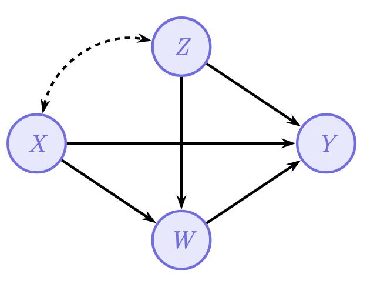
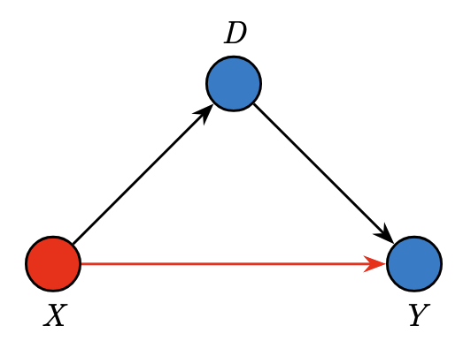
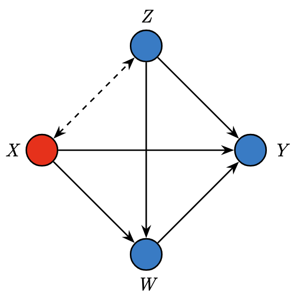
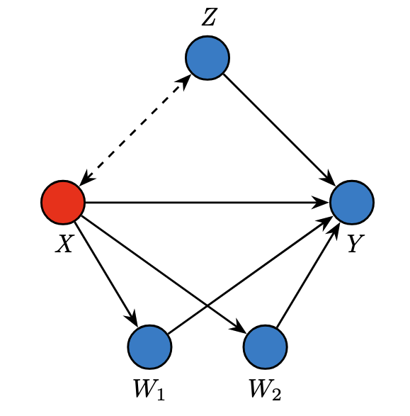
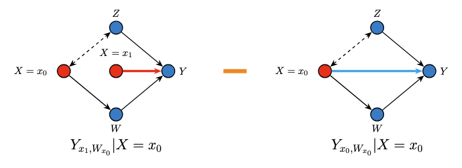
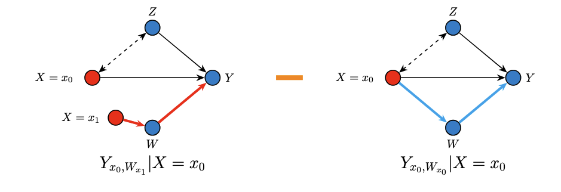
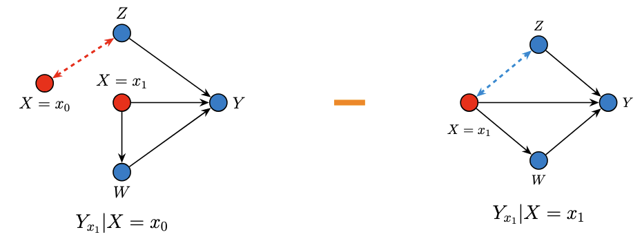

How do we know whether a disparity between two groups is caused by direct discrimination, indirect systemic factors, or simply reflects demographic differences? Traditional statistics can tell us *that* a gap exists, but not *why*. This is where **variation analysis** and the **Standard Fairness Model (SFM)** come in --- they give us a principled, causal toolkit to decompose observed disparities into meaningful, interpretable components.

In this tutorial, we will walk through these concepts step-by-step, using a real-world health equity study by [Plecko et al. (2025)](https://arxiv.org/abs/2501.05197) as our running example. We'll save the R code implementation for a follow-up post --- here, our goal is to *understand the ideas*.

::: {style="text-align: center;"}
{width="300"}
:::


## 1. The Big Question: Why Do Groups Differ?

### 1.1 Disparities Are Everywhere --- But What Causes Them?

Imagine you're a hospital administrator reviewing data and you notice that the mortality rate after ICU admission is 0.8% higher for White patients compared to African-American patients in a US hospital database. Your first reaction might be: "Great, there's no disadvantage for the minority group." But hold on --- does a smaller (or even reversed) gap in raw outcomes really mean the system is fair?

This is the question [Plecko et al. (2025)](https://arxiv.org/abs/2501.05197) tackled. They analyzed ICU data from two countries:

- **Australia (ANZICS APD)**: ~1 million ICU admissions across 181 hospitals, comparing Indigenous vs. Non-Indigenous patients.
- **United States (MIMIC-IV)**: ~39,000 ICU admissions from a Boston hospital, comparing African-American vs. White patients.

The raw mortality differences they found were:

$$
\text{(AU)} \quad E[\text{death} \mid \text{Non-Indigenous}] - E[\text{death} \mid \text{Indigenous}] = -0.4\%
$$

$$
\text{(US)} \quad E[\text{death} \mid \text{White}] - E[\text{death} \mid \text{African-American}] = 0.8\%
$$

In Australia, Indigenous patients appeared to die *more* often. In the US, African-American patients appeared to die *less* often. These numbers seem to tell completely different stories. But as we'll see, when we dig deeper with causal tools, the underlying mechanisms are strikingly similar.

### 1.2 Why Raw Comparisons Can Be Misleading

The problem with simply comparing group averages is that the observed difference can arise from *multiple distinct causal pathways*. Consider a simple example: if minority patients tend to be much younger on average (they are --- about 13.6 years younger in the Australian data), and younger people have lower mortality, then part of the "protective effect" we see for the minority group might just be an age artifact, not evidence of fair treatment.

::: {.callout-note title="Link to Education: The Berkeley Admissions (Simpson's Paradox)"}
This is the same logic behind one of the most famous examples in statistics: the **1973 UC Berkeley admissions case**. Overall, it looked like Berkeley was discriminating *against* women --- the university-wide acceptance rate was lower for female applicants. But when researchers examined admissions *department by department*, they found that most departments actually admitted women at equal or *higher* rates than men.

The paradox? Women were disproportionately applying to the most competitive departments (with low acceptance rates for everyone), while men were more likely to apply to less competitive departments. Aggregating across departments masked this structural difference and *reversed* the direction of the apparent effect.

The ICU data works the same way. When we compare raw mortality rates between racial groups, we're aggregating across patients with very different ages, disease severities, and treatment pathways. Just as Berkeley wasn't necessarily biased against women, a "favorable" raw mortality gap doesn't necessarily mean the healthcare system is fair. We need to decompose the disparity to understand what's really going on --- which is exactly what causal fairness analysis lets us do.
:::

This is why we need a **causal decomposition** and **Causal Fairness Analysis** --- a way to break the total observed disparity into its component parts, each corresponding to a different mechanism.

## 2. The Standard Fairness Model (SFM)

### 2.1 Setting Up the Causal Structure

The Standard Fairness Model is a type of causal diagram that organizes variables into four groups. Think of it as an framework/model that researchers can apply across many different fairness problems.

::: {style="text-align: center;"}
{width="300"}
:::

Here's what each group represents:

**$X$ --- Protected Attribute**: This is the group membership variable whose effect we want to study. In the ICU example, this is race/ethnicity (e.g., Indigenous vs. Non-Indigenous, or African-American vs. White).

**$Z$ --- Confounders**: These are variables that are correlated with the protected attribute but *not causally caused* by it. Think of variables like age, sex, and socioeconomic status. These create "spurious" associations between $X$ and $Y$ --- not because $X$ causes them, but because they share common background factors. The dashed arrow from $X$ to $Z$ indicates this non-causal association.

**$W$ --- Mediators**: These are variables that lie *on the causal pathway* from $X$ to $Y$. In the ICU example, mediators include chronic health status, admission diagnosis, and illness severity. Race/ethnicity can causally influence these (e.g., through disparities in primary healthcare access), and they in turn affect the outcome.

**$Y$ --- Outcome**: This is the outcome we care about. In the ICU study, this is in-hospital mortality.

### 2.2 Why This Structure Matters

SFM gives rise to **three causal pathways** from $X$ to $Y$:

| Pathway | Route | Interpretation |
|:--------|:------|:---------------|
| **Direct** | $X \rightarrow Y$ | The effect of group membership on the outcome *with all other variables held equal*. |
| **Indirect** | $X \rightarrow W \rightarrow Y$ | The effect transmitted *through* mediating variables (e.g., differences in illness severity). |
| **Confounded/Spurious** | $X \leftarrow\!\!\rightarrow Z \rightarrow Y$ | The "effect" that arises purely from shared background characteristics (e.g., age differences between groups). |

Each pathway tells a different story about *why* the groups differ in outcomes.

### 2.3 Applying the SFM to the ICU Study

In the Plecko et al. study, the SFM was constructed as follows:

| SFM Role | Australian Data (ANZICS APD) | US Data (MIMIC-IV) |
|:-------------|:------------------------------|:-------------------|
| $X$ (Protected) | Indigenous status | Race (African-American vs. White) |
| $Z$ (Confounders) | Age, sex, socioeconomic status | Age, sex |
| $W$ (Mediators) | Chronic health, admission diagnosis, illness severity | SOFA score, Charlson index, admission diagnosis, elective status |
| $Y$ (Outcome) | In-hospital mortality | In-hospital mortality |

The key insight is that the same template applies to both countries, even though the specific variables differ slightly. This makes the framework highly *generalizable*.

::: {.callout-tip title="Mapping to Education"}
Suppose we're studying the effect of **gender** ($X$) on **graduate STEM major admission** ($Y$):

| Pathway | Route | Education Example |
|:--------|:------|:------------------|
| **Direct** | $X \rightarrow Y$ | Gender directly affects admission. |
| **Indirect** | $X \rightarrow W \rightarrow Y$ | Gender shapes **undergraduate research experience and GRE scores** ($W$), which in turn affect the strength of graduate applications. |
| **Confounded/Spurious** | $X \leftarrow\!\!\rightarrow Z \rightarrow Y$ | Both gender and STEM admission are influenced by **race, socioeconomic status, and parental education** ($Z$), these background factors affect which students pursue STEM *and* correlate with gender composition across fields. |

Without decomposing these pathways, we might attribute the entire gender gap in STEM admissions to direct discrimination, when part of it flows through differences in undergraduate preparation and part is confounded by demographic and socioeconomic background.
:::

### 2.4 How the SFM Emerges: From Specific DAGs to an Unified Model

One motivation for the SFM comes from observing that *very different fairness problems* all converge to the same abstract structure. [Plecko & Bareinboim (2024)](https://doi.org/10.1561/2200000106) illustrate this in their monograph (also see the [Causal Fairness Analysis](https://fairness.causalai.net/#) with three classic examples:

**Example 1 --- Berkeley Admissions** (originally [Bickel et al., 1975](https://doi.org/10.1126/science.187.4175.398)): Students apply to university and choose a department ($D$). The admission decision ($Y$) depends on both gender ($X$) and department choice. Here $D$ acts as a mediator ($X \rightarrow D \rightarrow Y$) while gender also has a direct effect on admission ($X \rightarrow Y$). There are no confounders --- just a protected attribute, one mediator, and an outcome.

::: {style="text-align: center;"}
{width="300"}
:::

**Example 2 --- COMPAS Recidivism Prediction** (originally [Angwin et al., 2016](https://www.propublica.org/article/machine-bias-risk-assessments-in-criminal-sentencing)): A criminal justice algorithm predicts recidivism ($Y$) based on race ($X$), age ($Z$), and prior convictions ($W$). Age is a confounder (correlated with race but not caused by it), while prior convictions are a mediator (causally influenced by race through systemic factors). The dashed arrow between $X$ and $Z$ represents the non-causal association.

::: {style="text-align: center;"}
{width="300"}
:::


**Example 3 --- Government Census (Salary)**: The US census records salary ($Y$) along with gender ($X$), age ($Z$), education level ($W_1$), and employment status ($W_2$). Here there are *two* mediators, both affected by gender, and age again serves as a confounder.

::: {style="text-align: center;"}
{width="300"}
:::


**The convergence**: Despite having different numbers of variables and different specific edge structures, all three examples share the same abstract template. In each case, you can group the variables into four roles --- $X$ (protected attribute), $Z$ (confounders), $W$ (mediators), and $Y$ (outcome) --- and the arrows between these groups follow the same pattern.

This is why the SFM is also called a *clustered* graphical model. It doesn't require specifying the exact internal structure within $Z$ or within $W$. Whether you have one mediator (Berkeley), one mediator with a confounder (COMPAS), or two mediators with a confounder (Census), the SFM treats each group as a single node. The SFM projection theorem (Theorem 4.11 in Plecko & Bareinboim, 2024) formally proves that this coarsening does not lose information --- the $x$-specific and $z$-specific fairness measures are identical whether you compute them from the full detailed DAG or from the simplified SFM.

This makes the model very practical: when building a fairness analysis, the analyst only needs to correctly classify each variable into one of the four groups, not specify the full internal causal structure. For the ICU study, this meant that Plecko et al. did not need to know whether chronic health causally affects illness severity or vice versa --- they only needed to know that both belong to the mediator set $W$.


## 3. Total Variation and Variation Analysis

### 3.1 Total Variation: The Starting Point

The **Total Variation (TV)** is simply the observed average difference in outcomes between the two groups:

$$
\text{TV} = E[Y \mid X = x_1] - E[Y \mid X = x_0]
$$

where $x_1$ is the majority group and $x_0$ is the minority group. It's called "total variation" because it captures *everything* --- all the reasons, both causal and non-causal, why the groups differ.

**Important**: TV is *not* a causal quantity. It doesn't require any interventions or counterfactual reasoning. It's simply a conditional difference --- we just look at the data as-is and compare the average outcome for each group. This is what makes it easy to compute, but also what makes it potentially misleading.

### 3.2 Total Variation vs. Total Effect: What's the Difference?

This is a subtle but crucial distinction. The **Total Effect (TE)** uses *interventions*:

$$
\text{TE} = E[Y \mid do(X = x_1)] - E[Y \mid do(X = x_0)]
$$

The $do(\cdot)$ operator means "force $X$ to take a value" --- it breaks the incoming arrows to $X$, removing all confounding. TE captures the *causal* effect of $X$ on $Y$ through both direct and indirect pathways.

TV, on the other hand, includes everything TE captures *plus* the spurious variation that flows through the confounders:

$$
\text{TV} = \text{TE} + \text{Spurious Variation}
$$

Think of it this way:

- **TE** is like asking: "What would happen if we could magically change someone's race while keeping everything else as it would naturally respond?" It captures causal downstream effects only.
- **TV** is like asking: "What's the average difference between the groups as they naturally exist?" This includes both causal effects and demographic differences.

For fairness analysis, TV is often the more natural starting point, because we want to *explain* the observed gap, including the part due to confounders.

### 3.3 The Decomposition Theorem

The core theoretical result underlying variation analysis is a decomposition theorem. The Total Variation can be broken into exactly three components:

$$
\text{TV} = \underbrace{x\text{-DE}}_{\text{direct}} + \underbrace{(-x\text{-IE})}_{\text{indirect}} + \underbrace{(-x\text{-SE})}_{\text{spurious/confounded}}
$$

Let's unpack each piece.

#### The Direct Effect ($x$-DE)

$$
x\text{-DE}_{x_0,x_1}(y \mid x_0) = E[Y_{x_1, W_{x_0}} - Y_{x_0, W_{x_0}} \mid X = x_0]
$$

* For a person in the minority group ($X = x_0$), what would happen to their outcome if we switched *only* the direct pathway from minority to majority ($X = x_1$), while keeping the mediators at their natural minority-group levels?

* Think of it this way: imagine you could change someone's race on their medical chart but keep their actual health condition, illness severity, and admission diagnosis the same as they would naturally be for someone in the minority group. The $x$-DE captures how the outcome changes just from that direct switch.

#### The Indirect Effect ($x$-IE)

$$
x\text{-IE}_{x_1,x_0}(y \mid x_0) = E[Y_{x_0, W_{x_1}} - Y_{x_0, W_{x_0}} \mid X = x_0]
$$

* For a person in the minority group, what would happen if we changed only the mediators to what they would have been if this person were in the majority group, while keeping the direct pathway at the minority-group level?

* Imagine keeping someone's race/ethnicity fixed but magically giving them the chronic health status, illness severity, and admission patterns typical of the majority group. The change in outcome captures the *indirect* pathway.

#### The Spurious Effect ($x$-SE)

$$
x\text{-SE}_{x_1,x_0}(y) = P(Y_{x_1} \mid x_0) - P(Y_{x_1} \mid x_1)
$$

* How much of the difference between groups is due to the fact that the two groups differ in their background characteristics (confounders like age and sex), *not* because of any causal effect of the protected attribute?

* This captures the "Simpson's Paradox"-type effects --- the fact that minority patients tend to be younger, and younger patients have lower mortality, creates a spurious protective association.

### 3.4 Nested Counterfactual DAGs

The decomposition may seem abstract, so let's use a series of **nested DAG diagrams** --- inspired by the lecture slides from Plečko's Causal Inference for Health Data course --- to visualize exactly what each effect measures. Each diagram uses two copies of $X$: a red node ($X = x_0$, minority) and a blue/intervention node ($X = x_1$, majority), to show which value of $X$ is "active" along each pathway.

#### The Direct Effect ($x$-DE): Switching Only the Direct Arrow

The $x$-DE asks: for someone observed in the minority group ($X = x_0$), what happens if we switch *only the direct pathway* to $X = x_1$ while keeping the mediators at their natural minority-group levels ($W_{x_0}$)?

$$
x\text{-DE}_{x_0,x_1}(y \mid x_0) = P(y_{x_1, W_{x_0}} \mid x_0) - P(y_{x_0, W_{x_0}} \mid x_0)
$$


::: {style="text-align: center;"}
{width="700"}
:::


**Reading the diagram**: In the left graph, notice the *two* copies of $X$. The outer node $X = x_0$ feeds the confounder association and the mediator pathway (keeping them at minority-group levels). But the inner node $X = x_1$ feeds only the direct arrow to $Y$. We then subtract the right graph, where everything runs at $X = x_0$. The difference isolates the direct pathway.

In the ICU example, this captures what happens when we change a patient's race label on their chart (affecting treatment decisions directly) while keeping their actual health status, illness severity, and admission type unchanged.

#### The Indirect Effect ($x$-IE): Switching Only the Mediator Pathway

The $x$-IE asks: for a minority-group individual, what happens if we change *only the mediators* to what they would be at the majority-group level ($W_{x_1}$), while holding the direct pathway at $X = x_0$?

$$
x\text{-IE}_{x_1,x_0}(y \mid x_0) = P(y_{x_0, W_{x_1}} \mid x_0) - P(y_{x_0, W_{x_0}} \mid x_0)
$$

::: {style="text-align: center;"}
{width="700"}
:::


**Reading the diagram**: In the left graph, the direct arrow to $Y$ stays at $X = x_0$, but the mediator $W$ is now set as though $X = x_1$ (via the inner red node). This isolates the effect that flows *only through the mediating variables*.

In the ICU context, this asks: what would happen to a minority patient's mortality if their chronic health, illness severity, and admission type were the same as those of a comparable majority patient, while the ICU still treated them as a minority patient?

#### The Spurious Effect ($x$-SE): The Confounding Pathway

The $x$-SE captures the non-causal association arising because the two groups naturally differ in their confounder distributions:

$$
x\text{-SE}_{x_1,x_0}(y) = P(y_{x_1} \mid x_0) - P(y_{x_1} \mid x_1)
$$

::: {style="text-align: center;"}
{width="700"}
:::


**Reading the diagram**: Both graphs apply the *same* intervention ($X = x_1$ through all causal pathways), but they condition on different populations --- one drawn from the minority group, one from the majority group. The only difference is the confounders $Z$, which differ between the two populations. This isolates the non-causal, spurious component.

In the ICU example, this captures the difference due to minority patients being younger on average. Since younger patients have lower mortality, this creates a spurious "protective" effect that isn't related to ICU treatment at all.

#### How the Three Nested DAGs Sum to TV

The remarkable result is that these three components --- each visualized through its own nested DAG --- sum exactly to the observed Total Variation:

$$
\underbrace{E[Y \mid x_1] - E[Y \mid x_0]}_{\text{TV}} = \underbrace{x\text{-DE}_{x_0,x_1}(y \mid x_0)}_{\text{direct nested DAG}} - \underbrace{x\text{-IE}_{x_1,x_0}(y \mid x_0)}_{\text{indirect nested DAG}} - \underbrace{x\text{-SE}_{x_1,x_0}(y)}_{\text{spurious nested DAG}}
$$

This decomposition holds exactly. Every bit of the observed disparity is accounted for by one of the three nested counterfactual comparisons.

### 3.5 Identifying the Direct Effect from Observational Data

A natural question arises: these counterfactual quantities involve nested interventions (like $Y_{x_1, W_{x_0}}$), which we can never directly observe. How do we actually *compute* these effects from real data?

This is the **identification problem** --- translating causal (counterfactual) quantities into expressions involving only the observational distribution $P(X, Z, W, Y)$. The key insight is that the structure of the Standard Fairness Model, combined with tools from causal inference (the law of total probability, the consistency axiom, and conditional independences encoded in the DAG), allows us to do exactly this.

#### The Identification Theorem Under the SFM

Under the assumptions of the Standard Fairness Model (Theorem 4.10 in Plecko & Bareinboim, 2024), all the $x$-specific measures ($x$-DE, $x$-IE, $x$-SE) and $z$-specific measures ($z$-DE, $z$-IE) are **identifiable** from observational data. This means they can be computed uniquely from the joint distribution $P(X, Z, W, Y)$ without needing to know the full structural causal model.

This is a powerful result --- it tells us that under the relatively mild assumptions of the SFM (four variable groups with a specific causal ordering), we can extract meaningful causal fairness measures from observational data alone.

#### Step-by-Step Derivation of the $x$-DE

Let's work through the identification of the direct effect in detail. Our goal is to express the counterfactual quantity

$$
x\text{-DE}_{x_0,x_1}(y \mid x_0) = E[Y_{x_1, W_{x_0}} \mid X = x_0] - E[Y_{x_0} \mid X = x_0]
$$

purely in terms of quantities we can estimate from data. We focus on the first (harder) term, $E[Y_{x_1, W_{x_0}} \mid X = x_0]$, since the second term $E[Y_{x_0} \mid X = x_0] = E[Y \mid X = x_0]$ follows directly from the consistency axiom.

**Step 1: Introduce $W$ via the Law of Total Expectation.**

We marginalize over the mediator $W$ (and the confounders $Z$):

$$
E[Y_{x_1, W_{x_0}} \mid x_0] = \sum_{w} \sum_{z} E[Y_{x_1, w} \mid x_0, z] \cdot P(w \mid x_0, z) \cdot P(z \mid x_0)
$$

Here we use the law of iterated expectation, and the fact that under the SFM, $W_{x_0}$ can be decomposed by conditioning on $Z$. The term $P(w \mid x_0, z)$ gives us the natural distribution of the mediator for someone in the minority group with confounder value $z$, and $P(z \mid x_0)$ gives the confounder distribution in the minority group.

**Step 2: Apply the Consistency Axiom to $P(w \mid x_0, z)$.**

Since we are conditioning on $X = x_0$, the consistency axiom tells us that $W_{x_0} = W$ for individuals with $X = x_0$. This means:

$$
P(W_{x_0} = w \mid X = x_0, Z = z) = P(W = w \mid X = x_0, Z = z)
$$

This is an observational quantity! It's just the conditional distribution of $W$ given $X = x_0$ and $Z = z$ in the data.

**Step 3: Apply Conditional Independence from the DAG to $E[Y_{x_1, w} \mid x_0, z]$.**

This is the crucial step where the causal graph structure does the heavy lifting. In the SFM, once we condition on $W = w$ and $Z = z$, the outcome $Y$ is independent of the "background" value of $X$ used for sampling. More formally, using the graphical d-separation properties of the SFM:

$$
E[Y_{x_1, w} \mid x_0, z] = E[Y_{x_1, w} \mid z] = E[Y \mid x_1, w, z]
$$

The first equality holds because, in the SFM, conditioning on $Z = z$ blocks all back-door paths between $X$ and $Y$ that don't go through $W$. The second equality is another application of the consistency axiom: for a unit with $X = x_1$, $W = w$, and $Z = z$, we have $Y_{x_1, w} = Y$.

**Step 4: Combine into the Final Identification Formula.**

Substituting Steps 2 and 3 back into Step 1, we obtain:

$$
\boxed{E[Y_{x_1, W_{x_0}} \mid x_0] = \sum_{w} \sum_{z} E[Y \mid x_1, w, z] \cdot P(w \mid x_0, z) \cdot P(z \mid x_0)}
$$

This is the **mediation formula** adapted for the SFM context. Every term on the right-hand side is estimable from observational data:

- $E[Y \mid x_1, w, z]$: the expected outcome for majority-group members with mediator value $w$ and confounder value $z$ --- estimated from the data by looking at outcomes for the majority group, stratified by $W$ and $Z$.
- $P(w \mid x_0, z)$: the conditional distribution of the mediator among minority-group members with confounder value $z$ --- estimated from the minority-group data.
- $P(z \mid x_0)$: the distribution of confounders in the minority group --- estimated directly from the minority-group data.

Therefore, the complete $x$-DE identification formula is:

$$
x\text{-DE}_{x_0,x_1}(y \mid x_0) = \sum_{w,z} E[Y \mid x_1, w, z] \cdot P(w \mid x_0, z) \cdot P(z \mid x_0) - E[Y \mid x_0]
$$

#### Intuition Behind the Formula

The formula has a beautiful intuitive interpretation. To compute the direct effect, we:

1. **Start with minority individuals** --- draw them from the minority population ($P(z \mid x_0)$).
2. **Keep their mediators natural** --- use the mediator distribution that's natural for the minority group ($P(w \mid x_0, z)$).
3. **Switch only the direct pathway** --- look up what the outcome would be *for the majority group* with those same mediator and confounder values ($E[Y \mid x_1, w, z]$).
4. **Subtract the baseline** --- compare against the actual observed minority outcome ($E[Y \mid x_0]$).

In the ICU context, this means: we take minority patients, keep their actual health conditions as-is, but ask "what would their mortality be if the ICU treated them as if they were majority patients?" The difference is the direct effect.

#### Analogous Identification of IE and SE

The same logic yields identification formulas for the other two components:

$$
x\text{-IE}_{x_1,x_0}(y \mid x_0) = \sum_{w,z} E[Y \mid x_0, w, z] \cdot \big[P(w \mid x_1, z) - P(w \mid x_0, z)\big] \cdot P(z \mid x_0)
$$

$$
x\text{-SE}_{x_1,x_0}(y) = \sum_{z} E[Y \mid x_1, z] \cdot \big[P(z \mid x_0) - P(z \mid x_1)\big]
$$

Notice the pattern: the IE formula swaps the mediator distribution from $P(w \mid x_0, z)$ to $P(w \mid x_1, z)$ while holding everything else at minority levels. The SE formula compares the confounder distributions between groups. All three formulas use only observational quantities.

## 4. Walking Through the ICU Example

### 4.1 The Decomposition Results

When Plecko et al. applied this decomposition to their data, they found:

**United States (MIMIC-IV):**

$$
\begin{aligned}
\text{(US)} \quad & E[\text{death} \mid \text{White}] - E[\text{death} \mid \text{African-American}] = \underbrace{0.8\%}_{\text{TV}} \\
&= \underbrace{1.0\%}_{\text{Direct}} + \underbrace{(-1.3\%)}_{\text{Indirect}} + \underbrace{1.1\%}_{\text{Confounded}}
\end{aligned}
$$


**Australia (ANZICS APD):**

$$
\begin{aligned}
\text{(AU)} \quad & E[\text{death} \mid \text{Non-Indigenous}] - E[\text{death} \mid \text{Indigenous}]= \underbrace{-0.4\%}_{\text{TV}} \\
& = \underbrace{0.5\%}_{\text{Direct}} + \underbrace{(-2.7\%)}_{\text{Indirect}} + \underbrace{1.8\%}_{\text{Confounded}}
\end{aligned}
$$

Despite the raw TV having *opposite signs* in the two countries, the three causal components have the **same signs** in both datasets. This is a remarkable finding --- it means the same underlying mechanisms are at work across continents.

### 4.2 Interpreting Each Component

#### Confounded (Spurious) Effect: +1.8% (AU) / +1.1% (US)

This positive confounded effect arises primarily because minority patients are significantly younger on average. In the Australian data, Indigenous patients were admitted about 13.6 years younger (median age ~51 vs. ~67). In the US data, African-American patients were about 6.3 years younger (median age ~60 vs. ~67).

Since younger patients have lower mortality risk, the age difference creates a "protective" association for the minority group that has nothing to do with how they're treated in the ICU. It's simply a byproduct of differing demographics, the groups have different age compositions.

```{mermaid}
%%| fig-cap: "The confounded pathway: age differences create spurious association"
graph LR
    X((Race/<br/>Ethnicity)) <-.->|"correlation"| Z((Age, Sex,<br/>SES))
    Z -->|"younger patients<br/>have lower mortality"| Y((Mortality))

    style X fill:#ff6b6b,stroke:#333,color:#fff
    style Z fill:#45b7d1,stroke:#333,color:#fff
    style Y fill:#4ecdc4,stroke:#333,color:#fff
```

#### Indirect Effect: -2.7% (AU) / -1.3% (US)

The negative indirect effect means minority patients fare *worse* through the mediating pathway. This is the most concerning component from an equity perspective. It captures the fact that, even after accounting for age, sex, and SES:

- Minority patients had **worse chronic health** status
- Minority patients were more likely to be admitted for **urgent, non-elective reasons** (medical emergencies rather than planned surgeries)
- Minority patients had **higher illness severity** at admission (higher SOFA scores in Australia)

These mediators --- chronic health, admission type, and illness severity --- transmit the disadvantage of being in the minority group into worse ICU outcomes. This is where structural inequities in healthcare access manifest most clearly.

```{mermaid}
%%| fig-cap: "The indirect pathway: systemic disadvantages transmitted through health status"
graph LR
    X((Race/<br/>Ethnicity)) -->|"disparities in<br/>primary care access"| W((Chronic Health,<br/>Illness Severity,<br/>Admission Type))
    W -->|"sicker patients<br/>have higher mortality"| Y((Mortality))

    style X fill:#ff6b6b,stroke:#333,color:#fff
    style W fill:#96ceb4,stroke:#333,color:#fff
    style Y fill:#4ecdc4,stroke:#333,color:#fff
```

#### Direct Effect: +0.5% (AU) / +1.0% (US)

Surprisingly, the direct effect was *protective* for minority patients. This means that when all other variables (age, sex, SES, chronic health, illness severity, admission type) are held equal, minority patients actually showed *better* survival than their majority counterparts.

This seems paradoxical at first. Why would minority patients do *better* when everything else is equal?

::: {.callout-tip}
## Interpreting the Signs: Who Is Disadvantaged?

In this decomposition, the outcome $Y$ is **mortality** and the TV is computed as $E[Y \mid \text{majority}] - E[Y \mid \text{minority}]$. So a **positive** value means the majority group has higher mortality (minority appears "protected"), and a **negative** value means the minority group has higher mortality (minority is disadvantaged).

**Direct Effect (+0.5% AU / +1.0% US)** — *Minority patients survive better along the direct pathway.* When all mediators (chronic health, illness severity, admission type) are held at their natural minority-group levels, minority patients actually show *lower* mortality than majority patients. This seems like good news, but the tipping over hypothesis (Section 4.3) reveals it is actually a sign of inequity: because minority patients have worse access to primary care, they are admitted to ICU at higher rates and for less severe conditions, creating a selection effect that artificially lowers their in-ICU mortality.

**Indirect Effect (−2.7% AU / −1.3% US)** — *Minority patients are disadvantaged through the mediating pathways.* This captures the effect of worse chronic health status, higher illness severity, and more urgent/non-elective admission patterns among minority patients. These mediators --- shaped by systemic inequities in healthcare access --- *increase* mortality risk for the minority group. This is where structural disadvantage shows up most clearly.

**Confounded Effect (+1.8% AU / +1.1% US)** — *Demographic differences create a spurious "protective" association.* Minority patients in both datasets tend to be significantly younger (median age 50.6 vs. 66.6 in Australia; 60 vs. 67 in the US). Since younger patients have lower mortality, age acts as a confounder that makes the minority group *appear* healthier in aggregate --- a classic Simpson's Paradox-type effect.

**The big picture**: The raw TV of $-0.4\%$ (AU) and $+0.8\%$ (US) tells opposite stories on the surface. But the decomposition reveals that in *both* countries, the same mechanisms are at work: a protective direct effect (driven by selection bias from worse primary care access), a harmful indirect effect (driven by worse health and more acute admissions), and a protective confounded effect (driven by younger age). The causal decomposition cuts through the misleading surface-level statistics to reveal consistent patterns of structural disadvantage.
:::

### 4.3 The "Tipping Over" Hypothesis

[Plecko et al. (2025)](https://arxiv.org/abs/2501.05197) proposed an explanation called the **tipping over hypothesis**. The reasoning goes:

1. Minority patients have worse access to primary healthcare.
2. For majority patients, medical complications are more likely to be prevented through primary care, so only the more severe cases reach the ICU — creating a selection bias (or left-censoring of majority group patients).
3. For minority patients, conditions that *could have been prevented or managed earlier* instead progress to the point of requiring ICU admission. This means a higher prevalence of ICU admission for a given diagnosis, and this increased prevalence implies that less severe and possibly preventable cases also reach the ICU.
4. Because the pool of minority ICU patients includes these less severe cases, the group shows better average survival once in the ICU — even though the higher admission rate itself reflects a deeper inequity.

In other words, the "protective" direct effect is actually a sign of a deeper inequity. The study confirmed this through several pieces of evidence: minority patients were 182% more likely to be admitted to ICU for a medical reason in Australia (79% more likely for emergency surgery, and 14% less likely for elective surgery). The pattern of increased baseline risk of ICU admission was significantly correlated with the strength of the protective direct effect across age groups and admission types (Pearson's ρ = 0.45, 95% CI [0.22, 0.68]). Furthermore, a separate readmission analysis showed that minority patients were more likely to be readmitted to ICU, with the readmission pattern also significantly correlated with the protective direct effect (ρ = 0.74 in Australia, ρ = 0.81 in the US).

Importantly, this protective direct effect was observed primarily for **medical admissions**, not surgical ones, consistent with the hypothesis that it is driven by under-utilization of primary care rather than a biological difference.

## 5. Interaction Testing and Heterogeneous Effects

### 5.1 Are the Three Effects Independent?

An important follow-up question is: do the direct, indirect, and confounded effects operate independently, or do they *interact*? The framework includes a formal way to test this using **interaction testing** ([Plecko, 2024](https://arxiv.org/abs/2411.08861)).

Mathematically, the absence of interactions would imply that the outcome mechanism can be written as a sum of separate functions. For a binary outcome $Y$ (such as mortality), this means the probability of the outcome can be decomposed additively on the risk scale:

$$
p_y(x, z, w) := P(f_y(x, z, w, U_y) = 1) = p_y^{(1)}(x) + p_y^{(2)}(w) + p_y^{(3)}(z)
$$

If this holds, then each pathway operates independently --- the effect of race through the direct pathway is the same regardless of the patient's age or chronic health status. If not, the effect along one pathway changes depending on the values of variables in another pathway.

### 5.2 What Does "No Interaction" Imply?

When the additivity condition holds, we get a remarkably clean consequence: the direction of transition along each pathway no longer matters. Formally, the decomposition becomes symmetric:

$$
x\text{-DE}_{x_0, x_1}(y \mid x_0) = x\text{-DE}_{x_1, x_0}(y \mid x_0)
$$

$$
x\text{-IE}_{x_0, x_1}(y \mid x_0) = x\text{-IE}_{x_1, x_0}(y \mid x_0)
$$

$$
x\text{-CE}_{x_0, x_1}(y) = x\text{-CE}_{x_1, x_0}(y)
$$

In plain language: if there are no interactions, the direct effect of switching from minority to majority is the same magnitude (just opposite sign) as switching from majority to minority. This is analogous to how, in a linear regression, the effect of increasing $X$ by one unit is the same regardless of the current value of $X$ --- linearity implies no interaction.

When interactions *are* present, this symmetry breaks down. The direct effect of race on mortality might be strongly protective for young patients admitted for medical reasons, but negligible or even harmful for older surgical patients. The decomposition depends on which direction we examine.

### 5.3 How to Test for Interactions

Plecko et al. followed the non-parametric interaction testing approach from [Plecko (2024)](https://arxiv.org/abs/2411.08861). The idea is to test, for each pair of pathways, whether the effect along one pathway is modified by the variables in the other. The five hypothesis tests are:

| Interaction Test | What It Asks |
|:---:|:---|
| TE $\otimes$ SE | Does the *total causal* effect vary across different confounder strata? |
| DE $\otimes$ IE | Does the *direct* effect change depending on the mediator values? |
| DE $\otimes$ SE | Does the *direct* effect change depending on the confounder values? |
| IE $\otimes$ SE | Does the *indirect* effect change depending on the confounder values? |
| DE $\otimes$ IE $\otimes$ SE | Is there a three-way interaction among all pathways simultaneously? |

Each test produces a p-value. A significant result (p < 0.05) indicates that the two pathways do *not* operate independently --- the effect along one pathway depends on the values of variables in the other.

::: {.callout-note}
## Interaction Testing Results from the ICU Study

| Interaction Test | ANZICS APD (AU) | MIMIC-IV (US) |
|:---:|:---:|:---:|
| TE $\otimes$ SE | < 0.01* | 0.11 |
| DE $\otimes$ IE | 0.02* | 0.02* |
| DE $\otimes$ SE | 0.04* | 0.71 |
| IE $\otimes$ SE | 0.03* | < 0.01* |
| DE $\otimes$ IE $\otimes$ SE | 0.59 | 0.11 |

\* indicates significance at the 0.05 level. (Reproduced from Plecko et al., 2025, Appendix B, Table B3.)
:::

The key findings across both datasets:

- **DE $\otimes$ IE is significant in both countries** (p = 0.02): The direct effect of race on mortality is modified by the mediating variables (chronic health, illness severity, admission type). This means the "protective" direct effect is not uniform --- it depends on the patient's health profile.
- **IE $\otimes$ SE is significant in both countries** (AU: p = 0.03, US: p < 0.01): The indirect effect (through health status and admission patterns) varies depending on confounders like age and sex. The systemic disadvantage transmitted through mediators hits different demographic subgroups differently.
- **No significant three-way interaction** in either dataset (AU: p = 0.59, US: p = 0.11): The pairwise interactions are sufficient to capture the heterogeneity --- we do not need to model a complex three-way interplay.

### 5.4 Investigating Heterogeneous Effects

Given the significant interactions, Plecko et al. investigated *where* the heterogeneity lies by computing direct effects stratified by **age group** and **admission type**. They defined four age groups ($C_1$ through $C_4$, corresponding to 18--54, 55--64, 65--74, and 75--100 years) and three admission categories (medical admissions $d_{med}$, emergency surgery $d_{ems}$, and elective surgery $d_{els}$). The stratified direct effect is:

$$
\text{DE}_{x_0,x_1}(y \mid C_i, d, x_0) = E[Y_{x_1, W_{x_0}} - Y_{x_0, W_{x_0}} \mid \text{age} \in C_i, \text{admission} = d, X = x_0]
$$

This quantity asks: for minority patients in a specific age group and admission type, what is the direct effect of switching their group membership from minority to majority?

The results revealed a striking pattern:

- **Medical admissions** showed a pronounced protective direct effect for the minority group across most age groups in both countries --- minority patients admitted for medical reasons had lower mortality than comparable majority patients.
- **Surgical admissions** (both emergency and elective) showed little to no protective direct effect --- the pattern was largely absent.
- **The pattern varied by age**: In Australia, the protective effect for medical admissions was strongest in younger age groups and diminished for the oldest patients.

::: {.callout-tip}
## Why Does Heterogeneity Matter for the Tipping Over Hypothesis?

The fact that the protective direct effect was concentrated in **medical admissions** (not surgical) provides strong support for the tipping over hypothesis. Medical conditions are precisely the type most likely to be preventable through primary care. If minority patients lack access to primary care, their preventable medical conditions progress until they require ICU admission --- inflating the minority admission rate and diluting average severity for this specific admission type.

Surgical admissions, by contrast, are less dependent on primary care access (you need surgery regardless of your preventive care history), so the tipping over mechanism should not apply as strongly. And indeed, the data confirms this: no consistent protective direct effect for surgical patients.

This heterogeneity would have been invisible without interaction testing. The aggregate direct effect (+0.5% AU / +1.0% US) masks the fact that it is driven almost entirely by one admission category.
:::

## 6. The Explainability Plane: A Unified View

### 6.1 Two Axes of Variation

[Plecko and Bareinboim (2024)](https://doi.org/10.1561/2200000106) introduced an organizing framework called the **Explainability Plane**. It organizes all fairness measures along two dimensions:

**The Mechanism Axis (horizontal)**: This distinguishes between total causal, direct, indirect, and spurious effects. It answers the question: *through which pathway does the variation flow?*

**The Population Axis (vertical)**: This controls the level of granularity. At the top, we consider the entire population. Moving down, we condition on successively more specific subgroups --- by treatment group, by confounder values, or even at the individual level. It answers the question: *for whom are we measuring the variation?*

The key insight is that the TV decomposition:

$$
\text{TV} = x\text{-DE} - x\text{-IE} - x\text{-SE}
$$

occupies a specific row of this plane (the $P(u \mid x)$ row). The same decomposition logic applies at every level of granularity, making the framework highly flexible.

### 6.2 The Fairness Map

The Explainability Plane naturally leads to a comprehensive organizational tool called the **Fairness Map** (Theorem 4.8 and Fig. 4.5 in [Plecko & Bareinboim, 2024](https://doi.org/10.1561/2200000106)). The Fairness Map arranges every measure in the TV-family into a grid with five rows (population levels) and four columns (mechanism types):

| | **Causal** | **Direct** | **Indirect** | **Spurious** |
|:-----------|:-----------|:-----------|:------------|:------------|
| $P(u)$ | TE | NDE | NIE | Exp-SE |
| $P(u \mid x)$ | $x$-TE | $x$-DE | $x$-IE | $x$-SE |
| $P(u \mid z)$ | $z$-TE | $z$-DE | $z$-IE | **✗** |
| $P(u \mid v)$ | $v$-TE | $v$-DE | $v$-IE | **✗** |
| $\delta_u$ | $u$-TE | $u$-DE | $u$-IE | **✗** |

The **horizontal axis (Mechanism Axis)** separates measures by which causal pathway they capture. The paper further divides this axis into *Composite* measures (the Causal column and TV, which bundle multiple pathways) and *Atomic* measures (Direct, Indirect, Spurious --- the most refined decomposition under the SFM). "Causal" captures the total causal effect (direct + indirect combined), "Direct" isolates $X \rightarrow Y$, "Indirect" isolates $X \rightarrow W \rightarrow Y$, and "Spurious" captures the non-causal confounding path $X \leftarrow\!\!\rightarrow Z \rightarrow Y$.

The **vertical axis (Population Axis)** controls the granularity of the population being examined. At the top ($P(u)$), we average over the entire population --- these are the classical measures. Moving down, $P(u \mid x)$ restricts to a specific treatment group (the $x$-specific measures we use in our TV decomposition). Further rows condition on confounder values ($P(u \mid z)$), arbitrary observed variables ($P(u \mid v)$), and finally individual units ($\delta_u$).

#### Why the ✗ Marks Matter

Notice the Spurious column has ✗ marks for every row below $P(u \mid x)$. This is not arbitrary --- it reflects a deep structural property. Spurious effects are defined by comparing *different populations* (minority vs. majority), so they require variation across groups to exist. Under the SFM, once you condition on $Z = z$, the confounding path $X \leftarrow\!\!\rightarrow Z \rightarrow Y$ is blocked by definition. There is simply no spurious variation left to measure at the $z$-specific or finer levels. This is actually a nice feature: conditioning on confounders automatically eliminates spurious effects.

#### Three Key Relationships in the Map

The map encodes three fundamental relationships between measures:

**Decomposability (reading horizontally)**: At every row, the Causal column decomposes into Direct + Indirect. For instance, at the population level: $\text{TE} = \text{NDE} - \text{NIE}$. At the $x$-specific level: $x\text{-TE} = x\text{-DE} - x\text{-IE}$. And TV itself decomposes into all three columns: $\text{TV} = x\text{-DE} - x\text{-IE} - x\text{-SE}$.

**Admissibility (reading downward)**: Each measure below is *admissible* with respect to the structural fairness criterion of the same column. Concretely, if the structural direct effect (Str-DE) is zero in the true SCM, then $u$-DE = 0, which implies $v$-DE = 0, which implies $z$-DE = 0, which implies $x$-DE = 0, which implies NDE = 0. In other words, each row provides a valid (if potentially weaker) test for the structural criterion above it.

**Power (reading upward)**: Measures lower on the population axis are *more powerful* --- they can detect discrimination that higher-level measures miss (Def. 4.3 in [Plecko & Bareinboim, 2024](https://fairness.causalai.net/#)). This is the critical practical implication. Consider the startup hiring example (Examples 4.10 in the monograph): the NDE can equal zero (no discrimination detected at the population level) while $x$-DE is nonzero (3.6% discrimination against females), and $z$-DE reveals an even larger disparity (20% within specific age groups). The population-level measure was blind to the discrimination because it averaged over heterogeneous subgroups where effects cancelled out.

#### Where TV Decomposition Lives

The TV decomposition we've been discussing throughout this tutorial --- $\text{TV} = x\text{-DE} - x\text{-IE} - x\text{-SE}$ --- lives in the **second row** of the Fairness Map (the $P(u \mid x)$ row), corresponding to Theorem 4.3 $x$-specific in [Plecko & Bareinboim (2024)](https://doi.org/10.1561/2200000106). This is a practically important choice for two reasons. First, all three measures in that row are identifiable from observational data under the SFM assumptions (Theorem 4.10), as we derived in Section 3.5. Second, the $x$-specific measures are more powerful than their population-level counterparts (NDE, NIE, Exp-SE) while requiring no additional data beyond what the SFM already assumes.

If even more granular analysis is desired, one can move down to $z$-specific measures --- conditioning on specific confounder values to examine, for instance, whether the direct effect of race on ICU mortality differs across age groups. However, going all the way to individual-level measures ($u$-DE, $u$-IE) is generally not possible without stronger assumptions, since those require knowledge of the full SCM.

### 6.3 From Population to Individual

At the population level ($P(u)$), we get the familiar ATE, NDE, and NIE. At the treatment-group level ($P(u \mid x)$), we get the $x$-specific measures used in the TV decomposition. We can go even further, conditioning on specific confounder values ($P(u \mid x, z)$) to get group-specific fairness measures, or even reason about individual-level fairness ($\delta_u$).

This layered structure ensures that the same conceptual framework applies whether we're assessing system-wide disparities, subgroup-specific effects, or individual cases.


## 7. Reflection

### 7.1 Achievement Gap Analysis

The most natural application mirrors the ICU study directly. Consider analyzing the test score gap between demographic groups (e.g., by race, socioeconomic status, or first-generation college status). Using the SFM, we could set:

- $X$: Student demographic group (e.g., underrepresented minority status)
- $Z$: Background confounders (parental education, neighborhood characteristics, school district funding)
- $W$: Mediators (course-taking patterns, school quality indicators, access to tutoring, teacher experience)
- $Y$: Academic outcome (test scores, graduation rate, college enrollment)

A TV decomposition could reveal whether the achievement gap is primarily driven by direct discrimination (students being graded differently), indirect structural disadvantages (unequal access to resources and opportunities), or confounded effects (pre-existing socioeconomic differences).

### 7.2 College Admissions and Scholarship Equity

Universities could apply this framework to audit their admissions processes. If acceptance rates differ by race or socioeconomic status, the decomposition could disentangle how much of the difference is due to direct admissions criteria, how much flows through mediating factors like SAT scores and extracurricular activities (which themselves reflect systemic inequities), and how much is confounded by geographic and demographic factors.

### 7.3 Identifying "Tipping Over" Effects in Education

The tipping-over hypothesis from the ICU study has a compelling educational analog. Consider students who are referred for special education services or who drop out and later obtain a GED. If disadvantaged students face higher barriers to accessing early intervention, they may accumulate academic difficulties until they "tip over" into more intensive (and costly) remediation programs. Analyzing this pattern using the framework could reveal whether higher rates of crisis intervention for certain groups mask underlying access disparities --- much like how higher ICU admission rates for Indigenous patients masked underlying primary care gaps.

### 7.4 Policy Evaluation

Perhaps most importantly, the decomposition provides a principled basis for policy design. If the indirect effect (through school resources and course access) dominates the achievement gap, then policy should focus on equalizing educational inputs. If the direct effect is significant, it may point to biased grading practices or classroom-level discrimination. If the confounded effect is large, it suggests that addressing the gap requires broader social interventions beyond the education system itself.

### 7.5 Challenges and Considerations

Applying this framework to education does present unique challenges. Constructing the correct causal diagram requires substantial domain knowledge and is inherently debatable. The overlap assumption --- that every type of student has a non-zero probability of belonging to each group --- may be violated in highly segregated educational systems. And the interpretation of "protected attributes" in education is more nuanced, since variables like socioeconomic status are both confounders and, arguably, protected attributes themselves.

Despite these challenges, the formal decomposition provides something that purely descriptive analyses cannot: a principled way to attribute observed disparities to specific causal mechanisms, guiding interventions toward the pathways where they will be most effective.

## References and Further Reading

- Plecko, D., Secombe, P., Clarke, A., Gao, S., Gong, J., Grunauer, M., Guo, Y., Halloran, K., Higgins, A., Jorm, L., Kennedy, M., Litton, E., Nichol, A., Pilcher, D., Udy, A., & Bareinboim, E. (2025). An Algorithmic Approach for Causal Health Equity: A Look at Race Differentials in Intensive Care Unit (ICU) Outcomes. *arXiv:2501.05197*. [Paper](https://arxiv.org/abs/2501.05197) | [GitHub Repository](https://github.com/dplecko/RaceMortalityICU)

- Plecko, D. & Bareinboim, E. (2024). Causal Fairness Analysis: A Causal Toolkit for Fair Machine Learning. *Foundations and Trends in Machine Learning*, 17(3), 304–589. [Paper](https://doi.org/10.1561/2200000106)

- Zhang, J. & Bareinboim, E. (2018). Fairness in Decision-Making — The Causal Explanation Formula. *Proceedings of the 32nd AAAI Conference on Artificial Intelligence (AAAI-18)*. [Paper](https://aaai.org/papers/11564-fairness-in-decision-making-the-causal-explanation-formula/)

- Plecko, D. (2024). Interaction Testing in Variation Analysis. *arXiv:2411.08861*. [Paper](https://arxiv.org/abs/2411.08861)

- Pearl, J. (2000). *Causality: Models, Reasoning, and Inference*. Cambridge University Press. (2nd edition, 2009.)

- Bareinboim, E., Correa, J. D., Ibeling, D., & Icard, T. (2022). On Pearl's Hierarchy and the Foundations of Causal Inference. In *Probabilistic and Causal Inference: The Works of Judea Pearl*, ACM Books. [Chapter](https://dl.acm.org/doi/10.1145/3501714.3501743)

- **`faircause` R Package**: The official R implementation of the Causal Fairness Analysis framework, developed by Drago Plecko. Provides functions for computing TV decompositions, fairness measures, and interaction testing. [GitHub](https://github.com/dplecko/CFA)

- **Causal Fairness Analysis Website**: An interactive companion to the Plecko & Bareinboim (2024) monograph, featuring visualizations of the Fairness Map, the Explainability Plane, and worked examples. [fairness.causalai.net](https://fairness.causalai.net/#)


---

*This tutorial is based on reading/lecture/assignment materials from STATS C160/260: Causal Inference for Health Data taught by Professor [Drago Plecko](https://dplecko.com/), Winter 2026.*

