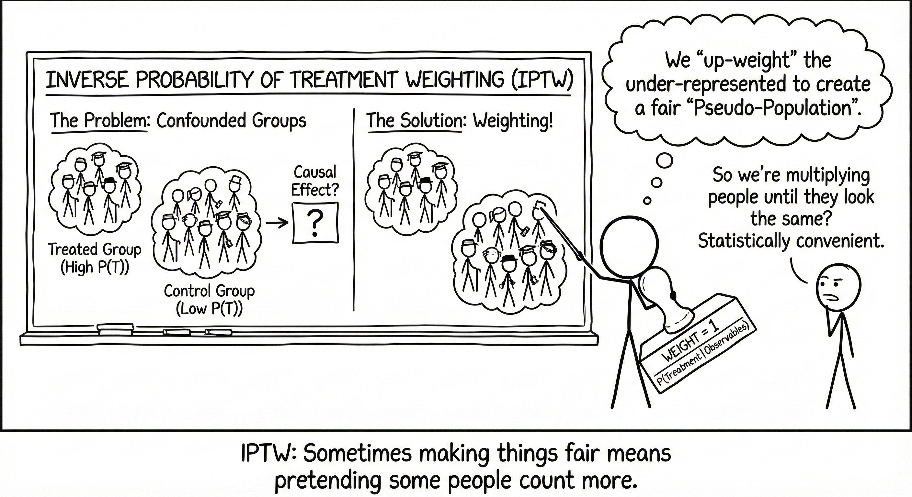

In previous posts, we've explored the [Potential Outcomes framework](https://aliceaii.github.io/posts/ci_po/) and [matching methods](https://aliceaii.github.io/posts/ci_matching/) for causal inference. Today, we'll dive deeper into propensity score methods, which offer a powerful and flexible approach to addressing selection bias in observational studies.



## 1. Introduction

The propensity score is defined as:

$$p(X_i) = P(D_i = 1 | X_i)$$
Where:

- $D_i$ is the treatment indicator (1 if treated, 0 if control)
- $X_i$ is a vector of observed covariates for unit $i$

If we have two districts with the same propensity score, they have the same probability of receiving treatment based on their observed characteristics. This means that among districts with similar propensity scores, treatment assignment is assuming random - aiming to achieve a quasi-experimental design.

A property of propensity scores is that if treatment assignment is strongly ignorable given $X$, then:

$$Y_i(1), Y_i(0) \perp\!\!\!\perp D_i \mid \mathbf{X}_i$$

This means that conditioning on the propensity score is sufficient to achieve independence between potential outcomes and treatment assignment. In other words, within strata of units with similar propensity scores, the distribution of covariates should be similar between treated and control groups.

### 1.1 Propensity Score Methods

There are three main ways to use propensity scores:

1. **Matching**: Pair treated and control units with similar propensity scores
2. **Inverse Probability of Treatment Weighting (IPTW)**: Weight observations by the inverse of their probability of receiving their observed treatment
3. **Stratification**: Divide the sample into strata based on propensity score ranges

In this post, we'll focus on IPTW, with a practical example using educational data.


## 2. Inverse Probability of Treatment Weighting (IPTW)

### 2.1 Mathematical Foundation

IPTW is based on creating a pseudo-population where treatment assignment is independent of confounders. The key insight is that by weighting each observation by the inverse of its probability of receiving the treatment it actually received, we can balance the covariate distributions between treatment groups.

For the Average Treatment Effect (ATE), the weights are:

$$w_i^{ATE} = \frac{D_i}{p(X_i)} + \frac{1-D_i}{1-p(X_i)}$$

- For treated units ($D_i = 1$): $w_i = \frac{1}{p(X_i)}$
- For control units ($D_i = 0$): $w_i = \frac{1}{1-p(X_i)}$


For the Average Treatment Effect of Treated (ATT), the weights are:

$$w_i^{ATT} = D_i + (1-D_i)\frac{p(X_i)}{1-p(X_i)}$$

- For treated units ($D_i = 1$): $w_i = 1$
- For control units ($D_i = 0$): $w_i = \frac{p(X_i)}{1-p(X_i)}$


For the Average Treatment Effect of Untreated (ATU), the weights are:

$$w_i^{ATU} = D_i\frac{1-p(X_i)}{p(X_i)} + (1-D_i)$$

- For treated units ($D_i = 1$): $w_i = \frac{1-p(X_i)}{p(X_i)}$
- For control units ($D_i = 0$): $w_i = 1$

**Intuition Behind IPTW**

The weights create a pseudo-population where:

- Treated units who were unlikely to be treated (low $p(X_i)$) get high weights
- Control units who were likely to be treated (high $p(X_i)$) get high weights
- This "fills in" the missing counterfactuals by upweighting similar units from the opposite group


## 3. HSLS:09 Science Museum Practical Example

Leveraging the High School Longitudinal Study (HSLS:09), this example aims to answer the following questions:

-   **Treament:** What individual and contextual factors are associated with students’ likelihood of visiting science museums or planetariums during high school?

-   **Science Identity Formation:** Does participation in informal science learning experiences—such as visiting a science museum or planetarium between 9th and 11th grade—positively influence the development of a science identity?

-   **STEM Major Intentions:** Does exposure to science museums or planetariums during high school increase the likelihood of pursuing a STEM major in college?

::: callout-note
The analysis data file include 6,481 9th grade students with observed treatment group status and no-zero value of sample weight (W3W1W2STU).Missing rate range from 1% to 19%. Dealing with missing values using likewise deletion is problematic, given the sample size will be reduced considerably and will introduce bias unless the data is missing completely at random (Enders, 2010). In this study we impute single values using stochastic imputations and chained equations embedded in `mice` r package.

The final analysis data file includes 8,106 college-bound students and the following variables:

-   `STU_ID` = unique HSLS student identifier (persistent 2009 – 2013)\
-   `SCH_ID` = unique HSLS school identifier (persistent 2009 – 2013)\
-   `W3W1W2STU` = W3 Student Longitudinal Analytic Weight BY-F1-U13\
-   `W1SCHOOL` = Baseline year school level Weight\

**Treatment indicator:**\
- `p2museum` = visited a science-related museum/planetarium between 9th and 11th grade (1 = Yes, 0 = No)\
**Dependent variables (DVs):**\
- `x2sciid` = 11th-grade science identity scale (standardized z-score)\
- `collegeSTEMmajorasp` = binary indicator of whether the student aspired to or declared a STEM major while enrolled in college (1 = Yes, 0 = No)\
**Pre-treatment covariates:**\
- `x1sciid` = 9th-grade baseline science identity scale (standardized z-score)\
- `stemoccasp9th` = binary indicator of whether the student aspired to a STEM occupation in 9th grade\
**School-level covariates (baseline, 9th grade):**\
- `x1locale` = school locale: City, Suburb, Town, Rural (ref)\
- `x1control` = school control: Public, Catholic or other Private School (ref)\
- `x1region` = U.S. census region of the school: Northeast (ref), Midwest, South, West\
- `a1mspdintrst` = binary indicator for whether the school sponsored a math or science after-school program (Yes/No)\
- `a1msmentor` = binary indicator for whether the school paired students with mentors in math or science (Yes/No)\
**Student-level IVs: background characteristics:**\
- `x1race` = White (ref), Asian, Black, Latino, Multiracial, Native American, Other\
- `x1sex` = binary sex indicator (0 = Male, 1 = Female)\
- `x1sesq5` = socioeconomic status quintile, First quintile (ref, lowest), Second, Third, Fourth, and Fifth quintile (highest)\
- `x1txmscr` = 9th-grade math achievement score (IRT-scaled)\
- `x1sciint` = science course interest scale (standardized z-score)\
- `x1stuedexpct` = student's highest educational expectation, categorized as Uncertain (ref), High School, Bachelor’s, Master’s, or PhD\
- `x1schoolbel` = 9th-grade student-perceived school belonging scale (standardized z-score)\
**Student-leve IVs: formal and informal STEM experiences (9th grade):**\
- `s1alg1m09` = binary indicator of whether the student took Algebra I in 9th grade (Yes/No)\
- `s1sfall09` = binary indicator of whether the student took a science course in fall 2009 (Yes/No)\
- `p1campms` = binary indicator of whether the student participated in math or science camp outside of school in last year (Yes/No)\
- `p1fixed` = binary indicator of whether parents built or fixed something with 9th grader in last year (Yes/No)\
- `p1sciproj` = binary indicator of whether the helped 9th grader with a school science fair project in last year with 9th grader in last year (Yes/No)\

Analysis the outcome, ATE, ATT, ATU:

-   Used doubly robust approach
-   Consider using MLM random slop (two levels: student level and school level)
-   Then conduct robustness check, use sensemakr to run the sensitivity analysis
-   Use student’s 9th grade science identity as benchmark covariates
:::

```{r, warning=FALSE, message=FALSE}
rm(list = ls())
library(tidyverse)
library(skimr)
library(flextable)
library(table1)
library(tableone)
library(knitr)
library(MatchIt)
library(WeightIt)
library(cobalt) #for love plots 
library(marginaleffects)
library(sensemakr) #sensitivity analysis
library(patchwork)
library(car)
library(naniar)
library(mice)
library(haven)
library(lm.beta) #standardized beta coef (for comparing effect sizes)
library(lme4) #for fixed models
library(survey) #for weights and robust SEs
library(broom) #convert model into tidy data frames
library(lme4)
library(merTools)
library(lmerTest)
library(WeMix) 

data <- readRDS("hslspsm_imputed.rds")
```

### 3.1 Descriptive Analysis

```{r, warning=FALSE, message=FALSE}
length(unique(data$STU_ID))
length(unique(data$SCH_ID))

autofit(as_flextable(table(data$p2museum)))

#combine Native American and Other other all into others categories due to small subpopulation
data <- data %>% 
  mutate(x1race = fct_collapse(x1race,
                               Other = c("Native American", "Other")   # <- names to merge
                               ))

#Descriptive Analysis
descr1 <- table1(~ x1sciid + stemoccasp9th + #pre-IVs
                   x1locale + x1control + x1region +  a1mspdintrst + a1msmentor +  #school-level IV
                   x1race + x1sex + x1sesq5 +  x1schoolbel + 
                   x1txmscr + x1sciint + x1stuedexpct + #student-level IV background
                   s1alg1m09 + s1sfall09 + 
                   p1campms + p1fixed + p1sciproj +
                   x2sciid + collegeSTEMmajorasp | as.factor(p2museum), data = data)
descr1
```

#### Compute the navie effect without adding PS and Weighting

##### Unconditional Navie Estimate (No PS, no sample weight, single level without covaraite adjustment)

```{r, warning=FALSE, message=FALSE}
m00 <- lm(x2sciid ~ p2museum, data = data)
summary(m00)
sqrt(hccm(m00)[2,2])

m000 <- glm(collegeSTEMmajorasp ~ p2museum, data = data, family = "binomial" )
summary(m000)
```

```{r, include=FALSE, warning=FALSE, message=FALSE}
#write function to create coefficient table - linear
tidy.coeftable <- function(model, digits = 3) {
  # Model summary
  model_summary <- summary(model)
  
  # Extract coefficients, SEs, p-values
  b    <- model_summary$coefficients[, "Estimate"]
  se   <- model_summary$coefficients[, "Std. Error"]
  pval <- model_summary$coefficients[, "Pr(>|t|)"]
  
  # Get standardized betas
  beta <- lm.beta(model)$standardized.coefficients
  
  # Significance stars
  get_stars <- function(p) {
    if (is.na(p)) return("")
    else if (p < 0.001) return("***")
    else if (p < 0.01)  return("**")
    else if (p < 0.05)  return("*")
    else if (p < 0.1)   return(".")
    else return("")
  }
  
  stars <- sapply(pval, get_stars)
  
  # Combine everything into a data frame
  coef_table <- data.frame(
    Variable    = names(b),
    Coefficient = round(b, digits),
    SE          = round(se, digits),
    Beta        = round(beta, digits),
    p_value     = round(pval, digits),
    Sig         = stars,
    row.names   = NULL
  )
  
  return(coef_table)
}


#write function to create coefficient table - logistic

tidy.logit.table <- function(model, digits = 3) {
  # Get model summary
  model_summary <- summary(model)

  # Extract unstandardized log-odds coefficients
  b    <- model_summary$coefficients[, "Estimate"]
  se   <- model_summary$coefficients[, "Std. Error"]
  pval <- model_summary$coefficients[, "Pr(>|z|)"]

  # Compute odds ratios and CI
  OR   <- exp(b)

  # Significance stars
  get_stars <- function(p) {
    if (is.na(p)) return("")
    else if (p < 0.001) return("***")
    else if (p < 0.01)  return("**")
    else if (p < 0.05)  return("*")
    else if (p < 0.1)   return(".")
    else return("")
  }

  stars <- sapply(pval, get_stars)

  # Combine results
  coef_table <- data.frame(
    Variable     = names(b),
    Coefficient  = round(b, digits),
    SE           = round(se, digits),
    OR           = round(OR, digits),
    p_value      = round(pval, digits),
    Sig          = stars
  )

  return(coef_table)
}

```

##### Navie Estimate (No PS, no sample weight, single level with covaraite adjustment)

```{r, warning=FALSE, message=FALSE}
m01 <- lm(x2sciid  ~ x1sciid + #pre-IVs
                     p2museum + 
                     x1locale + x1control + x1region +  a1mspdintrst + a1msmentor +  #school-level IV
                     x1race + x1sex + x1sesq5 +  x1schoolbel + 
                     x1txmscr + x1sciint + x1stuedexpct + #student-level IV background
                     s1alg1m09 + s1sfall09 + 
                     p1campms + p1fixed + p1sciproj, data = data)
sqrt(hccm(m01)[3,3]) #HC2 robust sd for treatment

table.m01<- tidy.coeftable(m01)
knitr::kable(table.m01, digits = 3, caption = "Unweighted multiple linear regression results predicting 11th science identity")


m001 <- glm(collegeSTEMmajorasp ~ 
                   stemoccasp9th +  #pre-IVs
                   p2museum + #treatment
                   x1locale + x1control + x1region +  a1mspdintrst + a1msmentor +  #school-level IV
                   x1race + x1sex + x1sesq5 +  x1schoolbel + 
                   x1txmscr + x1sciint + x1stuedexpct + #student-level IV background
                   s1alg1m09 + s1sfall09 + 
                   p1campms + p1fixed + p1sciproj, data = data, family = "binomial" )

table.m001 <- tidy.logit.table(m001)
knitr::kable(table.m001, digits = 3, caption = "Unweighted multiple logistic regression results predicting STEM major aspiration")

```

### 3.2 Define Distance Measure - Propensity score - glm

#### Proposentity score without sample weight

```{r, warning=FALSE, message=FALSE}
#estimate logistic model
pscore.m <- glm(p2museum ~ x1sciid + stemoccasp9th + #pre-IVs
                           x1locale + x1control + x1region +  a1mspdintrst + a1msmentor +  #school-level IV
                           x1race + x1sex + x1sesq5 +  x1schoolbel + 
                           x1txmscr + x1sciint + x1stuedexpct + #student-level IV background
                           s1alg1m09 + s1sfall09 + 
                           p1campms + p1fixed + p1sciproj, data = data, family = "binomial")

table.pscore.m <- tidy.logit.table(pscore.m)
knitr::kable(table.pscore.m, digits = 3, caption = "Multiple logistic regression results predicting science museum or or planetariums visit")

#get predicted probabilities/and probabilies on log-odds scale
data <- data %>%
  mutate(pscore = predict(pscore.m, type = "response"),
         pscorelogodd = predict(pscore.m))

#summary(data$pscorelogodd[data$p2museum == "Treatment"])
#summary(data$pscorelogodd[data$p2museum == "Control"])
#summary(data$pscore[data$p2museum == "Treatment"])
#summary(data$pscore[data$p2museum == "Control"])
```

##### Examine Common Support (overlap) without weight

```{r, warning=FALSE, message=FALSE}
#examine common support(overlap)
#create plots
p1 <- ggplot(data, aes(x = pscore, fill = p2museum)) +
geom_histogram(binwidth = 0.01, position = "identity", alpha = 0.6, color = "black") +
scale_fill_manual(values = c("#ee84a8", "#71bced"), labels = c("Control", "Treatment")) +
labs(title = "Propensity Score (Linear Scale)", x = "Propensity Score", y = "Frequency", fill = "Science Museum") + theme_minimal() +
theme(plot.title = element_text(size =12))

p2 <- ggplot(data, aes(x = pscore, y = p2museum, color = p2museum)) +
  geom_jitter(height = 0.2, alpha = 0.4, size = 1) +
  scale_color_manual(values = c("#ee84a8", "#71bced"), labels = c("Control", "Treatment")) +
  labs(title = "Common Support by Group", x = "Propensity Score", y = NULL, color = "Science Museum") +
  theme_minimal() +
  theme(plot.title = element_text(size =12))

p3 <- ggplot(data, aes(x = pscorelogodd, y = p2museum, color = p2museum)) +
  geom_jitter(height = 0.2, alpha = 0.4, size = 1) +
  scale_color_manual(values = c("#ee84a8", "#71bced"), labels = c("Control", "Treatment")) + 
  scale_x_continuous(breaks = seq(floor(min(data$pscorelogodd, na.rm = TRUE)),
                                  ceiling(max(data$pscorelogodd, na.rm = TRUE)), by = 0.2)) +
  labs(title = "Common Support by Group", x = "Logit Score", y = NULL, color = "Science Museum") +
  theme_minimal() +
  theme(plot.title = element_text(size =12))

#combine all
combined_plot <- p1 / p2 / p3 + plot_layout(ncol = 1, heights = c(4, 3, 3))
combined_plot
```

##### Trim the data PS without weight

```{r, warning=FALSE, message=FALSE}
table(data$STU_ID[data$pscorelogodd < -1.6])
table(data$STU_ID[data$pscorelogodd > 1.0])

data_trimmed <- data %>%
  filter(pscorelogodd >= -1.6 & pscorelogodd <= 1.0)

table(data_trimmed$p2museum)
#total loss 41 cases
```

### 3.3 IPTW, balance with IPTW\*W3W1W2STU

Compare two weight methods:

-   First, use non-weighted PSM, them multiply by the ate/att/atc, we get: w.ate_W3W1W2STU; w.att_W3W1W2STU; w.atc_W3W1W2STU
-   Second, use sample weight in the propensity score stage, then compute final weights as the product of the sampling weight and the propensity score weight: w.ate.w_W3W1W2STU; w.att.w_W3W1W2STU; w.atc.w_W3W1W2STU.

#### Combined weight with non-weighted PSM

```{r, warning=FALSE, message=FALSE}
#normalize the panel weight
data_trimmed <- data_trimmed %>%
  mutate(W3W1W2STU_norm = W3W1W2STU / mean(W3W1W2STU, na.rm = TRUE))

#calculate IPTW (ATE, ATT, ATU)
data_trimmed <- data_trimmed %>%
  #weight based on the treatment
  mutate(D = ifelse(p2museum == "Treatment", 1, 0),
  w.ate = (D * (1/pscore)) + ((1 - D) * (1/(1 - pscore))),
  w.att = (D) + ((1 - D) * (pscore/(1 - pscore))),
  w.atc = (D * ((1 - pscore)/pscore)) + (1 - D),
  #balance the weight based on the control level
  w.ate_W3W1W2STU = w.ate*W3W1W2STU_norm,
  w.att_W3W1W2STU = w.att*W3W1W2STU_norm,
  w.atc_W3W1W2STU = w.atc*W3W1W2STU_norm
  )

table(data_trimmed$D)
table(data_trimmed$p2museum)

```

##### Check the data balance

SMD is \<0.10 for all covariates

```{r, warning=FALSE, message=FALSE}
#question? check the balance only for w.ate or for w.ate_W3W1W2STU

covars <- c("x1sciid", 
            "x1locale", "x1control", "x1region", "a1mspdintrst", "a1msmentor",
            "x1race", "x1sex", "x1sesq5", "x1schoolbel", 
            "x1txmscr", "x1sciint", "x1stuedexpct", 
            "s1alg1m09", "s1sfall09",
            "p1campms", "p1fixed", "p1sciproj") 

bal_ate <- bal.tab(
  x = data_trimmed[, covars],
  treat = data_trimmed$D,
  weights = data_trimmed$w.ate_W3W1W2STU,
  estimand = "ATE",
  s.d.denom = "pooled",            # std-diff denominator
  m.threshold = .1,                # ±0.10 rule of thumb
  un = TRUE
)
bal_ate

#questions? what's the Effective sample sizes mean here?
#The effective numbers after applying the IPTW*W3W1W2STU weights had a sample of about 1,574 controls and 959 treated cases.

love.plot(bal_ate,
          stats       = "mean.diffs",
          abs         = FALSE, 
          binary      = "std",       
          thresholds  = c(m = .10),
          colors      = c("#ee84a8", "#71bced"),
          title       = "Covariate Balance after IPTW (ATE)") +
  theme_bw()
```

##### Get the descriptive stats after weighting (ATE)

```{r, warning=FALSE, message=FALSE}
#create survey design object using IPTW weights
design <- svydesign(ids = ~1, weights = ~w.ate_W3W1W2STU, data = data_trimmed)

#create post-weighting descriptive table by treatment group
table_weighted <- svyCreateTableOne(vars = covars, strata = "p2museum", data = design)

print(table_weighted)
```

### 3.4 ATE, ATT, ATC

#### Nested Result with IPW science identity

```{r, warning=FALSE, message=FALSE}
#estimate navie ATE of museum on sciid
ate_sciid <- lm(x2sciid ~ x1sciid + #pre-IVs
                          p2museum, data = data_trimmed, weights = w.ate_W3W1W2STU)

sqrt(hccm(ate_sciid)[3,3])
table.ate_sciid <- tidy.coeftable(ate_sciid) 
knitr::kable(table.ate_sciid, digits = 3, caption = "nested1 ATE weighted results of linear regression on science identity")


ate_sciid2 <- lm(x2sciid ~ x1sciid + #pre-IVs
                           p2museum +
                           x1locale + x1control + x1region +  a1mspdintrst + a1msmentor +  
                           x1race + x1sex + x1sesq5 +  x1schoolbel + 
                           x1txmscr + x1sciint + x1stuedexpct, data = data_trimmed, weights = w.ate_W3W1W2STU)

sqrt(hccm(ate_sciid2)[3,3])
table.ate_sciid2 <- tidy.coeftable(ate_sciid2)
knitr::kable(table.ate_sciid2, digits = 3, caption = "nested 2 ATE weighted results of linear regression on science identity")
```

#### Result with IPW science identity

```{r, warning=FALSE, message=FALSE}
#estimate ATE of museum on sciid
ate_dr_sciid <- lm(x2sciid ~ x1sciid + #pre-IVs
                           p2museum + 
                           x1locale + x1control + x1region +  a1mspdintrst + a1msmentor +  #school-level IV
                           x1race + x1sex + x1sesq5 +  x1schoolbel + 
                           x1txmscr + x1sciint + x1stuedexpct + #student-level IV background
                           s1alg1m09 + s1sfall09 + 
                           p1campms + p1fixed + p1sciproj, data = data_trimmed, weights = w.ate_W3W1W2STU)

sqrt(hccm(ate_dr_sciid)[3,3])
table.ate_dr_sciid <- tidy.coeftable(ate_dr_sciid)
knitr::kable(table.ate_dr_sciid, digits = 3, caption = "ATE weighted results of linear regression on science identity")


#estimate ATT of museum on sciid
att_dr_sciid <- lm(x2sciid ~ x1sciid + #pre-IVs
                           p2museum + 
                           x1locale + x1control + x1region +  a1mspdintrst + a1msmentor +  #school-level IV
                           x1race + x1sex + x1sesq5 +  x1schoolbel + 
                           x1txmscr + x1sciint + x1stuedexpct + #student-level IV background
                           s1alg1m09 + s1sfall09 + 
                           p1campms + p1fixed + p1sciproj, data = data_trimmed, weights = w.att_W3W1W2STU)

sqrt(hccm(att_dr_sciid)[3,3])
table.att_dr_sciid <- tidy.coeftable(att_dr_sciid)
knitr::kable(table.att_dr_sciid, digits = 3, caption = "ATT weighted results of linear regression on science identity")

#estimate ATC of museum on sciid
atc_dr_sciid <- lm(x2sciid ~ x1sciid + #pre-IVs
                           p2museum + 
                           x1locale + x1control + x1region +  a1mspdintrst + a1msmentor +  #school-level IV
                           x1race + x1sex + x1sesq5 +  x1schoolbel + 
                           x1txmscr + x1sciint + x1stuedexpct + #student-level IV background
                           s1alg1m09 + s1sfall09 + 
                           p1campms + p1fixed + p1sciproj, data = data_trimmed, weights = w.atc_W3W1W2STU)

sqrt(hccm(atc_dr_sciid)[3,3])
table.atc_dr_sciid <- tidy.coeftable(atc_dr_sciid)
knitr::kable(table.atc_dr_sciid, digits = 3, caption = "ATC weighted results of linear regression on science identity")
```

#### Nested Result with IPW STEM Major Asp

```{r, warning=FALSE, message=FALSE}
ate_stemma <- glm(collegeSTEMmajorasp ~ 
                           stemoccasp9th +  p2museum,
                           data = data_trimmed, family = binomial(), weights = w.ate_W3W1W2STU)

table.ate_stemma <- tidy.logit.table(ate_stemma)
knitr::kable(table.ate_stemma, digits = 3, caption = "nested1 ATE weighted multiple logistic regression results of STEM major aspiration")


ate_stemma2 <- glm(collegeSTEMmajorasp ~ 
                           stemoccasp9th +  #pre-IVs
                           p2museum + 
                           x1locale + x1control + x1region +  a1mspdintrst + a1msmentor +  
                           x1race + x1sex + x1sesq5 +  x1schoolbel + 
                           x1txmscr + x1sciint + x1stuedexpct,
                           data = data_trimmed, family = binomial(), weights = w.ate_W3W1W2STU)

table.ate_stemma2 <- tidy.logit.table(ate_stemma2)
knitr::kable(table.ate_stemma2, digits = 3, caption = "nested2 ATE weighted multiple logistic regression results of STEM major aspiration")

```

#### Result with IPW STEM Major Asp

```{r, warning=FALSE, message=FALSE}

#estimate ATE of museum on STEM major
# Outcome model with doubly robust estimator using ATE weights
ate_dr_stemma <- glm(collegeSTEMmajorasp ~ 
                           stemoccasp9th +  #pre-IVs
                           p2museum + 
                           x1locale + x1control + x1region +  a1mspdintrst + a1msmentor +  #school-level IV
                           x1race + x1sex + x1sesq5 +  x1schoolbel + 
                           x1txmscr + x1sciint + x1stuedexpct + #student-level IV background
                           s1alg1m09 + s1sfall09 + 
                           p1campms + p1fixed + p1sciproj,
                             data = data_trimmed, family = binomial(), weights = w.ate_W3W1W2STU)

table.ate_dr_stemma <- tidy.logit.table(ate_dr_stemma)
knitr::kable(table.ate_dr_stemma, digits = 3, caption = "ATE weighted multiple logistic regression results of STEM major aspiration")

# Outcome model with doubly robust estimator using ATT weights
att_dr_stemma <- glm(collegeSTEMmajorasp ~ 
                           stemoccasp9th +  #pre-IVs
                           p2museum + 
                           x1locale + x1control + x1region +  a1mspdintrst + a1msmentor +  #school-level IV
                           x1race + x1sex + x1sesq5 +  x1schoolbel + 
                           x1txmscr + x1sciint + x1stuedexpct + #student-level IV background
                           s1alg1m09 + s1sfall09 + 
                           p1campms + p1fixed + p1sciproj,
                           data = data_trimmed, family = binomial(), weights = w.att_W3W1W2STU)

table.att_dr_stemma <- tidy.logit.table(att_dr_stemma)
knitr::kable(table.ate_dr_stemma, digits = 3, caption = "ATT weighted multiple logistic regression results of STEM major aspiration")

# Outcome model with doubly robust estimator using ATU weights
atc_dr_stemma <- glm(collegeSTEMmajorasp ~ 
                           stemoccasp9th +  #pre-IVs
                           p2museum + 
                           x1locale + x1control + x1region +  a1mspdintrst + a1msmentor +  #school-level IV
                           x1race + x1sex + x1sesq5 +  x1schoolbel + 
                           x1txmscr + x1sciint + x1stuedexpct + #student-level IV background
                           s1alg1m09 + s1sfall09 + 
                           p1campms + p1fixed + p1sciproj,
                           data = data_trimmed, family = binomial(), weights = w.atc_W3W1W2STU)

table.atc_dr_stemma <- tidy.logit.table(atc_dr_stemma)
knitr::kable(table.atc_dr_stemma, digits = 3, caption = "ATC weighted multiple logistic regression results of STEM major aspiration")

```

### 3.5 ATE in MLM

#### For unweighted PS

ICC for the end of 11th sciid is 5%.

```{r, warning=FALSE, message=FALSE}
#convert the SCH_ID into a f
data_trimmed$SCH_ID <- as.factor(data_trimmed$SCH_ID)

#run the unconditional model 
m0_mlm <- lmer(x2sciid ~ 1 + (1 | SCH_ID), data = data_trimmed, weights = w.ate_W3W1W2STU)
summary(m0_mlm)


#icc for sciid is 5%
icc0 <- 0.09 / (0.09 + 1.73)
icc0
```

### 3.6 Heterogenity, Moderation Effect by Race and Gender

##### Applied for unweighted PS model + (IPW\*sample weight) for single level outcome model

```{r, warning=FALSE, message=FALSE}
#estimate ATE Heterogenity on Race and Gender of museum on sciid
ate_dr_sciid_hete <- lm(x2sciid ~ x1sciid + #pre-IVs
                                  p2museum + 
                                  x1locale + x1control + x1region +  a1mspdintrst + a1msmentor +  #school-level IV
                                  x1race + x1sex + x1sesq5 +  x1schoolbel + 
                                  x1txmscr + x1sciint + x1stuedexpct + #student-level IV background
                                  s1alg1m09 + s1sfall09 + 
                                  p1campms + p1fixed + p1sciproj +
                                  p2museum:x1race + p2museum:x1sex, data = data_trimmed, weights = w.ate_W3W1W2STU)

table.ate_dr_sciid_hete <- tidy.coeftable(ate_dr_sciid_hete)
knitr::kable(table.ate_dr_sciid_hete, digits = 3, caption = "Racial and gender variation in science club effects on science identity")

```

### 3.7 Sensitivity Analysis

#### For Navie Estimate (No PS, no sample weight, single level with covaraite adjustment)

```{r, warning=FALSE, message=FALSE}
sen.m01 <- sensemakr(model = m01, treatment = "p2museumTreatment",
                  benchmark_covariates = "x1sciid",
                  kd = 0.25:0.75, # strength of unobserved confounding with treatment
                  ky = 0.25:0.75, # strength of unobserve confounding with outcome
                  q = 1, # threshold for nullifying the estimate
                  alpha = 0.05, # significance level
                  reduce = TRUE # test whether confounding could reduce effect
                  )
summary(sen.m01)
plot(sen.m01 )
```

#### For non-weighted PS model + IPTW\*sampl weight for outcome model

```{r, warning=FALSE, message=FALSE}
sen1 <- sensemakr(model = ate_dr_sciid, treatment = "p2museumTreatment",
                  benchmark_covariates = "x1sciid",
                  kd = 0.25:0.75, # strength of unobserved confounding with treatment
                  ky = 0.25:0.75, # strength of unobserve confounding with outcome
                  q = 1, # threshold for nullifying the estimate
                  alpha = 0.05, # significance level
                  reduce = TRUE # test whether confounding could reduce effect
                  )
summary(sen1)
plot(sen1)

```

## 4. IPTW and Matching Comparsion

**Matching vs Weighting**

The Core Difference

- **Matching** is like **pruning a tree**. You discard the observations that don't have a "match" in the other group. You end up with a smaller, cleaner dataset where treated and control units look like twins.

- **Weighting** is like **sculpting clay**. You keep everyone in the dataset, but you "stretch" (up-weight) or "squish" (down-weight) specific observations so that the total treated pile looks identical to the total control pile.


| Feature | Matching  | Weighting (IPTW) |
| :--- | :--- | :--- |
| **Data Retention** | **Low.** You often discard unmatched control units (and sometimes treated units), reducing sample size. | **High.** Uses the full sample (no data loss), which generally preserves statistical power. |
| **Target Population** | **Changes.** Usually estimates the ATT (effect on the treated) or a subset of it (the "matchable" treated). | **Flexible.** Can easily estimate ATE (whole population), ATT, or ATU depending on the formula used. |
| **Extreme Values** | **Robust.** Units with extreme propensity scores (no overlap) are simply dropped/ignored. | **Sensitive.** Units with extreme propensity scores get massive weights, causing unstable estimates and high variance. |
| **Variance** | **Lower Variance** (usually), but potentially higher bias if matches are poor. | **Higher Variance**, especially if weights are unstable (though "trimming" helps). |
| **Interpretability** | **High.** "We compared Student A to Student B who looked just like them." Easy to explain to stakeholders. | **Low.** "We up-weighted Student A by 3.5x to represent a pseudo-population." Harder to explain. |
| **Balance Check** | Must check balance *after* matching. | Must check balance *after* weighting. |


## References

- Rosenbaum, P. R., & Rubin, D. B. (1983). The central role of the propensity score in observational studies for causal effects. *Biometrika*, 70(1), 41-55.

- Stuart, E. A. (2010). Matching methods for causal inference: A review and a look forward. *Statistical Science*, 25(1), 1-21.

- Guo, S., & Fraser, M. W. (2014). *Propensity score analysis: Statistical methods and applications*. Sage.

- Austin, P. C. (2011). An introduction to propensity score methods for reducing the effects of confounding in observational studies. *Multivariate Behavioral Research*, 46(3), 399-424.

- Imbens, G. W., & Wooldridge, J. M. (2009). Recent developments in the econometrics of program evaluation. *Journal of Economic Literature*, 47(1), 5-86.

- Li, F., Morgan, K. L., & Zaslavsky, A. M. (2018). Balancing covariates via propensity score weighting. *Journal of the American Statistical Association*, 113(521), 390-400.


---

*This tutorial is based on lecture materials from Stat 256: Causality (UCLA) and EDUC 255C: Introduction to Causal Inference in Education Research (UCLA), Spring 2025.*


