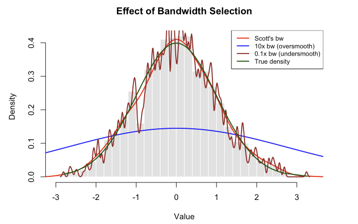

This tutorial introduces kernel density estimation and rejection sampling using Los Angeles housing price data. These methods are fundamental for exploratory data analysis and simulation studies.



## 1. What is Kernel Density Estimation? Why we need it?

Ever looked at a histogram and thought, "This looks too blocky and choppy to represent the real data"? You're onto something! Histograms are great for a quick look, but they come with baggage: change the bin width or starting position slightly, and suddenly your distribution looks completely different. For sparse data, you might see misleading gaps that aren't really there.

**Kernel Density Estimation (KDE)** solves these problems by creating smooth, flowing curves that better represent your data's underlying distribution. Think of it as replacing each data point with a smooth "bump" (a kernel), then adding up all these bumps to get a continuous density curve. No arbitrary bins, no blocky artifacts—just a natural-looking estimate of where your data likes to hang out.

### 1.1 The Histogram Problem

Let's see what we're dealing with. Here's why histograms can mislead us:

```{r, message=FALSE, warning=FALSE}
rm(list = ls())

set.seed(123)
#generates 50 random numbers from a normal distribution
x_demo <- rnorm(50, mean = 5, sd = 2) 

par(mfrow=c(2,2)) #plots in a 2×2 grid

#creates a histogram of x_demo using xx bins (breaks = ).
hist(x_demo, breaks=5, main="5 bins", col="lightblue", xlab="Value")
hist(x_demo, breaks=10, main="10 bins", col="lightcoral", xlab="Value")
hist(x_demo, breaks=20, main="20 bins", col="lightgreen", xlab="Value")
hist(x_demo, breaks=seq(0, 10, by=0.8), main="Different starting point", col="lightyellow", xlab="Value")

par(mfrow=c(1,1)) #layout back to the default (1 plot per window)
```

::: {.callout-note}
Same data, four different stories! The histogram's appearance depends heavily on:

- **Bin width**: Too wide hides features; too narrow creates noise
- **Bin placement**: Shift the bins slightly, get different peaks
- **Small samples**: Gaps appear that might not be meaningful
:::

This is where KDE comes to the rescue.

### 1.2 How Kernel Density Estimation Works

Here's the key idea: instead of forcing data into rigid bins, we place a smooth "kernel" (think of it as a little hill or bump) on top of each data point. Then we add up all these bumps to create our density estimate.

**The formula:**

$\hat{f}(x_0) = \frac{1}{nh} \sum_{i=1}^{n} K\left(\frac{x_0 - x_i}{h}\right)$

Don't let the math scare you! Here's what each piece means:

| Symbol | What it means | Think of it as... |
|--------|---------------|-------------------|
| $\hat{f}(x_0)$ | Estimated density at point $x_0$ | "How crowded is it here?" |
| $n$ | Number of data points | Sample size |
| $h$ | Bandwidth | "How wide should each bump be?" |
| $K(\cdot)$ | Kernel function | The shape of each bump (usually a bell curve) |
| $x_i$ | Individual data points | Where your actual observations are |

::: {.callout-tip}
**Visual intuition:** Imagine each data point emits a "glow" that fades as you move away from it. The kernel density estimate is the combined glow from all points. Areas with many nearby points glow brighter (higher density); sparse areas are dimmer (lower density).
:::

### 1.3 The Bandwidth: Your Smoothness Dial

The bandwidth $h$ is the most important choice you'll make in KDE. It controls how smooth or wiggly your density estimate looks:

- **Small bandwidth** ($h$ ↓): Narrow bumps
  - Pro: Captures fine details
  - Con: Too wiggly, might show fake peaks (undersmoothing)
  
- **Large bandwidth** ($h$ ↑): Wide bumps  
  - Pro: Smooth, stable estimate
  - Con: Might miss real features (oversmoothing)

**Bandwidth selection rules** (automatic methods):

Research has shown that choosing the right bandwidth is more important than choosing the kernel function. Two popular rules:

- **Silverman's rule**: $h = 0.9 \times \min(s, IQR/1.34) \times n^{-1/5}$
- **Scott's rule**: $h = 1.06 \times \min(s, IQR/1.34) \times n^{-1/5}$ ← **Recommended**

Where:

- $s$ = standard deviation of your data \n
- $IQR$ = interquartile range (75th percentile - 25th percentile) \n
- $n$ = sample size

Scott's rule tends to be slightly more robust, so we'll use it as our default. The good news? R's `bw.nrd()` function calculates this for you automatically!


::: {.callout-note}

**R's Bandwidth Selection Functions**

R's `density()` function has built-in bandwidth selectors:

- **Default kernel**: `kernel = "gaussian"` (the standard normal distribution)
- **Default bandwidth**: `bw = "nrd0"` (Silverman's rule)

**Why Scott over Silverman?** Silverman's bandwidth (0.9) is often too small, leading to undersmoothing. Scott's slightly larger multiplier (1.06) tends to give better results in practice.

```{r, message=FALSE, warning=FALSE}
#example with 1000 observations
x <- rnorm(1000)

#Silverman's rule
bw.nrd0(x)
0.9 * min(sd(x), IQR(x)/1.34) * 1000^(-0.2)

#Scott's rule (recommended)
bw.nrd(x)
1.06 * min(sd(x), IQR(x)/1.34) * 1000^(-0.2)
```
:::

## 2. Basic Kernel Density Estimation in R

### 2.1 Simple Example: Simulated Data

Let's start with simulated normal data to see how KDE works:

```{r, message=FALSE, warning=FALSE}
library(tidyverse)

#simulate 1000 observations from a standard normal distribution
set.seed(123)
x <- rnorm(1000)

#create histogram with density overlay
hist(x, nclass=40, prob=TRUE, 
     main="Histogram vs Kernel Density Estimate",
     xlab="Value", ylab="Density",
     col="lightblue", border="white")

# Add kernel density estimate (default uses Scott's rule)
lines(density(x), lty=2, col="purple", lwd=2)

# Add true density for comparison
curve(dnorm(x), add=TRUE, col="darkgreen", lwd=2, lty=1)

legend("topright", 
       c("Histogram", "KDE", "True N(0,1)"),
       lty=c(1,2,1), 
       col=c("lightblue","purple","darkgreen"),
       lwd=c(5,2,2))
```

**What this shows:** The kernel density estimate (purple dashed line) provides a smoother approximation of the true underlying normal distribution (green line) compared to the blocky histogram (blue bars).

### 2.2 Effect of Bandwidth Selection


```{r, message=FALSE, warning=FALSE}
#compare different bandwidth choices
#differnt from `break= ` is approximate, `nclass =` is the exact value of # of bins
hist(x, nclass=40, prob=TRUE,
     main="Effect of Bandwidth Selection",
     xlab="Value", ylab="Density",
     col="gray90", border="white")

#calculate Scott's bandwidth
b_scott <- bw.nrd(x)
cat("Scott's bandwidth:", round(b_scott, 3), "\n")

#plot with different bandwidths
lines(density(x, bw=b_scott), col="red", lwd=2)
lines(density(x, bw=10*b_scott), col="blue", lwd=2)
lines(density(x, bw=0.1*b_scott), col="brown", lwd=2)
lines(sort(x), dnorm(sort(x)), col="darkgreen", lwd=2)

legend("topright",
       c("Scott's bw", "10x bw (oversmooth)", 
         "0.1x bw (undersmooth)", "True density"),
       lty=1, col=c("red","blue","brown","darkgreen"),
       lwd=2, cex=0.8)
```

**What this shows:** 

- **Red line (Scott's rule)**: Provides good balance, closely approximates the true density. This is our recommended starting point.
- **Blue line (10x bandwidth)**: Oversmoothed - obscures important features, looks too flat. We've smoothed away real variation.
- **Brown line (0.1x bandwidth)**: Undersmoothed - too wiggly, shows spurious peaks that aren't really in the underlying distribution.
- **Dark green line (True density)**: Since we simulated this data from a standard normal distribution, we know the true underlying density is $N(0,1)$. This line shows what we're trying to estimate. Notice how Scott's rule (red) tracks it quite closely!

The dark green line is our "ground truth" - it's what the data actually came from. In real applications, we never know this true density (that's why we need KDE!), but here it helps us see that Scott's bandwidth choice does a good job of recovering the real pattern.

::: {.callout-tip}
**Practical advice:** Use automatic bandwidth selectors like `bw.nrd()` (Scott's rule) as a starting point. Scott's rule is generally more reliable than Silverman's rule (`bw.nrd0()`).
:::

## 3. Application: LA Housing Price Distribution

::: {.callout-note}
**Dataset: Los Angeles Housing Prices (August 2013)**

This dataset contains median home prices for single-family residences across Los Angeles County communities in August 2013. The data captures a snapshot of the LA housing market during the post-2008 recovery period.

- **Unit of analysis**: Communities/neighborhoods in Los Angeles County
- **Key variable**: `PriceMedianSFR(1000)` - Median price of single-family homes in thousands of dollars
- **Time period**: August 2013
- **Geographic coverage**: Diverse communities from Malibu beach homes to inland suburbs
- **Price range**: From affordable entry-level markets to ultra-luxury Beverly Hills estates
- **Additional variables**: Sales counts, year-over-year price changes, price per square foot, condo prices
:::

### 3.1 Loading and Preparing the Data

Now let's apply KDE to real data: Los Angeles housing prices from August 2013.

```{r, message=FALSE, warning=FALSE}
#load the housing data
housing <- read.table("/Users/aishuhan/Documents/GitHub/AliceAii.github.io/posts/kerneldensity2/LAhousingpricesaug2013.txt", header=TRUE)

#extract median single-family home prices (in $1000s)
prices <- as.numeric(housing$PriceMedianSFR.1000.)

#remove missing values
prices <- prices[!is.na(prices)]

head(housing)
```

### 3.2 Visualizing Housing Price Distribution

```{r, message=FALSE, warning=FALSE}
#create histogram with kernel density estimate
hist(prices, nclass = 50, prob=TRUE,
     main = "Distribution of LA Median Housing Prices (Aug 2013)",
     xlab = "Median Price ($1000s)",
     ylab = "Density",
     col = "lightblue",
     border = "white")

#add kernel density estimate
lines(density(prices), col="darkblue", lwd=3)

#add vertical lines for mean and median
abline(v=mean(prices), col="red", lwd=2, lty=2)
abline(v=median(prices), col="darkgreen", lwd=2, lty=2)

legend("topright",
       c("Histogram", "KDE", "Mean", "Median"),
       lty=c(1,1,2,2),
       col=c("lightcoral","darkblue","red","darkgreen"),
       lwd=c(5,3,2,2))
```

**What this reveals:**

- **Right-skewed distribution**: Long tail of expensive homes (Beverly Hills, Malibu, etc.)
- **Multiple modes**: Suggests different market segments or community types
- **Mean > Median**: Confirms right skew; mean is pulled up by expensive outliers
- **KDE advantages**: Smooth curve reveals subtle features that histogram bins might obscure


## 4. Understanding the density() Function

### 4.1 How density() works

The `density()` function in R computes kernel density estimates. Let's understand its key parameters:

```{r, message=FALSE, warning=FALSE}
#basic density estimation
dens <- density(prices)

#examine the output structure
str(dens)
```
**Key components:**

- `x`: Grid points where density is evaluated (default: 512 points). Why 512? It's a power of 2 ($2^9 = 512$), which makes the Fast Fourier Transform (FFT) algorithm used internally by `density()` more efficient.
- `y`: Estimated density values at each grid point
- `bw`: Bandwidth used
- `n`: Original sample size
- `call`: The function call
- `data.name`: Name of the input data

### 4.2 Customizing density() Parameters

```{r, message=FALSE, warning=FALSE}
#customize the density estimation
x_small <- c(1, 2.8, 3)  # small example dataset

#method 1: Using density() with parameters
dens1 <- density(x_small, bw=0.08, n=101, from=0, to=4)

plot(c(0,4), c(0,2), type="n", 
     xlab="x", ylab="density",
     main="Kernel Density Estimate with Small Dataset")
lines(dens1, col="red", lwd=2)
points(x_small, rep(0, length(x_small)), pch=19, col="blue", cex=2)
legend("topright", c("KDE", "Data points"), 
       col=c("red","blue"), lwd=c(2,NA), pch=c(NA,19))
```

### 4.3 Building Your Own Density Estimator

The `density()` function uses sophisticated algorithms (FFT-based), but we can create a simpler version to understand the mathematics:

```{r, message=FALSE, warning=FALSE}
#custom density function
density2 <- function(data_points, xgrid, bandwidth) {
  # data_points: original data
  # xgrid: points where we evaluate the density
  # bandwidth: smoothing parameter
  
  n_grid <- length(xgrid)
  density_values <- numeric(n_grid)
  
  for(i in 1:n_grid) {
    # for each grid point, sum the kernel contributions from all data points
    # dnorm(data_points - xgrid[i], sd=bandwidth) evaluates the kernel
    density_values[i] <- sum(dnorm(data_points - xgrid[i], sd=bandwidth)) / length(data_points)
  }
  
  return(density_values)
}

#test our custom function
grid_points <- seq(0, 4, length=101)
custom_dens <- density2(x_small, grid_points, 0.08)

#compare with density()
plot(grid_points, custom_dens, type="l", col="blue", lwd=2,
     xlab="x", ylab="density",
     main="Custom vs Built-in Density Function")
lines(dens1, col="red", lwd=2, lty=2)
points(x_small, rep(0, length(x_small)), pch=19, col="black", cex=2)
legend("topright", c("Custom density2()", "Built-in density()", "Data"), 
       col=c("blue","red","black"), lwd=c(2,2,NA), lty=c(1,2,NA), pch=c(NA,NA,19))

#check the difference
max_diff <- max(abs(dens1$y - custom_dens))
cat("Maximum difference between methods:", round(max_diff, 6), "\n")
```
**Why the difference?** The built-in `density()` uses FFT (Fast Fourier Transform) for computational efficiency and applies edge corrections. Our simple version is more intuitive but less sophisticated.

**Mathematical note:** When we write `dnorm(x - xi, sd=h)`, this equals $\frac{1}{h}\phi(\frac{x-x_i}{h})$, where $\phi$ is the standard normal density. This is exactly the kernel formula $\frac{1}{h}K(\frac{x-x_i}{h})$.

## 5. Two-Dimensional Kernel Smoothing

### 5.1 Extending to Spatial Data

For spatial data (latitude/longitude, x-y coordinates), we extend kernel density estimation to 2D:

$$\hat{f}(x_0, y_0) = \frac{1}{nh_xh_y} \sum_{i=1}^{n} K\left(\frac{x_0 - x_i}{h_x}\right) K\left(\frac{y_0 - y_i}{h_y}\right)$$

**Applications:**

- Crime hotspot analysis
- Disease outbreak mapping
- Customer location patterns
- Wildlife habitat usage
- Urban planning (optimal facility locations)

### 5.2 Example: Spatial Point Pattern

```{r, message=FALSE, warning=FALSE}
#install.packages("splancs")
library(splancs)

#simulate spatial data: 30 random points in unit square
set.seed(456)
n_points <- 30
x_coord <- runif(n_points, 0, 1)
y_coord <- runif(n_points, 0, 1)

#calculate 2D bandwidth (combining x and y bandwidths)
bdw <- sqrt(bw.nrd0(x_coord)^2 + bw.nrd0(y_coord)^2)
cat("2D bandwidth:", round(bdw, 4), "\n")

#create point pattern and boundary
points_matrix <- as.points(x_coord, y_coord)
boundary <- matrix(c(0,0, 1,0, 1,1, 0,1, 0,0), ncol=2, byrow=TRUE)

#compute 2D kernel density
kde_2d <- kernel2d(points_matrix, boundary, bdw)

#visualize
par(mfrow=c(1,2), mar=c(4,4,3,2))

#panel 1: Density heatmap
image(kde_2d, col=gray((64:20)/64),
      main="2D Kernel Density Estimate",
      xlab="X coordinate", ylab="Y coordinate")
points(points_matrix, pch=19, col="red", cex=1.0)

#panel 2: Contour plot
contour(kde_2d, nlevels=10,
        main="Density Contours",
        xlab="X coordinate", ylab="Y coordinate")
points(points_matrix, pch=19, col="blue", cex=1.0)

par(mfrow=c(1,1))
```
**Interpretation:**

- **Darker areas**: Higher point density
- **Lighter areas**: Lower point density
- **Contour lines**: Connect points of equal density (like elevation contours on a map)
- **Red/blue points**: Original data locations

**Real-world use case:** If these were crime locations, darker areas would indicate crime hotspots where police might increase patrols.

## 6. Understanding Sampling Methods

### 6.1 Why Do We Need Different Sampling Methods?

Imagine you're a researcher who needs to run simulations. Maybe you're testing a statistical method, generating synthetic data, or doing a Monte Carlo study. You need random numbers that follow specific probability distributions. But here's the thing: not all distributions are created equal when it comes to generating random samples!

**The challenge:** Computers can only generate truly random uniform numbers (like rolling a fair die). Everything else requires tricks and transformations.

Let's break down when to use each method:

#### Method 1: Built-in R Functions (The Easy Way)

**When to use:** You need samples from common, well-studied distributions.

**How it works:** R has pre-programmed functions that do all the heavy lifting for you.

```{r, message=FALSE, warning=FALSE}
#normal distribution
normal_samples <- rnorm(1000, mean=0, sd=1)

#uniform distribution
uniform_samples <- runif(1000, min=0, max=1)

#exponential
exponential_samples <- rexp(1000, rate=2)
```

::: {.callout-tip}
**Real-world example:** You're simulating student test scores. If you assume scores follow a normal distribution with mean=75 and sd=10, just use `rnorm(n, mean=75, sd=10)`. Quick and reliable!
**Limitation:** Only works for distributions that R knows about. What if you need something custom?
:::

#### Method 2: Inverse Transform Sampling (The Mathematical Trick)

**When to use:** You have a distribution with a formula for its cumulative distribution function (CDF), and you can solve for its inverse.

**The key insight:** If you can write down $F^{-1}(u)$ (the inverse CDF), you can transform uniform random numbers into samples from your target distribution.

**How it works:**
1. Generate $u$ from Uniform(0,1)
2. Plug it into the inverse CDF: $x = F^{-1}(u)$
3. Now $x$ follows your target distribution!

**Real-world example:** You're modeling customer wait times. Wait times often follow an exponential distribution. The exponential CDF is $F(x) = 1 - e^{-\lambda x}$, and its inverse is $F^{-1}(u) = -\frac{\ln(1-u)}{\lambda}$. So:

```{r, message=FALSE, warning=FALSE}
#generate exponential wait times (lambda = 0.5 customers per minute)
u <- runif(1000)
wait_times <- -log(1-u) / 0.5
```

**Limitation:** You need to be able to write down and compute $F^{-1}(u)$. For many distributions (like the normal distribution), this inverse doesn't have a nice closed form!

#### Method 3: Rejection Sampling (The Clever Workaround)

**When to use:** You have a complex or custom distribution where:
- No built-in R function exists
- The inverse CDF is impossible or impractical to compute
- You can evaluate the density $f(x)$ but can't directly sample from it

**How it works:** Generate candidates from an easy distribution, then "reject" the ones that don't fit your target distribution well. (We'll dive deep into this later!)

**Real-world example:** You created a kernel density estimate from your data and want to generate synthetic observations that match this pattern. There's no built-in function for this, and there's no inverse CDF formula. Rejection sampling to the rescue!

```{r, message=FALSE, warning=FALSE}
#The full code will be shown in Section 7)
```

**Another example:** Truncated distributions. Suppose you need normal random variables, but only between 0 and 10 (maybe modeling physical quantities that can't be negative). Rejection sampling makes this easy: generate from the normal distribution and reject values outside [0,10].

**Limitation:** Can be slow if your proposal distribution doesn't match the target well (low acceptance rate).

#### Method 4: MCMC (Markov Chain Monte Carlo) - Beyond This Tutorial

**When to use:** High-dimensional problems, especially in Bayesian statistics where you need to sample from complex posterior distributions.

**How it works:** Creates a chain of samples where each new sample depends on the previous one. Over time, this chain converges to your target distribution.

**Real-world example:** You're doing Bayesian regression with 50 parameters. The posterior distribution is a 50-dimensional beast that no simple method can handle. MCMC methods like Metropolis-Hastings or Gibbs sampling are your only option.

**Why we're not covering it:** MCMC deserves its own tutorial! For now, know that when rejection sampling becomes too inefficient or you're working in high dimensions, MCMC methods take over.

::: {.callout-tip}
Quick Decision Guide

**Start here:** Do you need a common distribution (normal, uniform, exponential, etc.)? 

→ **Use built-in R functions** (`rnorm`, `runif`, `rexp`, etc.)

**If not:** Can you write down the inverse CDF $F^{-1}(u)$?  

- **Yes** → Use inverse transform sampling  
- **No** → Can you evaluate the density $f(x)$?  
  - **Yes** → Use rejection sampling  
  - **No** → You might need MCMC (advanced topic)

**Summary table:**

| Situation | Method | Example | Why Use It |
|-----------|--------|---------|------------|
| Common distributions | Built-in R functions | `rnorm()`, `runif()`, `rexp()` | Fast, reliable, no thinking required |
| Known inverse CDF | Inverse transform | Exponential, some custom distributions | Mathematically elegant, exact |
| Complex custom distributions | Rejection sampling | KDE, truncated distributions, non-standard shapes | Flexible, works when inverse CDF unavailable |
| High-dimensional problems | MCMC methods | Bayesian posterior distributions | Only practical option for complex posteriors |

:::

### 6.2 Simple Random Sampling

**Definition:** Each observation has an equal probability of being selected.

```{r, message=FALSE, warning=FALSE}
# Simple random sampling examples
set.seed(789)

# Sample from integers
sample_int <- sample(1:100, size=10, replace=FALSE)
cat("Random integers:", sample_int, "\n\n")

# Sample from continuous uniform
sample_unif <- runif(10, min=0, max=1)
cat("Uniform samples:", round(sample_unif, 3), "\n\n")

# Sample from normal distribution
sample_norm <- rnorm(10, mean=0, sd=1)
cat("Normal samples:", round(sample_norm, 3), "\n")
```

**Use cases:** Survey sampling, random assignment in experiments, bootstrap resampling, train-test splits in machine learning.

### 6.3 Inverse Transform Sampling

**Theory:** If $U \sim \text{Uniform}(0,1)$, then $X = F^{-1}(U)$ follows distribution $F$.

**Why it works:** The probability $P(X \leq x) = P(F^{-1}(U) \leq x) = P(U \leq F(x)) = F(x)$, which is exactly the desired CDF.

```{r, message=FALSE, warning=FALSE}
# Example: Exponential distribution
# CDF: F(x) = 1 - exp(-λx)
# Inverse CDF: F^(-1)(u) = -log(1-u)/λ

set.seed(101)
n_samples <- 1000
u <- runif(n_samples)
lambda <- 2
x_exp <- -log(1-u) / lambda

# Visualize
hist(x_exp, prob=TRUE, nclass=30,
     main="Inverse Transform Sampling: Exponential Distribution",
     xlab="Value", ylab="Density",
     col="lightgreen", border="white")
curve(dexp(x, rate=lambda), add=TRUE, col="blue", lwd=2)
legend("topright", c("Sampled data", "True density"), 
       col=c("lightgreen","blue"), lwd=c(5,2))

# Verify mean
cat("Sample mean:", round(mean(x_exp), 3), "\n")
cat("True mean (1/λ):", round(1/lambda, 3), "\n")
```

**Limitation:** Requires closed-form expression for $F^{-1}$, which isn't always available.

## 7. Rejection Sampling

### 7.1 The Problem and Solution

**The Problem:** We want to sample from a complex probability density $f(x)$ that:

- Cannot be sampled directly
- Doesn't have a simple inverse CDF
- May have an unknown normalizing constant
- Is computationally expensive to sample from

**The Solution: Rejection Sampling**

**Requirements:**

1. Find a "proposal" density $g(x)$ that's easy to sample from
2. Find a constant $M$ such that $f(x) \leq M \cdot g(x)$ for all $x$ in the support
3. The smaller $M$, the more efficient the algorithm

### 7.2 The Rejection Sampling Algorithm

**Steps:**

1. Generate a candidate $x_0$ from proposal density $g(x)$
2. Generate $u \sim \text{Uniform}(0,1)$
3. Calculate acceptance probability: $\alpha = \frac{f(x_0)}{M \cdot g(x_0)}$
4. If $u \leq \alpha$, **accept** $x_0$ (keep it)
5. If $u > \alpha$, **reject** $x_0$ (discard it)
6. Repeat until you have enough accepted samples

**Why it works mathematically:**

The probability of accepting a candidate $x_0$ is:
$$P(\text{accept} | x_0) = \frac{f(x_0)}{M \cdot g(x_0)}$$

The joint density of generating and accepting $x_0$ is:
$$g(x_0) \cdot \frac{f(x_0)}{M \cdot g(x_0)} = \frac{f(x_0)}{M}$$

Since $M$ is constant, the accepted samples follow density proportional to $f(x)$!

**Efficiency:** Acceptance rate = $\frac{1}{M}$. We want $M$ as small as possible.

### 7.3 Example 1: Triangular Distribution

Let's sample from a triangular distribution: $f(x) = 1 - |x-1|$ for $x \in (0,2)$.

```{r, message=FALSE, warning=FALSE}
#define triangular density
triangular_density <- function(x) {
  ifelse(x > 0 & x < 2, 1 - abs(x - 1), 0)
}

#visualize the target density
curve(triangular_density, from=-0.5, to=2.5, 
      ylab="f(x)", xlab="x", lwd=2, col="blue",
      main="Triangular Density: f(x) = 1 - |x-1|")
abline(h=0, col="gray")
polygon(c(0, 1, 2, 0), c(0, 1, 0, 0), 
        col=rgb(0,0,1,0.2), border=NA)

#add proposal density
abline(h=0.5, col="red", lwd=2, lty=2)
text(1, 0.6, "g(x) = Uniform(0,2) = 0.5", col="red")

```

**Setup:**

- Target density: $f(x) = 1 - |x-1|$, maximum = 1
- Proposal density: $g(x) = \text{Uniform}(0,2) = 0.5$
- Bound: $M = \max f(x) / g(x) = 1 / 0.5 = 2$
- Theoretical acceptance rate: $1/M = 0.5$

```{r, message=FALSE, warning=FALSE}
#rejection sampling implementation
set.seed(321)
M <- 2
g_density <- 0.5
n_target <- 10000

accepted <- numeric(0)
n_proposed <- 0

while(length(accepted) < n_target) {
  # Generate candidate from uniform
  x0 <- runif(1) * 2
  n_proposed <- n_proposed + 1
  
  # Calculate acceptance probability
  fx0 <- triangular_density(x0)
  accept_prob <- fx0 / (M * g_density)
  
  # Accept or reject
  if(runif(1) < accept_prob) {
    accepted <- c(accepted, x0)
  }
  
  # Progress indicator
  if(length(accepted) %% 2000 == 0) {
    cat("Accepted:", length(accepted), "samples\n")
  }
}

#calculate actual acceptance rate
acceptance_rate <- n_target / n_proposed
cat("\nFinal acceptance rate:", round(acceptance_rate, 4), "\n")
cat("Theoretical rate (1/M):", 1/M, "\n")

#visualize results
hist(accepted, nclass=40, prob=TRUE,
     main="Rejection Sampling Results: Triangular Distribution",
     xlab="x", ylab="Density",
     col="lightgreen", border="white")
curve(triangular_density, add=TRUE, col="blue", lwd=3)
legend("topright", 
       c("Sampled data", "True density"), 
       col=c("lightgreen","blue"), 
       lwd=c(5,3))
```
**Results interpretation:**

- The empirical acceptance rate closely matches the theoretical rate of 0.5
- The histogram of accepted samples closely matches the true triangular density
- This confirms the rejection sampling algorithm works correctly

### 7.4 Example 2: Sampling from Kernel Density Estimates

A powerful application: generate synthetic data from a kernel density estimate!

**Why this matters:**

- Bootstrap and resampling methods
- Generating synthetic datasets that match empirical distributions
- Missing data imputation
- Simulation studies based on real data patterns

```{r, message=FALSE, warning=FALSE}
#create kernel density estimate from small dataset
original_data <- c(1, 2.8, 3)
bw <- bw.nrd(original_data)
cat("Original data:", original_data, "\n")
cat("Bandwidth:", round(bw, 4), "\n\n")

#custom density function for evaluation
kde_eval <- function(data, x0, bw) {
  sum(dnorm(data - x0, sd=bw)) / length(data)
}

#evaluate KDE on a grid for visualization
grid_x <- seq(-2, 6, length=200)
kde_values <- sapply(grid_x, function(x) kde_eval(original_data, x, bw))

#find parameters for rejection sampling
max_kde <- max(kde_values)
support_lower <- -2
support_upper <- 6
support_width <- support_upper - support_lower

cat("Maximum KDE value:", round(max_kde, 4), "\n")
cat("Support: [", support_lower, ",", support_upper, "]\n\n", sep="")

#setup rejection sampling
M <- max_kde * support_width
g_density <- 1 / support_width

cat("M constant:", round(M, 4), "\n")
cat("Expected acceptance rate:", round(1/M, 4), "\n\n")

#perform rejection sampling
set.seed(456)
n_target <- 30000
accepted <- numeric(0)
n_proposed <- 0

while(length(accepted) < n_target) {
  #generate from uniform proposal
  x0 <- runif(1) * support_width + support_lower
  n_proposed <- n_proposed + 1
  
  #evaluate KDE at x0
  fx0 <- kde_eval(original_data, x0, bw)
  
  #accept or reject
  if(runif(1) < fx0 / (M * g_density)) {
    accepted <- c(accepted, x0)
  }
  
  #progress
  if(length(accepted) %% 5000 == 0) {
    cat("Accepted:", length(accepted), "samples\n")
  }
}

cat("\nActual acceptance rate:", round(n_target/n_proposed, 4), "\n")

#visualize results
hist(accepted, nclass=40, prob=TRUE,
     main="Sampling from a Kernel Density Estimate",
     xlab="x", ylab="Density",
     col="lightyellow", border="white",
     xlim=c(-2, 6))
lines(grid_x, kde_values, col="purple", lwd=3)
points(original_data, rep(0, length(original_data)), 
       pch=19, col="red", cex=2)
legend("topright", 
       c("Sampled values", "KDE", "Original 3 data points"),
       lty=c(1,1,NA), pch=c(NA,NA,19),
       col=c("lightyellow","purple","red"),
       lwd=c(5,3,NA), pt.cex=c(NA,NA,2))

#summary statistics
cat("\nOriginal data statistics:\n")
cat("  Mean:", round(mean(original_data), 3), "\n")
cat("  SD:", round(sd(original_data), 3), "\n")

cat("\nGenerated data statistics:\n")
cat("  Mean:", round(mean(accepted), 3), "\n")
cat("  SD:", round(sd(accepted), 3), "\n")
```

**What we accomplished:**

- Started with only 3 data points
- Created a smooth kernel density estimate
- Generated 30,000 synthetic samples that follow this distribution
- The synthetic data captures the pattern of the original data while adding smooth variation

**Practical applications:**

1. **Data augmentation**: Create more training samples for machine learning
2. **Privacy protection**: Share synthetic data instead of real sensitive data
3. **Scenario testing**: Generate realistic test cases based on observed patterns
4. **Bootstrap alternatives**: More sophisticated resampling than simple bootstrap

## 8. Application: Generating Synthetic Housing Prices

Let's apply rejection sampling to the LA housing data to generate synthetic prices.

```{r, message=FALSE, warning=FALSE}
#Use the housing price data
#first, create KDE
price_kde <- density(prices)
bw_price <- price_kde$bw

cat("Housing price KDE bandwidth:", round(bw_price, 2), "\n")
cat("Price range:", min(prices), "to", max(prices), "\n\n")

#Setup for rejection sampling
#expand support slightly beyond data range
support_lower <- 0
support_upper <- 3500  # Beyond max price for buffer
support_width <- support_upper - support_lower

#evaluate KDE maximum (approximately)
price_grid <- seq(support_lower, support_upper, length=500)
price_kde_vals <- sapply(price_grid, function(x) kde_eval(prices, x, bw_price))
max_price_kde <- max(price_kde_vals)

M_price <- max_price_kde * support_width
g_price_density <- 1 / support_width

cat("M constant:", round(M_price, 2), "\n")
cat("Expected acceptance rate:", round(1/M_price, 4), "\n\n")

#generate synthetic prices
set.seed(789)
n_synthetic <- 5000
synthetic_prices <- numeric(0)
n_prop <- 0

while(length(synthetic_prices) < n_synthetic) {
  x0 <- runif(1) * support_width + support_lower
  n_prop <- n_prop + 1
  
  fx0 <- kde_eval(prices, x0, bw_price)
  
  if(runif(1) < fx0 / (M_price * g_price_density)) {
    synthetic_prices <- c(synthetic_prices, x0)
  }
}

cat("Generated", n_synthetic, "synthetic prices\n")
cat("Actual acceptance rate:", round(n_synthetic/n_prop, 4), "\n\n")

#compare distributions
par(mfrow=c(1,2))

#original data
hist(prices, nclass=50, prob=TRUE,
     main="Original LA Housing Prices",
     xlab="Price ($1000s)", ylab="Density",
     col="lightcoral", border="white")
lines(density(prices), col="darkblue", lwd=2)

#synthetic data
hist(synthetic_prices, nclass=50, prob=TRUE,
     main="Synthetic Housing Prices",
     xlab="Price ($1000s)", ylab="Density",
     col="lightgreen", border="white")
lines(density(synthetic_prices), col="purple", lwd=2)

par(mfrow=c(1,1))

#compare statistics
comparison <- data.frame(
  Statistic = c("Mean", "Median", "SD", "Min", "Max", "IQR"),
  Original = c(mean(prices), median(prices), sd(prices), 
               min(prices), max(prices), IQR(prices)),
  Synthetic = c(mean(synthetic_prices), median(synthetic_prices), 
                sd(synthetic_prices), min(synthetic_prices), 
                max(synthetic_prices), IQR(synthetic_prices))
)
comparison$Original <- round(comparison$Original, 1)
comparison$Synthetic <- round(comparison$Synthetic, 1)

print(comparison)
```

**Key findings:**

- The synthetic data closely matches the original distribution
- Statistics (mean, median, SD) are very similar
- The right-skewed pattern is preserved
- Multi-modal structure is maintained

**Use cases for synthetic housing data:**

1. **Privacy protection**: Share data for research without exposing individual communities
2. **Stress testing**: Financial institutions testing mortgage portfolios
3. **Urban planning**: Simulate different market scenarios
4. **Educational purposes**: Teaching students about real estate markets


## 9. Summary and Key Takeaways

### 9.1 Kernel Density Estimation: Main Concepts

**What it does:**

- Creates smooth, continuous density estimates from discrete data points
- Each observation contributes a "bump" (kernel) centered at its location
- The sum of all bumps, properly normalized, gives the density estimate

**Key parameters:**

- **Bandwidth ($h$)**: Controls smoothing amount
  - Too small → undersmoothed (bumpy, noisy)
  - Too large → oversmoothed (obscures features)
  - Use automatic selectors: `bw.nrd()` (Scott's rule) is recommended
- **Kernel function**: Matters less than bandwidth; Gaussian is standard

**When to use:**

- Exploring unknown distributions
- When histograms produce misleading artifacts
- Smooth visualization is needed
- Comparing distributions across groups
- Spatial point pattern analysis (2D extension)

**R functions:**

- `density()`: Compute KDE
- `bw.nrd()` or `bw.nrd0()`: Automatic bandwidth selection
- `kernel2d()` from `splancs`: 2D spatial smoothing

### 9.2 Rejection Sampling: Main Concepts

**What it does:**

- Generates samples from complex target distributions
- Uses an easy-to-sample proposal distribution
- Accepts/rejects candidates based on density ratio

**Key requirements:**

- Proposal density $g(x)$ that's easy to sample from
- Bound $M$ such that $f(x) \leq M \cdot g(x)$ everywhere
- Smaller $M$ → higher acceptance rate → more efficient

**Algorithm summary:**

1. Sample $x_0$ from $g(x)$
2. Accept with probability $\frac{f(x_0)}{M \cdot g(x_0)}$
3. Repeat until desired sample size

**Acceptance rate:** $\frac{1}{M}$ (theoretical)

**When to use:**

- Target distribution lacks direct sampling method
- Inverse CDF not available or intractable
- Sampling from kernel density estimates
- Generating synthetic data matching empirical distributions
- Custom distributions in simulation studies

**Advantages:**

- Very flexible - works for many distributions
- Simple to implement
- Theoretically sound
- Useful for empirical distributions

### 9.3 Function Reference Table

| Function | Package | Purpose | Key Parameters |
|----------|---------|---------|----------------|
| `density()` | base R | Univariate kernel density estimation | `x`, `bw`, `kernel`, `n`, `from`, `to` |
| `bw.nrd0()` | base R | Silverman's bandwidth selector | `x` |
| `bw.nrd()` | base R | Scott's bandwidth selector (recommended) | `x` |
| `kernel2d()` | splancs | 2D kernel density estimation | `pts`, `poly`, `h` |
| `as.points()` | splancs | Convert coordinates to point pattern | `x`, `y` |
| `hist()` | base R | Create histogram | `x`, `nclass`, `prob` |
| `dnorm()` | base R | Normal density function | `x`, `mean`, `sd` |
| `rnorm()` | base R | Generate normal random variables | `n`, `mean`, `sd` |
| `runif()` | base R | Generate uniform random variables | `n`, `min`, `max` |
| `rexp()` | base R | Generate exponential random variables | `n`, `rate` |
| `sample()` | base R | Random sampling from vector | `x`, `size`, `replace` |
| `curve()` | base R | Draw function curves | `expr`, `from`, `to`, `add` |

### 9.4 Practical Guidelines

**For kernel density estimation:**

1. Start with automatic bandwidth: Use `bw.nrd()` as default
2. Visualize multiple bandwidths: Check 0.5×, 1×, and 2× to understand sensitivity
3. Consider data characteristics: Multimodal data may need smaller bandwidth
4. Check edge effects: KDE can produce artifacts at boundaries
5. Use 2D KDE for spatial data: Reveals geographic patterns and clusters

**For rejection sampling:**

1. Choose proposal wisely: Should roughly match target shape
2. Minimize M: Better proposal → smaller M → higher efficiency
3. Visualize first: Plot target and proposal to ensure coverage
4. Monitor acceptance rate: Should match theoretical 1/M
5. Consider alternatives: If acceptance rate < 0.01, consider other methods

