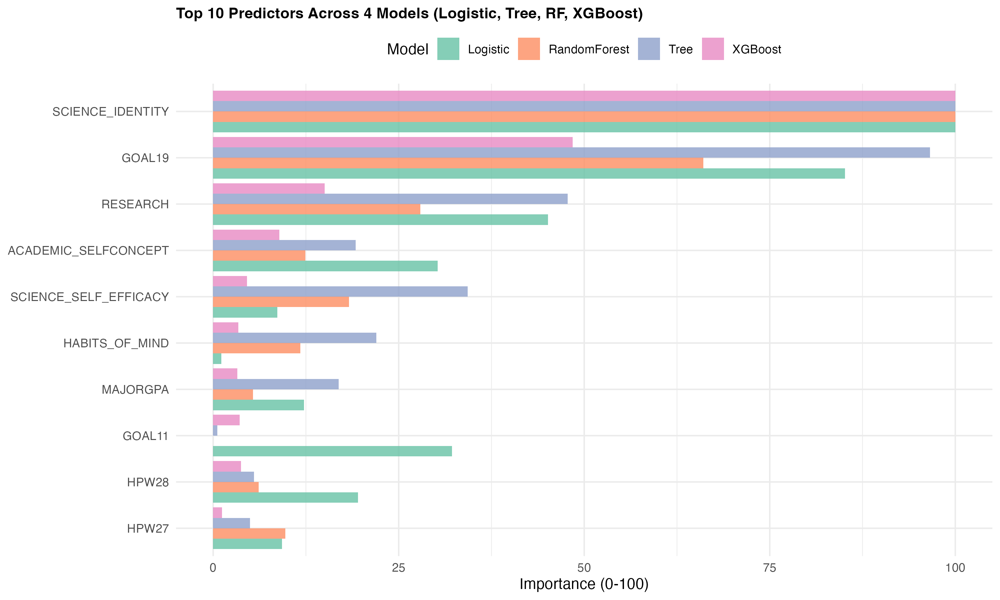

Machine learning (ML) has become an increasingly valuable tool in educational research, offering powerful methods to predict student outcomes and identify key factors influencing academic and career trajectories. This tutorial demonstrates how to apply multiple ML algorithms to predict STEM students' science career aspirations using real survey data.



**What makes ML-worthy?**

Not every prediction problem needs machine learning. This one does because:

1. **Non-linear relationships**: Science identity + research experience might interact synergistically
2. **Multiple pathways**: Different combinations can lead to the same outcome
3. **Hidden patterns**: Humans might miss subtle combinations that algorithms detect
4. **High dimensionality**: 18+ predictors with complex interactions

By the end of this tutorial, you'll understand:

- When to use ML (and when traditional methods suffice)
- How 5 core algorithms work and when to use each
- How to set up proper cross-validation
- How to evaluate and compare model performance
- How to interpret variable importance
- Common pitfalls and how to avoid them

## 1. When Should You Use Machine Learning?

### 1.1 Use ML When...

#### 1.1.1 The relationship is complex and non-linear

Example from our data:

```
Simple relationship: "High science identity → Science career"
Reality: 
- Identity > 60 AND Research > 6 months → 85% pursue careers
- Identity < 40 BUT Strong mentorship → Still 60% pursue careers
- Identity moderate BUT Values scientific contribution → 70% pursue careers
```

Multiple interacting factors create patterns too complex for simple IF-THEN rules.

#### 1.1.2 Traditional methods show poor fit

If you run simple regression and get:

- R² < 0.20 (explains less than 20% of variance)
- Many non-significant predictors
- Clear patterns in residuals

Now try ML. Non-parametric methods might capture what regression misses.

#### 1.1.3 You have sufficient data

**Rules of thumb:**

- **Minimum**: 10-20 observations per predictor
- **Comfortable**: 50+ observations per predictor  
- **Ideal**: 100+ observations per predictor

```
**Why size matters:**
Small data (n=200): ML overfits → Poor generalization
Medium data (n=500-1000): ML works with careful validation
Large data (n=5000+): ML often outperforms simpler methods
```

#### 1.1.4 Prediction is more important than explanation

Two different goals:

| Goal | Best Approach | Example Question |
|------|---------------|------------------|
| **Prediction** | ML (Random Forest, XGBoost) | "Which 100 students should we invite to research symposium?" |
| **Explanation** | Traditional Regression | "Does science identity associate with career interest, controlling for GPA?" |
| **Both** | Use BOTH | "Predict with random forest, understand with Logistic Regression" |

You're willing to trade interpretability for accuracy

```
Following order from low Accuracy to high accuracy, 
from high interpretability to low interpretability

Logistic Regression ← Decision Tree ← Random Forest ← XGBoost
(β coefficients)      (IF-THEN rules)  ("black box")   ("black box")
```

### 1.2 Don't Use ML When...

#### 1.2.1 Your dataset is tiny (n < 200)

With small data, ML models: overfit training data, perform poorly on new data, show high variance across runs

**Solution**: Use logistic regression with careful variable selection.

#### 1.2.2 You need causal inference

ML finds associations, NOT causes.

**Example mistake:**

- ML finds: "Students who socialize less pursue science careers"
- Wrong conclusion: "Reduce socializing to increase science interest"

#### 1.2.3 Simple methods already work well

If logistic regression achieves:

- AUC > 0.85 (excellent discrimination)
- Clear, significant predictors
- Good calibration

**Occam's Razor**: Simpler models are better when performance is comparable.

#### 1.2.4 Complete transparency is required

In high-stakes decisions (loan approval, medical diagnosis, college admissions), stakeholders may demand:

- "Why was this person rejected?"
- "Show me exactly how you made this decision"

Random Forest answer: "The algorithm voted based on 500 trees..."  
Logistic Regression answer: "Their science identity score was 2 SDs below average, which decreased odds by 73%..."

## 2. Required Package and Data Load

We'll use `caret` as our unified ML framework. Think of `caret` as the "tidyverse of machine learning", it provides consistent syntax for 200+ algorithms.

### 2.1 Package Overview

```{r}
#| warning: false
#| message: false

#core ML framework
library(caret)        # Classification And REgression Training
library(pROC)         # ROC curves and AUC

#specific algorithms (caret calls these internally)
library(rpart)        # Decision trees (CART)
library(randomForest) # Random Forest
library(xgboost)      # Gradient Boosting  
library(glmnet)       # Regularized regression

#data manipulation and visualization
library(dplyr)
library(ggplot2)
library(patchwork)
library(lattice)
library(gridExtra)
```

::: {.callout-tip}
| Package | Purpose | When to Use |
|---------|---------|-------------|
| **caret** | Unified ML interface | Always - handles training, tuning, evaluation |
| **pROC** | ROC/AUC analysis | Binary classification performance |
| **rpart** | Decision trees | Interpretable tree-based models |
| **randomForest** | Ensemble trees | High accuracy, variable importance |
| **xgboost** | Gradient boosting | State-of-the-art performance |
| **glmnet** | Regularized regression | High-dimensional data, feature selection |
:::


### 2.2 Data Preparation

Our survey asked students: "Will you pursue a science-related research career?"

Responses (5-point Likert scale): 1. Definitely no 2. Probably no 3. Uncertain 4. Probably yes 5. Definitely yes

We transform this into binary classification:

```{r}

rm(list = ls())
dt <- read.csv("dt.csv")
dt <- dt %>% mutate(SCICAREER_binary = ifelse(as.numeric(SCICAREER) >= 4, 1, 0))
dt <- dt %>%
  mutate(SCICAREER_binary = factor(SCICAREER_binary, levels = c(0, 1), labels = c("No", "Yes")))
table(dt$SCICAREER_binary)
prop.table(table(dt$SCICAREER_binary))
model_vars <- c("SCICAREER_binary","SCIENCE_SELF_EFFICACY", "SCIENCE_IDENTITY", "ACADEMIC_SELFCONCEPT", "HABITS_OF_MIND", "MAJORGPA", "GOAL19", "GOAL11", "GOAL04","RESEARCH", "HPW17", "HPW29", "HPW28", "HPW09", "HPW04", "HPW24", "HPW06", "HPW27", "HPW02")

library(tidyverse)
dt_model <- dt %>% select(all_of(model_vars)) %>% drop_na()  # Listwise deletion (missing rate < 2%)

for(var in model_vars[-1]) {
  dt_model[[var]] <- as.numeric(as.character(dt_model[[var]]))
}

dim(dt_model)
```
Predictors:

- `SCIENCE_SELF_EFFICACY`
- `SCIENCE_IDENTITY`
- `ACADEMIC_SELFCONCEPT`
- `HABITS_OF_MIND`
- `MAJORGPA`: Major GPA (1=D to 8=A/A+)
- `GOAL19`: Making theoretical contribution to science (1-4 scale)
- `GOAL11`: Helping others in difficulty (1-4 scale)
- `GOAL04`: Becoming authority in field (1-4 scale)
- `RESEARCH`: Months working on professor's research (0 to 25+ months)
- `HPW17`: Hours studying/homework
- `HPW29`: Hours studying with others
- `HPW28`: Hours socializing in person
- `HPW09`: Hours using social media
- `HPW04`: Hours in student clubs
- `HPW24`: Hours watching TV/videos
- `HPW06`: Hours exercising/sports
- `HPW27`: Hours working on campus
- `HPW02`: Hours career planning

## 3. Cross-Validation

### 3.1 The Problem: Why We Need Cross-Validation

**Bad approach**:
```r
#Train on ALL data
model <- train(outcome ~ ., data = all_data)

#Test on THE SAME data
predictions <- predict(model, all_data)
accuracy <- mean(predictions == all_data$outcome)
#Accuracy = 95%
```

**The problem:** This is like teaching a student with practice questions, then testing them on **the exact same questions**. Of course they'll do well. But can they handle *new* questions?

This is called **overfitting**, the model memorized the training data but won't generalize to new students.

### 3.2 The Solution: Cross-Validation

**Cross-validation** tests models on data they haven't seen during training.

**10-Fold Cross-Validation** (our approach):

1. Split data into 10 equal "folds" (10% each)
2. Train on 9 folds, test on 1 fold (repeat 10 times)
3. Each observation is in the test set exactly once
4. Average performance across all 10 folds

**Visual representation:**

```
Iteration 1: [Test] [Train] [Train] [Train] [Train] [Train] [Train] [Train] [Train] [Train]
Iteration 2: [Train] [Test] [Train] [Train] [Train] [Train] [Train] [Train] [Train] [Train]
Iteration 3: [Train] [Train] [Test] [Train] [Train] [Train] [Train] [Train] [Train] [Train]
...
Iteration 10: [Train] [Train] [Train] [Train] [Train] [Train] [Train] [Train] [Train] [Test]

Final metric = Average(Iteration 1, Iteration 2, ..., Iteration 10)
```

### 3.3 Setting Up Cross-Validation in caret

```{r}

set.seed(612)   

train_control <- trainControl(
  method = "cv",                    # Cross-validation
  number = 10,                      # 10 folds
  savePredictions = "final",        # Save predictions for later analysis
  classProbs = TRUE,                # Calculate P(Yes) and P(No)
  summaryFunction = twoClassSummary # Compute ROC, Sensitivity, Specificity
)
```

::: {.callout-tip}
With `twoClassSummary`, caret computes:

1. **ROC** (Receiver Operating Characteristic): Area under ROC curve (0.5 = random, 1.0 = perfect)
2. **Sens** (Sensitivity): Of students who WILL pursue careers, % we correctly identify  
3. **Spec** (Specificity): Of students who WON'T pursue careers, % we correctly identify
:::

## 4. Machine Learning Algorithms

We'll train 5 algorithms, each with different strengths. 

### Algorithm Selection

| Algorithm | Strength | Use Case | Computational Cost |
|-----------|----------|----------|-------------------|
| **Logistic Regression** | Interpretability | Understanding effects | Low |
| **Decision Tree** | Visual explanation | Presenting to stakeholders | Low |
| **Random Forest** | High accuracy | Best predictions | Medium |
| **KNN** | Non-parametric flexibility | Unusual patterns | Medium |
| **XGBoost** | Maximum performance | Competitions, production | Medium-High |

**Our approach:** Train all 5, compare performance, use best for predictions and most interpretable for understanding.


### 4.1. Logistic Regression

Classic statistical method - the "generalized linear regression" of classification.

Logistic regression models the probability of "Yes" using a function:

$$P(\text{Yes}) = \frac{1}{1 + e^{-(\beta_0 + \beta_1X_1 + \beta_2X_2 + ... + \beta_pX_p)}}$$
Where:

- $\beta_0$ = intercept
- $\beta_i$ = coefficient for predictor $X_i$
- Higher $\beta$ = stronger positive effect
- Negative $\beta$ = negative effect

```{r}
m_logit <- train(SCICAREER_binary ~ ., data = dt_model, method = "glm", family = "binomial",         
  trControl = train_control, metric = "ROC")

print(m_logit)
summary(m_logit)
```
### 4.2 Decision Tree (CART)

**Think of it as:** A flowchart that asks yes/no questions to make predictions.

**How it works:**

The algorithm builds a tree by repeatedly finding the best "split":

```
                     [Root: All 3346 students]
                              |
          Is SCIENCE_IDENTITY > 55?
         /                          \
      Yes                            No
       |                              |
  [2100 students]              [1246 students]
  70% pursue careers           30% pursue careers
       |                              |
  RESEARCH >= 4 months?        GOAL19 >= 3?
   /           \                /          \
 Yes           No             Yes          No
[1500]        [600]          [400]        [846]
85%           45%            55%          18%
PREDICT: Yes  PREDICT: No    PREDICT: Yes PREDICT: No
```

**Strengths:**

- Highly interpretable: Anyone can follow the logic
- Handles non-linearity: Captures complex patterns automatically
- No scaling needed: Works with raw data (unlike KNN)
- Automatic interaction detection: Finds interactions without manual specification
- Missing data handling: Can work with missing values

```{r}
m_tree <- train(SCICAREER_binary ~ ., data = dt_model, method = "rpart",
  trControl = train_control, metric = "ROC", tuneLength = 10    )

#visualize the tree
library(rpart.plot)
rpart.plot(m_tree$finalModel, type = 4, extra = 2,              
           fallen.leaves = TRUE, main = "Decision Tree for Science Career Prediction")
```

### 4.3 Random Forest

**Think of it as:** A committee of decision trees voting on predictions.

**How it works:**

Random Forest creates many trees (default: 500) and averages their predictions:

```
Tree 1: Uses random sample of data + random subset of predictors → Predicts "Yes"
Tree 2: Uses different random sample + different predictors → Predicts "Yes"  
Tree 3: Uses different random sample + different predictors → Predicts "No"
Tree 4: Uses different random sample + different predictors → Predicts "Yes"
...
Tree 500: Uses different random sample + different predictors → Predicts "Yes"

Final prediction: Majority vote = "Yes" (350/500 = 70% probability)
```

**Two sources of randomness:**

1. **Bootstrap samples**: Each tree sees different subset of data (sampling with replacement)
2. **Random features**: Each split considers only random subset of predictors (typically $\sqrt{p}$ predictors)


```{r}
#| eval: false
m_rf <- train(SCICAREER_binary ~ ., data = dt_model, method = "rf",
  trControl = train_control, metric = "ROC", tuneLength = 5,  importance = TRUE)

varImp(m_rf)

plot(varImp(m_rf), top = 10, main = "Top 10 Most Important Variables")
```

### 4.4 K-Nearest Neighbors (KNN)

**Think of it as:** "predictions based on similar observations.

**How it works:**

For a new student:

1. **Find the k most similar students** in training data
2. **Check their outcomes**: How many pursued science careers?
3. **Predict based on majority**: If 4 out of 5 neighbors = "Yes" → predict 80% probability "Yes"

**Similarity metric:**

Euclidean distance in 18-dimensional space:

$$d(i,j) = \sqrt{\sum_{p=1}^{18} (x_{ip} - x_{jp})^2}$$
Where $x_{ip}$ is value of predictor $p$ for student $i$.

::: {.callout-note}
Feature scaling required. 

Without scaling:
```
SCIENCE_SELF_EFFICACY: range 20-80 (scale of 60)
MAJORGPA: range 2-4 (scale of 2)

Distance dominated by SCIENCE_SELF_EFFICACY! 
MAJORGPA essentially ignored.
```

With scaling (mean = 0, SD = 1):
```
Both variables: range ≈ -3 to +3
Equal contribution to distance calculation
```
::: 

```{r}
#| eval: false

m_knn <- train(SCICAREER_binary ~ ., data = dt_model, method = "knn", trControl = train_control,
  metric = "ROC", preProcess = c("center", "scale"),  # Scale features
  tuneLength = 10)
```

**Hyperparameter: k (number of neighbors)**

- **Small k** (e.g., k=1): Very sensitive to noise, overfits
- **Large k** (e.g., k=50): Oversmooths, underfits
- **Default**: Often $\sqrt{n}$ (e.g., $\sqrt{3346} \approx 58$)

**Visual intuition:**

Imagine plotting two variables (Science Identity vs. Research Experience):

::: {.callout-note}
```
High Research ↑
             |   Yes  Yes  Yes
             |      Yes
             | No      Yes
             |   No  No
             |No  No     Yes
Low Research +----------------→ High Identity
```

For a new student at (Identity=60, Research=5):

- k=3: Find 3 closest points → Predict based on their outcomes
- Nearby points: 2 "Yes", 1 "No" → Predict "Yes" (67% probability)
::: 

### 4.5 XGBoost (Extreme Gradient Boosting)

**Think of it as:** Sequential problem-solving where each step corrects previous mistakes.

**How it works:**

XGBoost builds trees sequentially, each focusing on previous errors:

```
Step 1: Build Tree 1 → Makes predictions → Calculate errors
        Predictions: [0.5, 0.6, 0.7, ...]
        Actual:      [0, 1, 1, ...]
        Errors:      [+0.5, -0.4, -0.3, ...]

Step 2: Build Tree 2 to predict the ERRORS from Tree 1
        Focus on observations Tree 1 got wrong
        
Step 3: Build Tree 3 to predict remaining errors
        Continue correcting mistakes

...

Step 100: Final prediction = Tree1 + η×Tree2 + η×Tree3 + ... + η×Tree100
          Where η (eta) is learning rate (typically 0.1-0.3)
```


```{r}
#| eval: false

m_xgb <- train(SCICAREER_binary ~ ., data = dt_model, method = "xgbTree", trControl = train_control,
  metric = "ROC", tuneLength = 3, verbosity = 0)
```

### 4.6 Model Training Summary

Now let's train all 5 models and compare them:

```{r}
#| eval: false

#set seed for reproducibility
set.seed(612)

#setup cross-validation
train_control <- trainControl(
  method = "cv",
  number = 10,
  savePredictions = "final",
  classProbs = TRUE,
  summaryFunction = twoClassSummary
)

m_logit <- train(SCICAREER_binary ~ ., data = dt_model, method = "glm",
                 family = "binomial", trControl = train_control, metric = "ROC")

m_tree <- train(SCICAREER_binary ~ ., data = dt_model, method = "rpart",
                trControl = train_control, metric = "ROC", tuneLength = 10)

m_rf <- train(SCICAREER_binary ~ ., data = dt_model, method = "rf",
              trControl = train_control, metric = "ROC", 
              tuneLength = 5, importance = TRUE)

m_knn <- train(SCICAREER_binary ~ ., data = dt_model, method = "knn",
               trControl = train_control, metric = "ROC",
               preProcess = c("center", "scale"), tuneLength = 10)

m_xgb <- train(SCICAREER_binary ~ ., data = dt_model, method = "xgbTree",
               trControl = train_control, metric = "ROC",
               tuneLength = 3, verbosity = 0)
```

## 5. Model Evaluation & Comparison

### 5.1 Performance Metrics

For binary classification, we use three key metrics:

#### 5.1.1 ROC AUC (Area Under the Curve)

**What it measures:** Overall discriminatory ability, can the model distinguish "Yes" from "No"?

**Scale:** 0.5 (random guessing) to 1.0 (perfect classification)

- **0.90-1.00**: Excellent
- **0.80-0.90**: Good
- **0.70-0.80**: Fair
- **0.60-0.70**: Poor
- **0.50-0.60**: Failure

**Geometric meaning:**

ROC curve plots:
- X-axis: False Positive Rate (1 - Specificity)
- Y-axis: True Positive Rate (Sensitivity)

AUC = Area under this curve.

**Intuition:** Pick one random "Yes" student and one random "No" student. AUC = probability the model assigns higher score to the "Yes" student.

Example: AUC = 0.81 means model correctly ranks pairs 81% of the time.

#### 5.1.2 Sensitivity (True Positive Rate / Recall)

**What it measures:** Of students who WILL pursue science careers, what % do we correctly identify?

**Formula:** 
$$\text{Sensitivity} = \frac{\text{True Positives}}{\text{True Positives + False Negatives}}$$

**Example:**

- 100 students actually pursue science careers
- Model identifies 82 of them
- Sensitivity = 82/100 = 0.82 (82%)
- We missed 18 students (false negatives)

#### 5.1.3 Specificity (True Negative Rate)

**What it measures:** Of students who WON'T pursue science careers, what % do we correctly identify?

**Formula:**
$$\text{Specificity} = \frac{\text{True Negatives}}{\text{True Negatives + False Positives}}$$

**Example:**

- 100 students don't pursue science careers
- Model correctly identifies 70 of them
- Specificity = 70/100 = 0.70 (70%)
- We misclassified 30 students as "Yes" (false positives)

### 5.2 The Sensitivity-Specificity Tradeoff

You can't maximize both simultaneously.

**High threshold** (predict "Yes" only when very confident):
- ↑ Specificity (few false alarms)
- ↓ Sensitivity (miss some true positives)

**Low threshold** (predict "Yes" liberally):
- ↑ Sensitivity (catch most true positives)
- ↓ Specificity (many false alarms)


| Threshold | Sensitivity | Specificity | Interpretation |
|-----------|-------------|-------------|----------------|
| 0.3 | 0.95 | 0.40 | Catch almost everyone interested, but many false invites |
| 0.5 | 0.78 | 0.68 | Balanced approach |
| 0.7 | 0.55 | 0.85 | Conservative - only invite very likely candidates |

### 5.3 Comparing Our Models

```{r}
#| eval: false

# Combine all models
results <- resamples(list(
  Logistic = m_logit,
  Tree = m_tree,
  RandomForest = m_rf,
  KNN = m_knn,
  XGBoost = m_xgb
))

# Summary statistics
summary(results)
```

**Example output:**

```
Models: Logistic, Tree, RandomForest, KNN, XGBoost
Number of resamples: 10

ROC
              Min.   1st Qu.  Median   Mean   3rd Qu.  Max.
Logistic     0.792  0.796    0.805   0.809   0.814   0.847
Tree         0.716  0.745    0.783   0.773   0.792   0.827
RandomForest 0.771  0.792    0.801   0.804   0.816   0.838
KNN          0.741  0.763    0.775   0.775   0.791   0.807
XGBoost      0.786  0.801    0.809   0.810   0.820   0.839

Sens
              Min.   1st Qu.  Median   Mean   3rd Qu.  Max.
Logistic     0.745  0.769    0.790   0.788   0.807   0.821
Tree         0.668  0.712    0.746   0.740   0.769   0.793
RandomForest 0.739  0.760    0.777   0.781   0.794   0.836
KNN          0.761  0.801    0.812   0.812   0.833   0.853
XGBoost      0.717  0.736    0.779   0.767   0.788   0.810

Spec
              Min.   1st Qu.  Median   Mean   3rd Qu.  Max.
Logistic     0.603  0.664    0.682   0.683   0.710   0.748
Tree         0.589  0.649    0.669   0.683   0.720   0.788
RandomForest 0.589  0.634    0.659   0.666   0.712   0.722
KNN          0.523  0.578    0.589   0.593   0.609   0.662
XGBoost      0.603  0.684    0.689   0.697   0.722   0.768
```

### 5.4 Visualizing Performance

```{r}
#| eval: false

#create comparison plots
perf_p1 <- bwplot(results, metric = "ROC", main = "ROC AUC across 10 Folds")
perf_p2 <- bwplot(results, metric = "Sens", main = "Sensitivity across 10 Folds")
perf_p3 <- bwplot(results, metric = "Spec", main = "Specificity across 10 Folds")

#combine
library(gridExtra)
png("model_performance.png", width = 15, height = 5, units = "in", res = 300, bg = "white")
grid.arrange(perf_p1, perf_p2, perf_p3, ncol = 3)
dev.off()
```

## 6. Variable Importance Analysis

### 6.1 How Different Models Measure Importance

| Model | Importance Metric | What It Measures |
|-------|------------------|------------------|
| **Logistic** | Absolute coefficient | Direct effect size on log-odds |
| **Tree** | Split improvement | How much variable improves predictions when used |
| **Random Forest** | Gini importance | Average impurity reduction across 500 trees |
| **XGBoost** | Gain | Total improvement in objective function |

**All metrics scaled to 0-100** where 100 = most important variable in that model.

### 6.2 Extracting Importance

```{r}
#| eval: false

get_importance <- function(model, model_name) {
  tryCatch({
    imp <- varImp(model, scale = TRUE)
    data.frame(
      Variable = rownames(imp$importance),
      Importance = imp$importance[, 1],
      Model = model_name
    )
  }, error = function(e) NULL)
}

logit_imp <- get_importance(m_logit, "Logistic")
tree_imp <- get_importance(m_tree, "Tree")
rf_imp <- get_importance(m_rf, "RandomForest")
xgb_imp <- get_importance(m_xgb, "XGBoost")

all_imp <- bind_rows(logit_imp, tree_imp, rf_imp, xgb_imp)

top10_vars <- all_imp %>%
  group_by(Variable) %>%
  summarise(Avg_Importance = mean(Importance, na.rm = TRUE)) %>%
  arrange(desc(Avg_Importance)) %>%
  head(10) %>%
  pull(Variable)

plot_data <- all_imp %>% filter(Variable %in% top10_vars)

ggplot(plot_data, 
       aes(x = reorder(Variable, Importance), 
           y = Importance, fill = Model)) +
  geom_col(position = "dodge", alpha = 0.8) +
  coord_flip() +
  scale_fill_brewer(palette = "Set2") +
  labs(title = "Top 10 Predictors Across 4 Models",
       x = NULL, y = "Importance (0-100)") +
  theme_minimal() +
  theme(plot.title = element_text(face = "bold", size = 12),
        legend.position = "top")
```

### 6.3 Interpreting Variable Importance

**Example results:**

| Variable | Average Importance | Interpretation |
|----------|-------------------|----------------|
| **SCIENCE_IDENTITY** | 95.2 | Strongest predictor - identifying as a "science person" matters most |
| **GOAL19** (Theoretical contribution) | 78.4 | Valuing scientific contribution is key motivator |
| **RESEARCH** | 55.1 | Research experience strongly predicts career plans |
| **SCIENCE_SELF_EFFICACY** | 42.3 | Confidence in scientific ability matters |
| **ACADEMIC_SELFCONCEPT** | 28.7 | General academic confidence plays a role |
| **HPW28** (Socializing) | 18.2 | Time socializing has small negative association |
| **GOAL11** (Helping others) | 15.8 | Competing value - reduces science career interest |
| **HABITS_OF_MIND** | 12.4 | Scientific thinking dispositions matter less than identity |
| **HPW17** (Studying) | 10.9 | Study time has small positive effect |
| **MAJORGPA** | 8.3 | GPA has small prediction importance |

Practical Guidance:

**Identity > Ability**

SCIENCE_IDENTITY (95.2) >> MAJORGPA (8.3)

**Implication**: Students who see themselves as "science people" pursue science careers regardless of grades. Focus interventions on building science identity.

**Undergraduate Research Experiences Matter**

**Implication**: Provide undergraduate research opportunities. These experiences shape career decisions more than classroom performance.

## More readings:

- [caret package](http://topepo.github.io/caret/)


