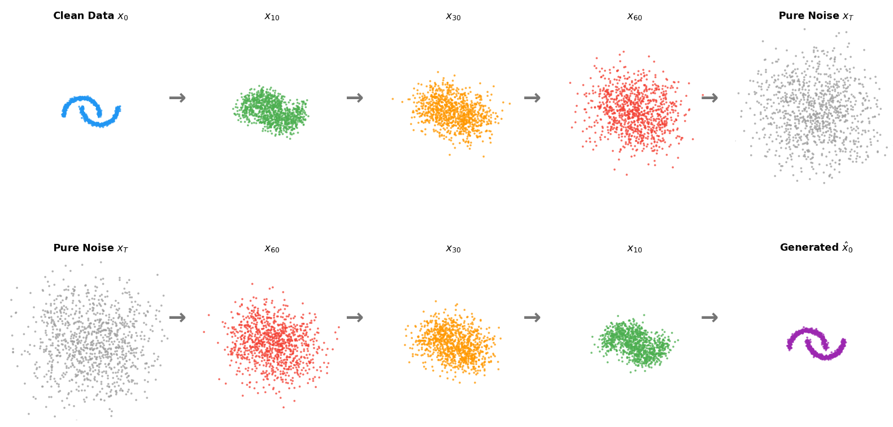

In our [previous tutorial](https://aliceaii.github.io/posts/ml_transformers/), we explored Transformers and how machines learn to understand language. Now we're stepping into one of the most fascinating areas of modern AI: diffusion models, the technology behind image generators like DALL-E, Stable Diffusion, and Midjourney.

This tutorial covers the mathematical foundations of diffusion models, building from basic probability all the way to the reverse denoising process that generates new data from pure noise. We'll see how Bayes' rule, the score function, and a simple neural network come together to create a powerful generative model.

In this post, we will cover: 

* Probability foundations — chain rule, marginalization, Bayes rule, and reversibility
* Continuous Bayes rule and the Gaussian posterior
* The forward noising process and learning the score function
* The $\epsilon$-prediction trick used in practice
* A toy diffusion model simulation



::: callout-tip
## Before We Begin: The Big Picture

Imagine you have a beautiful photograph. Now imagine slowly adding TV static (random noise) to it, one layer at a time. After enough layers, the photo becomes pure static — unrecognizable.

**Diffusion models learn to reverse this process:**

1.  **Forward process:** Gradually add noise until data becomes pure static
2.  **Learn the reverse:** Train a neural network to remove noise, one small step at a time
3.  **Generate new data:** Start from pure static and iteratively denoise to create something new

The magic is that by learning to reverse the noising process, the model learns the *structure* of the data itself — what makes a face look like a face, a cat look like a cat, or a sentence sound natural.

This tutorial shows you exactly how this works mathematically, step by step.
:::

## 1. Probability Foundations: Moving People Between States

### 1.1 The Setup: A Population Movement Story

To build intuition for how diffusion models work, let's start with a concrete analogy. Imagine 1 billion people distributed across three states (1, 2, 3).

We define:

-   $p(x)$: the fraction of people in state $x$ (also the probability of randomly picking someone from state $x$)
-   $p(y|x)$: the fraction of people in state $x$ who will move to state $y$ (the "forward transition")

::: callout-note
## Why Start with Discrete States?

This may seem unrelated to image generation, but the core idea is the same. In diffusion models, "states" become pixel values, and "moving between states" becomes adding or removing noise. Understanding the discrete case first makes the continuous (and much harder) case intuitive.
:::

### 1.2 Three Fundamental Rules

These three rules are the backbone of *all* probability calculations in machine learning:

**Chain Rule:** The joint probability of being in state $x$ AND ending up in state $y$ is:

$$p(x, y) = p(x) \cdot p(y|x)$$

Think of it this way: the number of people who start in $x$ and end in $y$ equals (total people in $x$) $\times$ (fraction of those who move to $y$).

**Marginalization (Total Probability):** To find the total fraction of people ending up in state $y$, sum over all origins:

$$\tilde{p}(y) = \sum_x p(x, y) = \sum_x p(x) \cdot p(y|x)$$

This is like counting everyone arriving at $y$ from every possible starting point.

**Bayes Rule (Backward Conditional):** Among those who ended up in $y$, what fraction came from $x$?

$$p(x|y) = \frac{p(x, y)}{\tilde{p}(y)} = \frac{p(x) \cdot p(y|x)}{\sum_{x'} p(x') \cdot p(y|x')}$$

::: callout-note
## Forward vs. Backward: The Key Insight for Diffusion

We call $p(y|x)$ the **forward conditional** (cause → effect) and $p(x|y)$ the **backward conditional** (effect → cause).

In diffusion models:

-   **Forward** = adding noise (easy, we control this)
-   **Backward** = removing noise (hard, we need to learn this)

Bayes' rule tells us the backward process exists and is mathematically well-defined, we just need to figure out how to compute it.
:::

### 1.3 The Reversibility Property

Here's the fact: if we take the people who ended up in each state $y$ and send $p(x|y)$ of them back to $x$, the original distribution $p(x)$ is perfectly restored!

$$\sum_y \tilde{p}(y) \cdot p(x|y) = \sum_y \tilde{p}(y) \cdot \frac{p(x,y)}{\tilde{p}(y)} = \sum_y p(x,y) = p(x)$$

The $\tilde{p}(y)$ cancels, and marginalizing the joint over $y$ gives back $p(x)$.

::: callout-important
## The Deep Insight: Distribution-Level Reversibility

The *individual people* may not return to their original states — person A who started in state 1 might end up in state 2 after the forward-backward round trip. But the *overall distribution* is perfectly restored.

This is exactly what happens in diffusion models: the forward process destroys individual data points (adds noise), but the reverse process restores the overall data distribution. We don't recover the exact original images, but we generate new samples from the same distribution.
:::

### 1.4 Numerical Walkthrough

Let's make this concrete with numbers. We start with an initial distribution over three states:

$$p(x) = [0.50,\ 0.30,\ 0.20]$$

and a forward transition matrix $p(y|x)$ where each row sums to 1:

$$p(y|x) = \begin{bmatrix} 0.6 & 0.3 & 0.1 \\ 0.2 & 0.5 & 0.3 \\ 0.1 & 0.2 & 0.7 \end{bmatrix}$$

**Step 1 — Joint distribution** $p(x, y) = p(x) \cdot p(y|x)$, computed by scaling each row $i$ of $p(y|x)$ by $p(x=i)$:

$$p(x,y) = \begin{bmatrix} 0.30 & 0.15 & 0.05 \\ 0.06 & 0.15 & 0.09 \\ 0.02 & 0.04 & 0.14 \end{bmatrix}$$

**Step 2 — Marginal** $\tilde{p}(y)$: sum each column of the joint distribution:

$$\tilde{p}(y) = [0.38,\ 0.34,\ 0.28]$$

Notice the distribution has shifted — state 3 gained weight (from 0.20 to 0.28) while state 1 lost weight (from 0.50 to 0.38).

**Step 3 — Backward conditional** $p(x|y) = p(x,y) / \tilde{p}(y)$: divide each column of the joint by the corresponding marginal $\tilde{p}(y)$:

$$p(x|y) \approx \begin{bmatrix} 0.7895 & 0.4412 & 0.1786 \\ 0.1579 & 0.4412 & 0.3214 \\ 0.0526 & 0.1176 & 0.5000 \end{bmatrix}$$

**Step 4 — Recovery**: applying the backward conditional restores $p(x)$ exactly:

$$\sum_y \tilde{p}(y) \cdot p(x|y) = [0.50,\ 0.30,\ 0.20] = p(x)$$

```{python}
#| label: fig-population-movement
#| fig-cap: "Population movement between states: forward redistribution (top-left), forward transition matrix (top-right), backward transition matrix (bottom-left), and reversibility verification (bottom-right)."

import numpy as np
import matplotlib.pyplot as plt

# --- Setup ---
p_x = np.array([0.5, 0.3, 0.2])
p_y_given_x = np.array([
    [0.6, 0.3, 0.1],
    [0.2, 0.5, 0.3],
    [0.1, 0.2, 0.7],
])
joint = p_x[:, None] * p_y_given_x
p_tilde_y = joint.sum(axis=0)
p_x_given_y = joint / p_tilde_y[None, :]
recovered = (p_tilde_y[None, :] * p_x_given_y).sum(axis=1)

# --- Visualization ---
fig, axes = plt.subplots(2, 2, figsize=(8, 7))

state_colors = ['#2196F3', '#FF9800', '#4CAF50']
state_labels = ['State 1', 'State 2', 'State 3']
x_pos = np.arange(3)
width = 0.35

# Plot 1 (top-left): Forward process
ax = axes[0, 0]
ax.bar(x_pos - width/2, p_x, width, color=state_colors, alpha=0.7,
       edgecolor='black', label='Before $p(x)$')
ax.bar(x_pos + width/2, p_tilde_y, width, color=state_colors, alpha=0.4,
       edgecolor='black', hatch='//', label='After $\\tilde{p}(y)$')
ax.set_xticks(x_pos)
ax.set_xticklabels(state_labels)
ax.set_ylabel('Fraction of population')
ax.set_title('Forward: Population Redistribution', fontsize=11, fontweight='bold')
ax.legend(fontsize=9)
ax.set_ylim(0, 0.6)
ax.grid(axis='y', alpha=0.3)
for i, (v1, v2) in enumerate(zip(p_x, p_tilde_y)):
    ax.text(i - width/2, v1 + 0.01, f'{v1:.2f}', ha='center', fontsize=9, fontweight='bold')
    ax.text(i + width/2, v2 + 0.01, f'{v2:.2f}', ha='center', fontsize=9)

# Plot 2 (top-right): Forward transition matrix
ax = axes[0, 1]
ax.imshow(p_y_given_x, cmap='Blues', vmin=0, vmax=1, aspect='auto')
ax.set_xticks([0, 1, 2])
ax.set_yticks([0, 1, 2])
ax.set_xticklabels(['y=1', 'y=2', 'y=3'])
ax.set_yticklabels(['x=1', 'x=2', 'x=3'])
ax.set_xlabel('Destination state $y$')
ax.set_ylabel('Origin state $x$')
ax.set_title('Forward Transition $p(y|x)$', fontsize=11, fontweight='bold')
for i in range(3):
    for j in range(3):
        ax.text(j, i, f'{p_y_given_x[i,j]:.2f}', ha='center', va='center',
                fontsize=11, fontweight='bold',
                color='white' if p_y_given_x[i,j] > 0.5 else 'black')

# Plot 3 (bottom-left): Backward transition matrix
ax = axes[1, 0]
ax.imshow(p_x_given_y, cmap='Oranges', vmin=0, vmax=1, aspect='auto')
ax.set_xticks([0, 1, 2])
ax.set_yticks([0, 1, 2])
ax.set_xticklabels(['y=1', 'y=2', 'y=3'])
ax.set_yticklabels(['x=1', 'x=2', 'x=3'])
ax.set_xlabel('Observed state $y$')
ax.set_ylabel('Origin state $x$')
ax.set_title('Backward Transition $p(x|y)$', fontsize=11, fontweight='bold')
for i in range(3):
    for j in range(3):
        ax.text(j, i, f'{p_x_given_y[i,j]:.2f}', ha='center', va='center',
                fontsize=11, fontweight='bold',
                color='white' if p_x_given_y[i,j] > 0.5 else 'black')

# Plot 4 (bottom-right): Reversibility verification
ax = axes[1, 1]
ax.bar(x_pos - width/2, p_x, width, color=state_colors, alpha=0.7,
       edgecolor='black', label='Original $p(x)$')
ax.bar(x_pos + width/2, recovered, width, color=state_colors, alpha=0.4,
       edgecolor='black', hatch='\\\\', label='Recovered')
ax.set_xticks(x_pos)
ax.set_xticklabels(state_labels)
ax.set_ylabel('Fraction of population')
ax.set_title('Reversibility: Distribution Restored', fontsize=11, fontweight='bold')
ax.legend(fontsize=9)
ax.set_ylim(0, 0.6)
ax.grid(axis='y', alpha=0.3)
for i, (v1, v2) in enumerate(zip(p_x, recovered)):
    ax.text(i - width/2, v1 + 0.01, f'{v1:.2f}', ha='center', fontsize=9, fontweight='bold')
    ax.text(i + width/2, v2 + 0.01, f'{v2:.2f}', ha='center', fontsize=9)

plt.tight_layout()
plt.show()

```

The top-left panel shows how the population shifts after the forward transition ($\tilde{p}(y) = [0.38, 0.34, 0.28]$). The top-right and bottom-left heatmaps display the forward and backward transition matrices respectively. The bottom-right panel confirms reversibility: applying the backward conditional to $\tilde{p}(y)$ perfectly recovers $p(x) = [0.50, 0.30, 0.20]$.


## 2. Going Continuous: Bayes Rule with Densities

### 2.1 From Discrete to Continuous

In real applications, our data lives in continuous space (pixel values, coordinates, etc.). The discrete rules extend naturally — we replace sums with integrals and probabilities with probability densities.

For continuous variables $x$ and $y$:

-   **Chain rule:** $p(x, y) = p(x) \cdot p(y|x)$
-   **Marginalization:** $\tilde{p}(y) = \int p(x) \cdot p(y|x) \, dx$
-   **Bayes rule:** $p(x|y) = \frac{p(x) \cdot p(y|x)}{\tilde{p}(y)} \propto p(x) \cdot p(y|x)$

The proportionality $\propto$ means "equal up to a normalizing constant" — the denominator $\tilde{p}(y)$ just ensures the result integrates to 1.

### 2.2 The Gaussian Posterior: Where the Magic Happens

Now here's the key result that makes diffusion models work. Suppose we have a random variable $x$ with some density $p(x)$, and we observe a noisy version:

$$y = x + e, \quad e \sim \mathcal{N}(0, \sigma^2)$$

This means $p(y|x) = \mathcal{N}(y; x, \sigma^2) \propto \exp\left[-\frac{(y-x)^2}{2\sigma^2}\right]$.

**Question:** Given that we observed $y$, what can we say about $x$? (This is the backward conditional $p(x|y)$.)

**Derivation:** By Bayes rule, $\log p(x|y) = \log p(x) + \log p(y|x) + \text{const}$.

Since $\sigma^2$ is small, $x \approx y$, so we Taylor-expand $\log p(x)$ around $y$:

$$\log p(x) \approx \log p(y) + (x - y) \cdot \nabla \log p(y)$$

Combining with the likelihood:

$$\log p(x|y) \approx (x-y) \nabla \log p(y) - \frac{(y-x)^2}{2\sigma^2} + \text{const}$$

Completing the square in $x$:

$$\log p(x|y) = -\frac{1}{2\sigma^2}\left[x - \left(y + \sigma^2 \nabla \log p(y)\right)\right]^2 + \text{const}$$

This gives us:

$$\boxed{p(x|y) \approx \mathcal{N}\left(y + \sigma^2 \nabla \log p(y), \; \sigma^2\right)}$$

::: callout-note
## The Score Function: The Secret Ingredient

The term $\nabla \log p(y)$ is called the **score function**. It's the gradient of the log-density — it points in the direction where the data density increases.

**Intuition:** Given a noisy observation $y$, the best guess for the clean $x$ is:

$$\hat{x} = y + \sigma^2 \nabla \log p(y)$$

This says: "Start at $y$, then nudge toward where the data is more likely." The score function acts as a compass pointing toward high-density regions — this is the **denoising effect**.
:::

```{python}
#| label: fig-score-function
#| fig-cap: "The score function points toward high-density regions, guiding denoising."
import numpy as np
import matplotlib.pyplot as plt
from scipy.stats import norm

# Create a mixture of Gaussians as our data distribution
def p_data(x):
    return 0.4 * norm.pdf(x, -2, 0.7) + 0.6 * norm.pdf(x, 2, 1.0)

def log_p_data(x):
    return np.log(p_data(x) + 1e-10)

def score_function(x, dx=0.01):
    return (log_p_data(x + dx) - log_p_data(x - dx)) / (2 * dx)

x = np.linspace(-6, 6, 500)

fig = plt.figure(figsize=(8, 6))

# Top row: 2 plots
ax1 = fig.add_subplot(2, 2, 1)
ax2 = fig.add_subplot(2, 2, 2)
# Bottom row: 1 centered plot
ax3 = fig.add_subplot(2, 2, (3, 4))

# Plot 1: The data density
ax1.fill_between(x, p_data(x), alpha=0.3, color='#2196F3')
ax1.plot(x, p_data(x), color='#2196F3', linewidth=2)
ax1.set_xlabel('$x$', fontsize=11)
ax1.set_ylabel('$p(x)$', fontsize=11)
ax1.set_title('Data Density $p(x)$', fontsize=12, fontweight='bold')
ax1.annotate('Low density\nregion', xy=(0, 0.02), fontsize=9, ha='center', color='gray')
ax1.annotate('High\ndensity', xy=(-2, 0.22), fontsize=9, ha='center', color='#1565C0', fontweight='bold')
ax1.annotate('High\ndensity', xy=(2, 0.22), fontsize=9, ha='center', color='#1565C0', fontweight='bold')
ax1.grid(True, alpha=0.3)

# Plot 2: The score function
scores = score_function(x)
ax2.plot(x, scores, color='#F44336', linewidth=2)
ax2.axhline(y=0, color='gray', linestyle='--', alpha=0.5)
ax2.fill_between(x, 0, scores, where=(scores > 0), alpha=0.2, color='green', label='Push right →')
ax2.fill_between(x, 0, scores, where=(scores < 0), alpha=0.2, color='red', label='← Push left')
ax2.set_xlabel('$x$', fontsize=11)
ax2.set_ylabel('$\\nabla \\log p(x)$', fontsize=11)
ax2.set_title('Score Function $\\nabla \\log p(x)$', fontsize=12, fontweight='bold')
ax2.legend(fontsize=9)
ax2.grid(True, alpha=0.3)

# Plot 3: Denoising illustration (bottom, spanning full width)
sigma2 = 0.5
noisy_points = np.array([-0.5, 0.5, 3.5, -3.5])
ax3.fill_between(x, p_data(x), alpha=0.15, color='#2196F3')
ax3.plot(x, p_data(x), color='#2196F3', linewidth=1.5, alpha=0.5, label='$p(x)$')
for y_obs in noisy_points:
    s = score_function(y_obs)
    denoised = y_obs + sigma2 * s
    ax3.scatter(y_obs, 0.01, color='red', s=80, zorder=5, marker='x', linewidths=2)
    ax3.annotate('', xy=(denoised, 0.01), xytext=(y_obs, 0.01),
                arrowprops=dict(arrowstyle='->', color='#4CAF50', lw=2))
    ax3.scatter(denoised, 0.01, color='#4CAF50', s=80, zorder=5, marker='o')
ax3.scatter([], [], color='red', marker='x', s=60, label='Noisy $y$')
ax3.scatter([], [], color='#4CAF50', marker='o', s=60, label='Denoised $\\hat{x}$')
ax3.set_xlabel('$x$', fontsize=11)
ax3.set_title('Denoising: $\\hat{x} = y + \\sigma^2 \\nabla \\log p(y)$', fontsize=12, fontweight='bold')
ax3.legend(fontsize=9, loc='upper right')
ax3.grid(True, alpha=0.3)
ax3.set_ylim(-0.02, 0.30)

plt.tight_layout()
plt.show()
```

The score function (top right) is positive where the density is increasing (push right) and negative where it's decreasing (push left). The denoising effect (bottom) shows noisy observations being pushed toward high-density regions.

## 3. The Diffusion Process: Adding and Removing Noise

### 3.1 Forward Process: Gradually Destroying Data

Starting from clean data $x_0 \sim p_0(x)$, we define a chain of increasingly noisy versions:

$$x_t = x_{t-1} + e_t, \quad e_t \sim \mathcal{N}(0, \sigma^2), \quad t = 1, \ldots, T$$

After $T$ steps, $x_T \approx \mathcal{N}(0, T\sigma^2)$ — the data has been destroyed into pure Gaussian noise.

```{python}
#| label: fig-forward-process
#| fig-cap: "The forward diffusion process gradually transforms structured data into Gaussian noise."

import numpy as np
import matplotlib.pyplot as plt
from sklearn.datasets import make_moons

np.random.seed(42)

# Generate data
X_data, _ = make_moons(n_samples=1500, noise=0.05)

# Forward noising
sigma = 0.15
T = 100
steps_to_show = [0, 10, 30, 60, 80, 100]  

fig, axes = plt.subplots(3, 2, figsize=(8, 10))
axes_flat = axes.flatten()

for idx, t in enumerate(steps_to_show):
    ax = axes_flat[idx]
    if t == 0:
        noised = X_data.copy()
    else:
        noise = np.random.randn(X_data.shape[0], 2) * sigma * np.sqrt(t)
        noised = X_data + noise

    color_val = 1 - t / T
    c = plt.cm.RdYlBu(np.full(len(noised), color_val))
    ax.scatter(noised[:, 0], noised[:, 1], s=1, alpha=0.5, c=c[:, :3])
    ax.set_title(f't = {t}', fontsize=12, fontweight='bold')
    ax.set_xlim(-4, 5)
    ax.set_ylim(-4, 5)
    ax.set_aspect('equal')
    ax.grid(True, alpha=0.2)
    if t == 0:
        ax.set_xlabel('Clean data $x_0$', fontsize=10)
    elif t == T:
        ax.set_xlabel('Pure noise $x_T$', fontsize=10)

fig.suptitle('Forward Process: Data → Noise (+ small Gaussian perturbations at each step)',
             fontsize=13, fontweight='bold')
plt.tight_layout()
plt.show()
```

::: callout-note
## The Forward Process is Easy — The Reverse is Hard

Adding noise is trivial: just sample random numbers and add them. The challenge is going backward: given a noisy sample, how do we remove the noise? This is where the score function comes in.
:::

### 3.2 Backward Process: Learning to Denoise

From Section 2.2, we showed that for small $\sigma^2$:

$$p(x_{t-1} | x_t) \approx \mathcal{N}\left(x_t + \sigma^2 \nabla \log p_{t-1}(x_t), \; \sigma^2\right)$$

The backward conditional has mean $x_t + \sigma^2 \nabla \log p_{t-1}(x_t)$. Here, $x_{t-1}$ plays the role of the "clean" variable and $x_t$ is the "noisy" observation, so the relevant prior density is $p_{t-1}$.

**The problem:** We don't know $\nabla \log p_{t-1}(x_t)$ — the score function of the marginal density at time $t-1$.

**The solution:** Approximate it with a neural network $s_\theta(x_t, t) \approx \nabla \log p_{t-1}(x_t)$.

### 3.3 Training: Denoising Score Matching

We train $s_\theta$ by minimizing the expected squared error between the true $x_{t-1}$ and the predicted mean:

$$L(\theta) = \mathbb{E}_{t, x_0, x_{t-1}, x_t}\left[(x_{t-1} - (x_t + \sigma^2 s_\theta(x_t, t)))^2\right]$$

In practice:

1.  Sample $x_0$ from the training data
2.  Run the forward chain to get $(x_{t-1}, x_t)$ for a random time step $t$
3.  Train the network to predict $x_{t-1}$ from $x_t$

### 3.4 Sampling: Two Ways to Generate

Once trained, we can generate new data starting from pure noise $x_T \sim \mathcal{N}(0, T\sigma^2)$:

**Stochastic reverse** (one step at a time):

$$x_{t-1} = x_t + \sigma^2 s_\theta(x_t, t) + \tilde{e}_t, \quad \tilde{e}_t \sim \mathcal{N}(0, \sigma^2)$$

This mirrors the true backward conditional — deterministic denoising plus fresh randomness.

**Deterministic reverse** (two steps at a time):

$$x_{t-2} = x_t + \sigma^2 s_\theta(x_t, t)$$

Without noise injection, each step does double duty: the drift provides denoising (one step's worth), and omitting noise saves another step's worth of variance. This is the **probability flow ODE** (Ordinary Differential Equation) approach.

```{python}
#| label: fig-stochastic-vs-deterministic
#| fig-cap: "Comparing stochastic and deterministic reverse processes: both recover the data distribution."

import numpy as np
import matplotlib.pyplot as plt

fig, axes = plt.subplots(1, 2, figsize=(8, 4))

# Stochastic diagram
ax = axes[0]
np.random.seed(7)
t_steps = np.arange(10, -1, -1)
x_path = [3.0]
sigma2 = 0.3
for i in range(len(t_steps) - 1):
    drift = -0.25 * x_path[-1]  # simulated score-based drift
    noise = np.random.randn() * np.sqrt(sigma2) * 0.5
    x_path.append(x_path[-1] + drift + noise)

ax.plot(range(len(x_path)), x_path, 'o-', color='#F44336', linewidth=2, markersize=6)
ax.set_xlabel('Reverse step', fontsize=11)
ax.set_ylabel('$x_t$', fontsize=11)
ax.set_title('Stochastic Reverse\n$x_{t-1} = x_t + \\sigma^2 s_\\theta + \\tilde{e}_t$', fontsize=12, fontweight='bold')
ax.annotate('Drift + Random noise\n(wiggly path)', xy=(5, x_path[5]),
            xytext=(6, x_path[5]+1.5), fontsize=9,
            arrowprops=dict(arrowstyle='->', color='gray'))
ax.grid(True, alpha=0.3)

# Deterministic diagram
ax = axes[1]
x_path_det = [3.0]
for i in range(5):
    drift = -0.25 * x_path_det[-1]
    x_path_det.append(x_path_det[-1] + drift * 2)  # double step

ax.plot(np.arange(0, 11, 2), x_path_det, 's-', color='#2196F3', linewidth=2, markersize=8)
ax.set_xlabel('Reverse step (jumps by 2)', fontsize=11)
ax.set_ylabel('$x_t$', fontsize=11)
ax.set_title('Deterministic Reverse\n$x_{t-2} = x_t + \\sigma^2 s_\\theta$ (no noise)', fontsize=12, fontweight='bold')
ax.annotate('Drift only\n(smooth path, 2x step)', xy=(4, x_path_det[2]),
            xytext=(5, x_path_det[2]+1.5), fontsize=9,
            arrowprops=dict(arrowstyle='->', color='gray'))
ax.grid(True, alpha=0.3)

plt.tight_layout()
plt.show()
```

### 3.5 The Particle Interpretation

Think of 1 billion particles on the real line, initially distributed as $p_0(x)$.

**Forward:** At each step, every particle gets a random kick. After $T$ steps, the particles form a featureless Gaussian cloud.

**Stochastic reverse:** Each particle shifts toward high-density regions (guided by the score) and receives a fresh random kick. After $T$ steps, the original distribution is recovered.

**Deterministic reverse:** Each particle moves deterministically along the score gradient — no random kicks, but covering two steps at once. Despite having zero randomness, the overall particle distribution is still correctly transported.

::: callout-important
## Why Can Deterministic Moves Undo Random Noise?

This connects back to our population movement story (Section 1.3): reversibility operates at the **distributional** level, not the individual level. The forward process adds random noise to each particle, but the resulting density $p_t(x)$ evolves deterministically (it's just a convolution with a Gaussian). The score function captures this collective density structure, so a deterministic flow can reverse the density evolution — even though individual particles take different paths than they originally did.

It's like reversing the diffusion of dye in water: individual molecules took random walks, but the concentration field can be reversed by a deterministic flow.
:::

## 4. The $\epsilon$-Prediction Trick

### 4.1 Predicting Noise Instead of Signal

In practice, instead of predicting $x_{t-1}$ from $x_t$ one step at a time, we can predict $x_0$ directly from $x_t$. Since $x_t = x_0 + \epsilon_t$ where $\epsilon_t \sim \mathcal{N}(0, t\sigma^2)$, predicting $x_0$ is equivalent to predicting the noise $\epsilon_t$.

Define $\epsilon_\theta(x, t) = -t\sigma^2 s_\theta(x, t)$. The training loss becomes:

$$L(\theta) = \mathbb{E}_{x_0, t, \epsilon_t}\left[(\epsilon_t - \epsilon_\theta(x_0 + \epsilon_t, t))^2\right]$$

This is beautifully simple: **train a neural network to predict the noise that was added**, given the noisy observation.

### 4.2 Backward Processes with $\epsilon$-Prediction

Substituting $s_\theta(x,t) = -\epsilon_\theta(x,t) / (t\sigma^2)$:

**Stochastic reverse:**

$$x_{t-1} = x_t - \frac{1}{t}\epsilon_\theta(x_t, t) + \tilde{e}_t$$

**Deterministic reverse (DDIM [Denoising Diffusion Probabilistic Models]-style):**

$$x_{t-2} = x_t - \frac{1}{t}\epsilon_\theta(x_t, t)$$

::: callout-note
## Why Predict Noise?

Predicting the noise $\epsilon_t$ rather than the clean signal $x_0$ has practical advantages:

1.  $x_0$ is a better target than $x_{t-1}$: the clean data has no noise, making the learning signal clearer
2.  **The fraction** $1/t$: At high noise levels (large $t$), each step removes only a small fraction of the total noise, which is numerically stable
3.  **This is what DDPM (Denoising Diffusion Implicit Models) and Stable Diffusion actually use** — the $\epsilon$-prediction formulation is the standard in practice
:::

```{python}
#| label: fig-epsilon-prediction
#| fig-cap: "The epsilon-prediction process: a neural network learns to estimate the noise added at each step."

import numpy as np
import matplotlib.pyplot as plt
from sklearn.datasets import make_moons

np.random.seed(42)

fig, axes = plt.subplots(2, 2, figsize=(8, 7))
axes_flat = axes.flatten()

# Clean signal
x0 = np.array([1.5, 0.8])
t = 50
sigma = 0.15
noise_std = sigma * np.sqrt(t)
epsilon = np.random.randn(2) * noise_std
xt = x0 + epsilon

# Plot 1: Clean data
ax = axes_flat[0]
X_clean, _ = make_moons(n_samples=500, noise=0.05, random_state=42)
ax.scatter(X_clean[:, 0], X_clean[:, 1], s=2, alpha=0.5, c='#2196F3')
ax.scatter(x0[0], x0[1], s=150, c='gold', edgecolors='black', zorder=5, marker='*')
ax.set_title('Clean $x_0$', fontsize=11, fontweight='bold')
ax.set_xlim(-2, 3)
ax.set_ylim(-1.5, 2)
ax.set_aspect('equal')
ax.grid(True, alpha=0.2)

# Plot 2: Noised data
ax = axes_flat[1]
X_noised = X_clean + np.random.randn(*X_clean.shape) * noise_std
ax.scatter(X_noised[:, 0], X_noised[:, 1], s=2, alpha=0.5, c='#F44336')
ax.scatter(xt[0], xt[1], s=150, c='gold', edgecolors='black', zorder=5, marker='*')
ax.set_title(f'Noisy $x_{{t={t}}}$', fontsize=11, fontweight='bold')
ax.set_xlim(-4, 5)
ax.set_ylim(-4, 5)
ax.set_aspect('equal')
ax.grid(True, alpha=0.2)

# Plot 3: Network prediction
ax = axes_flat[2]
ax.set_xlim(-1, 1)
ax.set_ylim(-0.5, 1.5)
ax.text(0.5, 0.95, '$\\epsilon_\\theta(x_t, t)$', fontsize=16, ha='center', va='center',
        fontweight='bold', color='#9C27B0',
        bbox=dict(boxstyle='round,pad=0.5', facecolor='#E1BEE7', edgecolor='#9C27B0', linewidth=2))
ax.annotate('', xy=(0.15, 0.95), xytext=(-0.3, 0.95),
            arrowprops=dict(arrowstyle='->', color='#F44336', lw=2))
ax.annotate('', xy=(0.85, 0.95), xytext=(1.1, 0.95),
            arrowprops=dict(arrowstyle='->', color='#4CAF50', lw=2))
ax.text(-0.5, 0.95, '$x_t, t$', fontsize=12, ha='center', va='center', color='#F44336')
ax.text(1.3, 0.95, '$\\hat{\\epsilon}$', fontsize=12, ha='center', va='center', color='#4CAF50')
ax.text(0.5, 0.3, 'Neural network predicts\nthe noise that was added', fontsize=10, ha='center',
        va='center', style='italic', color='gray')
ax.set_title('$\\epsilon$-Prediction Network', fontsize=11, fontweight='bold')
ax.axis('off')

# Plot 4: Denoised result
ax = axes_flat[3]
eps_pred = epsilon * 0.85 + np.random.randn(2) * 0.1
x_denoised = xt - eps_pred
ax.scatter(X_clean[:, 0], X_clean[:, 1], s=2, alpha=0.3, c='#2196F3', label='Original')
ax.scatter(x_denoised[0], x_denoised[1], s=150, c='gold', edgecolors='black', zorder=5, marker='*')
ax.set_title('Denoised $\\hat{x}_0 = x_t - \\hat{\\epsilon}$', fontsize=11, fontweight='bold')
ax.set_xlim(-2, 3)
ax.set_ylim(-1.5, 2)
ax.set_aspect('equal')
ax.grid(True, alpha=0.2)

plt.tight_layout()
plt.show()
```

## 5. Putting It All Together: A Toy Diffusion Model

Let's implement a complete diffusion model on the two-moons dataset to see all these ideas in action.

```{python}
#| label: fig-diffusion-training
#| fig-cap: "Training a toy diffusion model: forward noising, epsilon network training, and reverse sampling."

import torch
import torch.nn as nn
import numpy as np
import matplotlib.pyplot as plt
from sklearn.datasets import make_moons

# ============================================================
# Configuration
# ============================================================
np.random.seed(42)
torch.manual_seed(42)

N_SAMPLES = 2000
T = 100
HIDDEN_DIM = 128
EPOCHS = 3000
LR = 1e-3
BATCH_SIZE = 256

# ============================================================
# Generate data
# ============================================================
X_data, _ = make_moons(n_samples=N_SAMPLES, noise=0.05)
X_data = torch.tensor(X_data, dtype=torch.float32)

# ============================================================
# Variance schedule (linear beta schedule)
# ============================================================
betas = torch.linspace(1e-4, 0.02, T)
alphas = 1.0 - betas
alpha_bar = torch.cumprod(alphas, dim=0)

def q_sample(x0, t, noise=None):
    """Forward: q(x_t | x_0) = N(sqrt(alpha_bar_t) x_0, (1 - alpha_bar_t) I)"""
    if noise is None:
        noise = torch.randn_like(x0)
    a_bar = alpha_bar[t].unsqueeze(-1)
    return torch.sqrt(a_bar) * x0 + torch.sqrt(1 - a_bar) * noise, noise

# ============================================================
# Epsilon Network (noise predictor)
# ============================================================
class SinusoidalPosEmb(nn.Module):
    def __init__(self, dim):
        super().__init__()
        self.dim = dim

    def forward(self, t):
        half = self.dim // 2
        emb = np.log(10000) / (half - 1)
        emb = torch.exp(torch.arange(half, device=t.device, dtype=torch.float32) * -emb)
        emb = t.float().unsqueeze(-1) * emb.unsqueeze(0)
        return torch.cat([emb.sin(), emb.cos()], dim=-1)

class EpsilonNet(nn.Module):
    def __init__(self, data_dim=2, hidden_dim=HIDDEN_DIM, time_dim=32):
        super().__init__()
        self.time_emb = SinusoidalPosEmb(time_dim)
        self.net = nn.Sequential(
            nn.Linear(data_dim + time_dim, hidden_dim),
            nn.GELU(),
            nn.Linear(hidden_dim, hidden_dim),
            nn.GELU(),
            nn.Linear(hidden_dim, hidden_dim),
            nn.GELU(),
            nn.Linear(hidden_dim, data_dim),
        )

    def forward(self, x, t):
        t_emb = self.time_emb(t)
        return self.net(torch.cat([x, t_emb], dim=-1))

# ============================================================
# Training Loop
# ============================================================
model = EpsilonNet()
optimizer = torch.optim.Adam(model.parameters(), lr=LR)
losses = []

for epoch in range(EPOCHS):
    idx = torch.randint(0, N_SAMPLES, (BATCH_SIZE,))
    x0 = X_data[idx]
    t = torch.randint(0, T, (BATCH_SIZE,))

    x_t, noise = q_sample(x0, t)
    noise_pred = model(x_t, t)
    loss = nn.functional.mse_loss(noise_pred, noise)

    optimizer.zero_grad()
    loss.backward()
    optimizer.step()
    losses.append(loss.item())

print(f"Training complete. Final loss: {losses[-1]:.6f}")

# ============================================================
# Sampling (reverse process)
# ============================================================
@torch.no_grad()
def p_sample(model, x_t, t_idx):
    t_tensor = torch.full((x_t.shape[0],), t_idx, dtype=torch.long)
    eps_pred = model(x_t, t_tensor)
    beta_t = betas[t_idx]
    alpha_t = alphas[t_idx]
    a_bar_t = alpha_bar[t_idx]
    mean = (1.0 / torch.sqrt(alpha_t)) * (x_t - (beta_t / torch.sqrt(1 - a_bar_t)) * eps_pred)
    if t_idx > 0:
        return mean + torch.sqrt(beta_t) * torch.randn_like(x_t)
    return mean

@torch.no_grad()
def sample(model, n_samples, save_steps=None):
    x = torch.randn(n_samples, 2)
    intermediates = {}
    for t_idx in reversed(range(T)):
        x = p_sample(model, x, t_idx)
        if save_steps and t_idx in save_steps:
            intermediates[t_idx] = x.clone().numpy()
    return x.numpy(), intermediates

save_at = [99, 75, 50, 25, 10, 0]
generated, intermediates = sample(model, 2000, save_steps=save_at)

# ============================================================
# Visualization
# ============================================================
# ============================================================
# Visualization
# ============================================================
fig, axes = plt.subplots(4, 2, figsize=(8, 14))
fig.suptitle("Toy Diffusion Model on Two-Moons Dataset", fontsize=14, fontweight='bold')

axes_flat = axes.flatten()

# Row 1-2 (top 4): Forward noising
ax = axes_flat[0]
ax.scatter(X_data[:, 0], X_data[:, 1], s=1, alpha=0.5, c='#2196F3')
ax.set_title("Original Data ($x_0$)", fontsize=10)
ax.set_xlim(-2, 3); ax.set_ylim(-1.5, 2)
ax.set_aspect('equal')

for i, t_val in enumerate([20, 50, 99]):
    ax = axes_flat[i + 1]
    x_noised, _ = q_sample(X_data, torch.full((N_SAMPLES,), t_val, dtype=torch.long))
    ax.scatter(x_noised[:, 0].numpy(), x_noised[:, 1].numpy(), s=1, alpha=0.5, c='#F44336')
    ax.set_title(f"Noised $x_{{t={t_val}}}$", fontsize=10)
    ax.set_xlim(-4, 5); ax.set_ylim(-4, 5)
    ax.set_aspect('equal')

# Row 3-4 (bottom 4): Reverse denoising
reverse_steps = [99, 75, 25, 0]
colors = ['#F44336', '#FF9800', '#8BC34A', '#2196F3']
labels = ['$x_{T}$ (noise)', '$x_{75}$', '$x_{25}$', '$x_0$ (generated)']

for i, (t_val, color, label) in enumerate(zip(reverse_steps, colors, labels)):
    ax = axes_flat[i + 4]
    data = intermediates[t_val]
    ax.scatter(data[:, 0], data[:, 1], s=1, alpha=0.5, c=color)
    ax.set_title(f"Reverse: {label}", fontsize=10)
    if t_val == 0:
        ax.set_xlim(-2, 3); ax.set_ylim(-1.5, 2)
    else:
        ax.set_xlim(-4, 5); ax.set_ylim(-4, 5)
    ax.set_aspect('equal')

plt.tight_layout()
plt.show()
```

```{python}
#| label: fig-training-loss
#| fig-cap: "Training loss convergence and comparison of original vs. generated samples."

fig, axes = plt.subplots(1, 2, figsize=(8.5, 4))

# Training loss
ax = axes[0]
window = 50
smoothed = np.convolve(losses, np.ones(window)/window, mode='valid')
ax.plot(smoothed, color='#2196F3', linewidth=1.5)
ax.set_title("Training Loss (MSE, smoothed)", fontsize=11, fontweight='bold')
ax.set_xlabel("Iteration")
ax.set_ylabel("$\\|\\epsilon - \\epsilon_\\theta(x_t, t)\\|^2$")
ax.set_yscale('log')
ax.grid(True, alpha=0.3)

# Original vs generated
ax = axes[1]
ax.scatter(X_data[:, 0], X_data[:, 1], s=2, alpha=0.3, c='#2196F3', label='Original')
ax.scatter(generated[:, 0], generated[:, 1], s=2, alpha=0.3, c='#F44336', label='Generated')
ax.set_title("Original vs Generated Samples", fontsize=11, fontweight='bold')
ax.legend(fontsize=9, markerscale=5)
ax.set_xlim(-2, 3); ax.set_ylim(-1.5, 2)
ax.set_aspect('equal')
ax.grid(True, alpha=0.3)

plt.tight_layout()
plt.show()

print(f"\nSummary:")
print(f"  Dataset: Two Moons ({N_SAMPLES} samples)")
print(f"  Diffusion steps T = {T}")
print(f"  Network: MLP with {HIDDEN_DIM}-dim hidden layers + sinusoidal time embedding")
print(f"  Training: {EPOCHS} epochs, batch size {BATCH_SIZE}, lr = {LR}")
print(f"  Final training loss: {losses[-1]:.6f}")
print(f"  Generated samples closely match the original two-moons distribution.")
```

The top row shows the forward process destroying the two-moons structure into noise. The bottom row shows the reverse process: starting from pure noise and progressively recovering the two-moons shape. The generated samples (red) closely overlap with the original data (blue), confirming that the diffusion model successfully learned the data distribution.

## 6. Summary: The Diffusion Model Recipe

| Step | What Happens | Mathematical Form |
|----------------|-----------------------|---------------------------------|
| **Forward noising** | Gradually add noise to data | $x_t = x_{t-1} + e_t$ |
| **Score function** | Direction toward high-density regions | $\nabla \log p(x)$ |
| **Gaussian posterior** | Backward step with denoising correction | $\mathcal{N}(y + \sigma^2 \nabla \log p(y), \sigma^2)$ |
| $\epsilon$-network | Neural network predicts the added noise | $\epsilon_\theta(x_t, t) \approx \epsilon_t$ |
| **Stochastic reverse** | Denoise + add fresh noise | $x_{t-1} = x_t - \frac{1}{t}\epsilon_\theta + \tilde{e}_t$ |
| **Deterministic reverse** | Denoise only (2x speed) | $x_{t-2} = x_t - \frac{1}{t}\epsilon_\theta$ |

::: callout-note
## Key Takeaways

1.  **Reversibility is distributional:** Individual samples take different paths, but the overall distribution is perfectly restored (Section 1.3)
2.  **The score function is the key:** $\nabla \log p(x)$ points toward where data is more likely — this is the "compass" for denoising
3.  **Noise prediction works:** Training a network to predict $\epsilon_t$ from $x_t$ is equivalent to learning the score function
4.  **Two reverse modes:** Stochastic (with noise) gives diversity; deterministic (without noise) gives speed and reproducibility
:::

## 7. Reflection: Applications in Education

Diffusion models, while primarily known for generating images and audio, have significant untapped potential in the field of education and educational research.

**Synthetic Data for Educational Research.** Researchers often face challenges with small sample sizes, privacy constraints, and data access barriers. Diffusion models can generate realistic synthetic student data (assessment responses, learning trajectories, behavioral patterns) that preserves the statistical properties of real data while protecting student privacy. This could democratize educational research by making large-scale, realistic datasets available to researchers who lack access to institutional data.

**Data Augmentation for Fairness.** Educational datasets often underrepresent certain demographic groups. Diffusion models could generate additional synthetic examples for underrepresented populations, helping to train fairer predictive models for early warning systems, course recommendations, and other AI-driven educational tools.


------------------------------------------------------------------------

*This tutorial is based on lecture and homework materials from STATS M276A Pattern Recognition and Machine Learning (UCLA), taught by Professor [Ying Nian Wu](http://www.stat.ucla.edu/~ywu/) in Winter 2026.*
