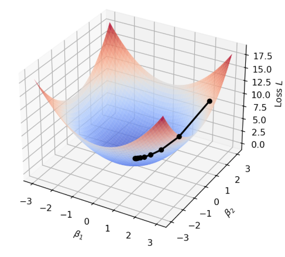

In our [previous tutorial](https://aliceaii.github.io/posts/ml_regression/), we explored the fundamentals of linear and logistic regression. Now we'll dive deeper into the math that powers modern machine learning: gradient descent algorithms and regularization techniques.

This tutorial demonstrates: despite their different purposes—predicting continuous values versus classification probabilities—normal regression and logistic regression share a unified gradient structure. Understanding this connection provides a foundation for comprehending how neural networks learn.

In this post, we will cover: (1) The connection between maximum likelihood and loss functions, (2) Unified gradient descent for regression and classification, (3) Matrix regression and associative memory, and (4) Regularization and piecewise linear models.



::: callout-tip
Before We Begin: The Big Picture

Imagine you're trying to tune a radio to find your favorite station. You turn the dial (adjusting parameters), listen for clarity (measuring error), and keep adjusting until the sound is perfect (minimizing loss).

**Machine learning works the same way:**

1.  We have some "knobs" to turn (parameters $\boldsymbol{\beta}$)
2.  We measure how wrong our predictions are (loss function)
3.  We figure out which direction to turn the knobs (gradient)
4.  We keep adjusting until predictions are good (optimization)

This tutorial shows you exactly how this process works mathematically and reveals a surprising connection between different types of ML models.
:::

## 1. From Likelihood to Loss: A Unified View

### 1.1 The Setup

For both normal and logistic regression, we work with the **linear score**:

$$s_i = \mathbf{x}_i^\top \boldsymbol{\beta}$$

where $\mathbf{x}_i$ is our feature vector and $\boldsymbol{\beta}$ contains the parameters we want to learn.

::: callout-note
Intuition: What is the "Score"?

Think of $s_i$ as a weighted vote. Each feature $x_{ij}$ casts a vote, and the weight $\beta_j$ determines how much that feature's opinion matters.

Example: Predicting if a student will attend graduate school:

-   GPA ($x_1 = 3.8$) with weight $\beta_1 = 2.0$ → contributes $7.6$
-   Research experience ($x_2 = 1$) with weight $\beta_2 = 1.5$ → contributes $1.5$\
-   Total score: $s = 7.6 + 1.5 = 9.1$

A higher score means "more evidence pointing toward yes." The question is: how do we find the best weights $\boldsymbol{\beta}$?
:::

The answer lies in **Maximum Likelihood Estimation (MLE)**, we find parameters that make our observed data most probable.

### 1.2 Normal Regression: MLE Leads to Least Squares

#### The Probabilistic

In normal regression, we assume our observations come from a simple story:

$$y_i = s_i + e_i, \quad e_i \sim \mathcal{N}(0, \sigma^2) \text{ i.i.d.}$$
::: callout-note
Intuition: The "True Value Plus Noise" Model

Imagine you're measuring people's heights with a slightly wobbly ruler:

-   **True height** (what we're trying to predict): $s_i$
-   **Measurement noise** (random error): $e_i$
-   **What we observe**: $y_i = s_i + e_i$

The noise $e_i$ follows a bell curve (normal distribution) centered at zero—sometimes we measure a bit high, sometimes a bit low, but on average we're correct. This is why it's called "normal" regression. 
:::

This means each observation follows a normal distribution centered at our prediction:

$$P_\beta(y_i \mid \mathbf{x}_i) \sim \mathcal{N}(s_i, \sigma^2)$$

Recall the probability density function for a normal distribution:

$$P(y) = \frac{1}{\sqrt{2\pi\sigma^2}} \exp\left(-\frac{(y-\mu)^2}{2\sigma^2}\right)$$

```{python}
#| label: fig-normal-intuition
#| fig-cap: "Normal regression assumes observations scatter around the true line with Gaussian noise."

import numpy as np
import matplotlib.pyplot as plt
from scipy import stats

np.random.seed(42)

# True relationship
x = np.linspace(0, 10, 100)
true_line = 2 + 0.5 * x

# Generate noisy observations
x_obs = np.random.uniform(1, 9, 15)
y_obs = 2 + 0.5 * x_obs + np.random.normal(0, 0.8, len(x_obs))

fig, axes = plt.subplots(1, 2, figsize=(8.5, 4)) # Slightly wider for better spacing

# Left plot: scatter with true line
axes[0].scatter(x_obs, y_obs, s=80, color='steelblue', alpha=0.5, zorder=3, label='Observed data')
axes[0].plot(x, true_line, 'r-', linewidth=1.5, label='True relationship: $s_i = 2 + 0.5x_i$')

for xi, yi in zip(x_obs, y_obs):
    si = 2 + 0.5 * xi
    axes[0].plot([xi, xi], [si, yi], 'g--', alpha=0.3, linewidth=1)

axes[0].set_xlabel('$x$', fontsize=12)
axes[0].set_ylabel('$y$', fontsize=12)
axes[0].set_title('Observations = Prediction + Noise', fontsize=13)
# Adjusted: Moved to upper left and decreased font size
axes[0].legend(loc='upper left', fontsize='small', framealpha=0.7)
axes[0].grid(True, alpha=0.3)

# Right plot: distribution of errors
errors = y_obs - (2 + 0.5 * x_obs)
x_norm = np.linspace(-3, 3, 100)
y_norm = stats.norm.pdf(x_norm, 0, 0.8)

axes[1].hist(errors, bins=8, density=True, alpha=0.5, color='steelblue', edgecolor='navy', label='Observed errors')
axes[1].plot(x_norm, y_norm, 'r-', linewidth=1.5, label='Normal distribution $N(0, \\sigma^2)$')
axes[1].axvline(x=0, color='gray', linestyle='--', alpha=0.5)

axes[1].set_xlabel('Error $e_i = y_i - s_i$', fontsize=10)
axes[1].set_ylabel('Density', fontsize=10)
axes[1].set_title('Errors Follow a Bell Curve', fontsize=13)
axes[1].legend(loc='upper right', fontsize='small', framealpha=0.7)
axes[1].grid(True, alpha=0.3)

plt.tight_layout()
plt.show()
```

#### Building the Log-Likelihood

**The key question:** Given our data, which $\boldsymbol{\beta}$ makes what we observed most probable?

The log-likelihood sums the log-probabilities across all observations:

$$J(\boldsymbol{\beta}) = \sum_{i=1}^{n} \log P_\beta(y_i | \mathbf{x}_i) = -\sum_{i=1}^{n} \left[ \frac{(y_i - s_i)^2}{2\sigma^2} + \log \sqrt{2\pi\sigma^2} \right]$$

Simplifying:

$$J(\boldsymbol{\beta}) = -\frac{1}{2\sigma^2} \sum_{i=1}^{n} (y_i - s_i)^2 + n \log \frac{1}{\sqrt{2\pi\sigma^2}}$$

#### The Punchline

Since $\sigma^2$ and the constant term don't depend on $\boldsymbol{\beta}$:

$$\hat{\boldsymbol{\beta}}_{\text{MLE}} = \arg\max_{\boldsymbol{\beta}} J(\boldsymbol{\beta}) = \arg\min_{\boldsymbol{\beta}} \frac{1}{2} \sum_{i=1}^{n} (y_i - s_i)^2$$


::: callout-note
The Least Squares Connection

Maximizing the Gaussian log-likelihood is equivalent to minimizing the least squares loss:

$$L(\boldsymbol{\beta}) = \frac{1}{2} \sum_{i=1}^{n} (y_i - s_i)^2$$

If you believe your data has bell-curve noise, then finding the "most likely" parameters is the same as finding parameters that minimize squared errors. 
:::

### 1.3 Logistic Regression: Deriving the Log-Likelihood

For binary classification where $y_i \in \{0, 1\}$, we need a different approach, we can't assume bell-curve noise around 0 and 1.

#### The Sigmoid: Turning Scores into Probabilities

::: callout-note
Imagine a meter that shows your confidence in a "yes" answer:

-   Score very negative ($s = -5$): needle points to 0% confident
-   Score zero ($s = 0$): needle at 50% (coin flip)
-   Score very positive ($s = +5$): needle points to 100% confident

The **sigmoid function** smoothly converts any score into a probability:

$$p_i = \text{sigmoid}(s_i) = \frac{e^{s_i}}{1 + e^{s_i}} = \frac{1}{1 + e^{-s_i}}$$
:::

```{python}
#| label: fig-sigmoid
#| fig-cap: "The sigmoid function transforms any real number into a probability between 0 and 1."

import numpy as np
import matplotlib.pyplot as plt

def sigmoid(s):
    return 1 / (1 + np.exp(-s))

s = np.linspace(-6, 6, 100)
p = sigmoid(s)

fig, axes = plt.subplots(1, 2, figsize=(8.5, 4))

# Left: Basic sigmoid
axes[0].plot(s, p, 'b-', linewidth=2.5, label='sigmoid(s)')
axes[0].axhline(y=0.5, color='gray', linestyle='--', alpha=0.7, label='Decision boundary (p=0.5)')
axes[0].axvline(x=0, color='gray', linestyle='--', alpha=0.7)
axes[0].fill_between(s, p, alpha=0.15, color='blue')

axes[0].annotate('Confident NO\n(p ≈ 0)', xy=(-4, 0.05), fontsize=8, ha='center', color='coral')
axes[0].annotate('Uncertain\n(p = 0.5)', xy=(0, 0.4), xytext=(-1, 0.6), fontsize=8,
            arrowprops=dict(arrowstyle='->', color='gray'), ha='center')
axes[0].annotate('Confident YES\n(p ≈ 1)', xy=(4, 0.85), fontsize=8, ha='center', color='green')

axes[0].set_xlabel('Linear score $s_i = x_i^T\\beta$', fontsize=10)
axes[0].set_ylabel('Probability $p_i$', fontsize=10)
axes[0].set_title('Sigmoid: The "Confidence Meter"', fontsize=10)
axes[0].legend(loc='upper left', fontsize='small')
axes[0].grid(True, alpha=0.3)
axes[0].set_ylim(-0.05, 1.05)

# Right: Interpretation with examples
example_scores = [-3, -1, 0, 1, 3]
example_probs = sigmoid(np.array(example_scores))
colors = plt.cm.RdYlGn(example_probs)

axes[1].barh(range(len(example_scores)), example_probs, color=colors, edgecolor='black', height=0.4)
axes[1].set_yticks(range(len(example_scores)))
axes[1].set_yticklabels([f's = {s}' for s in example_scores])
axes[1].set_xlabel('Probability of "Yes"', fontsize=10)
axes[1].set_title('Examples: Score to Probability', fontsize=10)
axes[1].axvline(x=0.5, color='gray', linestyle='--', alpha=0.7)
for i, (s_val, p_val) in enumerate(zip(example_scores, example_probs)):
    axes[1].text(p_val + 0.02, i, f'{p_val:.2f}', va='center', fontsize=10)
axes[1].set_xlim(0, 1.15)
axes[1].grid(True, alpha=0.3, axis='x')

plt.tight_layout()
plt.show()
```

The class probabilities are:

-   $P(y_i = 1 | s_i) = p_i = \frac{e^{s_i}}{1 + e^{s_i}}$ (probability of "yes")
-   $P(y_i = 0 | s_i) = 1 - p_i = \frac{1}{1 + e^{s_i}}$ (probability of "no")

#### A Unified Formula

We can write the likelihood for any $y_i \in \{0, 1\}$ as:

$$P(y_i | s_i) = \frac{e^{y_i s_i}}{1 + e^{s_i}}$$

::: callout-note
Why Does This Formula Work?
Let's verify by plugging in values:

**When** $y_i = 1$ (actual answer is "yes"): $$P(y_i=1 | s_i) = \frac{e^{1 \cdot s_i}}{1 + e^{s_i}} = \frac{e^{s_i}}{1 + e^{s_i}} = p_i$$
**When** $y_i = 0$ (actual answer is "no"): $$P(y_i=0 | s_i) = \frac{e^{0 \cdot s_i}}{1 + e^{s_i}} = \frac{1}{1 + e^{s_i}} = 1 - p_i$$
:::

**The Log-Likelihood:**

Taking the log and summing across observations:

$$J(\boldsymbol{\beta}) = \sum_{i=1}^{n} \log P(y_i | \mathbf{x}_i, \boldsymbol{\beta}) = \sum_{i=1}^{n} \left[ y_i s_i - \log(1 + e^{s_i}) \right]$$

## 2. The Unified Gradient

### 2.1 Computing the Gradients

::: callout-note
Intuition: What is a Gradient?

Imagine you're blindfolded on a hilly landscape, trying to find the lowest point (minimum loss).

The **gradient** tells you two things: 1. **Which direction** is uphill (steepest increase) 2. **How steep** the hill is.
To minimize, you walk **opposite** to the gradient—that's gradient descent.
:::


```{python}
#| label: fig-gradient-intuition
#| fig-cap: "Gradient descent: like rolling a ball downhill to find the minimum."

import numpy as np
import matplotlib.pyplot as plt
from mpl_toolkits.mplot3d import Axes3D

# Create a simple bowl-shaped loss surface
beta1 = np.linspace(-3, 3, 50)
beta2 = np.linspace(-3, 3, 50)
B1, B2 = np.meshgrid(beta1, beta2)
L = B1**2 + B2**2  # Simple quadratic loss

fig = plt.figure(figsize=(9, 4))

# 3D surface
ax1 = fig.add_subplot(121, projection='3d')
ax1.plot_surface(B1, B2, L, cmap='coolwarm', alpha=0.8, edgecolor='none')
ax1.set_xlabel('$\\beta_1$')
ax1.set_ylabel('$\\beta_2$')
ax1.set_zlabel('Loss $L$')
ax1.set_title('Loss Surface (like a bowl)', fontsize=12)

# Simulate gradient descent path
path_b1 = [2.5]
path_b2 = [2.0]
lr = 0.2
for _ in range(10):
    grad1 = 2 * path_b1[-1]
    grad2 = 2 * path_b2[-1]
    path_b1.append(path_b1[-1] - lr * grad1)
    path_b2.append(path_b2[-1] - lr * grad2)

path_loss = [b1**2 + b2**2 for b1, b2 in zip(path_b1, path_b2)]
ax1.plot(path_b1, path_b2, path_loss, 'ko-', markersize=5, linewidth=2, zorder=5)
ax1.scatter([0], [0], [0], color='gold', s=200, marker='*', zorder=6)

# 2D contour view
ax2 = fig.add_subplot(122)
contour = ax2.contour(B1, B2, L, levels=15, cmap='coolwarm')
ax2.plot(path_b1, path_b2, 'ko-', markersize=8, linewidth=2, label='Gradient descent path')
ax2.scatter([0], [0], color='gold', s=300, marker='*', zorder=5, label='Minimum')
ax2.set_xlabel('$\\beta_1$', fontsize=10)
ax2.set_ylabel('$\\beta_2$', fontsize=10)
ax2.set_title('Top View: Following the Gradient Downhill', fontsize=12)
ax2.legend()
ax2.set_aspect('equal')

# Add gradient arrows
for i in range(0, len(path_b1)-1, 2):
    dx = path_b1[i+1] - path_b1[i]
    dy = path_b2[i+1] - path_b2[i]
    ax2.annotate('', xy=(path_b1[i+1], path_b2[i+1]), xytext=(path_b1[i], path_b2[i]),
                arrowprops=dict(arrowstyle='->', color='black', lw=1.5))

plt.tight_layout()
plt.show()
```


Let's compute gradients for both models using the **chain rule**.

**For Normal Regression (minimizing** $L$):

Define $e_i = y_i - s_i$ (the residual—how much we missed by). Using the chain rule:

$$\frac{\partial L_i}{\partial s_i} = -(y_i - s_i) = -e_i, \quad \frac{\partial s_i}{\partial \boldsymbol{\beta}} = \mathbf{x}_i$$

Therefore: $$\frac{\partial L_i}{\partial \boldsymbol{\beta}} = -\mathbf{x}_i e_i$$

**For Logistic Regression (maximizing** $J$):

Define $e_i = y_i - p_i$ (actual outcome minus predicted probability). The chain rule gives:

$$\frac{\partial J_i}{\partial s_i} = y_i - \frac{e^{s_i}}{1 + e^{s_i}} = y_i - p_i = e_i, \quad \frac{\partial s_i}{\partial \boldsymbol{\beta}} = \mathbf{x}_i$$
Therefore: $$\frac{\partial J_i}{\partial \boldsymbol{\beta}} = \mathbf{x}_i e_i$$

### 2.2 The Unified Update Rule

::: callout-note
The Central Result: Same Formula, Different "Errors"

In both normal and logistic regression, the gradient takes the same form:

$$\nabla = \sum_{i=1}^{n} \mathbf{x}_i e_i$$

where $e_i$ is the "error":

| Model                   | Error Definition  | Interpretation                 |
|------------------------|------------------|------------------------------|
| **Normal regression**   | $e_i = y_i - s_i$ | How far off our prediction is  |
| **Logistic regression** | $e_i = y_i - p_i$ | How far off our probability is |
:::

This leads to the **unified gradient descent algorithm**:

$$\boldsymbol{\beta}^{(t+1)} = \boldsymbol{\beta}^{(t)} + \eta_t \sum_{i=1}^{n} \mathbf{x}_i e_i^{(t)}$$

where $\eta_t$ is the learning rate at step $t$.

::: callout-note
 For each training example, we ask:

1.  **How wrong were we?**  That's $e_i$
2.  **Who's responsible?**  The features $\mathbf{x}_i$ that influenced this prediction

The gradient $\mathbf{x}_i e_i$ says: "Adjust parameters in proportion to both the error and the features that caused it."

- If $e_i > 0$ (we under-predicted), and $x_{ij} > 0$, then increasing $\beta_j$ would have helped 
- If $e_i < 0$ (we over-predicted), and $x_{ij} > 0$, then decreasing $\beta_j$ would have helped 
:::

## 3. Matrix Regression and Associative Memory

### 3.1 Extending to Vector Outputs

::: callout-note
Intuition: Predicting Multiple Things at Once

So far, we've predicted a single number. But what if we want to predict multiple outputs simultaneously?

**Examples:** 

- **Multi-task learning:** Input = student features; Output = (math score, reading score, writing score) 
- **Neural network layers:** Input = previous layer activations; Output = next layer activations

Instead of a weight vector $\boldsymbol{\beta}$, we need a **weight matrix** $\mathbf{W}$.
:::

We now have:

$$\mathbf{s}_i = \mathbf{W} \mathbf{x}_i$$

where:

$$\begin{pmatrix} s_{i1} \\ \vdots \\ s_{ik} \\ \vdots \\ s_{id} \end{pmatrix}_{d \times 1} = \begin{pmatrix} w_{11} & \cdots & w_{1j} & \cdots & w_{1p} \\ \vdots & \ddots & \vdots & \ddots & \vdots \\ w_{k1} & \cdots & w_{kj} & \cdots & w_{kp} \\ \vdots & \ddots & \vdots & \ddots & \vdots \\ w_{d1} & \cdots & w_{dj} & \cdots & w_{dp} \end{pmatrix}_{d \times p} \begin{pmatrix} x_{i1} \\ \vdots \\ x_{ij} \\ \vdots \\ x_{ip} \end{pmatrix}_{p \times 1}$$

::: callout-note
Think of the weight matrix $\mathbf{W}$ as stacking multiple linear regressions:

-   Row 1 of $\mathbf{W}$: weights for predicting output 1
-   Row 2 of $\mathbf{W}$: weights for predicting output 2
-   ... and so on

Each output $s_{ik}$ is just a regular linear combination: $s_{ik} = \sum_j w_{kj} x_{ij}$
:::

The error vector becomes: $$\mathbf{e}_i = \mathbf{y}_i - \mathbf{s}_i = \mathbf{y}_i - \mathbf{W}\mathbf{x}_i$$

### 3.2 Deriving the Matrix Gradient

The loss function extends naturally:

$$L(\mathbf{W}) = \frac{1}{2} \sum_{i=1}^{n} \|\mathbf{e}_i\|^2 = \frac{1}{2} \sum_{i=1}^{n} \sum_{k=1}^{d} e_{ik}^2$$

Computing the partial derivative with respect to $w_{kj}$:

$$\frac{\partial L}{\partial w_{kj}} = \sum_{i=1}^{n} e_{ik} \cdot \frac{\partial e_{ik}}{\partial s_{ik}} \cdot \frac{\partial s_{ik}}{\partial w_{kj}} = -\sum_{i=1}^{n} e_{ik} \cdot x_{ij}$$

In matrix form, this becomescompact:

$$L'(\mathbf{W}) = -\sum_{i=1}^{n} \mathbf{e}_i \mathbf{x}_i^\top$$

::: callout-note
For Matrix Gradient Descent, the update rule generalizes: 
$\mathbf{W}^{(t+1)} = \mathbf{W}^{(t)} + \eta_t \sum_{i=1}^{n} \mathbf{e}_i^{(t)} \mathbf{x}_i^\top, \text{where }\mathbf{e}_i^{(t)} = \mathbf{y}_i - \mathbf{W}^{(t)}\mathbf{x}_i$

**Notice:** The structure is identical to scalar regression. We just replaced: 

- Scalar error $e_i$ to Vector error $\mathbf{e}_i$ 
- Scalar input $x_i$ to Vector input $\mathbf{x}_i$\
- Vector weights $\boldsymbol{\beta}$ to Matrix weights $\mathbf{W}$
:::

### 3.3 Associative Memory: An Application

Consider a special case where the input vectors $\mathbf{x}_i$ are high-dimensional and orthonormal:

$$\langle \mathbf{x}_i, \mathbf{x}_j \rangle = \delta_{ij} = \begin{cases} 1 & \text{if } i = j \\ 0 & \text{if } i \neq j \end{cases}$$

If we construct $\mathbf{W}$ as:

$$\mathbf{W} = \sum_{i=1}^{n} \mathbf{y}_i \mathbf{x}_i^\top$$

Then something happens when we query with $\mathbf{x}_k$:

$$\mathbf{W} \mathbf{x}_k = \left( \sum_{i=1}^{n} \mathbf{y}_i \mathbf{x}_i^\top \right) \mathbf{x}_k = \sum_{i=1}^{n} \mathbf{y}_i (\mathbf{x}_i^\top \mathbf{x}_k) = \sum_{i=1}^{n} \mathbf{y}_i \delta_{ik} = \mathbf{y}_k$$

::: callout-note
Associative Memory: "Content-Addressable" Storage

The matrix $\mathbf{W}$ acts as associative memory: given key $\mathbf{x}_k$, it retrieves the associated value $\mathbf{y}_k$.

Unlike computer memory: 

- Computer: "Give me item at address 42" (location-based) 
- Associative memory: "Give me the item that goes with this pattern" (content-based)
:::


## 4. Regularization: Taming Overparameterization

### 4.1 The Problem: Too Much Flexibility

::: callout-note
More parameters = more flexibility = better fit to training data... but worse predictions on new data

This is called **overfitting**: the model memorizes the training data instead of learning the underlying pattern.
:::

```{python}
#| label: fig-overfitting
#| fig-cap: "Overfitting: too many parameters lets the model memorize noise instead of learning the pattern."

import numpy as np
import matplotlib.pyplot as plt

np.random.seed(42)

# Generate simple data
x = np.linspace(0, 1, 10)
y_true = np.sin(2 * np.pi * x)
y_noisy = y_true + np.random.normal(0, 0.3, len(x))

x_plot = np.linspace(0, 1, 200)

# Change to 2x2 grid and adjust figsize for vertical space
fig, axes = plt.subplots(2, 2, figsize=(8.5, 7))

# Configuration for the four plots
degrees = [1, 3, 6, 9]
titles = ['Underfitting (Degree 1)', 'Good Fit (Degree 3)', 
          'Starting to Overfit (Degree 6)', 'Overfitting (Degree 9)']
colors = ['red', 'green', 'blue', 'orange']

# Flatten axes for easy looping
axes_flat = axes.flatten()

for i, deg in enumerate(degrees):
    ax = axes_flat[i]
    
    # Calculate fit
    coeffs = np.polyfit(x, y_noisy, deg)
    y_fit = np.polyval(coeffs, x_plot)
    
    # Plotting
    ax.scatter(x, y_noisy, s=80, c='steelblue', edgecolors='k', alpha=0.7, zorder=3, label='Training data')
    ax.plot(x_plot, np.sin(2 * np.pi * x_plot), 'k--', linewidth=1.5, alpha=0.5, label='True pattern')
    ax.plot(x_plot, y_fit, color=colors[i], linewidth=2, label=f'Degree {deg} fit')
    
    # Formatting
    ax.set_title(titles[i], fontsize=12)
    ax.set_ylim(-2, 2)
    ax.grid(True, alpha=0.2)
    
    # Smaller legend with transparency
    ax.legend(loc='upper right', fontsize='x-small', framealpha=0.8)

plt.tight_layout()
plt.show()
```

### 4.2 The Piecewise Linear Model

Let's build a flexible model that can capture nonlinear patterns. Given 1D input $x_i^{\text{raw}}$, we create **ReLU-like** (Rectified Linear Unit) features:

$$x_{ij} = \max(0, x_i^{\text{raw}} - a_j)$$
where $(a_1, a_2, \ldots, a_p)$ are equally spaced change points (knots).

::: callout-note
Intuition: Building with LEGO Ramps

Imagine you're building a shape using LEGO pieces, but you only have "ramp" pieces that: 

- Are flat (zero) until some point $a_j$ 
- Then slope upward after that point

Each ramp $\max(0, x - a_j)$ is like a hinge that activates at position $a_j$.

By combining many ramps with different weights, you can approximate any smooth curve—just like building with LEGOs.

To build something complex, you only need to adjust two things for each "ramp":

* **The Starting Point (Bias):** This tells the ramp *where* to wake up on the x-axis. 
* **The Slope (Weight):** This determines *how steep* the ramp climbs or if it goes downward instead of upward.
:::

The model becomes:

$$s_i = f(x_i^{\text{raw}}) = \beta_0 + \sum_{j=1}^{p} x_{ij} \beta_j$$

Each $\beta_j$ controls the **change in slope** at knot $a_j$: 

- Positive $\beta_j$: slope increases (bend upward) - Negative $\beta_j$: slope decreases (bend downward) 
- Zero $\beta_j$: no change (straight through)

```{python}
#| label: fig-relu-approximation
#| fig-cap: "Approximation with ReLU"

import numpy as np
import matplotlib.pyplot as plt
from scipy.interpolate import interp1d

np.random.seed(42)

x_raw = np.linspace(0, 1, 200)
a_points = [0.2, 0.4, 0.6, 0.8]
colors = ['#e41a1c', '#377eb8', '#4daf4a', '#984ea3']

fig, axes = plt.subplots(2, 2, figsize=(8.5, 7))

# Plot 1: Individual basis functions (Top Left)
for j, (a, color) in enumerate(zip(a_points, colors)):
    feature = np.maximum(0, x_raw - a)
    axes[0, 0].plot(x_raw, feature, color=color, linewidth=2, label=f'$\\max(0, x - {a})$')
    axes[0, 0].axvline(x=a, color=color, linestyle='--', alpha=0.3)
    axes[0, 0].scatter([a], [0], color=color, s=60, zorder=5)

axes[0, 0].set_xlabel('$x^{raw}$', fontsize=10)
axes[0, 0].set_ylabel('Feature value', fontsize=10)
axes[0, 0].set_title('Individual "Ramp" Features\n(ReLU activations)', fontsize=12)
axes[0, 0].legend(fontsize='x-small', framealpha=0.7)
axes[0, 0].grid(True, alpha=0.2)

# Plot 2: Weighted combinations (Top Right)
betas = [0.5, -0.8, 0.6, -0.3]
beta_0 = 0.3
combined = np.full_like(x_raw, beta_0)
axes[0, 1].axhline(y=beta_0, color='gray', linestyle=':', alpha=0.5, label=f'$\\beta_0 = {beta_0}$')

for j, (a, beta, color) in enumerate(zip(a_points, betas, colors)):
    contribution = beta * np.maximum(0, x_raw - a)
    axes[0, 1].fill_between(x_raw, combined, combined + contribution, alpha=0.3, color=color,
                         label=f'$\\beta_{j+1}={beta}$')
    combined = combined + contribution

axes[0, 1].plot(x_raw, combined, 'k-', linewidth=2, label='Total Prediction')
axes[0, 1].set_xlabel('$x^{raw}$', fontsize=10)
axes[0, 1].set_title('Combining with Weights\n(Sum of weighted ramps)', fontsize=12)
axes[0, 1].legend(fontsize='x-small', loc='upper left', framealpha=0.7)
axes[0, 1].grid(True, alpha=0.2)

# Plot 3: Low-Resolution Approximation (Bottom Left)
target = np.sin(2 * np.pi * x_raw)
few_knots = [0.25, 0.5, 0.75]
manual_betas = [2.5, -5, 2.5]
approx_low = np.zeros_like(x_raw)
for a, beta in zip(few_knots, manual_betas):
    approx_low += beta * np.maximum(0, x_raw - a)

axes[1, 0].plot(x_raw, target, 'b--', linewidth=1.5, label='Target: sin(2πx)')
axes[1, 0].plot(x_raw, approx_low, 'r-', linewidth=2, label='3-knot approx.')
axes[1, 0].set_xlabel('$x^{raw}$', fontsize=10)
axes[1, 0].set_ylabel('$y$', fontsize=10)
axes[1, 0].set_title('Coarse Approximation\n(Low complexity)', fontsize=12)
axes[1, 0].legend(fontsize='x-small')
axes[1, 0].grid(True, alpha=0.2)

# Plot 4: High-Resolution Approximation (Bottom Right)
# Simulating a denser network (12 knots)
many_knots = np.linspace(0.05, 0.95, 12)
# Linear interpolation mimics what a ReLU network does
f_interp = interp1d(many_knots, np.sin(2 * np.pi * many_knots), kind='linear', fill_value="extrapolate")
approx_high = f_interp(x_raw)

axes[1, 1].plot(x_raw, target, 'b--', linewidth=1.5, label='Target')
axes[1, 1].plot(x_raw, approx_high, 'g-', linewidth=2, label='12-knot approx.')
axes[1, 1].set_xlabel('$x^{raw}$', fontsize=10)
axes[1, 1].set_title('Fine Approximation\n(Higher complexity = Smooth curve)', fontsize=12)
axes[1, 1].legend(fontsize='x-small')
axes[1, 1].grid(True, alpha=0.2)

plt.tight_layout()
plt.show()
```


### 4.3 The Solution: Ridge Regularization (L2 Penalty)

With many knots ($p$ large), our model becomes **overparameterized**. The solution: **penalize large coefficients!**

$$L(\boldsymbol{\beta}) = \underbrace{\sum_{i=1}^{n} (y_i - s_i)^2}_{\text{fit the data}} + \underbrace{\lambda \sum_{j=1}^{p} \beta_j^2}_{\text{keep coefficients small}}$$

::: callout-note
## Intuition: The Simplicity Tax

Think of $\lambda$ as a "tax" on complexity: 

- **Low tax (**$\lambda$ small): Model can use big coefficients freely → wiggly fit 
- **High tax (**$\lambda$ large): Big coefficients are expensive → smoother fit

**In this piecewise linear context:** 

- Each $\beta_j$ controls a "kink" in the curve 
- Penalizing $\beta_j^2$ makes kinks smaller 
- Result: smoother, more gradual curves
:::


**The Role of $\lambda$ (Regularization Strength)**

| $\lambda$ value   | Behavior                        | Risk                    |
|------------------|------------------------------|-----------------------|
| $\lambda = 0$     | No penalty, maximum flexibility | **Overfitting**         |
| $\lambda$ small   | Light penalty, mostly flexible  | Slight regularization   |
| $\lambda$ optimal | Balanced fit and smoothness     | **Best generalization** |
| $\lambda$ large   | Heavy penalty, very smooth      | **Underfitting**        |

Finding the right $\lambda$ is crucial. Typically done via cross-validation.

### 4.4 Gradient Descent with Regularization

The gradient now includes the penalty term:

$$\frac{\partial L}{\partial \beta_j} = -\sum_{i=1}^{n} x_{ij} e_i + \lambda \beta_j$$

This leads to the update rule:

$$\beta_j^{(t+1)} = (1 - \eta_t \lambda) \beta_j^{(t)} + \eta_t \sum_{i=1}^{n} x_{ij} e_i^{(t)}$$

::: callout-note
Intuition: Weight Decay

Notice the factor $(1 - \eta_t \lambda)$ multiplying the old coefficient: 

- This **shrinks** the coefficient toward zero at each step 
- Called "**weight decay**" because weights gradually decay if not reinforced by data 
- If the data doesn't strongly support a feature, its weight fades away

The intercept $\beta_0$ is typically **not penalized** (we don't want to bias the overall mean): $$\beta_0^{(t+1)} = \beta_0^{(t)} + \eta_t \sum_{i=1}^{n} e_i^{(t)}$$
:::

```{python}
#| label: fig-regularization-effect
#| fig-cap: "Effect of regularization: higher λ produces smoother fits but may miss details."

import numpy as np
import matplotlib.pyplot as plt

# Data Generation
def f_true(x):
    return np.sin(2 * np.pi * x)

def generate_data(n, sigma=0.1, seed=42):
    np.random.seed(seed)
    x_raw = np.sort(np.random.uniform(0, 1, n))
    e = np.random.normal(0, sigma, n)
    y = f_true(x_raw) + e
    return x_raw, y

# Feature Construction
def create_features(x_raw, a_points):
    n = len(x_raw)
    p = len(a_points)
    X = np.zeros((n, p))
    for j in range(p):
        X[:, j] = np.maximum(0, x_raw - a_points[j])
    return X

# Gradient Descent with Regularization
def train_model(X, y, lmbda, lr=0.001, epochs=5000):
    n, p = X.shape
    beta = np.zeros(p + 1)
    
    for _ in range(epochs):
        s = beta[0] + X @ beta[1:]
        error = y - s 
        
        # Update beta_0 (no penalty)
        beta[0] += lr * np.sum(error)
        
        # Update beta_j with L2 penalty (weight decay)
        beta[1:] = (1 - lr * lmbda) * beta[1:] + lr * (X.T @ error)
        
    return beta

# Generate data and features
n_samples = 100
x_raw, y_data = generate_data(n_samples, sigma=0.2)
a_points = np.linspace(0, 1, 25)
X_features = create_features(x_raw, a_points)

# Visualization
fig, axes = plt.subplots(2, 2, figsize=(8.5, 7))
lambda_values = [0, 0.1, 5, 20]
titles = [
    '$\\lambda = 0$ (No regularization)\n Overfitting: follows noise',
    '$\\lambda = 0.1$ (Light regularization)\n Mostly good, slight smoothing',
    '$\\lambda = 5$ (Moderate regularization)\n Good balance',
    '$\\lambda = 20$ (Heavy regularization)\n Underfitting: too smooth'
]
colors = ['#e41a1c', '#377eb8', '#4daf4a', '#984ea3']

for ax, lmbda, title, color in zip(axes.flatten(), lambda_values, titles, colors):
    beta_trained = train_model(X_features, y_data, lmbda)
    y_pred = beta_trained[0] + X_features @ beta_trained[1:]
    
    ax.scatter(x_raw, y_data, color='gray', alpha=0.4, s=40, label='Training data')
    ax.plot(x_raw, f_true(x_raw), 'k--', linewidth=2, label='True function', alpha=0.7)
    ax.plot(x_raw, y_pred, color=color, linewidth=2.5, label=f'Fitted model')
    ax.set_xlabel('$x^{raw}$', fontsize=11)
    ax.set_ylabel('$y$', fontsize=11)
    ax.set_title(title, fontsize=11)
    ax.legend(loc='upper right', fontsize=9)
    ax.grid(True, alpha=0.3)
    ax.set_ylim(-1.8, 1.8)

plt.suptitle('The Regularization Spectrum: From Overfitting to Underfitting', fontsize=14, y=1.02)
plt.tight_layout()
plt.show()
```

## 5. Summary: Key Takeaways


| Concept | Mathematical Form | Intuitive Explanation |
|------------------------|------------------------|------------------------|
| **From MLE to Loss** | $\max J(\beta) = \min L(\beta)$ | "Most likely parameters" = "smallest errors" |
| **Unified Gradient** | $\sum_i \mathbf{x}_i e_i$ | Adjust weights by "error × responsible feature" |
| **Matrix Regression** | $\mathbf{W}^+ = \mathbf{W} + \eta \sum \mathbf{e}_i \mathbf{x}_i^\top$ | Same idea, just predicting vectors instead of scalars |
| **Associative Memory** | $\mathbf{W}\mathbf{x}_k = \mathbf{y}_k$ | Store key-value pairs, retrieve value from key |
| **Regularization** | $L + \lambda\|\boldsymbol{\beta}\|^2$ | "Simplicity tax" prevents overfitting |
| **Weight Decay** | $(1-\eta\lambda)\beta$ | Unused features fade away |


---

*This tutorial is based on lecture and homework materials from STATS M276A Pattern Recognition and Machine Learning (UCLA), taught by Professor [Ying Nian Wu](http://www.stat.ucla.edu/~ywu/) in Winter 2026.*


