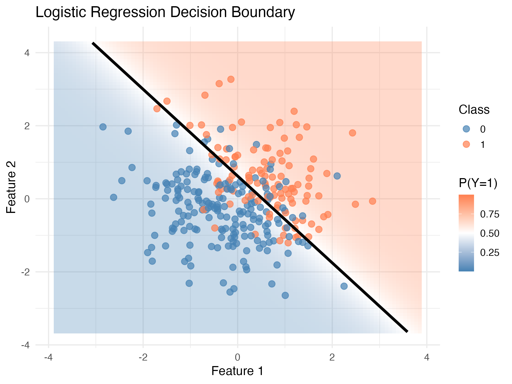
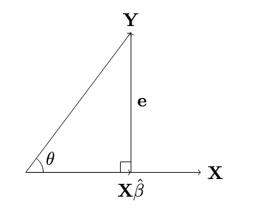
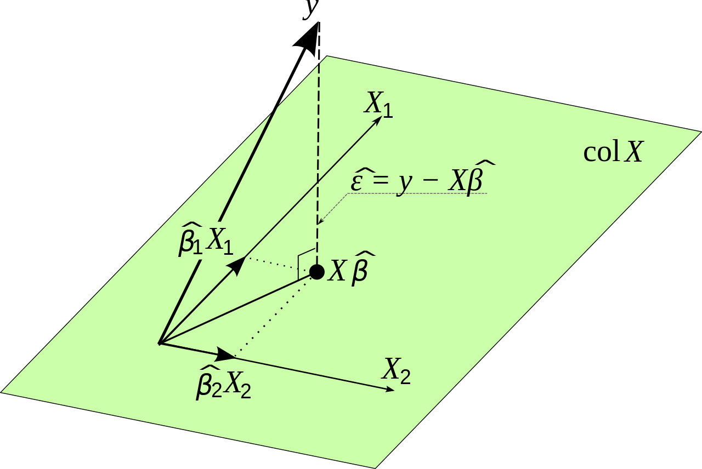

Machine learning begins with a simple yet profound idea: **predicting one thing from another**. This chapter explores how we can build increasingly sophisticated models, starting from the humblest linear regression to more complex piecewise linear models and classification algorithms.

The beauty of regression lies not just in its mathematical elegance, but in how it provides a **unified framework** for understanding modern machine learning. As we'll see, concepts like loss functions, gradient descent, and overparameterization, which are central to deep learning, emerge naturally from classical regression.

In this tutorial, we will cover: (1) Simple Linear Regression, (2) Multiple Linear Regression, and (3) Logistic Regression.



## 1. Simple Linear Regression (One predictor, one outcome)

### 1.1 The Basic Setup

Let's start with the classic father-son height prediction problem. We have data pairs $(x_i, y_i)$ where:

- $x_i$ = father's height
- $y_i$ = son's height

Our goal is to find a linear relationship:

$$s_i = \beta x_i$$
where $s_i$ is our **predicted** son's height and $\beta$ is the parameter we need to learn.

```{r, message=FALSE, warning=FALSE}
# Generate synthetic father-son height data
set.seed(123)
n <- 100
fathers_height <- rnorm(n, mean = 70, sd = 3)
sons_height <- 0.7 * fathers_height + rnorm(n, mean = 10, sd = 2)

height_data <- data.frame(father = fathers_height, son = sons_height)

library(ggplot2)
ggplot(height_data, aes(x = father, y = son)) +
  geom_point(alpha = 0.6, size = 3, color = "steelblue") +
  geom_smooth(method = "lm", se = TRUE, color = "darkred", linewidth = 1.2) +
  labs(title = "Father-Son Height Relationship", x = "Father's Height (inches)", y = "Son's Height (inches)") +
  theme_minimal(base_size = 14)
```

### 1.2 Loss Function and Optimization

To find the best $\beta$, we define a **loss function** that penalizes prediction errors:

$$L(\beta) = \frac{1}{2} \sum_{i=1}^{n} (y_i - x_i\beta)^2$$

If it divided by n, it represents **Mean Squared Error (MSE)**. The factor of $\frac{1}{2}$ simplifies our derivative calculations.

The goal is to minimize the Loss function.

Let's derive Loss function using the **chain rule**:

$$\frac{dL}{d\beta} = \frac{d}{d\beta}\left[\frac{1}{2} \sum_{i=1}^{n} (y_i - x_i\beta)^2\right]$$

For each term in the sum, we have:

- Prediction: $s_i = x_i\beta$
- Error (residual): $e_i = y_i - s_i = y_i - x_i\beta$
- Squared error: $e_i^2 = (y_i - x_i\beta)^2$

Applying the chain rule: 

$$\frac{dL}{d\beta} = \frac{\partial L}{\partial e_i} \cdot \frac{\partial e_i}{\partial s_i} \cdot \frac{\partial s_i}{\partial \beta}$$
**Step 1:** Derivative of loss w.r.t. error:
$$\frac{\partial L}{\partial e_i} = \frac{\partial}{\partial e_i}\left(\frac{1}{2}e_i^2\right) = e_i$$

**Step 2:** Derivative of error w.r.t. prediction:
$$\frac{\partial e_i}{\partial s_i} = \frac{\partial}{\partial s_i}(y_i - s_i) = -1$$

**Step 3:** Derivative of prediction w.r.t. parameter:
$$\frac{\partial s_i}{\partial \beta} = \frac{\partial}{\partial \beta}(x_i\beta) = x_i$$

**Combining the chain rule:**
$$\frac{dL}{d\beta} = \sum_{i=1}^{n} e_i \cdot (-1) \cdot x_i = -\sum_{i=1}^{n} x_i e_i$$

Substituting $e_i = y_i - x_i\beta$:
$$\frac{dL}{d\beta} = -\sum_{i=1}^{n} x_i(y_i - x_i\beta)$$

Expanding:
$$\frac{dL}{d\beta} = -\sum_{i=1}^{n} x_i y_i + \sum_{i=1}^{n} x_i^2\beta = -\sum_{i=1}^{n} x_i y_i + \beta\sum_{i=1}^{n} x_i^2$$

#### Two ways to find the minimum:

**2.2.1. Closed-Form Solution**

Setting $\frac{dL}{d\beta} = 0$ for the minimum:

$$-\sum_{i=1}^{n} x_i y_i + \beta\sum_{i=1}^{n} x_i^2 = 0$$

Solving for $\beta$:
$$\beta\sum_{i=1}^{n} x_i^2 = \sum_{i=1}^{n} x_i y_i$$

$$\hat{\beta} = \frac{\sum_{i=1}^{n} x_i y_i}{\sum_{i=1}^{n} x_i^2}$$

This is the **ordinary least squares (OLS)** estimator.

```{r, message=FALSE, warning=FALSE}
# Closed-form solution
beta_hat <- sum(height_data$father * height_data$son) / sum(height_data$father^2)
cat("Closed-form beta:", beta_hat, "\n")

# Using R's built-in lm() function (no intercept)
model_simple <- lm(son ~ father - 1, data = height_data)
summary(model_simple)
```
**2.2.2. Gradient Descent (Iterative Method)**

**Gradient Descent Algorithm:**

Starting from the gradient:
$$\frac{dL}{d\beta} = -\sum_{i=1}^{n} x_i(y_i - x_i\beta)$$

The **update rule** moves in the direction opposite to the gradient (steepest descent):

$$\beta^{(t+1)} = \beta^{(t)} - \eta \frac{dL}{d\beta}\bigg|_{\beta=\beta^{(t)}}$$

where $\eta > 0$ is the **learning rate**.

Substituting the gradient:
$$\beta^{(t+1)} = \beta^{(t)} - \eta\left(-\sum_{i=1}^{n} x_i(y_i - x_i\beta^{(t)})\right)$$

$$\beta^{(t+1)} = \beta^{(t)} + \eta\sum_{i=1}^{n} x_i(y_i - x_i\beta^{(t)})$$

This can be rewritten as:
$$\beta^{(t+1)} = \beta^{(t)} + \eta\sum_{i=1}^{n} x_i e_i^{(t)}$$

where $e_i^{(t)} = y_i - x_i\beta^{(t)}$ is the error at iteration $t$.

**Intuition:** 

- If $e_i > 0$ (under-prediction), we increase $\beta$ 
- If $e_i < 0$ (over-prediction), we decrease $\beta$
- The magnitude of correction is proportional to both $x_i$ and $e_i$

### 1.3 Geometric Interpretation

In vector notation, $\hat{\beta}X$ represents the **projection** of $Y$ onto $X$. The error vector $e = Y - X\hat{\beta}$ is **perpendicular** to $X$.



::: {.callout-note}
The correlation coefficient equals $\cos(\theta)$.
:::

## 2. Multiple Linear Regression

### 2.1 Extending to Multiple Predictors

Now let's predict a child's height using:

- $x_{i1}$: Father's height
- $x_{i2}$: Mother's height  
- $x_{i3}$: Child's gender (0 = female, 1 = male)

The model becomes:

$$s_i = \beta_0 + x_{i1}\beta_1 + x_{i2}\beta_2 + x_{i3}\beta_3$$
In vector form: $s_i = \mathbf{x}_i^T \boldsymbol{\beta}$

```{r, message=FALSE, warning=FALSE}
# Generate synthetic data for multiple regression
set.seed(456)
n <- 200

child_data <- data.frame(father_height = rnorm(n, mean = 70, sd = 3), mother_height = rnorm(n, mean = 65, sd = 2.5),
                gender = rbinom(n, size = 1, prob = 0.5))  # 0 = female, 1 = male)

child_data$child_height <- 20 + 0.4 * child_data$father_height +  0.4 * child_data$mother_height + 
                          3 * child_data$gender + rnorm(n, mean = 0, sd = 2)

model_multiple <- lm(child_height ~ father_height + mother_height + gender, 
                     data = child_data)
summary(model_multiple)
```

### 2.2 Loss Function

For computational efficiency, we use matrix notation:

$$\mathbf{x}_i = \begin{pmatrix} x_{i1} \\ x_{i2} \\ x_{i3} \end{pmatrix} , \quad \boldsymbol{\beta} = \begin{pmatrix} \beta_1 \\ \beta_2 \\ \beta_3 \end{pmatrix}$$

With model: $s_i = \beta_0 + \mathbf{x}_i^\top \boldsymbol{\beta}$

For even more concise notation, we use extended vectors:

$$\mathbf{x}_i = \begin{pmatrix} 1 \\ x_{i1} \\ x_{i2} \\ x_{i3} \end{pmatrix} , \quad \boldsymbol{\beta} = \begin{pmatrix} \beta_0 \\ \beta_1 \\ \beta_2 \\ \beta_3 \end{pmatrix}$$

This gives us the simplified model: $s_i = \mathbf{x}_i^\top \boldsymbol{\beta}$

The error for each observation is:

$$e_i = y_i - s_i = y_i - \mathbf{x}_i^\top \boldsymbol{\beta}$$

Leading to the loss function:

$$L(\boldsymbol{\beta}) = \frac{1}{2}\sum_{i=1}^n e_i^2 = \frac{1}{2}\sum_{i=1}^n (y_i - \mathbf{x}_i^\top \boldsymbol{\beta})^2$$

Using the chain rule, we calculate partial derivatives:

$$\frac{\partial L}{\partial \beta_k} = \sum_{i=1}^n \frac{\partial L}{\partial e_i} \cdot \frac{\partial e_i}{\partial s_i} \cdot \frac{\partial s_i}{\partial \beta_k} = - \sum_{i=1}^n e_i x_{ik}$$

Setting these derivatives to zero gives us the normal equations:

$$\sum_{i=1}^n e_i x_{ik} = 0, \quad \text{for } k = 0, 1, 2, 3$$

#### Two ways to find the minimum:

**2.2.1. Closed-Form Solution**

$$
\begin{align*}
\sum_{i=1}^n \mathbf{x}_i (y_i - \mathbf{x}_i^\top \boldsymbol{\beta}) &= \mathbf{0} \\
\end{align*}
$$
$$
\begin{align*}
\sum_{i=1}^n \mathbf{x}_i y_i &= \sum_{i=1}^n \mathbf{x}_i \mathbf{x}_i^\top \boldsymbol{\beta} \\
\end{align*}
$$
$$
\begin{align*}
\hat{\boldsymbol{\beta}} &= \left( \sum_{i=1}^n \mathbf{x}_i \mathbf{x}_i^\top \right)^{-1} \sum_{i=1}^n \mathbf{x}_i y_i
\end{align*}
$$


In matrix form, we can write:

$$
\mathbf{X} = \begin{pmatrix} \mathbf{x}_1^\top \\ \mathbf{x}_2^\top \\ \vdots \\ \mathbf{x}_n^\top \end{pmatrix} = (\mathbf{X}_1, ..., \mathbf{X}_j, ..., \mathbf{X}_p) \,, \quad \mathbf{Y} = \begin{pmatrix} y_1 \\ y_2 \\ \vdots \\ y_n \end{pmatrix}
$$

Leading to the normal equations and OLS solution:

$$
\begin{aligned}
\mathbf{X}^\top \mathbf{X} \boldsymbol{\beta} &= \mathbf{X}^\top \mathbf{Y} \\
\hat{\boldsymbol{\beta}} &= (\mathbf{X}^\top \mathbf{X})^{-1} \mathbf{X}^\top \mathbf{Y}
\end{aligned}
$$

For this solution to exist, we require:

* $\mathbf{X}^\top \mathbf{X}$ must be invertible
* Columns of $\mathbf{X}$ must be linearly independent
* No severe multicollinearity among predictors

**2.2.2. Gradient Descent**

The gradient vector takes the form:

$$
L'(\boldsymbol{\beta}) = \begin{pmatrix} \frac{\partial L}{\partial \beta_1} \\ \vdots \\ \frac{\partial L}{\partial \beta_p} \end{pmatrix} = -\sum_{i=1}^n \mathbf{x}_i e_i
$$

$$
\boldsymbol{\beta}^{(t+1)} = \boldsymbol{\beta}^{(t)} + \eta \sum_{i=1}^n \mathbf{x}_i (y_i - \mathbf{x}_i^\top \boldsymbol{\beta}^{(t)})
$$

### 2.3 Geometric Interpretation




| Concept | Description | Child Height Context |
|-------------|---------------|----------------------|
| **Target Vector ($y$)** | The actual observed data. | The **actual measured height** of the child. |
| **Feature Vectors ($X_n$)** | The predictors defining the "floor". | Father's height, Mother's height, and Gender. |
| **The Plane ($\text{col } X$)** | The limit of what the model can predict. | All possible heights explainable by these three factors. |
| **Predicted Point ($X\hat{\beta}$)** | The "shadow" projected onto the plane. | The model’s **best guess** for the child's height. |
| **Residual Error ($\hat{\epsilon}$)** | The vertical distance from plane to $y$. | Factors not in the model (nutrition, sleep, etc.). |


## 3. Logistic Regression

### 3.1 From Regression to Classification

So far we've predicted continuous values. What about **classification**—predicting discrete categories?

**New research question:** Can we predict whether a student will pursue a STEM graduate program based on their undergraduate experiences?

**Logistic regression** adapts linear regression for binary outcomes (yes/no, 0/1) using the **sigmoid function**.

For each observation, we compute a **linear score**:

$$s_i = \mathbf{x}_i^T \boldsymbol{\beta}$$
Then transform it to a probability using the sigmoid:

$$p_i = \text{sigmoid}(s_i) = \frac{e^{s_i}}{1 + e^{s_i}} = \frac{1}{1 + e^{-s_i}}$$

This gives us class probabilities:

-   $P(y_i = 1 | s_i) = p_i = \frac{e^{s_i}}{1 + e^{s_i}}$
-   $P(y_i = 0 | s_i) = 1 - p_i = \frac{1}{1 + e^{s_i}}$

```{r, message=FALSE, warning=FALSE, echo = FALSE}
s <- seq(-6, 6, length.out = 200)
sigmoid <- function(s) 1 / (1 + exp(-s))

ggplot(data.frame(s = s, p = sigmoid(s)), aes(x = s, y = p)) +
  geom_line(color = "darkblue", linewidth = 1.5) +
  geom_hline(yintercept = 0.5, linetype = "dashed", color = "gray50") +
  geom_vline(xintercept = 0, linetype = "dashed", color = "gray50") +
  annotate("text", x = 3, y = 0.85, label = "p → 1 as s → ∞", size = 4) +
  annotate("text", x = -3, y = 0.15, label = "p → 0 as s → -∞", size = 4) +
  labs(
    title = "The Sigmoid Function",
    subtitle = "Transforms any real number to a probability between 0 and 1",
    x = expression(s[i] ~ "(linear score)"),
    y = expression(p[i] ~ "(probability)")
  ) +
  theme_minimal(base_size = 14)
```

**Key properties of the sigmoid:**

1.  **Range:** $p_i \in (0, 1)$ for all $s_i \in \mathbb{R}$ (valid probability)
2.  **Symmetry:** $\text{sigmoid}(-s_i) = 1 - \text{sigmoid}(s_i)$
3.  **Decision boundary:** When $s_i = 0$, $p_i = 0.5$
4.  **Derivative:** $\frac{dp_i}{ds_i} = p_i(1 - p_i)$

::: callout-note
**The Logit Transformation:**
The inverse of the sigmoid is the **logit** function: $$s_i = \log\left(\frac{p_i}{1 - p_i}\right) = \text{logit}(p_i)$$ This is why logistic regression is sometimes called "logit regression."
:::

### 3.2 Likelihood and Gradients

#### 3.2.1 Maximum Likelihood Estimation

For classification, we use **cross-entropy loss** (negative log-likelihood) instead of squared error.

**Why not squared error?** Squared error works poorly for probabilities—it doesn't penalize confident wrong predictions enough.

**The Likelihood for a Single Observation:**

A key insight is that we can write the likelihood compactly as:

$$p(y_i | s_i) = \frac{e^{y_i s_i}}{1 + e^{s_i}}$$

This formula works for both $y_i = 0$ and $y_i = 1$. Let's verify:

-   When $y_i = 1$: $\frac{e^{s_i}}{1 + e^{s_i}} = p_i$ ✓
-   When $y_i = 0$: $\frac{e^0}{1 + e^{s_i}} = \frac{1}{1 + e^{s_i}} = 1 - p_i$ ✓

**Taking the log:**

$$\log p(y_i | s_i) = y_i s_i - \log(1 + e^{s_i})$$

**Log-likelihood for all observations:**

$$\mathcal{L}(\boldsymbol{\beta}) = \sum_{i=1}^{n} \left[y_i s_i - \log(1 + e^{s_i})\right]$$

**Cross-entropy loss** (negative log-likelihood):

$$L(\boldsymbol{\beta}) = -\mathcal{L}(\boldsymbol{\beta}) = -\sum_{i=1}^{n} \left[y_i s_i - \log(1 + e^{s_i})\right]$$

Or equivalently, in the more familiar form:

$$L(\boldsymbol{\beta}) = -\sum_{i=1}^{n} [y_i \log p_i + (1-y_i)\log(1-p_i)]$$

::: callout-note
**Intuition for Cross-Entropy:**

-   If $y_i = 1$ and $p_i \approx 1$: loss $\approx 0$ (correct, confident)
-   If $y_i = 1$ and $p_i \approx 0$: loss $\to \infty$ (wrong, confident—heavily penalized!)
-   Same logic for $y_i = 0$
:::

#### 3.2.2 The Gradient

The gradients have elegant forms that connect directly to linear regression.

**Derivative with respect to** $s_i$:

$$\frac{\partial \log p(y_i | s_i)}{\partial s_i} = y_i - p_i$$

**Derivative with respect to** $\beta_k$:

$$\frac{\partial L}{\partial \beta_k} = \sum_{i=1}^{n} (y_i - p_i) \cdot x_{ik}$$

**Vector form:**

$$\nabla L(\boldsymbol{\beta}) = -\sum_{i=1}^{n} \mathbf{x}_i(y_i - p_i)$$

where $p_i = \text{sigmoid}(s_i) = \text{sigmoid}(\mathbf{x}_i^T\boldsymbol{\beta})$.

::: callout-tip
**Connection to Linear Regression Through Error Terms:**

Both regression types share the same gradient form! Define the "error" as:

-   **Linear regression:** $e_i = y_i - s_i$ (actual minus linear prediction)
-   **Logistic regression:** $e_i = y_i - p_i$ (actual minus probability)

Both have the gradient form: $$\nabla L(\boldsymbol{\beta}) = -\sum_{i=1}^{n} \mathbf{x}_i \cdot e_i$$

This allows similar optimization techniques for both!
:::

### 3.3 R demo 

#### 3.3.1 Creating Classification Data

```{r, message=FALSE, warning=FALSE}
set.seed(2025)
n <- 300

grad_data <- data.frame(senior_identity = rnorm(n, mean = 3.5, sd = 0.8),
  research_experiences = rpois(n, lambda = 2))

grad_data$senior_identity <- pmax(pmin(grad_data$senior_identity, 5), 1)

# Create probability of STEM grad enrollment
# Higher identity and more research - higher probability
linear_combination <- -4 + 0.8 * grad_data$senior_identity + 0.5 * grad_data$research_experiences
prob <- sigmoid(linear_combination)
grad_data$stem_grad <- rbinom(n, size = 1, prob = prob)
grad_data$stem_grad_factor <- factor(grad_data$stem_grad, labels = c("No", "Yes"))

ggplot(grad_data, aes(x = senior_identity, y = research_experiences, color = stem_grad_factor)) +
  geom_point(size = 3, alpha = 0.6) +
  scale_color_manual(values = c("steelblue", "coral"), name = "STEM Grad Program") +
  labs(title = "Predicting STEM Graduate Program Enrollment",
    x = "Senior Year Science Identity",
    y = "Number of Research Experiences") +
  theme_minimal(base_size = 14)
```

#### 3.3.2 Implementing Logistic Regression

```{r, message=FALSE, warning=FALSE}
model_glm <- glm(stem_grad ~ senior_identity + research_experiences, 
                 data = grad_data, family = binomial)
print(round(coef(model_glm), 4))
```


#### 3.3.3 The Decision Boundary

```{r, message=FALSE, warning=FALSE}
grid_resolution <- 100
x1_grid <- seq(1, 5, length.out = grid_resolution)
x2_grid <- seq(0, max(grad_data$research_experiences) + 1, length.out = grid_resolution)

grid_points <- expand.grid(senior_identity = x1_grid, research_experiences = x2_grid)

# Predict probabilities using glm model
grid_probs <- predict(model_glm, newdata = grid_points, type = "response")
grid_points$prob <- grid_probs

ggplot() +
  geom_tile(data = grid_points, 
            aes(x = senior_identity, y = research_experiences, fill = prob), 
            alpha = 0.4) +
  geom_point(data = grad_data, 
             aes(x = senior_identity, y = research_experiences, color = stem_grad_factor), 
             size = 3, alpha = 0.7) +
  scale_fill_gradient2(low = "steelblue", mid = "white", high = "coral", 
                       midpoint = 0.5, name = "P(STEM Grad)") +
  scale_color_manual(values = c("steelblue", "coral"), name = "Enrolled") +
  geom_contour(data = grid_points, 
               aes(x = senior_identity, y = research_experiences, z = prob), 
               breaks = 0.5, color = "black", linewidth = 1.5) +
  labs(
    title = "Logistic Regression Decision Boundary",
    subtitle = "Black line: 50% probability threshold",
    x = "Senior Year Science Identity",
    y = "Number of Research Experiences"
  ) +
  theme_minimal(base_size = 14)
```

## 4. Summary: The ML Roadmap

We've journeyed from simple to increasingly sophisticated models:

| Concept | Key Insight | Why It Matters |
|------------------|------------------------|------------------------------|
| **Linear Regression** | Minimize MSE via gradient descent or closed form | Foundation for all optimization |
| **Loss Functions** | Quantify prediction error | Central to all ML training |
| **Gradient Descent** | Iteratively minimize loss | Works when closed-form doesn't exist |
| **Multiple Regression** | Matrix operations scale to many features | Basis for neural network layers |
| **Logistic Regression** | Sigmoid transforms linear → probability | Building block for classification |
| **Cross-Entropy Loss** | Proper loss for classification | Standard in deep learning |

::: callout-note
**Three Key Principles in ML:**

1.  **Everything is optimization**: Find parameters that minimize a loss function
2.  **Gradients guide learning**: Derivatives tell us how to improve
3.  **The form is universal**: gradient = $-\sum$ (input × error)
:::

---

*This tutorial is based on lecture materials from STATS M276A Pattern Recognition and Machine Learning (UCLA), taught by Professor [Ying Nian Wu](http://www.stat.ucla.edu/~ywu/) in Winter 2026.*


