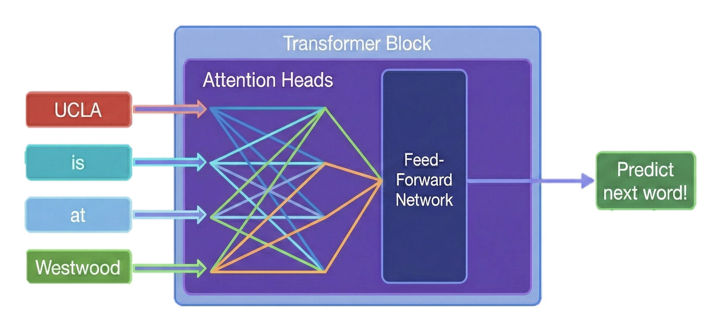

In our [previous tutorial](https://aliceaii.github.io/posts/ml_gradient/), we explored gradient descent and regularization. Now we're going to introduce one of the most exciting frontiers: teaching machines to understand language.

This tutorial covers the journey from simple sequence models to the powerful Transformer architecture behind ChatGPT. We'll see how machines learn to predict the next word, why some designs struggle with long sentences, and how a clever trick called the **residual connection** changed everything.

In this post, we will cover:

-   Recurrent Neural Networks (RNNs) and why they struggle with long sequences
-   The gradient vanishing problem and how residual connections save the day
-   LSTMs — a smarter kind of memory, with a full text generation pipeline
-   The Transformer and GPT — the architecture behind modern AI, and (5) A code walkthrough of Karpathy's nanoGPT.



::: callout-tip
## Before We Begin: The Big Picture

Imagine you're reading a sentence: \*\*"UCLA is at \_\_\_"\*\*

Your brain instantly fills in something like "Westwood" because you *remember* earlier words and *know* facts about the world. Teaching a machine to do this requires two abilities:

1.  **Memory of context:** "I just read 'UCLA' and 'is at' — those words matter for what comes next"
2.  **Knowledge of facts:** "UCLA is located in Westwood" — stored from past learning

This tutorial shows you how neural networks develop both abilities, starting from the simplest approach and building up to the architecture powering today's AI assistants.
:::

## 1. Recurrent Neural Networks (RNN): Teaching Machines to Remember

### 1.1 The Challenge of Sequences

In our previous tutorials, every input was treated independently — each data point stood on its own. But language doesn't work that way. The meaning of a word depends on what came before it.

Consider: "The bank was steep" vs. "The bank was closed." The word "bank" means completely different things depending on context!

::: callout-note
## Analogy: The Forgetful vs. Attentive Note-Taker

Imagine two students in a lecture:

-   **Student A (Feedforward Network):** Writes each sentence on a separate sticky note, then throws away all previous notes before writing the next one. They can never connect ideas across sentences.
-   **Student B (Recurrent Network):** Keeps a running summary in a notebook. After each sentence, they update their summary to include the new information. Their understanding *accumulates* over time.

An RNN is like Student B — it maintains a **hidden state** $h_t$ that serves as a running summary of everything it has seen so far.
:::

### 1.2 The RNN Formula

The core idea of an RNN is beautifully simple. At each time step $t$, the network takes two inputs: the current word $x_t$ and its previous summary $h_{t-1}$, then produces an updated summary $h_t$:

$$h_t = \tanh(W_{\text{recurrent}} \cdot h_{t-1} + W_{\text{embed}} \cdot x_t)$$

Let's unpack this:

-   $x_t$: the current word (as a number or vector)
-   $h_{t-1}$: the "memory" from all previous words
-   $W_{\text{embed}}$: weights that process the new word
-   $W_{\text{recurrent}}$: weights that process the old memory
-   $\tanh$: a squishing function that keeps values between $-1$ and $1$

::: callout-note
## Why tanh? The "Volume Knob" Analogy

Think of $\tanh$ as a volume knob that prevents signals from getting too loud or too quiet. No matter how large the input, the output is always between $-1$ and $+1$. This keeps the network stable — without it, numbers could explode to infinity!
:::

### 1.3 Walking Through "UCLA is at Westwood"

Let's trace how an RNN processes our example sentence, one word at a time. We'll treat all values as scalars (single numbers) for simplicity:

```{python}
#| label: fig-rnn-walkthrough
#| fig-cap: "An RNN processes words one at a time, updating its hidden state at each step."

import numpy as np
import matplotlib.pyplot as plt
import matplotlib.patches as mpatches

fig, ax = plt.subplots(1, 1, figsize=(8, 4))

words = ["UCLA", "is", "at", "→ Westwood"]
colors = ['#FF6B6B', '#4ECDC4', '#45B7D1', '#96CEB4']

for i, (word, color) in enumerate(zip(words, colors)):
    x_pos = i * 2.2
    
    # Hidden state box
    rect = mpatches.FancyBboxPatch((x_pos, 1.0), 1.4, 0.8, 
                                     boxstyle="round,pad=0.1", 
                                     facecolor=color, alpha=0.3, edgecolor=color, linewidth=2)
    ax.add_patch(rect)
    ax.text(x_pos + 0.7, 1.4, f'$h_{i+1}$', ha='center', va='center', fontsize=14, fontweight='bold')
    
    # Word label below
    ax.text(x_pos + 0.7, 0.3, word, ha='center', va='center', fontsize=13, 
            fontweight='bold', color=color,
            bbox=dict(boxstyle='round,pad=0.3', facecolor='white', edgecolor=color, linewidth=1.5))
    
    # Arrow from word to hidden state
    ax.annotate('', xy=(x_pos + 0.7, 1.0), xytext=(x_pos + 0.7, 0.6),
               arrowprops=dict(arrowstyle='->', color=color, lw=1.5))
    
    # Arrow between hidden states
    if i < 3:
        ax.annotate('', xy=((i+1)*2.2, 1.4), xytext=(x_pos + 1.4, 1.4),
                   arrowprops=dict(arrowstyle='->', color='gray', lw=2))

# Annotations
ax.text(0.7, 2.2, '"UCLA"\nstored', ha='center', fontsize=8, color='#FF6B6B', style='italic')
ax.text(2.9, 2.2, '"UCLA is"\nstored', ha='center', fontsize=8, color='#4ECDC4', style='italic')
ax.text(5.1, 2.2, '"UCLA is at"\nstored', ha='center', fontsize=8, color='#45B7D1', style='italic')
ax.text(7.3, 2.2, 'Predict next\nword!', ha='center', fontsize=8, color='#96CEB4', style='italic')

ax.set_xlim(-0.5, 9)
ax.set_ylim(-0.2, 2.7)
ax.axis('off')
ax.set_title('RNN: Processing Words One at a Time', fontsize=14, fontweight='bold')
plt.tight_layout()
plt.show()
```

The final hidden state $h_3$ (after reading "UCLA is at") contains a compressed summary of the entire sentence so far. To predict the next word, we pass it through an **unembedding layer**:

$$s = W_{\text{unembed}} \cdot h_3$$ $$p(\text{next word}) = \text{softmax}(s)$$

If the model has learned well, the probability of "Westwood" should be highest.

## 2. The Gradient Vanishing Problem: Why RNNs Forget

### 2.1 The Problem

RNNs sound great in theory. But in practice, they have a fatal flaw: **they struggle to remember things from far back in the sequence**. By the time the network has processed 50 words, the information from word #1 has been "squished" through so many $\tanh$ operations that it's almost completely gone.

This is called the **gradient vanishing problem**.

::: callout-note
## Analogy: The Telephone Game

Remember the telephone game? One person whispers a message, and it gets passed from person to person. By the time it reaches the 10th person, the message is completely garbled.

RNNs have the same problem. Each time step is like one person in the chain. The "message" (gradient signal) gets weaker and weaker as it travels backward through time during training.
:::

### 2.2 The Math: Why Gradients Vanish

Let's see this mathematically. We want to compute how the loss $J$ changes with respect to the earliest hidden state $h_1$. Using the chain rule, we work backwards:

**Starting point:** We first compute $\delta_3 = \frac{\partial J}{\partial h_3}$ from the loss function.

**Step 1: From** $h_3$ back to $h_2$

Since $h_3 = \tanh(W_{\text{recurrent}} \cdot h_2 + W_{\text{embed}} \cdot x_3)$, the derivative is: $$\frac{\partial h_3}{\partial h_2} = (1 - h_3^2) \cdot W_{\text{recurrent}}$$

So: $\frac{\partial J}{\partial h_2} = \delta_3 \cdot (1 - h_3^2) \cdot W_{\text{recurrent}}$

**Step 2: From** $h_2$ back to $h_1$

Similarly: $\frac{\partial J}{\partial h_1} = \frac{\partial J}{\partial h_2} \cdot (1 - h_2^2) \cdot W_{\text{recurrent}}$

**The full gradient:** $$\frac{\partial J}{\partial h_1} = \delta_3 \cdot \underbrace{(1 - h_3^2)}_{\leq 1} \cdot W_{\text{recurrent}} \cdot \underbrace{(1 - h_2^2)}_{\leq 1} \cdot W_{\text{recurrent}}$$

::: callout-important
## Why This Vanishes

Each factor $(1 - h_t^2)$ is the derivative of $\tanh$, which is **always** between 0 and 1. If $|W_{\text{recurrent}}| < 1$ too, then each step *multiplies* the gradient by a number less than 1.

After $T$ time steps, the gradient scales like: $$\text{gradient} \propto \prod_{t=2}^{T} \underbrace{(1 - h_t^2) \cdot W_{\text{recurrent}}}_{< 1}$$

This is like multiplying $0.5 \times 0.5 \times 0.5 \times \ldots$ — it shrinks exponentially fast.

For a sequence of 100 words, the gradient from the first word is essentially **zero** by the time it reaches the training update.
:::

### 2.3 The Fix: Residual Connections (The Gradient Highway)

What if we add a simple shortcut? Instead of completely rewriting the hidden state, we **add** the new information to the old state:

$$h_t = h_{t-1} + \tanh(W_{\text{recurrent}} \cdot h_{t-1} + W_{\text{embed}} \cdot x_t)$$

Notice the $h_{t-1} +$ at the beginning. This tiny change has a profound effect.

**The new gradient:** $$\frac{\partial h_3}{\partial h_2} = 1 + (1 - h_3'^2) \cdot W_{\text{recurrent}}$$

The critical difference is that **"**$+1$" term. Now the full gradient becomes:

$$\frac{\partial J}{\partial h_1} = \delta_3 \cdot \underbrace{[1 + (1 - h_3'^2) \cdot W_{\text{recurrent}}]}_{\text{always} \geq 1 \text{ if } W > 0} \cdot \underbrace{[1 + (1 - h_2'^2) \cdot W_{\text{recurrent}}]}_{\text{always} \geq 1 \text{ if } W > 0}$$

::: callout-tip
## The "Gradient Highway" Analogy

Think of the residual connection as building a **highway** alongside a winding country road:

-   **Without residual (country road only):** The gradient signal must pass through every $\tanh$ bottleneck. It gets weaker at every turn.
-   **With residual (highway + country road):** Even if the $\tanh$ path weakens the signal, there's always a direct highway ($+1$ term) that lets information flow straight through.

The gradient can *always* take the highway, so it never vanishes to zero.
:::

```{python}
#| label: fig-gradient-vanishing
#| fig-cap: "Residual connections prevent gradients from vanishing by providing a direct path for information flow."

import numpy as np
import matplotlib.pyplot as plt

fig, axes = plt.subplots(1, 2, figsize=(8, 4))

# Simulate gradient magnitudes over time steps
T = 20
time_steps = np.arange(1, T + 1)

# Vanilla RNN: gradient decays exponentially
W_val = 0.8
tanh_deriv = 0.6  # typical value of (1 - h^2)
vanilla_grad = np.array([(tanh_deriv * W_val) ** t for t in range(T)])

# Residual RNN: gradient stays strong
residual_factor = 1 + tanh_deriv * W_val
residual_grad = np.array([residual_factor ** 0 for t in range(T)])  # stays ~1
# More realistic: slight growth/maintenance
residual_grad_realistic = np.array([min(1.0, 0.95 + 0.05 * np.random.randn()) for t in range(T)])
residual_grad_realistic = np.clip(np.cumprod(np.ones(T) * 0.98 + 0.04 * np.random.randn(T)), 0.3, 1.5)

np.random.seed(42)
residual_grad_realistic = np.ones(T) * 0.95 + np.random.uniform(-0.1, 0.1, T)
residual_grad_realistic = np.clip(residual_grad_realistic, 0.5, 1.2)

# Left plot: Vanilla RNN
axes[0].bar(time_steps, vanilla_grad, color='#FF6B6B', alpha=0.7, edgecolor='#CC4444')
axes[0].set_xlabel('Time Steps Back', fontsize=11)
axes[0].set_ylabel('Gradient Magnitude', fontsize=11)
axes[0].set_title('Vanilla RNN\n(Gradient Vanishes)', fontsize=12, color='#CC4444')
axes[0].set_ylim(0, 1.1)
axes[0].axhline(y=0.01, color='gray', linestyle='--', alpha=0.5, label='Effectively zero')
axes[0].legend(fontsize='small')
axes[0].grid(True, alpha=0.2)

# Right plot: Residual RNN
axes[1].bar(time_steps, residual_grad_realistic, color='#4ECDC4', alpha=0.7, edgecolor='#2EA8A0')
axes[1].set_xlabel('Time Steps Back', fontsize=11)
axes[1].set_ylabel('Gradient Magnitude', fontsize=11)
axes[1].set_title('Residual RNN\n(Gradient Survives)', fontsize=12, color='#2EA8A0')
axes[1].set_ylim(0, 1.5)
axes[1].grid(True, alpha=0.2)

plt.tight_layout()
plt.show()
```

### 2.4 The Sequential Bottleneck

One important limitation of RNNs — whether vanilla or residual — is that backpropagation through time is **inherently sequential**:

1.  First, we must compute $\frac{\partial J}{\partial h_3}$ (from the loss).
2.  Only *then* can we compute $\frac{\partial J}{\partial h_2}$ (because it depends on $\frac{\partial J}{\partial h_3}$).
3.  Only *then* can we compute $\frac{\partial J}{\partial h_1}$ (because it depends on $\frac{\partial J}{\partial h_2}$).

::: callout-note
## Why This Matters

This sequential dependency means RNN training **cannot be parallelized** across time steps. For a sequence of 1,000 words, we need 1,000 sequential gradient steps — no shortcuts. This makes RNNs slow to train on long sequences.

As we'll see in Section 4, the Transformer architecture elegantly solves this problem.
:::

## 3. LSTM: The Smart Notebook

### 3.1 From Simple Memory to Gated Memory

The vanilla RNN's memory is like a chalkboard that gets completely overwritten at every step. What if we could be *selective* about what to remember and what to forget?

That's the idea behind the **Long Short-Term Memory (LSTM)** network. Instead of one simple hidden state, the LSTM maintains a *cell state* $C_t$ — think of it as a carefully curated notebook with **gates** that control what goes in and what comes out.

::: callout-note
## Analogy: The Smart Notebook with Sticky Flags

Imagine a student with a special notebook system:

-   **Forget Gate** (red sticky flag): "Should I erase this old note?" — decides what past information to throw away
-   **Input Gate** (green sticky flag): "Should I write this new thing down?" — decides what new information to save
-   **Output Gate** (blue sticky flag): "Should I share this note now?" — decides what information to use for the current answer

This is exactly what an LSTM does at every time step.
:::

## 3. LSTM: The Smart Notebook

### 3.1 From Simple Memory to Gated Memory

The vanilla RNN's memory is like a chalkboard that gets completely overwritten at every step. What if we could be *selective* about what to remember and what to forget?

That's the idea behind the **Long Short-Term Memory (LSTM)** network. Instead of one simple hidden state, the LSTM maintains a *cell state* $C_t$ — think of it as a carefully curated notebook with **gates** that control what goes in and what comes out.

::: callout-note
## Analogy: The Smart Notebook with Sticky Flags

Imagine a student with a special notebook system:

-   **Forget Gate** (red sticky flag): "Should I erase this old note?" — decides what past information to throw away
-   **Input Gate** (green sticky flag): "Should I write this new thing down?" — decides what new information to save
-   **Output Gate** (blue sticky flag): "Should I share this note now?" — decides what information to use for the current answer

This is exactly what an LSTM does at every time step!
:::

### 3.2 Hands-On: Text Generation with LSTM

Let's see an LSTM in action. We'll walk through a complete character-level text generation pipeline adapted from [Machine Learning Mastery](https://machinelearningmastery.com/text-generation-with-lstm-in-pytorch/). The idea is simple: given a window of characters, predict the next one.

The key components of our model:

```{python}
#| label: fig-lstm-architecture
#| fig-cap: "LSTM architecture: gates control the flow of information through the cell state."

import matplotlib.pyplot as plt
import matplotlib.patches as mpatches

fig, ax = plt.subplots(1, 1, figsize=(8, 5))

# Cell state (the highway)
ax.annotate('', xy=(8.5, 3.5), xytext=(0.5, 3.5),
           arrowprops=dict(arrowstyle='->', color='#2196F3', lw=3))
ax.text(4.5, 3.9, 'Cell State $C_t$ (The Notebook)', ha='center', fontsize=12, 
        fontweight='bold', color='#2196F3')

# Hidden state (bottom highway)  
ax.annotate('', xy=(8.5, 1.0), xytext=(0.5, 1.0),
           arrowprops=dict(arrowstyle='->', color='#FF9800', lw=3))
ax.text(4.5, 0.5, 'Hidden State $h_t$ (Current Thought)', ha='center', fontsize=12,
        fontweight='bold', color='#FF9800')

gate_info = [
    (2.0, 2.2, 'Forget\nGate', '#F44336', '"Erase old notes?"'),
    (4.5, 2.2, 'Input\nGate', '#4CAF50', '"Write new notes?"'),
    (7.0, 2.2, 'Output\nGate', '#2196F3', '"Share this note?"'),
]

for x, y, label, color, desc in gate_info:
    rect = mpatches.FancyBboxPatch((x-0.6, y-0.4), 1.2, 0.8,
                                     boxstyle="round,pad=0.1",
                                     facecolor=color, alpha=0.2, edgecolor=color, linewidth=2)
    ax.add_patch(rect)
    ax.text(x, y, label, ha='center', va='center', fontsize=9, fontweight='bold', color=color)
    ax.text(x, y - 0.8, desc, ha='center', va='center', fontsize=7, style='italic', color='gray')
    
    ax.annotate('', xy=(x, 3.2), xytext=(x, y + 0.4),
               arrowprops=dict(arrowstyle='->', color=color, lw=1.5, linestyle='--'))

ax.text(4.5, 4.6, 'Input: current character $x_t$', ha='center', fontsize=10,
        bbox=dict(boxstyle='round,pad=0.3', facecolor='#E8F5E9', edgecolor='#4CAF50'))

ax.set_xlim(0, 9)
ax.set_ylim(-0.1, 5.2)
ax.axis('off')
ax.set_title('LSTM: A Smart Notebook with Three Gates', fontsize=14, fontweight='bold')
plt.tight_layout()
plt.show()
```

### 3.3 The Full LSTM Pipeline: Alice in Wonderland

Let's walk through every step of building a character-level text generator. Our goal: train an LSTM on *Alice's Adventures in Wonderland* and see if it can write new passages in Lewis Carroll's style.

#### Step 1: Data Preprocessing

First, we load the text, convert it to lowercase, and create a mapping from characters to integers. Neural networks work with numbers, not letters, so every unique character gets its own ID.

```{python}
#| eval: false

import numpy as np
import torch
import torch.nn as nn
import torch.optim as optim
import torch.utils.data as data

# Load text and convert to lowercase
filename = "wonderland.txt"
raw_text = open(filename, 'r', encoding='utf-8').read()
raw_text = raw_text.lower()

# Create mapping of unique chars to integers
chars = sorted(list(set(raw_text)))
char_to_int = dict((c, i) for i, c in enumerate(chars))

# Summarize the loaded data
n_chars = len(raw_text)
n_vocab = len(chars)
print("Total Characters: ", n_chars)
print("Total Vocab: ", n_vocab)
```

::: callout-note
## What does the vocabulary look like?

For *Alice in Wonderland*, the vocabulary is about 50 unique characters: lowercase letters a-z, digits, punctuation, and whitespace. Each one gets a unique integer ID. For example: `'a' → 0`, `'b' → 1`, ..., `' ' → 30`, etc.
:::

#### Step 2: Preparing the Dataset (Sliding Window)

We create input-output pairs using a **sliding window** approach. Given a window of 100 characters, the model's job is to predict character #101:

```{python}
#| eval: false

# Prepare the dataset of input to output pairs encoded as integers
seq_length = 100
dataX = []
dataY = []
for i in range(0, n_chars - seq_length, 1):
    seq_in = raw_text[i:i + seq_length]
    seq_out = raw_text[i + seq_length]
    dataX.append([char_to_int[char] for char in seq_in])
    dataY.append(char_to_int[seq_out])
n_patterns = len(dataX)
print("Total Patterns: ", n_patterns)

# Reshape X to be [samples, time steps, features]
X = torch.tensor(dataX, dtype=torch.float32).reshape(n_patterns, seq_length, 1)
X = X / float(n_vocab)  # Normalize to [0, 1]
y = torch.tensor(dataY)
print(X.shape, y.shape)
```

::: callout-note
## Analogy: Reading with a Magnifying Glass

Imagine sliding a magnifying glass across a page of text. At each position, you see 100 characters through the lens and try to guess what comes next. That's exactly what the sliding window does — it creates thousands of "guess the next character" puzzles from a single text.
:::

#### Step 3: Defining the LSTM Model

Our model has three components: an LSTM layer that processes the character sequence, a dropout layer for regularization, and a linear layer that maps to vocabulary probabilities.

```{python}
#| eval: false

class CharModel(nn.Module):
    def __init__(self):
        super().__init__()
        # Input size is 1 because we feed one character at a time
        self.lstm = nn.LSTM(input_size=1, hidden_size=256, 
                            num_layers=1, batch_first=True)
        self.dropout = nn.Dropout(0.2)
        # Output layer maps hidden state to vocabulary size
        self.linear = nn.Linear(256, n_vocab)

    def forward(self, x):
        x, _ = self.lstm(x)
        # Take only the output of the last time step
        x = x[:, -1, :]
        # Apply dropout and linear layer
        x = self.linear(self.dropout(x))
        return x
```

::: callout-tip
## Why `x[:, -1, :]`?

The LSTM produces an output at *every* time step (one for each of the 100 characters). But we only care about the prediction **after reading all 100 characters**, that's the last time step `[:, -1, :]`. This final output encodes the LSTM's "understanding" of the entire 100-character window.
:::

#### Step 4: Training the Model

We use cross-entropy loss (the standard choice for classification) and the Adam optimizer. After each epoch, we evaluate on the training data and save the best model.

```{python}
#| eval: false

n_epochs = 10
batch_size = 128
model = CharModel().to(device)
optimizer = optim.Adam(model.parameters())
loss_fn = nn.CrossEntropyLoss(reduction="sum")
loader = data.DataLoader(data.TensorDataset(X, y), shuffle=True, batch_size=batch_size)

best_model = None
best_loss = np.inf

for epoch in range(n_epochs):
    model.train()
    for X_batch, y_batch in loader:
        y_pred = model(X_batch)
        loss = loss_fn(y_pred, y_batch)
        optimizer.zero_grad()
        loss.backward()
        optimizer.step()
    
    # Validation
    model.eval()
    loss = 0
    with torch.no_grad():
        for X_batch, y_batch in loader:
            y_pred = model(X_batch)
            loss += loss_fn(y_pred, y_batch)
        if loss < best_loss:
            best_loss = loss
            best_model = model.state_dict()
        print("Epoch %d: Cross-entropy: %.4f" % (epoch, loss))

# Save the best model and the mapping
torch.save([best_model, char_to_int], "single-char.pth")
```

#### Step 5: Generating Text

Finally, we load the best model, seed it with a random 100-character prompt from the text, and let it generate new characters one at a time — each prediction becomes part of the input for the next prediction:

```{python}
#| eval: false

# Load the best model
best_model, char_to_int = torch.load("single-char.pth")
n_vocab = len(char_to_int)
int_to_char = dict((i, c) for c, i in char_to_int.items())

# Re-instantiate the model structure
model = CharModel()
model.load_state_dict(best_model)

# Randomly pick a starting prompt from the text
filename = "wonderland.txt"
raw_text = open(filename, 'r', encoding='utf-8').read()
raw_text = raw_text.lower()
start = np.random.randint(0, len(raw_text) - seq_length)
prompt = raw_text[start:start + seq_length]
pattern = [char_to_int[c] for c in prompt]

model.eval()
print('Prompt: "%s"' % prompt)

with torch.no_grad():
    for i in range(1000):
        # Format input array into PyTorch tensor
        x = np.reshape(pattern, (1, len(pattern), 1)) / float(n_vocab)
        x = torch.tensor(x, dtype=torch.float32)
        
        # Generate logits
        prediction = model(x)
        
        # Get the index with the highest probability
        index = int(prediction.argmax())
        result = int_to_char[index]
        print(result, end="")
        
        # Slide the window: append new char, remove the oldest
        pattern.append(index)
        pattern = pattern[1:len(pattern)]
print("\nDone.")
```

::: callout-note
## Autoregressive Generation

Notice the generation loop: predict → append → slide → repeat. This is called **autoregressive generation** — each output becomes part of the next input. It's the same principle used by GPT, just at the character level instead of the word level.
:::

### 3.4 Experiment: Does Model Size Matter?

The Alice in Wonderland corpus is quite long and takes significant time to train. Let's run a faster experiment with a short fairy tale to directly compare how **model capacity** affects learning. We use "The Three Little Pigs" and test two model sizes:

```{python}
import torch
import torch.nn as nn
import torch.optim as optim
import numpy as np
import sys

# 1. Load the Data (The Three Little Pigs)

raw_text = """
Once upon a time there were three little pigs. 
The first little pig built his house of straw because it was easy to build. 
The second little pig built his house of sticks. This was a little bit stronger than the straw house. 
The third little pig built his house of bricks. It took a long time to build but it was very strong. 
One day a big bad wolf came along. He went to the first house and said, "Little pig, little pig, let me in." 
The pig answered, "No, no, by the hair of my chinny chin chin." 
Then the wolf said, "Then I'll huff, and I'll puff, and I'll blow your house in." 
So he huffed, and he puffed, and he blew the house in.
"""
raw_text = raw_text.lower().strip()

# Create Vocabulary
chars = sorted(list(set(raw_text)))
char_to_int = dict((c, i) for i, c in enumerate(chars))
int_to_char = dict((i, c) for i, c in enumerate(chars))
n_chars = len(raw_text)
n_vocab = len(chars)

print(f"Corpus Length: {n_chars} characters")
print(f"Vocabulary Size: {n_vocab} unique characters")

# 2. Prepare Dataset

seq_length = 20  # Short window for short text
dataX = []
dataY = []

for i in range(0, n_chars - seq_length, 1):
    seq_in = raw_text[i:i + seq_length]
    seq_out = raw_text[i + seq_length]
    dataX.append([char_to_int[char] for char in seq_in])
    dataY.append(char_to_int[seq_out])

n_patterns = len(dataX)
print(f"Total Patterns: {n_patterns}")

# Convert to Tensors
X = torch.tensor(dataX, dtype=torch.float32).reshape(n_patterns, seq_length, 1)
X = X / float(n_vocab) # Normalize
y = torch.tensor(dataY, dtype=torch.long)

# Setup Device
if torch.backends.mps.is_available():
    device = torch.device("mps")
elif torch.cuda.is_available():
    device = torch.device("cuda")
else:
    device = torch.device("cpu")
print(f"Training on: {device}")

# 3. Define Model
class CharModel(nn.Module):
    def __init__(self, hidden_size, num_layers):
        super().__init__()
        self.lstm = nn.LSTM(input_size=1, hidden_size=hidden_size, num_layers=num_layers, batch_first=True)
        self.linear = nn.Linear(hidden_size, n_vocab)

    def forward(self, x):
        out, _ = self.lstm(x)
        out = out[:, -1, :] # Take last output
        out = self.linear(out)
        return out

# 4. Training Function
def train_and_generate(hidden_size, num_layers, epochs):
    print(f"\n--- Training: Hidden={hidden_size}, Layers={num_layers}, Epochs={epochs} ---")
    
    model = CharModel(hidden_size, num_layers).to(device)
    optimizer = optim.Adam(model.parameters(), lr=0.01)
    loss_fn = nn.CrossEntropyLoss()
    
    loader = torch.utils.data.DataLoader(torch.utils.data.TensorDataset(X, y), 
                                         shuffle=True, batch_size=64)
    
    # Training Loop
    for epoch in range(epochs):
        model.train()
        for X_batch, y_batch in loader:
            X_batch, y_batch = X_batch.to(device), y_batch.to(device)
            y_pred = model(X_batch)
            loss = loss_fn(y_pred, y_batch)
            optimizer.zero_grad()
            loss.backward()
            optimizer.step()
            
        if (epoch+1) % 50 == 0:
            print(f"Epoch {epoch+1}/{epochs} | Loss: {loss.item():.4f}")

    # Generation
    print(">>> Generating Text:")
    model.eval()
    
    # Use the first 20 chars as seed
    prompt = raw_text[:seq_length]
    pattern = [char_to_int[c] for c in prompt]
    print(f'Seed: "{prompt}"')
    
    result_text = ""
    with torch.no_grad():
        for i in range(100):
            x_input = np.reshape(pattern, (1, len(pattern), 1)) / float(n_vocab)
            x_input = torch.tensor(x_input, dtype=torch.float32).to(device)
            
            prediction = model(x_input)
            index = int(prediction.argmax())
            result = int_to_char[index]
            
            result_text += result
            pattern.append(index)
            pattern = pattern[1:]
    
    print(f"Result: {result_text}\n")
    return loss.item()

# 5. Run experiments

# Experiment 1: Small Model (Likely to underfit)
loss1 = train_and_generate(hidden_size=32, num_layers=1, epochs=100)

# Experiment 2: Larger Model (Should memorize better)
loss2 = train_and_generate(hidden_size=128, num_layers=2, epochs=100)
```

::: callout-tip
## What We Observe

-   **Small model** (1 layer, 32 hidden units): Struggles to learn, producing gibberish like "re btile bis it wouse pi". The model doesn't have enough capacity to memorize the patterns.
-   **Large model** (2 layers, 128 hidden units): Achieves very low loss and generates coherent text like "re were three little pigs. the first little pig built his house..." — it essentially memorized the story.

This illustrates a key principle: **model capacity must match task complexity**. Too small = underfitting. Too large on small data = memorization (overfitting).
:::

## 4. The Transformer: A Revolution in Sequence Modeling

### 4.1 The Problem with Sequential Processing

Both RNNs and LSTMs share a fundamental limitation: they process words **one at a time**, from left to right. This creates two problems:

1.  **Slow training:** We can't parallelize across time steps (Section 2.4)
2.  **Long-distance forgetting:** Even LSTMs struggle with very long sequences

The Transformer architecture, introduced in 2017, solved both problems with a radical idea: **process all words simultaneously** using a mechanism called **attention**.

::: callout-note
## Analogy: The Study Group vs. The Relay Race

-   **RNN/LSTM = Relay Race:** Each runner (word) must wait for the previous runner to finish before they can start. Information passes sequentially.
-   **Transformer = Study Group:** All students (words) sit in a circle and can talk to each other directly. Any word can instantly access information from any other word.

This is why Transformers can be trained so much faster — all the computations happen in parallel.
:::

### 4.2 Inside GPT: The "UCLA is at Westwood" Example

Let's build a **miniature GPT model** from scratch to see how it predicts "Westwood" after reading "UCLA is at". Our model has:

-   **Vocabulary:** $\{$"UCLA", "is", "at", "Westwood"$\}$ — just 4 words for simplicity ($|V| = 4$)
-   **Embedding dimension:** $d = 128$ (it resembles real GPT settings and is a standard reasonable embedding size)
-   **Two layers** of Attention + MLP
-   **Single attention head** per layer

#### Step 1: Embedding — Turning Words into Vectors

The first step is converting each word into a dense vector using an **embedding matrix** $W_E \in \mathbb{R}^{4 \times 128}$:

$$e_1 = W_E[\text{"UCLA"}], \quad e_2 = W_E[\text{"is"}], \quad e_3 = W_E[\text{"at"}]$$

Each word becomes a 128-dimensional vector — a point in a high-dimensional space where similar words are close together.

::: callout-note
## The Residual Stream: A Running Tally

Here's the key insight of the Transformer: each word has a **residual stream** — a vector that accumulates information as it passes through each layer. Think of it as a shared whiteboard where each layer can read from and write to.

At the start, the residual stream for "at" (position 3) is just its embedding: $$x_3^{(0)} = e_3 \in \mathbb{R}^{128}$$

Every subsequent layer *adds* to this stream rather than replacing it.
:::

#### Step 2: Attention Layer — Retrieval from Context

The attention mechanism lets each word "look back" at previous words to gather relevant context. For our focus word "at", it computes:

**Query, Key, Value vectors:** $$q_3 = W_Q x_3^{(0)}, \quad k_i = W_K x_i^{(0)}, \quad v_i = W_V x_i^{(0)}$$

where $W_Q, W_K, W_V \in \mathbb{R}^{128 \times 128}$.

**Attention scores** (how relevant is each past word?): $$\alpha_i = \text{softmax}\left(\frac{q_3^T k_i}{\sqrt{128}}\right), \quad i \in \{1, 2, 3\}$$

**Weighted combination and residual update:** $$x_3^{(1)} = x_3^{(0)} + W_O \sum_{i=1}^{3} \alpha_i v_i$$

```{python}
#| label: fig-attention-mechanism
#| fig-cap: "The attention mechanism: 'at' looks back at previous words, attending most strongly to 'UCLA'."

import numpy as np
import matplotlib.pyplot as plt

fig, axes = plt.subplots(1, 2, figsize=(8, 4))

# Left: Attention weights visualization
words = ['UCLA', 'is', 'at']
# Simulated attention weights (at attending to previous words)
attention_weights = [0.65, 0.10, 0.25]  # "at" pays most attention to "UCLA"

colors_bar = ['#FF6B6B', '#FFD93D', '#45B7D1']
bars = axes[0].barh(words, attention_weights, color=colors_bar, edgecolor='black', height=0.5)
axes[0].set_xlabel('Attention Weight $\\alpha_i$', fontsize=11)
axes[0].set_title('What does "at" pay attention to?', fontsize=12, fontweight='bold')
axes[0].set_xlim(0, 1)

for bar, w in zip(bars, attention_weights):
    axes[0].text(bar.get_width() + 0.02, bar.get_y() + bar.get_height()/2, 
                f'{w:.0%}', va='center', fontsize=11, fontweight='bold')

axes[0].grid(True, alpha=0.2, axis='x')

# Right: Conceptual diagram
ax = axes[1]
positions = [(1, 3), (3, 3), (5, 3), (7, 1)]
labels = ['UCLA', 'is', 'at', 'Westwood']
node_colors = ['#FF6B6B', '#FFD93D', '#45B7D1', '#96CEB4']

for (x, y), label, color in zip(positions, labels, node_colors):
    circle = plt.Circle((x, y), 0.5, facecolor=color, edgecolor='black', alpha=0.5, linewidth=1.5)
    ax.add_patch(circle)
    ax.text(x, y, label, ha='center', va='center', fontsize=9, fontweight='bold')

# Attention arrows (from "at" to previous words)
arrow_widths = [3.5, 0.8, 1.5]  # proportional to attention
for i, (src, width) in enumerate(zip(positions[:3], arrow_widths)):
    ax.annotate('', xy=(5, 2.5), xytext=(src[0], src[1] - 0.5),
               arrowprops=dict(arrowstyle='->', color=node_colors[i], lw=width, alpha=0.7))

# Prediction arrow
ax.annotate('', xy=(7, 1.5), xytext=(5.5, 2.5),
           arrowprops=dict(arrowstyle='->', color='#96CEB4', lw=2, linestyle='--'))
ax.text(6.5, 2.2, 'predict', fontsize=9, style='italic', color='gray')

ax.set_xlim(-0.5, 8.5)
ax.set_ylim(0, 4.5)
ax.axis('off')
ax.set_title('Attention Flow in GPT', fontsize=12, fontweight='bold')

plt.tight_layout()
plt.show()
```

::: callout-note
## Intuition: Query-Key-Value = Looking Something Up

Think of attention like searching a library:

-   **Query** ($q$): "I'm the word 'at' and I need to find a location name"
-   **Key** ($k$): Each past word holds up a sign: "I'm 'UCLA' — a place name!" / "I'm 'is' — just a verb"
-   **Value** ($v$): The actual content each word offers to share

The attention score measures how well each key matches the query. "UCLA" matches well (high attention weight), so its value gets copied strongly into "at"'s representation.
:::

#### Step 3: MLP Layer — Retrieval from Memory

After attention, the signal passes through a feed-forward network (MLP). This is where the model accesses "knowledge" stored in its weights during training.

$$h = \text{ReLU}(x_3^{(1)} W_1 + b_1) \in \mathbb{R}^{512}$$ $$x_3^{(2)} = x_3^{(1)} + h W_2 + b_2 \in \mathbb{R}^{128}$$

::: callout-tip
## Two Types of Knowledge

The GPT architecture cleverly separates two types of information retrieval:

| Component | Role | Analogy |
|-----------------------------|------------------|-------------------------|
| **Attention** | Retrieval from **context** | Looking at your notes from this conversation |
| **MLP** | Retrieval from **memory** | Recalling facts you learned long ago |

For "UCLA is at \_\_\_":

-   **Attention** retrieves: "The subject of this sentence is UCLA" (from context)
-   **MLP** retrieves: "UCLA is located in Westwood" (from memorized facts)
:::

#### Step 4: More Layers, Then Predict

The residual stream passes through a second Attention+MLP block (same structure), then through an **unembedding matrix** $W_U \in \mathbb{R}^{128 \times 4}$ to produce logits over our vocabulary:

$$\text{logits} = x_3^{(4)} W_U \in \mathbb{R}^4$$ $$p(\text{next word} = \text{"Westwood"}) = \text{softmax}(\text{logits})_4$$

### 4.3 Counting Parameters

Let's count every learnable parameter in our mini-GPT:

```{python}
#| label: fig-parameter-count
#| fig-cap: "Parameter count breakdown of our mini-GPT model."

import matplotlib.pyplot as plt
import numpy as np

components = ['Embedding\n(4×128)', 'Attention L1\n(4×128²)', 'MLP L1\n(128↔512)', 
              'Attention L2\n(4×128²)', 'MLP L2\n(128↔512)', 'Unembed\n(128×4)']
params = [512, 65536, 131712, 65536, 131712, 512]
colors = ['#FF6B6B', '#45B7D1', '#4ECDC4', '#45B7D1', '#4ECDC4', '#96CEB4']

fig, ax = plt.subplots(1, 1, figsize=(9, 4))

bars = ax.barh(components, params, color=colors, edgecolor='black', alpha=0.7)

for bar, p in zip(bars, params):
    label = f'{p:,}'
    ax.text(bar.get_width() + 2000, bar.get_y() + bar.get_height()/2,
            label, va='center', fontsize=10, fontweight='bold')

ax.set_xlabel('Number of Parameters', fontsize=11)
ax.set_title(f'Mini-GPT Parameter Count: {sum(params):,} total', fontsize=13, fontweight='bold')
ax.grid(True, alpha=0.2, axis='x')
ax.set_xlim(0, max(params) * 1.3)

plt.tight_layout()
plt.show()
```

::: callout-note
## For Perspective

Our tiny 4-word model has **395,520 parameters**. GPT-3 has **175 billion** — that's about 440,000 times larger. The extra parameters allow it to store vastly more "memories" in its MLP layers and handle a vocabulary of \~50,000 tokens.
:::

### 4.4 Why Transformers Train Faster: Parallel Backpropagation

Remember how RNNs must compute gradients sequentially (Section 2.4)? Transformers don't have this problem.

During training, the full sequence "UCLA is at Westwood" is known in advance. This means:

1.  **All positions compute simultaneously:** Losses and gradients for positions 1, 2, and 3 are calculated in one batch operation.
2.  **Independent parameter gradients:** Updates for $W_Q$, $W_K$, and $W_V$ are mathematically independent, so they're computed on different GPU cores at the same time.

The gradient for any weight matrix is just a sum: $$\frac{\partial L}{\partial W_Q} = \sum_{i=1}^{3} \frac{\partial L}{\partial q_i} (x_i^{(0)})^T$$

Since these are summations, modern GPUs handle them all at once.

::: callout-tip
## The Speed Advantage

| Architecture    | Training Parallelism  | Memory Range               |
|-----------------|-----------------------|----------------------------|
| **Vanilla RNN** | Sequential (slow)     | Short (gradient vanishing) |
| **LSTM**        | Sequential (slow)     | Medium (gates help)        |
| **Transformer** | Fully parallel (fast) | Long (direct attention)    |

This is why Transformers have taken over — they're both *better* and *faster* to train.
:::

## 5. Hands-On: Exploring nanoGPT

To see a real Transformer in action, Andrej Karpathy's [nanoGPT](https://github.com/karpathy/nanoGPT) project provides a clean, minimal implementation of GPT. It's small enough to read in an afternoon yet powerful enough to train on Shakespeare and generate convincing text. Let's walk through its key components.

### 5.1 Model Architecture (`model.py`)

The core is the `GPT` class — a modern Transformer decoder. It differs from the original "Attention Is All You Need" paper by using a **pre-norm** formulation (LayerNorm is applied *before* the attention/MLP blocks rather than after), which is standard in modern LLMs like GPT-2 and GPT-3.

#### A. Causal Self-Attention

The heart of the Transformer. This module projects the input into Query, Key, and Value matrices. The **causal mask** — a lower-triangular matrix — prevents each position from "peeking" at future tokens:

```{python}
#| eval: false

class CausalSelfAttention(nn.Module):
    def __init__(self, config):
        super().__init__()
        # Key, query, value projections for all heads, combined for efficiency
        self.c_attn = nn.Linear(config.n_embd, 3 * config.n_embd, bias=config.bias)
        # Output projection
        self.c_proj = nn.Linear(config.n_embd, config.n_embd, bias=config.bias)
        # Causal mask: ensures attention is only applied to the left
        self.register_buffer("bias", 
            torch.tril(torch.ones(config.block_size, config.block_size))
            .view(1, 1, config.block_size, config.block_size))

    def forward(self, x):
        B, T, C = x.size()
        # Calculate q, k, v (split the output of c_attn)
        q, k, v = self.c_attn(x).split(self.n_embd, dim=2)
        
        # Attention scores: (B, nh, T, hs) x (B, nh, hs, T) -> (B, nh, T, T)
        att = (q @ k.transpose(-2, -1)) * (1.0 / math.sqrt(k.size(-1)))
        # Apply the causal mask (fill future positions with -inf)
        att = att.masked_fill(self.bias[:,:,:T,:T] == 0, float('-inf'))
        att = F.softmax(att, dim=-1)
        y = att @ v  # Aggregate values
        return self.c_proj(y)
```

::: callout-note
## Why One Big Linear Layer for Q, K, V?

Notice `self.c_attn = nn.Linear(config.n_embd, 3 * config.n_embd)` — this computes Q, K, and V in a *single* matrix multiplication, then splits the result three ways. It's mathematically identical to having three separate linear layers, but more efficient on GPUs because one large matrix multiply is faster than three small ones.
:::

#### B. Feed-Forward Network (MLP)

Following attention, each token is processed *independently* by a two-layer MLP. It projects the embedding to a larger size ($4 \times n_{\text{embd}}$), applies a GELU nonlinearity, and projects back:

```{python}
#| eval: false

class MLP(nn.Module):
    def __init__(self, config):
        super().__init__()
        # Expansion factor of 4
        self.c_fc    = nn.Linear(config.n_embd, 4 * config.n_embd, bias=config.bias)
        self.gelu    = nn.GELU()
        self.c_proj  = nn.Linear(4 * config.n_embd, config.n_embd, bias=config.bias)

    def forward(self, x):
        x = self.c_fc(x)
        x = self.gelu(x)
        x = self.c_proj(x)
        return x
```

::: callout-note
## Why Expand Then Shrink?

The MLP first *expands* the dimension by 4x (e.g., 384 → 1536), applies a nonlinearity, then *compresses* back (1536 → 384). This "bottleneck" design gives the network a larger internal space to compute complex transformations before projecting back to the residual stream. Think of it as stepping into a bigger room to do your work, then summarizing your findings back in a compact note.
:::

#### C. The Transformer Block

The `Block` connects Attention and MLP using **residual connections** — the same gradient highway we discussed in Section 2.3!

```{python}
#| eval: false

class Block(nn.Module):
    def __init__(self, config):
        super().__init__()
        self.ln_1 = LayerNorm(config.n_embd, bias=config.bias)
        self.attn = CausalSelfAttention(config)
        self.ln_2 = LayerNorm(config.n_embd, bias=config.bias)
        self.mlp = MLP(config)

    def forward(self, x):
        # "Pre-norm" residual formulation:
        # normalize first, then apply the sublayer, then add back
        x = x + self.attn(self.ln_1(x))   # Context retrieval
        x = x + self.mlp(self.ln_2(x))    # Memory retrieval
        return x
```

::: callout-tip
## Spot the Residual Connection!

See `x = x + self.attn(...)` and `x = x + self.mlp(...)`? Those `+` signs are the residual connections from Section 2.3! The same trick that saves RNNs from gradient vanishing also makes deep Transformers trainable. Without them, a 96-layer GPT-3 would be impossible to train.
:::

### 5.2 Training Loop (`train.py`)

The training script handles data loading, gradient computation, and parameter updates. It uses **gradient accumulation** to simulate larger batch sizes when GPU memory is limited.

#### A. Data Loading

The `get_batch` function retrieves random chunks of the dataset. For a context window (block size) of $T$, it grabs $T+1$ tokens: the input $x$ is tokens $0 \ldots T-1$, and the target $y$ is tokens $1 \ldots T$. This way, every position learns to predict the *next* token.

```{python}
#| eval: false

def get_batch(split):
    # Select random starting indices in the dataset
    ix = torch.randint(len(data) - block_size, (batch_size,))
    # Stack inputs (x) and targets (y)
    x = torch.stack([torch.from_numpy(
        (data[i:i+block_size]).astype(np.int64)) for i in ix])
    y = torch.stack([torch.from_numpy(
        (data[i+1:i+1+block_size]).astype(np.int64)) for i in ix])
    return x.to(device), y.to(device)
```

::: callout-note
## Why Shift by One?

If the input is `"UCLA is at"`, the target is `"CLA is at W"` — each position's target is the character *right after it*. This means from a single sequence of length $T$, we get $T$ training examples simultaneously! This is much more data-efficient than the LSTM approach where each window produces only one training example.
:::

#### B. Optimization Step

The loop computes the cross-entropy loss and performs backpropagation. **Gradient clipping** prevents instability from exploding gradients:

```{python}
#| eval: false

# Forward pass
logits, loss = model(X, Y)
# Scale loss for gradient accumulation
loss = loss / gradient_accumulation_steps 

# Backward pass (computes gradients)
scaler.scale(loss).backward()

# Clip gradients to prevent explosions
torch.nn.utils.clip_grad_norm_(model.parameters(), grad_clip)

# Update weights
scaler.step(optimizer)
scaler.update()
optimizer.zero_grad(set_to_none=True)
```

::: callout-tip
## Gradient Accumulation: Faking a Big Batch

If your GPU can only fit a batch of 8 but you want an effective batch of 64, you can accumulate gradients over 8 mini-batches before updating the weights. The loss is divided by `gradient_accumulation_steps` so the total gradient is equivalent to processing all 64 examples at once. This is how researchers train large models on limited hardware!
:::

### 5.3 Text Generation (`sample.py` & `model.py`)

To generate text, the model takes a sequence of token indices, computes the logits (unnormalized probabilities) for the next token, samples from that distribution, and appends the result to the sequence:

```{python}
#| eval: false

@torch.no_grad()
def generate(self, idx, max_new_tokens, temperature=1.0, top_k=None):
    for _ in range(max_new_tokens):
        # Crop context if it exceeds block size
        idx_cond = idx if idx.size(1) <= self.config.block_size \
                       else idx[:, -self.config.block_size:]
        
        # Get predictions
        logits, _ = self(idx_cond)
        # Focus only on the last time step
        logits = logits[:, -1, :] / temperature
        
        # Optional: Top-k sampling (keep only the k most likely tokens)
        if top_k is not None:
            v, _ = torch.topk(logits, min(top_k, logits.size(-1)))
            logits[logits < v[:, [-1]]] = -float('Inf')
            
        # Convert to probabilities and sample
        probs = F.softmax(logits, dim=-1)
        idx_next = torch.multinomial(probs, num_samples=1)
        
        # Append to sequence
        idx = torch.cat((idx, idx_next), dim=1)
    return idx
```

::: callout-note
## The Temperature Knob

The `temperature` parameter controls how "creative" the model is:

-   **Temperature = 0.1** (low): Very conservative, almost always picks the most likely word. Output is repetitive but accurate.
-   **Temperature = 1.0** (default): Balanced sampling from the probability distribution.
-   **Temperature = 2.0** (high): Very random, often picks unlikely words. Output is creative but may be nonsensical.

Think of it as a "creativity dial" — turn it up for poetry, turn it down for factual writing!
:::

### 5.4 Default Hyperparameters (Shakespeare Char-Level)

The nanoGPT Shakespeare experiment uses the following configuration:

| Category         | Setting                     | Value              |
|------------------|-----------------------------|--------------------|
| **Architecture** | Transformer layers          | 6                  |
|                  | Attention heads per layer   | 6                  |
|                  | Embedding dimension         | 384                |
| **Training**     | Total iterations            | 5,000              |
|                  | Batch size                  | 64                 |
|                  | Context window (block size) | 256 tokens         |
|                  | Dropout rate                | 0.2                |
| **Optimizer**    | Algorithm                   | AdamW              |
|                  | Initial learning rate       | $6 \times 10^{-4}$ |
|                  | LR schedule                 | Cosine decay       |
|                  | Gradient clipping           | Max norm 1.0       |

::: callout-tip
## Try It Yourself

You can clone [nanoGPT](https://github.com/karpathy/nanoGPT) and train it on any text you like. Try changing `n_layer`, `n_head`, or `n_embd` to see how model size affects output quality. With even a basic GPU, you can train the Shakespeare model in under an hour.
:::

## 6. Summary: The Evolution of Sequence Models

```{python}
#| label: fig-timeline
#| fig-cap: "The evolution from RNNs to Transformers: each generation solves a key limitation of the previous one."

import matplotlib.pyplot as plt
import matplotlib.patches as mpatches

fig, ax = plt.subplots(1, 1, figsize=(8, 4.5))

# Timeline
models = [
    {'name': 'Vanilla RNN', 'year': '~2014', 'x': 1, 'color': '#FF6B6B',
     'pro': 'Simple & intuitive', 'con': 'Forgets quickly'},
    {'name': 'LSTM', 'year': '1997/2014', 'x': 3.5, 'color': '#FFD93D',
     'pro': 'Gated memory', 'con': 'Still sequential'},
    {'name': 'Transformer', 'year': '2017', 'x': 6, 'color': '#45B7D1',
     'pro': 'Parallel + long range', 'con': 'Needs lots of data'},
    {'name': 'GPT-3/4', 'year': '2020+', 'x': 8.5, 'color': '#96CEB4',
     'pro': 'Scales beautifully', 'con': 'Huge compute cost'},
]

# Draw timeline
ax.plot([0.3, 9.5], [2, 2], 'k-', linewidth=2, alpha=0.3)

for m in models:
    # Node
    circle = plt.Circle((m['x'], 2), 0.35, facecolor=m['color'], edgecolor='black', 
                          alpha=0.6, linewidth=1.5)
    ax.add_patch(circle)
    
    # Labels
    ax.text(m['x'], 2.7, m['name'], ha='center', fontsize=10, fontweight='bold')
    ax.text(m['x'], 3.1, m['year'], ha='center', fontsize=8, color='gray')
    ax.text(m['x'], 1.2, f"+ {m['pro']}", ha='center', fontsize=7, color='green')
    ax.text(m['x'], 0.8, f"- {m['con']}", ha='center', fontsize=7, color='red')

for i in range(len(models)-1):
    ax.annotate('', xy=(models[i+1]['x']-0.4, 2), xytext=(models[i]['x']+0.4, 2),
               arrowprops=dict(arrowstyle='->', color='gray', lw=1.5))

ax.set_xlim(-0.2, 10)
ax.set_ylim(0.3, 3.8)
ax.axis('off')
ax.set_title('The Evolution of Sequence Models', fontsize=14, fontweight='bold')
plt.tight_layout()
plt.show()
```

------------------------------------------------------------------------

*This tutorial is based on lecture and homework materials from STATS M231A Machine Learning Methods (UCLA), taught by Professor [Ying Nian Wu](http://www.stat.ucla.edu/~ywu/) in Winter 2026. The LSTM text generation code is adapted from [Machine Learning Mastery](https://machinelearningmastery.com/text-generation-with-lstm-in-pytorch/). The Transformer code walkthrough is based on Andrej Karpathy's [nanoGPT](https://github.com/karpathy/nanoGPT).*
