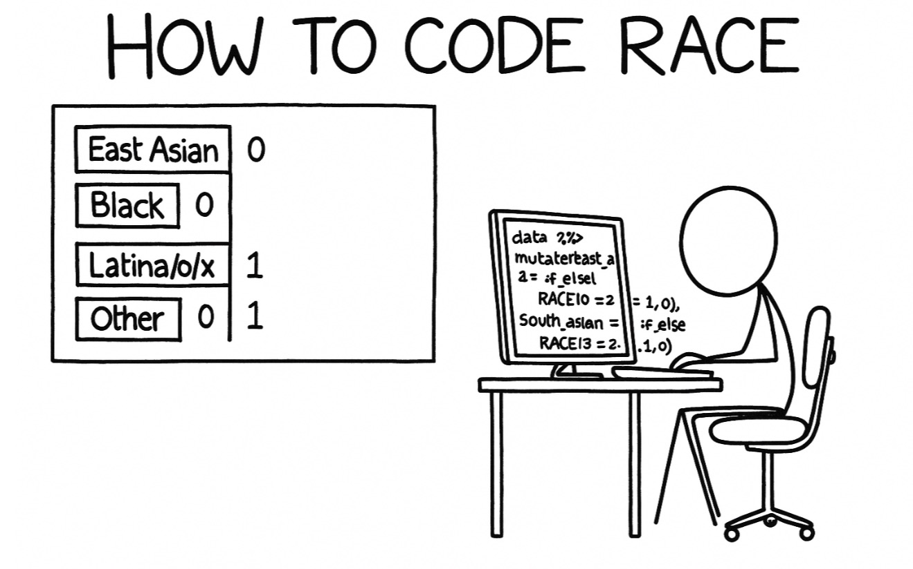

This post will show several ways of race coding in quantitative social science research. 



## Introduction

When conducting social science research, especially in critical quantitative studies, race is a sensitive variable that requires careful consideration. Traditional approaches to coding race often fall short when attempting to capture the complex realities of students who identify with multiple racial categories. This tutorial will explore three different methods for handling race variables in your analyses, each method has advantages and limitations.

## The Traditional Way: Categorical Coding

The traditional approach treats race as a single categorical variable with mutually exclusive categories such as White, Black, Asian, Hispanic, Multiracial, and Other. This method forces each participant into one category, even if they identify with multiple racial groups.

Following is a simulated dataset to demonstrate this approach:

```{r, message=FALSE, warning=FALSE}
library(dplyr)
library(ggplot2)
library(car)

set.seed(123)

#Simulate traditional categorical race data
n <- 500
traditional_data <- data.frame(
  student_id = 1:n,
  race_traditional = sample(c("White", "Black", "Asian", "Hispanic", "Multiracial", "Other"), 
                           n, replace = TRUE, 
                           prob = c(0.45, 0.15, 0.20, 0.12, 0.06, 0.02)),
  college_gpa = rnorm(n, mean = 3.2, sd = 0.5),
  science_identity = rnorm(n, mean = 4.0, sd = 1.2)
)

traditional_data$science_identity[traditional_data$race_traditional == "Asian"] <- 
  traditional_data$science_identity[traditional_data$race_traditional == "Asian"] + 0.3

head(traditional_data)
table(traditional_data$race_traditional)

#Check the factor levels - this determines the reference group
levels(factor(traditional_data$race_traditional))
# By default, R uses alphabetical order, so "Asian" would be the reference group

#Explicitly set White as reference group for clearer interpretation
traditional_data$race_traditional <- factor(traditional_data$race_traditional, 
          levels = c("White", "Asian", "Black", "Hispanic", "Multiracial", "Other"))

# Confirm White is now the reference group (first level)
levels(traditional_data$race_traditional)
```


### Potential Analysis with Traditional Race Coding

- Regression analysis
- ANOVA
- Post-hoc tests


```{r, message=FALSE, warning=FALSE}
#Linear regression with traditional categorical race variable
traditional_model <- lm(science_identity ~ race_traditional + college_gpa, data = traditional_data)
summary(traditional_model)

#Additional analyses
# ANOVA for science identity by race
anova_result <- aov(science_identity ~ race_traditional, data = traditional_data)
summary(anova_result)

#Post-hoc tests
TukeyHSD(anova_result)
```
### Advantages 

- **Simplicity:** Easy to understand and implement.
- **Support Standard analyses:** Compatible with ANOVA, chi-square tests, and most statistical procedures.
- **Clear group comparisons:** Straightforward interpretation of group differences.


### Disadvantages

- **Reference group dependency:** Results are interpreted relative to a chosen reference category (typically White), which can reinforce hierarchical thinking about race.
- **Lmited representation:** Students identifying as both White and Hispanic, or Black and Asian, are lumped into a generic "Multiracial" category. This "Multiracial" category obscures the specific combination of racial identities.

## Alternative Way 1: Binary Coding

Dummy coding creates separate binary variables for each racial category, allowing students to be coded as belonging to multiple groups simultaneously.

Let's see a simulated case.

```{r, message=FALSE, warning=FALSE}
#Create dummy-coded race variables
dummy_data <- data.frame(
  student_id = 1:n,
  college_gpa = rnorm(n, mean = 3.2, sd = 0.5),
  science_identity = rnorm(n, mean = 4.0, sd = 1.2)
)

#Create binary race variables (allowing multiple identities)
dummy_data$white <- sample(c(0, 1), n, replace = TRUE, prob = c(0.6, 0.4))
dummy_data$black <- sample(c(0, 1), n, replace = TRUE, prob = c(0.85, 0.15))
dummy_data$asian <- sample(c(0, 1), n, replace = TRUE, prob = c(0.75, 0.25))
dummy_data$hispanic <- sample(c(0, 1), n, replace = TRUE, prob = c(0.85, 0.15))

#Add a multiracial category for students identifying with multiple groups
dummy_data$multiracial <- 0

#Ensure some students have multiple identities
multiracial_ids <- sample(1:n, size = 30)
dummy_data$asian[multiracial_ids[1:15]] <- 1
dummy_data$white[multiracial_ids[1:15]] <- 1
dummy_data$multiracial[multiracial_ids[1:15]] <- 1  #mark as multiracial

dummy_data$black[multiracial_ids[16:30]] <- 1
dummy_data$hispanic[multiracial_ids[16:30]] <- 1
dummy_data$multiracial[multiracial_ids[16:30]] <- 1  #mark as multiracial

dummy_data$science_identity[dummy_data$asian == 1] <- 
  dummy_data$science_identity[dummy_data$asian == 1] + 0.3

dummy_data$total_races <- dummy_data$white + dummy_data$black + 
                         dummy_data$asian + dummy_data$hispanic + dummy_data$multiracial

```

### Potential Analysis with Binary Race Coding

- Regression analysis
- t.test

```{r, message=FALSE, warning=FALSE}
#Linear regression with dummy-coded race variables
dummy_model <- lm(science_identity ~ white + black + asian + hispanic + multiracial + college_gpa, 
                  data = dummy_data)
summary(dummy_model)

#Analysis of White-Asian students specifically
white_asian <- dummy_data[dummy_data$white == 1 & dummy_data$asian == 1, ]
mean(white_asian$science_identity, na.rm = TRUE)

#Compare with single-race students science identity vs multi-race identity
single_race <- dummy_data[dummy_data$total_races == 1, ]
multi_race <- dummy_data[dummy_data$total_races > 1, ]

t.test(single_race$science_identity, multi_race$science_identity)
```

### Advantages

- **Captures multiple identities:** Students can be coded as belonging to multiple racial groups.
- **Specific comparisons:** Researchers can examine the unique characteristics of specific multiracial combinations.
- **Flexible analysis:** No forced categorization, better represents how students actually identify.

### Disadvantages

- **Inflated sample size:** The sum of all racial categories exceeds the actual number of participants.
- **Statistical complications:** Traditional categorical tests (chi-square) are no longer appropriate.
- **Interpretation complexity:** More difficult to interpret main effects when students belong to multiple categories.
- **Multicollinearity concerns:** Racial variables may be correlated with each other.


## Alternative Way 2: Effect Coding

[Mayhew & Simonoff (2015)](https://link.springer.com/article/10.1007/s11162-015-9364-0) propose **effect coding** as alternative approach that doesn't rely on a reference group and better handles students who check multiple racial boxes.

> **Reference**: Mayhew, M. J., & Simonoff, J. S. (2015). Effect Coding as a Mechanism for Improving the Accuracy of Measuring Students Who Self‑Identify with More than One Race. *Research in Higher Education*, 56(6), 571–600.

### Statistical Idea

Effect coding (also known for **sum-to-zero coding**) forces the set of race‑indicator columns for **each student** to sum to 0.  When a respondent can select more than one race, Mayhew & Simonoff (2015) recommend *fractional weights* so the rule still holds.

> **Rule of thumb**  If a student selects *m* race boxes, give each selected category a weight of **1 / m**.  The omitted reference column automatically gets the negative of the row‑sum, keeping totals at 0.

#### Mini example: three race categories (A, B, C)

With three categories we need only **two** coded columns (EA and EB).  The table below reproduces the logic in Mayhew & Simonoff’s Table 1 and shows how multi‑race selections receive fractional weights.

| Selected Races   | $E_A$   | $E_B$   | Expected Mean of *y*         |
|------------------|---------|---------|-------------------------------|
| A                | $1$     | $0$     | $b_0 + b_A$                   |
| B                | $0$     | $1$     | $b_0 + b_B$                   |
| C                | $-1$    | $-1$    | $b_0 - b_A - b_B$             |
| A & B            | $1/2$   | $1/2$   | $b_0 + \frac{b_A}{2} + \frac{b_B}{2}$ |
| A & C            | $0$     | $-1/2$  | $b_0 - \frac{b_B}{2}$         |
| B & C            | $-1/2$  | $0$    | $b_0 - \frac{b_A}{2}$         |
| A, B & C         | $0$     | $0$     | $b_0$                         |


- Intercept (b0) is the grand mean across all racial groups.
- Each coefficient (bA, bB) is that group’s deviation from the grand mean.
- Because rows always add to 0, no single group is the "reference group".

#### Generalising to *k* categories

`contr.sum(k)` makes the k – 1 columns automatically. It sets up the k − 1 contrast vectors for single-race categories. The last category (by default) is omitted and represented as the negative sum of the other categories' contrasts.

### Apply Effect Coding and Run the Regression

```{r, message=FALSE, warning=FALSE}
#Use the same traditional categorical race data
effect_data <- traditional_data

#Convert race_traditional to factor for effect coding
effect_data$race_traditional <- factor(effect_data$race_traditional)
table(effect_data$race_traditional)

#Create effect-coded contrasts
#This will use "Other" as the omitted category (coded as -1 for all contrasts, like C in the above example)
contrasts(effect_data$race_traditional) <- contr.sum(6)
#contrasts(effect_data$race_traditional) <- contr.sum(length(levels(effect_data$race_traditional))) - same above

#Check the contrast matrix
contrasts(effect_data$race_traditional)

#Run the linear regression model
effect_model_1 <- lm(science_identity ~ race_traditional + college_gpa, data = effect_data)
summary(effect_model_1)

```

- The intercept 4.16 is the **grand mean** of science identity across all races.
- Each race coefficient represents the difference from the grand mean:
  - Asian (-0.028): Students identifying as Asian have a science_identity ~0.028 points below the grand mean (not statistically significant).
  - Black (+0.375): Students identifying as Black have science_identity ~0.375 points above the grand mean (significant at p < .01).
  - Hispanic (-0.017): Slightly below the grand mean, not significant.
  - Multiracial (+0.016): Slightly above the grand mean, not significant.
  - White (+0.032): Slightly above the grand mean, not significant.
- “Other” is the omitted category:
  - Its value is the negative sum of all the other categories' contrasts.
  - So its deviation from the grand mean is:
    - $-(sum) = -(-0.0278 + 0.3749 - 0.0165 + 0.0161 + 0.03196) ≈ -0.379$
    - So “Other” is $-0.379$ points below the grand mean, which is also the lowest science identity group.

### Advantages
- **No reference group:** Coefficients represent deviations from the grand mean, avoiding hierarchical comparisons.
- **Clearer interpretation:** Effects are interpreted relative to the overall sample mean.
- **Reduced bias:** Eliminates the arbitrary choice of reference group that can influence interpretation.

### Disadvantages
- **Interpretation challenges:** In multiracial applications, may still obscure differences between specific combinations (e.g., White-Black vs. Black-Asian students)

### Think further

Can effect coding only be applied to mutually exclusive racial/ethnic categories?

**Short answer:** No.

**Long answer:** Effect coding is **not limited** to mutually exclusive racial or ethnic categories. In fact, according to Mayhew & Simonoff (2015), effect coding is especially well-suited for situations where students can identify with **multiple racial/ethnic groups**.

> *“Effect coding and its application to multi-raced categories... allows students to be analyzed based on their self-identified multi-raced selection. In addition, effect coding allows a more accurate assessment of the slopes representing any one racial group by including the partial estimates for this racial group when it is selected as part of a bi- or multi-raced category.”*  
> — *Mayhew & Simonoff (2015)*

But:

If students are allowed to select multiple racial/ethnic identities in a "check all that apply" survey, the number of possible combinations grows **exponentially**. For example, if there are 4 races — White, Asian, Black, and Hispanic — a student might identify with:

- A single race (e.g., White)
- A bi-racial combination (e.g., White and Asian)
- A tri-racial combination (e.g., White, Asian, and Black)
- All four races

The total number of **non-empty** race combinations from 4 categories is:

$$
2^4 - 1 = 15
$$

This includes all possible non-empty subsets of the 4 categories.

All possible combinations from 4 Races:

| #  | Combination Type       | Races Selected                    |
|----|------------------------|-----------------------------------|
| 1  | Pure                   | White                             |
| 2  | Pure                   | Asian                             |
| 3  | Pure                   | Black                             |
| 4  | Pure                   | Hispanic                          |
| 5  | Bi-racial              | White + Asian                     |
| 6  | Bi-racial              | White + Black                     |
| 7  | Bi-racial              | White + Hispanic                  |
| 8  | Bi-racial              | Asian + Black                     |
| 9  | Bi-racial              | Asian + Hispanic                  |
| 10 | Bi-racial              | Black + Hispanic                  |
| 11 | Tri-racial             | White + Asian + Black             |
| 12 | Tri-racial             | White + Asian + Hispanic          |
| 13 | Tri-racial             | White + Black + Hispanic          |
| 14 | Tri-racial             | Asian + Black + Hispanic          |
| 15 | Four-race combination  | White + Asian + Black + Hispanic  |


Following is the **effect coding contrast matrix** with all coefficients expressed as **fractions** and the corresponding expected value expressions *E(y)*, following the logic from Mayhew & Simonoff (2015). *We’re using:*

- Races: **White (W)**, **Asian (A)**, **Black (B)**, **Hispanic (H)**
- **Hispanic (H)** is the omitted group, so its effect is implicitly coded via $-1$s or complementary fractions.
- The model is:

$$
E(y) = \beta_0 + E_W \cdot \beta_W + E_A \cdot \beta_A + E_B \cdot \beta_B
$$


Effect Coding Contrast Matrix for 4 Races (White, Asian, Black, Hispanic)

| Races Selected               | $E_W$           | $E_A$           | $E_B$           | $E(y)$                                     |
|-------------------------------|------------------|------------------|------------------|-----------------------------------------------|
| White                       | $1$              | $0$              | $0$              | $\beta_0 + \beta_W$                             |
| Asian                       | $0$              | $1$              | $0$              | $\beta_0 + \beta_A$                             |
| Black                       | $0$              | $0$              | $1$              | $\beta_0 + \beta_B$                             |
| Hispanic                    | $-1$             | $-1$             | $-1$             | $\beta_0 - \beta_W - \beta_A - \beta_B$         |
| White + Asian               | $\frac{1}{2}$    | $\frac{1}{2}$    | $0$              | $\beta_0 + \frac{1}{2}\beta_W + \frac{1}{2}\beta_A$ |
| White + Black               | $\frac{1}{2}$    | $0$              | $\frac{1}{2}$    | $\beta_0 + \frac{1}{2}\beta_W + \frac{1}{2}\beta_B$             |
| White + Hispanic            | $0$              | $-\frac{1}{2}$   | $-\frac{1}{2}$   | $\beta_0 - \frac{1}{2}\beta_A - \frac{1}{2}\beta_B$             |
| Asian + Black               | $0$              | $\frac{1}{2}$    | $\frac{1}{2}$    | $\beta_0 + \frac{1}{2}\beta_A + \frac{1}{2}\beta_B$             |
| Asian + Hispanic            | $-\frac{1}{2}$   | $0$              | $-\frac{1}{2}$   | $\beta_0 - \frac{1}{2}\beta_W - \frac{1}{2}\beta_B$             |
| Black + Hispanic            | $-\frac{1}{2}$   | $-\frac{1}{2}$   | $0$              | $\beta_0 - \frac{1}{2}\beta_W - \frac{1}{2}\beta_A$             |
| White + Asian + Black       | $\frac{1}{3}$    | $\frac{1}{3}$    | $\frac{1}{3}$    | $\beta_0 + \frac{1}{3}\beta_W + \frac{1}{3}\beta_A + \frac{1}{3}\beta_B$ |
| White + Asian + Hispanic    | $0$              | $0$              | $-\frac{1}{3}$   | $\beta_0 - \frac{1}{3}\beta_B$                                  |
| White + Black + Hispanic    | $0$              | $-\frac{1}{3}$   | $0$              | $\beta_0 - \frac{1}{3}\beta_A$                                  |
| Asian + Black + Hispanic    | $-\frac{1}{3}$   | $0$              | $0$              | $\beta_0 - \frac{1}{3}\beta_W$                                  |
| White + Asian + Black + Hisp| $0$              | $0$              | $0$              | $\beta_0$                                                       |


⚠️ Modeling Challenge 


As the number of race categories increases, the total combinations grow rapidly:

$$
\text{Combinations} = 2^k - 1
$$

- For 5 races: $2^5 - 1 = 31$
- For 6 races: $2^6 - 1 = 63$

This leads to overfitting, reduced interpretability, and estimation instability.

Maybe this time you want to just to consider effect coding with categorial race variables, just like our r example here. 


## Summary

### Which Methods Should I Use?

The choice of coding method should ultimately depend on your research questions:

- If your research question focuses on comparing specific racial groups to a meaningful reference category (e.g., comparing minority groups to White students), traditional dummy coding may be appropriate.
- If you want to understand the unique experiences of students with multiple racial identities, dummy coding with binary race variables allows the most flexibility.
- If you want to avoid the hierarchical implications of reference groups and focus on how each group differs from the overall population, effect coding is preferable.
- If your research question requires understanding specific multiracial combinations (e.g., White-Asian vs. Black-Hispanic experiences), consider creating specific categorical variables for the combinations of interest.

### Final Considerations
Regardless of the coding method chosen, researchers should:

- Be transparent about your coding decisions and rationale.
- Consider the theoretical implications of your chosen approach.
- Validate your approach with sensitivity analyses when possible.
- Acknowledge the limitations of your chosen method in the discussion.

Remember that no single approach perfectly captures the complexity of racial identity. The goal is to choose the method that best serves your research questions while remaining sensitive to the lived experiences of the students you're studying.

