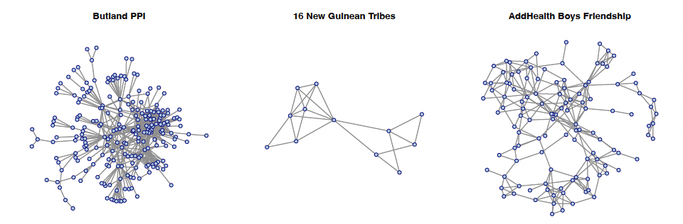

Ever wondered how to map friendships, track protein interactions, or visualize who's connected to whom in Renaissance Florence? This tutorial will walk you through the basics of visualizing and analyzing networks in R. Don't worry if you're new to this, we'll start simple and build up gradually. 



::: {.callout-note}
In this tutirial, we'll work with **undirected networks** for simplicity and easier visualization. While some of these relationships could be considered directed in real life (e.g., one person nominate another as a freiend), treating them as undirected in this tutorial helps us focus on fundamental concepts without getting tangled in the complexities of directed network analysis. We'll get to the directed network later. 
:::

## 1. What is Social Network Analysis?

Think about your friend group. Some people know everyone, while others have just a few close friends. Some friendships go both ways, while others... well, probably some of us have had that one-sided crush? Social Network Analysis (SNA) lets us study these patterns systematically.

At its core, SNA is the study of social structures through networks and graph theory. It characterizes networked structures in terms of **nodes** (individual actors, people, schools, or things) and the **ties**, **edges**, or **links** (relationships or interactions) that connect them.

* **Key concepts:** 
   + **Node/Vertex**: An individual entity in the network (e.g., a person, protein, organization). 
   + **Edge/Tie**: A connection between two nodes (e.g., friendship, interaction, marriage, college application). 
   + **Directed vs Undirected**: 
     - **Undirected**: Relationships are mutual (e.g., marriage). This is what we'll focus on in this tutorial.
     - **Directed**: Relationships have a direction (e.g., A follows B on social media, but B might not follow back). We'll save this complexity for another day! 
   + **Degree**: The number of connections a node has. High degree = popular node! In undirected networks, this is straightforward, just count the connections. 
   + **Component**: A subset of the network where all nodes are connected to each other through some path. Like a friend group where everyone knows everyone else, at least through someone.

## 2. Getting Started: SNA R Packages

Before we dive into the fun visualization stuff, let's get our toolkit. We'll use three main packages:

```{r, message=FALSE, warning=FALSE}
# Load packages
library(networkdata)
library(sna)
library(network)
```

::: {.callout-tip}
- `network`: Creates and manipulates network objects
- `sna`: Provides tools for network analysis and visualization
- `networkdata`: Contains example network datasets
:::

## 3. Creating Network Objects: Two Ways to Build Your Network

Networks can be stored in different formats, let's look at the two most common formats: edgelist and adjacency matrix.

### 3.1 Edge List Format

An edge list is simply a two-column list where each row says "A is connected to B." 

::: {.callout-note}
**Dataset: Butland Protein-Protein Interaction (PPI) Network**

This network represents physical interactions between two proteins. Each node is a protein, and each edge means two proteins physically interact with each other. Scientists mapped these interactions using a technique called yeast two-hybrid screening. 

* **Type**: Undirected (if protein A interacts with B, then B interacts with A)
* **Nodes**: Proteins 
* **Edges**: Protein-protein interactions
:::

```{r, message=FALSE, warning=FALSE}
#get the data (this data is from `network` package)
data("butland_ppi")

#create network from edge list
nw_ppi <- network(butland_ppi, matrix.type = "edgelist", directed = FALSE) # proteins interact mutually

#check network properties
network.size(nw_ppi)        # how many proteins?
network.edgecount(nw_ppi)   # how many interactions?
```
::: {.callout-tip}
Use `help("butland_ppi")` to learn about the dataset in the networkdata package.
:::

### 3.2 Adjacency Matrix Format

An adjacency matrix is like a multiplication table, but instead of showing products, it shows connections. If there's a connection from node i to node j, you put a 1 in row i, column j. No connection? Put a 0.

::: {.callout-note}
**Dataset: New Guinean Highland Tribes**

This classic dataset comes from anthropological research on 16 tribes in the Eastern Central Highlands of New Guinea, studied during the 1960s. The relationships here are about alliances and conflicts between tribes. We'll focus on positive relationships (alliances, trade partnerships, friendly interactions). Fun fact: This dataset has been used in social network analysis teaching for decades!

* **Type**: Undirected (alliances are typically mutual)
* **Nodes**: 16 Highland tribes
* **Edges**: Positive relationships (friendships, alliances, intermarriage)
:::


```{r, message=FALSE, warning=FALSE}
#get the data
data("tribes")

#extract positive relationships (try help("tribes"), attributes(tribes))
tribes_pos <- tribes[, , 1]

#create network from adjacency matrix
nw_tribes <- network(tribes_pos, 
                     matrix.type = "adjacency", 
                     directed = FALSE)
```

::: {.callout-tip}
Check if a matrix is symmetric with `isSymmetric(your_matrix)` to verify it's direction. 
:::

## 4. Working with Network Components

```{r, message=FALSE, warning=FALSE}
# Get component information
comp_info <- component.dist(nw_ppi)

# comp_info contains:
# - $membership: which component each node belongs to
# - $csize: size of each component

# Extract the largest component
largest_comp <- which(comp_info$membership == which.max(comp_info$csize))
nw_ppi_largest <- get.inducedSubgraph(nw_ppi, v = largest_comp)
```

**Why focus on the largest component?**

*  Isolated nodes or small groups may represent data errors or uninteresting cases
*  Statistical measures are more meaningful in connected networks
*  Visualization is clearer without scattered isolated nodes

## 5. Adding Node Attributes

So far, our nodes are just dots. But in real life, people (and proteins, and tribes) have characteristics!

::: {.callout-note}
****Dataset: AddHealth Adolescent Friendship Network**

The National Longitudinal Study of Adolescent to Adult Health (AddHealth) is one of the most famous social network datasets in existence. It surveyed students in schools across the U.S., asking "who are your friends?" We'll work with community 9 and focus on boys' friendship networks. This dataset is gold for studying peer influence, social integration, and how friendships form during adolescence.

**Note**: While the original data includes directed friendship nominations (you might list someone as a friend who doesn't list you back), we'll treat these as undirected for this tutorial. If there's any connection between two people (one student nominate another as friends), we'll count it as a mutual friendship.

* **Type**: Undirected (for our demonstration)
* **Nodes**: Male students in AddHealth community 9
* **Edges**: Friendship connections
* **Attributes**: Race, grade level, and more
:::


```{r, message=FALSE, warning=FALSE}
#get tge friendship network filtered for boys
data("addhealth9")

boys_only <- addhealth9$X[, "female"] == 0
boys_id <- which(boys_only)

#filter edges to keep only boy-to-boy friendships
edges_boys <- addhealth9$E[addhealth9$E[, 1] %in% boys_id & 
                           addhealth9$E[, 2] %in% boys_id, ]

# create network
nw_boys <- network(edges_boys, matrix.type = "edgelist", directed = FALSE)

#add attributes using the %v% operator
nw_boys %v% "race" <- addhealth9$X[boys_id, "race"]
nw_boys %v% "grade" <- addhealth9$X[boys_id, "grade"]
```

::: {.callout-tip}
The `%v%` operator is your friend for vertex attributes! Think of it as saying "this network's vertices have this property." Use `list.vertex.attributes(nw_boys)` to see all available attributes.
:::

## 6. Visualizing Networks

Alright, time for the fun part! Network plots can be beautiful, informative, or completely messy. The difference often comes down to choosing the right layout and visual parameters.

### 6.1 Basic Network Plot

```{r, warning=FALSE, message=FALSE}
plot(nw_ppi, 
     main = "Protein-Protein Interaction Network",
     cex.main = 1.5,              # title size
     vertex.cex = 1.0,            # node size
     edge.col = "gray60",         # edge color
     vertex.col = "lightblue",    # node color
     vertex.border = "darkblue",  # node border color
     mode = "fruchtermanreingold", # layout algorithm
     pad = 0.7)                   # padding around plot
```
### 6.2 Displaying Node Labels

Sometimes you want to know which node is which. That's where labels come in handy.

::: {.callout-note}
**Dataset: Florentine Marriage Network**
 Welcome to Renaissance Florence! This famous dataset shows marriage alliances between the most powerful families in 15th-century Florence. Each node is a wealthy family, and edges represent marriages between families. The Medici family famously used strategic marriages to build political power. 

* **Type**: Undirected (marriage creates ties between both families)
* **Nodes**: 16 elite Florentine families
* **Edges**: Marital unions between families
:::

```{r, message=FALSE, warning=FALSE}
data(florentine)

plot(flomarriage, 
     displaylabels = TRUE,        # show node names
     vertex.cex = 1.5,
     label.cex = 0.8,             # label size
     label.pos = 1,               # label position (5 = center)
     edge.col = "gray60",
     vertex.col = "lightblue",
     vertex.border = "darkblue",
     main = "Florentine Family Marriage Network")
```
::: {.callout-tip}
Labels can overlap in dense networks. Try adjusting `label.pos` (1=below, 2=left, 3=above, 4=right, 5=center) or `label.cex` to make them more readable.
:::

#### 6.2.1 Extension
We can make our visualization tell a richer story by using node attributes to control visual properties. The Florentine marriage dataset includes information about each family's wealth and political power (number of seats on the city council, called "priorates"). Let's use these to create a more informative plot:

```{r, message=FALSE, warning=FALSE}
#attributes are available
list.vertex.attributes(flomarriage)

#extract wealth and priorates (political representation)
wealth <- flomarriage %v% "wealth"
priorates <- flomarriage %v% "priorates"

#scale wealth to appropriate node sizes (1-4 range works well)
node_sizes <- wealth / 20  

#create node shapes based on political representation
#more priorates = more sides (more politically important)
#map priorates to number of polygon sides
node_sides <- ifelse(priorates >= 50, 8,      # Octagon for high power (50+)
              ifelse(priorates >= 30, 6,       # Hexagon for medium-high (30-49)
              ifelse(priorates >= 10, 5,       # Pentagon for medium (10-29)
              ifelse(priorates > 0, 4, 3))))   # Diamond (4) for low, Triangle (3) for none

#create the enhanced plot
plot(flomarriage, 
     displaylabels = TRUE,
     vertex.cex = node_sizes,     # Size by wealth
     vertex.sides = node_sides,   # Shape by political power
     label.cex = 0.7,
     edge.col = "gray60",
     vertex.col = "gold",         # Gold for wealthy families
     main = "Florentine Marriages: Wealth & Political Power")

```


**What does this reveal?** The Medici family stands out with both high wealth (large node) and significant political representation (many-sided polygon).

## 7. Finding Isolated Nodes and Components

```{r, message=FALSE, warning=FALSE}
#get component membership for all nodes
comp <- component.dist(flomarriage)

#find isolated nodes (nodes not in the largest component)
family_names <- network.vertex.names(flomarriage)
isolated <- family_names[comp$membership != which.max(comp$csize)]
print(isolated)  # "Pucci"
```

## 8. Quick Reference

| Function | Purpose | Example |
|----------|---------|---------|
| `network()` | Create network object | `network(nw, matrix.type = "edgelist")` |
| `degree()` | Calculate node degrees | `degree(nw, gmode = "graph")` |
| `component.dist()` | Find connected components | `component.dist(nw)` |
| `get.inducedSubgraph()` | Extract subnetwork | `get.inducedSubgraph(nw, v = nodes)` |
| `network.size()` | Count nodes | `network.size(nw)` |
| `network.edgecount()` | Count edges | `network.edgecount(nw)` |
| `network.vertex.names()` | Get node names | `network.vertex.names(nw)` |
| `%v%` | Set/get vertex attributes | `nw %v% "race" <- values` |
| `plot()` | Visualize network | `plot(nw, displaylabels = TRUE)` |

## 9. Resources to Keep Learning

* Eric Kolaczyk
Statistical Analysis of Network Data (2009). Springer
http://link.springer.com/book/10.1007%2F978-0-387-88146-1

* Eric Kolaczyk and Gabor Csardi
Statistical Analysis of Network Data with R (2014). Springer
http://link.springer.com/book/10.1007%2F978-1-4939-0983-4

* David Easley and Jon Kleinberg
"Networks, Crowds, and Markets: Reasoning about a Highly Connected World (2010). Available free online.
https://www.cs.cornell.edu/home/kleinber/networks-book/

*This tutorial is based on UCLA [STATS 218: Social Network Analysis](https://handcock.github.io/teaching/218/) taught by Prof [Mark Handcock](https://handcock.github.io/).*
