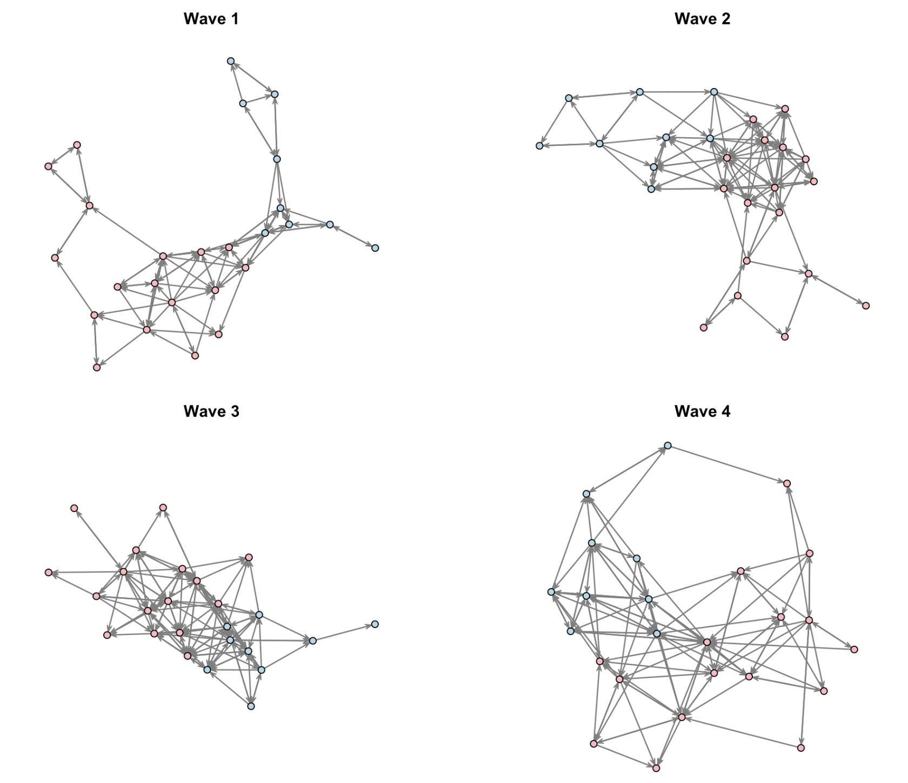

So far in this tutorial series, we’ve explored various aspects of social network analysis using cross-sectional data—networks captured at a single point in time. However, many social networks are dynamic, evolving over time as relationships form, dissolve, and transform. In this tutorial, we’ll explore longitudinal network analysis, focusing on modeling networks that change across multiple time periods.

After this tutorial, we can answer questions like:

- How do friendships evolve in a school class over an academic year?
- What factors drive the formation and dissolution of international alliances?
- Do collaboration patterns in organizations become more stable over time?
- How does reciprocity develop in social relationships?



## 1. Introduction to Longitudinal Networks

### 1.1 What are Longitudinal Networks?

**Longitudinal networks** (also called **temporal networks** or **dynamic networks**) are networks observed at multiple time points. Instead of a single snapshot at time *t*, we observe a sequence of snapshots: $N_1, N_2, ..., N_T$, where each $N_t$ represents the network at time *t*.

### 1.2 Why Model Temporal Dependencies?

A principle in longitudinal network modeling is that **the probability of observing the network at time *t* depends on the network structure at time *t-1***. This makes intuitive sense:

-   Existing friendships are more likely to persist than new friendships to form randomly
-   Reciprocity takes time to develop (if A likes B at *t-1*, B is more likely to like A at *t*)
-   Network structures like transitivity (friends of friends becoming friends) unfold over time

This conditional dependence is expressed mathematically as:

$$P(N_t | N_{t-1}, N_{t-2}, ..., N_{t-K}, \theta)$$

where $K$ represents the **memory** or **lag** of the model—how many previous time steps influence the current network.

### 1.3 Temporal ERGMs (TERGMs)

The **Temporal ERGM (TERGM)** extends the cross-sectional ERGM framework to longitudinal data. For a single time point *t*, the TERGM is:

$$P(N_t | N_{t-K}, ..., N_{t-1}, \theta) = \frac{\exp(\theta^T h(N_t, N_{t-1}, ..., N_{t-K}))}{\sum_{n \in \mathcal{N}} \exp(\theta^T h(n, N_{t-1}, ..., N_{t-K}))}$$

For multiple time periods (from *K+1* to *T*), we model the joint probability as:

$$P(N_{K+1}, ..., N_T | N_1, ..., N_K, \theta) = \prod_{t=K+1}^{T} P(N_t | N_{t-K}, ..., N_{t-1}, \theta)$$

This assumes that conditional on the previous *K* networks, each time point is independent.


## 2. Memory Terms in TERGMs

**Memory terms** capture temporal processes and are essential for understanding network dynamics.

### 2.1 Common Memory Terms

**Positive Autoregression (Edge Stability)**\
Counts edges that persist from *t-1* to *t*:\
$$h_a = \sum_{ij} N_t^{ij} N_{t-1}^{ij}$$

Interpretation: "Do existing ties tend to remain?"

**Dyadic Stability**\
Counts both persistent edges AND persistent non-edges:\
$$h_s = \sum_{ij} [N_t^{ij} N_{t-1}^{ij} + (1-N_t^{ij})(1-N_{t-1}^{ij})]$$

Interpretation: "Do dyadic relationships (present or absent) remain stable?"

**Delayed Reciprocity**\
Counts reciprocated edges with a time lag:\
$$h_r = \sum_{ij} N_t^{ij} N_{t-1}^{ji}$$

Interpretation: "If A nominated B at *t-1*, does B nominate A at *t*?"

## 3. The `btergm` Package

### 3.1 Installation and Loading

```{r, eval=FALSE}
install.packages("xergm")
install.packages("btergm")
install.packages("statnet")
install.packages("texreg")
```

```{r, message=FALSE, warning=FALSE}
library(statnet)
library(xergm)
library(btergm)
library(texreg)
library(dplyr)

set.seed(12345)
```

### 3.2 Why MPLE with Bootstrap?

The `btergm` package uses **Maximum Pseudolikelihood Estimation (MPLE)** with **bootstrap confidence intervals**:

-   **Speed**: No simulation required for estimation
-   **Consistency**: MPLE is consistent as either *n* (nodes) or *T* (time periods) increases
-   **Scalability**: Works well with large networks

The bootstrap procedure corrects for MPLE's underestimation of standard errors by: 

1. Sampling with replacement from the *T-K* observed networks 
2. Re-estimating the model for each bootstrap sample 
3. Using the distribution of bootstrap estimates for confidence intervals

The following two examples were extracted from this paper. 

> Leifeld, P., Cranmer, S. J., & Desmarais, B. A. (2018). Temporal exponential random graph models with btergm: Estimation and bootstrap confidence intervals. *Journal of Statistical Software*, 83, 1-36.

## 4. Simple Example: International Alliances

Before diving into complex temporal models with changing actor sets, let's start with a simpler example: the network of international defense alliances.

### 4.1 Load Alliance Data

```{r, message=FALSE, warning=FALSE}
# Load the alliance dataset
data("alliances", package = "xergm.common")

# Examine the data structure
cat("Number of time periods:", length(allyNet), "\n")
cat("Number of countries:", network.size(allyNet[[1]]), "\n")
```

This dataset contains: 

- **allyNet**: List of 20 network objects (1981-2000), each with 164 countries 
- **contigMat**: Binary matrix indicating shared borders (constant over time) 
- **LSP**: Time-varying matrix of shared partners from previous year 
- **warNet**: Time-varying matrices of militarized interstate disputes 
- **Node attributes**: `cinc` (military capabilities), `polity` (regime authority)


### 4.2 Visualize Alliance Networks (last three)

```{r, message = FALSE, warning = FALSE, fig.width=10, fig.height=3}
par(mfrow = c(1, 3), mar = c(0, 0, 1, 0))
for (i in (length(allyNet) - 2):length(allyNet)) {
  plot(allyNet[[i]], main = paste("t =", i),
       vertex.cex = 0.7, edge.col = "grey50")
}
```

### 4.3 Model 1a: Pooled TERGM (No Temporal Dependencies)

Let's start with a pooled TERGM that treats all 20 time periods as independent.

"In a first simple model, a TERGM without any temporal dependencies is estimated. This corresponds to a pooled ERGM – pooling across T networks that are assumed to be independent of each other – where the estimates reflect the average effects across the 20 time points. The (somewhat unrealistic) assumption here is that the consecutive networks are independent from each other."

```{r, message=FALSE, warning=FALSE}
model_1a <- btergm(
  allyNet ~ edges + 
    gwesp(0, fixed = TRUE) +            # Geometrically weighted ESP
    edgecov(LSP) +                      # Shared partners (from t-1)
    edgecov(warNet) +                   # Militarized disputes
    nodecov("polity") +                 # Regime authority
    nodecov("cinc") +                   # Military capabilities
    absdiff("polity") +                 # Absolute difference in polity
    absdiff("cinc") +                   # Absolute difference in capabilities
    edgecov(contigMat),                 # Shared border
  R = 50,                               # Bootstrap replications
  parallel = "no",
  verbose = FALSE
)

summary(model_1a)
```
-   **edges**: Negative coefficient indicates sparse network baseline
-   **gwesp.fixed.0**: Positive coefficient indicates tendency toward triadic closure
-   **edgecov.LSP**: Positive and significant coefficient indicates shared partners matter
-   **edgecov.warNet**: Positive coefficient indicates countries in disputes form alliances
-   **absdiff.polity**: Negative coefficient indicates similar regime types more likely to ally
-   **edgecov.contigMat**: Positive and significant coefficient indicates neighbors form alliances


### 4.4 Goodness-of-Fit for Model 1a

```{r, message=FALSE, warning=FALSE, fig.width=10, fig.height=3}
gof_1a <- gof(model_1a, nsim = 50, 
              statistics = c(esp, geodesic, deg))

par(mfrow = c(1, 3), mar = c(4, 4, 2, 1))
plot(gof_1a)
```

**Poor fit**: The model systematically misses the observed network structure, particularly in: 

- Edge-wise shared partners 
- Geodesic distances\
- Degree distribution

This suggests we need temporal dependencies.

### 4.5 Model 1b: TERGM with Temporal Dependencies

Now add temporal terms to capture network dynamics:

```{r, message=FALSE, warning=FALSE}
model_1b <- btergm(
  allyNet ~ edges + 
    gwesp(0, fixed = TRUE) +
    edgecov(LSP) +
    edgecov(warNet) +
    nodecov("polity") +
    nodecov("cinc") +
    absdiff("polity") +
    absdiff("cinc") +
    edgecov(contigMat) +
    memory(type = "stability") +                # Dyadic stability (NEW)
    timecov(transform = function(t) t) +        # Linear time trend (NEW)
    timecov(warNet, transform = function(t) t), # War × time interaction (NEW)
  R = 50,
  parallel = "no",
  verbose = FALSE
)

summary(model_1b)
```

### 4.6 New Temporal Terms Explained

**`memory(type = "stability")`**:\
Captures whether dyadic relationships (alliances or lack thereof) persist over time. Positive coefficient indicates high stability—existing alliances tend to continue.

**`timecov(transform = function(t) t)`**:\
Tests for a linear time trend in alliance density. Positive coefficient means the network gets denser over time.

**`timecov(warNet, transform = function(t) t)`**:\
Tests whether the effect of militarized disputes on alliances changes over time. Non-significant here, suggesting the war-alliance relationship is stable across years.

### 4.7 Compare Alliance Models

```{r, message=FALSE, warning=FALSE}
screenreg(list(model_1a, model_1b),
          custom.model.names = c("Model 1a", "Model 1b"),
          single.row = TRUE)
```

### 4.8 Key Findings from Model Comparison

1.  **Memory dominates**: `memory(stability)` has the strongest effect—alliance relationships are highly persistent

2.  **Effect changes**:

    -   **edgecov.LSP**: Coefficient drops dramatically (from 2.11 to 0.11) once we control for stability
    -   **edgecov.warNet**: Becomes non-significant in TERGM
    -   **edgecov.contigMat**: Still significant but weaker (from 3.21 to 1.60)

3.  **Time trend**: Positive and significant—international alliance network becomes slightly denser over time

4.  **Interpretation**: Without controlling for temporal stability, we overestimate the importance of shared partners and conflicts. The real driver is **inertia**—past alliances strongly predict future alliances.

### 4.9 Goodness-of-Fit for Model 1b

```{r, message=FALSE, warning = FALSE, fig.width=10, fig.height=3}
gof_1b <- gof(model_1b, nsim = 50,
              statistics = c(esp, geodesic, deg))

par(mfrow = c(1, 3), mar = c(4, 4, 2, 1))
plot(gof_1b)
```

**Much better fit**: The TERGM with temporal dependencies captures the observed network structure more accurately across all diagnostics.

## 5. Advanced Example: Friendship Networks in a Dutch School

Now let's tackle a more complex example with changing actor composition.

### 5.1 Load and Explore Data

We'll use the **Knecht friendship network** dataset, which tracks friendship nominations among 26 students across four waves.

```{r, message=FALSE, warning=FALSE}
data("knecht", package = "xergm.common")

cat("Number of time periods:", length(friendship), "\n")
cat("Network dimensions at each wave:\n")
for (i in 1:length(friendship)) {
  cat("  Wave", i, ":", dim(friendship[[i]]), "\n")
}
```

The data includes: 

- `friendship`: List of 4 adjacency matrices (one per wave) 
- `demographics`: Data frame with student attributes (sex, etc.) 
- `primary`: Matrix indicating shared primary school attendance

### 5.2 Data Preparation

```{r, message=FALSE, warning=FALSE}
#label rows and columns with node IDs for tracking
for (i in 1:length(friendship)) {
  rownames(friendship[[i]]) <- 1:nrow(friendship[[i]])
  colnames(friendship[[i]]) <- 1:ncol(friendship[[i]])
}

#label the primary school covariate
rownames(primary) <- rownames(friendship[[1]])
colnames(primary) <- colnames(friendship[[1]])

#extract and label sex variable
sex <- demographics$sex
names(sex) <- 1:length(sex)
```

**Handle Missing Data:**

```{r, message=FALSE, warning=FALSE}
#remove nodes that dropped out (coded as 10)
friendship <- handleMissings(friendship, na = 10, method = "remove")

#impute missing values (unit non-response) with modal value (0)
friendship <- handleMissings(friendship, na = NA, method = "fillmode")
```

Node 21 dropped out after wave 2, so waves 3-4 have only 25 students.

**Convert to Network Objects:**

```{r, message=FALSE, warning=FALSE}
for (i in 1:length(friendship)) {
  #adjust sex variable to match current network dimensions
  s <- adjust(sex, friendship[[i]])
  
  #convert matrix to network object
  friendship[[i]] <- network(friendship[[i]])
  
  #set vertex attributes
  friendship[[i]] <- set.vertex.attribute(friendship[[i]], "sex", s)
  
  #calculate degree-based covariates
  idegsqrt <- sqrt(degree(friendship[[i]], cmode = "indegree"))
  friendship[[i]] <- set.vertex.attribute(friendship[[i]], "idegsqrt", idegsqrt)
  
  odegsqrt <- sqrt(degree(friendship[[i]], cmode = "outdegree"))
  friendship[[i]] <- set.vertex.attribute(friendship[[i]], "odegsqrt", odegsqrt)
}

#check network sizes
sapply(friendship, network.size)
```

### 5.3 Visualize Networks

```{r, fig.width=10, fig.height=8}
par(mfrow = c(2, 2), mar = c(0, 0, 2, 0))
for (i in 1:length(friendship)) {
  plot(friendship[[i]], 
       main = paste("Wave", i),
       usearrows = TRUE,
       edge.col = "grey50",
       vertex.col = c("lightpink", "lightblue")[get.vertex.attribute(friendship[[i]], "sex")])
}
```
### 5.4. Model 1: Pooled TERGM (No Temporal Dependencies)

As a baseline, we estimate a pooled TERGM that treats all time periods as independent:

```{r, message=FALSE, warning=FALSE}
model_2a <- btergm(
  friendship ~ edges + 
    mutual + 
    ttriple + 
    transitiveties + 
    ctriple + 
    nodeicov("idegsqrt") + 
    nodeicov("odegsqrt") + 
    nodeocov("odegsqrt") + 
    nodeofactor("sex") + 
    nodeifactor("sex") + 
    nodematch("sex") + 
    edgecov(primary),
  R = 100,
  parallel = "no",
  verbose = FALSE
)

summary(model_2a)
```
### 5.5 Model 2: TERGM with Temporal Dependencies

Now we add temporal dependencies:

```{r, message=FALSE, warning=FALSE}
model_2b <- btergm(
  friendship ~ edges + 
    mutual + 
    ttriple + 
    transitiveties + 
    ctriple + 
    nodeicov("idegsqrt") + 
    nodeicov("odegsqrt") + 
    nodeocov("odegsqrt") + 
    nodeofactor("sex") + 
    nodeifactor("sex") + 
    nodematch("sex") + 
    edgecov(primary) +
    delrecip +                        # Delayed reciprocity
    memory(type = "stability"),       # Dyadic stability
  R = 100,
  parallel = "no",
  verbose = FALSE
)

summary(model_2b)
```
### 5.6 New Temporal Terms

**`delrecip` (Delayed Reciprocity):**\
Tests whether a tie from j→i at *t-1* leads to i→j at *t*. Positive coefficient indicates reciprocation develops over time.

**`memory(type = "stability")`:**\
Captures dyadic stability—both persistent ties AND persistent non-ties. Positive coefficient means relationships (present or absent) tend to be stable.

**Important**: When using temporal terms with lag 1, only waves 2-4 are used as outcomes (wave 1 provides the initial state).


### 5.7 Model Comparison

```{r, message=FALSE, warning=FALSE}
screenreg(list(model_2a, model_2b),
          custom.model.names = c("Model 2a", "Model 2b"),
          single.row = TRUE)
```

### 5.8 Goodness-of-Fit Assessment

```{r, message=FALSE, warning = FALSE, fig.width=10, fig.height=6}
gof_temporal <- gof(model_2b, 
                    nsim = 50,
                    statistics = c(esp, dsp, geodesic, deg, triad.undirected))

par(mfrow = c(2, 3), mar = c(4, 4, 2, 1))
plot(gof_temporal)
```

### 5.9 Network Evolution Over Time

```{r, message = FALSE, warning = FALSE, fig.width=10, fig.height=4}
#calculate network statistics for each wave
net_stats <- data.frame(
  wave = 1:4,
  nodes = sapply(friendship, network.size),
  edges = sapply(friendship, network.edgecount),
  density = sapply(friendship, network.density),
  reciprocity = sapply(friendship, grecip, measure = "edgewise"),
  transitivity = sapply(friendship, gtrans)
)

print(net_stats)

#visualize trends
par(mfrow = c(1, 3), mar = c(4, 4, 2, 1))

plot(net_stats$wave, net_stats$density, 
     type = "b", pch = 16, col = "steelblue",
     xlab = "Wave", ylab = "Density",
     main = "Network Density")

plot(net_stats$wave, net_stats$reciprocity, 
     type = "b", pch = 16, col = "darkgreen",
     xlab = "Wave", ylab = "Reciprocity",
     main = "Edgewise Reciprocity")

plot(net_stats$wave, net_stats$transitivity, 
     type = "b", pch = 16, col = "darkred",
     xlab = "Wave", ylab = "Transitivity",
     main = "Transitivity")
```


---

*This tutorial is based on UCLA [STATS 218: Social Network Analysis](https://handcock.github.io/teaching/218/) taught by Prof [Mark Handcock](https://handcock.github.io/).*
