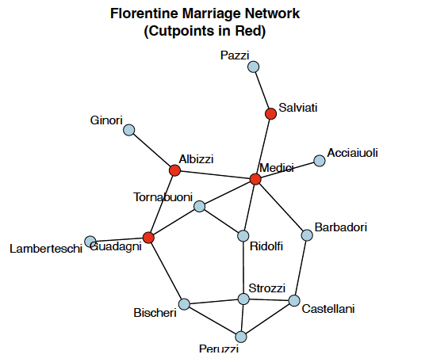

Have you ever wondered how to quantify the "importance" of a person in a social network (like the following graph, which family is the most powerful one among Renaissance Florentine families)? Or how to measure whether a network is tightly connected or fragmented? In this tutorial, we will explore the mathematical and statistical foundations of network analysis, covering degree, density, connectivity, distance measures, and centrality metrics.



In network analysis, we move beyond simple visualization to **quantitative measurement**. Just as we describe a dataset with statistics like mean and standard deviation, we describe networks with metrics like degree, density, and centrality. These measures help us:

- Identify influential nodes (Who are the key players?)
- Understand network structure (Is the network cohesive or fragmented?)
- Compare different networks (Is Network A more centralized than Network B?)
- Predict network behavior (How quickly can information spread?)

This tutorial covers the fundamental statistics we use to describe networks. We'll start with simple node-level measures (like degree), move to pairwise relationships (like geodesic distance), network-level summaries (like density and diameter), and different types of centrality measures. By the end, you'll understand the mathematical language of social networks.

## 1. Notation and Preliminaries

Before diving into specific measures, let's establish some notation:

- **$N$** = number of nodes (vertices) in the network
- **$L$** = number of edges (ties) in the network  
- **$Y$** = adjacency matrix where $y_{ij} = 1$ if there's an edge from node $i$ to node $j$, and $y_{ij} = 0$ otherwise
- **$d(i,j)$** = geodesic distance (shortest path length) between nodes $i$ and $j$

For **undirected networks**, the adjacency matrix is symmetric: $y_{ij} = y_{ji}$. For **directed networks**, edges have direction, so $y_{ij}$ and $y_{ji}$ can differ.

::: {.callout-note}
Throughout this tutorial, we'll work with undirected networks for simplicity. The concepts generalize to directed networks, but the formulas often need adjustment (for instance, distinguishing between in-degree and out-degree).
:::

## 2. Node-Level Statistics

Node-level statistics characterize individual nodes in the network. These measures help us answer questions like "Which node is most active?" or "Which node is most peripheral?"

### 2.1 Degree

**Degree** is the most basic node-level measure, it simply counts how many direct connections a node has.

**Definition:** The degree of node $i$, denoted $d_i$ or $\text{Degree}(i)$, is the number of edges incident to that node.

**Formula:** 
$$\text{Degree}(i) = \sum_{j=1}^{N} y_{ij}$$
For undirected networks, this counts the number of neighbors node $i$ has. For directed networks, we distinguish:

- **In-degree:** $d_i^{in} = \sum_{j=1}^{N} y_{ji}$ (edges pointing into node $i$)
- **Out-degree:** $d_i^{out} = \sum_{j=1}^{N} y_{ij}$ (edges pointing out from node $i$)

**Interpretation:**

- **High degree**: Node is well-connected, active, or popular. In a friendship network, this person knows many people. In a protein interaction network, this protein interacts with many others.
- **Low degree**: Node is peripheral or isolated. They have few direct connections.

**Degree distribution:** Rather than looking at individual nodes, we often examine the distribution of degrees across all nodes. This reveals whether most nodes have similar connectivity (uniform distribution) or whether a few "hubs" dominate (heavy-tailed distribution like power law).

### 2.2 Nodal Eccentricity

While degree measures immediate connectivity, **eccentricity** captures how far a node is from the most distant other node in the network.

**Definition:** The eccentricity of node $i$, denoted $e_i$ or $e(i)$, is the maximum geodesic distance from node $i$ to any other node in the network.

**Formula:**
$$e(i) = \max_{j \in V} d(i,j)$$
where $V$ is the set of all nodes and $d(i,j)$ is the geodesic distance (shortest path length) from $i$ to $j$.

**Interpretation:**

- **Small eccentricity**: Node is centrally located; it can reach even the farthest nodes in relatively few steps
- **Large eccentricity**: Node is on the periphery; the farthest node from it is very far away

## 3. Pairwise Statistics

Pairwise statistics describe relationships between pairs of nodes. These measures help us understand distances, reachability, and the structure of paths in the network.

### 3.1 Geodesic Distance

**Geodesic distance** is fundamental to understanding how nodes relate to one another in a network. It tells us about reachability and the efficiency of pathways in the network. In social networks, shorter distances mean faster information diffusion. In transportation networks, they mean more direct routes.


**Definition:** The geodesic distance $d(i,j)$ between nodes $i$ and $j$ is the length of the shortest path connecting them (the minimum number of edges traversed).

**Formula:**
$$d(i,j) = \min(\text{length of all paths from } i \text{ to } j)$$
If no path exists (nodes are in different components), we say $d(i,j) = \infty$.

**Key properties:**

- $d(i,i) = 0$ (distance from a node to itself is zero)
- $d(i,j) = d(j,i)$ for undirected networks (distance is symmetric)
- Multiple geodesics may exist between two nodes (multiple shortest paths of the same length)

**Interpretation:**

- **Small geodesic distance**: Nodes are close; information can flow quickly between them
- **Large geodesic distance**: Nodes are far apart; information takes many steps to travel
- **Mean geodesic distance**: Average network efficiency for communication

::: {.callout-tip}
Imagine a network like this:
```
A --- B --- C --- D
      |           |
      E --- F --- G
```
- $d(A, B) = 1$ (direct neighbors)
- $d(A, C) = 2$ (shortest path: A → B → C)  
- $d(A, E) = 2$ (shortest path: A → B → E)
- $d(A, D) = 3$ (shortest path: A → B → C → D)
- Note that $d(B, D) = 2$ via two routes: B → C → D or B → E → F → G → D (both length 4), so the geodesic is through C
:::

**Computing geodesic distances:** In practice, we use algorithms like **Breadth-First Search (BFS)** or matrix multiplication methods to compute all pairwise geodesic distances efficiently.

## 4. Network-Level Statistics

Network-level statistics summarize the entire network in a single number. These measures help us compare networks, understand overall structure, and characterize properties like cohesion, compactness, and vulnerability.

### 4.1 Density

**Density** is perhaps the most fundamental network-level measure—it tells us what fraction of all possible connections actually exist.

**Definition:** Density is the proportion of existing edges relative to all possible edges.

**Formula:**

For **undirected** networks:
$$\text{Density} = \frac{L}{N(N-1)/2} = \frac{2L}{N(N-1)}$$
For **directed** networks:
$$\text{Density} = \frac{L}{N(N-1)}$$

where:
- $L$ = number of edges actually present
- $N$ = number of nodes
- $N(N-1)/2$ = maximum possible edges in an undirected network
- $N(N-1)$ = maximum possible edges in a directed network

**Interpretation:**

- **Density = 1**: Complete network—every possible edge exists (everyone knows everyone)
- **Density = 0**: Empty network—no edges exist (complete isolation)
- **High density (e.g., 0.7-0.9)**: Tightly connected, cohesive network. Information spreads quickly. Members have many common connections.
- **Low density (e.g., 0.1-0.2)**: Sparse, fragmented network. Information spreads slowly. Few common connections.

::: {.callout-tip}
Density tends to decrease as networks grow larger. A social network of 10 people might have density 0.4, while network with 1000 people might have density 0.02. This is natural. It's harder to maintain high density as the number of possible connections explodes. When comparing networks, consider both density and size.

- **Small study group (10 students, 25 friendships)**: Density = $\frac{2 \times 25}{10 \times 9} = 0.56$. More than half of possible friendships exist, it's a relatively tight-knit group.
- **Large university (1000 students, 15000 friendships)**: Density = $\frac{2 \times 15000}{1000 \times 999} = 0.03$. Only 3% of possible friendships exist, it's typical for large networks.
:::

**Alternative view:** Density is also the average degree divided by $N-1$:
$$\text{Density} = \frac{\bar{d}}{N-1}$$

where $\bar{d} = \frac{1}{N}\sum_{i=1}^N d_i$ is the mean degree.

### 4.2 Connectivity

While density measures how many edges exist, **connectivity** measures how robust the network is to disruption—how hard it is to disconnect the network by removing nodes or edges.

**Definition:** Connectivity describes the extent to which nodes can reach one another and how resilient the network is to the removal of nodes or edges.

There are two main types:

#### 4.2.1 Vertex Connectivity ($\kappa$)

The minimum number of nodes that must be removed to disconnect the network or reduce it to a single node.

**Interpretation:**
- $\kappa = 0$: Network is already disconnected (multiple components exist)
- $\kappa = 1$: Network has a **cut-vertex** (a single node whose removal disconnects the network)
- $\kappa = k$: You must remove at least $k$ nodes to disconnect the network—very resilient

#### 4.2.2 Edge Connectivity ($\lambda$) 

The minimum number of edges that must be removed to disconnect the network.

**Interpretation:**

- $\lambda = 0$: Network is already disconnected
- $\lambda = 1$: Network has a **bridge** (a single edge whose removal disconnects the network)
- $\lambda = k$: You must remove at least $k$ edges to disconnect the network

**Relationship:** Always $\kappa \leq \lambda \leq \delta$ where $\delta$ is the minimum degree in the network.

::: {.callout-tip}
Consider two networks with 9 nodes and similar density:

**Star network:**
```
    2   3   4   5
     \ | | | /
      \|_|_|/
        1
       _ _ _
      / |  | \
     /  |  |   \
    6   7   8   9
```
- Vertex connectivity: $\kappa = 1$ (remove node 1 and the network falls apart)
- Extremely vulnerable—one node's removal destroys all connections

**Circle network:**
```
1 — 2 — 3
|       |
9       4
|       |
8 — 7 — 6 — 5
```
- Vertex connectivity: $\kappa = 2$ (must remove 2 nodes to disconnect)
- More robust, can withstand single node failures

Both have roughly the same density, but very different connectivity!
:::

### 4.3 Diameter

**Diameter** summarizes the network's extent or "size" by measuring the longest shortest path. Diameter captures the **worst-case communication scenario**. Even in a large network, if the diameter is small, any two nodes can reach each other in just a few steps. This is the basis of the famous "six degrees of separation" phenomenon—most social networks have surprisingly small diameters.

**Definition:** The diameter of a network is the maximum geodesic distance between any pair of nodes.

**Formula:**
$$\text{Diameter} = \max_{i,j} d(i,j) = \max_i \max_j d(i,j) = \max_i e_i$$
In other words, the diameter equals the largest eccentricity in the network.

**Interpretation:**

- **Small diameter (e.g., 2-3)**: Compact network. No two nodes are very far apart. Information can spread quickly.
- **Large diameter (e.g., 10+)**: Extended network. Some nodes are very far from others. Information spreads slowly.
- **Diameter = 1**: Complete or nearly complete network (everyone directly connected)
- **Diameter = $\infty$**: Disconnected network (some nodes can't reach others)

::: {.callout-tip}
For disconnected networks (networks with multiple components), the diameter is technically infinite because some pairs of nodes have no path between them. In practice, we often report the diameter of the largest connected component.
:::

::: {.callout-tip}
Example: The Small World Phenomenon \n

Stanley Milgram's famous experiments suggested people in the U.S. are connected by approximately 6 degrees of separation. The diameter of the social network is around 6. This means any two strangers can be connected through a chain of about 6 acquaintances. Modern social media networks have even smaller diameters (around 4-5) due to their structure.
:::

### 4.4 Average Eccentricity

While diameter gives us the worst-case measure, **average eccentricity** provides a more representative summary of network compactness. Diameter focuses on the extreme case (the single longest shortest path), which might be an outlier. Average eccentricity gives us a more robust, representative measure of how far nodes typically are from their farthest connections. It's less sensitive to outliers than diameter.

**Definition:** The mean eccentricity across all nodes in the network.

**Formula:**
$$\bar{e} = \frac{1}{N} \sum_{i=1}^{N} e_i$$

where $e_i$ is the eccentricity of node $i$.

**Interpretation:**

- **Low average eccentricity**: On average, nodes are centrally located and can reach distant nodes in few steps
- **High average eccentricity**: On average, nodes are positioned such that their farthest connections are far away

**Scaled version:** When comparing networks of different sizes, it's useful to normalize:
$$\text{Scaled avg eccentricity} = \frac{1}{N(N-1)} \sum_{i=1}^{N} e_i$$

::: {.callout-tip}
Imagine a network that's generally compact but has one long "tail" extending out:
```
    A — B — C — D — E — F — G — H — I — J
                |
    [dense cluster of 20 nodes]
```
- Diameter might be 12 (from J to the far side of the cluster)
- Average eccentricity might be only 5 (most nodes have moderate eccentricity)

Average eccentricity gives a better sense of the typical structure.
:::

## 5. Centrality Measures

Centrality measures attempt to quantify node "importance" or "prominence" in the network. But what does "important" mean? Different centrality measures capture different aspects of importance:

- **Degree centrality**: Importance = direct connections  
- **Closeness centrality**: Importance = efficiency in reaching others
- **Betweenness centrality**: Importance = controlling information flow
- **Eigenvector centrality**: Importance = being connected to important nodes

### 5.1 Closeness Centrality

**Closeness centrality** measures how quickly a node can reach all other nodes—a measure of efficiency and accessibility.

**Definition:** Closeness centrality captures how "close" a node is to all other nodes in the network, measured by geodesic distances.

**Formula:**
$$C_C(i) = \frac{1}{\sum_{j=1}^{N} d(i,j)} = \frac{N-1}{\sum_{j=1}^{N} d(i,j)}$$
The second version (multiplying by $N-1$) normalizes closeness to $[0,1]$ range for easier interpretation.

**Intuition:** Sum up all the geodesic distances from node $i$ to everyone else. If this sum is small, node $i$ is close to everyone, which is high closeness. If the sum is large, node $i$ is far from others, which means low closeness.

**Interpretation:**

- **High closeness**: Node can reach others efficiently; well-positioned to spread information quickly or coordinate activity
- **Low closeness**: Node is on the periphery; information from this node takes many steps to reach others

**Use cases:**

- **Communication networks**: High-closeness nodes can broadcast messages efficiently  
- **Disease spread**: High-closeness individuals can infect the population quickly
- **Organizations**: High-closeness employees have efficient access to information across departments

::: {.callout-tip}
Consider a simple network of 5 nodes:
```
    A --- B --- C --- D
          |
          E
```
Calculate closeness for node B:

- $d(B,A) = 1$, $d(B,C) = 1$, $d(B,D) = 2$, $d(B,E) = 1$
- Sum = $1 + 1 + 2 + 1 = 5$
- $C_C(B) = \frac{4}{5} = 0.80$

Compare to node A:

- $d(A,B) = 1$, $d(A,C) = 2$, $d(A,D) = 3$, $d(A,E) = 2$
- Sum = $1 + 2 + 3 + 2 = 8$  
- $C_C(A) = \frac{4}{8} = 0.50$

Node B has higher closenessm it's more centrally positioned.
:::

### 5.2 Betweenness Centrality

**Betweenness centrality** measures how often a node lies on the shortest paths between other nodes—capturing its role as a **broker** or **bridge**.

**Definition:** Betweenness centrality counts the number of times a node appears on geodesic paths between other pairs of nodes.

**Formula:**
$$C_B(i) = \sum_{j \neq k \neq i} \frac{\sigma_{jk}(i)}{\sigma_{jk}}$$

where:
- $\sigma_{jk}$ = total number of shortest paths between nodes $j$ and $k$
- $\sigma_{jk}(i)$ = number of those shortest paths that pass through node $i$

**Normalized version** (for comparison across networks):
$$C_B'(i) = \frac{C_B(i)}{(N-1)(N-2)/2}$$

**Intuition:** For every pair of nodes $j$ and $k$, ask: "Does the shortest path(s) between them go through node $i$?" If yes, increment $i$'s betweenness score. High betweenness means node $i$ sits on many shortest paths—it's a critical connector or gatekeeper.

**Interpretation:**

- **High betweenness**: Node controls information flow; removing it disrupts many shortest paths
- **Low betweenness**: Node is not on many shortest paths; less critical for network connectivity

**Use cases:**

- **Social networks**: High-betweenness individuals bridge different groups; they're connectors between communities
- **Transportation networks**: High-betweenness intersections or stations are bottlenecks  
- **Organizations**: High-betweenness employees connect different departments or teams

::: {.callout-tip}
Consider this network:
```
    A --- B --- C --- D
          |           |
          E --- F --- G
```
Node B appears on many shortest paths:

- All paths from A to {C, D, E, F, G} go through B
- $C_B(B)$ is high

Node C has lower betweenness:

- Paths from {A, B, E} to {D, F, G} go through C
- But fewer total paths depend on C

Node E is at the bottom of the network and has low betweenness despite moderate degree.
:::

**Computational note:** Computing betweenness centrality can be expensive for large networks (requires finding shortest paths for all pairs). Efficient algorithms like Brandes' algorithm make this feasible for most networks.

### 5.3 Eigenvector Centrality

**Eigenvector centrality** captures the intuition that **being connected to important nodes makes you important**. It's a recursive measure where node importance depends on the importance of neighbors.

**Definition:** The centrality of node $i$ is proportional to the sum of the centralities of its neighbors.

**Formula:**
$$C_E(i) = \frac{1}{\lambda} \sum_{j=1}^{N} y_{ij} C_E(j)$$
where $\lambda$ is the largest eigenvalue of the adjacency matrix $Y$, and $C_E(j)$ is the eigenvector centrality of neighbor $j$.

This can be written in matrix form as:
$$\lambda \mathbf{c} = Y \mathbf{c}$$
where $\mathbf{c}$ is the eigenvector corresponding to the largest eigenvalue $\lambda$ of $Y$.

**Alternative formulation:** Eigenvector centrality can also be expressed as a sum over all walk lengths:
$$C_E(i) = \sum_{l=1}^{\infty} \frac{1}{\lambda^l} \sum_{j=1}^{N} y_{ij}^{(l)}$$
where $y_{ij}^{(l)}$ is the number of walks of length $l$ from $i$ to $j$. This shows that eigenvector centrality weights walks inversely by their length, shorter walks matter more.

**Intuition:** Imagine you're connected to 5 people. If those 5 people are themselves well-connected, your eigenvector centrality is high. If they're isolated, your eigenvector centrality remains low. Quality of connections matters more than quantity.

**Interpretation:**

- **High eigenvector centrality**: Node is connected to well-connected nodes; part of the network's "core"  
- **Low eigenvector centrality**: Node is connected to peripheral nodes; on the edge of the network

**Use cases:**

- **Social networks**: High-eigenvector nodes are connected to influential people (even if they don't know many people themselves)
- **Web search**: Google's PageRank is a variant of eigenvector centrality, web pages linked by important pages are themselves important
- **Core-periphery structure**: Eigenvector centrality naturally separates core (high values) from periphery (low values)

::: {.callout-note}
Eigenvector centrality gets its name because it's literally the eigenvector of the adjacency matrix! The largest eigenvalue and its corresponding eigenvector provide the centrality scores. This mathematical foundation gives eigenvector centrality nice theoretical properties.
:::

::: {.callout-tip}
Imagine two people, A and B, each with degree 3:
- A knows: (1) a CEO, (2) a university president, (3) a senator
- B knows: (1) B's neighbor, (2) B's cousin, (3) B's classmate

A and B have the same degree (3), but A has much higher eigenvector centrality because A's connections are themselves highly connected. Eigenvector centrality captures this quality-over-quantity principle.
:::

### 5.4 Understanding `evcent()` vs. `centralization()`

These are two related but distinct concepts in network analysis:

**`evcent()` - Eigenvector Centrality Scores**

This function computes eigenvector centrality for **each node** in the network.

- **Input:** Network
- **Output:** A vector of centrality scores, one per node  
- **Interpretation:** Node-level measure. Tells you which individual nodes are most central.

Example use:
```{r}
#library(sna)
#evcent(network_object)
# returns: [0.23, 0.45, 0.67, 0.89, 0.34, ...]
# node 4 has highest eigenvector centrality
```

**`centralization()` - Network Centralization**

This function computes a **single score** for the entire network measuring how centralized it is.

- **Input:** Vector of node centrality scores (from any centrality measure)
- **Output:** A single number between 0 and 1
- **Interpretation:** Network-level measure. Tells you whether the network structure is dominated by one or few central nodes (high centralization) or whether centrality is evenly distributed (low centralization).

**Formula:**
$$\text{Centralization} = \frac{\sum_{i=1}^{N} (C_{\max} - C_i)}{(N-1)(N-2)}$$

where:
- $C_i$ is the centrality score of node $i$
- $C_{\max}$ is the maximum centrality score in the network

**Interpretation:**

- **Centralization = 1**: Perfect star structure—one node dominates, all others equal
- **Centralization = 0**: All nodes have equal centrality—completely decentralized
- **High centralization (0.7-1.0)**: Hierarchical structure with clear leaders
- **Low centralization (0.0-0.3)**: Egalitarian structure with distributed importance

Example use:
```{r}
#get eigenvector centrality scores for all nodes
#ev_scores <- evcent(network_object)

#calculate how centralized the network is based on eigenvector centrality
#centralization(network_object, evcent)
#returns: 0.73 (fairly centralized network)
```

::: {.callout-tip}
- **`evcent()`**: "Which nodes are central?" → Returns a score for EACH node
- **`centralization()`**: "Is the network centralized?" → Returns ONE score for the WHOLE network

Think of it this way: `evcent()` identifies the stars in your network. `centralization()` tells you whether your network has a clear star structure or not.
:::

::: {.callout-note}
While we discussed this in the context of eigenvector centrality, `centralization()` can be applied to ANY centrality measure:
```{r}
#centralization(network, degree)        # Degree centralization
#centralization(network, closeness)     # Closeness centralization  
#centralization(network, betweenness)   # Betweenness centralization
#centralization(network, evcent)        # Eigenvector centralization
```
This flexibility allows you to ask: "Is my network centralized in terms of connections (degree)? In terms of efficiency (closeness)? In terms of brokerage (betweenness)?"
:::

## 6. Summary: Choosing the Right Measure

With so many network statistics, how do you choose which ones to use? Here's a practical guide:

### 6.1 Node-Level Measures

| Measure | Use When... | Key Question |
|---------|------------|--------------|
| **Degree** | You want to identify most active/connected nodes | Who has the most connections? |
| **Closeness** | You care about efficiency in reaching others | Who can spread information most efficiently? |
| **Betweenness** | You want to find bridges between groups | Who controls information flow? |
| **Eigenvector** | You believe importance comes from being connected to important nodes | Who's connected to the influential players? |
| **Eccentricity** | You want to know how peripheral a node is | How far is the farthest node from here? |

### 6.2 Network-Level Measures

| Measure | Use When... | Key Question |
|---------|------------|--------------|
| **Density** | You want a quick connectivity summary | How connected is this network overall? |
| **Diameter** | You care about maximum communication distance | What's the longest path between any two nodes? |
| **Average Eccentricity** | You want a typical (not worst-case) reachability measure | On average, how far can nodes reach? |
| **Connectivity** | You want to assess network robustness | How vulnerable is this network to disruption? |
| **Centralization** | You want to know if the network has a clear hierarchy | Is there a dominant central node/structure? |

### 6.3 Combining Measures

The most insightful network analyses use **multiple complementary measures**:

- **Describe structure:** Start with density and degree distribution to understand basic connectivity
- **Identify key nodes:** Use multiple centrality measures—degree (volume), betweenness (brokerage), eigenvector (prestige)  
- **Assess robustness:** Combine connectivity and diameter to understand vulnerability
- **Compare networks:** Use normalized measures (density, centralization, scaled eccentricity) for valid comparisons

::: {.callout-tips}
There is no universally best network measure. The right choice depends on:
- Your research question (What kind of importance matters?)
- Your network type (Social? Biological? Infrastructure?)
- Your domain knowledge (What processes are you modeling?)

Use theory and context to guide your choice, not just computational convenience.
:::

## References and Further Reading

Eric Kolaczyk. Statistical Analysis of Network Data (2009).Springer
http://link.springer.com/book/10.1007%2F978-0-387-88146-1Links 

Eric Kolaczyk and Gabor Csardi. Statistical Analysis of Network Data with R (2014). Springer
http://link.springer.com/book/10.1007%2F978-1-4939-0983-4Links

David Easley and Jon Kleinberg. "Networks, Crowds, and Markets: Reasoning about a Highly Connected World (2010).
https://www.cs.cornell.edu/home/kleinber/networks-book/Links to an external site.


*This tutorial is based on coursework from STATS 218: Social Network Analysis.*

