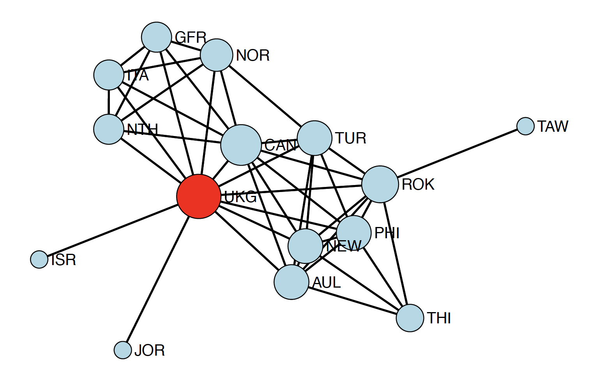

In the [previous tutorial](https://aliceaii.github.io/posts/snapart2/), we explored the mathematical foundations of network statistics, learning about degree, centrality, diameter, and more. Now it's time to get our hands dirty with R code! This tutorial will show you how to compute all these measures using real network data.

{width=75%}

This tutorial covers **five major topics** using real-world data:

1. **Centrality Measures**: Identifying important nodes across biological, social, and political networks
2. **Connectivity Analysis**: Understanding network robustness using Renaissance Florence
3. **Degree Distributions**: Modeling connectivity patterns in protein interaction networks
4. **Component Analysis**: Finding connected groups in large biological networks
5. **Temporal Networks**: Analyzing how Cold War alliances evolved over time

By the end, you'll have a complete toolkit for analyzing networks in any domain!

We'll use the exact same datasets with [SNA Part1](https://aliceaii.github.io/posts/snapart1/), so you can directly compare how different statistics reveal different aspects of network structure. By the end, you'll be able to conduct a complete network analysis on your own data!

```{r, message=FALSE, warning=FALSE}
rm(list = ls())
library(networkdata)  
library(sna)          #network analysis
library(network)      #network objects
library(degreenet)    #degree distribution modeling
library(knitr)      

set.seed(123)
```

## 1. Centrality Analysis Across Three Networks

In this section, we'll analyze three networks to see how centrality varies by context:

- Dataset 1: Protein-Protein Interaction (PPI) Network
- Dataset 2: Add Health 9 Friendship Network
- Dataset 3: Highland Tribes Network

```{r data-prep, message=FALSE, warning=FALSE}
data(butland_ppi)
data(addhealth9)
data(tribes)

#process addHealth: boys only, largest component
inds <- which(addhealth9$X[, "female"] == 0)
myedges <- (addhealth9$E[, 1] %in% inds) * (addhealth9$E[, 2] %in% inds) == 1
myedges <- addhealth9$E[myedges, ]
tmp <- component.largest(as.network(myedges[, c(1:2)], directed = FALSE), 
                         result = "graph")
addh9 <- as.network(tmp, directed = FALSE)

#process PPI:extract largest component
bppi <- as.network(component.largest(as.network(butland_ppi, directed = FALSE), 
                                     result = "graph"), 
                   directed = FALSE)

#process tribes: positive relationships only
tribe <- as.network(component.largest(as.network(tribes[, , "pos"], directed = FALSE), 
                                      result = "graph"), 
                    directed = FALSE)

cat("Network Sizes:\n")
cat("PPI:", network.size(bppi), "proteins,", network.edgecount(bppi), "interactions\n")
cat("Add Health 9:", network.size(addh9), "students,", network.edgecount(addh9), "friendships\n")
cat("Tribes:", network.size(tribe), "tribes,", network.edgecount(tribe), "alliances\n")
```

### 1.1 Eigenvector Centrality: Quality Over Quantity

You're important if you're connected to other important nodes. It's not just *how many* connections you have, but *who* you're connected to.

Node-level eigenvector centrality and distribution:

```{r eigenvector, fig.height=4, fig.width=12, message=FALSE, warning=FALSE}
#compute eigenvector centrality
ev_ppi <- evcent(bppi, gmode = "graph")
ev_addh9 <- evcent(addh9, gmode = "graph")
ev_tribe <- evcent(tribe, gmode = "graph")

#summary statistics
ev_summary <- data.frame(
  Network = c("PPI", "Add Health 9", "Tribes"),
  Min = c(min(ev_ppi), min(ev_addh9), min(ev_tribe)),
  Q1 = c(quantile(ev_ppi, 0.25), quantile(ev_addh9, 0.25), quantile(ev_tribe, 0.25)),
  Median = c(median(ev_ppi), median(ev_addh9), median(ev_tribe)),
  Mean = c(mean(ev_ppi), mean(ev_addh9), mean(ev_tribe)),
  Q3 = c(quantile(ev_ppi, 0.75), quantile(ev_addh9, 0.75), quantile(ev_tribe, 0.75)),
  Max = c(max(ev_ppi), max(ev_addh9), max(ev_tribe)),
  SD = c(sd(ev_ppi), sd(ev_addh9), sd(ev_tribe))
)

kable(ev_summary, digits = 4, caption = "Eigenvector Centrality: Summary Statistics")

#visualize distributions
par(mfrow = c(1, 3))
hist(ev_ppi, main = "PPI Network", xlab = "Eigenvector Centrality",
     col = "lightblue", breaks = 20)
hist(ev_addh9, main = "Add Health 9 Network", xlab = "Eigenvector Centrality",
     col = "lightcoral", breaks = 20)
hist(ev_tribe, main = "Tribes Network", xlab = "Eigenvector Centrality",
     col = "lightgreen", breaks = 20)
```

Network-level ev centralization:

```{r evcent-centralization, message=FALSE, warning=FALSE}
ev_central_ppi <- centralization(bppi, evcent, mode = "graph")
ev_central_addh9 <- centralization(addh9, evcent, mode = "graph")
ev_central_tribe <- centralization(tribe, evcent, mode = "graph")

cat("Eigenvector Centralization:\n")
cat("PPI:", round(ev_central_ppi, 3))
cat("Add Health 9:", round(ev_central_addh9, 3))
cat("Tribes:", round(ev_central_tribe, 3))
```

Box plot of evcent and degree:

```{r, message=FALSE, warning=FALSE, fig.width=12, fig.height=12}
par(mfrow = c(2, 2))

boxplot(sna::evcent(bppi, gmode="graph")~degree(bppi, gmode="graph"),
      xlab="Degree",
      ylab="Eigenvalue Centrality",
      main="Butland PPI",
      col="lightblue")

boxplot(sna::evcent(addh9, gmode="graph")~degree(addh9, gmode="graph"),
      xlab="Degree",
      ylab="Eigenvalue Centrality",
      main="Add Health 9",
      col="lightcoral")

boxplot(sna::evcent(tribe, gmode="graph")~degree(tribe, gmode="graph"),
      xlab="Degree",
      ylab="Eigenvalue Centrality",
      main="Tribes",
      col="lightgreen")
```

### 1.2 Closeness Centrality: Efficiency in Reaching Others

How quickly can you reach everyone else? High closeness means short paths to all other nodes—efficient for spreading information.

```{r closeness, message=FALSE, warning=FALSE, fig.width=12, fig.height=4}
close_ppi <- closeness(bppi, gmode = "graph")
close_addh9 <- closeness(addh9, gmode = "graph")
close_tribe <- closeness(tribe, gmode = "graph")

close_summary <- data.frame(
  Network = c("PPI", "Add Health 9", "Tribes"),
  Min = c(min(close_ppi), min(close_addh9), min(close_tribe)),
  Median = c(median(close_ppi), median(close_addh9), median(close_tribe)),
  Mean = c(mean(close_ppi), mean(close_addh9), mean(close_tribe)),
  Max = c(max(close_ppi), max(close_addh9), max(close_tribe)),
  SD = c(sd(close_ppi), sd(close_addh9), sd(close_tribe))
)

kable(close_summary, digits = 4, caption = "Closeness Centrality: Summary Statistics")

par(mfrow = c(1, 3))
hist(close_ppi, main = "PPI", xlab = "Closeness", col = "lightblue", breaks = 20)
hist(close_addh9, main = "Add Health 9", xlab = "Closeness", col = "lightcoral", breaks = 20)
hist(close_tribe, main = "Tribes", xlab = "Closeness", col = "lightgreen", breaks = 20)

close_central_ppi <- centralization(bppi, closeness, mode = "graph")
close_central_addh9 <- centralization(addh9, closeness, mode = "graph")
close_central_tribe <- centralization(tribe, closeness, mode = "graph")

cat("PPI:", round(close_central_ppi, 3), "\n")
cat("Add Health 9:", round(close_central_addh9, 3), "→ Very distributed (cohesive friendships)\n")
cat("Tribes:", round(close_central_tribe, 3), "→ Clear geographic/political positioning\n")
```

Box plot of closeness and degree:

```{r, message=FALSE, warning=FALSE, fig.width=12, fig.height=12}
par(mfrow = c(2, 2))

boxplot(sna::closeness(bppi, gmode="graph")~degree(bppi, gmode="graph"),
      xlab="Degree",
      ylab="Closeness Centrality",
      main="Butland PPI",
      col="lightblue")

boxplot(sna::closeness(addh9, gmode="graph")~degree(addh9, gmode="graph"),
      xlab="Degree",
      ylab="Closeness Centrality",
      main="Add Health 9",
      col="lightcoral")

boxplot(sna::closeness(tribe, gmode="graph")~degree(tribe, gmode="graph"),
      xlab="Degree",
      ylab="Closeness Centrality",
      main="Tribes",
      col="lightgreen")
```


### 1.3 Betweenness Centrality: Bridges and Brokers

How often do you lie on shortest paths between others? High betweenness means you're a bridge connecting different parts of the network.

```{r betweenness, message=FALSE, warning=FALSE, fig.width=12, fig.height=4}
btw_ppi <- betweenness(bppi, gmode = "graph")
btw_addh9 <- betweenness(addh9, gmode = "graph")
btw_tribe <- betweenness(tribe, gmode = "graph")

btw_summary <- data.frame(
  Network = c("PPI", "Add Health 9", "Tribes"),
  Min = c(min(btw_ppi), min(btw_addh9), min(btw_tribe)),
  Median = c(median(btw_ppi), median(btw_addh9), median(btw_tribe)),
  Mean = c(mean(btw_ppi), mean(btw_addh9), mean(btw_tribe)),
  Max = c(max(btw_ppi), max(btw_addh9), max(btw_tribe)),
  SD = c(sd(btw_ppi), sd(btw_addh9), sd(btw_tribe))
)

kable(btw_summary, digits = 2, caption = "Betweenness Centrality: Summary Statistics")

par(mfrow = c(1, 3))
hist(btw_ppi, main = "PPI", xlab = "Betweenness", col = "lightblue", breaks = 30)
hist(btw_addh9, main = "Add Health 9", xlab = "Betweenness", col = "lightcoral", breaks = 30)
hist(btw_tribe, main = "Tribes", xlab = "Betweenness", col = "lightgreen", breaks = 30)

btw_central_ppi <- centralization(bppi, betweenness, mode = "graph")
btw_central_addh9 <- centralization(addh9, betweenness, mode = "graph")
btw_central_tribe <- centralization(tribe, betweenness, mode = "graph")

cat("PPI:", round(btw_central_ppi, 3), "\n")
cat("Add Health 9:", round(btw_central_addh9, 3), "\n")
cat("Tribes:", round(btw_central_tribe, 3), "→ Critical bridge tribes\n")
```

Box plot of betweenness and degree:

```{r, message=FALSE, warning=FALSE, fig.width=12, fig.height=12}
par(mfrow = c(2, 2))

boxplot(sna::betweenness(bppi, gmode="graph")~degree(bppi, gmode="graph"),
      xlab="Degree",
      ylab="Betweenness Centrality",
      main="Butland PPI",
      col="lightblue")

boxplot(sna::betweenness(addh9, gmode="graph")~degree(addh9, gmode="graph"),
      xlab="Degree",
      ylab="Betweenness Centrality",
      main="Add Health 9",
      col="lightcoral")

boxplot(sna::betweenness(tribe, gmode="graph")~degree(tribe, gmode="graph"),
      xlab="Degree",
      ylab="Betweenness Centrality",
      main="Tribes",
      col="lightgreen")

```

::: {.callout-note}
Betweenness is usually right-skewed. Most nodes have near-zero betweenness (they're not on many shortest paths), while a few "broker" nodes have extremely high values. 
:::

### 1.4 Degree Centrality: The Simple Count

Don't forget the basics! **Degree** just counts direct connections. Often the most interpretable measure.

```{r degree, message=FALSE, warning=FALSE, fig.width=12, fig.height=4}
deg_ppi <- degree(bppi, gmode = "graph")
deg_addh9 <- degree(addh9, gmode = "graph")
deg_tribe <- degree(tribe, gmode = "graph")

degree_summary <- data.frame(
  Network = c("PPI", "Add Health 9", "Tribes"),
  Min = c(min(deg_ppi), min(deg_addh9), min(deg_tribe)),
  Median = c(median(deg_ppi), median(deg_addh9), median(deg_tribe)),
  Mean = c(mean(deg_ppi), mean(deg_addh9), mean(deg_tribe)),
  Max = c(max(deg_ppi), max(deg_addh9), max(deg_tribe))
)

kable(degree_summary, digits = 2, caption = "Degree: Summary Statistics")

par(mfrow = c(1, 3))
hist(deg_ppi, main = "PPI", xlab = "Degree", col = "lightblue", breaks = 20)
hist(deg_addh9, main = "Add Health 9", xlab = "Degree", col = "lightcoral", breaks = 20)
hist(deg_tribe, main = "Tribes", xlab = "Degree", col = "lightgreen", breaks = 10)

deg_central_ppi <- centralization(bppi, degree, mode = "graph")
deg_central_addh9 <- centralization(addh9, degree, mode = "graph")
deg_central_tribe <- centralization(tribe, degree, mode = "graph")
```

### 1.5 Comparing All Four Centrality Measures

Do different centrality measures agree? Let's check correlations:

```{r centrality-correlations, message=FALSE, warning=FALSE}
#PPI network correlations
cent_ppi <- cbind(Degree = deg_ppi, Eigenvector = ev_ppi, 
                  Closeness = close_ppi, Betweenness = btw_ppi)
cor_ppi <- cor(cent_ppi)
kable(cor_ppi, digits = 3, caption = "Centrality Correlations: PPI Network")

#Add Health 9 correlations
cent_addh9 <- cbind(Degree = deg_addh9, Eigenvector = ev_addh9, 
                    Closeness = close_addh9, Betweenness = btw_addh9)
cor_addh9 <- cor(cent_addh9)
kable(cor_addh9, digits = 3, caption = "Centrality Correlations: Add Health 9 Network")

#Tribes correlations
cent_tribe <- cbind(Degree = deg_tribe, Eigenvector = ev_tribe, 
                    Closeness = close_tribe, Betweenness = btw_tribe)
cor_tribe <- cor(cent_tribe)
kable(cor_tribe, digits = 3, caption = "Centrality Correlations: Tribes Network")
```

Summary: network centralization comparison

```{r centralization-summary, message=FALSE, warning=FALSE}
centralization_df <- data.frame(
  Network = c("PPI", "Add Health 9", "Tribes"),
  Degree = c(deg_central_ppi, deg_central_addh9, deg_central_tribe),
  Closeness = c(close_central_ppi, close_central_addh9, close_central_tribe),
  Betweenness = c(btw_central_ppi, btw_central_addh9, btw_central_tribe),
  Eigenvector = c(ev_central_ppi, ev_central_addh9, ev_central_tribe)
)

kable(centralization_df, digits = 3, 
      caption = "Network Centralization: Comprehensive Comparison")
```

```{r, message=FALSE, warning=FALSE}
library(corrplot)

tmp <- cbind(deg=degree(bppi, gmode="graph"),
              eigen=sna::evcent(bppi, gmode="graph"),
              close=closeness(bppi, gmode="graph"),
              between=betweenness(bppi, gmode="graph"))
pairs(tmp,main="Butland PPI",col="lightblue",pch=20)

corrplot(cor(tmp))
title(main="Butland PPI", cex=1, line = 0)


tmp <- cbind(deg=degree(addh9, gmode="graph"),
              eigen=sna::evcent(addh9, gmode="graph"),
              close=closeness(addh9, gmode="graph"),
              between=betweenness(addh9, gmode="graph"))
pairs(tmp,main="Add Health 9",col="lightcoral",pch=20)

corrplot(cor(tmp), is.corr = TRUE)
title(main="Add Health 9", cex=1, line = 0)

tmp <- cbind(deg=degree(tribe, gmode="graph"),
              eigen=sna::evcent(tribe, gmode="graph"),
              close=closeness(tribe, gmode="graph"),
              between=betweenness(tribe, gmode="graph"))
pairs(tmp,main="Tribes",col="lightgreen",pch=20)

corrplot(cor(tmp))
title(main="Tribes", cex=1, line = 0)

```


::: {.callout-important}
Each quantity measures different aspects of the network. Degree, the simplest centrality measure, is just a count of alters. One can be connected to many alters. But, those alters may not be highly connected themselves. This would imply a low eigenvalue centrality - the
best one dimensional approximation of the adjacency matrix. A node that is connected to few alters can high closeness if their alters are connected to many others via short paths. Finally, betweenness captures the extent to which nodes resides on geodesics connecting other nodes. A node could have eigenvalue centrality by virtue of being connected to “central” nodes, but if the nodes does not reside on geodesics, her betweenness will be low relative to other nodes. Clearly, the various measures are correlated, but all capture slightly different formulations of what it means to be central in a network.

- **Degree & Eigenvector** often correlate highly (popular nodes tend to know popular people)
- **Betweenness** often correlates weakly with other kinds of centrality (bridges aren't always hubs)
- **Closeness** depends on overall network structure
- Always compute multiple measures, each reveals different aspects of importance.
:::

## 2. Connectivity & Robustness Analysis

Let's shift to Renaissance Florence (the Florentine Marriage Network) to study **network connectivity**. How robust is a network to node removal?

```{r florentine-setup, message=FALSE, warning=FALSE, fig.width=7, fig.height=6}
data(florentine)

flo_lc <- as.network(component.largest(flomarriage, result = "graph"), 
                     directed = FALSE)

network.vertex.names(flo_lc)

```

### 2.1 Finding cutpoints: critical nodes

A **cutpoint** (or articulation point) is a node whose removal disconnects the network. These are structurally critical positions.

```{r cutpoints, fig.width=7, fig.height=6}
cutpoints_indicator <- cutpoints(flo_lc, mode = "graph", return.indicator = TRUE)
cutpoint_families <- network.vertex.names(flo_lc)[which(cutpoints_indicator == 1)]

cat("Cutpoint families (critical bridges):\n")
print(cutpoint_families)
cat("\nNumber of cutpoints:", length(cutpoint_families), "\n")

plot(flo_lc, 
     vertex.col = ifelse(cutpoints_indicator == 1, "red", "lightblue"),
     vertex.cex = 2,
     displaylabels = TRUE,
     label.cex = 0.8,
     main = "Florentine Marriage Network\n(Cutpoints in Red)")
```

::: {.callout-tip}
Cutpoint families are **structural bridges**. Their removal would fragment the network:

- Removing a cutpoint increases the number of components
- These families have unique structural importance beyond degree or centrality
- In alliance networks, cutpoints are vulnerable attack targets

The Florentine network has `r length(cutpoint_families)` cutpoints, showing moderate robustness.
:::

### 2.2 Vertex Connectivity vs Edge Connectivity

The density of a network can be used as a measure of connectivity. 

For vertex-connectivity and edge-connectivity, we can use the number of nodes needed to disconnect the graph and the number edges one needs to remove to disconnect the graph, respectively. The minimal sets of vertices are computed below using the `min_separators` function.

**Vertex connectivity (κ):** Minimum number of nodes to remove to disconnect the network  
**Edge connectivity (λ):** Minimum number of edges to remove to disconnect the network

For Florentine marriages:

- Vertex connectivity = 1 (because cutpoints exist—removing one node disconnects it, such as Pazzi)
- Edge connectivity = 1 (because cutpoints exist—removing one edge disconnects it, such as the line between Albizzi and Ginori)

```{r, message=FALSE, warning=FALSE}
library(igraph)
library(intergraph)
network.density(flo_lc)

edge_connectivity(asIgraph(flo_lc))

vertex_connectivity(asIgraph(flo_lc))

tmp <- min_separators(asIgraph(flo_lc))
print(as.numeric(tmp))   # 2-"Albizzi", 7-Guadagni", 9-"Medici", 13-"Salviati".

print(min_cut(asIgraph(flo_lc),value.only=F)$cut)
```

::: {.callout-note}
Application Importance: 

- **Social networks:** Cutpoints are key brokers; losing them fragments communities
- **Infrastructure:** Cutpoints are failure points in transportation/communication networks
- **Organizational networks:** Cutpoints identify critical personnel for knowledge transfer
:::

## 3. Degree Distribution and Degree Distribution Modeling

The Yeast Protein Interaction Network. Now let's analyze a large biological network to understand **degree distributions**, the pattern of connectivity across nodes.

```{r yeast-load, eval=FALSE}
yeast_data <- read.table("CCSB-Y2H.txt", 
                         header = FALSE, sep = "\t", stringsAsFactors = FALSE)
yeast_edgelist <- yeast_data[, 1:2]

#check self-loops
sum(yeast_edgelist[,1] == yeast_edgelist[,2]) #total have 168 self-loops

#remove self-loops
yeast_edgelist_clean <- yeast_edgelist[yeast_edgelist[, 1] != yeast_edgelist[, 2], ]

cat("Original edges:", nrow(yeast_edgelist), "\n")
cat("Edges after removing self-loops:", nrow(yeast_edgelist_clean), "\n")
```

### 3.1 Creating directed network and computing degrees

```{r yeast-directed, message=FALSE, warning=FALSE, fig.width=12, fig.height=4}
#create directed network
yeast_edgelist_clean <- butland_ppi

yeast_net <- network(yeast_edgelist_clean, matrix.type = "edgelist", directed = TRUE)

# Compute degree sequences
out_deg <- apply(yeast_net[,], 1, sum)
table(out_deg)
in_deg <- apply(yeast_net[,], 2, sum)
table(in_deg)
total_deg <- out_deg + in_deg
table(total_deg)

# Check correlation
cor_in_out <- cor(in_deg, out_deg)
cat("Correlation between in-degree and out-degree:", round(cor_in_out, 3), "\n")

# Visualize degree distributions
par(mfrow = c(1, 3))
hist(out_deg, breaks = 30, main = "Out-Degree Distribution",
     xlab = "Out-Degree", col = "lightblue", cex.main = 1.5)
hist(in_deg, breaks = 30, main = "In-Degree Distribution",
     xlab = "In-Degree", col = "lightgreen", cex.main = 1.5)
hist(total_deg, breaks = 30, main = "Total Degree Distribution",
     xlab = "Total Degree", col = "lightcoral", cex.main = 1.5)
```

### 3.2 Fitting degree distribution models

Many biological networks show **heavy-tailed** degree distributions (a few "hub" proteins with many connections). Let's test different statistical models:

```{r degree-models, message=FALSE, warning=FALSE}
#fit various degree distribution models
#note: These require the degreenet package

#1.Discrete Pareto/Zipf (power law)
dpml_fit <- adpmle(total_deg, cutoff = 1)
dpml_fit$theta

#2.Yule distribution
yule_fit <- ayulemle(total_deg, cutoff = 1)
yule_fit$theta

#3.Waring distribution
waring_fit <- awarmle(total_deg, cutoff = 1)
waring_fit$theta

#4.Poisson distribution
pois_fit <- apoimle(total_deg, cutoff = 1)
pois_fit$theta

#5.Conway-Maxwell-Poisson
cmp_fit <- acmpmle(total_deg, cutoff = 1)
cmp_fit$theta
```

::: {.callout-note}
## Common Degree Distributions in Real Networks
- **Power law (Zipf/Yule):** "Scale-free" networks. Common in biological, social, and technological networks. A few hubs dominate.
- **Poisson:** Random networks. Most nodes have similar degree around the mean.
- **Waring:** Overdispersed. More variability than Poisson.
- **CMP:** Flexible—can be overdispersed or underdispersed.

Protein interaction networks typically show power-law-like distributions.
:::

### 3.3 How can we compare the fits of the different models?

We can use the `lldpall()`, etc, functions to compute the corrected AIC and the BIC for the models.

```{r, message=FALSE, warning=FALSE}

dpml_results <- lldpall(v = dpml_fit$theta, x = total_deg, cutoff = 1)
yule_results <- llyuleall(v = yule_fit$theta, x = total_deg, cutoff = 1)
war_results <- llwarall(v = waring_fit$theta, x = total_deg, cutoff = 1)
poi_results <- llpoiall(v = pois_fit$theta, x = total_deg, cutoff = 1)

model_comparison <- data.frame(
    Model = c("Discrete Pareto/Zipf", "Yule", "Waring", "Poisson"),
    Parameters = c(dpml_results[1], yule_results[1], war_results[1], poi_results[1]),
    Log_Likelihood = c(dpml_results[2], yule_results[2], war_results[2], poi_results[2]),
    AICC = c(dpml_results[3], yule_results[3], war_results[3], poi_results[3]),
    BIC = c(dpml_results[4], yule_results[4], war_results[4], poi_results[4])
    )

kable(model_comparison, digits = 2,
col.names = c("Model", "Parameters", "Log-Likelihood", "AIC", "BIC"),
caption = "Degree Distribution Model Comparison")
```


## 4. Component Analysis

### 4.1 Finding giant components in large networks

When networks are large and potentially fragmented, **component analysis** is crucial. Let's analyze the undirected yeast network:

```{r components, message=FALSE, warning=FALSE, fig.width=8, fig.height=6}
yeast_net_undirected <- network(yeast_edgelist_clean, 
                                matrix.type = "edgelist", 
                                directed = FALSE)

cat("Network size:", network.size(yeast_net_undirected), "proteins\n")
cat("Number of edges:", network.edgecount(yeast_net_undirected), "interactions\n\n")

comp_dist <- component.dist(yeast_net_undirected)
sorted_sizes <- sort(comp_dist$csize, decreasing = TRUE)

cat("Number of components:", length(comp_dist$csize), "\n")
cat("Largest component size:", sorted_sizes[1], "proteins\n")
cat("Second largest:", sorted_sizes[2], "proteins\n")
cat("Component sizes:", head(sorted_sizes, 10), "\n")
```

### 4.2 Does It Have a Giant Component?

A **giant component** is one that contains a substantial fraction of all nodes (typically >50%). 

```{r giant-component}
n_total <- network.size(yeast_net_undirected)
largest_size <- max(comp_dist$csize)
proportion_in_largest <- largest_size / n_total

cat("Proportion in largest component:", round(proportion_in_largest, 3), "\n")

if (proportion_in_largest > 0.5) {
  cat("YES - This network has a GIANT COMPONENT!\n")
  cat("Interpretation: Most proteins are interconnected in one large interaction network.\n")
} else {
  cat("NO giant component - network is highly fragmented.\n")
}
```

### 4.4 Visualizing the yeast network and largest component

```{r plot-largest-component, fig.width=7, fig.height=7}

yeast_net.weak <- (yeast_net[,] == 1 | t(yeast_net[,]) == 1)

yeast_net.weak <- network(yeast_net.weak,directed=FALSE)
plot(yeast_net.weak,
     vertex.col = "lightblue",
     edge.col = rgb(0.5, 0.5, 0.5, 0.2),
     displayisolates=FALSE)


cdist <- component.dist(yeast_net.weak)
plot(yeast_net.weak,vertex.cex=1*(cdist$membership==1),
     vertex.col = "lightblue",
     edge.col = rgb(0.5, 0.5, 0.5, 0.2))


str(cdist)
#cdist$membership
#largest component plot
ccsb1 <- network(as.sociomatrix(yeast_net.weak)[cdist$membership==1,cdist$membership==1], 
                 vertex.col = "lightblue",directed=FALSE)
plot(ccsb1,displayisolates=FALSE, vertex.col = "lightblue")
```

### 4.5 Geodesic Distance Analysis

For the full network, let's analyze **geodesic distances** (shortest paths):

There are 45 isolates in the undirected network.

```{r geodesic-analysis, message=FALSE, warning=FALSE, fig.width=7, fig.height=5}
gdist = geodist(yeast_net.weak)
table(gdist$gdist)
table(cdist$membership)

mean(gdist$gdist[!is.infinite(gdist$gdist)])

#the number of isolates
sum(apply(yeast_net.weak[,],1,sum)==0)
```

::: {.callout-note}
- **Proportion reachable:** Shows how connected the network is overall
- **Mean geodesic distance:** Average "degrees of separation" in the network
- **Distribution shape:** Tells us if distances are uniform or if some pairs are very far apart

Small-world networks have short average distances despite large size!
:::

## 5. Temporal Network Analysis - Cold War Dynamics

So far, we've analyzed **static** networks—single snapshots. But many real networks evolve! Let's analyze **Cold War cooperation networks from 1950-1985**.

Load the Cold War dataset.

```{r coldwar-load, message=FALSE, warning=FALSE}
data(coldwar)

#This is a 3D array: 66 countries × 66 countries × 8 time periods
cc_array <- coldwar$cc   #cooperation and conflict network
countries <- dimnames(coldwar$cc)[[1]]
years <- dimnames(coldwar$cc)[[3]]

cat("Dataset structure:\n")
cat("Countries:", length(countries), "\n")
cat("Time periods:", length(years), "\n")
cat("Years:", years, "\n")
```

### 5.1 Analyzing components across time

For each year, let's identify the two largest alliance blocs:

```{r coldwar-components, message=FALSE, warning=FALSE, fig.width=8, fig.height=7}
net <- apply(coldwar$cc, c(1,2), sum)
net <- network(net > 0)
plot(net, displaylabels = TRUE)
```
Here is some basic code to view the time-dependent components using sna:

```{r coldwar-summary}
year <- 1950
for(i in 1:8){
  net <- network(ifelse(coldwar$cc[, , i] > 0, coldwar$cc[, , i], 0))
  cd <- component.dist(net)
  c1 <- order(cd$csize, decreasing = TRUE)[1]
  c2 <- order(cd$csize, decreasing = TRUE)[2]
  print(year)
  print(row.names(coldwar$cc[, , 1])[which(cd$membership == c1)])
  print(row.names(coldwar$cc[, , 1])[which(cd$membership == c2)])
  year <- year + 5
}
```

::: {.callout-note}
Looking at these patterns, we can see: the two largest connected components are usually made up of the USA and its allies in one component, with the USSR and its allies in the other component.

- **Largest components** consistently center around the US and key allies (UK, Australia, Canada, South Korea)
- **Component sizes fluctuate** dramatically—from 2 countries (1975) to 9 countries (1970)
- **Second-largest components** are strikingly small, occasionally including Soviet-aligned nations
- This fragmentation reflects **Cold War bipolarity**: distinct Western and Eastern blocs with limited cooperation
:::


## 6. Summary: Key Functions Reference

Here's a quick reference of all the key functions we've covered:

**Basic Properties**

| Function | Purpose | Example |
|----------|---------|---------|
| `network.size()` | Number of nodes | `network.size(nw)` |
| `network.edgecount()` | Number of edges | `network.edgecount(nw)` |
| `is.directed()` | Check if directed | `is.directed(nw)` |
| `gden()` | Network density | `gden(nw)` |

**Connectivity**

| Function | Purpose | Example |
|----------|---------|---------|
| `component.dist()` | Find components | `component.dist(nw)` |
| `get.inducedSubgraph()` | Extract subnetwork | `get.inducedSubgraph(nw, v = nodes)` |
| `cutpoints()` | Find articulation points | `cutpoints(nw, mode = "graph")` |

**Distance Measures**

| Function | Purpose | Example |
|----------|---------|---------|
| `geodist()` | All pairwise distances | `geodist(nw)` |
| Distance matrix | Shortest path lengths | `geodist(nw)$gdist` |

**Node-Level Centrality**

| Function | Purpose | Example |
|----------|---------|---------|
| `degree()` | Degree centrality | `degree(nw, gmode = "graph")` |
| `closeness()` | Closeness centrality | `closeness(nw, gmode = "graph")` |
| `betweenness()` | Betweenness centrality | `betweenness(nw, gmode = "graph")` |
| `evcent()` | Eigenvector centrality | `evcent(nw, gmode = "graph")` |

**Network-Level Measures**

| Function | Purpose | Example |
|----------|---------|---------|
| `centralization()` | Network centralization | `centralization(nw, degree, mode = "graph")` |
| `max(eccentricity)` | Network diameter | `max(apply(dist_matrix, 1, max))` |

**Degree Distribution Modeling**

| Function | Purpose | Example |
|----------|---------|---------|
| `adpmle()` | Fit Zipf/Pareto | `adpmle(degree_sequence)` |
| `ayulemle()` | Fit Yule | `ayulemle(degree_sequence)` |
| `awarmle()` | Fit Waring | `awarmle(degree_sequence)` |
| `apoimle()` | Fit Poisson | `apoimle(degree_sequence)` |
| `acmpmle()` | Fit CMP | `acmpmle(degree_sequence)` |

**Temporal Network Analysis**

| Technique | Purpose | Code Pattern |
|----------|---------|---------|
| Loop through time | Analyze each period | `for(i in 1:n_periods) {...}` |
| Track components | Monitor evolution | `component.dist(net_t)` |
| Aggregation | Combine over time | `apply(array, c(1,2), sum)` |

### 6.6 Important Arguments

- **`gmode`**: For undirected networks use `gmode = "graph"`, for directed use `gmode = "digraph"`
- **`cmode`**: For directed degree, use `cmode = "indegree"` or `cmode = "outdegree"`
- **`mode`**: Similar to gmode—use `mode = "graph"` for undirected networks
- call `sna::degree(net2, gmode='graph')` when package conflict
