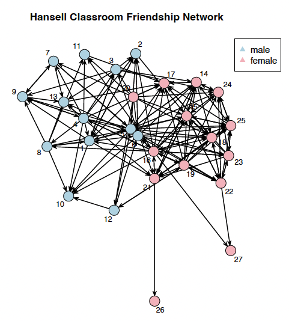

Welcome to Part 4 of our Social Network Analysis tutorial series! In this post, we'll dive into the theoretical foundations of statistical network models and introduce the powerful **ERGM (Exponential Random Graph Model)** package in R.


In this tutorial, we'll cover:

- Basic network models: from simple to complex
- The `ergm` package and its key functions
- Understanding model comparison and fit statistics
- Theoretical foundations for network modeling

Let's get started!

## 1. Understanding Network Models

### 1.1 The Null Model

The **null model** is our baseline assumption: this null hypothesis assumes all possible networks are equally likely. Think of it as the "no information" model where we assume complete randomness.

$$P(Y = y) = \frac{1}{2^N}$$

where $N$ is the total number of possible ties (for a directed network: $N = n(n-1)$; for undirected: $N = \frac{n(n-1)}{2}$).

**Key insight**: The null model provides our reference point for comparison. Any other model should do better than this!

::: {.callout-note}
What does "all possible networks are equally likely" mean?
- The null model says every **configuration of the entire network** has the same probability
- This is different from saying each **individual tie** has the same probability


In the null model, each possible network configuration (a complete pattern of who's connected to whom) is equally probable. But when we look at individual ties within these configurations:

- **Individual ties ARE equally likely** - each has a 50% chance of existing
- **But** the model makes no assumptions about which specific ties will form
- All $2^N$ possible network structures have equal probability $\frac{1}{2^N}$

Example:

Imagine a tiny network with just 3 people (A, B, C) in a directed network:

- Number of possible ties: $N = 3 \times 2 = 6$ (A→B, A→C, B→A, B→C, C→A, C→B)
- Number of possible networks: $2^6 = 64$
- Under the null model: each of these 64 configurations is equally likely (probability = 1/64)

Some possible configurations:

1. No ties at all (empty network)
2. Only A→B exists
3. All ties exist (complete network)
4. A→B and B→C exist
5. ... (60 more configurations)

Each of these 64 distinct networks has equal probability!

 Why is this the "null" model?

- It represents **maximum ignorance** - we know nothing about what drives tie formation
- No structure, no preferences, no patterns
- Pure randomness
- It's our statistical "null hypothesis" - what we compare other models against
- Any real social network that deviates significantly from this is showing us there's *structure* we need to explain
:::

### 1.2 Homogeneous Bernoulli Model (Erdős-Rényi Model)

The simplest non-trivial model: each tie has the same probability $p$ of existing, independent of all other ties.

#### Mathematical Formulation

$$P(Y_{ij} = 1) = p \quad \forall i, j = 1, \ldots, n$$
Or in log-odds form:

$$\log\text{odds}(Y_{ij} = 1) = \beta \quad \forall i, j$$
where $\beta = \log\left(\frac{p}{1-p}\right)$.

#### Exponential Family Form

$$P(Y = y | \beta) = \frac{e^{\beta g(y)}}{\kappa(\beta)}$$
where:

- $g(y) = \sum_{i,j} y_{ij}$ is the number of edges
- $\kappa(\beta) = [1 + \exp(\beta)]^N$ is the normalizing constant


- **Parameter**: $\beta$ (log-odds of a tie)
- **Statistic**: $g(y) = \sum_{i,j} y_{ij}$ Total number of edges. The model is using the count of edges as the key feature to describe the network.
- **Assumption**: All dyads are independent and identically distributed
- **Limitation**: Doesn't capture real-world network features like clustering or degree heterogeneity

### 1.3 Modeling Cohesive Subgroups

Real networks often have **communities** or **groups**. People tend to form ties within their groups more than across groups. This is called **homophily**: "birds of a feather flock together."

#### Homophily Model

Assumes actors have a preference for same-group ties:

$$\log\text{odds}(Y_{ij} = 1) = \beta_0 + \beta_1 \cdot \mathbb{1}(\text{same group})$$


In `ergm` syntax:
```r
ergm(network ~ edges + nodematch("attribute"))
```

#### Differential Homophily Model

Different groups may have different levels of within-group preference:

$$\log\text{odds}(Y_{ij} = 1) = \beta_0 + \beta_{\text{group}_i} \cdot \mathbb{1}(\text{group}_i = \text{group}_j)$$

In `ergm` syntax:
```r
ergm(network ~ edges + nodematch("attribute", diff = TRUE))
```

#### Full Mixing Model

The most flexible: allows different tie probabilities for every group pair combination:

$$\log\text{odds}(Y_{ij} = 1) = \beta_{ab}$$
where $a$ is the group of node $i$ and $b$ is the group of node $j$.

In `ergm` syntax:
```r
ergm(network ~ nodemix("attribute"))
```
::: {.callout-note}
The mixing model doesn't include a separate `edges` term because each group-pair has its own baseline.
:::

### 1.4 The $p_1$ Model (Holland & Leinhardt, 1981)

The **$p_1$ model** extends the Bernoulli model by allowing for:

1. **Sender effects**: Some nodes are more likely to form outgoing ties
2. **Receiver effects**: Some nodes are more likely to receive incoming ties
3. **Reciprocity**: Mutual ties are more (or less) likely than expected by chance

#### Mathematical Form

$$\log\text{odds}(Y_{ij} = 1) = \beta_0 + \alpha_i + \beta_j + \rho \cdot Y_{ji}$$
where:

- $\beta_0$ is the baseline (edges effect)
- $\alpha_i$ is the sender effect for node $i$
- $\beta_j$ is the receiver effect for node $j$
- $\rho$ is the reciprocity parameter
- $Y_{ji}$ indicates if there's a tie from $j$ to $i$

#### Interpretation

- **Sender coefficients** $(\alpha_i)$: Measure node **centrality** - how active nodes are in forming ties
- **Receiver coefficients** $(\beta_j)$: Measure node **prestige** - how popular/attractive nodes are
- **Mutual coefficient** $(\rho)$: Measures tendency toward reciprocation

#### In Practice

```r
# Fit p1 model with homophily
fit.p1 <- ergm(network ~ edges + nodematch("sex") + 
               sender + receiver + mutual,
               estimate = "MPLE")
```

::: {.callout-note}
We typically use MPLE (Maximum Pseudo-Likelihood Estimation) for $p_1$ models because they can be computationally intensive.
:::


## 2. The ERGM Package: 

The `ergm` package is part of the **statnet** suite and provides comprehensive tools for fitting, simulating, and diagnosing exponential random graph models.

### 2.1 Core Model Fitting Functions

Here's a comprehensive reference table for the main `ergm` functions:

| Function | Purpose | Basic Syntax | Key Parameters |
|----------|---------|--------------|----------------|
| `ergm()` | Fit exponential random graph model | `ergm(network ~ terms)` | `formula`, `reference`, `constraints`, `control` |
| `summary.ergm()` | Display model results | `summary(fit)` | Shows coefficients, SEs, p-values, GOF statistics |
| `simulate.ergm()` | Simulate networks from fitted model | `simulate(fit, nsim=100)` | `nsim`, `seed`, `output` |
| `gof()` | Goodness-of-fit diagnostics | `gof(fit)` | Tests model fit against observed statistics |
| `mcmc.diagnostics()` | MCMC convergence diagnostics | `mcmc.diagnostics(fit)` | Checks if MCMC algorithm converged |

### 2.2 Model Comparison Functions

| Function | Purpose | Usage | Output |
|----------|---------|-------|--------|
| `anova.ergm()` | Compare nested models | `anova(fit1, fit2)` | Likelihood ratio test, AIC, BIC |
| `AIC()` | Akaike Information Criterion | `AIC(fit)` | Lower is better |
| `BIC()` | Bayesian Information Criterion | `BIC(fit)` | Lower is better |
| `logLik()` | Extract log-likelihood | `logLik(fit)` | Model log-likelihood value |

### 2.3 Coefficient Extraction Functions

| Function | Purpose | Usage | Returns |
|----------|---------|-------|---------|
| `coef()` | Extract coefficients | `coef(fit)` | Named vector of estimates |
| `vcov()` | Variance-covariance matrix | `vcov(fit)` | Matrix of variances/covariances |
| `confint()` | Confidence intervals | `confint(fit)` | 95% CIs for parameters |
| `summary()` | Full model summary | `summary(fit)` | Comprehensive output |

### 2.4 Common ERGM Terms (Statistics)

#### Basic Terms

| Term | What It Counts | Syntax | Interpretation |
|------|----------------|--------|----------------|
| `edges` | Number of edges | `edges` | Baseline density |
| `mutual` | Reciprocated ties | `mutual` | Reciprocity tendency |
| `triangle` | Triangles | `triangle` | Transitivity |
| `isolates` | Isolated nodes | `isolates` | Number with degree 0 |

#### Node Attribute Terms

| Term | What It Models | Syntax | Use Case |
|------|----------------|--------|----------|
| `nodematch` | Same-category ties | `nodematch("attr")` | Homophily |
| `nodematch (diff)` | Group-specific homophily | `nodematch("attr", diff=TRUE)` | Different homophily by group |
| `nodemix` | Full mixing matrix | `nodemix("attr")` | All group-pair combinations |
| `nodecov` | Continuous attribute | `nodecov("attr")` | Effect of node attribute on ties |
| `nodefactor` | Categorical attribute | `nodefactor("attr")` | Different effects by category |

#### Degree Terms

| Term | What It Models | Syntax | Purpose |
|------|----------------|--------|---------|
| `degree(k)` | Nodes with exactly k ties | `degree(k)` | Specific degree modeling |
| `gwdegree` | Degree distribution | `gwdegree(decay, fixed=TRUE)` | Prevents degeneracy |
| `sender` | Sender effects ($p_1$) | `sender` | Individual out-degree heterogeneity |
| `receiver` | Receiver effects ($p_1$) | `receiver` | Individual in-degree heterogeneity |

#### Advanced Terms

| Term | What It Models | Syntax | Purpose |
|------|----------------|--------|---------|
| `gwesp` | Geometrically weighted ESP | `gwesp(decay, fixed=TRUE)` | Clustering without degeneracy |
| `gwdsp` | Geometrically weighted DSP | `gwdsp(decay, fixed=TRUE)` | Anti-clustering |
| `altkstar` | Alternating k-stars | `altkstar(lambda, fixed=TRUE)` | Degree distribution |

### 2.5 Understanding `nodematch` vs `nodemix`

This is a crucial distinction that often confuses beginners!

#### `nodematch("attribute")`

**What it does**: Tests if same-category ties are more likely than different-category ties

**Model form**: 
$$\log\text{odds}(Y_{ij} = 1) = \beta_0 + \beta_1 \cdot (\text{same group})$$

**Parameters**: 2 (edges + nodematch)

**Interpretation**: "Do birds of a feather flock together?"

**Example**: 
```r
ergm(network ~ edges + nodematch("sex"))
# Tests: Are same-sex friendships more likely?
```

#### `nodemix("attribute")`

**What it does**: Estimates a separate probability for each group-pair combination

**Model form**:
$$\log\text{odds}(Y_{ij} = 1) = \beta_{ab}$$

**Parameters**: $g^2$ for directed networks (where $g$ is number of groups), or $\frac{g(g+1)}{2}$ for undirected

**Interpretation**: "Who flocks with whom, and how much?"

**Example**:
```r
ergm(network ~ nodemix("sex"))
# Estimates: P(Male→Male), P(Male→Female), P(Female→Male), P(Female→Female)
```

#### Quick Reference

| Aspect | `nodematch` | `nodemix` |
|--------|-------------|-----------|
| **Question** | Is homophily present? | What are all the mixing probabilities? |
| **Parameters** | 2 (+ edges) | Many ($g^2$ or more) |
| **Complexity** | Simpler | More flexible |
| **Use when** | Testing homophily hypothesis | Exploring all group interactions |
| **Includes edges?** | Needs separate `edges` term | No separate `edges` needed |


## 3. Model Fit Statistics: How Good Is Your Model?

### 3.1 Deviance

**Deviance** measures how well the model fits relative to a saturated model:

$$D = -2[\ell(\hat{\beta}) - \ell(\beta_{\text{saturated}})]$$

- **Null deviance**: Deviance of the null model ($\beta = 0$)
- **Residual deviance**: Deviance of the fitted model
- **Model deviance**: Reduction in deviance = Null deviance - Residual deviance

**Interpretation**: Larger reduction = better model fit

### 3.2 AIC and BIC

Both penalize model complexity:

$$\text{AIC} = -2\ell(\hat{\beta}) + 2k$$
$$\text{BIC} = -2\ell(\hat{\beta}) + k\log(n)$$

where $k$ is the number of parameters.

**Rule**: Lower is better! But compare models on the same data.

### 3.3 Likelihood Ratio Test

For nested models:

$$\text{LR} = -2[\ell(\beta_{\text{simpler}}) - \ell(\beta_{\text{complex}})] \sim \chi^2_{\text{df}}$$

where df = difference in number of parameters.

**In R**:
```r
anova(fit1, fit2, fit3)
```

**Interpretation**: Significant p-value means the more complex model fits significantly better.

## 4. Putting It All Together: A Modeling Strategy

Here's a recommended workflow for network modeling:

### Step 1: Start Simple

```r
# Null model baseline
fit.null <- ergm(network ~ edges)
```

### Step 2: Add Effects

```r
# Test homophily
fit.homo <- ergm(network ~ edges + nodematch("group"))

# Test differential homophily
fit.diff.homo <- ergm(network ~ edges + nodematch("group", diff = TRUE))

# Explore full mixing
fit.mix <- ergm(network ~ nodemix("group"))
```

### Step 3: Compare Models

```r
anova(fit.null, fit.homo, fit.diff.homo, fit.mix)
```

### Step 4: Add Individual Heterogeneity (if needed)

```r
# p₁ model
fit.p1 <- ergm(network ~ edges + nodematch("group") + 
               sender + receiver + mutual,
               estimate = "MPLE")
```

### Step 5: Check Diagnostics

```r
# Goodness of fit
gof(fit.homo)

# For MCMC-based fits
mcmc.diagnostics(fit.homo)
```

## 5. Interpreting ERGM Coefficients

### 5.1 From Coefficients to Probabilities

ERGM coefficients are in **log-odds** form. To convert to probabilities:

$$P(\text{tie}) = \frac{\exp(\beta)}{1 + \exp(\beta)} = \text{plogis}(\beta)$$
```r
# Coefficient
beta <- coef(fit)["edges"]

# Probability
prob <- plogis(beta)
# or equivalently
prob <- exp(beta) / (1 + exp(beta))
```

### 5.2 Understanding Odds Ratios

For a term with coefficient $\beta$:

$$\text{Odds Ratio} = \exp(\beta)$$
**Interpretation**:

- OR = 1: No effect
- OR > 1: Positive association (increases odds of tie)
- OR < 1: Negative association (decreases odds of tie)
- OR = 2: Doubles the odds
- OR = 0.5: Halves the odds

### 5.3 Combining Effects

For multiple terms, effects combine **multiplicatively** on the odds scale:

$$\log\text{odds}(Y_{ij} = 1) = \beta_0 + \beta_1 x_1 + \beta_2 x_2$$

**Example**: Probability of same-sex tie in homophily model:

```r
# Log-odds
log_odds_same <- coef(fit)["edges"] + coef(fit)["nodematch.sex"]

# Probability
prob_same <- plogis(log_odds_same)
```

## 6. Common Pitfalls and Recommended Practices

### Pitfalls to Avoid

1. **Degeneracy**: Model produces unrealistic extreme networks
   - Solution: Use geometrically-weighted terms (GWESP, GWDSP)

2. **Non-convergence**: MCMC doesn't converge
   - Solution: Increase `MCMC.burnin` and `MCMC.interval` in control parameters

3. **Near-degeneracy**: Model barely stable
   - Solution: Simplify model or use curved exponential family terms

4. **Overfitting**: Too many parameters for network size
   - Solution: Use model comparison statistics; prefer simpler models

5. **Misinterpreting significance**: Small p-values doesn't mean good fit
   - Solution: Always check goodness-of-fit diagnostics

### Recommended Practices

1. **Always start simple**: Begin with edges-only model
2. **Build up gradually**: Add terms one at a time
3. **Check convergence**: Use `mcmc.diagnostics()` for MCMC-based models
4. **Compare models**: Use `anova()` to test if added complexity is justified
5. **Assess fit**: Use `gof()` to check if model captures key network features
6. **Visualize**: Plot simulated networks to see if they "look right"
7. **Report clearly**: State assumptions, show diagnostics, interpret substantively

### References

- Holland, P. W., & Leinhardt, S. (1981). An exponential family of probability distributions for directed graphs. *Journal of the American Statistical Association*, 76(373), 33-50.

- Hunter, D. R., Handcock, M. S., Butts, C. T., Goodreau, S. M., & Morris, M. (2008). ergm: A package to fit, simulate and diagnose exponential-family models for networks. *Journal of Statistical Software*, 24(3).

---


*This tutorial is based on UCLA [STATS 218: Social Network Analysis](https://handcock.github.io/teaching/218/) taught by Prof [Mark Handcock](https://handcock.github.io/).*
