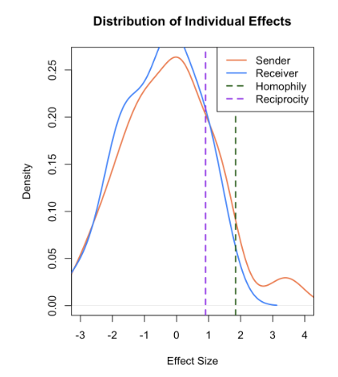

Welcome to Part 5 of our Social Network Analysis tutorial. In this hands-on session, we'll work through three real-world examples of network modeling using ERGM. 


In this tutorial, we'll cover:

- Military cooperation networks: Testing random graph assumptions
- Classroom friendships: Exploring homophily and mixing patterns
- Individual differences: Using the $p_1$ model for centrality and prestige

By the end of this tutorial, you'll know how to fit, interpret, and visualize ERGM results. 

```{r, message=FALSE, warning=FALSE}
rm(list = ls())

library(sna)           # Social network analysis
library(network)       # Network objects
library(networkdata)   # Example datasets
library(ergm)          # Exponential random graph models
```

## Example 1: Testing the Simple Random Graph Model

### 1.1 Background: Cold War Military Cooperation

The `coldwar` dataset contains information on military cooperation and conflict between countries from 1950 through 1985. We'll focus on cooperative relations (positive ties) in the first time period (1950-1954).

**Research Question**: Does this military cooperation network follow a Simple Random Graph (SRG) model, or is there evidence of structure beyond random chance?

### 1.2 Load and Prepare Data

```{r, message=FALSE, warning=FALSE}
data(coldwar)

#examine the data structure
attributes(coldwar)
dimnames(coldwar$cc)
dim(coldwar$cc)  # 66 x 66 matrix
```

The dataset is a 66 × 66 matrix representing 66 countries. Let's focus on cooperative ties (setting negative values to zero):

```{r, message=FALSE, warning=FALSE}
#create network object with only positive (cooperative) ties
cc_net <- network(ifelse(coldwar$cc[,,1] > 0, coldwar$cc[,,1], 0), 
                  directed = FALSE)

#check network attributes
attributes(cc_net)
```

### 1.3 Fit the Simple Random Graph Model

Under the SRG (Erdős-Rényi) model, all ties are equally likely and independent. We fit this model using only the `edges` term:

```{r, message=FALSE, warning=FALSE}
#fit SRG model
srg_modelfit <- ergm(cc_net ~ edges)
summary(srg_modelfit)
```

#### Interpreting the Results

```{r, message=FALSE, warning=FALSE}
#extract the edges coefficient
theta_edge <- coef(srg_modelfit)["edges"]
cat("Log-odds of a tie:", round(theta_edge, 3), "\n")

#convert to probability
prob_tie <- plogis(theta_edge)
cat("Probability of a tie:", round(prob_tie, 4), "\n")

#compare to observed density
ob_density <- network.density(cc_net)
cat("Observed network density:", round(ob_density, 4), "\n")
```

**Key Findings**:

- The coefficient is **-4.02** (log-odds)
- This translates to a tie probability of **0.0176** (about 1.76%)
- The network is very sparse - only 1.76% of possible ties exist
- The MLE probability exactly matches the observed density

### 1.4 Testing Against the SRG Model

Now we'll test if the observed network structure is consistent with an SRG model by examining **degree centralization**.

#### Computing Observed Degree Centralization

```{r, message=FALSE, warning=FALSE}
#calculate observed degree centralization
ob_degree_cc <- sna::centralization(cc_net, sna::degree, mode = "graph")
cat("Observed degree centralization:", round(ob_degree_cc, 4), "\n")
```

#### Simulating Under the SRG Model

```{r, message=FALSE, warning=FALSE}
#define degree centralization function for undirected networks
cd_undirected <- function(net) {
  return(sna::centralization(net, sna::degree, mode = 'graph'))
}

#simulate 1000 networks under the SRG model
set.seed(123)
simulation <- simulate(srg_modelfit, nsim = 1000)

#calculate degree centralization for each simulated network
deg_sim <- sapply(simulation, cd_undirected)

#compare to observed
cat("Mean simulated centralization:", round(mean(deg_sim), 4), "\n")
cat("Proportion >= observed:", mean(deg_sim >= ob_degree_cc), "\n")
cat("Proportion < observed:", mean(deg_sim < ob_degree_cc), "\n")
```

#### Visualization

```{r, message=FALSE, warning=FALSE, fig.width=8, fig.height=5}
#create histogram
hist(deg_sim, breaks = 30, 
     main = "Distribution of Degree Centralization Under SRG Model",
     xlab = "Degree Centralization",
     col = "lightblue",
     border = "white")
abline(v = ob_degree_cc, col = "red", lwd = 2, lty = 2)
text(ob_degree_cc, max(hist(deg_sim, plot = FALSE)$counts) * 0.9,
     labels = "Observed", pos = 4, col = "red", font = 2)
```

#### Formal Test: Conditional Uniform Graph (CUG)

```{r, message=FALSE, warning=FALSE, fig.width=7, fig.height=3}
#CUG test
set.seed(123)
cug_result <- cug.test(cc_net, 
                       FUN = cd_undirected, 
                       mode = "graph", 
                       cmode = "edges",  # Condition on number of edges
                       reps = 1000)
print(cug_result)
plot(cug_result)
```

#### Interpretation

**Results Summary**:

- Only **0.1%** (1 out of 1000) simulated networks had centralization ≥ 0.094
- p-value ≈ 0.001 (highly significant)
- The observed centralization (0.094) is far in the tail of the distribution
- Random networks cluster around 0.04-0.05

**Conclusion**: 

- We **reject** the hypothesis that this network follows an SRG model  
- The network shows significantly more centralization than expected by chance  
- This suggests underlying structure - perhaps a few countries are much more central than others


## Example 2: Exploring Homophily in Classroom Friendships

### 2.1 Background: The Hansell Dataset

This dataset contains friendship ties among 27 students (13 boys, 14 girls) in a sixth-grade classroom. Students rated if they liked each other "a lot", "some", or "not much" - we consider a strong friendship if someone liked another "a lot."

**Research Question**: Do students show a preference for same-sex friendships (homophily)?

### 2.2 Load and Visualize Data

```{r, message=FALSE, warning=FALSE}
data("hansell")

#extract sex attribute
sex_attr <- hansell %v% "sex"
table(sex_attr)

#create colors for visualization
vertex_colors <- ifelse(sex_attr == "male", "lightblue", "lightpink")
```

Let's visualize the network:

```{r, message=FALSE, warning=FALSE, fig.width=7, fig.height=7}
set.seed(627)
plot(hansell,
     vertex.col = vertex_colors,
     main = "Hansell Classroom Friendship Network",
     vertex.cex = 2,
     label = 1:network.size(hansell),
     label.cex = 0.8)

legend("topright",
       legend = c("Male", "Female"),
       col = c("lightblue", "lightpink"),
       pch = 19,
       pt.cex = 2)
```

**Visual Assessment**: 

- Clear clustering by sex
- Dense connections within each sex group
- Very few cross-sex ties
- Suggests strong homophily


### 2.3 Model 1: Erdős-Rényi Baseline

Let's start with the simplest model - no homophily, just overall density:

```{r, message=FALSE, warning=FALSE}
#check basic statistics
summary(hansell ~ density + edges + mutual)

#fit Erdős-Rényi model
fit.er <- ergm(hansell ~ edges)
summary(fit.er)
```

#### Interpretation

```{r, message=FALSE, warning=FALSE}
#log-odds of a tie
theta_edge <- coef(fit.er)["edges"]
cat("Log-odds:", round(theta_edge, 3), "\n")

#probability
prob_tie <- plogis(theta_edge)
cat("Probability:", round(prob_tie, 3), "\n")

#compare to observed density
ob_density <- network.density(hansell)
cat("Observed density:", round(ob_density, 3), "\n")

#model comparison
cat("\nDeviance reduction from null model:", 
    round(fit.er$null.deviance - fit.er$deviance, 2), "\n")
```

**Key Findings**:

- Log-odds = -1.245
- Tie probability = 0.224 (22.4%)
- Matches observed density exactly (as expected for ER model)
- Reduces deviance by 227 from null model

### 2.4 Model 2: Homophily Model

Now let's test if same-sex ties are more likely:

```{r, message=FALSE, warning=FALSE}
fit.homo <- ergm(hansell ~ edges + nodematch("sex"))
summary(fit.homo)
```

#### Interpretation

```{r, message=FALSE, warning=FALSE}
#extract coefficients
beta_edges <- coef(fit.homo)["edges"]
beta_match <- coef(fit.homo)["nodematch.sex"]

cat("Edges coefficient:", round(beta_edges, 3), "\n")
cat("Nodematch coefficient:", round(beta_match, 3), "\n")

#probability for same-sex ties
log_odds_same <- beta_edges + beta_match
prob_same <- plogis(log_odds_same)
cat("\nP(tie | same sex):", round(prob_same, 3), "\n")

#probability for different-sex ties
prob_diff <- plogis(beta_edges)
cat("P(tie | different sex):", round(prob_diff, 3), "\n")

#odds ratio
OR <- exp(beta_match)
cat("\nOdds Ratio:", round(OR, 2), "\n")
cat("Interpretation: Same-sex ties are", round(OR, 1), 
    "times more likely than different-sex ties\n")
```

**Key Findings**:

- *Significant homophily** (p < 0.001)  
- Same-sex tie probability: **0.785**  
- Different-sex tie probability: **0.334**  
- Odds ratio = **3.65**: Same-sex friendships are 3.65× more likely. 
- Deviance reduced by 274 from null model

### 2.5 Model 3: Differential Homophily

Do boys and girls show different levels of homophily?

```{r, message=FALSE, warning=FALSE}
#fit differential homophily model
fit.diff.homo <- ergm(hansell ~ edges + nodematch("sex", diff = TRUE))
summary(fit.diff.homo)
```

#### Interpretation

```{r, message=FALSE, warning=FALSE}
#extract coefficients
coefs <- coef(fit.diff.homo)
cat("Edges:", round(coefs["edges"], 3), "\n")
cat("Male homophily:", round(coefs["nodematch.sex.male"], 3), "\n")
cat("Female homophily:", round(coefs["nodematch.sex.female"], 3), "\n")

#calculate probabilities
prob_mm <- plogis(coefs["edges"] + coefs["nodematch.sex.male"])
prob_ff <- plogis(coefs["edges"] + coefs["nodematch.sex.female"])
prob_mf <- plogis(coefs["edges"])

cat("\nProbabilities:\n")
cat("Male-Male:", round(prob_mm, 3), "\n")
cat("Female-Female:", round(prob_ff, 3), "\n")
cat("Cross-sex:", round(prob_mf, 3), "\n")
```

**Key Finding**: 

- Both sexes show homophily, but coefficients are similar
- Not a significant improvement over simple homophily model
- Suggests homophily effect is approximately equal for both sexes

### 2.6 Model 4: Full Mixing Model

Let's estimate separate probabilities for all four tie types:

```{r, message=FALSE, warning=FALSE}
#fit mixing model
fit.mix <- ergm(hansell ~ edges + nodemix("sex"))
summary(fit.mix)

```

#### Interpretation

```{r, message=FALSE, warning=FALSE}
#extract all mixing coefficients
coefs <- coef(fit.mix)

coefs

#calculate probabilities for all dyad types
prob_FF <- plogis(coefs["edges"])
prob_FM <- plogis(coefs["edges"] + coefs["mix.sex.female.male"])
prob_MF <- plogis(coefs["edges"] + coefs["mix.sex.male.female"])
prob_MM <- plogis(coefs["edges"] + coefs["mix.sex.male.male"])

cat("Tie Probabilities:\n")
cat("From Female to Female:", round(prob_FF, 3), "\n")
cat("From Female to Male:", round(prob_FM, 3), "\n")
cat("From Male to Female:", round(prob_MF, 3), "\n")
cat("From Male to Male:", round(prob_MM, 3), "\n")

#calculate log-odds for specific tie types
cat("\nLog-odds:\n")
cat("From Male to Female:", round(coefs["edges"] + coefs["mix.sex.male.female"], 3), "\n")
cat("From Female to Male:", round(coefs["edges"] + coefs["mix.sex.female.male"], 3), "\n")
```

#### Comparing to Empirical Frequencies

```{r, message=FALSE, warning=FALSE}

#step 1: Get empirical mixing matrix
emp_mix <- mixingmatrix(hansell, "sex")
print(emp_mix)

#step 2: Calculate empirical probabilities
#number of nodes by sex
n_female <- sum(hansell %v% "sex" == "female")  # 14
n_male <- sum(hansell %v% "sex" == "male")      # 13

#observed counts from mixing matrix
obs_FF <- emp_mix$matrix["female", "female"]
obs_FM <- emp_mix$matrix["female", "male"]
obs_MF <- emp_mix$matrix["male", "female"]
obs_MM <- emp_mix$matrix["male", "male"]

#possible ties
possible_FF <- n_female * (n_female - 1)  # 14 × 13 = 182
possible_FM <- n_female * n_male          # 14 × 13 = 182
possible_MF <- n_male * n_female          # 13 × 14 = 182
possible_MM <- n_male * (n_male - 1)      # 13 × 12 = 156

#empirical probabilities
emp_prob_FF <- obs_FF / possible_FF
emp_prob_FM <- obs_FM / possible_FM
emp_prob_MF <- obs_MF / possible_MF
emp_prob_MM <- obs_MM / possible_MM

#model-predicted probabilities
coefs <- coef(fit.mix)
model_prob_FF <- plogis(coefs["edges"])
model_prob_FM <- plogis(coefs["edges"] + coefs["mix.sex.female.male"])
model_prob_MF <- plogis(coefs["edges"] + coefs["mix.sex.male.female"])
model_prob_MM <- plogis(coefs["edges"] + coefs["mix.sex.male.male"])

#create comparison table
comparison <- data.frame(
  Tie_Type = c("From Female to Female", "From Female to Male", "From Male to Female", "From Male to Male"),
  Observed = c(obs_FF, obs_FM, obs_MF, obs_MM),
  Possible = c(possible_FF, possible_FM, possible_MF, possible_MM),
  Empirical_Prob = round(c(emp_prob_FF, emp_prob_FM, emp_prob_MF, emp_prob_MM), 4),
  Model_Prob = round(c(model_prob_FF, model_prob_FM, model_prob_MF, model_prob_MM), 4),
  Difference = round(abs(c(emp_prob_FF - model_prob_FF,
                           emp_prob_FM - model_prob_FM,
                           emp_prob_MF - model_prob_MF,
                           emp_prob_MM - model_prob_MM)), 6)
)

print(comparison)
```

**Key Finding**: The mixing model perfectly matches the empirical probabilities. This is because it has enough parameters to exactly reproduce the observed mixing matrix.

### 2.7 Model Comparison

Let's formally compare all models:

```{r, message=FALSE, warning=FALSE}
anova(fit.er, fit.homo, fit.diff.homo, fit.mix)
```

#### Interpretation

```{r, message=FALSE, warning=FALSE}
#create summary table
model_summary <- data.frame(
  Model = c("Erdős-Rényi", "Homophily", "Diff. Homophily", "Full Mixing"),
  Df = c(1, 2, 3, 4),
  Deviance = round(c(deviance(fit.er), 
                     deviance(fit.homo),
                     deviance(fit.diff.homo), 
                     deviance(fit.mix)), 2),
  AIC = round(c(AIC(fit.er), AIC(fit.homo), AIC(fit.diff.homo), AIC(fit.mix)), 2)
)

print(model_summary)
```

**Model Selection**:

- **Homophily model** provides the best balance:
  - Significantly better than ER baseline (p < 0.001)
  - More parsimonious than full mixing
  - Captures the key phenomenon (sex-based homophily)
  
- **Differential homophily** doesn't improve significantly (p = 0.098)
  
- **Full mixing** fits perfectly but uses 4 parameters vs 2 for homophily

**Recommended**: Use the **homophily model** (`edges + nodematch("sex")`)


## Example 3: The $p_1$ Model - Individual Differences

### 3.1 Motivation

The homophily model assumes all students have equal propensity to form ties. But in reality:

- Some students are more **active** in forming friendships (high centrality)
- Some students are more **popular** (high prestige)
- Some friendships are **mutual**

The **p₁ model** accounts for these individual differences.

### 3.2 Fitting the $p_1$  Model

```{r, message=FALSE, warning=FALSE}
#fit p1 model with homophily and reciprocity
fit.p1 <- ergm(hansell ~ edges + nodematch("sex") + 
               sender + receiver + mutual,
               estimate = "MPLE")  # Use MPLE for faster fitting
summary(fit.p1)
```

#### Interpretation

```{r, message=FALSE, warning=FALSE}
#extract key coefficients
coefs <- coef(fit.p1)

cat("Baseline (edges):", round(coefs["edges"], 3), "\n")
cat("Homophily effect:", round(coefs["nodematch.sex"], 3), "\n")
cat("Reciprocity effect:", round(coefs["mutual"], 3), "\n")

#interpret effects
cat("\n--- Interpretations ---\n")
cat("Homophily OR:", round(exp(coefs["nodematch.sex"]), 2), 
    "- Same-sex ties are", round(exp(coefs["nodematch.sex"]), 1), 
    "times more likely\n")
cat("Reciprocity OR:", round(exp(coefs["mutual"]), 2),
    "- Reciprocated ties are", round(exp(coefs["mutual"]), 1),
    "times more likely\n")
```

**Key Findings**:

- **Homophily remains significant** even after controlling for individual effects  
- **Reciprocity is significant** (p = 0.011): Mutual friendships are 2.5× more likely  
- Individual sender and receiver effects vary substantially across students

### 3.3 Analyzing Individual Effects

#### Extract Sender and Receiver Coefficients

```{r, message=FALSE, warning=FALSE}
#extract all coefficients
coefs <- coef(fit.p1)

#sender effects (first node is reference = 0)
sender_coefs <- coefs[grep("^sender", names(coefs))]
sender_coefs <- c(0, sender_coefs)

#receiver effects (first node is reference = 0)
receiver_coefs <- coefs[grep("^receiver", names(coefs))]
receiver_coefs <- c(0, receiver_coefs)

#summary statistics
cat("Sender effects:\n")
cat("  Range:", range(sender_coefs[is.finite(sender_coefs)]), "\n")
cat("  SD:", round(sd(sender_coefs[is.finite(sender_coefs)]), 3), "\n")

cat("\nReceiver effects:\n")
cat("  Range:", range(receiver_coefs[is.finite(receiver_coefs)]), "\n")
cat("  SD:", round(sd(receiver_coefs[is.finite(receiver_coefs)]), 3), "\n")
```

#### Visualize Centrality vs Prestige

```{r, message=FALSE, warning=FALSE, fig.width=8, fig.height=8}
#create scatter plot
plot(receiver_coefs, sender_coefs,
     xlab = "Prestige (Receiver Effects)",
     ylab = "Centrality (Sender Effects)",
     main = "Individual Differences in p₁ Model\nCentrality vs Prestige",
     pch = 19, col = "steelblue", cex = 1.5)

#add labels
text(receiver_coefs, sender_coefs, 
     labels = 1:27, pos = 3, cex = 0.8, col = "darkred")

#add reference lines
abline(h = 0, v = 0, lty = 2, col = "gray50")

#identify top students
top_prestige <- order(receiver_coefs, decreasing = TRUE)[1:2]
top_centrality <- order(sender_coefs, decreasing = TRUE)[1:2]

#highlight top students
points(receiver_coefs[top_prestige], sender_coefs[top_prestige], 
       col = "red", pch = 19, cex = 3)
points(receiver_coefs[top_centrality], sender_coefs[top_centrality], 
       col = "green", pch = 19, cex = 3)

#add legend
legend("topleft",
       legend = c("Top Prestige", "Top Centrality"),
       col = c("red", "green"),
       pch = 19,
       pt.cex = 2)

#print top students
cat("\nTop 2 in Prestige (most liked):", top_prestige, "\n")
cat("Top 2 in Centrality (like most others):", top_centrality, "\n")
```

### 3.4 Correlation with Degree Centrality

How well do p₁ effects capture traditional degree centrality measures?

```{r, message=FALSE, warning=FALSE}
#calculate degree centrality
indeg <- degree(hansell, cmode = "indegree")
outdeg <- degree(hansell, cmode = "outdegree")

#filter out infinite/extreme values for correlation
finite_indices <- which(is.finite(sender_coefs) & 
                        sender_coefs > -5 & 
                        is.finite(receiver_coefs) & 
                        receiver_coefs > -5)

#calculate correlations
cor_prestige <- cor(receiver_coefs[finite_indices], indeg[finite_indices])
cor_centrality <- cor(sender_coefs[finite_indices], outdeg[finite_indices])

cat("Correlation between:\n")
cat("  Receiver effects & In-degree:", round(cor_prestige, 4), "\n")
cat("  Sender effects & Out-degree:", round(cor_centrality, 4), "\n")
```

#### Visualize Correlations

```{r, message=FALSE, warning=FALSE, fig.width=12, fig.height=5}
par(mfrow = c(1, 2))

# Receiver vs In-Degree
plot(indeg, receiver_coefs,
     xlab = "In-Degree",
     ylab = "Receiver Effect (Prestige)",
     main = paste0("Prestige Correlation\nr = ", round(cor_prestige, 3)),
     pch = 19, col = "dodgerblue", cex = 1.5)
text(indeg, receiver_coefs, labels = 1:27, pos = 4, cex = 0.7)
abline(lm(receiver_coefs[finite_indices] ~ indeg[finite_indices]), 
       col = "red", lwd = 2, lty = 2)

# Sender vs Out-Degree
plot(outdeg, sender_coefs,
     xlab = "Out-Degree",
     ylab = "Sender Effect (Centrality)",
     main = paste0("Centrality Correlation\nr = ", round(cor_centrality, 3)),
     pch = 19, col = "coral", cex = 1.5)
text(outdeg, sender_coefs, labels = 1:27, pos = 4, cex = 0.7)
abline(lm(sender_coefs[finite_indices] ~ outdeg[finite_indices]), 
       col = "red", lwd = 2, lty = 2)

par(mfrow = c(1, 1))
```

**Key Finding**: The p₁ model's sender and receiver effects are **highly correlated** with traditional degree centrality measures (r > 0.96).

### 3.5 Magnitude of Effects

How do individual differences compare to structural effects?

```{r, message=FALSE, warning=FALSE}
#filter finite values
finite_sender <- sender_coefs[is.finite(sender_coefs)]
finite_receiver <- receiver_coefs[is.finite(receiver_coefs)]

#summary
cat("Individual Effects:\n")
cat("  Sender effects range:", range(finite_sender), "\n")
cat("  Receiver effects range:", range(finite_receiver), "\n")
cat("  Sender SD:", round(sd(finite_sender), 3), "\n")
cat("  Receiver SD:", round(sd(finite_receiver), 3), "\n")

cat("\nStructural Effects:\n")
cat("  Homophily:", round(coefs["nodematch.sex"], 3), "\n")
cat("  Reciprocity:", round(coefs["mutual"], 3), "\n")

cat("\nInterpretation:\n")
cat("  Individual effects have substantial variation (SD ≈ 1.1-1.4)\n")
cat("  Homophily effect (1.84) is larger than 1 SD\n")
cat("  Extreme individuals can override typical homophily patterns\n")
```

#### Visualization of Effect Magnitudes

```{r, message=FALSE, warning=FALSE, fig.width=10, fig.height=6}
#create density plots
par(mfrow = c(1, 2))

#sender effects
plot(density(finite_sender), 
     main = "Distribution of Individual Effects",
     xlab = "Effect Size",
     xlim = c(-3, 4),
     lwd = 2, col = "coral")
lines(density(finite_receiver), lwd = 2, col = "dodgerblue")

#add structural effects
abline(v = coefs["nodematch.sex"], col = "darkgreen", lwd = 2, lty = 2)
abline(v = coefs["mutual"], col = "purple", lwd = 2, lty = 2)

legend("topright",
       legend = c("Sender", "Receiver", "Homophily", "Reciprocity"),
       col = c("coral", "dodgerblue", "darkgreen", "purple"),
       lwd = 2,
       lty = c(1, 1, 2, 2))

#boxplot comparison
boxplot(list(Sender = finite_sender,
             Receiver = finite_receiver),
        main = "Individual Effect Variation",
        ylab = "Effect Size",
        col = c("coral", "dodgerblue"),
        horizontal = FALSE)
abline(h = coefs["nodematch.sex"], col = "darkgreen", lwd = 2, lty = 2)
abline(h = coefs["mutual"], col = "purple", lwd = 2, lty = 2)

par(mfrow = c(1, 1))
```

### 3.6 Key Insights

**Comparing Individual vs Structural Effects**:

1. **Homophily (1.84)** is the strongest effect
   - More important than typical individual variation
   - Structural force that shapes friendships

2. **Individual variation is substantial**
   - Sender effects: -2.88 to +3.41
   - Receiver effects: -3.10 to +1.46
   - Some students deviate strongly from the average

3. **Extreme individuals override structure**
   - Most sociable/popular students transcend homophily
   - Isolated students (with -Inf effects) form no ties regardless

4. **Reciprocity (0.90)** is moderate but significant
   - Mutual friendships are 2.5× more likely
   - But less important than homophily

**Conclusion**: Both structural forces (homophily, reciprocity) and individual attributes (sender/receiver propensities) jointly shape friendship formation. Neither completely dominates the other.

## Summary and Key Takeaways

### What We've Learned

#### 1. Testing Random Graph Assumptions

- Use **CUG tests** to evaluate if networks follow random graph models  
- Compare **observed statistics** to **simulated distributions**  
- Significant deviations indicate underlying structure

#### 2. Modeling Homophily

- Start with **Erdős-Rényi baseline** (edges only)  
- Add **nodematch** to test for same-group preferences  
- Use **anova()** to compare models statistically  
- Consider **differential homophily** if groups differ  
- **Full mixing models** are flexible but parameter-heavy

#### 3. Individual Heterogeneity (p₁ Models)

- **Sender effects**: Capture node-level activity (centrality)  
- **Receiver effects**: Capture popularity (prestige)  
- **Mutual term**: Models reciprocity  
- Highly correlated with traditional degree measures (r > 0.96)  
- Accounts for individual variation beyond structural effects

### Practical Workflow

#### Step 1: Visualize
```r
plot(network)
```

#### Step 2: Start Simple
```r
fit.er <- ergm(network ~ edges)
```

#### Step 3: Add Substantive Terms
```r
fit.homo <- ergm(network ~ edges + nodematch("group"))
fit.p1 <- ergm(network ~ edges + nodematch("group") + sender + receiver + mutual)
```

#### Step 4: Compare Models
```r
anova(fit.er, fit.homo, fit.p1)
```

#### Step 5: Interpret Effects
```r
# Coefficients → Probabilities
plogis(coef(fit))

# Odds Ratios
exp(coef(fit))
```

#### Step 6: Check Fit
```r
gof(fit.homo)
mcmc.diagnostics(fit.homo)
```

### Common Patterns

| Finding | Interpretation |
|---------|----------------|
| Positive **nodematch** | Homophily present |
| Positive **mutual** | Reciprocity tendency |
| Large **sender** variance | Heterogeneous activity levels |
| Large **receiver** variance | Popularity differences |
| High degree correlation | p₁ effects capture centrality well |

### When to Use Each Model

| Model | Use When | Example |
|-------|----------|---------|
| **Erdős-Rényi** | Testing baseline/null hypothesis | Is network more structured than random? |
| **Homophily** | Groups present, testing same-group preference | Do students befriend same-sex peers? |
| **Differential Homophily** | Homophily may vary by group | Do boys vs girls show different homophily? |
| **Full Mixing** | Need exact group-pair probabilities | What's the exact M→F friendship rate? |
| **$p_1$ Model** | Individual differences important | Who are the most central/popular nodes? |

### R Documentation

- [ergm package](https://cran.r-project.org/package=ergm)
- [statnet tutorials](https://statnet.org/)
- [ERGM terms](https://zalmquist.github.io/ERGM_Lab/ergm-terms.html)


---


*This tutorial is based on UCLA [STATS 218: Social Network Analysis](https://handcock.github.io/teaching/218/) taught by Prof [Mark Handcock](https://handcock.github.io/).*
