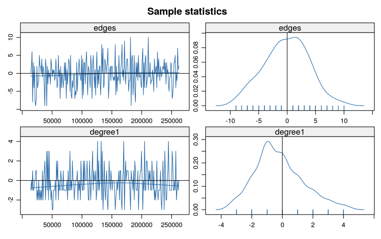

In this post, we'll continue to explore the theoretical foundations of ERGM estimation, the computational methods used to fit these models, and the diagnostic tools for evaluating model quality. Following plot is an exmaple of how `mcmc.diagnostics(fit)` looks. 



In this tutorial, we'll cover:

- Maximum Likelihood Estimation for ERGMs
- Markov Chain Monte Carlo (MCMC) Methods  
- Model Simulation and Network Generation
- Goodness-of-Fit Assessment
- Model Degeneracy: Causes and Solutions
- Geometrically-Weighted Terms and the Curved Exponential Family

## 1. Maximum Likelihood Estimation for ERGMs

### 1.1 The Likelihood Function

Recall that an ERGM has the general form:

$$P_{\theta}(Y = y) = \frac{\exp\{\theta \cdot g(y)\}}{\kappa(\theta)}$$

where:

- $\theta$ is the vector of parameters
- $g(y)$ is the vector of sufficient statistics
- $\kappa(\theta) = \sum_{z \in \mathcal{Y}} \exp\{\theta \cdot g(z)\}$ is the normalizing constant

The **likelihood** for observed network $y_{\text{obs}}$ is simply:

$$L(\theta \mid y_{\text{obs}}) = P_{\theta}(Y = y_{\text{obs}}) = \frac{\exp\{\theta \cdot g(y_{\text{obs}})\}}{\kappa(\theta)}$$

The **log-likelihood** is:

$$\ell(\theta) = \theta \cdot g(y_{\text{obs}}) - \log \kappa(\theta)$$

**Goal:** Find $\hat{\theta}$ that maximizes $\ell(\theta)$.

### 1.2 The Computational Challenge

Taking the derivative of the log-likelihood:

$$\frac{\partial \ell(\theta)}{\partial \theta} = g(y_{\text{obs}}) - E_{\theta}[g(Y)]$$

where $E_{\theta}[g(Y)]$ is the expected value of $g(Y)$ under the model with parameter $\theta$.

**The Problem:** Computing $E_{\theta}[g(Y)]$ requires summing over all possible networks:

$$E_{\theta}[g(Y)] = \sum_{z \in \mathcal{Y}} g(z) P_{\theta}(Y = z) = \frac{\sum_{z \in \mathcal{Y}} g(z) \exp\{\theta \cdot g(z)\}}{\kappa(\theta)}$$

For a network with $n$ nodes:

- Undirected: $|\mathcal{Y}| = 2^{n(n-1)/2}$ possible networks
- Directed: $|\mathcal{Y}| = 2^{n(n-1)}$ possible networks

**Example:** A network with just 20 nodes has $2^{190} \approx 1.6 \times 10^{57}$ possible undirected networks.

**Implication:** Direct computation is impossible for all but the smallest networks.

### 1.3 Two Estimation Strategies

Depending on the model specification, we use different estimation approaches:

#### **Strategy 1: Maximum Pseudo-Likelihood Estimation (MPLE)**

**When applicable:** Models with **dyad independent** terms only

**Key insight:** For dyad independent models:
$$P(Y_{ij} = y_{ij} \mid Y^c_{ij} = y^c_{ij}) = P(Y_{ij} = y_{ij})$$

The conditional probability of each dyad doesn't depend on the rest of the network.

**The MPLE approach:**

1. Treat each dyad as an independent observation
2. The conditional log-odds becomes:
   $$\operatorname{logit} P(Y_{ij} = 1) = \theta \cdot \delta_{ij}(y)$$
   where $\delta_{ij}(y)$ is the change statistic
3. Estimate using standard logistic regression

**Advantages:**

- Exact for dyad independent models
- Fast computation (standard GLM algorithms)
- No simulation required
- Provides good starting values for MCMLE

**Examples of dyad independent terms:**

- `edges`: All dyads have same baseline probability
- `nodecov`: Covariate effects don't depend on other ties
- `nodematch`: Homophily doesn't depend on network structure
- `nodefactor`: Group main effects are dyad independent

#### **Strategy 2: Monte Carlo Maximum Likelihood Estimation (MCMLE)**

**When necessary:** Models with **any dyad dependent** terms

**Why MPLE fails:** For dyad dependent models:
$$P(Y_{ij} = 1 \mid Y^c_{ij}) \neq P(Y_{ij} = 1)$$

The probability of a tie depends on the status of other ties in the network.

**The MCMLE approach:** Use simulation to approximate $E_{\theta}[g(Y)]$

**Examples of dyad dependent terms:**

- `triangle`, `gwesp`: Transitivity depends on existing ties
- `mutual`: Reciprocity creates dependencies
- `degree(k)`, `gwdegree`: Degree distributions involve multiple dyads
- `kstar(k)`: Star configurations span multiple dyads

### 1.4 The MLE as Moment Matching

The first-order condition for MLE can be rewritten as:

$$E_{\theta}[g(Y)] = g(y_{\text{obs}})$$

**Interpretation:** At the MLE, the expected statistics under the model equal the observed statistics.

This is a **moment-matching** condition: we're finding parameters such that simulated networks have the same average features as the observed network.

**Important implication:** If your model can't generate networks with features similar to your observed network, the MLE may not exist or may be on the boundary of the parameter space.

## 2. Markov Chain Monte Carlo Methods

### 2.1 The MCMC Strategy

When MPLE is insufficient (dyad dependent models), we need MCMC to:

1. **Approximate expectations:** Estimate $E_{\theta}[g(Y)]$ by simulation
2. **Implement Newton-Raphson:** Use simulated statistics to update parameters
3. **Iterate:** Repeat until convergence

**The Geyer-Thompson approximation:**

Instead of computing $\kappa(\theta)$ directly, we approximate:

$$\ell(\theta) \approx \theta \cdot g(y_{\text{obs}}) - \theta \cdot \bar{g}_{\theta_0} + \ell(\theta_0)$$

where $\bar{g}_{\theta_0}$ is the sample mean of statistics from networks simulated at $\theta_0$.

### 2.2 The Metropolis-Hastings Algorithm

To sample networks from $P_{\theta}(Y = y)$, `ergm` uses Metropolis-Hastings:

**Algorithm:**

1. **Initialize:** Start with network $y^{(0)}$ (often the observed network)

2. **For $t = 1, 2, \ldots, T$:**
   
   a. **Propose:** Randomly select dyad $(i,j)$ and propose toggling $y^{(t-1)}_{ij}$
      - If $y^{(t-1)}_{ij} = 0$, propose $y^{*}_{ij} = 1$ 
      - If $y^{(t-1)}_{ij} = 1$, propose $y^{*}_{ij} = 0$
   
   b. **Compute acceptance ratio:**
      $$r = \frac{P_{\theta}(Y = y^*)}{P_{\theta}(Y = y^{(t-1)})} = \exp\{\theta \cdot [g(y^*) - g(y^{(t-1)})]\} = \exp\{\theta \cdot \delta_{ij}(y^{(t-1)})\}$$
   
   c. **Accept/Reject:**
      - With probability $\min(r, 1)$: set $y^{(t)} = y^*$ (accept)
      - Otherwise: set $y^{(t)} = y^{(t-1)}$ (reject)

3. **Result:** The sequence $\{y^{(1)}, y^{(2)}, \ldots, y^{(T)}\}$ forms a Markov chain whose stationary distribution is $P_{\theta}(Y = y)$

**Key properties:**

- **Markov property:** Next state depends only on current state
- **Detailed balance:** Ensures correct stationary distribution  
- **Ergodicity:** Chain eventually forgets initial state
- **No normalizing constant needed:** The $\kappa(\theta)$ cancels in the ratio.

### 2.3 MCMC in Practice

**Burn-in period:**

- Discard initial samples before chain reaches stationarity
- Default: `MCMC.burnin = 16384` iterations

**Thinning:**

- Keep every $k$-th sample to reduce autocorrelation
- Default: `MCMC.interval = 1024`
- Only these "thinned" samples are used for inference

**Sample size:**
- Number of samples to collect (after burn-in and thinning)
- Default: `MCMC.samplesize = 1024`

**The MCMLE iteration:**

1. Start with $\theta^{(0)}$ from MPLE
2. For $k = 0, 1, 2, \ldots$ until convergence:

   - Run MCMC at $\theta^{(k)}$ to get sample $\{y_1, \ldots, y_M\}$
   - Compute $\bar{g}_k = \frac{1}{M}\sum_{m=1}^M g(y_m)$
   - Update: $\theta^{(k+1)} = \theta^{(k)} + \alpha_k \cdot (g(y_{\text{obs}}) - \bar{g}_k)$
   - Check if $\|g(y_{\text{obs}}) - \bar{g}_k\|$ is sufficiently small

### 2.4 Convergence Assessment

**What to check:**

1. **Trace plots:** Statistics should fluctuate randomly around observed values
2. **Effective sample size:** Should be sufficiently large (typically > 100)  
3. **Auto-correlation:** Should decay quickly
4. **Geweke diagnostic:** Tests if early and late parts of chain agree

**Red flags:**

- Trace plots show trends or drift
- Statistics far from observed values
- High autocorrelation persists
- Multiple runs give very different results

These often indicate **model degeneracy** (see Section 5).

## 3. Simulation from Fitted Models

### 3.1 Why Simulate Networks?

Once we have $\hat{\theta}$, we can generate new networks from $P_{\hat{\theta}}(Y = y)$. This is useful for:

1. **Goodness-of-fit assessment:** Do simulated networks resemble the observed network?
2. **Uncertainty quantification:** Understanding the variability implied by the model
3. **Prediction:** Generating plausible networks for counterfactual scenarios
4. **Network imputation:** Filling in missing ties

### 3.2 The Simulation Process

**Method:** Use the same Metropolis-Hastings algorithm as in estimation

**Key difference:** Now $\theta$ is fixed at $\hat{\theta}$ (the MLE)

**Steps:**

1. Initialize with observed network $y_{\text{obs}}$ (or a random network)
2. Run Metropolis-Hastings for burn-in period
3. Collect samples at specified intervals
4. Each sample is an independent draw from $P_{\hat{\theta}}(Y = y)$

**In R:**
```r
sim_networks <- simulate(fitted_model, nsim = 100)
```

### 3.3 Properties of Simulated Networks

**Theoretical guarantee:** As simulation length increases, the distribution of simulated networks approaches $P_{\hat{\theta}}(Y = y)$

**What this means:**

- Sample mean of $g(y)$ across simulations $\approx E_{\hat{\theta}}[g(Y)] = g(y_{\text{obs}})$
- Variability across simulations reflects uncertainty in the model
- Features not explicitly modeled should still emerge if model is correctly specified

**Example interpretation:**

If your model includes `edges` and `nodematch("sex")`, but not degree terms, simulations will still produce some degree distribution. If this distribution matches the observed one, it suggests your model has captured the mechanisms generating degree heterogeneity, even though you didn't model it explicitly.

## 4. Goodness-of-Fit Testing

### 4.1 The GOF Philosophy

**Central question:** Does our model generate networks that look like the observed network?

**Key insight:** We assess fit using statistics **not explicitly in the model**.

**Why?** 

- Statistics in the model are fit by construction (moment-matching)
- The real test is whether the model produces realistic networks overall
- Good models should reproduce unmodeled features

**Analogy:** Like checking regression residuals for patterns, even though we minimized squared residuals by design.

### 4.2 Standard GOF Statistics

`ergm` checks three key network features by default:

#### **Degree Distribution**

**Statistic:** ${d_k}$ number of nodes with degree $k$

**Why important:**

- Degree is fundamental to network structure
- Many social processes depend on degree (preferential attachment, activity levels)
- Real networks often have right-skewed degree distributions

**GOF test:** Compare observed $\{d_0, d_1, d_2, \ldots\}$ to distributions from simulated networks

#### **Edgewise Shared Partners (ESP)**

**Statistic:** $\text{ESP}_k$ number of edges whose endpoints have exactly $k$ shared partners

**Why important:**

- Measures local clustering around edges
- Captures triadic closure beyond global triangle counts
- Indicates level of community structure

**Interpretation:**

- High $\text{ESP}_0$: Many edges with no shared partners (sparse bridges)
- High $\text{ESP}_k$ for $k > 0$: Edges embedded in dense local neighborhoods

#### **Geodesic Distance Distribution**

**Statistic:** Distribution of shortest path lengths between all dyad pairs

**Why important:**

- Indicates overall connectivity and reachability
- Related to "small world" properties
- Captures global structure

**Typical pattern in social networks:**

- Most connected dyads are 2-3 steps apart
- Few very long paths
- Some unreachable pairs (disconnected components)

### 4.3 Interpreting GOF Output

For each statistic, `gof()` reports:

- **obs:** Observed count in your data
- **min, max:** Range across simulated networks  
- **mean:** Average across simulations
- **MC p-value:** Proportion of simulations more extreme than observed

**Good fit indicators:**

- Observed value near the mean of simulations
- P-values not too extreme (say, between 0.05 and 0.95)
- Observed within inter-quartile range of simulations

**Poor fit indicators:**

- Observed far in tails of simulated distribution
- P-values very close to 0 or 1
- Systematic deviations (e.g., always underestimating)

**Visual assessment:** GOF plots show observed (black line) overlaid on boxplots of simulations. Good fit means the black line runs through the "middle" of the boxes.

### 4.4 What to Do When GOF Fails

**Diagnosis:** Which statistics show poor fit?

- **Degree distribution:** Add degree-related terms (`gwdegree`, `degree(k)`)
- **ESP distribution:** Add clustering terms (`gwesp`, `triangle`)
- **Geodesic distances:** May need to reduce transitivity or add bridging mechanisms

**Strategy:**

1. Identify which aspect of structure is mis-specified
2. Add appropriate terms to model that feature
3. Re-estimate and check GOF again
4. Iterate until acceptable fit

**Warning:** Don't overfit. Adding too many terms can lead to:

- Model degeneracy
- Poor out-of-sample prediction
- Difficulty of interpretation

### 4.5 GOF for Model Comparison

**Use case:** Comparing nested models

**Method:**

1. Fit Model A (simple) and Model B (A + additional terms)
2. Compare GOF for both models
3. Does added complexity improve fit?

**Trade-off:**

- More complex models usually fit better
- But simpler models are more interpretable and parsimonious
- Use AIC/BIC along with GOF for model selection

## 5. Model Degeneracy

### 5.1 What is Model Degeneracy?

**Formal definition:** A model is *near degenerate* if it places almost all its probability mass on a small subset of extreme networks (typically empty or complete graphs).

**Mathematical statement:**

For a degenerate model, as $\theta$ varies in reasonable ranges:

$$P_{\theta}(Y = y) \approx \begin{cases}
1 & \text{if } y \text{ is empty or complete} \\
0 & \text{otherwise}
\end{cases}$$

**Practical consequences:**

1. **MCMC failure:** Simulations produce unrealistic networks
2. **Non-convergence:** Algorithm can't find stable parameter estimates
3. **Extreme estimates:** Coefficients become very large or have huge SEs
4. **Poor fit:** Model doesn't resemble observed network at all

### 5.2 Why Degeneracy Occurs

**Root cause:** Positive feedback loops in the model specification

**Classic example:** The `edges + triangle` model

**The feedback mechanism:**

1. Suppose $\beta_{\text{triangle}} > 0$ (positive clustering effect)
2. Adding an edge that creates $k$ triangles contributes:
   $$\Delta \ell = \beta_{\text{edges}} + k \cdot \beta_{\text{triangle}}$$
3. As the network gets denser, $k$ increases for new edges
4. This makes edges that create many triangles exponentially more likely
5. Network "runs away" toward complete graph

**Mathematical intuition:**

The conditional log-odds for edge $(i,j)$ is:

$$\operatorname{logit} P(Y_{ij} = 1 \mid Y^c_{ij}) = \beta_{\text{edges}} + \beta_{\text{triangle}} \cdot t_{ij}$$

where $t_{ij}$ = number of triangles created by adding edge $(i,j)$.

If $\beta_{\text{triangle}} > 0$:

- High-degree nodes become magnets for new edges
- Creates "rich get richer" dynamic
- No mechanism to slow this process
- System collapses to extreme states

### 5.3 Detecting Degeneracy

**Estimation stage signs:**

1. Algorithm fails with message about density guard
2. Many iterations without convergence
3. Coefficients become very large (|β| > 10)
4. Standard errors are huge relative to estimates

**MCMC diagnostic signs:**

1. **Trace plots:** Strong upward or downward trends
2. **Sample statistics:** Far from observed, with large drift
3. **Autocorrelation:** Extremely high, doesn't decay
4. **Network visuals:** Simulated networks look nothing like observed

**Example diagnostics for degenerate model:**

```
Sample statistics summary:
                Mean    SD    
edges          1547   2314    # Observed: 203.
triangle      14329  52891    # Observed: 23.
```

The simulated networks are orders of magnitude denser than observed.

### 5.4 Degenerate vs Near-Degenerate

**Fully degenerate:**

- Model literally assigns near-zero probability to realistic networks
- Estimation completely fails
- No useful inference possible

**Near-degenerate:**

- Model has very little probability mass near observed network
- Estimation struggles but may technically converge
- Results are highly unstable and unreliable
- Small changes in specification lead to large changes in estimates

**Practical impact:** Both require model re-specification.

### 5.5 Common Degenerate Specifications

**Known problematic terms:**

1. **`triangle` alone:** Classic example, especially in larger networks
2. **`kstar(k)` for large k:** Creates similar positive feedback with stars
3. **Multiple simple structural terms:** e.g., `triangle + kstar(3) + twopath`

**Why these fail:**

They create **unregulated positive feedback**:

- Each configuration makes similar configurations more likely
- No diminishing returns
- System spirals to extremes

**Counterintuitive result:**

Adding more terms doesn't necessarily improve the model. Sometimes simpler is better.

## 6. Solutions to Degeneracy: Geometrically-Weighted Terms

### 6.1 The Key Insight

**Problem:** Simple count statistics (triangles, k-stars) have no diminishing returns

**Solution:** Weight counts so additional configurations matter less

**Mechanism:** Geometrically-weighted statistics provide **diminishing marginal contribution** for each additional configuration

### 6.2 Edgewise Shared Partners (ESP)

Before introducing GWESP, we need to understand ESP:

**Definition:** For an edge $(i,j)$, an *edgewise shared partner* is a node $k$ such that both $i$-$k$ and $j$-$k$ edges exist.

**ESP distribution:** 
$$\text{ESP}_k(y) = \#\{\text{edges with exactly } k \text{ shared partners}\}$$

**Relationship to triangles:**

- Each shared partner on an edge corresponds to a triangle
- Total triangles $= \frac{1}{3} \sum_{k=1}^{n-2} k \cdot \text{ESP}_k(y)$
- But ESP preserves more information than just the triangle count

### 6.3 Geometrically-Weighted ESP (GWESP)

**Formula:**

$$\text{GWESP}_{\alpha}(y) = e^{\alpha} \sum_{k=1}^{n-2} \left\{1 - (1-e^{-\alpha})^k\right\} \cdot \text{ESP}_k(y)$$

**Weights for each $k$:**

$$w_k = e^{\alpha}\left\{1 - (1-e^{-\alpha})^k\right\}$$

**Key property:** $w_k$ increases with $k$, but at a decreasing rate.

**Example weights** (for $\alpha = 0.5$):

| $k$ | $w_k$ | Marginal increase |
|-----|-------|-------------------|
| 1   | 0.649 | --                |
| 2   | 1.038 | 0.389             |
| 3   | 1.288 | 0.250             |
| 4   | 1.448 | 0.160             |
| 5   | 1.550 | 0.103             |

Notice how the marginal increase gets smaller.

### 6.4 Why GWESP Works

**Intuition:** An edge with 5 shared partners is only *slightly* more valuable than one with 4 shared partners.

**Mathematical effect:**

Conditional log-odds for edge $(i,j)$:

$$\operatorname{logit} P(Y_{ij}=1 \mid Y^c_{ij}) = \beta_{\text{edges}} + \theta_{\text{GWESP}} \cdot \Delta\text{GWESP}_{ij}$$

where $\Delta\text{GWESP}_{ij}$ is the change in GWESP from adding edge $(i,j)$.

**Crucial difference from triangle:**

- $\Delta\text{triangle}_{ij} = s_{ij}$ (number of shared partners)
- $\Delta\text{GWESP}_{ij} \approx w_{s_{ij}} - w_{s_{ij}-1}$ (diminishing)

**Result:** No runaway feedback loop.

### 6.5 The Decay Parameter $\alpha$

**Role:** Controls the rate of diminishing returns

**Small $\alpha$ (e.g., 0.1-0.3):**

- Strong diminishing returns
- First few shared partners matter a lot
- Additional ones barely count
- Appropriate for: Large networks, weak clustering

**Medium $\alpha$ (e.g., 0.4-0.6):**

- Moderate diminishing returns
- Balanced weighting
- Appropriate for: Most empirical networks

**Large $\alpha$ (e.g., 0.7-1.0):**

- Weak diminishing returns
- Approaches linear counting (like triangles)
- Can risk degeneracy if too large.
- Appropriate for: Small networks, very strong clustering

**Practical advice:** Start with $\alpha = 0.25$ or $0.5$ and use `fixed=TRUE`

### 6.6 Other Geometrically-Weighted Terms

**For degree distributions: gwdegree**

$$\text{GWD}_{\alpha}(y) = e^{\alpha} \sum_{k=1}^{n-1} \left\{1 - (1-e^{-\alpha})^k\right\} \cdot N_k(y)$$

where $N_k(y)$ is the number of nodes with degree $k$.

**Prevents:**

- Formation of extreme hubs
- Unrealistic degree heterogeneity
- Degeneracy from `kstar` terms

**For two-paths: gwdsp (geometrically weighted dyadwise shared partners)**

**Formula:**

$$\text{GWDSP}_{\alpha}(y) = e^{\alpha} \sum_{k=1}^{n-2} \left\{1 - (1-e^{-\alpha})^k\right\} \cdot \text{DSP}_k(y)$$

where $\text{DSP}_k(y)$ is the number of dyads (node pairs) with exactly $k$ shared partners.

**Use case:**

- Modeling "structural holes" (dyads with shared partners but no direct tie)
- Often has **negative** coefficient (closure reduces structural holes)
- Complements GWESP

### 6.7 The Curved Exponential Family

**Standard ERGM:**
$$P_{\theta}(Y=y) = \frac{\exp\{\theta \cdot g(y)\}}{\kappa(\theta)}$$

**Curved exponential family:**
$$P_{\theta, \alpha}(Y=y) = \frac{\exp\{\theta \cdot g_{\alpha}(y)\}}{\kappa(\theta, \alpha)}$$

where $\alpha$ is a **curvature parameter** that affects the form of $g_{\alpha}(y)$.

**In geometrically-weighted terms:**
- $\alpha$ determines the weights in the statistic
- Can be fixed (specified by user) or estimated from data
- Estimating $\alpha$ is computationally harder but more flexible

**Trade-off:**

| Fixed $\alpha$ | Estimated $\alpha$ |
|----------------|-------------------|
| Faster estimation | Slower estimation |
| User must choose value | Data-driven choice |
| Less flexible | More flexible |
| Easier interpretation | Harder interpretation |
| `fixed=TRUE` | `fixed=FALSE` |

**Recommendation:** Start with fixed values; only estimate if you have strong justification and large sample size.

## More readings:

**ERGM Theory:**

- Hunter, D. R., Handcock, M. S., Butts, C. T., Goodreau, S. M., & Morris, M. (2008). ergm: A package to fit, simulate and diagnose exponential-family models for networks. *Journal of Statistical Software, 24*(3).

- Snijders, T. A., Pattison, P. E., Robins, G. L., & Handcock, M. S. (2006). New specifications for exponential random graph models. *Sociological Methodology, 36*(1), 99-153.

**Degeneracy:**

- Schweinberger, M. (2011). Instability, sensitivity, and degeneracy of discrete exponential families. *Journal of the American Statistical Association, 106*(496), 1361-1370.

**Curved Exponential Family:**

- Hunter, D. R., & Handcock, M. S. (2006). Inference in curved exponential family models for networks. *Journal of Computational and Graphical Statistics, 15*(3), 565-583.

**Goodness-of-Fit:**

- Hunter, D. R., Goodreau, S. M., & Handcock, M. S. (2008). Goodness of fit of social network models. *Journal of the American Statistical Association, 103*(481), 248-258.

---

*This tutorial is based on UCLA [STATS 218: Social Network Analysis](https://handcock.github.io/teaching/218/) taught by Prof [Mark Handcock](https://handcock.github.io/).*
