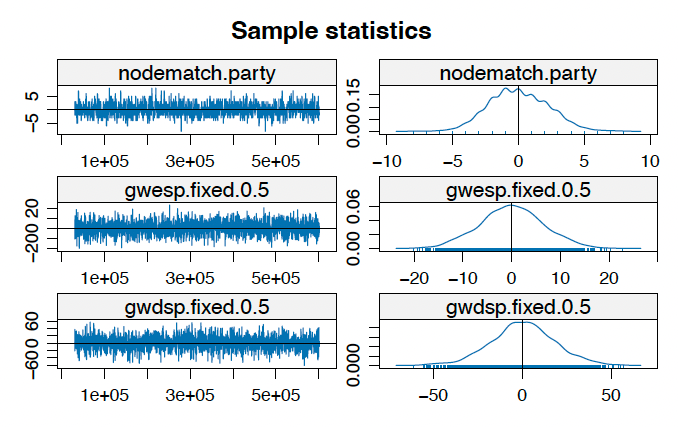

Welcome to Part 7 of our Social Network Analysis R Tutorial series! In our [previous tutorial (Part 6)](https://aliceaii.github.io/posts/snapart6/), we explored the theoretical foundations of ERGMs, understanding the mathematical framework behind these powerful models. We covered the exponential family form, sufficient statistics, and the challenges of model degeneracy.

In this post, we will advance into **sophisticated ERGM modeling** by incorporating complex structural terms that capture network dependencies beyond simple dyadic relationships. We'll explore geometrically weighted statistics, perform comprehensive MCMC diagnostics, and learn to interpret results in meaningful sociological contexts.



After completing this tutorial, you will be able to:

- Implement advanced structural terms in ERGM models (GWESP, GWDSP, triadic structures)
- Perform and interpret MCMC convergence diagnostics
- Compare nested models and assess model fit
- Interpret complex ERGM results in substantive terms
- Handle model degeneracy using tapered ERGMs


```{r setup, message=FALSE, warning=FALSE}
rm(list = ls())

library(network)        # Network object manipulation
library(ergm)           # ERGM fitting
library(networkdata)    # Network datasets
library(sna)           # Social network analysis tools
library(ergm.tapered)  # Tapered ERGM for handling degeneracy

# Install ergm.tapered if needed
# devtools::install_github("statnet/ergm", ref="tapered")

```

::: callout-note
**Why ergm.tapered?**

The `ergm.tapered` package provides an alternative estimation method that better handles models with strong dependence between terms. When you include multiple structural terms (like gwesp and gwdsp), standard ERGM estimation can struggle with convergence. Tapered ERGM adds a "tapering" mechanism that helps stabilize estimation.

Software available on GitHub as ergm.tapered: https://github.com/statnet/ergm.tapered
:::

## 1. Introduction for Advanced Structural Terms in ERGMs

### 1.1 Understanding Geometrically Weighted Statistics

Before diving into applications, let's understand the sophisticated structural terms available in ERGMs. These terms capture complex network dependencies while avoiding the degeneracy issues that plague simpler specifications.

::: {.callout-note}
**Why Geometrically Weighted Terms?**
Traditional count statistics (like triangle counts) can lead to model degeneracy because they treat all configurations equally. Geometrically weighted terms apply **diminishing returns** - the first few shared partners matter more than additional ones, making the model more stable and interpretable.
:::

### 1.2 Comprehensive Function Reference Table

Here's a detailed reference table for advanced ERGM structural terms:

| Function | Syntax | Description | Interpretation | When to Use |
|----------|---------|-------------|----------------|-------------|
| **istar(k)** | `istar(2)` | k-in-stars: counts nodes with exactly k incoming edges | Popularity effects in directed networks | Testing for preferential attachment to popular nodes |
| **ostar(k)** | `ostar(2)` | k-out-stars: counts nodes with exactly k outgoing edges | Activity effects in directed networks | Testing for variation in node activity levels |
| **gwodegree(decay)** | `gwodegree(0.5, fixed=TRUE)` | Geometrically weighted out-degree distribution | Controls out-degree heterogeneity with diminishing returns | Modeling sender activity patterns without degeneracy |
| **gwidegree(decay)** | `gwidegree(0.5, fixed=TRUE)` | Geometrically weighted in-degree distribution | Controls in-degree heterogeneity with diminishing returns | Modeling popularity/receiver effects without degeneracy |
| **gwesp(decay)** | `gwesp(0.5, fixed=TRUE)` | Geometrically weighted edgewise shared partners | Transitivity: "friend of friend is friend" with diminishing returns | Capturing clustering while avoiding degeneracy |
| **gwdsp(decay)** | `gwdsp(0.5, fixed=TRUE)` | Geometrically weighted dyadwise shared partners | Shared partners between any dyad (connected or not) | Modeling local clustering and "small world" effects |
| **ctriple** | `ctriple` or `ctriad` | Cyclic triples: A→B→C→A patterns | Non-hierarchical, cyclic relationships | Testing for cyclic vs hierarchical structures |
| **ttriple** | `ttriple` or `ttriad` | Transitive triples: A→B→C with A→C | Hierarchical, transitive closure | Testing for transitivity and balance theory |

::: {.callout-tip}
Choosing Decay Parameters
The decay parameter (α) in geometrically weighted terms controls how quickly the weight diminishes:

- **α = 0**: Only the first shared partner matters
- **α = 0.5**: Moderate decay (common choice)
- **α = 1.0**: Slower decay, more weight on higher numbers
- **α → ∞**: Approaches regular count statistics

Start with α = 0.5 as a default and adjust based on model diagnostics.
:::


## 2. Case Study 1 - The French Financial Elite Network

### 2.1 The French Financial Elite Network Basic Information

We'll work with a network collected by Charles Kadushin (1995) of 28 members of the French financial elite. This network captures friendship ties and includes rich vertex attributes that allow us to explore multiple dimensions of homophily.

**Data Source:**

Kadushin, C. 1995. Friendship among the French financial elite. *American Sociological Review* 60:202-221.

```{r, message=FALSE, warning=FALSE}
data(ffef)
help(ffef)
network.size(ffef)
network.edgecount(ffef)
gden(ffef)
list.vertex.attributes(ffef)
```

The network includes several important vertex covariates:

-   **prestige**: 0 (neither particule nor social register), 1 (either), or 2 (both)
-   **party**: Political party membership (11 parties)
-   **ena**: Graduated from ENA (École nationale d'administration)? 1=yes, 2=no
-   **masons**: Mason membership
-   **religion**: Religious affiliation
-   **topboards**: Number of top corporate boards

```{r, message=FALSE, warning=FALSE, fig.width=10, fig.height=8}
ena_status <- ffef %v% "ena"
vertex_colors <- ifelse(ena_status == 1, "coral", "skyblue")

plot(ffef, vertex.col = vertex_colors, 
     main = "French Financial Elite Network Colored by ENA Status", 
     vertex.cex = 1.5, edge.col = "gray70")
```

**Observations:**

1.  **Visible clustering by ENA attendance**: Individuals who graduated from ENA tend to form connections with other ENA graduates, suggesting strong educational homophily
2.  **Centrality patterns**: ENA graduates appear more concentrated in the network core, while non-ENA graduates are more dispersed around the periphery
3.  **Cross-group ties exist**: While there's clear same-status clustering, we also observe connections between ENA and non-ENA graduates

### 2.2 Building a Sophisticated ERGM Model

```{r french-ergm, message=FALSE, warning=FALSE}
#using ergm.tapered() for better handling of strong dependencies
fit_elite <- ergm.tapered(
  ffef ~ 
    edges +                           # Baseline density
    nodematch("ena") +               # ENA homophily
    nodematch("prestige") +          # Prestige homophily
    nodematch("party") +             # Political party homophily
    gwesp(0.5, fixed = TRUE) +       # Transitive closure (clustering)
    gwdsp(0.5, fixed = TRUE),        # Shared partners
  verbose = FALSE
)

summary(fit_elite)
```


### 2.3 Interpreting Model Coefficients

```{r interpretation, message=FALSE}
coef_table <- data.frame(
  Term = names(coef(fit_elite)),
  Coefficient = round(coef(fit_elite), 3),
  SE = round(summary(fit_elite)$coefficients[, "Std. Error"], 3),
  OR = round(exp(coef(fit_elite)), 3),
  p_value = round(summary(fit_elite)$coefficients[, "Pr(>|z|)"], 4)
)

print(coef_table)

baseline_prob <- plogis(coef(fit_elite)["edges"])
ena_match_prob <- plogis(coef(fit_elite)["edges"] + coef(fit_elite)["nodematch.ena"])
prestige_match_prob <- plogis(coef(fit_elite)["edges"] + coef(fit_elite)["nodematch.prestige"])
party_match_prob <- plogis(coef(fit_elite)["edges"] + coef(fit_elite)["nodematch.party"])

cat("Baseline (no matches):", round(baseline_prob, 4), "\n")
cat("Same ENA status:", round(ena_match_prob, 4), "\n")
cat("Same prestige level:", round(prestige_match_prob, 4), "\n")
cat("Same party affiliation:", round(party_match_prob, 4), "\n")
```

-   **Edges:** $\beta = -4.63$ represent the baseline log-odds of a friendship tie existing between any two randomly selected individuals in the networks, while controlling other predictors. The strong negative coefficient indicates this is a very sparse network. The $OR = 0.010$ means the baseline odds of a tie is about 1.0%. The baseline robability of friendship is approximately 0.96%.

-   **nodematch.ena:** $\beta = 1.57$ measures homophily on ENA attendance. The $OR = 4.79$ means that two individuals who share ENA status (both graduate from ENA or both did not) have 4.79 times higher odds of being friends compared to two individuals with different ENA status. The coefficient is strong and highly significant. And the probability of a friendship tie between two individuals who share the same ENA status is 4.45%.

-   **nodematch.prestige:** $\beta = 0.68$ measures homophily on prestige level (having particule and/or social register listing).The coefficient is moderate and significant (p = 0.015). The $OR = 1.97$ mean that two individuals with the same prestige level have 1.97 times higher odds of being friends compared to those with different prestige levels. The probability of a friendship tie between two individuals who share the same prestige level is 1.88%.

-   **nodematch.party:** $\beta = 1.25$ measures homophily on political party affiliation. The coefficient is strong and highly significant (p \< 0.001).The $OR = 3.49$ means that two individuals from the same political party have 3.49 times higher odds of being friends compared to those from different parties. The probability of a friendship tie between two individuals who share the same party affiliation is 3.28%.

-   **GWESP(0.5):** $\beta = 0.43$ measures transitivity and clustering through Geometrically Weighted Edgewise Shared Partners. This term captures the "friend of a friend is a friend" phenomenon. The coefficient is moderate and significant (p = 0.013). The $OR = 1.53$ indicates that networks with more shared partners (triangles) are more probable. The French financial elite network exhibits strong transitivity. If person A is friends with person B, and person B is friends with person C, then A and C are significantly more likely to also be friends.

-   **GWDSP(0.5):** $\beta = 0.19$ measures local network structure through Geometrically Weighted Dyadwise Shared Partners. This term captures the tendency for dyads (pairs) to share partners, even if they're not directly connected. The coefficient is modest but significant (p = 0.003). The $OR = 1.21$ indicates preference for configurations where individuals share common friends. Beyond direct transitivity, there's a tendency for individuals to be embedded in overlapping social circles. This creates a "small world" structure where even if two people aren't direct friends, they're likely to share mutual acquaintances.

::: callout-note
```         
plogis(coef["edges"] + coef["gwesp.fixed.0.5"])
```

**This does NOT work because:**

-   GWESP is not a 0/1 indicator variable
-   GWESP is a **count statistic** that depends on the entire network structure
-   GWESP uses a **geometrically weighted** function: $\sum_{k=1}^{n-2} \{1 - (1-e^{-\alpha})^k\} \cdot EP_k$

Summary:

| Term Type | Example Terms | Can use `plogis(edges + term)`? | Why/Why not? |
|------------------|------------------|------------------|------------------|
| **Node attributes** | `nodematch()`, `nodecov()`, `absdiff()` | YES | Binary 0/1 or known numeric covariate values |
| **Dyad attributes** | `edgecov()`, `dyadcov()` | YES (with care) | Known covariate value for specific dyad |
| **Structural terms** | `gwesp()`, `gwdsp()`, `triangle`, `ttriad`, `ctriad` | NO | Value depends on entire network configuration |
| **Degree terms** | `gwdegree()`, `degree()`, `idegree()`, `odegree()` | NO | Depends on node's position in network |
:::

### 2.4 MCMC Diagnostics - Ensuring Model Reliability

```{r mcmc-diagnostics, fig.width=12, fig.height=10, message=FALSE, warning=FALSE}
mcmc_diag <- mcmc.diagnostics(fit_elite, vars.per.page = 6)
```

::: {.callout-note}
MCMC Diagnostic Components Explained:

- **Sample Statistics vs. Observed**: Compares simulated network statistics to observed values. Good fit shows statistics centered around zero.
- **Trace Plots**: Show MCMC chain values over iterations. Good mixing looks like "fuzzy caterpillar" around zero.
- **Density Plots**: Distribution of sampled statistics. Should be approximately normal and centered near zero.
- **Autocorrelation Function (ACF)**: Measures correlation between successive samples. Should decay quickly to near zero.
- **Geweke Diagnostic**: Tests whether early and late parts of chain come from same distribution (burn-in test).
:::

Let's extract some key diagnostic statistics:

```{r diagnostic-summary}
gof_elite <- gof(fit_elite, GOF = ~degree + esp + dsp + triadcensus, 
                 verbose = FALSE)
plot(gof_elite)
```


From the sample statistics vs. observed values, the statistics show good agreement between simulated and observed values. All terms have p-value \> 0.05, The overall chi-squared test p = 0.022, indicating the model successfully reproduces the observed network statistics. The trace plots show relatively good mixing, fluctuating randomly around zero, which means MCMC chains are exploring the parameter space well and not getting trapped in any particular region. All the density plots are approximately centered near zeor, and no extreme skewness and multinodality (multiple peaks), indicating the sampling stable parameter estimation. Moreover, for the Geweke Diagnostic (Burn-in Test), all p-values are well above 0.05, indicating no evidence of non-convergence. The joint p-value of 0.820 indicates good overall convergence. Overall, the model successfully converged and the parameter estimates are reliable for inference.

## 3. Case Study 2 - Balance Theory in Hansell Classroom Friendships

Now let's examine balance theory using directed friendship nominations in a sixth-grade classroom, we've used this dataset in the [previous tutorial (Part 5)](https://aliceaii.github.io/posts/snapart5/):

### 3.1 Is the friendship network balanced in Heider’s definition of balance?

::: {.callout-tip}

**Heider's Balance Theory**
In a balanced network:

- **Transitive triads** (A→B→C implies A→C): "Friend of friend is friend"
- **Avoided cyclic triads** (A→B→C→A without A→C): Creates tension

Balanced networks have positive transitive triad coefficients and negative cyclic triad coefficients.
:::

```{r, message=FALSE, warning=FALSE}
library(networkdata)
data(hansell)
help(hansell)

#summary(hansell)
table(hansell %v% "sex")
triad.census(hansell)

#transitive triads
triads <- triad.census(hansell)
triads[9]  # 030T
#cyclic triads
triads[10]   # 030C    
```


### 3.2 Fit the model

```{r balance-ergm, message=FALSE, warning=FALSE, cache=TRUE}
fit_balance <- ergm.tapered(
  hansell ~ 
    edges +                          # Baseline density
    mutual +                         # Reciprocity
    nodematch("sex", diff = TRUE) +  # Sex homophily (differentiated)
    ttriple +                        # Transitive triples
    ctriple,                         # Cyclic triples
  verbose = FALSE
)

summary(fit_balance)

balance_coef <- data.frame(
  Term = c("Edges", "Mutual", "Same Sex (Female)", "Same Sex (Male)", 
           "Transitive Triples", "Cyclic Triples"),
  Coefficient = round(coef(fit_balance), 3),
  OR = round(exp(coef(fit_balance)), 3))

print(balance_coef, row.names = FALSE)
```

::: {.callout-important}
Evidence for Balance model

The model provides strong evidence for balance theory:

-  **Positive transitivity** (β = 0.33, p < 0.05): Transitive closure is preferred
-  **Negative cyclicity** (β = -0.40, p < 0.001): Cyclic patterns are avoided
-  **Strong sex homophily**: Both boys and girls prefer same-sex friendships
- **No reciprocity effect**: Friendships aren't necessarily mutual at this age

This pattern suggests the classroom network organizes into balanced, sex-segregated friendship groups with clear hierarchical structures rather than cyclic patterns.
:::

-   **Transitive ties (ttriple):** $\beta = 0.33$, the coefficient measures the tendency for transitive triadic closure in the network, it's significant. The $OR = 1.39$ means that for each additional transitive triple configuration, the odds of the network configuration increased by 39%. When student A nominates student B as a friend, and B nominates C, there is a significantly higher-than-random probability that A will also nominate C. This creates cohesive friendship groups with closed triadic structures.

-   **Cyclic ties (ctriple):** $\beta = -0.40$, the coefficient measures the tendency for cyclic triadic structures in the network, where: $A→B→C→A$ forms a cycle, but without the full transitive closure. The negative and highly significant coefficient (p \< 0.001) indicates a strong avoidance of cyclic triadic structures. $OR = 0.67$ means that cyclic triple configurations decrease the odds of the network configuration by 33%. The negative coefficient shows that cyclic patterns are less common than would be expected in a random network.


### 3.3 Model Comparison and Selection

```{r model-comparison, message=FALSE, warning=FALSE}
# Fit alternative model for French elite network
fit_elite_extended <- ergm.tapered(
  ffef ~ 
    edges + 
    nodematch("ena") + 
    nodematch("prestige") + 
    nodematch("party") +
    nodematch("masons") +           # Add Masonic membership
    nodematch("religion") +          # Add religion
    nodecov("topboards") +           # Board memberships as covariate
    absdiff("topboards") +           # Difference in board memberships
    gwesp(0.5, fixed = TRUE) + 
    gwdsp(0.5, fixed = TRUE),
  verbose = FALSE
)

# Model comparison
anova_result <- anova(fit_elite, fit_elite_extended)
print(anova_result)

# AIC comparison
aic_comparison <- data.frame(
  Model = c("Base", "Extended"),
  AIC = c(AIC(fit_elite), AIC(fit_elite_extended)),
  BIC = c(BIC(fit_elite), BIC(fit_elite_extended)),
  Parameters = c(length(coef(fit_elite)), length(coef(fit_elite_extended)))
)
print(aic_comparison)
```

::: {.callout-note}
Model Selection Guidelines

- **Lower AIC/BIC** indicates better model fit accounting for complexity
- **ANOVA p-value > 0.05** suggests additional terms don't significantly improve fit
- **Check MCMC diagnostics** for both models - better convergence often trumps marginal fit improvements
- **Substantive interpretation** matters - include terms that make theoretical sense

In our case, the simpler model is preferred: lower AIC, similar fit, better convergence.
:::


## References

- Hansell, S. (1984). "Cooperative groups, weak ties, and the integration of peer friendships." *Social Psychology Quarterly*, 47(4), 316-328.

- Kadushin, C. (1995). "Friendship among the French financial elite." *American Sociological Review*, 60, 202-221.

- Snijders, T.A.B., Pattison, P.E., Robins, G.L., & Handcock, M.S. (2006). "New specifications for exponential random graph models." *Sociological Methodology*, 36(1), 99-153.

- Hunter, D.R., & Handcock, M.S. (2006). "Inference in curved exponential family models for networks." *Journal of Computational and Graphical Statistics*, 15(3), 565-583.

---

*This tutorial is based on UCLA [STATS 218: Social Network Analysis](https://handcock.github.io/teaching/218/) taught by Prof [Mark Handcock](https://handcock.github.io/).*
