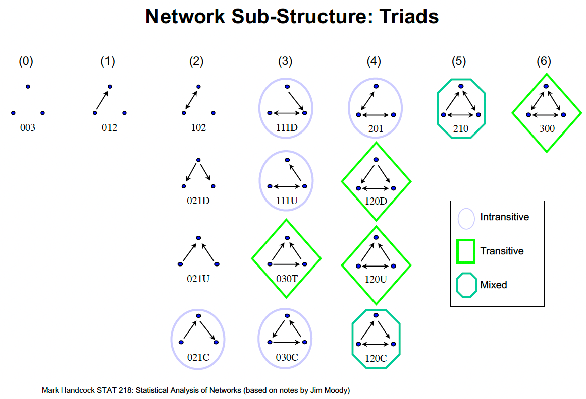

In this tutorial, we'll explore **triadic structures** in social network and their role in understanding social relationships. We'll learn how to use **triad census models** within the **Tapered ERGM** framework to capture complex patterns of transitivity, balance, and clustering in social networks.



By the end of this tutorial, you'll understand:

-   The theoretical foundations of triadic structures and social balance
-   How to interpret the 16 different triad types in directed networks
-   How to fit triad census models using `ergm.tapered`
-   How to interpret coefficients and evaluate transitivity patterns
-   How to diagnose convergence and compare competing models

## 1. Introduction to the Triad Census

### 1.1 Triad Census Reference Table

\*\*A triad census\*

| Type | Code | Description | Edges | Pattern (Relationship between A, B, C) |
|:-------------:|:-------------:|:--------------|:-------------:|:--------------|
| 0 | **003** | Empty triad (no ties) | 0 | A, B, C, empty triad |
| 1 | **012** | One asymmetric tie | 1 | A $\to$ B, C |
| 2 | **102** | One mutual tie, one null | 2 | A $\leftrightarrow$ B, C |
| 3 | **021D** | Two asymmetric, "down" pattern | 2 | A $\leftarrow$ B $\to$ C |
| 4 | **021U** | Two asymmetric, "up" pattern | 2 | A $\to$ B $\leftarrow$ C |
| 5 | **021C** | Two asymmetric, "cycle" | 2 | A $\to$ B $\to$ C |
| 6 | **111D** | One mutual, one asymmetric (down) | 3 | A $\leftrightarrow$ B $\leftarrow$ C |
| 7 | **111U** | One mutual, one asymmetric (up) | 3 | A $\leftrightarrow$ B $\to$ C |
| 8 | **030T** | Transitive triple (out-star) | 3 | A $\to$ B $\leftarrow$ C, A $\to$ C |
| 9 | **030C** | Three asymmetric, cyclic | 3 | A $\leftarrow$ B $\leftarrow$ C, A $\to$ C |
| 10 | **201** | Two mutual, one null | 4 | A $\leftrightarrow$ B $\leftrightarrow$ C |
| 11 | **120D** | One mutual, two asymmetric (down) | 4 | A $\leftarrow$ B $\to$ C, A $\leftrightarrow$ C |
| 12 | **120U** | One mutual, two asymmetric (up) | 4 | A $\to$ B $\leftarrow$ C, A $\leftrightarrow$ C |
| 13 | **120C** | One mutual, two asymmetric (cycle) | 4 | A $\to$ B $\to$ C, A $\leftrightarrow$ C |
| 14 | **210** | Two mutual, one asymmetric | 5 | A $\to$ B $\leftrightarrow$ C, A $\leftrightarrow$ C |
| 15 | **300** | Complete (all mutual) | 6 | A $\leftrightarrow$ B $\leftrightarrow$ C, A $\leftrightarrow$ C, completely connected |

::: {.callout-note}
Some key transitive patterns to watch for are:

-   **030T**: The classic transitive triple (without reciprocation)
-   **120D, 120U**: The classic transitive triple (with reciprocation)
-   **300**: Complete mutual triangle (ideal balanced triad)
-   **210, 120C**: Mixed patterns with transitive closure and reciprocity
:::

## 2. Model Degeneracy and Tapered ERGMs

### 2.1 What is Model Degeneracy?

As we mentioned in the [SNA tutorial part 6](https://aliceaii.github.io/posts/snapart6/index.html#model-degeneracy), one challenge in ERGM modeling is **near-degeneracy**, which occurs when a model places almost all of its probability mass on extreme configurations like:

-   Empty graphs (no edges)
-   Complete graphs (all possible edges)
-   Graphs with no 2-stars
-   Mono-degree graphs (all nodes have the same degree)

Degeneracy often arises when models include:

-   High-order structural terms (triangles, k-stars)
-   Terms that create strong dependencies, such as 
-   Combinations of terms that reinforce extreme structures, such as

Standard ERGMs with triangle terms are particularly prone to degeneracy because triangles create strong positive feedback: more triangles → more edges → even more triangles, leading to nearly complete graphs.


### 2.2 Tapered ERGM Solution

Beyond using the geometrically-weighted terms, the **Tapered ERGM** framework (Blackburn & Handcock, 2022) solves the degeneracy problem by adding a "tapering" term that prevents extreme configurations, please check [SNA tutorial part 7](https://aliceaii.github.io/posts/snapart7/index.html#tapered-ergm-solving-the-degeneracy-problem):

$$q(y|\theta, \tau) = \frac{1}{Z(\theta, \tau)} \exp\left(\sum_k \theta_k g_k(y) - \sum_k \tau_k(\mu_k(\theta, \tau) - g_k(y))^2\right)$$

::: {.callout-note}
**Practical Interpretation**

The tapering term acts like a "spring" that pulls the model away from extreme configurations. The strength of this spring ($\tau$) is automatically calibrated to ensure model stability while preserving the effects of the structural terms.
:::


## 3. Example 1: Modeling a Triad Census in Hansell Classroom Friendship Network

Here we consider again the network introduced in SNA tutorial part 5 of strong friendship ties among 13 boys and 14 girls in a sixthgrade classroom, as collected by Hansell (1984). Each student was asked if they liked each other student “a lot”, “some”, or “not much”. Here we consider a strong friendship tie to exist if a student likes another student “a lot.” Also recorded is the sex of each student. The data is in the networkdata package.

```{r setup, message=FALSE, warning=FALSE}
rm(list = ls())

#install.packages("ergm", repos="http://www.stat.ucla.edu/~handcock")
#install.packages("ergm.tapered", repos="http://www.stat.ucla.edu/~handcock")
#or devtools::install_github("statnet/ergm.tapered")
#devtools::install_github('statnet/ergm', ref='tapered')
#install.packages("ergm.tapered")

library(networkdata)
library(network)
library(ergm)
library(sna)
library(ergm.tapered)
```

### 3.1 Fit a triad census model using ergm.tapered. Include a term for homophily by sex.

```{r fit1a, message=FALSE, warning=FALSE, fig.width= 6, fig.height=6}
data("hansell")
help(hansell)
table(hansell %v% "sex")

sex_attr <- hansell %v% "sex"
vertex_colors <- ifelse(sex_attr == "male", "lightblue", "lightpink")

set.seed(42)
plot(hansell,
     vertex.col = vertex_colors,
     main = "Hansell Classroom Friendship Network",
     vertex.cex = 2,
     label = 1:network.size(hansell),
     label.cex = 0.8)

legend("topright",
       legend = c("Male", "Female"),
       col = c("lightblue", "lightpink"),
       pch = 19,
       pt.cex = 2)
```

```{r triad.census, message=FALSE, warning=FALSE}
triad.census(hansell)

triad.census(hansell)[2]

set.seed(42)
fit1a <- ergm.tapered(hansell ~ edges + nodematch("sex") + triadcensus(c(1:8, 10:15)),
                      control = control.ergm.tapered(seed = 123))
summary(fit1a)

coef_table1a <- data.frame(
  Coefficient = round(coef(fit1a), 3),
  SE = round(summary(fit1a)$coefficients[, "Std. Error"], 3),
  OR = round(exp(coef(fit1a)), 3),
  p_value = round(summary(fit1a)$coefficients[, "Pr(>|z|)"], 4)
)

print(coef_table1a)

plogis(coef(fit1a)["edges"] + coef(fit1a)["nodematch.sex"])
```

### 3.2 Interpretation

-   **Edges:** $\beta = -12.18**$ represents the baseline log-odds of a friendship tie exisiting between any two randomly selected students in the network, while controlling for other predictors. The $OR=0.00$, means the baseline odds of a tie is very very small.
-   **Nodematch.sex:** $\beta = 0.91***$ represents the additional log-odds of a friendship tie when both students are of the same sex, relative to cross-sex friendships. The positive and highly significant coefficient indicates strong homophily by sex. The $OR = 2.49$ means same-sex friendships are about 2.49 times more likely than cross-sex friendships, holding all else constant. There is homophily by sex.
-   **Triad Census Terms (relative to empty triads - 003):**
    -   **Transitive Patters (300, 120D, 030T, 120U):**
        -   triadcensus.030T: $\beta = 1.47*$. The classic transitive triple where (without reciprocation). The positive and significant coefficient indicates strong transitivity preference. The $OR = exp(1.47) = 4.33$ means transitive triples are 4.35 times more likely than empty triads. This is the "friend of friend is friend" pattern.
        -   triadcensus.300: $\beta = 3.55*$. Complete mutual triangle where all three pairs are friends with full reciprocity (significant). The $OR = 34.81$ means complete triangles are nearly 35 times more likely than empty triads. This provides theevidence of transitive closure and represents the ideal balanced triad in structural balance theory.
        -   triadcensus.120D: $\beta = 1.83$. One mutual ties plus two down asymmetric tie. The $OR = 6.23$.
        -   triadcensus.120U: $\beta = 1.92*$. Similar transitive pattern with one mutual ties and two up asymmetric ties (significant). The $OR = 6.80$. Like 120D, this shows strong transitive closure with reciprocity.
        -   Based on these patterns, there is a general preference for transitive friendship ties.
    -   **Intransitive Patterns (111D, 201, 111U, 021C, 030C):**
        -   Null of the intransitive patterns triadcensus coefficient is signification. There is no strong evidence to show that the network is intransitive.

## 4. Example 2: Modeling a Triad Census in Grade 9 Girls Friendship Network


Now let's analyze a different dataset: friendships among 9th grade girls.

-   Source: `gfriends` dataset from `networkdata`
-   We'll extract only grade 9 students
-   Node attributes: GPA and smoking behavior
-   **Directed network**

**Research Questions**:

1.  How do individual attributes (GPA, smoking) affect friendship formation?
2.  What triadic patterns characterize this friendship network?
3.  Can we find a simpler, more fitness model?

```{r load data, message=FALSE, warning=FALSE}
suppressMessages(library(networkdata)) #just loads silently
data(gfriends)
help(gfriends)
```

### 4.1 Fit a triad census model

First, extract out the grade nine students using gfriends\$X\[,1\]==9 and create a **directed** network. Also add a vertex variable equal to the student gpa.

Fit a triad census model using a subset of the first seven triad types (012, 102, 021D, 021U, 021C, 111D, 111U). Recall that 003 is the reference category. Also include GPA and smoking effects, using something like:

```{r fit2a, message=FALSE, warning=FALSE}
head(gfriends[["X"]])

#extract the 9th grade student
grade9_idx <- which(gfriends$X[, 1] == 9)
head(gfriends$X[grade9_idx, ])
length(grade9_idx)

gf_matrix <- gfriends$Y[grade9_idx, grade9_idx]
dim(gf_matrix)

#create the network object
gf <- network(gf_matrix, directed = TRUE)

#add vertex attributes
gf %v% "gpa" <- gfriends$X[grade9_idx, 2]
gf %v% "smoke" <- gfriends$X[grade9_idx, 3]

#fit model
fit2a <- ergm.tapered(gf ~ edges + nodecov("gpa") + nodecov("smoke") + triadcensus(c(1:7)),
                      control = control.ergm.tapered(seed = 123))
summary(fit2a)

coef_table2a <- data.frame(
  Coefficient = round(coef(fit2a), 3),
  SE = round(summary(fit2a)$coefficients[, "Std. Error"], 3),
  OR = round(exp(coef(fit2a)), 3),
  p_value = round(summary(fit2a)$coefficients[, "Pr(>|z|)"], 4)
)

print(coef_table2a)

plogis(coef(fit2a)["edges"])
plogis(coef(fit2a)["edges"] + coef(fit2a)["nodecov.gpa"])
```

### 4.2 Interpretation

-   **Edges:** $\beta= -1.81$ Represents the baseline log-odds of a friendship tie existing between any two randomly selected grade 9 girls in the network, while controlling for GPA, smoking behavior, and triad configurations. The negative coefficient indicates the network is sparse, though the effect is not statistically significant. The $OR = exp(-1.81) = 0.164$ means the baseline odds of a tie is about 16.4%. The baseline probability of friendship is approximately $plogis(-1.81) = 14.1%$. The non-significance suggests that once we account for individual attributes (GPA, smoking) and structural patterns (triad census), the baseline density is not significantly different from what would be expected.
-   **Nodecov.gpa:** $\beta= 0.19*$ Represents the change in log-odds of sending or receiving a friendship tie for each one standard deviation increase in GPA. The positive and significant coefficient indicates that students with higher GPAs are more active in the friendship network. The $OR = exp(0.19) = 1.21$ means that for each unit increase in GPA, a student is 1.21 times more likely to be involved in friendship ties (either sending or receiving). This could reflect either greater social engagement among high-achieving students, or that academically successful students are more sought after as friends, or both.
-   **Nodecov.smoke:** $\beta= -0.24*$ Represents the change in log-odds of sending or receiving a friendship tie associated with smoking behavior. The negative and significant coefficient indicates that students who smoke are less active in the friendship network. The $OR = exp(-0.24) = 0.79$ means that smokers are about 0.79 times as likely to be involved in friendship ties compared to non-smokers, or equivalently, they have about 21% lower odds of friendship activity. This could reflect social marginalization of smokers, or that smokers form smaller, more selective friendship groups.
-   **Triad Census Terms (relative to empty triads, type 003):**
-   **triadcensus.021D**: $\beta= -0.87*$. The "triadic out-star" pattern where one student send out two ties to two others who are not connected. The negative and significant coefficient has $OR = 0.42$ means these patterns are only 42% as likely as empty triads, they are significantly under-represented. This suggests the network actively avoids asymmetric popularity structures where one person is the focus of attention without reciprocation or closure.


### 4.3 MCMC diagnostic

Look at the MCMC diagnostics for the model (via, e.g., mcmc.diagnostics(fit)). What does it say about the convergence of the model?

The model has converged sufficiently for preliminary analysis, but several diagnostics indicate room for improvement. The overall Chi-squared test (p = 0.039) is marginally significant, suggesting some discrepancy between sample and observed statistics. The concerning terms include: `nodecov.smoke`, `triadcensus.102`, and `triadcensus.021C`.

```{r mcmc, message=FALSE, warning=FALSE}
mcmc.diagnostics(fit2a)
```

### 4.4 Model Comparison

Try to fit a model with fewer terms than that in a). What is the preferred model?

The model with fewer terms have better fitness.The simple model with only 2 triad types (012, 102) is the preferred model, as it has the lowest AIC (437.08) and BIC (460.58) compared to the reduced model (AIC: 438.61, BIC: 471.50) and full model (AIC: 440.05, BIC: 487.05). This suggests that the additional triad census terms (types 3-7) do not provide sufficient explanatory power to justify their added complexity, and the network structure is adequately captured by individual attributes (GPA, smoking) and the simplest asymmetric and reciprocated dyad patterns.

```{r fit2d, message=FALSE, warning=FALSE}
fit2d_1 <- ergm.tapered(gf ~ edges + nodecov("gpa") + nodecov("smoke") + triadcensus(c(1:4)))

fit2d_2 <- ergm.tapered(gf ~ edges + nodecov("gpa") + nodecov("smoke") + triadcensus(c(1, 2)))

cat(sprintf("Full model (7 triad types) AIC: %.2f, BIC: %.2f\n", AIC(fit2a), BIC(fit2a)))
cat(sprintf("Reduced model (4 triad types) AIC: %.2f, BIC: %.2f\n", AIC(fit2d_1), BIC(fit2d_1)))
cat(sprintf("Simple model (2 triad types) AIC: %.2f, BIC: %.2f\n", AIC(fit2d_2), BIC(fit2d_2)))
```


---

*This tutorial is based on UCLA [STATS 218: Social Network Analysis](https://handcock.github.io/teaching/218/) taught by Prof [Mark Handcock](https://handcock.github.io/).*
