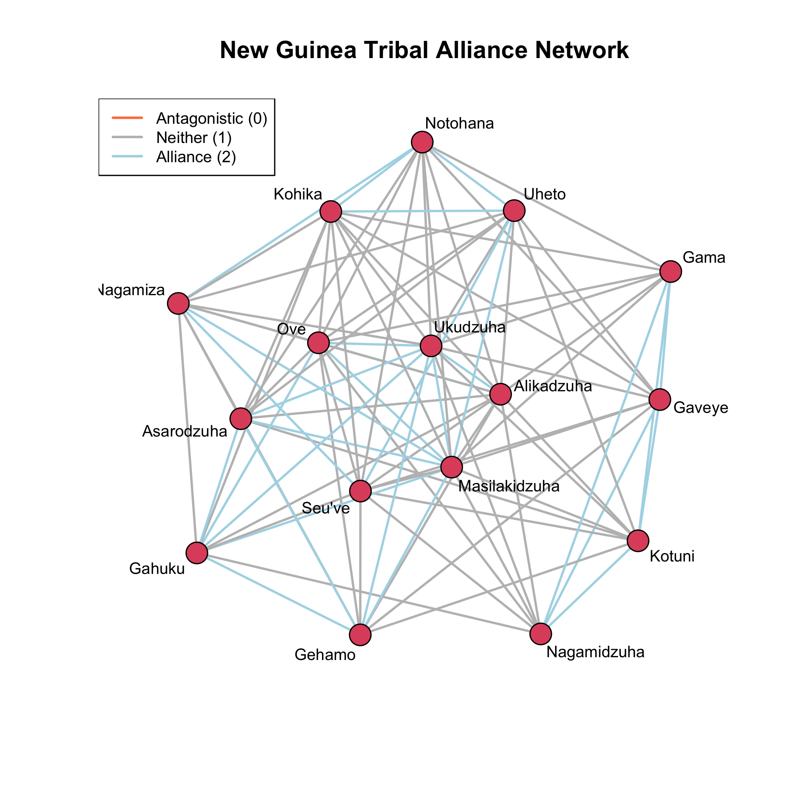

Welcome to Part 9 of the Social Network Analysis R Tutorial series. In our previous tutorials, we've been working exclusively with binary networks, where edges either exist (1) or don't exist (0). However, many real-world networks have valued relationships where connections vary in strength, frequency, or intensity.



In this tutorial, you'll learn how to:

-  **Model valued networks** where edges have weights or counts
-  **Work with signed networks** representing positive and negative relationships
-  **Use the `ergm.count` package** with different reference distributions
-  **Interpret specialized valued ERGM terms** (`nonzero`, `sum`, `transitiveties`)
-  **Apply nodal attributes** in valued network models

## 1. Introduction to Valued Networks

### 1.1 What are Valued Networks?

Unlike **binary networks** where $y_{ij} \in \{0, 1\}$, **valued networks** have edges that can take on multiple values:

-   **Count data**: Number of emails exchanged, number of collaborations
-   **Ordinal data**: Strength of relationship (weak, moderate, strong)
-   **Continuous data**: Amount of trade, frequency of interaction
-   **Signed data**: Positive relationships (+1) and negative relationships (-1)

### 1.2 Why Model Valued Networks?

Binary networks lose important information about relationship **intensity** or **valence**. Consider these examples:

-   In collaboration networks, two researchers might co-author 1 paper or 20 papers—binary networks treat these identically
-   In social networks, relationships can be positive (friendship) or negative (antagonism)
-   In communication networks, the frequency of interaction varies significantly


::: callout-tip
When to Use Valued vs. Binary ERGMs

Use **valued ERGMs** when:

-   Edge weights carry substantive meaning
-   You want to model relationship intensity or frequency
-   Binary collapsing loses too much information

Use **binary ERGMs** when:

-   Presence/absence is the primary interest
-   Weights are unreliable or noisy
:::

### 1.3 The Valued ERGM Framework

For valued networks, the ERGM takes the form:

$$
\Pr_{\theta, h, g}(\mathbf{Y} = \mathbf{y}) = \frac{h(\mathbf{y}) \exp(\theta^T g(\mathbf{y}))}{\kappa_{h,g}(\theta)}
$$

where:

-   $h(\mathbf{y})$ is the **reference distribution** (baseline model)
-   $g(\mathbf{y})$ are the **sufficient statistics** (network features)
-   $\theta$ are the **model parameters**

The key difference from binary ERGMs is that we must **explicitly specify** the reference distribution $h(\mathbf{y})$.

## 2. Case Study: Alliance Networks in New Guinea

We'll analyze the tribal alliance structure among the **Gahuku-Gama** people of the Eastern Central Highlands of New Guinea, studied by Read (1954). This dataset provides a fascinating example of how to model signed networks.

### 2.1 Understanding the Data

The data comes from the `networkdata` package and consists of two binary networks:

-   **`rova`**: Alliance ("rova") relationships coded as 1
-   **`hina`**: Antagonistic ("hina") relationships coded as 1

```{r load-packages, message=FALSE, warning=FALSE}
library(ergm)
library(ergm.count)
library(network)
library(networkdata)

#load the networks
data(rova)
data(hina)
```


### 2.2 Creating an Ordinal Alliance Scale

Rather than analyzing two separate binary networks, we'll create a **single valued network** that represents degree of alliance on a count scale:

```{r create-valued-network, message=FALSE, warning=FALSE}
gama <- rova[,] + (1 - hina[,])
diag(gama) <- 0  # Remove self-loops
gama <- as.network(gama, directed = FALSE, matrix.type = "a", 
                   ignore.eval = FALSE, names.eval = "count")

#check the distribution of edge values
table(gama %e% "count")

#transfer nodal attributes
gama %v% "NS" <- rova %v% "NS"  # North-South geographic position
gama %v% "EW" <- rova %v% "EW"  # East-West geographic position
```

::: callout-note
**Understanding the Transformation**

Let's break down what `gama <- rova[,] + (1 - hina[,])` does:

| Scenario    | rova | hina | Formula   | Result | Meaning             |
|-------------|------|------|-----------|--------|---------------------|
| **Allies**  | 1    | 0    | 1 + (1-0) | **2**  | Strong alliance     |
| **Neither** | 0    | 0    | 0 + (1-0) | **1**  | Neutral/no relation |
| **Enemies** | 0    | 1    | 0 + (1-1) | **0**  | Antagonistic        |

This creates an **ordinal scale** where higher values = more positive relations:

-   0 = Antagonistic (enemies)
-   1 = Neutral (neither allies nor enemies)
-   2 = Alliance (friends)
:::

A Simple Example

Let's illustrate with three hypothetical tribes A, B, and C:

**Original binary networks:**

```         
rova (alliances):       hina (antagonisms):
  A B C                   A B C
A 0 1 0                 A 0 0 1
B 1 0 0                 B 0 0 0
C 0 0 0                 C 1 0 0

Interpretation:
- A-B: allies (rova=1, hina=0)
- A-C: enemies (rova=0, hina=1)
- B-C: no relation (rova=0, hina=0)
```

**After transformation to valued network:**

```         
gama (ordinal alliance scale):
  A B C
A 0 2 0
B 2 0 1
C 0 1 0

Interpretation:
- A-B: 2 (alliance)
- A-C: 0 (antagonistic)
- B-C: 1 (neither/neutral)
```

Now let's visualize the network with edge colors representing relationship types:

```{r plot-network, message=FALSE, warning=FALSE, fig.width=10, fig.height=8}
edge_vals <- gama %e% "count"

#create color mapping: 0=coral, 1=gray, 2=lightblue
edge_colors <- c("coral", "gray", "lightblue")[edge_vals + 1]

set.seed(124)
plot(gama, vertex.cex = 2, 
     label = network.vertex.names(gama),
     label.cex = 0.8, 
     edge.col = edge_colors, 
     edge.lwd = 2,
     main = "New Guinea Tribal Alliance Network")
legend("topleft", 
       legend = c("Antagonistic (0)", "Neither (1)", "Alliance (2)"), 
       col = c("coral", "gray", "lightblue"), 
       lty = 1, lwd = 2, cex = 0.8)
```

::: callout-note
Network Structure Observations

The network shows a densely connected structure with 16 tribes linked primarily by:

-   **Neutral ties (gray, n=62)**: Most common, indicating strategic flexibility
-   **Alliance ties (light blue, n=29)**: Many positive relationships
-   **Antagonistic ties (coral, few visible)**: Relatively rare

The network displays a **core-periphery organization** with most tribes forming a tightly interconnected cluster (e.g., Ukudzuha, Alikadzuha, Ove, Seu've). The prevalence of neutral ties suggests that maintaining options and avoiding permanent enemies may be valued in inter-tribal diplomacy.
:::

## 3. Valued ERGM Terms

Before modeling, let's understand the specialized terms for valued networks.

### 3.1 Core Valued ERGM Terms

::: callout-tip

| Term | Formula | Interpretation |
|:----------------|:-------------------|:----------------------------------|
| **`sum`** | $\sum_{(i,j) \in \mathbb{Y}} y_{ij}$ | Total edge weight (like "edges" for binary) |
| **`nonzero`** | $\sum_{(i,j) \in \mathbb{Y}} \mathbb{I}(y_{ij} \neq 0)$ | Number of edges with any weight (tie existence), Sum of the indicator function of y-i-j not equal to zero",  $I$ is the indicator function  |
| **`transitiveties(threshold)`** | Transitive triples with edge weights ≥ threshold | Clustering with valued edges |
| **`absdiff("attr", form="nonzero")`** | Absolute difference on attribute, affects tie formation | Homophily for valued networks |
| **`nodematch("attr", form="sum")`** | Matching on attribute, affects edge intensity | Homophily for edge weights |

These terms allow us to model:

1.  **Whether ties exist** (`nonzero`)
2.  **How strong ties are** (`sum`)
3.  **Clustering patterns** (`transitiveties`)
4.  **Attribute effects** on both existence and intensity
:::

### 3.2 Network Type Compatibility

Here's a quick reference:

| Column | Full Name | Meaning |
|:--------------------|:---------------------------|:----------------------|
| `bin` | Binary | Simple networks with edges present (1) or absent (0) |
| `val` | Valued | Networks with weighted/valued edges |
| `dir` | Directed | Networks with directional ties ($A \to B \neq B \to A$) |
| `undir` | Undirected | Networks where ties are symmetric ($A — B = B — A$) |
| `dyad-indep` | Dyad Independent | Terms where each dyad is independent |

**For our Gahuku-Gama tribal network:** It's **valued** and **undirected**, so we need terms marked as both `val` and `undir`.

## 4. Model 1: Baseline Model with `nonzero` and `sum`

Let's start with a simple model that separately estimates:

1.  The tendency to form **any relationship** (`nonzero`)
2.  The overall **intensity** of relationships (`sum`)

```{r model-1, message=FALSE, warning=FALSE}
fit_baseline <- ergm(gama ~ nonzero + sum, 
                     response = "count",
                     reference = ~Binomial(2),
                     control = control.ergm(seed = 123))

summary(fit_baseline)

coef_table_baseline <- data.frame(
  Coefficient = round(coef(fit_baseline), 3),
  SE = round(summary(fit_baseline)$coefficients[, "Std. Error"], 3),
  OR = round(exp(coef(fit_baseline)), 3),
  p_value = round(summary(fit_baseline)$coefficients[, "Pr(>|z|)"], 4)
)

print(coef_table_baseline)
```

### 4.1 Interpretation 

-   `nonzero` means modeling the probability of having any relationship vs. no relationship at all. It captures the baseline tendency for actors to form relationships in the network, similar to the `edge` term in a binary ERGM (Coefficient means Log-odds of a dyad having a nonzero value (1 or 2) vs. zero value (0)). $\beta = 0.165$, this estimate is not statistically significant, meaning there's no strong evidence of a systematic preference for forming verses not forming ties beyoond what we'd expect by chance.

-   `sum` models the intensity/strength (total count) of relationships across all edges in the network. It represents the overall level of activity or intensity of relationships, controlling for whether ties exist (Coefficient means the log-odds for each unit increase in edge value). $\beta = -0.084$, the negative coefficient suggests that, conditional on a tie existing, there's a slight tendency toward lower intensity relationship, but the estimate is not statistically significant.

::: callout-note
Understanding reference distributions `reference = ~Binomial(2)`

In valued ERGMs, we must specify a **reference distribution** that defines the baseline probability model. Here we use **Binomial(2)** because:

-   Each dyad can take values 0, 1, or 2 (three possible alliance levels)
-   This is equivalent to **two independent Bernoulli trials** per dyad
-   The Binomial reference makes edge values independent by default

Other common reference distributions:

-   **`~Poisson`**: For unbounded count data
-   **`~DiscUnif(0, k)`**: For discrete uniform distributions over 0 to k
-   **`~Geometric`**: For geometric distributions

The reference distribution affects interpretation: Binomial uses log-odds (like logistic regression), while Poisson uses log-rates.
:::

## 5. Model 2: Adding Transitivity

Structural balance theory suggests that **alliances should cluster**—if tribe A allies with B, and B allies with C, then A and C are more likely to ally. Let's test this with the `transitiveties` term.

```{r model-2, message=FALSE, warning=FALSE}
fit_transitive <- ergm(gama ~ nonzero + sum + 
                       transitiveties(threshold = 1.5),
                       response = "count", 
                       reference = ~Binomial(2),
                       control = control.ergm(seed = 123))

summary(fit_transitive)

coef_table_transitive <- data.frame(
  Coefficient = round(coef(fit_transitive), 3),
  SE = round(summary(fit_transitive)$coefficients[, "Std. Error"], 3),
  OR = round(exp(coef(fit_transitive)), 3),
  p_value = round(summary(fit_transitive)$coefficients[, "Pr(>|z|)"], 4)
)

print(coef_table_transitive)

plogis(coef(fit_transitive)["nonzero"])
```

### 5.1 Interpretation

-   The `transitiveties(threshold = 1.5)` term captures triadic transitivity in valued network. Specifically, it counts transitive triples where the relationship strengths exceed the threshold of 1.5. In this network scenario: If person A has a strong gama relationship with B (≥1.5), and B has a strong gama relationship with C (≥1.5), this term captures the tendency for A and C to also have a gama relationship. This represents the "friend of a friend" phenomenon in valued networks.

-   **nonzero:** $\beta = 1.464*$, represents the baseline log-odds of a gama tie existing between any two randomly selected individuals in the network, while controlling for overall relationship intensity (sum) and transitivity structure. The positive coefficient indicates a tendency toward forming gama relationships rather than having no relationship. This effect is statistically significant (p = 0.010). The $OR = 4.32$ means the baseline odds of having any gama tie (vs. no tie) is 4.32 times higher than the reference baseline. The baseline probability is 81.2%.

-   **sum:** $\beta = -1.406**$, represents the log-odds associated with the total count/intensity of relationships across all edges in the network, controlling for tie existence (nonzero) and transitivity. The negative coefficient indicates a preference for lower-intensity gama relationships This effect is highly statistically significant (p = 0.004). The odds ratio $OR = 0.245$ means that for each unit increase in total relationship count, the odds decrease by about 75.5%.

-   **transitiveties(threshold=1.5):** $\beta = 0.769$, represents the change of log-odds for each additional transitive triple where ties exceed the threshold of 1.5. The positive coefficient indicates strong triadic closure - if A has a strong gama relationship with B, and B with C, then A and C are significantly more likely to also share a gama relationship. This effect is highly statistically significant (p = 0.004). The odds ratio $OR = exp(0.769) = 2.16$ means that for each additional transitive triple, the odds of forming the completing tie increase by 116%.


## 6. Model 3: Adding Nodal Attributes

Does **geography matter** for alliance formation? Let's test whether tribes closer together on the north-south axis are more likely to form alliances.

```{r model-3, message=FALSE, warning=FALSE}
fit_geography <- ergm(gama ~ nonzero + sum + 
                      transitiveties(threshold = 1.5) +
                      absdiff("NS", form = "nonzero"),
                      response = "count",
                      reference = ~Binomial(2),
                      control = control.ergm(seed = 123))

summary(fit_geography)

coef_table_geography <- data.frame(
  Coefficient = round(coef(fit_geography), 3),
  SE = round(summary(fit_geography)$coefficients[, "Std. Error"], 3),
  OR = round(exp(coef(fit_geography)), 3),
  p_value = round(summary(fit_geography)$coefficients[, "Pr(>|z|)"], 4)
)

print(coef_table_geography)

cat("Model 1 (Baseline):", 
    sprintf("AIC = %.2f, BIC = %.2f", AIC(fit_baseline), BIC(fit_baseline)), "\n")
cat("Model 2 (+ Transitivity):", 
    sprintf("AIC = %.2f, BIC = %.2f", AIC(fit_transitive), BIC(fit_transitive)), "\n")
cat("Model 3 (+ Geography):", 
    sprintf("AIC = %.2f, BIC = %.2f", AIC(fit_geography), BIC(fit_geography)), "\n\n")

anova(fit_baseline, fit_transitive, fit_geography)
```


### 6.1 Interpretation

-   `absdiff("NS", form = "nonzero")` term measures the absolute difference in north-south geographic location between two individuals, but only influence the probability of tie formation (the "nonzero"), not the intensity of the relationship. $\beta = 0.219*$ is statisitically significant, which represents the change in log-odds of forming a gama tie for each unit increase in north-south geographic distance, controlling for relationship intensity and transitivity. The positive coefficient indicates that individual who are geographically farther on the north-south axis are more likely to form gama relationship. The $OR = 1.245$ means that for each unit increase in north-south distance, the odds of forming a gama tie increase by about 24.5%.

-   AIC comparison: Model 3(e) shows modest but consistent improvement, with AIC decreasing by 1.53 from model 3(d) and by 2.97 from model 3(c). While these reductions are small, any decrease in AIC indicates better model fit.

-   BIC comparison: Model 3(e) shows substantial improvement, with BIC decreasing by 10.92 from model 3(d) and by 26.47 from model 3(c). This larger reduction strongly supports including the geographic term, even accounting for the penalty for additional parameters.

-   Likelihood Ratio Test: The ANOVA results confirm that model 3(e) fits significantly better than both previous models. Adding the geographic term produces a deviance improvement of 7.67 (chisq = 7.67, p = 0.0056\*\*), indicating that geography contributes meaningful explanatory power beyond transitivity and basic tie formation patterns.


## 7. Signed vs. Ordinal Networks

### 7.1 What We Lost:

1.  **Sign/Valence Information:**
    -   Signed networks explicitly distinguish positive relationships (alliances) from negative relationships (antagonism)
    -   The ordinal scale treats relationships only by intensity, not by their positive or negative nature
    -   We cannot model structural balance theory: the tendency for "enemy of my enemy is my friend"
    -   We cannot distinguish between "no relationship" versus "antagonistic relationship" at the lower end
2.  **Qualitatively Different Relationship Types:**
    -   Signed networks recognize that positive and negative ties represent different social processes
    -   The ordinal scale assumes a single dimension where relationships differ only in degree, not in kind
    -   We cannot test hypotheses about reciprocity of antagonism versus reciprocity of alliance separately
3.  **Theoretical Insights:**
    -   Balance theory and status theory specifically apply to signed networks
    -   We lose insights about coalition formation, conflict dynamics, and how positive/negative relationships co-evolve
    -   The ordinal model assumes increasing values are "better," but a strong negative tie is not simply "less than" a positive tie
4.  **Predictive Patterns:**
    -   Different nodal attributes may predict positive versus negative ties differently
    -   Example: Similarity may promote friendship, but dissimilarity doesn't necessarily promote enmity
    -   Geographic distance might have opposite effects on alliances versus antagonism
    -   The ordinal model constrains all predictors to have monotonic effects

### 7.2 What We Gained:

1.  Simplicity in modeling and interpretation
2.  Ability to use valued ERGM framework with clear intensity measures
3.  Single unified model rather than separate models for each tie type
4.  Appropriate when negative ties are rare or when the research question focuses on alliance strength

---

*This tutorial is based on UCLA [STATS 218: Social Network Analysis](https://handcock.github.io/teaching/218/) taught by Prof [Mark Handcock](https://handcock.github.io/).*
