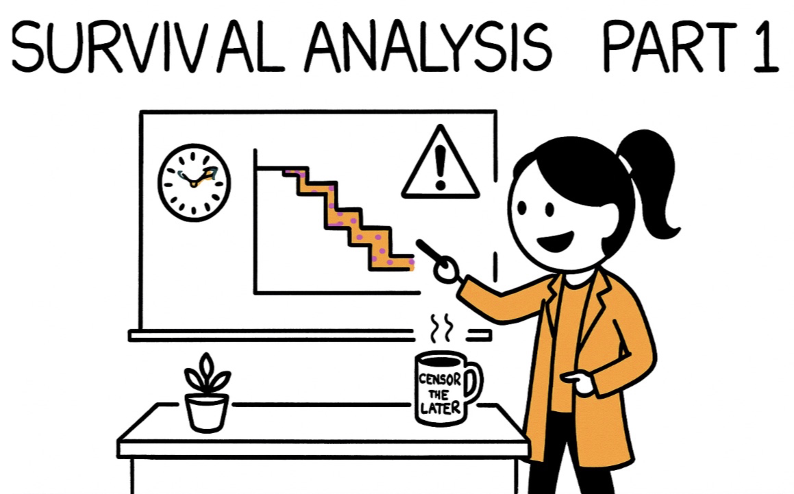

This post will introduce survival analysis and its application in higher education research. 

## 1. What is survival analysis?

- Survival analysis concerns a special kind of outcome variable: **the time until an event occurs**.
- For example, imagine we track a cohort of 2015 PhD entrants and follow them for eight years (6 academic year plus a two-year grace period) to study their **time to Phd dissertation defense**. 
- We want to model each student’s time to dissertation defense using predictors such as program‐area (STEM, social science, humanities), guaranteed funding length, annual teaching-assistant hours, advisor’s mean annual publication count, number of peer-reviewed papers, and milestone pace (e.g., months to candidacy).
- At first this seems like an ordinary regression task, but a crucial complication arises: many students are still writing—or may have withdrawn—when our eight-year observation window closes.
  - Students who are still enrolled have an unknown future completion date: their time-to-degree is **right-censored**.
  - Students who formally leave the program without a degree can be handled either as censored.
- Survival analysis lets us incorporate these censored cases correctly, estimate semester-by-semester (or month-by-month) hazards of completion, and test how factors like guaranteed funding or advisor productivity alter the **timing** not just the **probability** of earning the PhD.

## 2. Examples of research in higher education used this methods

The following papers illustrate the application of survival analysis in higher-education research.

> **Paper 1**: Kaminski, D., & Geisler, C. (2012). Survival analysis of faculty retention in science and engineering by gender. *science*, 335(6070), 864-866.

- **Research question**: How long do assistant professors in nine STEM fields remain at the institutions that hired them, and does that timing differ for men and women?
- **Data & event**: 2,966 individual faculty hired 1990-2002 at 14 U.S. research universities; event = leaving the institution (voluntarily or after tenure denial).
- **Survival methods**:
  - Kaplan-Meier curves to visualise retention patterns and median “time-to-exit”.
  - Parametric survival models (best-fit log-normal) plus Cox proportional-hazards models to test discipline and gender effects.
- **Key findings**: Across STEM as a whole, men and women exit at similar rates (median ≈ 11 years), but mathematics is an outlier—women leave far sooner (median 4.5 yrs vs 7.3 yrs for men). Departments therefore need discipline-specific retention strategies.

> **Paper 2**: Box-Steffensmeier, J. M., Cunha, R. C., Varbanov, R. A., Hoh, Y. S., Knisley, M. L., & Holmes, M. A. (2015). Survival analysis of faculty retention and promotion in the social sciences by gender. *PloS one*, 10(11), e0143093.

- **Research question**: (1) Does time-to-departure differ by gender for social-science faculty? (2) Does time-to-promotion (assistant → associate → full) differ by gender?
- **Data & events**: 2,218 assistant professors (1990-2009) in seven disciplines at 19 U.S. universities; three survival outcomes: departure, promotion to associate, promotion to full.
- **Survival methods**:
  - Kaplan-Meier curves plus log-rank (Gehan-Wilcoxon) tests.
  - Cox proportional-hazards models with frailty terms to handle unobserved heterogeneity; interactions to see whether gender gaps vary by discipline or cohort.
- **Key findings**:
  - Retention: no significant gender difference in risk of leaving.
  - Promotion: men reach tenure faster; evidence on promotion to full professor is mixed and discipline-specific (e.g., sociology shows a male advantage).

> **Paper 3**: Shulin Zhou, Yihui Li, Margot Neverett, Beverly King, Kyle Chapman, and Sharon McNair. Survival Analysis of Transfer Students. AIR Report.

- **Research question**: (1) What is the semester-by-semester survival (persistence) rate for new transfer students over their first eight semesters? (2) Do survival curves differ by age, STEM vs non-STEM major, major-change status, transfer GPA, credits transferred, enrollment status, gender and URM status? (3) How large are the effects of those covariates on the hazard of departure? 
- **Data & event**: 11,267 transfer undergraduates who entered a large public R2 university (U.S. Southeast) between 2010 – 2017; event = permanent departure without a bachelor’s degree, with right-censoring for students still enrolled or already graduated within the eight-semester window.
- **Survival methods**:
  - Kaplan–Meier curve for the cohort; semester-specific hazard plot.
  - Stratified Kaplan–Meier + log-rank (Gehan-Wilcoxon) tests for subgroup comparisons.
  - Cox proportional-hazards model; violations for STEM major, major-change and enrollment status handled via a time-varying, stratified Cox model with three time bands (Sem 1-2, 3-4, 5-8).
- **Key findings**: 
  - +1 transfer GPA point → 31 % lower hazard (HR ≈ 0.69).
  - Part-time status nearly doubles hazard in Sem 1-2 (HR ≈ 1.96) but effect fades by Year 3.
  - STEM majors 40 % safer in Year 1 (HR ≈ 0.60) yet 34 % riskier after Year 2 (HR ≈ 1.34).
  - Changing major highly protective in Year 1 (HR ≈ 0.32) but reverses in Sem 3-4 (HR ≈ 1.44).
  - Each extra transfer credit lowers hazard 0.7 %; each extra year of age raises hazard 1 %.

## 3. Some key concept and notation

| Symbol/Term | What it means mathematically | PhD-defense example |
|:------------|:------------------------------|:-------------------------|
| **T** – event time | The unknown, positive random variable representing the time from program entry until the event occurs. | Months (or semesters) from Fall 2015 matriculation to the moment a student **successfully defends** the dissertation. |
| **C** – censoring time | The time at which observation stops **before** the event is observed. | • Spring 2023, when the study window closes (8 years). • The semester a student withdraws or transfers. |
| **Y = min (T, C)** | The *observed* time: we either see the event (T) or censoring (C), whichever comes first. | • *Y* = 48 mo for a Year-4 defender (T < C). • *Y* = 96 mo for a student still writing at study end (C < T). |
| **δ** – status indicator | $\delta=\begin{cases}1 & \text{if } T\le C \\[4pt] 0 & \text{if } T>C \end{cases}$ | δ = 1 → event observed; δ = 0 → right-censored. δ = 1 for the Year-4 completer; δ = 0 for the still-enrolled student **or** the one who withdrew without defending. |
| **Survival function** | $S(t)=\Pr(T>t)$ | Probability the event has **not yet** occurred by time *t*. It starts at 1 when *t* = 0 and steps downward as defenses occur. $S(48)=0.62$ would mean 62% of the cohort have **not** defended by 48 months. |
| **Hazard function** | $h(t)=\displaystyle\lim_{\Delta t\to0}\frac{\Pr(t\le T<t+\Delta t \mid T\ge t)}{\Delta t}$ | Instantaneous event rate at time *t* among those who are still at risk just before *t*. |

## 4. Commom strategies in doing survial analysis:

- **Kaplan–Meier (K-M) curve**：
  - **What it does?** Draws a step-down curve that shows, at every moment, the *percentage of the cohort that has not yet experienced the event*. It makes *no modelling assumptions*—it simply counts who finished and who is still “at risk.”
  - **PhD dissertation defense example:** Plot months on the x-axis and the proportion of 2015 entrants who have not defended on the y-axis. The curve might sit at 1.0 on day 0, drop to 0.80 after 48 months, and reach 0.30 by month 96.
  - **Typical questions it answers:** *Descriptive timing*. What is the median time to defense? (the month where the curve crosses 0.50) What fraction of students are still writing after six years? Does the drop look gradual or are there “cliff” periods (e.g., big steps every April)?
  
- **Log-rank test**:
  - **What it does?** A simple, non-parametric hypothesis test that compares two or more K-M curves and asks: “Are these survival patterns statistically different overall?” It weights each event equally across time.
  - **PhD dissertation defense example:** Plot separate K-M curves for STEM vs humanities students; run a log-rank test. A small p-value means the curves differ enough that we doubt chance alone created that gap.
  - **Typical questions it answers:** *Group comparisons*. Do STEM and non-STEM students defend at different rates? Does guaranteeing five years of funding speed up completion compared to three-year packages?

- **Cox proportional-hazards (PH) model**
  - **What it does?** A regression that relates the *hazard of finishing at each moment* to one or many predictors. It reports *hazard ratios (HR)*: numbers above 1 mean the event happens sooner, below 1 mean later. The baseline hazard is left unspecified, so we avoid picking a parametric shape.
  - **PhD dissertation defense example:** Fit a Cox model with funding length, advisor publication rate, months-to-candidacy, and field. An HR = 1.30 for “each additional advisor paper per year” means students with more productive advisors defend 30 % faster at any moment, holding other factors constant.
  - **Typical questions it answers:** *Multivariable timing effects*. After adjusting for field and funding, how much does early candidacy speed up defense? Are part-time teaching loads still a drag on completion once GPA and advisor productivity are in the model? Which factors matter independently, and by how much, for the timing (not just the likelihood) of finishing?
