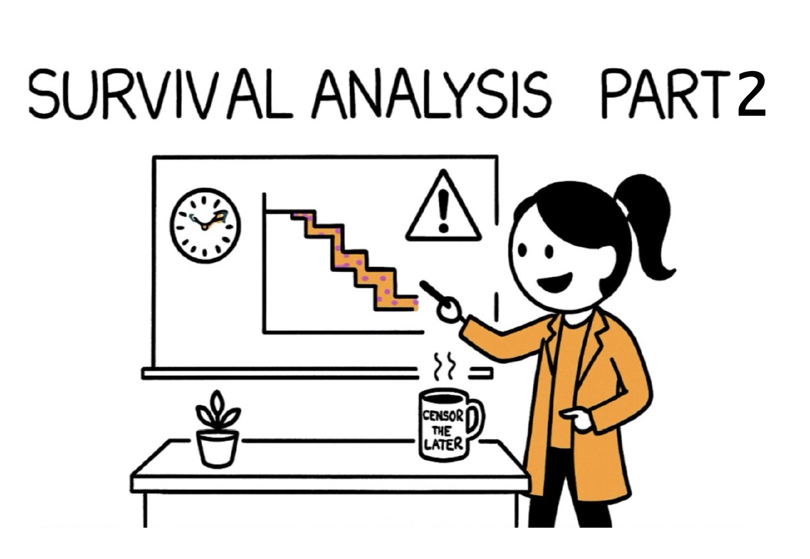

This tutorial provides R example for survival analysis using PhD dissertation defense timing as the primary example. 



## Set up and Data Simulation

Let's create a realistic dataset of PhD students entering a graduate program in Fall 2015. We'll simulate data for 300 students across different program areas.

```{r, message=FALSE, warning=FALSE}
# Load required packages
library(knitr)
library(dplyr)
library(survival)
library(ggplot2)
library(tibble)
library(lubridate)
library(ggsurvfit)
library(gtsummary)
library(tidycmprsk)
library(purrr)
library(broom.helpers)


# Set random seed for reproducibility
set.seed(42)
```


The dataset we created simulates the PhD completion journey for 300 graduate students across three program areas (STEM, Social Science, and Humanities). For each student, we track key factors that influence their time to graduation, including

- how many years of funding they receive
- how many hours they spend teaching as a teaching assistant each year 
- how productive their advisor is (measured by annual publications)
- how many papers the student publishes
- how long it takes them to reach candidacy status

The dataset then calculates a realistic completion time based on these factors, where students in STEM programs tend to finish faster than those in humanities, students with more funding complete sooner, and those with heavy teaching loads or less productive advisors take longer. The final dataset includes whether each student successfully defended their dissertation or dropped out of the program, creating a realistic simulation that mirrors the challenges and variability seen in actual PhD programs.

```{r, message=FALSE, warning=FALSE}
# Function to generate survival times based on covariates
generate_defense_time <- function(n = 300) {
  
  # generate baseline covariates
  data <- tibble(
    student_id = 1:n,
    program_area = sample(c("STEM", "Social Science", "Humanities"), n,
                          replace = TRUE, prob = c(0.45, 0.35, 0.20)),
    funding_years = sample(c(3, 4, 5, 6), n,
                          replace = TRUE, prob = c(0.15, 0.35, 0.40, 0.10)),
    ta_hours_annual = round(rnorm(n, mean = 300, sd = 100)),  #TA ~300 for hours
    advisor_pubs_annual = round(rnorm(n, mean = 2.5, sd = 1.2)),
    peer_reviewed_papers = rpois(n, lambda = 1.5), #random Poisson distribution
    months_to_candidacy = round(rnorm(n, mean = 36, sd = 12))  
  )
  
  # clean up unrealistic value
  data <- data %>%
    mutate(
      ta_hours_annual = pmax(0, pmin(ta_hours_annual, 600)), #TA hours are bounded between 0 and 600 hours annually
      advisor_pubs_annual = pmax(0, advisor_pubs_annual), #advisor annual publication can't be negative
      peer_reviewed_papers = pmax(0, peer_reviewed_papers), #peer-reviewed papers can't be negative
      months_to_candidacy = pmax(18, pmin(months_to_candidacy, 72)) #time to candidacy is bounded between 18 and 72 months
    )
  
  # Generate survival times using a Weibull distribution
  # with covariates affecting the scale parameter
  data <- data %>%
    mutate(
      # create linear predictor
      linear_pred = case_when(
        program_area == "STEM" ~ 0,  #baseline
        program_area == "Social Science" ~ 0.2,  #20% slower
        program_area == "Humanities" ~ 0.4 #40% slower
      ) + 
        -0.1 * (funding_years - 4) +  # More funding = faster completion
        0.002 * (ta_hours_annual - 300) +  # More TA hours = slower
        -0.05 * (advisor_pubs_annual - 2.5) +  # More productive advisor = faster
        -0.1 * peer_reviewed_papers +  # More papers = faster
        -0.05 * (months_to_candidacy - 36),  # Faster to candidacy = faster overall
      
      # Generate Weibull survival times
      scale_param = exp(linear_pred + 4),  # Base scale around 54 months
      shape_param = case_when(                # Shape varies by field
        program_area == "STEM" ~ 1.6,
        program_area == "Social Science" ~ 1.4,
        program_area == "Humanities" ~ 1.2
      ),
      
      # Generate times
      u = runif(n),
      time_months = scale_param * (-log(u))^(1/shape_param)
      )
      
  # Generate censoring times (study ends after 96 months, some students leave early)
  data <- data %>%
    mutate(
      # Study censoring at 96 months
      study_end = 96,
    
  # Early withdrawal - higher rates for certain groups
  withdrawal_prob = case_when(
    funding_years <= 3 ~ 0.25,           #less funding = higher withdrawal
    ta_hours_annual > 400 ~ 0.22,        #heavy TA load = higher withdrawal
    months_to_candidacy > 48 ~ 0.20,     #slow to candidacy = higher withdrawal
    TRUE ~ 0.12
  ),
  
  early_withdrawal = rbinom(n, 1, withdrawal_prob),
  
  # Withdrawal time depends on when students are most likely to leave
  withdrawal_time = ifelse(early_withdrawal == 1, 
                          pmax(12, rnorm(n, mean = 36, sd = 18)), # Most leave around year 3
                          Inf),
  
  # Observed time is minimum of defense time, withdrawal time, and study end
  censoring_time = pmin(withdrawal_time, study_end),
  observed_time = pmin(time_months, censoring_time),
  
  # Event indicator: 1 = defended, 0 = censored
  event = ifelse(time_months <= censoring_time, 1, 0),
  
  # Reason for censoring
  censoring_reason = case_when(
    event == 1 ~ "Defended",
    withdrawal_time < study_end & withdrawal_time <= time_months ~ "Withdrew",
    TRUE ~ "Study ended"
      )
    )
  
  # Final cleanup and selection
  data <- data %>% 
  select(student_id, program_area, funding_years, ta_hours_annual, 
         advisor_pubs_annual, peer_reviewed_papers, months_to_candidacy, 
         observed_time, event, censoring_reason) %>%
    mutate(
      observed_time = round(observed_time, 1),
      # Convert to years for easier interpretation
      observed_time_years = round(observed_time / 12, 1),
      # Also provide semester version
      observed_time_sem = round(observed_time / 6, 1)
  )
}

# Generate the dataset
phd_data <- generate_defense_time(300)

# Display first few rows
head(phd_data)
str(phd_data)
```

### Dataset Summary

Following is the key concepts in the context of PhD dissertation defense dataset:

| Symbol/Term | Mathematical Definition | PhD Defense Example |
|-------------|------------------------|---------------------|
| **T** (event time) | Unknown positive random variable representing time from program entry to event | Months from Fall 2015 matriculation to successful dissertation defense |
| **C** (censoring time) | Time at which observation stops before event is observed | • Spring 2023 when study ends (96 months)<br>• When student withdraws or transfers |
| **Y = min(T, C)** | Observed time: either event or censoring, whichever comes first | • Y = 48 months for Year-4 defender (T < C)<br>• Y = 96 months for student still writing at study end (C < T) |
| **δ** (status indicator) | δ = 1 → event observed<br>δ = 0 → right-censored | δ = 1 for successful defender<br>δ = 0 for student still enrolled or withdrew |
| **S(t)** (survival function) | $S(t) = P(T > t)$<br>Probability event hasn't occurred by time t | S(48) = 0.62 means 62% haven't defended by 48 months |
| **λ(t)** (hazard function) | $λ(t) = lim[P(t ≤ T < t+Δt | T ≥ t)]/Δt$<br>Instantaneous event rate at time t | Rate of defense completion among those still at risk |


## Part 1 Kaplan-Meier Survival Curves

The Kaplan-Meier estimator provides a non-parametric method to estimate the survival function. 

### Overall Survival Curve

```{r, message=FALSE, warning=FALSE}
# create survival object
surv_obj <- Surv(phd_data$observed_time, phd_data$event)

# fit Kaplan-Meier curve
km_fit <- survfit2(Surv(observed_time, event) ~ 1, data = phd_data)

# plot overall survival curve
overall_plot <- km_fit %>%
  ggsurvfit() +
  labs(
    x = "Months from Program Entry",
    y = "Probability of Not Yet Defending",
    title = "Overall Survival Curve: Time to PhD Defense",
    subtitle = paste("n =", nrow(phd_data), "students")
  ) +
  add_confidence_interval() +
  add_risktable() +
  theme_minimal() +
  scale_x_continuous(breaks = seq(0, 96, 12)) +
  scale_y_continuous(labels = scales::percent_format())

print(overall_plot)
```

- The cohort’s Kaplan–Meier curve slopes steadily downward: roughly half of the 300 students have defended by the three-year mark, and only about one-in-five are still writing after eight years. The narrow grey band around the step curve shows the 95 % confidence interval, indicating fairly precise estimates until late in the follow-up, when fewer than 40 students remain “at risk.


### Survival Curve by Program Area

```{r, warning=FALSE, message=FALSE}
# Fit survival curves by program area
km_by_area <- survfit2(Surv(observed_time, event) ~ program_area, data = phd_data)

# Plot survival curves by program area
area_plot <- km_by_area %>%
  ggsurvfit() +
  labs(
    x = "Months from Program Entry",
    y = "Probability of Not Yet Defending",
    title = "Survival Curves by Program Area",
    subtitle = "Comparison of PhD defense times across academic fields"
  ) +
  add_confidence_interval() +
  add_risktable() +
  theme_minimal() +
  scale_x_continuous(breaks = seq(0, 96, 12)) +
  scale_y_continuous(labels = scales::percent_format()) +
  scale_color_discrete(name = "Program Area") +
  scale_fill_discrete(name = "Program Area")

print(area_plot)

#log-rank test
survdiff(Surv(observed_time, event) ~ program_area, data = phd_data)
```

When we stratify by program area, the blue STEM line drops fastest, signalling earlier defenses; the red Humanities line stays highest, meaning more candidates remain unfinished at any point; Social-science students (green) sit between the two. The log-rank p-value confirms that these three curves are statistically different.


### Median Survival Times


```{r, message=FALSE, warning=FALSE}
# Calculate median survival times
median_times <- km_by_area %>%
  tidy() %>%
  group_by(strata) %>%
  summarise(
    median_time = median(time[n.event > 0], na.rm = TRUE),
    .groups = "drop"
  )

median_times 

# Summary table by program area
program_summary <- phd_data %>%
  group_by(program_area) %>%
  summarise(
    n_students = n(),
    n_defended = sum(event),
    completion_rate = round(mean(event) * 100, 1),
    median_time_defended = round(median(observed_time[event == 1]), 1),
    median_time_all = round(median(observed_time), 1),
    .groups = "drop"
  )
program_summary
```

- **STEM** programs show the strongest performance with the highest completion rate (89.6%) and shortest overall median time to completion (32.5 months)
- **Humanities** programs face completion challenges with the lowest completion rate (67.2%), though successful graduates finish fastest (26.5 months median for defended students)
- **Social Science** programs fall in the middle for completion rates (73.1%) but show the longest overall median time (38.2 months) when including non-completers


## Part 2 Log-Rank Test

### Testing Difference by Program Area

```{r, message=FALSE, warning=FALSE}
# Log-rank test for program area differences
survdiff(Surv(observed_time, event) ~ program_area, data = phd_data)

# Pairwise comparisons
# STEM vs Social Science
survdiff(Surv(observed_time, event) ~ program_area, 
         data = phd_data %>% filter(program_area %in% c("STEM", "Social Science")))

# STEM vs Humanities
survdiff(Surv(observed_time, event) ~ program_area,
         data = phd_data %>% filter(program_area %in% c("STEM", "Humanities")))

```


- The Log-Rank test (p = 0.002) indicates a statistically significant difference in the time to PhD dissertation defense across the three program areas (Humanities, Social Science, and STEM). This confirms that students in different fields complete their dissertations at varying rates.

- Pairwise comparisons reveal that STEM students complete their dissertations significantly faster than students in both Social Science (p = 0.004) and Humanities (p = 0.004). This aligns with your simulation's design, where STEM programs tend to have quicker completion times.

- Specifically, STEM observed significantly more dissertation defenses than expected (120 vs. 93.8), while Humanities and Social Science observed fewer (39 vs. 51.1 and 79 vs. 93.1, respectively), quantitatively demonstrating the faster completion rates in STEM.


### Testing Differences by Funding Length

```{r, message=FALSE, warning = FALSE}
# Create funding categories
phd_data <- phd_data %>%
  mutate(funding_cat = case_when(
    funding_years <= 3 ~ "≤3 years",
    funding_years == 4 ~ "4 years", 
    funding_years >= 5 ~ "≥5 years"
  ))

# Log-rank test for funding differences
survdiff(Surv(observed_time, event) ~ funding_cat, data = phd_data)

# Plot survival curves by funding
survfit2(Surv(observed_time, event) ~ funding_cat, data = phd_data) %>%
  ggsurvfit() +
  labs(
    x = "Months from Program Entry",
    y = "Probability of Not Yet Defending",
    title = "Survival Curves by Guaranteed Funding Length"
  ) +
  add_confidence_interval() +
  add_risktable()
```

- Based on the above analysis, there is no statistically significant difference in the time to PhD dissertation defense among students with different lengths of guaranteed funding ( ≤3 years, 4 years, or ≥5 years) based on this analysis. While your simulation's design indicates that more funding should lead to sooner completion, this specific statistical test did not find a significant difference in the survival distributions across these funding categories in your simulated data.

## Part 3 Cox Proportional Hazards Models

### Univariate Cox Model

Remember that in Cox regression, a Hazard Ratio (HR) > 1 indicates an increased hazard of the event (faster completion/higher rate of defense), while an HR < 1 indicates a decreased hazard (slower completion/lower rate of defense). The p-value tells you if this effect is statistically significant.

```{r, message=FALSE, warning=FALSE}
# Univariate models for each covariate
uni_models <- list(
  program_area = coxph(Surv(observed_time, event) ~ program_area, data = phd_data),
  funding_years = coxph(Surv(observed_time, event) ~ funding_years, data = phd_data),
  ta_hours = coxph(Surv(observed_time, event) ~ ta_hours_annual, data = phd_data),
  advisor_pubs = coxph(Surv(observed_time, event) ~ advisor_pubs_annual, data = phd_data),
  peer_papers = coxph(Surv(observed_time, event) ~ peer_reviewed_papers, data = phd_data),
  candidacy_time = coxph(Surv(observed_time, event) ~ months_to_candidacy, data = phd_data)
)

# Create table of univariate results using broom
uni_results <- data.frame()

for(i in 1:length(uni_models)) {
  model_name <- names(uni_models)[i]
  model <- uni_models[[i]]
  
  # Extract results
  result <- tidy(model, exponentiate = TRUE, conf.int = TRUE)
  result$variable <- model_name
  
  # Combine results
  uni_results <- rbind(uni_results, result)
}

# Clean up the results table
uni_results <- uni_results %>%
  select(variable, term, estimate, conf.low, conf.high, p.value) %>%
  mutate(
    HR = round(estimate, 3),
    CI_lower = round(conf.low, 3),
    CI_upper = round(conf.high, 3),
    p_value = round(p.value, 4)
  ) %>%
  select(variable, term, HR, CI_lower, CI_upper, p_value)

print(uni_results)

```

- program_area: STEM vs. Baseline (Humanities):
  - HR = 1.68 (CI: 1.17 - 2.42), p_value = 0.0048
  - Interpretation: Compared to the students in Humanities, students in STEM programs have a significantly higher hazard of dissertation defense (HR = 1.68, p < 0.05). This means STEM students are estimated to complete their dissertations approximately 1.68 times faster or at a 68% higher rate, all else being equal in this univariate context, than students in Humanities. This result is consistent with Log-Rank test finding where STEM showed a faster event rate.
  
- ta_hours_annual:
  - HR = 0.998 (CI: 0.996 - 0.999), p_value = 0.0004
  - Interpretation: For each additional annual hour spent as a Teaching Assistant, the hazard of dissertation defense is estimated to decrease slightly (HR = 0.998), which translates to an approximately 0.2% decrease in hazard. This effect, though small in magnitude, is highly statistically significant (p < 0.001). This suggests that a higher teaching load is associated with a slower rate of dissertation completion.


### Multivariable Cox Model

```{r, message=FALSE, warning=FALSE}
# Fit multivariable Cox model
multi_cox <- coxph(Surv(observed_time, event) ~ 
                     program_area + 
                     funding_years + 
                     ta_hours_annual + 
                     advisor_pubs_annual + 
                     peer_reviewed_papers + 
                     months_to_candidacy,
                   data = phd_data)


# Model summary
summary(multi_cox)
```

- **Model Overview:**
  - The model examines how various factors influence the hazard (instantaneous rate) of a successful dissertation defense, taking into account the time from program entry (observed_time) until defense or censoring.
  - The dataset includes 300 PhD students, with 238 having successfully defended their dissertations (number of events = 238). The remaining 62 students were censored (meaning their observation stopped before they defended, perhaps because the study ended or they withdrew/transferred).

- **Overall Model Significance:**
  - The highly significant p-values for the Likelihood Ratio Test, Wald Test, and Score (Logrank) Test (all < 2e-16) indicate that the model as a whole is statistically significant. This means that at least one of the included predictor variables has a significant association with the hazard of defending the dissertation.
  - The Concordance of 0.722 suggests that the model has a reasonably good ability to predict which students will defend earlier versus later.
  
- **Predictors Interpretation: HR (Hazard Ratios) - exp(coef)**
  - `program_areaSTEM`: HR = 1.943; P-value = 0.000472*** **Interpretation: ** Compared to students in humanities, students in STEM programs have a 1.94 times higher hazard of defending their dissertation. It suggests that, controlling for other factors, STEM students are almost twice as likely to complete their dissertation defense at any given point in time compared to the reference group. This implies a faster rate of defense for STEM students.
  - `ta_hours_annual`: HR = 0.997; P-value = 3.04e-06 *** **Interpretation:** For every additional annual hour spent on Teaching Assistant duties, the hazard of defending the dissertation decreases by a slight but statistically significant factor of 0.997. This indicates that more TA hours are associated with a slightly slower rate of dissertation defense. While the individual impact is small, the cumulative effect over many hours could be meaningful.
  - `peer_reviewed_papers`: HR = 1.194; P-value = 0.001027 ** **Interpretation:** For each additional peer-reviewed paper authored by the student, the hazard of defending the dissertation increases by a factor of 1.194. This is a statistically significant finding, suggesting that students who produce more peer-reviewed papers tend to defend their dissertations at a faster rate. This makes intuitive sense, as publications are often a strong indicator of research progress and readiness for defense.
  - `months_to_candidacy`: HR = 1.077; P-value = 2e-16 *** **Interpretation:** For every additional month it takes a student to reach candidacy, their hazard of defending the dissertation increases by 1.077. This means that students who take longer to reach candidacy are associated with a faster rate of dissertation defense. This is a counter-intuitive finding if the event is "defense". It might imply that those who delay candidacy are perhaps taking more time to refine their research and then accelerate towards defense once candidacy is achieved, or there could be a more complex relationship at play. It's worth considering if "months to candidacy" might be correlated with other unmeasured factors or if there's a specific programmatic reason for this.
  

## Part 4 Estimating Key Quantities

### Median Time to Defense

```{r, message=FALSE, warning=FALSE}
# Overall median time to defense
km_fit
print(paste("Median time to defense:", km_fit$median, "months"))

# Median by program area
km_by_area

```

- **Overall Median Time to Defense: ** Overall, the median time to dissertation defense for PhD students in your dataset is 37.6 months.We are 95% confident that the true median time to defense for the population from which this sample was drawn lies between 33.3 and 42.5 months.
- **Median Time to Defense by Program Area: ** For students in Humanities programs, the median time to dissertation defense is 45.5 months. The confidence interval is quite wide (29.8 to 71.9 months). For students in Social Science programs, the median time to dissertation defense is 41.7 months. For students in STEM programs, the median time to dissertation defense is 33.1 months.

### Probability of Defense by Key Timepoints

```{r, message=FALSE, warning=FALSE}
# Probability of defending by various timepoints
timepoints <- c(48, 60, 72, 84, 96)  # 4, 5, 6, 7, 8 years

# Overall probabilities
overall_probs <- summary(km_fit, times = timepoints)

# Create nice table
defense_probs <- tibble(
  years = timepoints / 12,
  prob_defended = 1 - overall_probs$surv,
  lower_ci = 1 - overall_probs$upper,
  upper_ci = 1 - overall_probs$lower
)

print(defense_probs)
```

- Approximately 62.7% of students are expected to have successfully defended their dissertation by the end of their fourth year in the program.
- Approximately 77.8% of students are expected to have successfully defended their dissertation by the end of their sixth year.
- Approximately 81.3% of students are expected to have successfully defended their dissertation by the end of their seventh year.
- Approximately 84.8% of students are expected to have successfully defended their dissertation by the end of their eighth year.


## Part 5 Model Diagnostics

### Proportional Hazards Assumption

- **Core Assumption of the Cox Model:**
  - The Cox model is called "proportional hazards" because it assumes that the hazard ratio (HR) for each predictor variable remains constant over time.
  - For example, if the hazard ratio for "STEM program area" is 1.94, the model assumes that STEM students are 1.94 times more likely to defend their dissertation (compared to the reference group) at any point in time after starting the program. This proportional relationship should hold throughout the entire follow-up period.

- **What Happens if the Assumption is Violated?**
  - If the PH assumption is violated for a particular predictor, it means that its effect on the hazard changes over time.
  - Misleading Hazard Ratios: The single hazard ratio reported for that variable (e.g., exp(coef)) becomes an average effect that might not accurately represent the true effect at different time points. For instance, a variable might have a strong effect early on but no effect later, or vice versa. Reporting a single HR in such a case would be misleading.
  - Incorrect Inferences: Violations can lead to incorrect standard errors, p-values, and confidence intervals, making your conclusions about the statistical significance and magnitude of effects unreliable.
  - Suboptimal Model Fit: A model with violated PH assumptions isn't fully capturing the dynamic relationships in your data, potentially leading to a less accurate or less informative model.
  
- **What to Do if Assumption is Violated:**
  - Stratification: If a categorical variable violates the assumption, we can stratify the model by that variable. This allows the baseline hazard to differ across strata, effectively allowing the hazard ratio for other variables to be proportional within each stratum.
  - Time-Varying Covariates/Coefficients: For continuous variables or when stratification isn't suitable, we can model the effect of the variable as changing over time by including a time-dependent covariate (e.g., interaction with `log(time)` or `tvc` functions in other packages). This means the coefficient (`coef`) is no longer constant but varies with time.
  - Alternative Models: In some cases, if violations are severe and cannot be adequately addressed, alternative survival models (e.g., accelerated failure time models) might be considered.

```{r, message=FALSE, warning=FALSE}
# Test proportional hazards assumption
ph_test <- cox.zph(multi_cox)
print(ph_test)

# Plot Schoenfeld residuals
plot(ph_test)
```
- This table shows the results of the Schoenfeld residuals test for the proportional hazards assumption for each covariate in your multi_cox model, as well as for the model globally.
- The p-value is greater than 0.05, indicating that there is no statistically significant evidence to reject the proportional hazards assumption for the certain `variable`.
- The `GLOBAL` test checks the proportional hazards assumption for all covariates in the model simultaneously. A high p-value (0.80 in this case) indicates that, overall, there is no statistically significant evidence to reject the proportional hazards assumption for the entire model.
- Based on the statistical p-values from output (all of which are high and non-significant), we would expect these plots to generally show flat, non-sloping lines, consistent with the assumption holding true. The visible plots seem to visually confirm this for the variables they represent.

### Model Fit Assessment

- **Why we do this? to evaluate predictive ability:** How well does our model predict the outcome? A good model should accurately differentiate between individuals who experience the event sooner and those who experience it later (or are censored). The concordance index helps us quantify this.

```{r}
# Concordance index
concordance(multi_cox)

# Residual analysis
plot(predict(multi_cox), residuals(multi_cox, type = "martingale"))
abline(h = 0, col = "red")
```

- The **concordance index** (often denoted as 'c-index') is a measure of the predictive accuracy of a survival model.
  - It represents the proportion of all possible pairs of subjects in the dataset where the subject with the shorter observed survival time (or who experienced the event) was correctly predicted by the model to have a higher hazard.
  - Scale: 0.5 means the model's predictions are no better than random chance. 1.0 means the model perfectly discriminates between subjects (perfect prediction).
  - **Interpretation:** The concordance index of 0.7216 (or 72.16%) indicates that for approximately 72.16% of all comparable pairs of students, the model correctly identifies which student is at higher risk of defending their dissertation sooner. This is generally considered a good level of predictive accuracy for a survival model in social science or health research. 