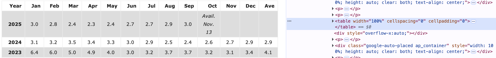

## 1. Introduction

Web scraping is the process of automatically extracting data from websites. In data analysis and research, we often need to collect data from online sources that don't provide downloadable datasets or APIs. Web scraping allows us to systematically gather this information for analysis.

### Why Web Scraping?

- **Access real-time data**: Economic indicators, weather data, stock prices, social media trends
- **Build custom datasets**: When APIs aren't available or have limitations
- **Research applications**: Collecting text for NLP, monitoring websites, gathering statistics
- **Automate data collection**: Instead of manually copying data from multiple pages

### Ethical and Legal Considerations

Before scraping any website, always consider:

1. **Check for an API first**: Many websites offer official APIs that are more reliable and ethical
2. **Review Terms of Service**: Some websites explicitly prohibit scraping
3. **Respect `robots.txt`**: Check the website's robots.txt file for scraping policies
4. **Be considerate**: Don't overwhelm servers with too many requests - add delays between requests
5. **Legal compliance**: Ensure you're following data protection laws (GDPR, CCPA, etc.)
6. **Copyright**: Respect intellectual property and don't republish copyrighted content


## 2. The `rvest` Package

The `rvest` package, developed by Hadley Wickham, is the primary tool for web scraping in R. It provides a simple and consistent API for web scraping tasks, built on top of `xml2` and `httr`.

### Core Functions

Here are the essential `rvest` functions you'll use:

```{r rvest_functions, eval=FALSE}
#reading pages
read_html(url)              # Read HTML from a URL or file

#selecting elements
html_node(css)              # Select first matching element
html_nodes(css)             # Select all matching elements
html_element(xpath)         # Select using XPath (alternative to CSS)
html_elements(xpath)        # Select all using XPath

#extracting content
html_text()                 # Extract text content
html_text2()                # Extract text with better whitespace handling
html_table()                # Extract tables as data frames
html_attr(name)             # Extract attribute value (e.g., "href", "class")
html_attrs()                # Extract all attributes

#navigation
html_children()             # Get child elements
html_parent()               # Get parent element
```

### Basic Workflow

A typical web scraping workflow with `rvest` follows these steps:

```{r workflow_diagram, eval=FALSE}
#1. Read the HTML page
page <- read_html("https://example.com")

#2. Select elements using CSS selectors
elements <- page %>% html_nodes(".class-name")

#3. Extract the data you need
data <- elements %>% html_text()

#4. Clean and structure the data
cleaned_data <- data %>% 
  data.frame() %>%
  filter(!is.na(.))
```

### CSS Selectors Quick Reference

CSS selectors are patterns used to select HTML elements. Here are the most common ones:

| Selector | Example | Meaning |
|----------|---------|---------|
| `tag` | `p`, `div`, `table` | Select all elements of that type |
| `.class` | `.article`, `.price` | Select by class name |
| `#id` | `#header`, `#main` | Select by ID |
| `[attr]` | `[href]`, `[data-id]` | Select by attribute |
| `tag.class` | `p.intro`, `div.content` | Specific tag with class |
| `parent > child` | `div > p` | Direct children only |
| `ancestor descendant` | `div p` | All descendants |

## 3. Example: Web Scraping U.S. Inflation Data

```{r web scraping, fig.width=8, fig.height= 6}
library(rvest)
library(dplyr)
library(tidyr)

url <- "https://www.usinflationcalculator.com/inflation/current-inflation-rates/"
page <- read_html(url)

table <- page %>% html_table() %>% .[[1]]  # get the first table
head(table)
colnames(table) <- as.character(table[1, ])

inflation_dt <- table %>% slice(-1) %>%
  select(Year, Jan, Feb, Mar, Apr, May, Jun, Jul, Aug, Sep, Oct, Nov, Dec) %>%
  pivot_longer(cols = -Year, 
               names_to = "Month", 
               values_to = "Rate") %>%
   filter(!is.na(Rate),
         Rate != "",
         !grepl("Avail", Rate, ignore.case = TRUE)) %>%
  mutate(Rate = as.numeric(Rate)) %>%
  mutate(MonthNum = match(Month, month.abb)) %>%
  filter(!is.na(MonthNum)) %>%
  mutate(time = (as.numeric(Year) -2000)*12 + (MonthNum - 1)) %>%
  arrange(Year, MonthNum)
  
head(inflation_dt)

plot(inflation_dt$time, inflation_dt$Rate,
     xlab = "Months since Jan 2000",
     ylab = "Inflation Rate (%)",
     main = "U.S. Inflation Rate Since 2000",
     pch = 19, cex = 0.5, col = "gray50")

lines(inflation_dt$time, inflation_dt$Rate, col = "gray70", lwd = 1)

kernel_smooth <- ksmooth(inflation_dt$time, inflation_dt$Rate, kernel = "normal", bandwidth = 10)
lines(kernel_smooth$x, kernel_smooth$y, col = "blue", lwd = 2)
```

::: {.callout-note}
**Inspecting HTML Elements Before Scraping**

Before scraping data from a webpage, it's helpful to inspect the HTML structure to understand where your target data is located. Here's how:

1. **Open Browser Developer Tools**: Press `Command + Option + I` (Mac) or `Ctrl + Shift + I` (Windows/Linux) to open your browser's developer tools
2. **Locate the data**: Use the element selector button (usually in the top-left of the developer tools panel) to click on the object you want to scrape on the webpage
3. **Identify the HTML structure**: Look for the keyword and type of element containing your data. For tables, you'll typically see:
   - Element type: `<table>`
   - Common attributes: `<table width="100%" cellspacing="0" cellpadding="0">`
4. **Note CSS selectors or classes**: This information will help you write more precise scraping code

This inspection step makes your scraping more reliable and helps you understand the page structure before writing code.
:::


## 4. More Resources

- [rvest documentation](https://posit.co/blog/rvest-easy-web-scraping-with-r/)
- [Web Scraping with R](https://steviep42.github.io/webscraping/book/): Free online book


