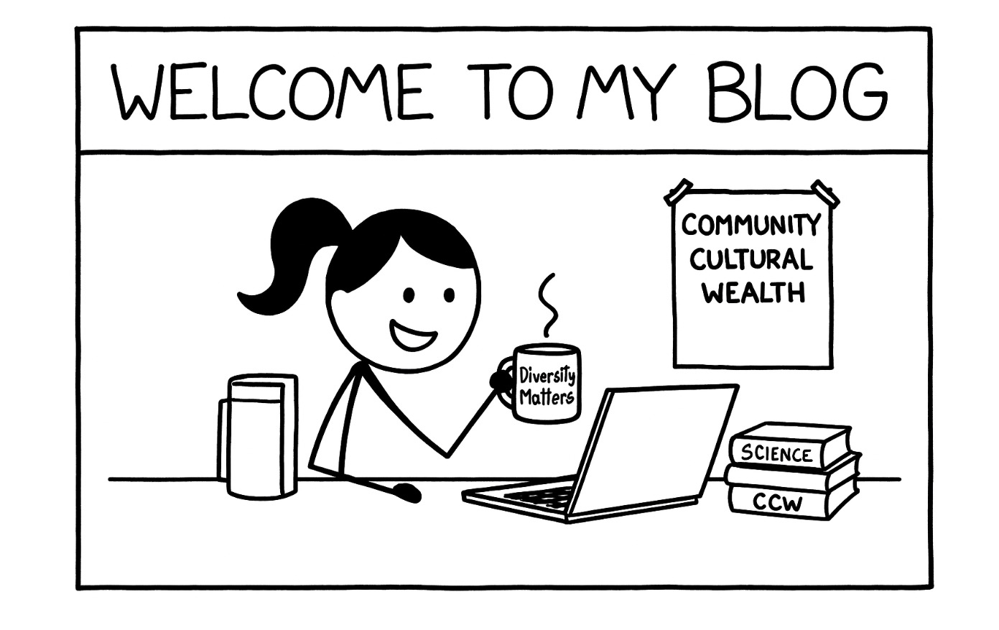

A space for sharing research and reflections.

 

**Welcome to my blog!**

This platform serves as a space for me to share reflections on my research journey, including theoretical insights, methodological explorations, and analytical code. I plan to update it periodically with content related to the topics I’m currently working on, the questions I’m grappling with, and the approaches I’m experimenting with in the field of educational and social science research. In addition to research-related content, I will also occasionally share curated reading lists and research reflections on selected academic articles.

You’ll find posts introducing conceptual frameworks, walkthroughs of data analysis in R, and brief commentaries on emerging methods in quantitative social science research. Some posts may be informal or exploratory which intended to spark dialogue rather than offer definitive answers.

All content on this blog is shared in the spirit of open academic exchange. If you notice any inaccuracies in methods, theoretical interpretations, or data approaches, I warmly welcome your comments and corrections. If you'd like to connect or discuss further, feel free to reach out via email [aishuhan@ucla.edu].

Thank you for visiting, and I hope you find something here that resonates with your own work or sparks new ideas.

Warmly,\
Alice

