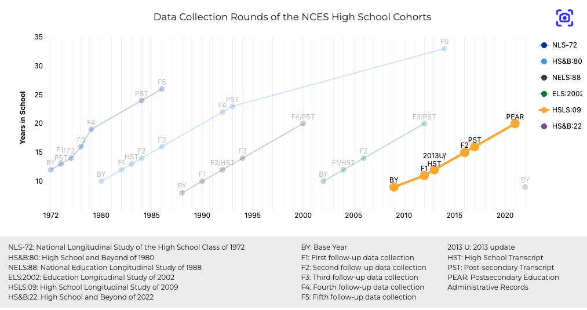

## 1. Overview of the HSLS:09 Dataset

In this class, we will utilize the public-use High School Longitudinal Study of 2009 (HSLS:09) as our practice demo. HSLS:09 is a nationally representative longitudinal study conducted by the National Center for Education Statistics (NCES) that follows a cohort of students from their freshman year of high school (9th grade) through their postsecondary education and early career trajectories. This national longitudinal dataset serves as an important resource for understanding educational pathways, academic development, and career transitions, especially in STEM fields. You can access more variable information from [NCES DataLab](https://nces.ed.gov/datalab/).

For this course, we have prepared two datasets derived from the HSLS:09 public-use data to facilitate the data analysis: (1) `hsls0913.rda`, and (2) `hsls0913_hw.rda`. For those who remain loyal to SPSS or Stata, we've also included CSV versions of both datasets.

### 1.1 hsls0913.rda

The first dataset, `hsls0913.rda`, contains a randomly selected sample of **2,000** cases from the full public HSLS:09 dataset, preserving all 6,608 original variables that contain survey information collected from three waves (BY, F1, 2013U). For those interested in using HSLS:09 as their final project dataset, you can access these data with the full dataset codebook named `HSLS09_13 Codebook.pdf`.

### 1.2 hsls0913_hw.rda

The second dataset, `hsls0913_hw.rda`, is a subset of 20 variables specifically selected for homework assignments. These variables span three time points of the study (9th grade variables start with "X1", 11th grade with "X2", and first year in college with "X3"). The dataset includes demographic indicators (student sex, race/ethnicity, parental education, and socioeconomic status), academic achievement measures (mathematics test scores from both base year and first follow-up), psychological constructs (math identity and self-efficacy scales), educational aspirations and expectations, course-taking patterns during 9th grade, and college outcomes including GPA and STEM major selection. We will leverage this dataset for homework assignments. You can access these 20 variables' codebook from `hsls0913_hw codebook.xlsx`. The detailed instructions for each homework will be posted in the assignment requirements.

::: {.callout-note}

As you may have already noticed, in this class we require each student to conduct an individual final project (if you want to work in a group, please inquire with Mark). You can use your current dataset if you're already working on one. For those who may have limited data access, we've prepared some available data search platform options and potential datasets you may explore.

:::

## 2. Data Search Platforms

### 2.1 [ICPSR Data from University of Michigan](https://www.icpsr.umich.edu/)

ICPSR (Inter-university Consortium for Political and Social Research) is one of the oldest social science data repositories, hosting over 16,000 datasets spanning education, political science, criminology, and more. The platform contains dedicated STEM and Child Care collections that are particularly useful for educational research. One of the ICPSR's strengths is that it provides bibliography pages for each dataset, showing you published papers that have used the data.

### 2.2 [Harvard Dataverse](https://dataverse.harvard.edu/)

Harvard Dataverse is an open-source repository that hosts data from researchers worldwide. With over 130,000 datasets and growing, the platform excels at preserving not just data but also code, documentation, and supplementary materials, making replication studies actually feasible.

### 2.3 [Kaggle](https://www.kaggle.com/datasets)

Kaggle is online data science community that hosts datasets, competitions, and collaborative projects. While traditionally known for machine learning competitions, Kaggle has an extensive education data collection perfect for those wanting to apply cutting-edge analytical techniques to educational problems. Many datasets come with notebooks showing analysis code in Python and R.

::: {.callout-note}

We also want to introduce some datasets that may be helpful for your final project. Please notice that access to some of these datasets (such as HERI data) introduced below may need additional coordination with your advisor. Before deciding to use these datasets for your final project, please consult your advisor to check availability.

:::

## 3. Dataset Showcase

### 3.1 [NCES Federal Level Datasets](https://nces.ed.gov/datalab/)

We're highlighting just three datasets here as appetizers, but the full data listed at NCES DataLab is extensive. Definitely worth exploring based on your research interests!

#### 3.1.1 [Baccalaureate and Beyond (B&B)](https://nces.ed.gov/surveys/b&b/)

B&B follows undergraduate seniors through their post-college journey, collecting data at graduation, then at one, four, and ten years out. This dataset is suit for exploring career trajectories, graduate school decisions, and student loan repayment patterns.

#### 3.1.2 [Beginning Postsecondary Students (BPS)](https://nces.ed.gov/surveys/bps/)

BPS captures the college experience from college entrance. It follows first-time students through their postsecondary journey with check-ins at one, three, and six years. It contains measures such as college experience, college persistence, transfer patterns, and degree completion.

#### 3.1.3 [Early Childhood Longitudinal Study: Birth Cohort (ECLS-B)](https://nces.ed.gov/ecls/)

Starting from birth, ECLS-B followed children born in 2001 through their earliest years, collecting data at 9 months, 2 years, 4 years, and kindergarten entry. This dataset lets you explore how early experiences shape kindergarten readiness and beyond.

### 3.2 Institutional Level Datasets

#### 3.2.1 [Integrated Postsecondary Education Data System (IPEDS)](https://nces.ed.gov/ipeds/use-the-data)

IPEDS is the census of higher education institutions (i.e., college, university, and technical school) that participates in federal financial aid programs reports data annually. With information on enrollment, graduation rates, finances, and faculty information, IPEDS is a source for institutional comparisons and trends analyses. 

#### 3.2.2 [HERI Surveys](https://heri.ucla.edu/overview-of-surveys/)

The Higher Education Research Institute at UCLA conducts six annual surveys that capture the college experience ecosystem: CIRP Freshman Survey, Your First College Year Survey, Diverse Learning Environments Survey, College Senior Survey, HERI Faculty Survey, and HERI Staff Climate Survey. UCLA ED&IS students have free access, but patience is required (dataset applications typically take 2-3 months for approval). Fun fact: ED 221 class may provide access to a complete TFS-CSS cohort dataset.

### 3.3 Classroom-Level Dataset

#### 3.3.1 [ASSISTments Data](https://www.etrialstestbed.org/data-sets)

Developed at Worcester Polytechnic Institute and offered as a free service, ASSISTments has generated rich datasets capturing student problem-solving processes, hint usage, and learning trajectories in K-12 mathematics. The available research datasets include clickstream data, allowing you to analyze not just whether students got the right answer, but how they got there.

