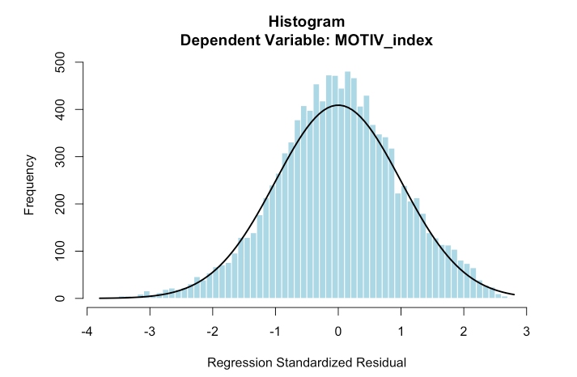

## 1. Study Introduction

Pinneo, L., & Nolen, A. (2024). Parent involvement and student academic motivation towards science in 9th grade. *Humanities and Social Sciences Communications*, 11(1), 1-12. <https://doi.org/10.1057/s41599-024-02707-0>

**Abstract:** Parents’ beliefs and behavior act as both explicit and implicit ways of communicating the value of science and their confidence that their child can be successful in science-related classes. Using the NCES High School Longitudinal Survey (HSLS:09), we examined how parent beliefs and behaviors regarding their 9th grader’s science education predicted the students’ motivation in science. Using multiple regression indicates that the combination of parental education, beliefs, and involvement in science-related activities with their child are weak but significant predictors of students’ academic motivation in science (adjR2 = 0.04, F(6, 14,933) = 26.32, P \< 0.001). In particular, parent education and parent involvement have positive and significant effects on students’ science identity and science self-efficacy. These findings suggest that students may have a stronger academic motivation in science with parents who have higher levels of education, more confidence in their ability to help their child in science, and who engage in more science activities with their child.

**Research questions:**

-   RQ1: How do parents' participation in their 9th grade child's academic science activities (both at home and at school) affect their child's academic motivation towards science?

-   RQ2: How do parents' beliefs about their own confidence in helping their 9th grade child with their science homework affect their child's academic motivation towards science?

**Sample and Method:** Using HSLS:09 base year, the data included 14,028 9th grade students.

The analysis for this project was conducted in two parts.

-   The first part includes the descriptive analysis for parent characteristics, beliefs, and behaviors. These variables were crosstabulated to further examine how parent beliefs and behaviors varied by parent education.

-   The second part of the analysis included a multiple linear regression to examine the combinations of factors that predict student science motivation. The description of the analysis also includes checking all assumptions for multiple regression analysis (i.e., multicollinearity, outliers, and homogeneity of variance).

**Variable Lists:**

*Independent Variables (Predictors):*

-   X1PAREDU: Parent education - highest level of education achieved by either parent
-   P1E04B/P1SCIHWEFF: Parent science efficacy - confidence in helping with 9th grade science homework
-   P1E05B/P1SCICOMP: Parent beliefs about gender - comparison of females' and males' abilities in science

*Parent behaviors composite (6 items, dummy-coded and summed, 0-6):*

-   P1E07A/P1MUSEUM: Visited science/engineering museum
-   P1E07B/P1COMPUTER: Worked/played on computer with student
-   P1E07C/P1FIXED: Built or fixed something with student
-   P1E07D/P1SCIFAIR: Attended school science fair
-   P1E07E/P1SCIPROJ: Helped with school science fair project
-   P1E07F/P1STEMDISC: Discussed STEM program or article

*Dependent Variables (Outcomes):*

-   X1SCIID: Student science identity
-   X1SCIUTI: Student science utility value
-   X1SCIEFF: Student science self-efficacy
-   X1SCIINT: Student science interest"

## 2. Set up packages and data

```{r, message=FALSE, warning=FALSE}
rm(list=ls())

library(tidyverse)
library(haven) 
library(psych)
library(car) #for VIF
library(lmtest)
library(table1)
library(stargazer) #for table presentation
library(lm.beta) #for standardized coefficients
library(ppcor)#for correlation calculation

load("/Users/aishuhan/Desktop/UCLA PhD/Dataset/HSLS 2009-2013 Public Use Data ICPSR_36423/DS0002 Student Level Data/36423-0002-Data.rda")

dt <- da36423.0002
remove(da36423.0002)

dt <- dt %>%
  dplyr::select(STU_ID, X1PAREDU, P1SCIHWEFF, P1SCICOMP, 
         P1MUSEUM, P1COMPUTER, P1FIXED, P1SCIFAIR, P1SCIPROJ, P1STEMDISC,
         X1SCIID, X1SCIUTI, X1SCIEFF, X1SCIINT)

#calculate proportion of missing data for each variables
colMeans(is.na(dt))
```

## 3. Descriptive Analysis

### Table 1 (a) Parent background, beliefs, and behaviors (HSLS:09 base-year)

```{r, message=FALSE, warning=FALSE}
#we used the data will NA here, the total count for the X1PAREDU should have missing
table1(~ factor(X1PAREDU) + factor(P1SCIHWEFF) + factor(P1SCICOMP), data=dt)

behavior_vars <- c("P1MUSEUM", "P1COMPUTER", "P1FIXED", "P1SCIFAIR", "P1SCIPROJ", "P1STEMDISC")

for(v in behavior_vars) {
  print(v)
  print(table(dt[[v]]))
  print(prop.table(table(dt[[v]])) * 100)
}
```

### Table 1 (b) Student academic motivation in science scaled scores (HSLS:09 Base year)

```{r, message=FALSE, warning=FALSE}
table1(~ X1SCIID + X1SCIUTI + X1SCIEFF + X1SCIINT, data=dt)
```

### Table 1 (c) Parents'/guardians' highest level of education and Their Confidence in helping with 9th grade science homework Crosstabulation

-   removed all the NA for P1SCIHWEFF and X1PAREDU, then proformed the cross tabulation
-   can use table1

```{r, message=FALSE, warning=FALSE}
dt_psscihw <- dt %>% filter(!is.na(P1SCIHWEFF) & !is.na(X1PAREDU))
table1(~ factor(X1PAREDU) | factor(P1SCIHWEFF), data = dt_psscihw)
```

### Table 1 (d) Parents'/guardians' highest level of education and Parents' beliefs about females' and males' abilities in science X Parent education

```{r, message=FALSE, warning=FALSE}
dt_pscic <- dt %>% filter(!is.na(P1SCICOMP) & !is.na(X1PAREDU))
table1(~ factor(X1PAREDU) | factor(P1SCICOMP), data = dt_pscic)
```

### Table 1 (e) Parent science – related behaviors X Parent education

```{r, message=FALSE, warning=FALSE}
dt_table1e <- dt %>% filter(!is.na(P1MUSEUM) & !is.na(X1PAREDU))
table1(~ factor(P1MUSEUM) + factor(P1COMPUTER) + factor(P1FIXED) + factor(P1SCIFAIR) + factor(P1SCIPROJ) + factor(P1STEMDISC) | factor(X1PAREDU), data = dt_table1e)
```

## 3. Multiple regression

### Create the MOTIV_index

```{r, message=FALSE, warning=FALSE}
#this paper do not mention how they create the MOTIV_index
#the most likely approach is use simple mean (then standardized)

dt <- dt %>% dplyr::mutate(MOTIV_index_raw = rowMeans(dplyr::select(., X1SCIID, X1SCIUTI, X1SCIEFF, X1SCIINT), na.rm = FALSE),
                    MOTIV_index = scale(MOTIV_index_raw)[,1])
dt %>%
  summarise(
    Mean = mean(MOTIV_index, na.rm = TRUE),
    SD = sd(MOTIV_index, na.rm = TRUE),
    Min = min(MOTIV_index, na.rm = TRUE),
    Max = max(MOTIV_index, na.rm = TRUE),
    N = sum(!is.na(MOTIV_index))
  )
```

### Table 2 Model Summary and Table 4 Model Coefficients

```{r}
dt_reg <- dt %>%
  dplyr::select(MOTIV_index, X1PAREDU, P1SCIHWEFF, P1SCICOMP, 
                P1MUSEUM, P1COMPUTER, P1FIXED, P1SCIFAIR, P1SCIPROJ, P1STEMDISC) %>%
  mutate(across(everything(), as.numeric)) %>%
  na.omit()

#model 1: parent education only
model1 <- lm(MOTIV_index ~ X1PAREDU, data = dt_reg)
#model 2: add parent beliefs
model2 <- lm(MOTIV_index ~ X1PAREDU + P1SCIHWEFF + P1SCICOMP, data = dt_reg)
#model 3: full model with parent behaviors
model3 <- lm(MOTIV_index ~ X1PAREDU + P1SCIHWEFF + P1SCICOMP + 
               P1MUSEUM + P1COMPUTER + P1FIXED + P1SCIFAIR + P1SCIPROJ + P1STEMDISC,
             data = dt_reg)

summary(model1)
summary(model2)
summary(model3)

vif(model2)
vif(model3)

stargazer(model1, model2, model3, type = "text", digits = 3)

#get the standared coefficient
summary(lm.beta(model1))
summary(lm.beta(model2))
summary(lm.beta(model3))
```

### Create Figure 2

```{r, message=FALSE, warning=FALSE}
hist(rstandard(model3), breaks = 70, col = "lightblue", border = "white",
     main = "Histogram\nDependent Variable: MOTIV_index",
     xlab = "Regression Standardized Residual", ylab = "Frequency")
curve(dnorm(x, mean(rstandard(model3)), sd(rstandard(model3))) * 
        length(rstandard(model3)) * diff(range(rstandard(model3)))/70, add = TRUE, lwd = 2)
```

### Create Figure 3

```{r, message=FALSE, warning=FALSE}
std_resid <- rstandard(model3)
std_pred <- scale(fitted(model3))[,1]

plot(std_pred, std_resid,
     main = "Scatterplot\nDependent Variable: MOTIV_index",
     xlab = "Regression Standardized Predicted Value",
     ylab = "Regression Standardized Residual",
     pch = 16, col = "steelblue",  cex = 0.5)    
abline(h = 0, col = "gray50", lty = 2)
grid(col = "gray90", lty = 1)
```

### Table 4 (Correlation Part)

-   Zero-order: simple correlation between predictor and outcome (ignoring other variables)
-   Partial: correlation between predictor and outcome, controlling for all other predictors
-   Part (semi-partial): correlation between predictor and outcome, removing the effect of other predictors from the predictor only

```{r, message=FALSE, warning=FALSE}
#model1
cor_dt1 <- dt %>% dplyr::select(MOTIV_index, X1PAREDU) %>% mutate(across(everything(), as.numeric)) %>% na.omit()
cor(cor_dt1$MOTIV_index, cor_dt1$X1PAREDU)

#model2
cor_dt2 <- dt %>% dplyr::select(MOTIV_index, X1PAREDU, P1SCIHWEFF, P1SCICOMP) %>% 
  mutate(across(everything(), as.numeric)) %>% na.omit()
zero_order2 <- cor(cor_dt2)[1, -1]
partial2 <- pcor(cor_dt2)$estimate[1, -1]
part2 <- spcor(cor_dt2)$estimate[1, -1]

data.frame(Variable = names(zero_order2), Zero_order = round(zero_order2, 3),
  Partial = round(partial2, 3),Part = round(part2, 3))

#model3
cor_dt3 <- dt %>% dplyr::select(MOTIV_index, X1PAREDU, P1SCIHWEFF, P1SCICOMP, 
                P1MUSEUM, P1COMPUTER, P1FIXED, P1SCIFAIR, P1SCIPROJ, P1STEMDISC) %>%
                mutate(across(everything(), as.numeric)) %>% na.omit()
zero_order3 <- cor(cor_dt3)[1, -1]
partial3 <- pcor(cor_dt3)$estimate[1, -1]
part3 <- spcor(cor_dt3)$estimate[1, -1]

data.frame(Variable = names(zero_order3), Zero_order = round(zero_order3, 3),
  Partial = round(partial3, 3), Part = round(part3, 3))
```

### Table 3 ANOVA test

```{r, message=FALSE, warning=FALSE}
anova(model1, model2, model3)
```

## 4. Brief Methodological Comments on Pinneo & Nolen (2024)

This replication study reveals several methodological ambiguity and concerns that, if addressed, would strengthen the paper's transparency and reproducibility:

1.  Sample Size Inconsistencies and Missing Data Handling The paper reports multiple sample sizes without clear justification:

    -   Initial sample: 24,600 9th graders (HSLS:09 base year)
    -   Analysis sample: 14,940 observations
    -   Final sample: 14,028 (after removing 7 outliers with \|std. residual\| \> 3)

However, the regression models show different sample sizes without approporate addressing missing values. The replication analysis in Model 3 contains 11,152 observations. The authors should explicitly state whether they used listwise deletion or imputed missing values, and report a single, stable sample size throughout all analyses.

2.  Construction of the Dependent Variable (MOTIV_index)

The paper states that X1SCIID, X1SCIUTI, X1SCIEFF, and X1SCIINT were "created through principal components factor analysis (weighted by W1STUDENT) and standardized to a mean of 0 and a standard deviation of 1" (p. 4). However, the paper does not explain how these four variables were combined into the MOTIV_index composite used as the dependent variable.

The histogram (Figure 2) shows MOTIV_index has mean ≈ 0 and SD = 1.000, suggesting either: (a) it's a simple mean of already-standardized components, or (b) it was re-standardized after averaging. This ambiguity limits replicability. The authors should could provide a procedure used to create MOTIV_index, including any weighting or standardization steps.

3.  Treatment of Ordinal Variables as Continuous

The regression models treat ordinal categorical variables (parent education levels, parent confidence levels, and gender belief ratings) as continuous numeric predictors without justification or sensitivity testing.

4.  Limited Effect Sizes and Practical Significance

While the paper emphasizes statistical significance (p \< 0.001), the effect sizes are notably small. The full model (Model 3) explains only 4% of variance in student science motivation (adjusted R² = 0.038). This raises questions about practical significance and the emphasis on parental factors when 96% of variance remains unexplained.
