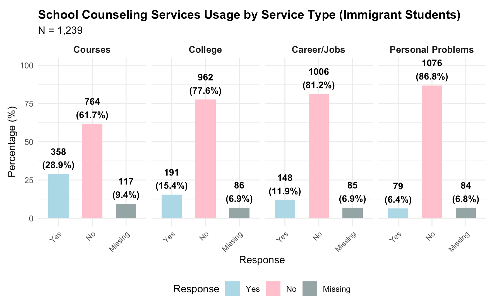

## 1. Study Introduction

Shi, Q. (2018). Immigrant versus Nonimmigrant 9th Graders' Use of School Counseling Services. *Journal of School Counseling*, 16(20). <https://files.eric.ed.gov/fulltext/EJ1191016.pdf>.

**Abstract:** This research investigated 9th-grade immigrant and nonimmigrant student use of school counseling services using the High School Longitudinal Study 2009 (HSLS:09). This study highlighted profiles of both immigrant and nonimmigrant 9th graders who see school counselors for various services and examined the impact of a series of variables (demographic, support services received, school belonging, and school engagement) on the use of school counseling services. Lastly, this research compared immigrant students with nonimmigrant students in their use of school counseling services. Implications for school counseling practice and future research are discussed.

**Research questions:**

- RQ1: What school counseling services do immigrant 9th graders use?  

- RQ2: What are the profiles of immigrant 9th graders who see school counselors for  various services?  

- RQ3: What is the impact of a series of variables (demographic, support services  received, school belongingness, and school engagement) on immigrant 9th  graders’ use of school counseling services?  

- RQ4: What are the significant differences between immigrant and nonimmigrant 9th  graders in their use of school counseling services and the predictors of their use?

**Sample and Method:**

Using: Public-used HSLS.

The participants in this study include both 9th grade immigrant students and  nonimmigrant students in the HSLS:09 data. Immigrant students have to meet the following criteria: (a) participated in the base  year of HSLS:09; (b) were born outside of the U.S. Nonimmigrant students were those who: (a) participated in the base year of HSLS:09; (b) were born in the U.S. or U.S.  territories. 

- Immigrant students: n = 1,239
- Nonimmigrant students: n = 1,459 (randomly selected 10% of original 14,560), our replication only have 1474 obs


**Variable Lists:**

*Demographic Variables:*

- P1USBORN9: (P1 B17 Whether student was born in the U.S.) immigrant and nonimmigrant 9th graders;
- X1SEX: gender (1 =  male; 2 = female);
- X1SES: SES (continuous composite variable that was calculated using  parents’ education, occupation, and family income);
- X1RACE: race/ethnicity (1 = White, 2 = Asian,  3 = Black, 4 = Hispanic, 5 = mixed); 
- S1LANG1ST: first language learned to speak (1 = English only, 2  = non-English language, 3 = English and non-English equally);
- P1USYR9: year student came to the U.S. to stay (recoded into “length staying in the U.S.”) - immigrant only;
- P1USGRADE: grade level 9th graders were placed in when started school in the U.S - immigrant only.

*ELL and Special Education Service Variables:*

- P1ELLNOW: (a) 9th grader’s current ELL status;
- P1SPECIALED: (b) whether 9th grader is  currently receiving special education services.

- X1SCHOOLBEL: School Belonging (scale variable);

*School Counseling Services Variables six binary (1 = yes  and 0 = no):*

- S1CNSLTALKM: (a) 9th grader talked to school counselor about 2009-2010 math courses;
- S1CNSLTALKS: (b) 9th grader talked to school counselor about 2009-2010 science courses; 
- S1CNSLTLKOTH: (c) 9th  grader talked to school counselor about 2009-2010 other courses; 
- S1CNSLTLKCLG: (d) 9th grader talked  to school counselor about going to college; 
- S1CNSLTLKJOB: (e) 9th grader talked to school counselor  about adult jobs/careers; 
- S1CNSLTLKPRB: (f) 9th grader talked to school counselor about personal  problems.
- (use (a)-(c) create a binary var represents "school counseling service about  coursework")

## 2. Set up packages and data

- p.24 "Third, this study used listwise deletion method to  handle missing data. Listwise deletion removes an entire record for a participant if any single value is missing for that person (Honaker & King, 2010)."
- the paper claimed use likewise deletion here, however, in the data replication process, I only found that the removed to NA values in the immigrant status.

```{r, message=FALSE, warning=FALSE}
rm(list=ls())

library(tidyverse)
library(broom)
library(lm.beta)
library(ppcor)
library(table1)

load("/Users/aishuhan/Desktop/UCLA PhD/Dataset/HSLS 2009-2013 Public Use Data ICPSR_36423/DS0002 Student Level Data/36423-0002-Data.rda")

dt <- da36423.0002
remove(da36423.0002)

data <- dt %>%
  dplyr::select(P1USBORN9, X1SEX, X1SES, X1RACE, X1ASIAN, X1WHITE, 
                S1LANG1ST, P1USYR9, P1USGRADE, P1ELLEVER, P1ELLNOW, P1SPECIALED, 
                X1SCHOOLBEL, S1CNSLTALKM, S1CNSLTALKS, S1CNSLTLKOTH, S1CNSLTLKCLG, S1CNSLTLKJOB, S1CNSLTLKPRB)


#P1USYR9; P1USGRADE; P1ELLNOW has missing rate of 0.946
colMeans(is.na(data))

table(data$P1USBORN9)
table(data$S1LANG1ST)
table(data$X1RACE)
table(data$S1CNSLTALKM)
summary(data$P1USYR9)

str(data)

data <- data %>%
  dplyr::mutate(
  
    immigrant = case_when(
      P1USBORN9 %in% c("(1) United States", "(2) Puerto Rico or another U.S. territory") ~ "Nonimmigrant",
      P1USBORN9 == "(3) Another country" ~ "Immigrant",
      TRUE ~ NA_character_
    ),
    
    ethnicity = case_when(
      X1RACE == "(8) White, non-Hispanic" ~ "White",
      X1RACE == "(2) Asian, non-Hispanic" ~ "Asian",
      X1RACE == "(3) Black/African-American, non-Hispanic" ~ "Black",
      X1RACE %in% c("(4) Hispanic, no race specified", "(5) Hispanic, race specified") ~ "Hispanic",
      X1RACE == "(6) More than one race, non-Hispanic" ~ "Mixed",
      X1RACE == "(1) Amer. Indian/Alaska Native, non-Hispanic" ~ "American Indian",
      X1RACE == "(7) Native Hawaiian/Pacific Islander, non-Hispanic" ~ "Native Hawaiian",
      TRUE ~ NA_character_
    ),

    first_lang = case_when(
      S1LANG1ST == "(1) English" ~ "English only",
      S1LANG1ST %in% c("(2) Spanish", "(3) Another language") ~ "Non-English",
      S1LANG1ST %in% c("(4) English and Spanish equally", "(5) English and another language equally") ~ "Both equally",
      TRUE ~ NA_character_
    ),
    
    years_us = case_when(
      immigrant == "Immigrant" & P1USYR9 > 0 & P1USYR9 <= 2009 ~ 2009 - as.numeric(P1USYR9),
       TRUE ~ NA_real_),
    
     talk_courses = case_when(
      S1CNSLTALKM == "(1) Yes" | S1CNSLTALKS == "(1) Yes" | S1CNSLTLKOTH == "(1) Yes" ~ "(1) Yes",
      S1CNSLTALKM == "(0) No" & S1CNSLTALKS == "(0) No" & S1CNSLTLKOTH == "(0) No" ~ "(0) No",
      TRUE ~ NA_character_
        )) %>%
    filter(!is.na(immigrant)) 


imm_data <- data %>% filter(immigrant == "Immigrant")
set.seed(42)
non_data <- data %>% filter(immigrant == "Nonimmigrant") %>% slice_sample(prop = 0.1)
```

## 3. Descriptive Analysis Table 1 and Table 2

```{r, message=FALSE, warning=FALSE}
table1(~ factor(X1SEX) + factor(ethnicity) + factor(first_lang) + factor(P1ELLEVER) + factor(P1ELLNOW) + factor(P1SPECIALED) + years_us + P1USGRADE, data = imm_data)

table1(~ factor(X1SEX) + factor(ethnicity) + factor(first_lang) + factor(P1ELLEVER) + factor(P1ELLNOW) + factor(P1SPECIALED) + years_us + P1USGRADE, data = non_data)

table1(~ factor(talk_courses) + factor(S1CNSLTLKCLG) + factor(S1CNSLTLKJOB) + factor(S1CNSLTLKPRB), data = imm_data)

table1(~ factor(talk_courses) + factor(S1CNSLTLKCLG) + factor(S1CNSLTLKJOB) + factor(S1CNSLTLKPRB), data = non_data)
```

## 4. Chi-square Test

- without any cross-tabulation

```{r chi-square, message=FALSE, warning=FALSE}
#Chi-square: Gender * Talk about courses
table1(~ imm_data$talk_course | X1SEX, data = imm_data)
gender_courses <- table(imm_data$X1SEX, imm_data$talk_course)
chisq.test(gender_courses)

#Chi-square: Race/ethnicity * Talk about courses (across race group)
table1(~ imm_data$talk_course | ethnicity, data = imm_data)
eth_courses <- table(imm_data$ethnicity, imm_data$talk_courses)
chisq.test(eth_courses)

#Chi-square: Race/ethnicity * Talk about courses (white-only group)
white_only <- imm_data %>% filter(ethnicity == "White")
eth_coursesw <- table(white_only$ethnicity, white_only$talk_courses)
chisq.test(eth_coursesw)

#Chi-square: Race/ethnicity * Talk about personal problem
table1(~ S1CNSLTLKPRB | ethnicity, data = imm_data)
eth_personal<- table(imm_data$ethnicity, imm_data$S1CNSLTLKPRB)
chisq.test(eth_personal)

#Chi-square: ELL status * Talk about personal problems
table1(~ S1CNSLTLKPRB | P1ELLNOW, data = imm_data %>% filter(P1ELLNOW == "(1) Yes"))
eth_ellpers <- table(imm_data$P1ELLNOW, imm_data$S1CNSLTLKPRB)
chisq.test(eth_ellpers)
```

## 3. Logistic Regressions

### Immigrant Student Population

- Concerns: the original paper used categorical variables as numeric variables.
- The ELL status is not clear whether its means current status (P1ELLNOW), or also include the previous status (P1ELLEVER). 
- Couldn't replicate their study results, I assume because the model default for the likewise deletion (806 observations deleted due to missingness). If so, the final analysis sample for the m1 is 433. 

```{r logit reg, message=FALSE, warning=FALSE}
#Model 1 Talk with school counselor about courses
imm_data <- imm_data %>% mutate(talk_courses_bin = ifelse(talk_courses == "(1) Yes", 1, 0),
                               talk_college_bin = ifelse(S1CNSLTLKCLG == "(1) Yes", 1, 0),
                               talk_job_bin = ifelse(S1CNSLTLKJOB == "(1) Yes", 1, 0),
                               talk_personal_bin = ifelse(S1CNSLTLKPRB == "(1) Yes", 1, 0),
                                ell_bin = ifelse(P1ELLNOW == "(1) Yes", 1, 0),
                                specied_bin = ifelse(P1SPECIALED  == "(1) Yes", 1, 0))


m1 <- glm(talk_courses_bin ~ X1SES + X1SEX + ethnicity + first_lang + years_us + 
            P1USGRADE + ell_bin + specied_bin + X1SCHOOLBEL, data = imm_data, family = binomial(link = "logit"))
summary(m1)
exp(coef(m1))     

m2 <- glm(talk_college_bin ~ X1SES + X1SEX + ethnicity + first_lang + years_us + 
            P1USGRADE + ell_bin + specied_bin + X1SCHOOLBEL, data = imm_data, family = binomial(link = "logit"))
summary(m2)
exp(coef(m2))     

m3 <- glm(talk_job_bin ~ X1SES + X1SEX + ethnicity + first_lang + years_us + 
            P1USGRADE + ell_bin + specied_bin + X1SCHOOLBEL, data = imm_data, family = binomial(link = "logit"))
summary(m3)
exp(coef(m3))     

m4 <- glm(specied_bin ~ X1SES + X1SEX + ethnicity + first_lang + years_us + 
            P1USGRADE + ell_bin + specied_bin + X1SCHOOLBEL, data = imm_data, family = binomial(link = "logit"))
summary(m4)
exp(coef(m4))     
```

## 4. Brief Methodoligical Comments on Shi,Q.(2018)

#### 1. Missing Data Handling

The paper states on page 24 that "this study used listwise deletion method to handle missing data. Listwise deletion removes an entire record for a participant if any single value is missing for that person (Honaker & King, 2010)." However, during the replication process, I found that missing data handling was inconsistent and not clearly documented:

- The explicit missing data removal appears to be filtering out cases with missing immigrant status `(!is.na(immigrant))`, so we can have a imm_data sample size of 1,239.
- The paper does not report how many cases were excluded due to missing data at each analysis stage.
- For the logistic regression models, R's glm() function automatically applies listwise deletion when encountering missing values, which results in substantial sample size reduction. For example, in Model 1 (immigrant students, courses outcome), approximately 806 observations were deleted due to missingness, reducing the analysis sample from 1,239 to approximately 433 cases.This 65% reduction in sample size is never mentioned in the paper, raising concerns about: whether the regression results are representative of the full immigrant sample and the actual statistical power of the analyses. This may be the reason why the results cannot be replicated.

#### 2. Chi-Square Test Presentation and Interpretation

**Lack of Cross-Tabulation**

The paper reports chi-square test results without presenting the cross-tabulations, making it difficult to interpret the direction and magnitude of associations. Presenting frequency tables alongside chi-square statistics would be helpful.

**Ambiguous Comparison Groups**

The chi-square interpretation is confusing and potentially misleading. For example, on page 14, the paper states: "White and Asian students were more likely to talk to school counselors about courses, X²(1) = 13.80, p < .01."

- With the df = 1, it appears to be a within race (such as white) comparison. If this is a pairwise comparison, which groups are being compared? White vs. non-White? Asian vs. non-Asian? White+Asian vs. others? 

**Replication: In my replication, I conducted both**

- Omnibus chi-square tests (e.g., Ethnicity * Talk about courses with df = 6) to test overall associations
- Pairwise comparisons when specific group (limited to White only) differences

Authors should explicitly state their comparison strategy (e.g., "White students were more likely to talk to counselors about courses compared to all non-White groups ..."). Post-hoc comparisons following significant omnibus tests should be clearly labeled and appropriately adjusted for multiple comparisons.

#### 3. Logistic Regression 

The original paper appears to have treated categorical variables (ethnicity, first language, gender) as numeric variables in the logistic regression models. This may lead to invalid statistical inferences and misleading interpreations. 

Moreover, as noted in the above missingness concerns, the regression models suffer from substantial missing data. For the immigrant student models:

- Starting sample: 1,239 immigrant students
- Analysis sample (Model 1): ~ 433 students (65% reduction)
- The paper never reports this reduction
- The experimental results cannot be reproduced


