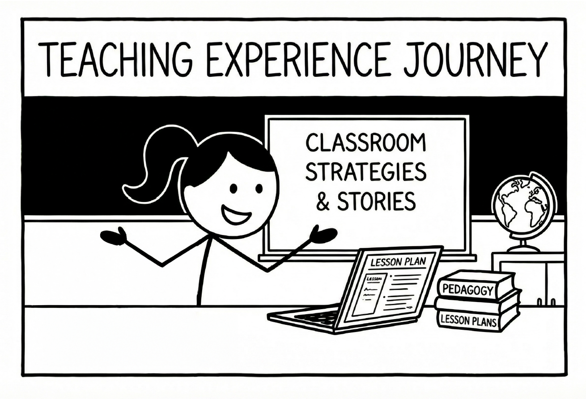

A space for sharing teaching experience and reflections.

 

**Welcome to My Teaching Portfolio**

Thank you for visiting this page. My teaching experience is grounded in UCLA School of Education's graduate-level quantitative methods sequence – the ED 230 series.

**About the ED 230 Series**

The ED 230 series originally consisted of three quarter-long courses spanning the academic year:

- ED 230A: Introduction to Research Design and Statistics
- ED 230B: Multiple Regression Analysis
- ED 230C: Linear Statistical Models in Social Science Research: Analysis of Designed Experiments

Beginning in Fall 2025, our department had a curricular restructure. The ED 230 series was reorganized into two courses:

- ED 230A: Linear Statistical Models Part 1 – Multiple Regression Analysis (combining the former 230A and 230B)
- ED 230B: Linear Statistical Models Part 2 – Analysis of Designed Experiments (formerly 230C)

The series covers essential topics including descriptive statistics, inferential statistics, analysis of categorical data, ANOVA, causal inference, validity threats, quasi-experimental and experimental design, and statistical power and precision.

**My Role in Course Development**

I was honored to contribute to this course reconstruction process, particularly in database selection and developing R analysis demonstration tutorials. The redesigned courses incorporate project-based learning, aiming to build a statistical foundation for first-year graduate students. Rather than relying solely on quizzes and examinations, we designed the course to help students launch their own academic research interests.

**Teaching Philosophy**

Throughout this journey, I will continue exploring effective pedagogical approaches to support students from diverse methodological backgrounds. I aim to employ scaffolded teaching strategies that foster students' science identity and science self-efficacy, two core traits consistently proven to spark interest and promote retention in scientific fields. My goal is to empower students to see themselves as capable researchers and valued contributors to the scientific community.

Warmly,\
Alice

